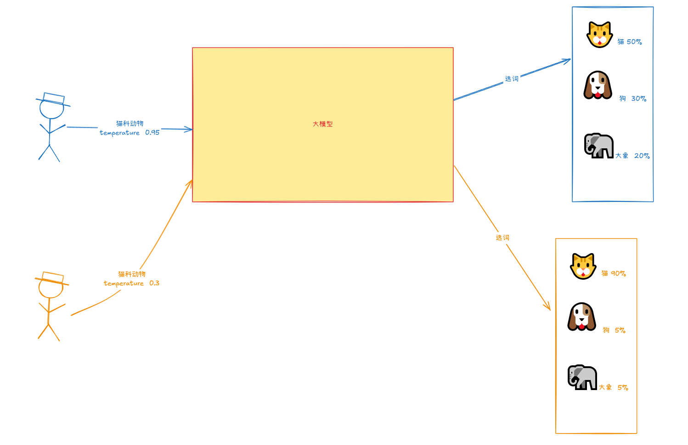
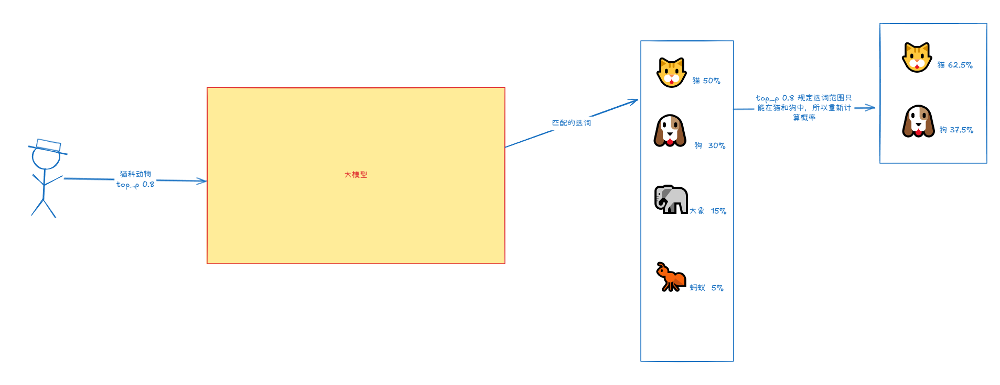
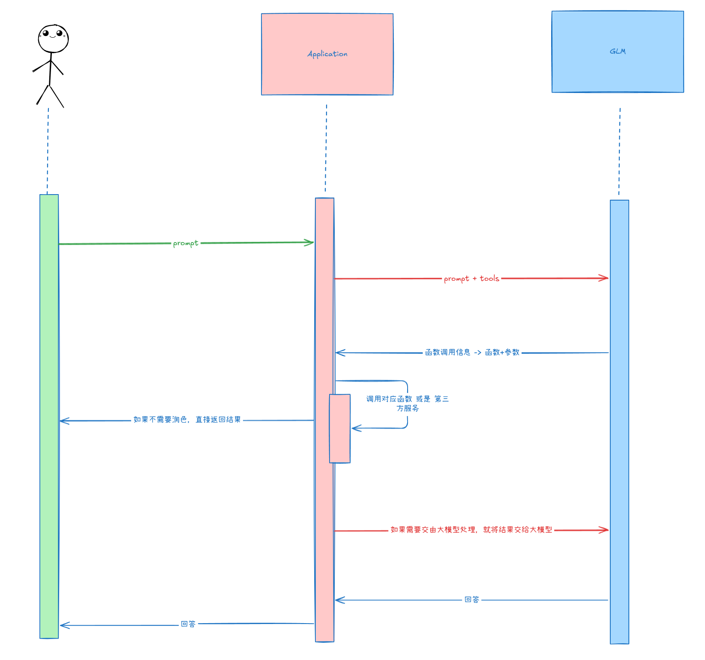
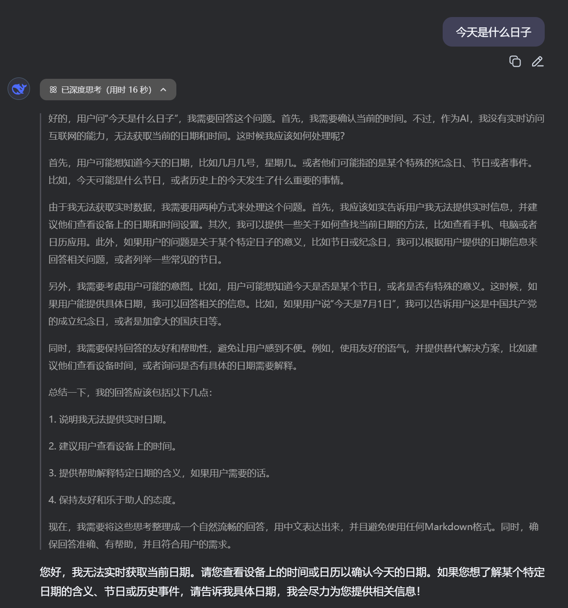

# GLM的介绍与在线调用

## 目录

- [注册申请](#注册申请)
- [API使用](#API使用)
  - [安装依赖](#安装依赖)
  - [在线调用](#在线调用)
    - [python版本](#python版本)
    - [java版本](#java版本)
    - [响应解析](#响应解析)
      - [token](#token)
      - [choice](#choice)
    - [入参解析](#入参解析)

到目前为止，各种各样的大模型是层出不穷了，其中广为人知的Deepseek，GPT，还有GLM，Claude，tongyi等等等等， 那么本章节主要是带领大家尝试在线调用一下这么些个大模型，其实论调用的话，大模型之间是大差不差的，概念都非常相似，所以该章节就尝试基于GLM大模型来在线调用调用\~

### 注册申请

[https://bigmodel.cn/console/overview](https://bigmodel.cn/console/overview "https://bigmodel.cn/console/overview")

首先注册智谱AI开放平台，GLM大模型对于新用户会有很多很多的token赠送，而且还有免费的模型可供我们使用，所以对于我们学习或者自己开发来说，GLM是个很好的选择喔\~

模型价格：[https://bigmodel.cn/pricing](https://bigmodel.cn/pricing "https://bigmodel.cn/pricing")

## API使用

[https://bigmodel.cn/dev/api/normal-model/glm-4](https://bigmodel.cn/dev/api/normal-model/glm-4 "https://bigmodel.cn/dev/api/normal-model/glm-4")

### 安装依赖

不管是Java还是python都需要先进行依赖安装，才能使用，对于Java项目来说，需要导入依赖

```xml 
<dependency>
    <groupId>cn.bigmodel.openapi</groupId>
    <artifactId>oapi-java-sdk</artifactId>
    <version>release-V4-2.3.2</version>
</dependency>
```


而对于python来说，也需要进行依赖安装

```python 
pip install zhipuai

##更新依赖

pip install --upgrade zhipuai


```


### 在线调用

查看API：[https://bigmodel.cn/usercenter/proj-mgmt/apikeys](https://bigmodel.cn/usercenter/proj-mgmt/apikeys "https://bigmodel.cn/usercenter/proj-mgmt/apikeys")

使用起来其实非常简单，直接拷贝代码使用即可，文档更是提供了代码示例，关键我们需要了解API的各项参数的含义，这对我们对大模型的优化是起到至关作用的，而且所有的大模型参数以及方法都基本上是一样的。

#### python版本

```python 
from zhipuai import ZhipuAI
# 基于我们提供的API Key构建客户端
client = ZhipuAI(api_key="你的API key") # 填写您自己的APIKey
# 基于客户端进行聊天
response = client.chat.completions.create(
    model="GLM-4-Flash",  # 填写需要调用的模型编码
    messages=[
        {"role": "user", "content": "1+1=几"}
    ],
)
print(response.choices[0].message)
```


#### java版本

```java 
/**
* 同步调用
*/
private static void testInvoke() {
   List<ChatMessage> messages = new ArrayList<>();
   //构建聊天信息
   ChatMessage chatMessage = new ChatMessage(ChatMessageRole.USER.value(), "1+1=几");
   messages.add(chatMessage);
   String requestId = String.format("YourRequestId-d%", System.currentTimeMillis());
   //发送请求
   ChatCompletionRequest chatCompletionRequest = ChatCompletionRequest.builder()
           .model(Constants.ModelChatGLM4)
           .stream(Boolean.FALSE)
           .invokeMethod(Constants.invokeMethod)
           .messages(messages)
           .requestId(requestId)
           .build();
   ModelApiResponse invokeModelApiResp = client.invokeModelApi(chatCompletionRequest);
   try {
       System.out.println("model output:" + mapper.writeValueAsString(invokeModelApiResp));
   } catch (JsonProcessingException e) {
       e.printStackTrace();
   }
}
```


#### 响应解析

当我们通过以上代码构建了客户端并发送消息至大模型后，大模型会返回一个response给我们，这个response实则也是一个对象，我们可以通过打印一下response看看其内含了什么内容，当然如果是Java的话，直接进入ModelApiResponse 对象就可以看到里面的内容了

```python 
Completion(
model='GLM-4-Flash', 
created=1744531111, 
choices=[CompletionChoice(index=0, finish_reason='stop', message=CompletionMessage(content='1+1 等于 2。', role='assistant', tool_calls=None))], 
request_id='', 
id='', 
usage=CompletionUsage(prompt_tokens=10, completion_tokens=12, total_tokens=22))

```


在以上的响应中，我们需要稍微关注usage描述的内容，这里面其实就是描述着我们的这次请求的token使用情况

##### token

那么什么是token呢？

在大语言模型中，token是文本的基本单位，因为我们跟模型聊天这中间其实并不是直接使用自然语言聊天的，模型其实是将我们的自然语言（输入的文本）拆分成一系列的token进行处理的，token是什么样的形式，具体取决于模型使用的分词方法。

在usage这个对象中，有着这次对话所使用的token情况

- completion\_tokens ： 表示生成的回答的token数量
- prompt\_tokens ： 表示输入给模型的prompt占用token数量，其实就是我们给的message.content所占用的token数量
- total\_token ： 指的是本次对话总共占用的token数量，是输入和输出的token之和

```bash 
usage=CompletionUsage(prompt_tokens=10, completion_tokens=12, total_tokens=22)
```


##### choice

在response中我们看到一个choices选项，其中里面包含的是一个个的CompletionChoice组成的列表，里面的message是一个类型为CompletionMessage的对象，其中content就是大模型针对此次对话的答案。

```python 
choices=[CompletionChoice(index=0, finish_reason='stop', message=CompletionMessage(content='1+1 等于 2。', role='assistant', tool_calls=None))], 

```


#### 入参解析

不管是Java还是python，我们都能够发现其需要我们填入两项重要参数

- model - 模型

  我们需要对接的大模型，python代码中我们直接指定的字符串GLM-4-Flash，而Java提供的SDK则是使用Constants.ModelChatGLM4
- message - 消息

  我们要发送的消息，我们要清楚大模型是一种语言模型，我们跟大模型就像聊天一样，所以message其实就是我们要发送给大模型的聊天语句

  不过我们看代码会发现，message实际上是一个对象，直接看Java可能没那么可观，需要进入ChatMessage进行查看，看python版本的话 ， 我们就能发现
  ```python 
  messages=[
          {"role": "user", "content": "1+1=几"}
      ]
  ```

  其中两个参数
  - role 表示消息的发送者，其中可以有user ， assistant ， system  ，tool
    - user ： 指的是我们用户
    - assistant ： 指的是大模型，这个我们可以关注一下response.choices中的message.role&#x20;
      ```python 
      choices=[CompletionChoice(index=0, 
      finish_reason='stop', 
      message=CompletionMessage(content='1+1 等于 2。', role='assistant', tool_calls=None))], 

      ```

    - system ：指的是系统参数，比如说 【请使用李白的语气进行对话】，那么大模型在整个对话周期内都会基于李白的语言跟我们对话的
      ```python 
          messages=[
              {"role": "system", "content": "请使用李白的语气与我对话"},
              {"role": "user", "content": "作一首描述现代科技昌盛的城市风光"}
          ]
      ```

    - tool：工具函数调用
  - content 我们聊天的内容
    不过为什么message需要是一个列表，其实是为了让大模型能够具备一个识别上下文的能力，所以采用的这种手段，即我们每次聊天都是往message中去追加内容，然后一次性将message扔给大模型，那大模型通过这个message列表就可以知道聊天历史记录了\~
  了解了这么些内容后，那我们就要清晰了，在开发过程中，如果想要让大模型能够识别上下文，我们必须要把我们之前发送的信息和大模型回答的内容合并一起交给大模型，这样大模型才能够识别上下文的，这也是大模型能够识别上下文的原理\~
  ```python 
  from zhipuai import ZhipuAI
  client = ZhipuAI(api_key="") # 填写您自己的APIKey

  # 定义系统配置
  system_message =  {"role": "system", "content": "请使用李白的语气与我对话"}

  messages = [
      system_message,
  ]

  # 添加用户消息
  messages.append({"role": "user", "content": "请给我讲一个笑话"})

  response = client.chat.completions.create(
      model="GLM-4-Flash",  # 填写需要调用的模型编码
      messages=messages
  )

  # 往message内添加模型的回复，下一次会把message也发送至大模型，大模型便具备了识别上下文的能力了
  messages.append({"role": "assistant", "content": response.choices[0].message.content})


  print(response.choices[0].message.content)
  ```


当然除了以上这些参数，还有一些我们可能会用到的可选参数

- do\_sample 是否启用采用策略
- temperature 和 top\_p 调节生成文本的随机性和多样性 （重要）
  - temperature &#x20;

    类型：Float ， 取值范围可以是\[0.0 , 1.0 ] ,默认为 0.95&#x20;

    作用：控制输出的随机性，温度越接近1.0，就会使得输出越具备创意性和多样性，温度越接近0.0，则会使得输出更集中更确定。

    其实大模型的本质就是将我们的语言通过各自的规则进行拆分，然后将拆分后的语言进行匹配，如果我们给的temperature  越接近1.0，那么就允许匹配选词的结果就能够稍微偏一点，如果越接近0.0 ，那么就允许匹配选词的结果能够更加准确一点。

    所以对于客服模型来说，我们可以稍微拔高一点temperature  ，而对于技术文档这种严谨性比较高的我们就可以降低一点temperature  参数了

    
  - top\_p top\_p的话，他需要将do\_sample 参数设置为true的，而且top\_p和temperature  两者有时候搭配使用会使得大模型输出的结果技能保留既定的准确性也能拥有一点的创意性的\~

    类型： Float ， 取值范围为\[0.0 ， 1.0 ]

    作用：top\_p 和 temperature  虽然都是控制选词的概率，但是两者的处理是不一样的，temperature  是通过控制生成选词的概率分布，比如说**猫（90%）、狗（9%）、其他（1%）**，而top\_p则通过动态裁定选词来控制选词的概率的，比如说，大模型选了**猫（50%）、狗（30%）、象（15%）、蚂蚁（5%）**，如果我们设置了top\_p为0.8 ， 那么猫和狗的概率达到了0.8 ，象和蚂蚁就不在是选词的范围内了。选词的范围就在猫和狗两个词当中进行选择，此时概率会重新计算，会算得猫（50% / 80% = 62.5%） ， 狗（30% / 80% = 37.5%）&#x20;

    
- stop 定义生成过程的终止条件
- max\_tokens 限制生成文本的长度

  可以用来控制输出成本，比如说如果我们只需要大模型回复单个选项（A、B、C），这样就让大模型直接回复选项就行，就没必要回复其他的内容了，这样便能节省token的成本，毕竟都是💴钱呐\~
- stream 控制是否以流式的方式接收生成的文本 （重要）

  为了提高用户体验度，可以将stream设为true从而能够实现打字机的效果而不是等大模型出结果再进行输出
  ```python 
  from zhipuai import ZhipuAI
  client = ZhipuAI(api_key="") # 填写您自己的APIKey

  # 定义系统配置
  system_message =  {"role": "system", "content": "请使用李白的语气与我对话"}

  messages = [
      system_message,
  ]

  # 添加用户信息
  messages.append({"role": "user", "content": "请给我讲一个笑话"})

  response = client.chat.completions.create(
      model="GLM-4-Flash",  # 填写需要调用的模型编码
      messages=messages,
      stream=True # 开启stream流式响应
  )


  # 输出流式结果
  for chunk in response:
      if chunk.choices[0].delta.content:
          print(chunk.choices[0].delta.content, end="")
  ```

- tools , tool\_choice 配置模型可以调用的外部工具或函数

  tools的意思是工具，其实就是让大模型知道我们拥有哪些工具库，比如说函数等，说白了，我们要将我们系统或者第三方提供的API告知大模型，其目的就在于我们可以通过自然语言来进行函数调用，但是需要注意的是，并不是大模型去调用，大模型可不具备这样的功能哈，大模型只能告知我们需要调用什么函数，参数是怎么样的，调用函数的事情是应用程序来完成的。

  

  首先我们要清楚大模型的两大缺陷：
  1. 并非知晓一切
     1. 训练数据不可能什么都有
     2. 不知道最新信息，大模型的训练周期很长，更新一次耗资巨大，存在越训越傻的风险
        1. GPT - 3.5 知识截至2021年9月
        2. GPT - 4 - turbo 知识截至2023年12月
        3. GPT - 4o - mini 知识截至2023年10月
        4. GPT - 4o 知识截至2023年10月
  2. 没有【真逻辑】（这是我们为什么需要tools的原因），他表现出的逻辑，推理都是训练文本的统计规律，而不是真正的逻辑，所以大模型存在幻觉&#x20;
  > Function Calling ： 大模型需要连接真实世界，并对接真逻辑系统执行确定性任务
  > 既然大模型基于的都是训练过的数据来进行思考与回答的，所以对于一些实时性的问题，比如：【今天是什么日子？】
  

  大模型是完全无从得知，这就需要我们给大模型武装武装其大脑了🧠，怎么做呢？其实就是让大模型去推断应该调用我们提供的什么参数来获取结果集，这段话怎么理解呢？整个流程可以是这样的

  我问【今天是什么日子？】

  大模型推理【需要先调用函数\[getToday]】

  应用程序【调用getToday】结果喂给大模型  （如果无需对结果进行润色，那到这里便能结束了，因为到这里就能得到函数结果了）

  大模型拿到结果进一步推理给出答案

  如何让大模型调用我们配置函数呢？其实跟我们自己调用的方式是一样的，就是告诉大模型我们的应用或者说可以调用的应用接口都有哪些，我们要描述清楚，描述的格式可以是json或者yml，比如说以下的格式
  ```python 
  #定义大模型的函数调用
  tools = [
      {
          "type" : "function",
          "function" : { # 函数信息配置
              "name " : "getDate",
              "description" : "获取以今天为准偏移后的日期",
              "parameters" : {
                  "type" : "object",
                  "properties" : { # 参数项
                      "offset" : {
                          "type" : "string",
                          "description" : "偏移量"
                      }
                  },
                  "required" : ["offset"] # 必填项
              }
          }

      }
  ]

  messages = [
  ]

  # 添加用户信息
  messages.append({"role": "user", "content": "获取今天的时间"})

  response = client.chat.completions.create(
      model="GLM-4-Flash",  # 填写需要调用的模型编码
      messages=messages,
      tools=tools
  )


  print(response)


  # response 结果
  Completion(
  model='GLM-4-Flash', 
  created=1745125654, 
  choices=[
    CompletionChoice(index=0, finish_reason='tool_calls', 
    message=CompletionMessage(content=None, role='assistant', 
    tool_calls=[
      CompletionMessageToolCall(id='call_-8781449140955053157', 
        function=Function(arguments='{"offset": 0}', name='getDate'), 
        type='function', index=0)]))], request_id='20250420130733c19c2a6e1d8e46de', 
        id='20250420130733c19c2a6e1d8e46de', 
        usage=CompletionUsage(prompt_tokens=141, completion_tokens=9, total_tokens=150))


  ```

  观察以上代码得出的response，显然大模型理解了我提出的问题【获取今天的时间】，并调用了tools中我提供的函数getDate，观察response中的tool\_calls，这当中就包含了大模型需要我们调用的函数。

  所以我们完全可以基于tool\_calls来判断我们是否需要调用函数
  ```python 
  # 如果返回的是参数调用结果
  if(response.choices[0].message.tool_calls is not None):
      tool_call = response.choices[0].message.tool_calls[0]
      if(tool_call.function.name == "getDate"):
          args = tool_call.function.arguments
          # 应用程序调用函数，获取结果
          date = getDate(0)
          print(date) # 结果 {'date': '2025/4/19'}
          # 如果需要将结果交给大模型处理，则包装一个信息交给大模型,但是这里的role要注意
          # 需要更换成tool了，为了告诉大模型这是函数调用的结果
          messages.append({
              "tool_call_id" : tool_call.id,
              "role" : "tool",
              "name" : tool_call.function.name,
              "content" : json.dumps(date)
          })

          print(messages)
          response2 = client.chat.completions.create(
              model="GLM-4-Flash",
              messages=messages,
              tools=tools
          )

          print(response2.choices[0].message.content) #结果 ：根据您的查询，我已经调用了名为getDate的API来获取今天的时间。根据API的返回结果，今天是2025年4月19日。


  ```

  通过这样，我们就能通过大模型来完成函数调用，对接真逻辑世界了\~，但是有一点我们需要清楚的是，我们是让大模型理解我们输入的语言从而得到调用函数的方案，所以仍然会存在大模型给出错误答案的机会的，这就取决于大模型的理解能力了。

  注意：tool\_call是一个数组，这意味着，大模型可以为我们回应一连串的函数调用，即可以多函数调用。
- user\_id 提供一个唯一标识符以代表最终用户，增强安全性和监控能力
