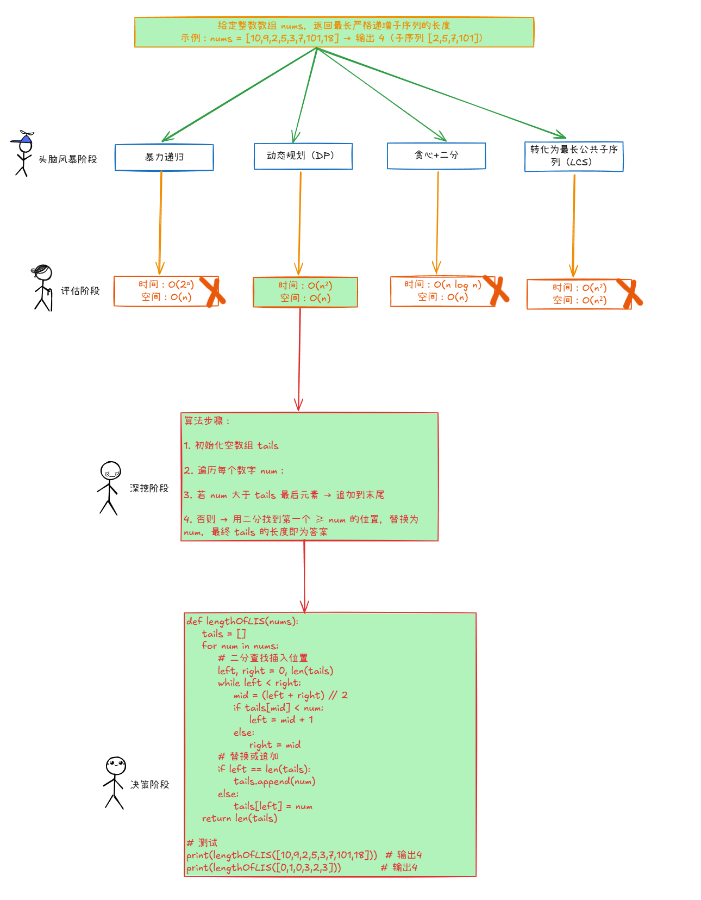

# Prompt提示词书写技巧

## 目录

- [Prompt的书写技巧](#Prompt的书写技巧)
  - [常规写法](#常规写法)
  - [零样本-零样本思维链](#零样本-零样本思维链)
  - [少样本](#少样本)
    - [思维树写法](#思维树写法)
      - [测试Prompt](#测试Prompt)

我们平时跟产品经理聊天的时候，要是我们能够抓住重点，对产品经历提问的时候，能够表达清楚，有正例反例，那对于我们开发来说绝对是一件事半功倍的事情，我们人与人之间的聊天都这么讲究方法方式，更何况跟AI呢？

Prompt正是我们跟AI聊天的话述，其实就是我们跟大模型聊天时输入的那段文本，他可以是一段描述，一个问题，一句话，甚至可以是一个篇幅很长的文案，可想而知，如果我们掌握住Prompt的使用方法方式，那大模型定能成事！

> 在LLM（Large Language Models，大型语言模型）领域，Prompt通常指的是输入给模型的一段文本，用于引导模型生成相关的输出。这段文本可以是一个问题、一段描述、一个指令或者任何形式的输入，目的是激发模型产生符合预期的回答或文本。

也正因为Prompt的重要性，所以现在才会有Prompt Engineering（提示词工程）这么一个职业出来\~

### Prompt的书写技巧

##### 常规写法

1. 主题明确，内容充实
2. 可以使用···或者###来将重点内容分隔开，比如说，假设说没有###分割，那这段文本会让AI产生歧义，可能会输出错误的结果

   帮我翻译下面这段文本，###尽量让文本更加规范###
3. 充分利用角色扮演

   给大模型一个脚本，一个角色，这相当于给大模型一个选择的范围，令大模型的解决能够更加精确，想想大模型他本身是一个清华高考生，虽然很聪明，但是领域不精呀\~，但是如果你给他一个角色那他将会是某个专业的清华高材生了喔，那在这专业领域里，他自然比一个清华高考生要更强大嘛\~

   那怎么给大模型指定角色呢？其实很简单，告诉他他是谁就行了，比如说
   - 你现在是一个专业且全能的健身教练，你在健身的饮食营养上有着多年的实战和深究，深知每种身材状况的最佳营养搭配
   - 你是一个优秀的英语讲师，到目前为止你已经为学校培育了许许多多的翻译界的精英了，你有着一套非常逻辑鲜明的学习计划，能让我们轻松提高英语成绩。
     从以上两句提示词中，我们抓取关键词，专业，全能，健身教练，营养饮食，最佳营养搭配，瞧，其实大模型也是这么来进行关键词抓取的，通过这类型的关键词，大模型能够更加清晰他需要在哪方面为我们提供帮助
4. 学会结构化自己的Prompt

   想想，为什么会有程序，不就是让我们跟机器交流的语言结构化嘛？我们通过一定的规则来规定我们是如何编写代码的，这样才能让机器能够读懂我们的意图，大模型就是一台台的机器，所以如果我们能够结构化自己的Prompt，那对于机器来说是不是能够对我们的意图更加清晰呢？

   如何结构化Prompt呢？最核心的四要素
   1. 指令

      想要大模型执行的任务或者指令，说白就是我们要大模型做啥，比如说总结，生成代码，翻译，解释，编写，调用等等这一系列动词
   2. 背景

      上下文，给大模型一个上下文，这其实就是我们说到的角色扮演，比如说，我是一个Java程序员，你是一个有着十年架构经验的高级架构师等
   3. 输入

      用户输入的内容，就是我们要喂给大模型些什么，比如说按照我提供的以下文本###锄禾日当午###
   4. 输出

      令大模型输出的格式，比如说不下于1000字，json格式，markdown格式，html格式，Vue3 Composition API代码
5. 懂得让大模型利用规则来生成内容

   要永远记住AI只是我们的工具，在让AI帮助我们工作的时候，我们必须要凌驾于AI之上，比如想让AI帮你编程，那你必须得全面了解编程，至少你需要有正确的是非观，你要知道如何在AI之上做优化，或者让指导AI优化，这样我认为才是AI的最佳实践！

   那么现在笔者就列举几个原则，可以让AI生成更加丰富的内容，简单来说就是我们可以通过某些指令来提高AI的内容生成的质量
   1. 费曼学习法

      要求能够以简单易懂的方式来解释学习的内容

      Prompt：请借助费曼学习法，以简单的语言解释【特定概念】是什么，并提供一个例子来说明它可以如何应用
   2. 8-2原则

      这个法则表明80%的效果往往来自于20%的努力

      这意味着我们更加应该集中精力在最重要，最具挑战性的20%的内容上

      Prompt：将【主题或技能】最具挑战性的20%的核心汇总，以涵盖80%的内容，并提供一个专注于掌握这些内容的学习计划
   3. 番茄工作法

      一种时间管理方法，并通过设定25分钟的工作时间和5分钟的休息时间，来提高效率并减少疲劳，一般可以令AI生成计划类的内容，比如说学习计划

      Prompt：结合番茄学习法，帮我安排一个由浅入深的学习计划，这次学习的主题是【你的主题】
   4. SQ3R方法

      这是一种阅读理解和学习的方法，包括五个步骤：Survey（预习），Question（提问），Read（阅读），Recite（复述），Review（回顾）

      Prompt：我正在学习【某个知识、技能】，请结合SQ3R方法，整理成表格，以帮我快速掌握这个知识
   5. 艾宾浩斯遗忘曲线

      强调如果我们定期复习，可以提高我们的记忆，不断地回顾和强化信息，可以帮助我们避免遗忘。也可以基于这个理论令AI生成计划类的内容

      Prompt：我最近在学习【某个知识、技能】，请结合艾宾浩斯遗忘曲线帮我制定学习计划，让我能够更长时间掌握这个技能
   6. 双编码

      该理论认为同时使用文字和视觉信息（图表，图像或者地图）可以提高记忆和理解

      Prompt：结合双编码理论，同时使用文字和视觉信息帮我快速学习，记忆【某个知识、技能】

##### 零样本-零样本思维链

谁是谁的爹呀，你是我的爹呀😮，这个游戏都有玩过吧？这就是大脑一时转不过来导致的，其实大模型也是一样的，当我们没有样本喂给大模型而又需要大模型给我们一个响应的时候，比如说，树上一个猴，树下一个猴，一共多少猴？大模型：3个猴，回答出来3个猴，其实也是因为大模型脑子抽了，所以说，大模型是玩不好快问快答的，那么如何解决这个问题呢？？

很简单，就是让大模型一步一步分析，不用那么急着回答，这样大模型就能发挥他非常强大的推理能力了。总结下来就是我们一定要清楚大模型的能力在于推理！

#### 少样本

我们人类为什么如此强大，那是因为我们从小就接受教育，一直在知识的海洋里翱翔😀，同理，大模型想要强大，零样本是不够的，我们必须要喂他些样本数据，让他能从中掌握到规律。这也是大模型的最大优势。

比如说，Prompt：用一句话描述大象的例子是：大型食草哺乳动物，性情温和，群居生活，分布于亚洲和非洲。接下来请用一句话描述老虎

在这个Prompt种，大型食草哺乳动物，性情温和，群居生活，分布于亚洲和非洲。就是数据样本，大模型会从中发现规律并给我们一个正确的反馈。

##### 思维树写法

何为思维树呢？我们可以以我们大脑的思维方式作为理解基础，当我们遇到一个算法题的时候，我们率先会进入一场头脑风暴，这个时候无限的想法都会涌入到我们的脑袋里面，我们会有N种解法，在这N种解法里面，我们会做评估，会在性能和空间两者做一个衡量和定夺，这就是评估阶段，我们做好了定夺以后，就会对该算法进行进一步的优化构思，这就是深挖阶段，最后实施把自认为的最优实践写出来，这就是决策阶段，其实大模型也是一样的，只不过目前仍需我们监督辅导他进入这几个阶段。

可以观察观察以下图片来加深我们的理解，通过这么一个思维流程，说实在话，别说大模型了，我们自己采用这套思考方式，正确率都能蹭蹭往上涨\~



所以说传说中可以让正确率可以从4%到75%的思维树模式可不是空穴来风，而思维树模式一共可分为4个阶段

1. 头脑风暴阶段
2. 评估阶段
3. 深挖阶段
4. 决策阶段

###### 测试Prompt

这四个阶段是需要我们引导大模型去走的，所以我们直接来看看可以如何去引导大模型的思考模式

Prompt ：&#x20;

1. 头脑风暴

   请针对问题【给定一个未排序的整数数组，找到最长严格递增子序列的长度  】列举所有可能的解法（包括暴力解、常见算法、非常规思路等），并简要说明每个解法的核心逻辑。无需考虑时间或空间复杂度，只需穷举所有已知或设想的解法方向。
2. 评估阶段

   请基于以下解法列表，从时间/空间复杂度、实现难度、可扩展性三个维度进行对比评估，并给出量化评分（1-5分，5为最优）。最后推荐1-2个优先考虑的解法： &#x20;

   解法列表： &#x20;
   1. \[解法1描述] &#x20;
   2. \[解法2描述] &#x20;
      ... &#x20;
   评估要求： &#x20;
   - 用表格呈现对比结果 &#x20;
   - 明确说明推荐理由 &#x20;
   - 指出各解法适用的数据规模范围
3. 深挖阶段

   请针对选定的【解法名称】，完成以下深度分析： &#x20;
   1. 形式化定义算法的关键变量与状态转移逻辑 &#x20;
   2. 给出正确性证明的数学推导（归纳法/反证法等） &#x20;
   3. 分析边界条件与异常处理方案 &#x20;
   4. 提出至少两种可能的优化方向（数据结构替换/剪枝策略等） &#x20;
      要求： &#x20;
   - 使用伪代码或数学符号辅助说明 &#x20;
   - 包含反例测试案例验证逻辑正确性
4. 决策阶段

   请将【解法名称】转化为可执行的代码，要求： &#x20;
   1. 实现语言：\[指定语言] &#x20;
   2. 包含以下测试案例： &#x20;
      - 标准案例（如\[10,9,2,5,3,7,101,18]） &#x20;
      - 全递增序列 &#x20;
      - 全递减序列 &#x20;
      - 含重复元素的序列 &#x20;
   3. 添加关键步骤的中文注释 &#x20;
   4. 验证代码在时间/空间复杂度上的理论值与实际运行表现的关联性

当然组合起来可以是这样的

```text 
你是一个算法专家，请按以下步骤解决「最长递增子序列」问题：

1️⃣ **头脑风暴**  
{{ 插入阶段1 Prompt }}

2️⃣ **方案评估**  
{{ 插入阶段2 Prompt }}

3️⃣ **深度优化**  
{{ 插入阶段3 Prompt }}

4️⃣ **最终实现**  
{{ 插入阶段4 Prompt }}
```
