# 细嗦RAG

## 目录

- [工作流程](#工作流程)
  - [一 、文档收集和切割](#一-文档收集和切割)
  - [二、向量转换和存储](#二向量转换和存储)
  - [三、文档过滤和检索](#三文档过滤和检索)
  - [四、查询增强和关联](#四查询增强和关联)
- [实现 - Java版](#实现---Java版)
  - [基于Spring AI整合RAG](#基于Spring-AI整合RAG)
    - [文档收集和切割](#文档收集和切割)
      - [文档准备与文档整理](#文档准备与文档整理)
      - [文档ETL](#文档ETL)
      - [DocumentReader](#DocumentReader)
    - [向量转换和存储](#向量转换和存储)
    - [查询增强和关联](#查询增强和关联)
  - [整合云知识库](#整合云知识库)
    - [文档收集](#文档收集)
    - [创建云知识库](#创建云知识库)
      - [数据类型](#数据类型)
        - [知识库的匹配模式](#知识库的匹配模式)
    - [选择数据](#选择数据)
    - [数据处理](#数据处理)
      - [metadata抽取](#metadata抽取)
      - [文档切分chunk](#文档切分chunk)
    - [基于Spring AI Alibaba 整合云知识库](#基于Spring-AI-Alibaba-整合云知识库)
- [RAG的最佳实践与调优](#RAG的最佳实践与调优)
  - [文档收集与分割](#文档收集与分割)
    - [原文档](#原文档)
    - [文档切片](#文档切片)
    - [元数据的标注](#元数据的标注)
  - [向量转换和存储](#向量转换和存储)
  - [文档过滤和检索](#文档过滤和检索)
    - [多查询拓展](#多查询拓展)
    - [查询重写和翻译](#查询重写和翻译)

RAG-检索增强生成，无非是通过检索的方法来增强生成模型的能力，为什么需要这么个东东呢？我们讲过，大模型中所训练的庞大数据量可以说是历史数据，所以我们要让大模型连接真实世界，GLM的时候我们讲过Function Calling，而RAG也是让大模型连接真实世界的方式喔\~，说白了就是我们自己喂大模型数据，这么些数据就叫知识库，这些知识库可以是文档的形式，也可以是数据库的形式。说白了，就是将我们的笔记交给AI，让AI能够在回答问题前能够结合我们提供的笔记来回答，从而减少大模型的知识时效性限制和幻觉问题。

## 工作流程

综合RAG增强搜索最为典型的工作流程如下：

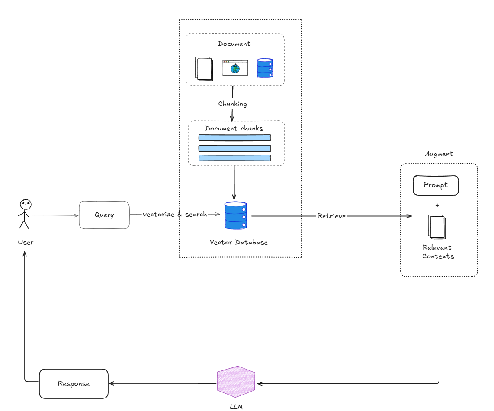

对于RAG技术的实现可以分为5个步骤，当然对于我们来说需要完成前4步即可

1. 最开始，我们会将文档（知识库）收集起来并进行切割
2. 将文档信息向量化并存储到数据库（向量数据库）中
3. 当我们发起请求时，会进行文档过滤和数据检索
4. 找到对应的相似的数据后会连同提前设置好的Prompt一起发给大模型
5. 大模型综合答案后响应我们

接下来我们就针对前4个步骤展开来说说

### 一 、文档收集和切割

知识库，知识库那肯定是我们要先提供对应的知识库文档嘛\~，而文档收集和切割就是由步骤图中的这一部分体现的，Document就是我们提供的文档抽象（因为在Spring AI中都会转为Document对象的），所以交出的文档可以是多种类型的，可以是PDF，WORD，数据库甚至是网站爬取下来的内容都可以作为知识库。

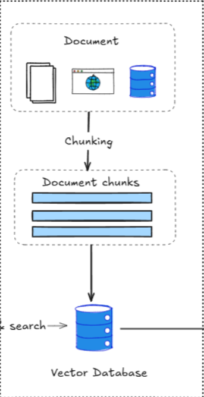

想想，如果我们每个知识库都是以全文的形式存储在数据库中的话，那如何定位我们想要的内容呢？要清楚，RAG不是让大模型去读这么些知识库，而是我们要根据我们的提示去知识库中挑合适的内容喂给大模型，让大模型结合我们提供的知识来分析回答的。所以我们需要将知识库进行拆分，当我们匹配到合适的内容的时候，取出对应的切片交给大模型分析就行了。

当然切片的方式有很多种：

1. 固定大小，比如每隔512个token进行一次切割
2. 语义边界，即根据段落，章节进行拆分
3. 特殊符号，比如说句号，逗号等

多提一句，想要让知识库能够拆分得更加合理，更加便于我们搜索，比较好的做法是让文章具有更强的结构性，比如markdown，html这些结构性强的文档往往拆分出来的效果会更好。

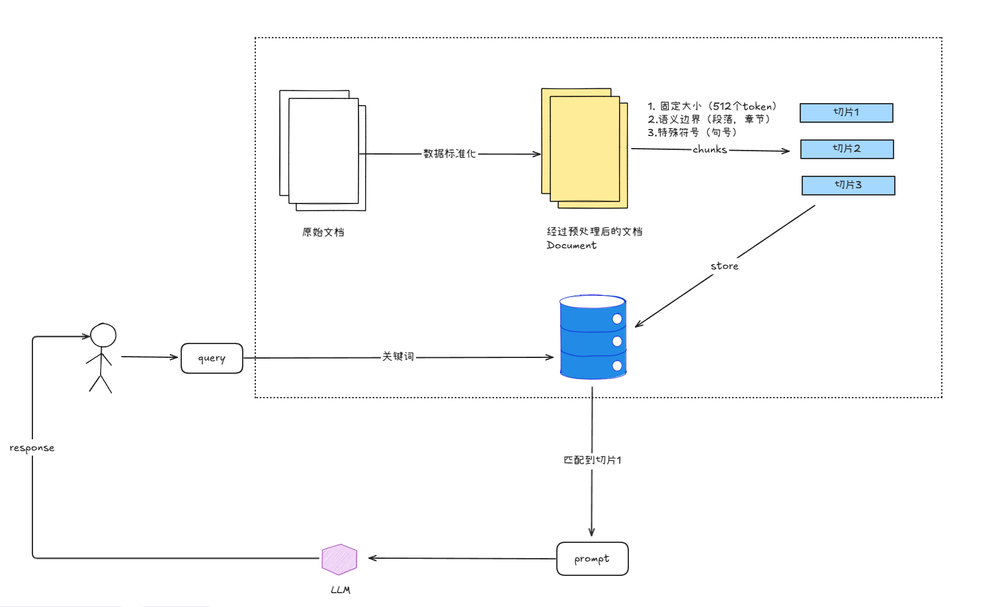

### 二、向量转换和存储

在流程图中我们会发现一个新形式的database，叫vector database（向量数据库），咦❓为啥来了个向量数据库？Mongodb，ES这些数据库不成吗？其实ES，Mongdb也是可以作为数据库存储切片，然后进行匹配检索的，而且ES也拥有着非常强大的检索功能，但是这当中存在一个缺点，那就是ES可以做到的是关键词搜索，比如说我搜的是kun，那么ES可以检索出来ikun，但是却不能搜索“坤”，原因就在于ES只能做到关键词匹配，却无法做到根据语义进行匹配，而这点向量则是能够做到！

向量，高中数学我们就接触过了，当时学的是平面向量，其实就是二维向量，假设我们有一个点A和点B，如果用向量来表示就可以表示为OA和OB向量，怎么表示OA和OB是相似的呢？我们可以凭借他们的距离c和夹角α来判断，其实就是两者更接近，我们就能判断OA和OB更加相似，只是图中表现的是一个二维的向量，而想要将一段话描述清楚，二维可是远远不够的，那就需要很多很多维了。而将一段描述转为向量这么个过程就叫Vector Embedding，用来将向量存储起来用于计算检索使用的就是向量数据库啦


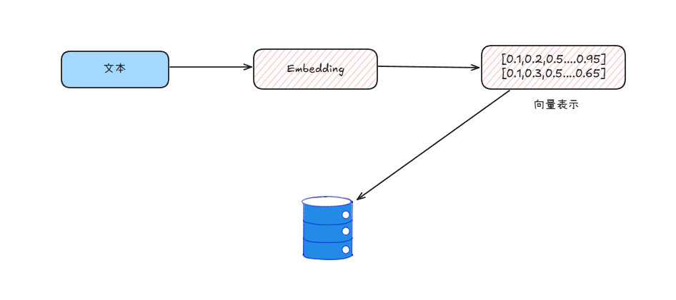

### 三、文档过滤和检索

知识库此时都已经存到数据库中了，接下来便是基于我们的问题到数据库中获取相似的数据了，这个过程就会经过文档过滤和检索这一系列动作了，这么一系列动作当然是由向量数据库来完成了，不过既然是向量数据库检索，那么我们的问题必然也需要转为向量表达，才能让数据库顺利接收并进行相似度检索。

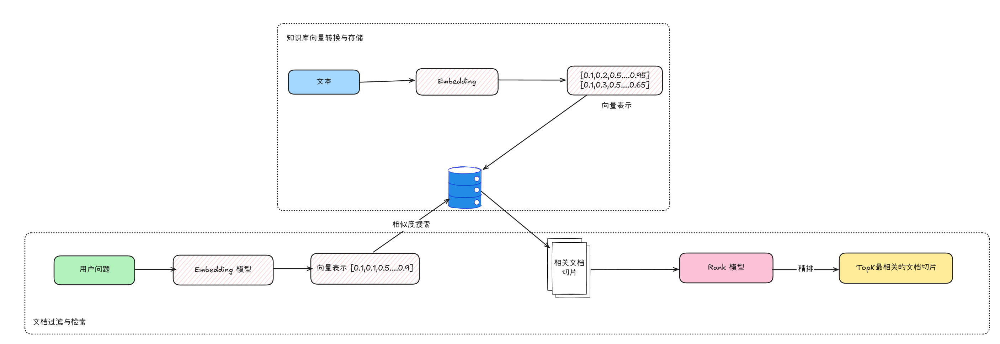

图中出现两大模型，一个是Embeding模型是用于帮助我们进行向量转换的，而Ranking模型则是辅助我们为检索出来的结果进行相似度排序从而让我们能够获取到最恰当的一系列结果。

### 四、查询增强和关联

检索出来相关内容后，我们便可以与提示词组装成增强式的提示词，相当于武装了提示词，经过这么一通操作，大模型便能够与相关的知识相联系，大模型的缺陷之一本身就在于其所训练的知识都是历史数据，好嘛，现在我们直接给他灌输知识了，这不，聪明的大脑又占领高地了！而且这么些知识我们都是可以及时更新的，只是通过这么翻原理能够看出来，显然提示词此时需要带上知识库了，这会使得成本有所增加。

## 实现 - Java版

好了，到此，相信我们都RAG的工作流程是有了进一步的认识了，接下来，我们就开始尝试整合一下Spring AI ，Spring AI 对 RAG就有着比较完善的支持，而且在整合的过程中，我们会对RAG的工作流程有一个更加深刻而全面的认识的。

### 基于Spring AI整合RAG

Spring AI 文档：

[spring ai 文档](https://docs.spring.io/spring-ai/reference/index.html "spring ai 文档")

Spring AI Alibaba 文档：

[Spring AI Alibaba 官网\_快速构建 JAVA AI 应用 (java2ai.com)](https://java2ai.com/?spm=5176.29160081.0.0.2856aa5ck6gBVj "Spring AI Alibaba 官网_快速构建 JAVA AI 应用 (java2ai.com)")

Spring AI 对RAG支持的工作流程跟我们介绍的是一致的，所以我们就根据工作流程所介绍的内容来一个一个剖析Spring AI&#x20;

#### 文档收集和切割

##### 文档准备与文档整理

首先我们要清楚的一点是要看文档是机器，而作为机器，最喜欢看的就是具备结构化的内容了，所以我们的文档应该要结构清晰，既然要结构清晰，那么markdown必然是比较好的选择，这样对于文档切割来说能够提供非常大的好处。

##### 文档ETL

对于原始文档来说，我们的最终目的就是将其加载到向量数据库当中方便我们进行检索，而Spring AI 则将其抽象成3个过程，分别是抽取（Extract）,转换（Transform）, 加载（Load），简称ETL。

- 抽取 - 将原始文档读出来
- 转换 - 标准化文档内容 ，其实就是转换为Document对象
- 加载 - 加载到向量数据库当中

这三个流程分别就对应着Spring AI 提供的三个接口，分别是DocumentReader ，DocumentTransformer，DocumentWriter，这也就意味着我们可以通过实现这三个接口来自定义ETL这个流程。

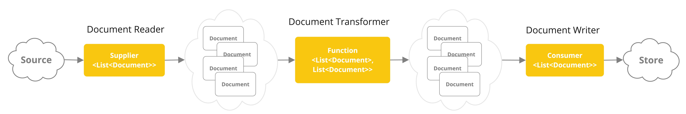

##### DocumentReader

Spring AI Alibaba 提供的DocumentReader 实现只有

- com.alibaba.cloud.ai.dashscope.rag.DashScopeDocumentCloudReader 用于进行百炼云端文档解析
- org.springframework.ai.reader.JsonReader 用于解析Json格式文档
- org.springframework.ai.reader.TextReader 用于解析文档格式文档

以下是官网提供的DocumentReader解析markdown方式

[ETL Pipeline :: Spring AI Reference](https://docs.spring.io/spring-ai/reference/api/etl-pipeline.html#_markdown "ETL Pipeline :: Spring AI Reference")

如果我们想要解析更多的格式文档，我们可以到github上或者官网找一找的，比如我们需要进行markdown文档解析，就可以引入一下该依赖

```xml 
<dependency>
    <groupId>org.springframework.ai</groupId>
    <artifactId>spring-ai-markdown-document-reader</artifactId>
    <version>1.0.0-M6</version>
</dependency>

```


当我们引入了这个依赖后，便可以基于MarkdownDocumentReader进行markdown文档解析了，使用起来也非常方便

其实我们看看DocumentReader接口定义的规范就能清楚，DocumentReader最终都是调用get方法来对文档进行解析的

```java 
public interface DocumentReader extends Supplier<List<Document>> {

  default List<Document> read() {
    return get();
  }

}

```


```java 
public class MyDocumentLoader {

    public final ResourcePatternResolver resourceLoader;

    public MyDocumentLoader(ResourcePatternResolver resourceLoader) {
        this.resourceLoader = resourceLoader;
    }


    /*
     * @Author Mr.T
     * @Description  加载指定路径下的Markdown文件
     * @Date  2025/5/11
     **/
    List<Document> loaderDocument() throws IOException {
        // 指定需要加载的文档路径
        Resource[] resources = resourceLoader.getResources("classpath:document/*.md");
        //存储解析后的资源
        List<Document> documentResources = new ArrayList<>();
        for (Resource resource : resources) {
            //配置解析配置
            MarkdownDocumentReaderConfig config = MarkdownDocumentReaderConfig.builder()
                    .withHorizontalRuleCreateDocument(true)
                    .withIncludeCodeBlock(false)
                    .withIncludeBlockquote(false)
                    .withAdditionalMetadata("filename", resource.getFilename())
                    .build();
            //基于MarkdownDocumentReader 进行文档解析
            MarkdownDocumentReader reader = new MarkdownDocumentReader(resource,config);
            List<Document> documents = reader.get();
            documentResources.addAll(documents);
        }
        return documentResources;
    }

}
```


通过以上代码便能够对文档进行收集并标准化为Document，其中我们需要关注的是MarkdownDocumentReaderConfig的配置，这些配置决定了MarkdownDocumentReader的解析和切割的方式，这些配置都可以到官网看看其有什么作用。

[https://docs.spring.io/spring-ai/reference/api/etl-pipeline.html#\_markdown](https://docs.spring.io/spring-ai/reference/api/etl-pipeline.html#_markdown "https://docs.spring.io/spring-ai/reference/api/etl-pipeline.html#_markdown")

而且当我们将断点打到MarkdownDocumentReader解析出来的List\<Document>时，我们会发现我们上传的markdown已经被切割成多份了

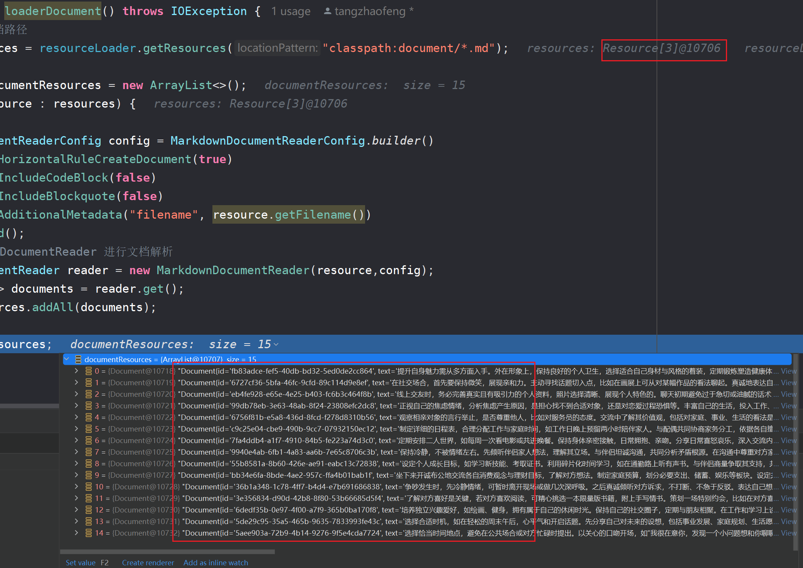

#### 向量转换和存储

Spring AI 其实内置了基于内存读写的向量数据库，叫org.springframework.ai.vectorstore.SimpleVectorStore，而且我们向接口追溯的话，会发现SimpleVectorStore其实就是实现的DocumentWriter接口的，意味着其具备着DocumentWriter的特性，回忆回忆ETL，最终的Load其实就是基于DocumentWriter进行向量数据库写入的，不是吗\~

接下来就来耍耍SimpleVectorStore是如何工作的，感受感受Document是如何进行向量转换和存储的，Let us go！

其实使用是非常简单的，只需要添加一个VectorStore的Bean至Spring容器就行了，然后通过SimpleVectorStore#doAdd就可以将文档内容转为向量了

```java 
/**
 * @author T
 * @description SimpleVectorStore 配置类
 * @date 2025年05月14日 22:47
 */
@Configuration
public class MyVectorStoreConfig {

    @Resource
    private MyDocumentLoader myDocumentLoader;


    /**
     * @description SimpleVectorStore Bean配置
     * @author T
     * @date 2025/5/14
     * @version 1.0
     */
    @Bean
    public VectorStore myVectorStore(EmbeddingModel embeddingModel) throws IOException, IOException {
        SimpleVectorStore simpleVectorStore = SimpleVectorStore.builder(embeddingModel).build();
        //加载文档信息
        simpleVectorStore.doAdd(myDocumentLoader.loaderDocument());
        return simpleVectorStore;
    }

}

```


当然，作为好奇宝宝的我们必然是很想清楚VectorStore是通过什么进行的数据向量化的，我们需要进入doAdd方法就能发现其实当我们将Doucment传入时，会基于我们的EmbeddingModel 进行的向量化，咦，这就跟我们提到个工作流程又对上了，Document会通过Embedding模型进行数据的向量化，最终存储到向量数据库中。

```java 
public void doAdd(List<Document> documents) {
    Objects.requireNonNull(documents, "Documents list cannot be null");
    if (documents.isEmpty()) {
      throw new IllegalArgumentException("Documents list cannot be empty");
    }

    for (Document document : documents) {
      logger.info("Calling EmbeddingModel for document id = {}", document.getId());
      float[] embedding = this.embeddingModel.embed(document);
      SimpleVectorStoreContent storeContent = new SimpleVectorStoreContent(document.getId(), document.getText(),
          document.getMetadata(), embedding);
      this.store.put(document.getId(), storeContent);
    }
  }
```


#### 查询增强和关联

好啦，目前文档已经算是顺利的放到数据库中了，接下来我们就需要对查询增强了，首先Spring AI是如何对查询进行增强的呢？其实是基于org.springframework.ai.chat.client.advisor.api.Advisor接口来完成的，Advisor接口很类似Spring AOP ，无非是在我们对大模型提问时将提问请求拦截下来给我们改造改造。

```java 
public interface Advisor extends Ordered {

  /**
   * Useful constant for the default Chat Memory precedence order. Ensures this order
   * has lower priority (e.g. precedences) than the Spring AI internal advisors. It
   * leaves room (1000 slots) for the user to plug in their own advisors with higher
   * priority.
   */
  int DEFAULT_CHAT_MEMORY_PRECEDENCE_ORDER = Ordered.HIGHEST_PRECEDENCE + 1000;

  /**
   * Return the name of the advisor.
   * @return the advisor name.
   */
  String getName();

}
```


我们可以再往里深究一下，对于Advisor我们一般使用org.springframework.ai.chat.client.advisor.QuestionAnswerAdvisor，因为其使用起来足够简单，我们喽喽他的源码，引入眼帘的是一段DEFAULT\_USER\_TEXT\_ADVISE 这么的文本，仔细看看，他其实说白了就是一段Prompt，当我们在初始化的时候就会将这段Prompt也传到初始化方法中，当然我们也可以自定义的这段Prompt。

另外我们可以将目光放在其构造器上，我们会发现我们需要传入一个VectorStore 给到QuestionAnswerAdvisor，这就意味着QuestionAnswerAdvisor还会帮我们从向量数据库中查询跟我们问题相关的知识，再结合DEFAULT\_USER\_TEXT\_ADVISE Prompt 组装成一段前置的Prompt，通过这种方式来增强查询。

```java 
public class QuestionAnswerAdvisor implements CallAroundAdvisor, StreamAroundAdvisor {

  public static final String RETRIEVED_DOCUMENTS = "qa_retrieved_documents";

  public static final String FILTER_EXPRESSION = "qa_filter_expression";

  private static final String DEFAULT_USER_TEXT_ADVISE = """

      Context information is below, surrounded by ---------------------

      ---------------------
      {question_answer_context}
      ---------------------

      Given the context and provided history information and not prior knowledge,
      reply to the user comment. If the answer is not in the context, inform
      the user that you can't answer the question.
      """;

  ...
  
  public QuestionAnswerAdvisor(VectorStore vectorStore) {
    this(vectorStore, SearchRequest.builder().build(), DEFAULT_USER_TEXT_ADVISE);
  }

}
```


那么怎么使用呢？相当简单，只需要在我们进行ChatClient构建时添加一个advisors即可，当然我们能够发现advisors是一个复数的形式，而且我们在查看Advisor接口时，会发现其继承了Order接口，这就意味着Advisor的执行是可以具备顺序性的。

```java 
    @Test
    public void askQuestionTest(){
        chatClient
                .prompt()
                .user("Who is the author of the book?")
                .advisors(new QuestionAnswerAdvisor(vectorStore))
                .call()
                .chatResponse();
    }
```


当我们深入到advisors处看看，会发现Spring AI会将我们提供的Advisor添加到队列advisors和aroundAdvisorChainBuilder中，后面在拦截到请求的时候便会将队列中的advisors弹出一个一个执行了。

```java 
    public ChatClientRequestSpec advisors(Advisor... advisors) {
      Assert.notNull(advisors, "advisors cannot be null");
      Assert.noNullElements(advisors, "advisors cannot contain null elements");
      this.advisors.addAll(Arrays.asList(advisors));
      this.aroundAdvisorChainBuilder.pushAll(Arrays.asList(advisors));
      return this;
    }
```


如果我们需要一些自定义的Advisors，比如需要将Prompt记录到日志中，或者获取一些检索结果记录到日志中，就可以自定义MyLogAdvisors 实现Advisors接口，然后在advisors处添加我们自定义的Advisor即可。

```java 
@Slf4j
public class MyLogAdvisor implements CallAroundAdvisor, StreamAroundAdvisor {
    @Override
    public AdvisedResponse aroundCall(AdvisedRequest advisedRequest, CallAroundAdvisorChain chain) {
        //打印日志
        log.info("System Params -> {}",advisedRequest.systemParams().toString());

        log.info("User Text  -> {} ",advisedRequest.userText());
        return chain.nextAroundCall(advisedRequest);
    }

    @Override
    public Flux<AdvisedResponse> aroundStream(AdvisedRequest advisedRequest, StreamAroundAdvisorChain chain) {
        return null;
    }

    @Override
    public String getName() {
        return "MyLogAdvisor";
    }

    @Override
    public int getOrder() {
        return 0;
    }
}


//得到结果：
2025-05-17T16:09:29.635+08:00  INFO 10560 --- [           main] org.example.advisors.MyLogAdvisor        : System Params -> {}
2025-05-17T16:09:29.635+08:00  INFO 10560 --- [           main] org.example.advisors.MyLogAdvisor        : User Text  -> 我单身，怎么才能提高自己的魅力值？ 
要提高自己的魅力值，可以从以下几个方面入手：

1. **外在形象**：保持良好的个人卫生，选择适合自己身材与风格的着装，定期锻炼塑造健康体魄。例如小李通过学习穿搭、参与户外运动，逐渐变得开朗自信。

2. **内在修养**：培养广泛兴趣爱好，如阅读提升知识储备，学习乐器增添艺术气质。积极参加社交活动，锻炼沟通与表达能力，以自信、热情的态度展现自我。

3. **社交技巧**：在社交场合，保持微笑，展现亲和力。主动寻找话题切入点，真诚地表达对对方的兴趣，并注意倾听对方的回应，给予专注的眼神与积极反馈。

4. **线上交友**：完善真实且有吸引力的个人资料，照片选择清晰、展现个人特色的。聊天时从兴趣爱好、日常趣事等轻松话题开启，保持适中的聊天频率，同时注意保护个人隐私。

5. **独立发展**：培养独立兴趣爱好，保持自己的社交圈子，在工作和学习上设定个人目标并努力追求。遇到问题先尝试自己解决，锻炼独立思考与应对能力。

通过以上方法，你可以全面提升自己的魅力值，吸引心仪的对象。
```


基于这么个结果，我们来全局查一查就会发现回答的问题其实部分来源于我们提供的知识库，这便是查询增强，通过这么个操作，想必大家必定对RAG的工作流程会有一个较为深刻的认识。

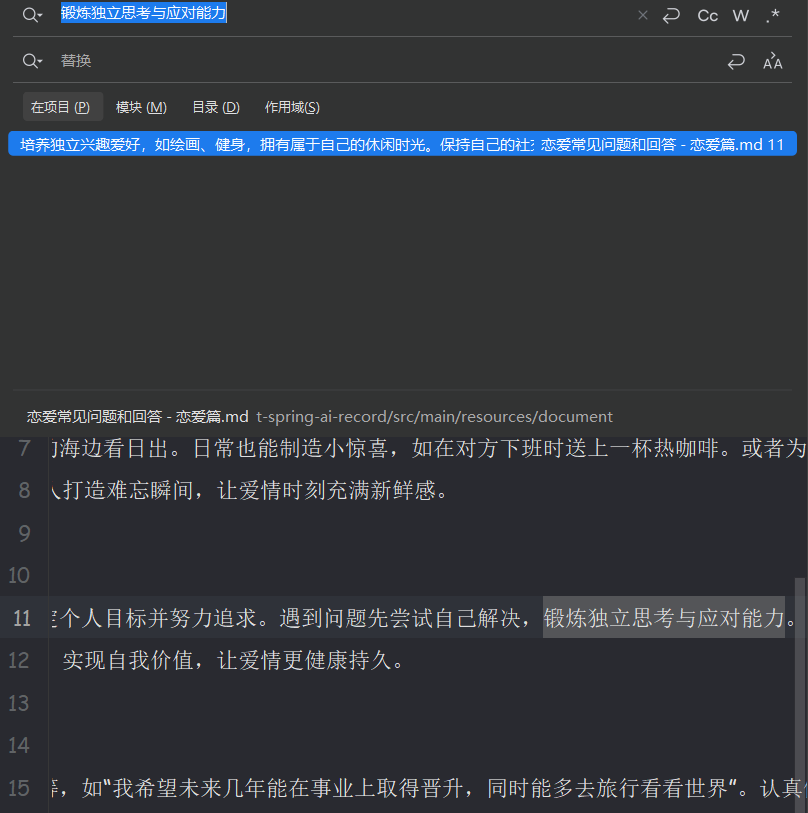

### 整合云知识库

以上就是我们基于Spring AI完成的整个RAG的工作流程，不过如果光是使用Spring AI提供的工具可能达不到很好的文档效果，这个时候我们可以使用工具更全的云知识库帮助我们来做知识库的管理。这里笔者就采用阿里云百炼来耍耍，其他平台的话其实都只是平台不一样罢了\~

首先我们先来到阿里云百炼的控制台，登录自己的账号

[https://bailian.console.aliyun.com/](https://bailian.console.aliyun.com/ "https://bailian.console.aliyun.com/")

#### 文档收集

其实跟RAG的工作流程是一样的，首先我们需要到应用数据处进行知识库上传并基于百炼进行数据切割，其中我们除了上传对应的md文档，其中在文档识别处，我们选择了文档智能识别，其实跟Spring AI将文档转为Document差不多意思，而后面的配置标签则是相当于让我们给知识库配上元数据，元数据有什么用呢？在日常开发中，我们会用元数据来描述一个对象的备注信息，方便我们可以根据元数据库信息来查看对象的资料，比如说Spring的Bean ，其中BeanDefinitionHolder就管理着Bean的元数据信息。

所以为知识库打上标签，也是帮助我们提高检索效果的一个很好的方式。

```java 
public class BeanDefinitionHolder implements BeanMetadataElement {
  ....
}
```


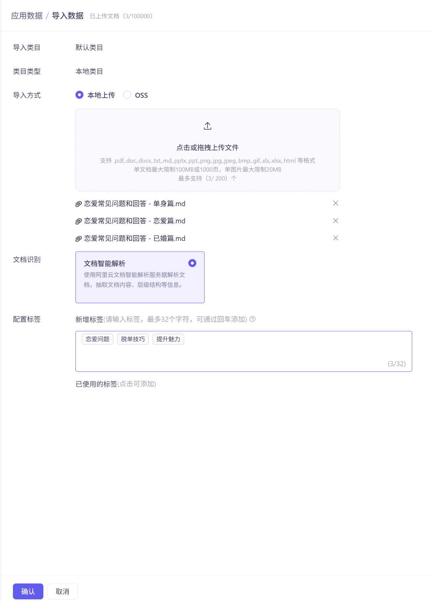

#### 创建云知识库

数据我们准备好了，接下来就可以来到应用页面，找到知识库菜单，并创建一个知识库

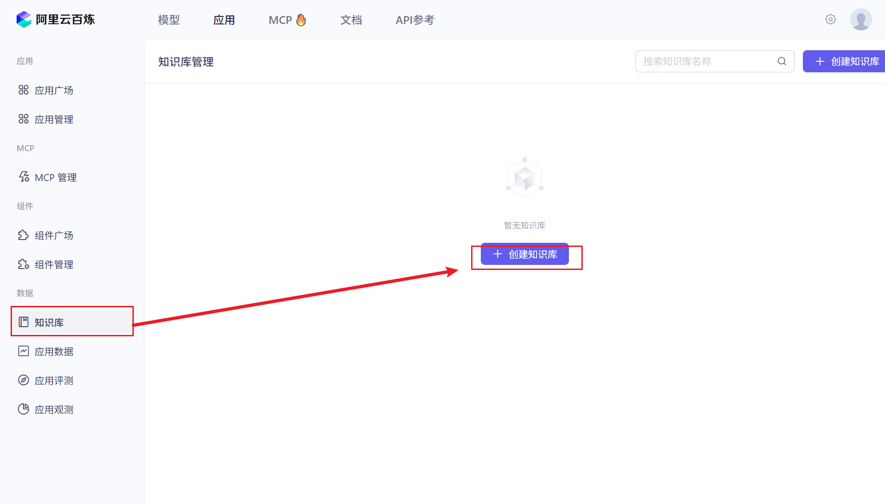

通过配置一个云知识库，我们会对RAG知识库有一个深刻的理解，因为在创建的过程中，我们会很全面的接触到这些功能的使用，而且还是以图形化的方式，所以我们能够更加清晰RAG知识库的使用。

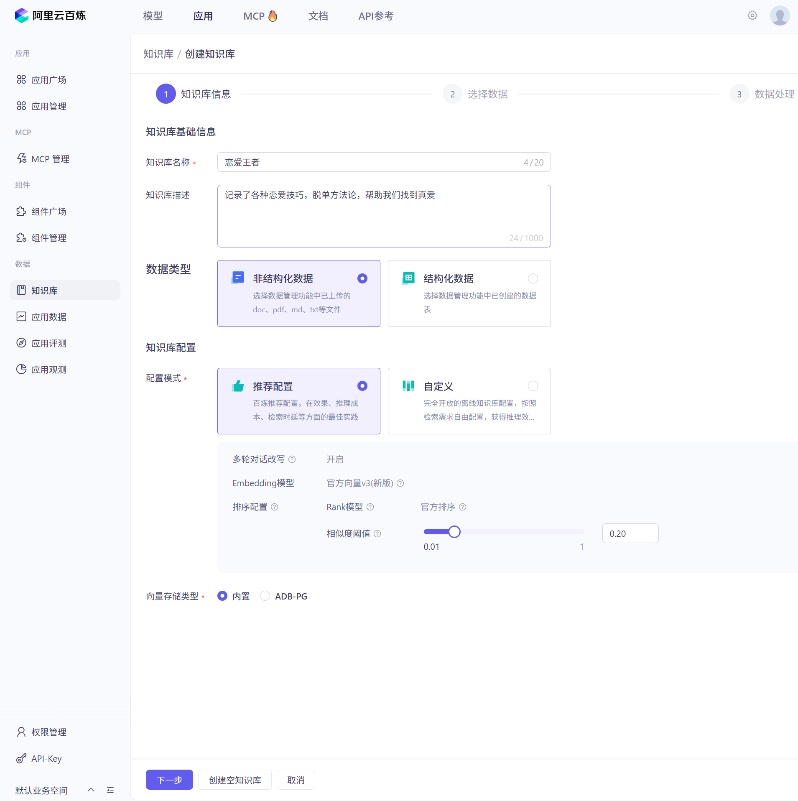

这里有几个概念可以熟悉熟悉

##### 数据类型

对于数据类型来说，知识库既可以是非结构化数据，比如doc，pdf，md这些都属于非结构化的数据，除了可以录入非结构化的数据，我们可以向其录入像mysql表类似的结构化数据。

###### 知识库的匹配模式

当然推荐配置是官方最推荐的，也是最常用的了，而如果我们需要自定义的话，可以选择自定义的匹配模式，其中有几个选项

- 多轮对话改写

  其实就是在问答的过程中，不断地通过上下文去改写我们提供的查询信息，从而获取更加准确的更加适配的知识库结果
- Embedding模型

  Embedding模型我们在使用Spring AI的时候就了解了，其实就是将数据进行向量化的一个模型
- 排序配置

  Rank模型则是在我们将知识库相似内容检索出来后会基于Rank模型根据一定的策略进行高速排序帮助我们取到最佳答案

#### 选择数据

接下来我们就可以选择我们刚刚上传的文档作为知识库，直接来到下一步

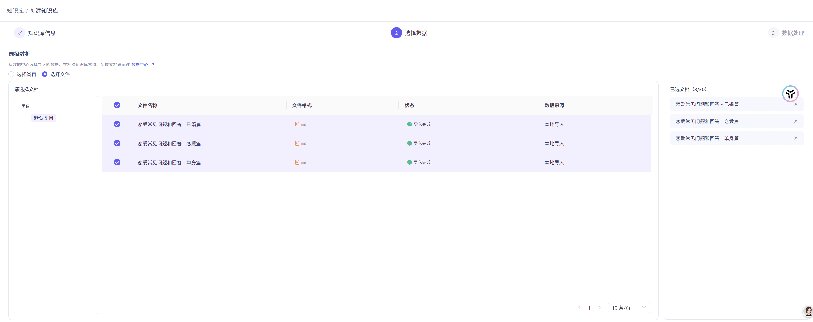

#### 数据处理

我们在使用Spring AI的时候就知道知识库文档会经过切割，然后存于向量数据库中，那么这一步就是来到文档切割的选项中，而且通过配置云知识库的切割选项，我们会更加全面的了解切割工具。

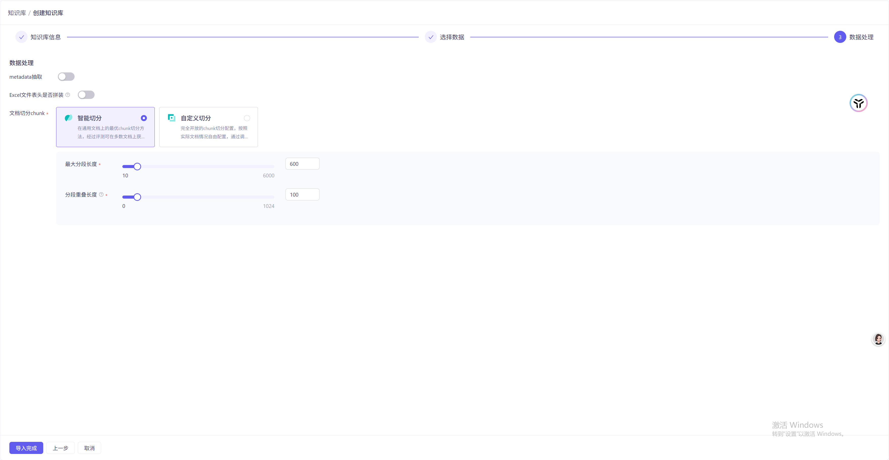

##### metadata抽取

首先就是metadata抽取，metadata我们刚刚就提到了元数据就是帮我们提高检索的效果和准确率的，所以非常推荐开启这一项，配置具体的文档metadata。

##### 文档切分chunk

这里有智能切分和自定义切分，智能切分不用说，当然是最推荐使用的，而自定义切分则是我们通过一定的策略进行数据分割，比如说根据长度切分等。

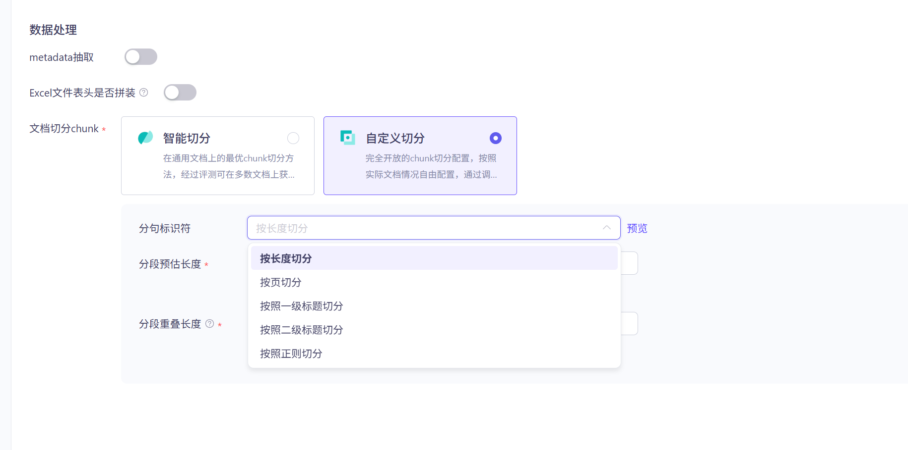

当然这里有一个概念，分段重叠长度的选项，这个选项其实就是在分割的过程中为了保持上下段的连贯性，会将下段的一部分内容同步到上一段去，比如说，以下根据段落进行切分，但是【培养独立兴趣爱好，如绘画、健身，拥有属于自己的休闲时光。】这段文本就被同步到上一段内容，让整个切分的更具备上下段的连贯性了。

```markdown 

了解对方喜好是关键，若对方喜欢阅读，可精心挑选一本限量版书籍，附上手写情书。策划一场特别约会，比如在对方喜欢的海边看日出。日常也能制造小惊喜，如在对方下班时送上一杯热咖啡。或者为对方准备一场主题派对，布置成对方喜欢的风格。小李为女友精心策划了一场星空露营约会，让女友感动不已，感情愈发深厚。
推荐课程：[《恋爱浪漫惊喜制造宝典》]，课程涵盖各类浪漫惊喜创意与实施方法，帮你为爱人打造难忘瞬间，让爱情时刻充满新鲜感。培养独立兴趣爱好，如绘画、健身，拥有属于自己的休闲时光。


培养独立兴趣爱好，如绘画、健身，拥有属于自己的休闲时光。保持自己的社交圈子，定期与朋友相聚。在工作和学习上设定个人目标并努力追求。遇到问题先尝试自己解决，锻炼独立思考与应对能力。例如小周在恋爱中坚持自己的舞蹈爱好，与朋友保持密切联系，工作上积极进取，既享受恋爱甜蜜，又不失自我。
推荐课程：[《恋爱中保持自我与独立成长》]，课程引导你在恋爱中平衡亲密关系与个人发展，实现自我价值，让爱情更健康持久。

```


接下来就可以导入知识库了。

完成了知识库导入后，我们便能在知识库处查看到对应存储的文档

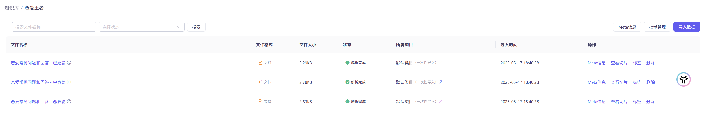

当我们点击查看切分时，就能看到对应的文档已经被切分为各个片段了

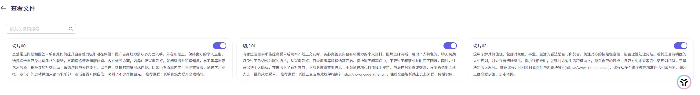

#### 基于Spring AI Alibaba 整合云知识库

[ 文档检索 (Document Retriever)-阿里云Spring AI Alibaba官网官网 Spring AI 与通义千问集成，使用 Spring AI 开发 Java AI 应用。 https://java2ai.com/docs/1.0.0-M6.1/tutorials/retriever/#%E7%A4%BA%E4%BE%8B%E7%94%A8%E6%B3%95](https://java2ai.com/docs/1.0.0-M6.1/tutorials/retriever/#%E7%A4%BA%E4%BE%8B%E7%94%A8%E6%B3%95 " 文档检索 (Document Retriever)-阿里云Spring AI Alibaba官网官网 Spring AI 与通义千问集成，使用 Spring AI 开发 Java AI 应用。 https://java2ai.com/docs/1.0.0-M6.1/tutorials/retriever/#%E7%A4%BA%E4%BE%8B%E7%94%A8%E6%B3%95")

有了云知识库，基于Spring AI Alibaba整合这个云知识库就易如反掌了。其实原理都是一样的，都是基于Spring AI提供的Advisor完成的，Spring AI 为此拓展了一个RetrievalAugmentationAdvisor完成此事。

RetrievalAugmentationAdvisor的构建需要我们传入DocumentRetriever组件，DocumentRetriever组件其实就是Spring AI提供的用于从数据源中检索文档的组件。

```java 
public interface DocumentRetriever extends Function<Query, List<Document>> {

  /**
   * Retrieves relevant documents from an underlying data source based on the given
   * query.
   * @param query The query to use for retrieving documents
   * @return The list of relevant documents
   */
  List<Document> retrieve(Query query);

  default List<Document> apply(Query query) {
    return retrieve(query);
  }

}
```


所以Spring AI Alibaba 在此接口上做了拓展开发，开发了com.alibaba.cloud.ai.dashscope.rag.DashScopeDocumentRetriever作为云知识库的检索组件，所以我们需要创建DashScopeDocumentRetriever交给RetrievalAugmentationAdvisor即可，当然别忘了传入云百炼的ApiKey。

```java 
@Configuration
public class MyRagCloudAdvisor {

    @Value("${spring.ai.dashscope.api-key}")
    private String dashScopeApiKey;

    @Bean
    public Advisor ragCloudAdvisor(){
        DashScopeApi dashScopeApi = new DashScopeApi(dashScopeApiKey);
        //检索知识库名称
        final String KNOWLEDGE_NAME = "恋爱王者";
        DocumentRetriever documentRetriever = new DashScopeDocumentRetriever(dashScopeApi,
                DashScopeDocumentRetrieverOptions.builder()
                        .withIndexName(KNOWLEDGE_NAME)
                        .build());
        return RetrievalAugmentationAdvisor.builder().documentRetriever(documentRetriever).build();
    }


}
```


接下来在应用的时候跟整合本地知识库的流程是一样的，只需要将我们定义的Advisor交给ChatClientBuilder就可以了，最终结果也是检索到知识库了。

```java 

    @Resource
    private Advisor ragCloudAdvisor;
    
    
    @Test
    public void askQuestionTest() throws IOException {
        //加载知识库
        myDocumentLoader.loaderDocument();
        //基于知识库进行问答
        ChatResponse chatResponse = chatClientBuilder.build()
                .prompt()
                .user("我单身，怎么才能提高自己的魅力值？")
                .advisors(ragCloudAdvisor, new MyLogAdvisor())
                .call()
                .chatResponse();
        //打印结果
        System.out.println(chatResponse.getResult().getOutput().getText());
    }
    
    
 //结果
 提升自身魅力需从多方面入手。外在形象上，保持良好的个人卫生，选择适合自己身材与风格的着装，定期锻炼塑造健康体魄。内在修养方面，培养广泛兴趣爱好，如阅读提升知识储备，学习乐器增添艺术气质。积极参加社交活动，锻炼沟通与表达能力，以自信、热情的态度展现自我。比如小李原本内向且不注重穿着，通过学习穿搭、参与户外运动并加入读书俱乐部，逐渐变得开朗自信，吸引了不少异性目光。推荐课程：[《单身魅力提升全攻略》]，该课程从形象打造、气质培养到社交技巧提升，全方位助力单身人士散发独特魅力，吸引心仪对象。


```


## RAG的最佳实践与调优

RAG的最佳实践与调优，是离不开从ETL这三大核心步骤下手与思考的，所以我们同样需要一步一步来思考其应该有哪些地方值得我们注意与调优。

### 文档收集与分割

#### 原文档

所谓万事开头难，我们提供的文档才是最好下手的地方，如果我们提供的文档都已经乱七八糟了，还能指望大模型提供多少帮助呢？所以对于文档来说，我们需要关心以下几点：

1. 文档的完备性

   大模型的回答是基于我们提供的文档进行检索答案的，如果我们提供的文档缺失资料，那么大模型的回答也会出问题的，所以我们必须要根据用户体验和知识库检索命中率的统计来不断优化文档的完备性。
2. 文档的语言规范化

   笔者曾经也在写文档过程中踩过不少坑，当然这些坑都是自己埋下的，什么坑呢？就是文档的用词问题，在文档中同一个意思的词语我们就应该固定使用一个词语，而且文档语言要跟提示词一致，提示词是英语的，那么文档最好也要是英语版的，另外文档最好不要有水印之类的干扰文档的解析。
3. 格式标准化

   一份条理清晰，格式明确的文档看起来都会让人赏心悦目，更别说机器了，机器最喜欢读的就是格式标准化的内容了，所以能使用markdown，html这些格式明确的文档，最好是使用这类文档。

文档的内容，我们也完全可以交由AI帮我们进行优化与格式转换的，Prompt如上述即可。

#### 文档切片

文档的切分结果跟检索出来的效果是有着千丝万缕的关系，怎么评判文档切分的好呢，首先就是每个文档的切片意思需要是连贯的，不能直接在一篇文档中一段话的中间来上一刀，分开到切分1和切分2，这样大模型也很难推断切分文章的意思的。第二就是每个切片最好都有一个独立的意思，就像我们写作文，每一个自然段都应该有他的核心思想，这样检索出来的结果才能更加准确。第三对于文档的切分来说，不应太短，也不应太长，太短，语义会缺失，检索起来就很难匹配了，太长吧，又容易包含太多不相关的内容导致资源的消耗。

所以对于文档切片来说，如果是云知识库，我们可以采用智能切分的方式，这毕竟是大厂的经验所得，可信度还是非常高的，如果是本地知识库，则我们需要多从文档上下手，令文档更有格式性，而且，最好我们可以人工检查并修正最后的切分效果。

#### 元数据的标注

元数据我们在整合的时候就提到了，这里就不再详述了，元数据是很能帮助提高检索效率的。

### 向量转换和存储

这部分更加应该注意的是数据库的选型，选择合适的数据库来进行向量存储，这个就需要我们根据业务需求，费用成本，数据模型，检索性能以及开发成本等因素来进行选型了。

### 文档过滤和检索

跟日常开发一样，检索的过程干预才是我们作为开发者最能提供帮助的地方，所以这一流程是我们十分应该关注的流程了。

#### 多查询拓展

这个跟云知识库的多轮对话改写功能非常相似，其实就是用于将用户提供的提示词进行改进，令其更贴合上下文，减少歧义性，但是要注意的是多查询拓展会增加查询次数和计算成本，所以慎用喔\~

```java 
MultiQueryExpander expander = MultiQueryExpander.builder().numberOfQueries(3).chatClientBuilder(chatClientBuilder).build();
List<Query> queries = expander.expand(new Query("我单身，怎么才能提高自己的魅力值？"));
```


当我们加入了这段内容后，将断点打到queries处，就能发现我们的提示词发生了变动，准确来说是被AI优化了，当然这个结果随机性还是很高的哈😄，搞不好不一定是优化呢

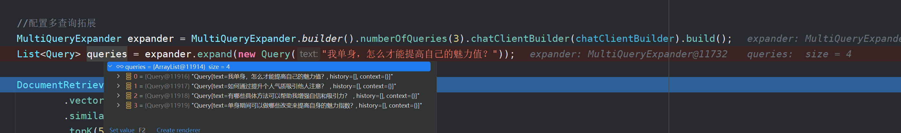

多查询拓展的具体流程可以是

1. 使用扩展后的查询召回文档
2. 整合召回的文档
3. 使用召回的文档进行Prompt的改写

#### 查询重写和翻译

查询重写和翻译则是先对我们提出的问题进行分析润色，或者说专业化，这样可以提供更高的检索准确性，并帮助系统更好地理解用户的真实意图。

具体的可以溜溜文档，文档对这部分内容写的还是非常清晰的

[https://java2ai.com/docs/1.0.0-M6.1/tutorials/rag/#31-multi-query-expansion-%E5%A4%9A%E6%9F%A5%E8%AF%A2%E6%89%A9%E5%B1%95](https://java2ai.com/docs/1.0.0-M6.1/tutorials/rag/#31-multi-query-expansion-%E5%A4%9A%E6%9F%A5%E8%AF%A2%E6%89%A9%E5%B1%95 "https://java2ai.com/docs/1.0.0-M6.1/tutorials/rag/#31-multi-query-expansion-%E5%A4%9A%E6%9F%A5%E8%AF%A2%E6%89%A9%E5%B1%95")
