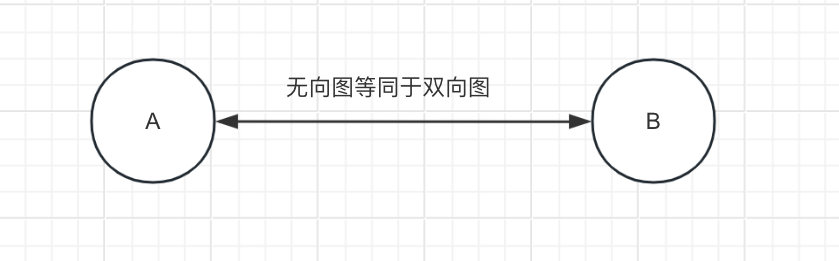
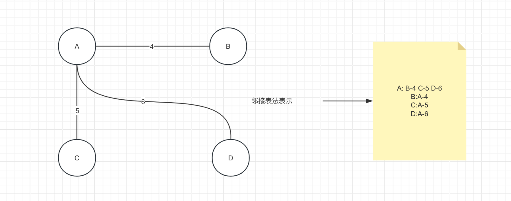
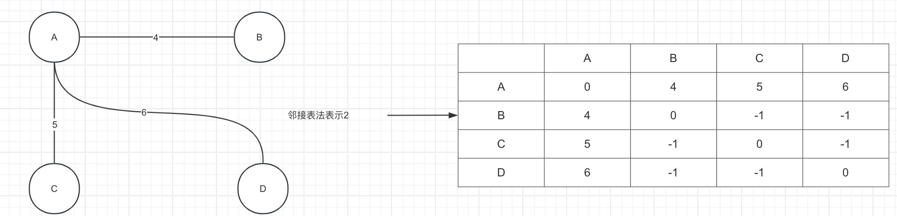
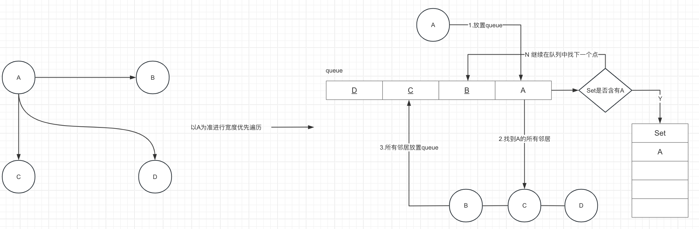
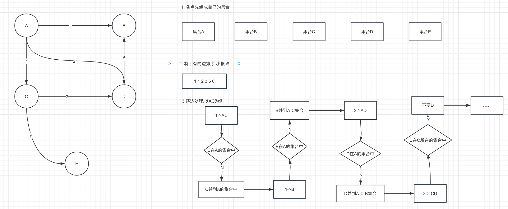
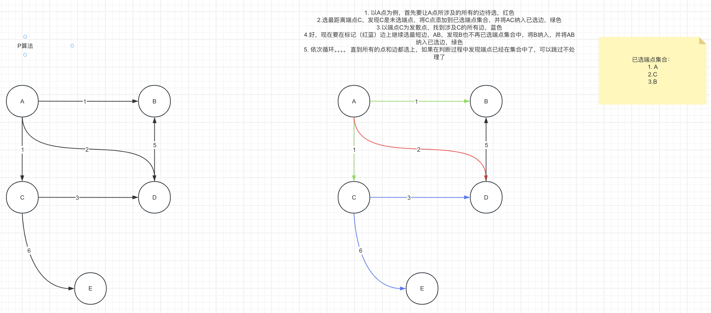

# 图

## 目录

- [表达方式](#表达方式)
- [图的遍历](#图的遍历)
  - [宽度优先遍历](#宽度优先遍历)
  - [深度优先遍历](#深度优先遍历)
- [最小生成树](#最小生成树)
  - [K算法](#K算法)
    - [代码实现](#代码实现)
  - [P算法](#P算法)
    - [算法实现](#算法实现)

## 表达方式

图难就难在其表达上，我们有时候很难去理解一个图的数据结构，不过不管是什么图，我们都可以理解为有向图，因为即便是无向图，其实说白就是一个双通的图而已



通用的图的表达方式有：

1. 邻接表法

   即将每个点的直接邻居用一个表记住，如果有权重也要将其记下来

   
2. 邻接矩阵法

   当然除了表记，也可以用邻接矩阵法

   

当然表达图的方式有非常非常多，所以我们需要有一个专属于自己的图表达方式

以下是推荐的图的表达形式代码：

跟搭建积木一样，一个图所具备的因素有：点，边 → 图，所以可以将这些因素分别抽象再搭建成图

首先是点，每个点都有其出度和入度，这里还会将所有跟改点相关的边集记录下来

```java
public class Node {
    public int value;
    //入度
    public int in;
    //出度
    public int out;
    //邻居点集
    public List<Node> nodes;
    //对应边集
    public List<Edge> edges;

    public Node(int value) {
        this.value = value;
    }
}
```

其次就是边的封装

```java
public class Edge {
    //权重
    public int weight;
    //指向
    public Node from;
    //被指向
    public Node to;
    public Edge(int weight, Node from, Node to) {
        this.weight = weight;
        this.from = from;
        this.to = to;
    }

}
```

最后就是图了，一个图就是由边和点组成

```java
public class Graph {
    //所有点集
    public Map<Integer, Node> nodes;
    //所有边集
    public Set<Edge> edges;

    public Graph() {
        nodes = new HashMap<>();
        edges = new HashSet<>();
    }
}
```

## 图的遍历

### 宽度优先遍历

即从近到远（权重从小到大）地遍历距离自己的节点



```java
    public static List<Integer> bfs(Node root) {
        if (root == null) {
            return new ArrayList<>();
        }
        List<Integer> result = new ArrayList<>();
        //走过的点集，Set 也是为了防止出现环
        Set<Node> sets = new HashSet<>();
        //队列存的就是该点的直接邻居
        Queue<Node> queue = new LinkedList<>();
        queue.offer(root);
        sets.add(root);
        //将每一个点的直接邻居放到queue中，由于是宽度优先遍历，所以这里其实就是将每一个点的
        //所有直接邻居放置队列中了，再结合队列的先进先出的原则，就可以将每一个节点的所有邻居
        //全部放置Set中了
        while (!queue.isEmpty()) {
            Node node = queue.poll();
            result.add(node.value);
            for (Node next : node.nodes) {
                if (!sets.contains(node)) {
                    sets.add(node);
                    queue.offer(next);
                }
            }
        }
        return result;
    }
```

### 深度优先遍历

就是以一个点一直走过每一条分支，最后集合成一个 Set 集合

```java
 public static List<Integer> bfs(Node root) {
        if (root == null) {
            return new ArrayList<>();
        }
        List<Integer> result = new ArrayList<>();
        Set<Node> setNode = new HashSet<>();
        //由于我们要找的是节点是否有分支，有分支才能继续冲，所以我们需要用栈，
        //因为栈的特点就是后进的先出，所以后来的节点其实就是我们的目前到达的节点
        //我们需要继续沿着这个到达的节点向下继续找节点
        Stack<Node> stack = new Stack<>();
        stack.push(root);
        setNode.add(root);
        result.add(root.value);
        while (!stack.isEmpty()) {
            Node node = stack.pop();
            for (Node next : node.nodes) {
                if (!setNode.contains(next)) {
                    stack.push(node);   //要将当前node重新压进栈,原因是该节点可能有其他分支
                    stack.push(next);
                    setNode.add(next);
                    result.add(root.value);
                    break;
                }
            }
        }
        return result;
    }
```

## 最小生成树

就是权重最小的遍历方式，所有的节点都应是连通的

### K算法

这里结合并查集就完全能够解决了

思路：

1. 首先将所有的节点想象成自己跟自己一个集合
2. 将所有的边进行排序，这里其实就是为了找到最小生成树的边，剩下的就是将这些边所关联的点进行并查，排在前面的边会被优先并查，而排到后面的边（权重越大）关联的点会因为已经被纳入并查集而被淘汰



#### 代码实现

首先实现一个并查集

```java
  // Union-Find Set
  public static class UnionFind {
    // key 某一个节点， value key节点往上的节点
    private HashMap<Node, Node> fatherMap;
    // key 某一个集合的代表节点, value key所在集合的节点个数
    private HashMap<Node, Integer> sizeMap;

    public UnionFind() {
      fatherMap = new HashMap<Node, Node>();
      sizeMap = new HashMap<Node, Integer>();
    }
    
    public void makeSets(Collection<Node> nodes) {
      fatherMap.clear();
      sizeMap.clear();
      for (Node node : nodes) {
        fatherMap.put(node, node);
        sizeMap.put(node, 1);
      }
    }

    private Node findFather(Node n) {
      Stack<Node> path = new Stack<>();
      while(n != fatherMap.get(n)) {
        path.add(n);
        n = fatherMap.get(n);
      }
      while(!path.isEmpty()) {
        fatherMap.put(path.pop(), n);
      }
      return n;
    }

    public boolean isSameSet(Node a, Node b) {
      return findFather(a) == findFather(b);
    }

    public void union(Node a, Node b) {
      if (a == null || b == null) {
        return;
      }
      Node aDai = findFather(a);
      Node bDai = findFather(b);
      if (aDai != bDai) {
        int aSetSize = sizeMap.get(aDai);
        int bSetSize = sizeMap.get(bDai);
        if (aSetSize <= bSetSize) {
          fatherMap.put(aDai, bDai);
          sizeMap.put(bDai, aSetSize + bSetSize);
          sizeMap.remove(aDai);
        } else {
          fatherMap.put(bDai, aDai);
          sizeMap.put(aDai, aSetSize + bSetSize);
          sizeMap.remove(bDai);
        }
      }
    }
  }
```

然后就可以结合并查集经最小生成树生成出来了

```java
/**
   * @Description 边的比较器
   * @Author T
   * @Date 2024/6/11 19:13     
   **/
  public static class EdgeComparator implements Comparator<Edge> {
    @Override
    public int compare(Edge o1, Edge o2) {
      return o1.weight - o2.weight;
    }

  }

  public static Set<Edge> kruskalMST(Graph graph) {
    UnionFind unionFind = new UnionFind();
    unionFind.makeSets(graph.nodes.values());
    // 从小的边到大的边，依次弹出，小根堆！
    PriorityQueue<Edge> priorityQueue = new PriorityQueue<>(new EdgeComparator());
    for (Edge edge : graph.edges) { // M 条边
      priorityQueue.add(edge);  // O(logM)
    }
    Set<Edge> result = new HashSet<>();
    while (!priorityQueue.isEmpty()) { // M 条边
      Edge edge = priorityQueue.poll(); // O(logM)
      if (!unionFind.isSameSet(edge.from, edge.to)) { // O(1)
        result.add(edge);
        unionFind.union(edge.from, edge.to);
      }
    }
    return result;
  }
```

### P算法

P算法就显得暴力一点了，就是一个一个点地出发，对每个点都检查一下他的边，并挑最小的边继续向下检查。



#### 算法实现

```java
public static class EdgeComparator implements Comparator<Edge> {

    @Override
    public int compare(Edge o1, Edge o2) {
      return o1.weight - o2.weight;
    }

  }

  public static Set<Edge> primMST(Graph graph) {
    // 解锁的边进入小根堆
    PriorityQueue<Edge> priorityQueue = new PriorityQueue<>(new EdgeComparator());

    // 哪些点被解锁出来了
    HashSet<Node> nodeSet = new HashSet<>();
    
    
    
    Set<Edge> result = new HashSet<>(); // 依次挑选的的边在result里

    for (Node node : graph.nodes.values()) { // 随便挑了一个点
      // node 是开始点
      if (!nodeSet.contains(node)) {
        nodeSet.add(node);
        for (Edge edge : node.edges) { // 由一个点，解锁所有相连的边
          priorityQueue.add(edge);
        }
        while (!priorityQueue.isEmpty()) {
          Edge edge = priorityQueue.poll(); // 弹出解锁的边中，最小的边
          Node toNode = edge.to; // 可能的一个新的点
          if (!nodeSet.contains(toNode)) { // 不含有的时候，就是新的点
            nodeSet.add(toNode);
            result.add(edge);
            for (Edge nextEdge : toNode.edges) {
              priorityQueue.add(nextEdge);
            }
          }
        }
      }
      // break;
    }
    return result;
  }

  // 请保证graph是连通图
  // graph[i][j]表示点i到点j的距离，如果是系统最大值代表无路
  // 返回值是最小连通图的路径之和
  public static int prim(int[][] graph) {
    int size = graph.length;
    int[] distances = new int[size];
    boolean[] visit = new boolean[size];
    visit[0] = true;
    for (int i = 0; i < size; i++) {
      distances[i] = graph[0][i];
    }
    int sum = 0;
    for (int i = 1; i < size; i++) {
      int minPath = Integer.MAX_VALUE;
      int minIndex = -1;
      for (int j = 0; j < size; j++) {
        if (!visit[j] && distances[j] < minPath) {
          minPath = distances[j];
          minIndex = j;
        }
      }
      if (minIndex == -1) {
        return sum;
      }
      visit[minIndex] = true;
      sum += minPath;
      for (int j = 0; j < size; j++) {
        if (!visit[j] && distances[j] > graph[minIndex][j]) {
          distances[j] = graph[minIndex][j];
        }
      }
    }
    return sum;
  }

  public static void main(String[] args) {
    System.out.println("hello world!");
  }
```
