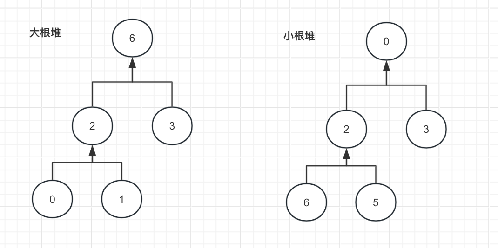
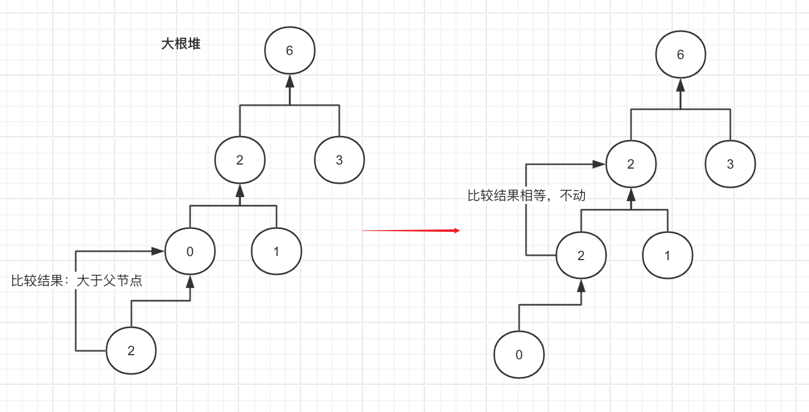
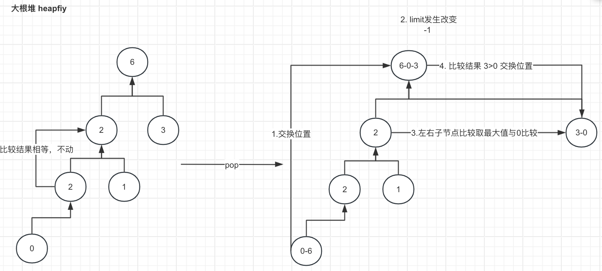

# 堆

## 目录

- [大根堆与小根堆](#大根堆与小根堆)
  - [代码实现](#代码实现)
  - [完整代码](#完整代码)
- [堆排序](#堆排序)
  - [完整代码](#完整代码)
- [Java提供的堆](#Java提供的堆)
  - [动手实现自己的堆](#动手实现自己的堆)
    - [思路分析](#思路分析)
    - [具体实现](#具体实现)

虽然树的结构是复杂的，但是我们通常会使用数组来表示一颗树，即树的各个节点的位置可以使用不同的下标表示。

## 大根堆与小根堆

通常情况下：

对于数组中某一个下标为i的元素，都有

1. 左孩子节点：2\*i + 1
2. 右孩子节点：2\*i + 2
3. 父节点：（i-1）/2

而堆本身就是一颗二叉树，他又被分为小根堆和大根堆

大根堆就是对于每棵子树来说都要满足头节点比其子节点要大

小根堆则反过来，要求每颗子树都要满足头节点比其子节点要小



那么，如何制造这样的一个根堆呢？以大根堆为例，其实我们每次插入一个数据的时候，都会往这颗树的后面插入一个节点，那么每次插入一个节点的时候，我们都要

1. 比较自己与父节点的大小关系
   1. 如果比父节点大，与父节点交换位置
   2. 如果比父节点小或者相等，可以不动



### 代码实现

首先对于堆来说，我需要准备这3个属性

```java
       private static class MyMaxHeap {
        //堆数组
        private int[] heap;
        //目前插入数据位置
        private int heapSize;
        //堆大小限制
        private int limit;

        public MyMaxHeap(int limit) {
            this.heap = new int[limit];
            this.heapSize = 0;
            this.limit = limit;
        }
     }
```

对于push 数组会有以下方法

```java
  public void push(int value) {
            //越界情况
            if (heapSize == limit) {
                throw new RuntimeException("heap is full!");
            }
            heap[heapSize] = value;
            //调整大根堆
            heapInsert(heap, heapSize++);
        }
```

那么一起来看看核心代码，看看大根堆是如何进行调整的

```java
 private void heapInsert(int[] heap, int index) {
            //获取父节点下标
            int parent = (index - 1) / 2;
            //与父节点的值进行对比，直到两者相等或者比父节点小才停止循环
            while (heap[index] > heap[parent]) {
                //交换自己与父节点的位置
                swap(heap, index, parent);
                index = parent;
            }
        }
        
        
  //交换位置
 private void swap(int[] array, int i, int j) {
            int temp = array[i];
            array[i] = array[j];
            array[j] = temp;
        }

```

大根堆处于最顶的节点显然一定是最大值，所以如果我们要求需要弹出最大值，而且还需要保持大根堆的结构，我们又该怎么做呢？这段代码就是在弹出最顶元素时

1. 需要将最后一个元素跟最顶元素做位置交换，这样做的目的是保持其他子大根堆结构不发生改变
2. 由于此时最顶元素是最父节点，所以会做这么两个操作，使得能够重新调整为大根堆
   1. 先从左右子节点中找到最大值，然后跟第1步交换后的节点进行比较，如果左右节点存在比他大的，就交换位置
   2. 以此循环到不再存在子节点或者其左右子节点都比其小停止，由于原来的子大跟堆不会发生改变，只要存在左右子节点都比其小的情况，后面的子节点就不需要看了



```java
       /**
         * @Description 弹出最父节点
         * @Author T
         * @Date 2024/6/9 16:05
         **/
        public int pop() {
            int ans = heap[0];
            //先交换最父节点和最后一个节点的位置，相当于不要最后一个节点了
            swap(heap, 0, --heapSize);
            //重新调整为大根堆
            heapify(heap, 0, heapSize);
            return ans;
        }

        /**
         * @Description 重新调整大根堆
         * @Author T
         * @Date 2024/6/9 16:04
         **/
        private void heapify(int[] heap, int index, int heapSize) {
            //先获取此时最父节点的左子节点下标
            int left = index * 2 + 1;
            while (left < heapSize) {
                //判断是否有右节点,右节点比左节点大
                int largest = left + 1 > heapSize && heap[left + 1] > heap[left] ? left + 1 : left;
                //最大的这个值与index比较
                largest = heap[largest] > heap[index] ? largest : index;
                if (largest == index) return;
                swap(heap, largest, index);
                index = largest;
                left = index * 2 + 1;
            }
        }

```

### 完整代码

```java
public class Heap {
    private static class MyMaxHeap {
        //堆数组
        private int[] heap;
        //目前插入数据位置
        private int heapSize;
        //堆大小限制
        private int limit;

        public MyMaxHeap(int limit) {
            this.heap = new int[limit];
            this.heapSize = 0;
            this.limit = limit;
        }

        public void push(int value) {
            //越界情况
            if (heapSize == limit) {
                throw new RuntimeException("heap is full!");
            }
            heap[heapSize] = value;
            //调整成大根堆
            heapInsert(heap, heapSize++);
        }

        /**
         * @Description 弹出最父节点
         * @Author T
         * @Date 2024/6/9 16:05
         **/
        public int pop() {
            int ans = heap[0];
            //先交换最父节点和最后一个节点的位置，相当于不要最后一个节点了
            swap(heap, 0, --heapSize);
            //重新调整为大根堆
            heapify(heap, 0, heapSize);
            return ans;
        }

        /**
         * @Description 重新调整大根堆
         * @Author T
         * @Date 2024/6/9 16:04
         **/
        private void heapify(int[] heap, int index, int heapSize) {
            //先获取此时最父节点的左子节点下标
            int left = index * 2 + 1;
            while (left < heapSize) {
                //判断是否有右节点,右节点比左节点大
                int largest = left + 1 > heapSize && heap[left + 1] > heap[left] ? left + 1 : left;
                //最大的这个值与index比较
                largest = heap[largest] > heap[index] ? largest : index;
                if (largest == index) return;
                swap(heap, largest, index);
                index = largest;
                left = index * 2 + 1;
            }
        }

        private void heapInsert(int[] heap, int index) {
            //获取父节点下标
            int parent = (index - 1) / 2;
            //与父节点的值进行对比，直到两者相等或者比父节点小才停止循环
            while (heap[index] > heap[parent]) {
                //交换自己与父节点的位置
                swap(heap, index, parent);
                index = parent;
            }
        }

        private void swap(int[] array, int i, int j) {
            int temp = array[i];
            array[i] = array[j];
            array[j] = temp;
        }
    }

}
```

## 堆排序

不管是大根堆还是小根堆目的都在于找到最值，而且人家找最值的效率还是非常高的，对于排序算法来说，其实本质就是通过不断地找最值，最后将最值组合而成一个有序的数组。

所以找最值的效率越高，证明这个排序算法的效率越高，而看看堆排序，其实就是将一个无序数组，通过不断地找大根堆或者小根堆来将最值找出来并进行排列，这个流程可以参考以上代码，很显然，通过大根堆的算法，我们完全可以看出来，第一，不需要遍历整个树去调整 ，第二，不需要额外的空间，所以堆排序的单次调整大根堆是LogN级别的，一共要做N次，所以总的时间复杂度应是NLogN级别

而且，堆排序的整个流程并不涉及递归，不需要消耗额外的空间，所以空间复杂度是确定的，是O（1）级别的

### 完整代码

```java
public class HeapSort {
    // 堆排序额外空间复杂度O(1)
    public static void heapSort(int[] arr) {
        if (arr.length < 2) {
            return;
        }
        //从最后一个元素进行判断是否需要根堆调整
        for (int j = arr.length - 1; j > 0; j--) {
            heapify(arr, j, arr.length);
        }
        int size = arr.length;
        while (size > 0) {
            heapify(arr, 0, size);
            swap(arr, 0, --size);
        }

    }

    private static void heapify(int[] arr, int index, int size) {
        int left = index * 2 + 1;
        while (left < size) {
            int largest = left + 1 < size && arr[left + 1] > arr[left] ? left + 1 : left;
            largest = arr[largest] > arr[index] ? largest : left;
            if (largest == index) {
                return;
            }
            swap(arr, largest, index);
            index = largest;
            left = index * 2 + 1;
        }
    }

    private static void swap(int[] array, int i, int j) {
        int temp = array[i];
        array[i] = array[j];
        array[j] = temp;
    }

}

```

## Java提供的堆

当然Java中是有提供这样的数据结构的，叫PriorityQueue

默认他是小根堆,测试代码如下

```java
 PriorityQueue<Integer> priorityQueue = new PriorityQueue();
        priorityQueue.add(5);
        priorityQueue.add(2);
        priorityQueue.add(3);
        priorityQueue.add(0);
        priorityQueue.add(4);
        priorityQueue.add(5);
        while (!priorityQueue.isEmpty()){
            System.out.println(priorityQueue.poll());
        }
```

Java提供的堆很方便，但是有弊端，如果我们给PriorityQueue传入复杂对象，并告诉其应该如何排序，一开始确实他会根据小根堆的方式给我们进行排序，但是后续他并不支持我们进行修改，如果我们强行修改，那么再次进行的排序不一定符合小根堆的情况。具体可参考以下代码：

```java
  //比较器
  class MyComp implements Comparator<Stu> {
    @Override
    public int compare(Stu o1, Stu o2) {
        return o1.getId() - o2.getId();
    }
  }

```

当我将元素放到堆中后，再修改值，堆会发生重排，这就出事了

```java
    public static void main(String[] args) {
        PriorityQueue<Stu> priorityQueue = new PriorityQueue(new MyComp());
        Stu stu = new Stu(1,"A");
        Stu stu2 = new Stu(2,"B");
        Stu stu3 = new Stu(3,"C");
        priorityQueue.add(stu);
        priorityQueue.add(stu2);
        priorityQueue.add(stu3);
        //改动stu3 Id
        stu3.setId(0);
        while (!priorityQueue.isEmpty()){
            System.out.println(priorityQueue.poll());
        }
    }
```

```javascript
结果：
Stu(id=1, name=A)
Stu(id=0, name=C)
Stu(id=2, name=B)
```

显然重排的结果是错误的，原因就在于虽然改了某个元素，但是改的元素的位置其实PriorityQueue是无法得知的，而且PriorityQueue也没有用什么东西对其进行记录，所以PriorityQueue是无法实现中途修改元素的情况的，但是这种场景其实是十分常见的。所以，这就需要自己动手实现这么一个数据结构了。

### 动手实现自己的堆

#### 思路分析

思路其实就是

1. 既然PriorityQueue无法得知修改后的元素的位置，那我们就要提供一个数据结构来记录各个元素的位置不就行了嘛，那我们首选的肯定是hashmap的
2. 既然得知了修改元素的所在位置，那该元素一旦被修改，是不是就可以通过子节点的计算和父节点的计算来比较大小，从而决定到底应该向上爬还是向下走呢？

#### 具体实现

```java
public class HeapGreater<T> {

  private ArrayList<T> heap;
  private HashMap<T, Integer> indexMap;
  private int heapSize;
  private Comparator<? super T> comp;

  public HeapGreater(Comparator<T> c) {
    heap = new ArrayList<>();
    indexMap = new HashMap<>();
    heapSize = 0;
    comp = c;
  }

  public boolean isEmpty() {
    return heapSize == 0;
  }

  public int size() {
    return heapSize;
  }

  public boolean contains(T obj) {
    return indexMap.containsKey(obj);
  }

  public T peek() {
    return heap.get(0);
  }

  public void push(T obj) {
    heap.add(obj);
    indexMap.put(obj, heapSize);
    heapInsert(heapSize++);
  }

  public T pop() {
    T ans = heap.get(0);
    swap(0, heapSize - 1);
    indexMap.remove(ans);
    heap.remove(--heapSize);
    heapify(0);
    return ans;
  }

  public void remove(T obj) {
    T replace = heap.get(heapSize - 1);
    int index = indexMap.get(obj);
    indexMap.remove(obj);
    heap.remove(--heapSize);
    if (obj != replace) {
      heap.set(index, replace);
      indexMap.put(replace, index);
      resign(replace);
    }
  }

  public void resign(T obj) {
    heapInsert(indexMap.get(obj));
    heapify(indexMap.get(obj));
  }

  // 请返回堆上的所有元素
  public List<T> getAllElements() {
    List<T> ans = new ArrayList<>();
    for (T c : heap) {
      ans.add(c);
    }
    return ans;
  }

  private void heapInsert(int index) {
    while (comp.compare(heap.get(index), heap.get((index - 1) / 2)) < 0) {
      swap(index, (index - 1) / 2);
      index = (index - 1) / 2;
    }
  }

  private void heapify(int index) {
    int left = index * 2 + 1;
    while (left < heapSize) {
      int best = left + 1 < heapSize && comp.compare(heap.get(left + 1), heap.get(left)) < 0 ? (left + 1) : left;
      best = comp.compare(heap.get(best), heap.get(index)) < 0 ? best : index;
      if (best == index) {
        break;
      }
      swap(best, index);
      index = best;
      left = index * 2 + 1;
    }
  }

  private void swap(int i, int j) {
    T o1 = heap.get(i);
    T o2 = heap.get(j);
    heap.set(i, o2);
    heap.set(j, o1);
    indexMap.put(o2, i);
    indexMap.put(o1, j);
  }

}
```
