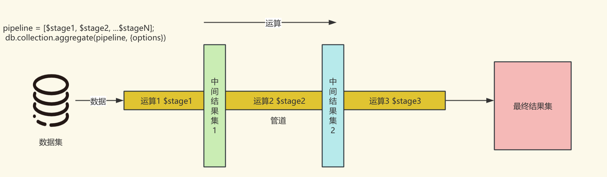
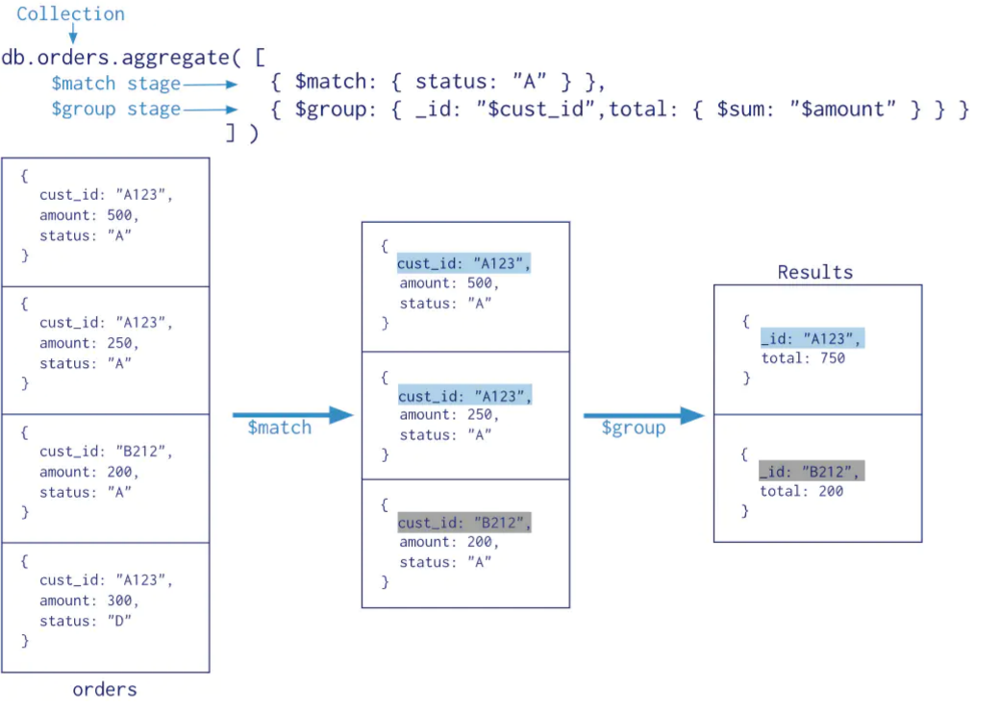

# 基本使用

## 目录

- [官网](#官网)
- [MongoDB](#MongoDB)
- [MongoDB 跟关系型数据库对比](#MongoDB跟关系型数据库对比)
- [搭建 MongoDB 服务](#搭建MongoDB服务)
  - [安装包下载](#安装包下载)
  - [启动 MongoDB 服务](#启动MongoDB-服务)
  - [关闭服务](#关闭服务)
  - [配置文件开启服务](#配置文件开启服务)
- [客户端安装](#客户端安装)
  - [执行简单指令](#执行简单指令)
  - [常用命令](#常用命令)
- [安全认证](#安全认证)
  - [创建用户](#创建用户)
  - [开启安全认证](#开启安全认证)
- [GUI 工具](#GUI工具)
- [基本数据操作](#基本数据操作)
  - [新建数据库](#新建数据库)
  - [新建集合](#新建集合)
  - [新增数据](#新增数据)
  - [查询数据](#查询数据)
    - [比较运算符](#比较运算符)
    - [逻辑运算符](#逻辑运算符)
  - [更新数据](#更新数据)
  - [删除数据](#删除数据)
- [聚合操作](#聚合操作)
  - [聚合管道](#聚合管道)
  - [聚合管道三要素](#聚合管道三要素)
  - [常用的管道聚合阶段](#常用的管道聚合阶段)
    - [\$match](#match)
    - [\$count](#count)
    - [\$group](#group)
      - [accumulator 操作符](#accumulator操作符)
    - [\$lookup](#lookup)
- [SpringBoot 整合 MongoDB](#SpringBoot-整合-MongoDB)
  - [创建实体类](#创建实体类)
  - [添加文档](#添加文档)
  - [查询文档](#查询文档)
  - [更新文档](#更新文档)
  - [删除文档](#删除文档)

### 官网

[官网](https://www.mongodb.com/docs "官网")

### MongoDB

- 文档数据库-以 JSON 为数据模型
- 一款介于关系数据库和非关系数据库之间的产品

### MongoDB 跟关系型数据库对比

| SQL                  | MongoDB                |
| -------------------- | ---------------------- |
| 数据库（database）   | 数据库（database）     |
| 表（table）          | 集合（collection）     |
| 行（row）            | 文档（document）       |
| 列（column）         | 字段（field）          |
| 索引（index）        | 索引（index）          |
| 主键（primary key）  | 字段 \\\_id            |
| 视图（view）         | 视图（view）           |
| 表连接（table join） | 聚合操作（\\\$lookup） |

### 搭建 MongoDB 服务

MongoDB 的服务搭建还是非常简单的

[https://www.mongodb.com/try/download/community-kubernetes-operator](https://www.mongodb.com/try/download/community-kubernetes-operator "https://www.mongodb.com/try/download/community-kubernetes-operator")

#### 安装包下载

可到该页面拿到对应的下载链接，选择合适自己的系统

```bash
wget https://fastdl.mongodb.org/linux/mongodb-linux-x86_64-rhel8-8.0.0.tgz linux版本下载安装包
```

如果下载过程中出现无法建立 SSL 连接的情况可以设置参数跳过 SSL 连接检查

```bash
 wget https://fastdl.mongodb.org/linux/mongodb-linux-x86_64-rhel8-8.0.0.tgz --no-check-certificate 跳过SSL连接检查
```

下载完成后解压

```java
tar -zxvf mongodb-linux-x86_64-rhel8-8.0.0.tgz 解压mongdb压缩包
```

#### 启动 MongoDB 服务

我们只需要进入 MongoDB 提供的 bin 目录

```bash
cd mongodb-linux-x86_64-rhel88-8.0.0/bin/
```

会看到有 3 个可运行程序

- install_compass
- mongod mongodb 服务的运行程序
- mongos mongodb 分片集群相关的运行程序

创建日志和数据存储的文件夹,这样便于我们后面可以更加方便的查看日志和数据

```bash
 mkdir -p /mongodb/data /mongodb/log

 touch /mongodb/log/mongodb.log
```

当然也可以参考进行 yum 的安装

[https://www.mongodb.com/zh-cn/docs/manual/tutorial/install-mongodb-on-red-hat/](https://www.mongodb.com/zh-cn/docs/manual/tutorial/install-mongodb-on-red-hat/ "https://www.mongodb.com/zh-cn/docs/manual/tutorial/install-mongodb-on-red-hat/")

万事俱备，可以开启服务了

```bash

bin/mongod --port=27017 --dbpath=/mongodb/data --logpath=/mongodb/log/mongodb.log --bind_ip=0.0.0.0 --fork 开启服务
```

这里有几个参数我们需要认识

- —dbpath 指定数据文件存放位置
- —logpath 指定日志文件存放位置
- —logappend 使用追加的方式记录日志
- —port 端口 默认 27017
- —bind_ip 绑定 ip
- —fork 后台启动
- —auth 开启认证模式

#### 关闭服务

关闭服务只需要—showdown 即可

```bash

bin/mongod --port=27017 --dbpath=/mongodb/data --logpath=/mongodb/log/mongodb.log --bind_ip=0.0.0.0 --fork --shutdown 关闭服务
```

#### 配置文件开启服务

当然，如何觉得这样开启服务太不方便了，可以将配置存储到配置文件当中，通过配置文件启动 mongodb

创建配置文件

```bash
touch /mongodb/conf/mongod.conf
```

写入配置

```yaml
systemLog:
  destination: file
  path: /mongodb/log/mongod.log
  logAppend: true
storage:
  dbPath: /mongodb/data
  engine: wiredTiger #存储引擎
net:
  bindIp: 0.0.0.0
  port: 27017
processManagement:
  fork: true
```

开启服务

```bash
bin/mongod -f /mongodb/conf/mongod.conf 开启服务
```

### 客户端安装

服务是搭建好了，接下来可以下载 mongodb shell 这个 Mongodb 提供的客户端进行服务端连接与交互了

同样的到官网获取下载链接

[https://www.mongodb.com/try/download/shell](https://www.mongodb.com/try/download/shell "https://www.mongodb.com/try/download/shell")

执行指令

```bash
wget https://downloads.mongodb.com/compass/mongosh-2.3.1-linux-x64.tgz
```

解压压缩包

```bash
tar -zxvf mongosh-2.3.1-linux-x64.tgz
```

接下来执行 mongosh 即可

```bash
bin/mongosh
```

其中 —host 可以指定连接 IP&#x20;

#### 执行简单指令

我们可以执行 show dbs 查看数据库信息

执行 show tables 查看集合信息

执行 db.system.version.find()查看 mongodb 的版本信息

可以发现的我们执行 db.system.version.find()就像我们面向对象编程一样 xx.xx.xx()执行一个方法

#### 常用命令

| 命令                                                          | 解释                                                   |
| ------------------------------------------------------------- | ------------------------------------------------------ |
| \`show dbs\`                                                  | 显示所有数据库列表                                     |
| \`use \<database>\`                                           | 切换到指定数据库                                       |
| \`db\`                                                        | 显示当前数据库                                         |
| \`show collections\`                                          | 显示当前数据库中的所有集合（collection）               |
| \`db.createCollection(name, options)\`                        | 在当前数据库中创建一个新的集合                         |
| \`db.\<collection>.insertOne(document)\`                      | 向集合中插入一个文档                                   |
| \`db.\<collection>.insertMany(\[documents])\`                 | 向集合中插入多个文档                                   |
| \`db.\<collection>.find(query, projection)\`                  | 从集合中查询文档，可以指定查询条件和投影（返回的字段） |
| \`db.\<collection>.findOne(query, projection)\`               | 从集合中查询一个文档，可以指定查询条件和投影           |
| \`db.\<collection>.updateOne(filter, update, options)\`       | 更新集合中的单个文档                                   |
| \`db.\<collection>.updateMany(filter, update, options)\`      | 更新集合中的多个文档                                   |
| \`db.\<collection>.replaceOne(filter, replacement, options)\` | 替换集合中的单个文档                                   |
| \`db.\<collection>.deleteOne(filter, options)\`               | 删除集合中的一个文档                                   |
| \`db.\<collection>.deleteMany(filter, options)\`              | 删除集合中的多个文档                                   |
| \`db.\<collection>.countDocuments(query)\`                    | 计算符合查询条件的文档数量                             |
| \`db.dropDatabase()\`                                         | 删除当前数据库                                         |
| \`db.\<collection>.drop()\`                                   | 删除当前数据库中的集合                                 |
| \`db.stats()\`                                                | 显示当前数据库的统计信息                               |
| \`db.\<collection>.stats()\`                                  | 显示当前集合的统计信息                                 |
| \`db.getMongo()\`                                             | 显示当前数据库的连接信息                               |
| \`db.serverStatus()\`                                         | 显示 MongoDB 服务器的当前状态                          |
| \`db.version()\`                                              | 显示 MongoDB 服务器的版本信息                          |

### 安全认证

#### 创建用户

Mongodb 也是有提供安全认证的，安全认证的信息就存储在 admin 这个集合中，当我们输入以下命令时，可以获取到 Mongodb 提供的所有的角色

```bash
use admin


show roles

-- 结果
[
  {
    role: 'dbOwner',
    db: 'admin',
    isBuiltin: true,
    roles: [],
    inheritedRoles: []
  },
  {
    role: '__queryableBackup',
    db: 'admin',
    isBuiltin: true,
    roles: [],
    inheritedRoles: []
  },
  {
    role: 'userAdmin',
    db: 'admin',
    isBuiltin: true,
    roles: [],
    inheritedRoles: []
  },
  {
    role: 'readWriteAnyDatabase',
    db: 'admin',
    isBuiltin: true,
    roles: [],
    inheritedRoles: []
  },
  {
    role: 'enableSharding',
    db: 'admin',
    isBuiltin: true,
    roles: [],
    inheritedRoles: []
  },
  {
    role: 'directShardOperations',
    db: 'admin',
    isBuiltin: true,
    roles: [],
    inheritedRoles: []
  },
  {
    role: 'readWrite',
    db: 'admin',
    isBuiltin: true,
    roles: [],
    inheritedRoles: []
  },
  {
    role: 'clusterManager',
    db: 'admin',
    isBuiltin: true,
    roles: [],
    inheritedRoles: []
  },
  {
    role: 'readAnyDatabase',
    db: 'admin',
    isBuiltin: true,
    roles: [],
    inheritedRoles: []
  },
  {
    role: '__system',
    db: 'admin',
    isBuiltin: true,
    roles: [],
    inheritedRoles: []
  },
  {
    role: 'root',
    db: 'admin',
    isBuiltin: true,
    roles: [],
    inheritedRoles: []
  },
  {
    role: 'read',
    db: 'admin',
    isBuiltin: true,
    roles: [],
    inheritedRoles: []
  },
  {
    role: 'dbAdminAnyDatabase',
    db: 'admin',
    isBuiltin: true,
    roles: [],
    inheritedRoles: []
  },
  {
    role: 'clusterMonitor',
    db: 'admin',
    isBuiltin: true,
    roles: [],
    inheritedRoles: []
  },
  {
    role: 'dbAdmin',
    db: 'admin',
    isBuiltin: true,
    roles: [],
    inheritedRoles: []
  },
  {
    role: 'userAdminAnyDatabase',
    db: 'admin',
    isBuiltin: true,
    roles: [],
    inheritedRoles: []
  },
  {
    role: 'restore',
    db: 'admin',
    isBuiltin: true,
    roles: [],
    inheritedRoles: []
  },
  {
    role: 'backup',
    db: 'admin',
    isBuiltin: true,
    roles: [],
    inheritedRoles: []
  },
  {
    role: 'hostManager',
    db: 'admin',
    isBuiltin: true,
    roles: [],
    inheritedRoles: []
  },
  {
    role: 'clusterAdmin',
    db: 'admin',
    isBuiltin: true,
    roles: [],
    inheritedRoles: []
  }
]

```

那么基于这些角色，我们可以使用 db.createUser()命令来创建用户

```mongodb
db.createUser({user:"tang",pwd:"tang",roles:["userAdmin"]}) 创建用户语句
```

当然我们平时使用的时候不会直接赋予用户 Admin 角色的，如果是只是给用户对应的 DB 权限，可以到对应的 DB，然后给用户 dbOwner 权限

```mongodb
use appdb

db.createUser({user:"tang",pwd:"tang",roles:["dbOwner"]})


```

#### 开启安全认证

我们只需要在启动服务的时候添加—auth 参数，表示启动安全认证就行了

```bash
bin/mongod -f /mongodb/conf/mongod.conf --auth
```

然后在使用 mongosh 进行客户端连接的时候通过—username —password 来输入对应的用户名密码即可

```bash
mongosh --username tang --password tang
```

## GUI 工具

MongoDB 提供了非常不错的 GUI 工具来协助我们进行 Mongodb 的数据操作，以下是下载地址

[https://www.mongodb.com/try/download/compass](https://www.mongodb.com/try/download/compass "https://www.mongodb.com/try/download/compass")

## 基本数据操作

### 新建数据库

Mongodb 中，使用 use + 数据库名是指有数据库则使用数据库，没有的话就创建一个该命名的数据库，使用起来还是非常方便的

```mongodb
use test_db
```

### 新建集合

跟 SQL 一样的是，我们需要先创建库，再创建表，在 mangodb 中就是集合，才能插入数据

```mongodb
db.createCollection("test_collection")
```

### 新增数据

MongoDB 新增数据是以 JSON 的格式新增的，而且调用的方式跟我们面向对象编程的方式是一样的，db.集合名.insert(JSON 数据)

```mongodb
// 插入单条数据
db.test_collection.insert({"id":"1","name":"zs"})

//查询结果
[
  { _id: ObjectId('67054659b320d640c7964033'), id: '1', name: 'zs' }
]

//插入多条数据
db.test_collection.insertMany([{"id":"3","name":"ww"},{"id":"2","name":"ls"}])

//查询结果
[
  { _id: ObjectId('67054659b320d640c7964033'), id: '1', name: 'zs' },
  { _id: ObjectId('67054718b320d640c7964034'), id: '3', name: 'ww' },
  { _id: ObjectId('67054718b320d640c7964035'), id: '2', name: 'ls' }
]


```

而且对于 MongoDB 来说，我们可以随时增加一个字段

```mongodb
db.test_collection.insert({"id":"4","name":"ll","sex":"man"})

//查询结果
[
  { _id: ObjectId('67054659b320d640c7964033'), id: '1', name: 'zs' },
  { _id: ObjectId('67054718b320d640c7964034'), id: '3', name: 'ww' },
  { _id: ObjectId('67054718b320d640c7964035'), id: '2', name: 'ls' },
  {
    _id: ObjectId('67054779b320d640c7964036'),
    id: '4',
    name: 'll',
    sex: 'man'
  }
]

```

如果想数据保持不丢失，那么我们需要通过 wirteConcern 的 j 设置为 true 保证每次写入数据都要对数据进行持久化，也可以 wirteConcern 的 w 参数设置同步节点

```mongodb
db.test_collection.insert({"id":"4","name":"ll","sex":"man"},
{
  wirteConcern: {w:"majority",j:true,wtimeout: 5000}
})
```

当然想知道更多的指令,可以通过 db.test_collection.help()方法来查看

### 查询数据

查询数据也是非常简单的，通过 db.集合名.find()可以查询到以 20 为页的数据，可以通过输入 it 来进行翻页浏览

等值条件查询的话需要配合 json 数据才可以进行查询，比如以下语句是查询 id 为 3 的数据

```mongodb
db.test_collection.find({"id":"3"})
```

#### 比较运算符

这只是等值查询，那如果是大于，小于这种呢？我们需要配合 mongodb 提供我们的特殊运算符一起使用才可以

| 运算符 | MQL                 |
| ------ | ------------------- |
| a=1    | {a:1}               |
| a <> 1 | {a:{\\\$ne : 1}}    |
| a > 1  | {a:{\\\$gt:1}}      |
| a>=1   | {a: {\\\$gte : 1}}  |
| a<1    | {a:{\\\$lt : 1}}    |
| a<=1   | {a: { \\\$lte : 1}} |

#### 逻辑运算符

除了比较，我们一般还会将比较条件合并成复合条件，比如 a=1 和 b =1 类似的条件，在 SQL 中就是 AND 和 OR，在 MongoDB 我们仍然是需要配置成 json 的方式

| 运算符         | MQL                              |
| -------------- | -------------------------------- |
| a=1 AND b=1    | {\\\$and:\\\[{a : 1 , b : 1 }]}  |
| a = 1 OR b = 1 | {\\\$or : \\\[{a : 1 , b : 1 }]} |
| a IS NULL      | {a : {\\\$exists : false}}       |
| a IN (1,2,3 )  | {a : {\\\$in : \\\[1,2,3]}}      |

当然分页 limit

```mongodb
db.people.find().limit(1)

```

排序 sort()

```mongodb
db.users.find({ }).sort( { age : -1, posts: 1 } )


```

### 更新数据

更新数据可以通过\$set 来进行数据设置

```mongodb
db.people.updateMany(
   { age: { $gt: 25 } },
   { $set: { status: "C" } }
)
```

还有一种可以是可以使用 findAndModify()方法进行更新

```mongodb
db.books.findAndModify({

  query:{条件json},
  update:{更新方式},
  new: true //是否返回最新值，如果不填true返回的是旧值

})
```

### 删除数据

```mongodb
db.people.deleteMany( { status: "D" } )

```

当然也可以通过 findOneAndDelete()删除一项符合条件的数据，而且该方法是有序删除，意味着我们可以通过该方法实现队列先进先出的效果

```mongodb
db.books.finndOneAndDelete(条件json)
```

Mongodb 提供了非常多的操作数据的方法，详细的可以看官网，官网提供了很多的示例，也提供了 SQL 和 MongoDB 的对比，非常方便记忆

[https://www.mongodb.com/zh-cn/docs/manual/reference/sql-comparison/](https://www.mongodb.com/zh-cn/docs/manual/reference/sql-comparison/ "https://www.mongodb.com/zh-cn/docs/manual/reference/sql-comparison/")

## 聚合操作

#### 聚合管道

聚合管道是 Mongodb 中用于数据聚合和处理的强大工具。它允许开发者通过一系列有序的阶段（Stages）对数据进行筛选、转换、分组和计算，从而生成符合需求的聚合结果。每个阶段都定义了一种操作，数据在每个阶段经过处理后，传递给下一个阶段，最终得到所需的聚合结果。

其实效果跟我们使用 SQL 中的 join on ，group by，sort by 是一样的，而聚合管道的核心原理是基于流水线处理模式。数据从输入开始，依次流经每个阶段，每个阶段都执行特定的操作，并将处理后的数据传递给下一个阶段。



#### 聚合管道三要素

1\. 流水线处理

聚合管道采用流水线处理模式，这意味着数据从输入开始，通过一个接一个的阶段（Stages）进行处理，直到达到最终输出。每个阶段都负责执行特定的操作，如筛选、分组、排序等。

2\. 阶段（Stages）

聚合管道由多个阶段组成，每个阶段都定义了对数据执行的操作。这些阶段是有序的，数据按照定义的顺序流经每个阶段。每个阶段都可以使用不同的操作符来执行不同的操作。

3\. 操作符（Operators）

操作符是定义在聚合管道阶段中的指令，它们告诉 MongoDB 如何处理数据。例如，match 操作符用于筛选文档， group 操作符用于将文档分组

下面的图示将 Mongodb 拆分得非常仔细了，不过最好还是到官网翻一翻，官网提供的 SQL+MongoDB 的对比理解真的可以帮助我们更快地学习这部分内容的：

[https://www.mongodb.com/zh-cn/docs/manual/reference/operator/aggregation-pipeline/](https://www.mongodb.com/zh-cn/docs/manual/reference/operator/aggregation-pipeline/ "https://www.mongodb.com/zh-cn/docs/manual/reference/operator/aggregation-pipeline/")



#### 常用的管道聚合阶段

| MongoDB 聚合阶段/表达式 | 描述                                             | SQL 对应操作                                                        |
| ----------------------- | ------------------------------------------------ | ------------------------------------------------------------------- |
| \`\$group\`             | 将集合中的文档分组，用于统计结果                 | \`GROUP BY\`                                                        |
| \`\$match\`             | 过滤数据，只输出符合条件的文档                   | \`WHERE\`                                                           |
| \`\$project\`           | 修改输入文档的结构，选择、重命名、增加或删除字段 | \`SELECT\`                                                          |
| \`\$lookup\`            | 左外连接                                         | \`LEFT OUTER JOIN\`                                                 |
| \`\$sort\`              | 将输入文档排序后输出                             | \`ORDER BY\`                                                        |
| \`\$limit\`             | 限制聚合管道返回的文档数                         | \`LIMIT\`                                                           |
| \`\$skip\`              | 跳过指定数量的文档，返回余下的文档               | \`OFFSET\`                                                          |
| \`\$sum\`               | 计算总和                                         | \`SUM\`                                                             |
| \`\$avg\`               | 计算平均值                                       | \`AVG\`                                                             |
| \`\$min\`               | 获取最小值                                       | \`MIN\`                                                             |
| \`\$max\`               | 获取最大值                                       | \`MAX\`                                                             |
| \`\$push\`              | 在结果文档中插入值到一个数组中                   | -（SQL 中没有直接对应操作，通常需要结合\`GROUP BY\`和聚合函数使用） |

使用起来也是基于 json 格式来使用的，xx.xx.aggregate(\[\$stage1 , \$stage2 ... ])

##### \$match

跟 where 很相似，\$match 是用于对文档进行条件筛选

在使用的时候，可以尽量将\$match 提到前面去，这样一是可以在后面的管道操作里面尽量对更少的数据进行处理，二是如果在投射和分组之前执行\$match，查询会使用到索引

```mongodb
// 找到category为科普的book数据
db.book.aggregate([{$match:{category:"科普"}}])
```

##### \$count

计数并返回查询匹配的结果树

```mongodb
// 返回category为科普且计算其总数赋值给kepu_total
db.book.aggregate([{$match:{category:"科普"}},{$count: "kepu_total"}])
```

##### \$group

按指定的表达式对文档进行分组，并将每个不同分组的文档输出到下一个阶段。

```mongodb
{ $group: { _id: <expression>, <field1>: { <accumulator1> : <expression1> }, ... } } 语法
```

- \_id 字段是必填的;但是，可以指定\_id 值为 null 来为整个输入文档计算累计值。
- 剩余的计算字段是可选的，并使用\<accumulator>运算符进行计算。
- \_id 和\<accumulator>表达式可以接受任何有效的表达式。

另外，group 阶段的内存限制为 100M。默认情况下，如果 stage 超过此限制，group 将产生错误。但是，要允许处理大型数据集，请将 allowDiskUse 选项设置为 true 以启用\$group 操作以写入临时文件。

###### accumulator 操作符

| MongoDB accumulator 操作符 | 描述                                                   |
| -------------------------- | ------------------------------------------------------ |
| \`\$sum\`                  | 计算分组内值的总和。                                   |
| \`\$avg\`                  | 计算分组内值的平均值。                                 |
| \`\$first\`                | 从分组中的文档获取第一个值。                           |
| \`\$last\`                 | 从分组中的文档获取最后一个值。                         |
| \`\$max\`                  | 获取分组内的最大值。                                   |
| \`\$min\`                  | 获取分组内的最小值。                                   |
| \`\$push\`                 | 将分组内的值添加到一个数组中。                         |
| \`\$addToSet\`             | 将分组内的值添加到一个集合中，确保集合中的值是唯一的。 |
| \`\$stdDevPop\`            | 计算分组内值的总体标准偏差。                           |
| \`\$stdDevSamp\`           | 计算分组内值的样本标准偏差。                           |

```mongodb
// 不对字段分组，并计算总数和price的平均值
db.book.aggregate([{$group:{_id:null , count: {$sum:1},avg:{$avg:"$price"}}}])
```

```mongodb
// 根据category进行分组计算总数和price的平均数
db.book.aggregate([{$group:{_id:"$category" , count: {$sum:1},avg:{$avg:"$price"}}}])
```

##### \$lookup

每个输入待处理的文档，经过\$lookup 阶段的处理，输出的新文档中会包含一个新生成的数组（可根据需要命名新 key ）。数组列存放的数据是来自被 Join 集合的适配文档，如果没有，集合为空（即 为\[ ])

```mongodb
 db.collection.aggregate([{
   $lookup: {
   from: "<collection to join>",
   localField: "<field from the input documents>",
   foreignField: "<field from the documents of the from collection>",
   as: "<output array field>"
   }
 }) 语法
```

- from 同一个数据库下等待被 Join 的集合
- localField 源集合中的 match 值，如果输入的集合中，某文档没有 localField 这个 Key（Field），在处理的过程中，会默认为此文档含有 localField：null 的键值对
- foreignField 待 Join 的集合的 match 值，如果待 Join 的集合中，文档没有 foreignField 值，在处理的过程中，会默认为此文档含有 foreignField：null 的键值对。
- as 为输出文档的新增值命名。如果输入的集合中已存在该值，则会覆盖掉

```mongodb
// join order on book.id = order.bookId
db.book.aggregate([{$lookup:{from: "order" , localField: "_id" , foreignField : "bookId" , as:"o"}}])
```

更多的可以自行查看文档，Mongodb 的文档还是非常不错的

[https://www.mongodb.com/zh-cn/docs/manual/reference/operator/aggregation-pipeline/](https://www.mongodb.com/zh-cn/docs/manual/reference/operator/aggregation-pipeline/ "https://www.mongodb.com/zh-cn/docs/manual/reference/operator/aggregation-pipeline/")

## SpringBoot 整合 MongoDB

SpringBoot 对 MongoDB 有着不错的支持，所以整合 MongoDB 也是比较简单的，首先我们先开启 SpringBoot 提供的 mongodb 的 starter

```xml
<dependency>
  <groupId>org.springframework.boot</groupId>
  <artifactId>spring-boot-starter-data-mongodb</artifactId>
</dependency>
```

配置 mongodb 信息

```yaml
server:
  port: 8002
spring:
  data:
    mongodb:
    uri: mongodb://127.0.0.1:27017/test
```

连接格式如下：mongodb+srv://\[username:password@]host\[/\[defaultauthdb]\[?options]]

具体的可看官网:[https://www.mongodb.com/zh-cn/docs/manual/reference/connection-string/](https://www.mongodb.com/zh-cn/docs/manual/reference/connection-string/ "https://www.mongodb.com/zh-cn/docs/manual/reference/connection-string/")

接下来我们就可以使用 SpringBoot 提供的 MongoTemplate 就行了

```java
    @Autowired
    private MongoTemplate mongoTemplate;


    @Test
    public void testCollection(){
        boolean exists = mongoTemplate.collectionExists("book");
        if (exists){
            mongoTemplate.dropCollection("book");
        }
        mongoTemplate.createCollection("book");
    }
```

### 创建实体类

跟使用 Mybatis 一样，我们要创建一个实体类和数据库中我们定义的数据属性进行关系映射

- Document 指定文档名称
- @Id 指定 Id 属性
- @Field 指定字段名称

```java
@Document("book")
@Data
@AllArgsConstructor
public class Books {

    @Id
    private Long id;

    @Field("bookName")
    private String bookName;

    @Field("description")
    private String description;

    @Field("author")
    private String author;

    @Field("category")
    private String category;

    @Field("price")
    private Double price;

}
```

### 添加文档

紧接着就可以写 Dao 层了，跟 Mybatis 一样，只需要调用提供的 insert API 就可以实现插入数据或者批量插入数据了

使用 save 也可以实现保存数据，但是 insert 可以一次性插入数据，而 save 会先遍历所有数据，再一个一个插入数据

```java
    /**
     * @Description 保存
     * @Author T
     * @Date 2024/10/19 15:25
     **/
    public void saveBook(Books books) {
        mongoTemplate.insert(books);
    }

    /**
     * @Description 批量保存
     * @Author T
     * @Date 2024/10/19 15:25
     **/
    public void saveBookList(List<Books> books) {
        mongoTemplate.insert(books, Books.class);
    }
```

### 查询文档

首先是基础查询，即没有带条件的查询

```java
    /**
     * @Description 查询所有
     * @Author T
     **/
    public List<Books> selectList() {
        return mongoTemplate.findAll(Books.class);
    }

    /**
     * @Description 查询一条记录
     * @Author T
     **/
    public Books selectOne() {
        return mongoTemplate.findOne(new Query(), Books.class);
    }
     /**
     * @Description 根据ID查询记录
     * @Author T
     **/
    public Books selectById(Long id) {
        return mongoTemplate.findById(id, Books.class);
    }
```

条件查询的话就需要 Criteria 这个接口将单个或多个条件组合一起，一起进行查询

```java
     public List<Books> selectByCondition(Books books) {
         Query query = new Query();
         if (!ObjectUtils.isEmpty(books.getAuthor())){
             //基于正则模糊查询
             query.addCriteria(Criteria.where("author").regex(books.getAuthor()));
         }
         if (!ObjectUtils.isEmpty(books.getPrice())){
             //查询price大于books.getPrice()的数据
             query.addCriteria(Criteria.where("price").gt(books.getPrice()));
             //查询price大于等于40的数据
             // query.addCriteria(Criteria.where("price").gte(40));
         }
        return mongoTemplate.find(query, Books.class);
    }
```

如果要联合条件的话，我们就需要通过 Criteria 的 andOperator 或者 orOperator 构建 Criteria 了

```java
     public List<Books> selectByCondition(Books books) {
         Query query = new Query();
         Criteria criteria = new Criteria();
         //查询author 包含Bruce 且 price >= 40的数据
         criteria.andOperator(Criteria.where("author").regex("Bruce"),Criteria.where("price").gte(40.0));
        return mongoTemplate.find(query, Books.class);
    }

```

当然还有排序，也可以通过 Query.with 进行配置

```java
public List<Books> selectByCondition(Books books) {
         ...
         //基于price 进行排序
         query.with(Sort.by(Sort.Direction.DESC, "price"));
        return mongoTemplate.find(query, Books.class);
    }
```

还有

- .skip(0) //指定跳过记录数
- &#x20;.limit(4); //每页显示记录数

### 更新文档

更新返回的结果都是受行数影响，如果更新前后的结果一样，则返回 0，提供的 API 有

- updateFirst() 只更新满足条件的第一条记录
- updateMulti() 更新所有满足条件的记录
- upsert() 没有符合条件的记录则插入数据

```java
     public void update() {
         //查询price大于80的数据
         Query query = new Query();
         query.addCriteria(Criteria.where("price").gt(80.0));
         //更新数据
         Update update = new Update();
         //price 更新为 70
         update.set("price", 70.0);
         //price大于80的都更新为70
         UpdateResult updateResult = mongoTemplate.updateMulti(query, update, Books.class);
         System.out.println("更新的记录数：" + updateResult.getModifiedCount());
         //如果没有的则添加一条记录
         query.addCriteria(Criteria.where("id").is(10));
         updateResult = mongoTemplate.upsert(query,update, Books.class);
         System.out.println("更新的记录数：" + updateResult.getModifiedCount());


     }
```

### 删除文档

删除文档就比较简单了，提供条件并调用 mongoTemplate.remove 即可

```java
    public void deleteById(Long id) {
        mongoTemplate.remove(new Query(Criteria.where("id").is(id)), Books.class);
    }
```
