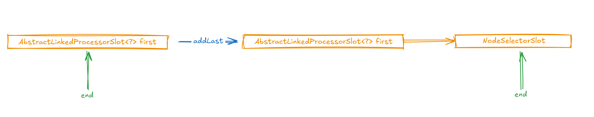
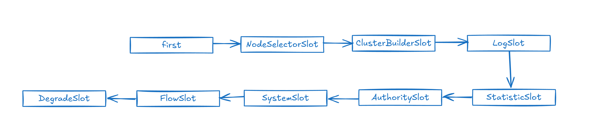

# Sentinel源码剖析 - 代码架构

## 目录

- [Sentinel的架构设计](#Sentinel的架构设计)
  - [Sentinel的熔断降级](#Sentinel的熔断降级)
    - [Sentinel如何进行熔断降级](#Sentinel如何进行熔断降级)
  - [揭秘@SentinelResource注解](#揭秘SentinelResource注解)
    - [SentinelAutoConfiguration](#SentinelAutoConfiguration)
    - [SentinelResourceAspect ](#SentinelResourceAspect-)
    - [SphU.entry](#SphUentry)
      - [com.alibaba.csp.sentinel.CtSph#entryWithPriority(com.alibaba.csp.sentinel.slotchain.ResourceWrapper, int, boolean, java.lang.Object...)](#comalibabacspsentinelCtSphentryWithPrioritycomalibabacspsentinelslotchainResourceWrapper-int-boolean-javalangObject)
      - [com.alibaba.csp.sentinel.CtSph#lookProcessChain](#comalibabacspsentinelCtSphlookProcessChain)
        - [com.alibaba.csp.sentinel.slotchain.SlotChainProvider#newSlotChain](#comalibabacspsentinelslotchainSlotChainProvidernewSlotChain)
    - [透析DefaultProcessorSlotChain的结构](#透析DefaultProcessorSlotChain的结构)
      - [com.alibaba.csp.sentinel.slots.DefaultSlotChainBuilder](#comalibabacspsentinelslotsDefaultSlotChainBuilder)
      - [com.alibaba.csp.sentinel.slotchain.DefaultProcessorSlotChain](#comalibabacspsentinelslotchainDefaultProcessorSlotChain)
        - [DefaultProcessorSlotChain如何执行？](#DefaultProcessorSlotChain如何执行)
    - [解析DefaultProcessorSlotChain中的每一个Solt](#解析DefaultProcessorSlotChain中的每一个Solt)
      - [first](#first)
      - [NodeSelectorSlot](#NodeSelectorSlot)
      - [ClusterBuilderSlot ](#ClusterBuilderSlot-)
      - [LogSlot ](#LogSlot-)
      - [StatisticSlot ](#StatisticSlot-)
      - [AuthoritySlot ](#AuthoritySlot-)
      - [SystemSlot ](#SystemSlot-)
      - [FlowSlot ](#FlowSlot-)
      - [DegradeSlot ](#DegradeSlot-)
  - [总结](#总结)

## Sentinel的架构设计

### Sentinel的熔断降级

#### Sentinel如何进行熔断降级

Sentinel如何做服务熔断降级的呢？其实非常简单，只需一个注解就能搞定，那就是@SentinelResource注解

```java 
    @SentinelResource(value = "getById",blockHandler = "handleException")
    public Student getById(Integer id) {
        return studentDao.selectById(id);
    }

    public Student handleException(Integer id, BlockException ex) {
        Student userEntity = new Student();
        userEntity.setName("===被限流降级啦===");
        return userEntity;
    }
```


所以答案很明显，我们想要了解Sentinel的熔断降级，那只需要解密@SentinelResource注解就行了\~

### 揭秘@SentinelResource注解

首先我们要清楚，这个注解源自于哪里，显然这是源自于spring-cloud-starter-alibaba-sentinel

```xml 
        <dependency>
            <groupId>com.alibaba.cloud</groupId>
            <artifactId>spring-cloud-starter-alibaba-sentinel</artifactId>
        </dependency>
```


而笔者在这里也想分享一下阅读代码的经验，凡是看到这种starter的包，我们都应该第一时间想到以该包的spring.factories作为切入口，当然这是springboot2.x的切入口，如果是springboot3.x的话就需要换到org.springframework.boot.autoconfigure.AutoConfiguration.imports这里来看了，因为springboot3.x修改了自动装配类的装配方式。

```text 
com.alibaba.cloud.sentinel.SentinelWebAutoConfiguration
com.alibaba.cloud.sentinel.SentinelWebFluxAutoConfiguration
com.alibaba.cloud.sentinel.endpoint.SentinelEndpointAutoConfiguration
com.alibaba.cloud.sentinel.custom.SentinelAutoConfiguration
com.alibaba.cloud.sentinel.feign.SentinelFeignAutoConfiguration

```


看到这些类，该看哪个呢？一般来说我们可以先看xxxAutoConfiguration，而剩下的xxxWebAutoConfiguration等这些其实都属于是一种增强，或者说应用于某种环境下的。而xxxAutoConfiguration这种是前导自动配置，是一定会生效的配置，所以我们就先来看看这SentinelAutoConfiguration到底做了些啥\~

#### SentinelAutoConfiguration

而来到这个类之后，我们必须要先有一个意识，就是@SentinelResource这个注解，就是用于增强我们的请求方法的，所以毫无疑问，这个是AOP的功劳，所以我们先大体浏览一下，就能够顺利看到跟AOP相关的一段代码，Aspect就是关键词。

```java 
  
@Configuration(proxyBeanMethods = false)
@ConditionalOnProperty(name = "spring.cloud.sentinel.enabled", matchIfMissing = true)
@EnableConfigurationProperties(SentinelProperties.class)
public class SentinelAutoConfiguration {
  ...
  @Bean
  @ConditionalOnMissingBean
  public SentinelResourceAspect sentinelResourceAspect() {
    return new SentinelResourceAspect();
  }  
  ...
}
```


带着推理和思考的方式看代码，往往能够事半功倍，这也是笔者看了Spring，SpringBoot源码后慢慢养成的一种习惯吧\~当然这也是需要我们先了解Spring，SpringBoot这种基底框架才能慢慢有着经验的。

#### SentinelResourceAspect&#x20;

猴，我们根据sentinelResourceAspect方法来到了SentinelResourceAspect 类，看到这个类，说明我们想得没错了，这个类就是用于应对@SentinelResource注解的处理的代码。

```java 
@Aspect
public class SentinelResourceAspect extends AbstractSentinelAspectSupport {
    
    
    //定义切点
    @Pointcut("@annotation(com.alibaba.csp.sentinel.annotation.SentinelResource)")
    public void sentinelResourceAnnotationPointcut() {
    }

    @Around("sentinelResourceAnnotationPointcut()")
    public Object invokeResourceWithSentinel(ProceedingJoinPoint pjp) throws Throwable {
        Method originMethod = resolveMethod(pjp);
        
        //获取SentinelResource 注解
        SentinelResource annotation = originMethod.getAnnotation(SentinelResource.class);
        if (annotation == null) {
            // Should not go through here.
            throw new IllegalStateException("Wrong state for SentinelResource annotation");
        }
        //将注解的内容获取出来进行封装
        //@SentinelResource(value = "getById",blockHandler = "handleException")
        String resourceName = getResourceName(annotation.value(), originMethod);
        EntryType entryType = annotation.entryType();
        int resourceType = annotation.resourceType();
        Entry entry = null;
        try {
            //Sentinel熔断降低的核心方法：SphU.entry
            entry = SphU.entry(resourceName, resourceType, entryType, pjp.getArgs());
            return pjp.proceed();
        } catch (BlockException ex) {
            return handleBlockException(pjp, annotation, ex);
        } catch (Throwable ex) {
            Class<? extends Throwable>[] exceptionsToIgnore = annotation.exceptionsToIgnore();
            // The ignore list will be checked first.
            if (exceptionsToIgnore.length > 0 && exceptionBelongsTo(ex, exceptionsToIgnore)) {
                throw ex;
            }
            if (exceptionBelongsTo(ex, annotation.exceptionsToTrace())) {
                traceException(ex);
                return handleFallback(pjp, annotation, ex);
            }

            // No fallback function can handle the exception, so throw it out.
            throw ex;
        } finally {
            if (entry != null) {
                entry.exit(1, pjp.getArgs());
            }
        }
    }
}
```


#### SphU.entry

先来跟踪跟踪SphU.entry这个核心方法拿了资源做了些什么？

##### com.alibaba.csp.sentinel.CtSph#entryWithPriority(com.alibaba.csp.sentinel.slotchain.ResourceWrapper, int, boolean, java.lang.Object...)

跟着方法走一直跟到com.alibaba.csp.sentinel.CtSph#entryWithPriority为止，我们可以观察观察这个方法，来到这个方法，我们抛开if这些特殊逻辑，直接抓核心lookProcessChain方法，看该方法命名我们可以猜一猜，这貌似要构建链路呀（关键词Chain），结合@SentinelResource注解，他就是替我们在请求方法的时候做功能增强（限流，服务降级，服务熔断等），这显然是一系列的功能，所以说当资源来到这里的时候可能就需要依仗这条链路进行一系列的节点处理。是不是这样的呢？直接往里走看看呗！

```java 
private Entry entryWithPriority(ResourceWrapper resourceWrapper, int count, boolean prioritized, Object... args)
        throws BlockException {
        Context context = ContextUtil.getContext();
        if (context instanceof NullContext) {
            // The {@link NullContext} indicates that the amount of context has exceeded the threshold,
            // so here init the entry only. No rule checking will be done.
            return new CtEntry(resourceWrapper, null, context);
        }

        if (context == null) {
            // Using default context.
            context = InternalContextUtil.internalEnter(Constants.CONTEXT_DEFAULT_NAME);
        }

        // Global switch is close, no rule checking will do.
        if (!Constants.ON) {
            return new CtEntry(resourceWrapper, null, context);
        }

        ProcessorSlot<Object> chain = lookProcessChain(resourceWrapper);

        /*
         * Means amount of resources (slot chain) exceeds {@link Constants.MAX_SLOT_CHAIN_SIZE},
         * so no rule checking will be done.
         */
        if (chain == null) {
            return new CtEntry(resourceWrapper, null, context);
        }

        Entry e = new CtEntry(resourceWrapper, chain, context);
        try {
            chain.entry(context, resourceWrapper, null, count, prioritized, args);
        } catch (BlockException e1) {
            e.exit(count, args);
            throw e1;
        } catch (Throwable e1) {
            // This should not happen, unless there are errors existing in Sentinel internal.
            RecordLog.info("Sentinel unexpected exception", e1);
        }
        return e;
    }
```


##### com.alibaba.csp.sentinel.CtSph#lookProcessChain

在这个方法中，会尝试从缓存chainMap中取ProcessorSlotChain ，欸，查看查看chainMap结构，会将每个资源跟ProcessorSlotChain进行了绑定，ProcessorSlotChain是什么东西呢？我们着重看看SlotChainProvider.newSlotChain()方法，如果我们无法从缓存中获取，那便创建ProcessorSlot，所以通过SlotChainProvider.newSlotChain()方法便能解开这个谜团啦\~

```java 
    private static volatile Map<ResourceWrapper, ProcessorSlotChain> chainMap
        = new HashMap<ResourceWrapper, ProcessorSlotChain>();
    
    
    ProcessorSlot<Object> lookProcessChain(ResourceWrapper resourceWrapper) {
        //从缓存中获取该资源对应的ProcessorSlotChain 
        ProcessorSlotChain chain = chainMap.get(resourceWrapper);
        if (chain == null) {
            synchronized (LOCK) {
                //双重检索，防止在这个过程中，有其他并发线程进行了资源绑定
                chain = chainMap.get(resourceWrapper);
                if (chain == null) {
                    // Entry size limit.
                    if (chainMap.size() >= Constants.MAX_SLOT_CHAIN_SIZE) {
                        return null;
                    }
                    //构建ProcessorSlotChain 
                    chain = SlotChainProvider.newSlotChain();
                    //完成构建后重新绑定关系
                    Map<ResourceWrapper, ProcessorSlotChain> newMap = new HashMap<ResourceWrapper, ProcessorSlotChain>(
                        chainMap.size() + 1);
                    newMap.putAll(chainMap);
                    newMap.put(resourceWrapper, chain);
                    chainMap = newMap;
                }
            }
        }
        return chain;
    }
```


###### com.alibaba.csp.sentinel.slotchain.SlotChainProvider#newSlotChain

在这里就能够遇到一个非常关键的点了，SpiLoader.of(SlotChainBuilder.class)，当然我们查找SlotChainBuilder相关的SPI加载文件后会发现加载的其实是DefaultSlotChainBuilder，那其实跟后面那段是一样的，如果通过SPI机制加载不到的话就直接new 一个DefaultSlotChainBuilder，换句话说就是默认采用DefaultSlotChainBuilder这个链路构造器，这也是为开发者提供了拓展的方式啦。

如果我们没有对其进行拓展的话，就直接跑DefaultSlotChainBuilder的build方法了。

```java 
# Default slot chain builder
com.alibaba.csp.sentinel.slots.DefaultSlotChainBuilder

public final class SlotChainProvider {

    private static volatile SlotChainBuilder slotChainBuilder = null;

    public static ProcessorSlotChain newSlotChain() {
        if (slotChainBuilder != null) {
            return slotChainBuilder.build();
        }

        //基于SPI机制加载SlotChainBuilder
        slotChainBuilder = SpiLoader.of(SlotChainBuilder.class).loadFirstInstanceOrDefault();

        if (slotChainBuilder == null) {
           
            RecordLog.warn("[SlotChainProvider] Wrong state when resolving slot chain builder, using default");
            //默认使用DefaultSlotChainBuilder
            slotChainBuilder = new DefaultSlotChainBuilder();
        } else {
            RecordLog.info("[SlotChainProvider] Global slot chain builder resolved: {}",
                slotChainBuilder.getClass().getCanonicalName());
        }
        //如果我们没进行拓展，就直接跑DefaultSlotChainBuilder的build方法了
        return slotChainBuilder.build();
    }

    private SlotChainProvider() {}
}
```


#### 透析DefaultProcessorSlotChain的结构

###### com.alibaba.csp.sentinel.slots.DefaultSlotChainBuilder

直到来到这个方法，谜题就解开了，这里会在此通过SPI机制加载ProcessorSlot的接口类，同样的，我们直接找到对应的SPI文件就能找到这些ProcessorSlot了，欸，欸，欸，这不正是一个一个的节点吗？这段代码就是将这一个一个节点通过addLast的方法加到了ProcessorSlotChain 中。

```java 
# Sentinel default ProcessorSlots
com.alibaba.csp.sentinel.slots.nodeselector.NodeSelectorSlot
com.alibaba.csp.sentinel.slots.clusterbuilder.ClusterBuilderSlot
com.alibaba.csp.sentinel.slots.logger.LogSlot
com.alibaba.csp.sentinel.slots.statistic.StatisticSlot
com.alibaba.csp.sentinel.slots.block.authority.AuthoritySlot
com.alibaba.csp.sentinel.slots.system.SystemSlot
com.alibaba.csp.sentinel.slots.block.flow.FlowSlot
com.alibaba.csp.sentinel.slots.block.degrade.DegradeSlot


@Spi(isDefault = true)
public class DefaultSlotChainBuilder implements SlotChainBuilder {

    @Override
    public ProcessorSlotChain build() {
        ProcessorSlotChain chain = new DefaultProcessorSlotChain();

        List<ProcessorSlot> sortedSlotList = SpiLoader.of(ProcessorSlot.class).loadInstanceListSorted();
        for (ProcessorSlot slot : sortedSlotList) {
            if (!(slot instanceof AbstractLinkedProcessorSlot)) {
                RecordLog.warn("The ProcessorSlot(" + slot.getClass().getCanonicalName() + ") is not an instance of AbstractLinkedProcessorSlot, can't be added into ProcessorSlotChain");
                continue;
            }

            chain.addLast((AbstractLinkedProcessorSlot<?>) slot);
        }

        return chain;
    }
}

```


###### com.alibaba.csp.sentinel.slotchain.DefaultProcessorSlotChain

DefaultProcessorSlotChain是一个什么样的构造呢？通过下面的代码我们能够看得清清楚楚，在这里会有一个first的实现，类型是AbstractLinkedProcessorSlot，而上面加载的ProcessorSlots类型全都是AbstractLinkedProcessorSlot抽象类的实现类，它实现的entry和exit方法都做了啥呢？我们放在后面将，先结合上面的代码，来看看他到底呈现一个什么样的结构。

他应该呈现一个什么样的结构呢？我们看看addLast方法就知道了，当调用addLast方法的时候就会调用AbstractLinkedProcessorSlot的setNext方法其实就是让first的next节点指向了下一个AbstractLinkedProcessorSlot（比如说NodeSelectorSlot），然后将end节点也指向下一个AbstractLinkedProcessorSlot。很熟悉的用法哈，没错，这就是责任链模式的使用\~，如果我们跑了一遍addLast之后，呈现的结构就如下图



其实分析到这里我们的猜想已经是正确的了，@SentinelResource注解会帮助我们将一个一个的AbstractLinkedProcessorSlot构成一条责任链，然后我们调用的资源就会像流水线上的产品一样经过链中一个个Solt的处理，有多少Solt呢？参考SPI的加载文件

我们随便找一个solt都会看到这么一个注解，这个注解中会有一个参数叫order ，这就指明了该solt在链中是什么样的一个顺序了，这个也好理解，所以也不做细说了，最终solt们的排序如图，这些solt才是Sentinel的功能核心呢

```java 
@Spi(isSingleton = false, order = Constants.ORDER_NODE_SELECTOR_SLOT)
```




```java 
public abstract class AbstractLinkedProcessorSlot<T> implements ProcessorSlot<T> {

    ...

    public void setNext(AbstractLinkedProcessorSlot<?> next) {
        this.next = next;
    }

}


public class DefaultProcessorSlotChain extends ProcessorSlotChain {

    AbstractLinkedProcessorSlot<?> first = new AbstractLinkedProcessorSlot<Object>() {

        @Override
        public void entry(Context context, ResourceWrapper resourceWrapper, Object t, int count, boolean prioritized, Object... args)
            throws Throwable {
            super.fireEntry(context, resourceWrapper, t, count, prioritized, args);
        }

        @Override
        public void exit(Context context, ResourceWrapper resourceWrapper, int count, Object... args) {
            super.fireExit(context, resourceWrapper, count, args);
        }

    };
    AbstractLinkedProcessorSlot<?> end = first;

    ...

    @Override
    public void addLast(AbstractLinkedProcessorSlot<?> protocolProcessor) {
        end.setNext(protocolProcessor);
        end = protocolProcessor;
    }


}

```


###### DefaultProcessorSlotChain如何执行？

结构我们清楚了，那这条链是如何进行传递的呢？其实我们可以关注一下first节点的实现，这里会实现一个entry方法，entry方法会执行AbstractLinkedProcessorSlot的fireEntry方法，其实这也是一个经验，即firexxx等方法其实就是链传递的关键方法，同样用于传递节点的，Netty中Handler的传递也有这么的命名规则。

而AbstractLinkedProcessorSlot中的fireEntry方法就是调用的下一节点我们实现的entry方法嘛\~，所以很显然分析每一个Solt做些什么，我们就需要找到他们的entry方法。

```java 
public abstract class AbstractLinkedProcessorSlot<T> implements ProcessorSlot<T> {

    private AbstractLinkedProcessorSlot<?> next = null;

    @Override
    public void fireEntry(Context context, ResourceWrapper resourceWrapper, Object obj, int count, boolean prioritized, Object... args)
        throws Throwable {
        if (next != null) {
            next.transformEntry(context, resourceWrapper, obj, count, prioritized, args);
        }
    }

    @SuppressWarnings("unchecked")
    void transformEntry(Context context, ResourceWrapper resourceWrapper, Object o, int count, boolean prioritized, Object... args)
        throws Throwable {
        T t = (T)o;
        entry(context, resourceWrapper, t, count, prioritized, args);
    }

    @Override
    public void fireExit(Context context, ResourceWrapper resourceWrapper, int count, Object... args) {
        if (next != null) {
            next.exit(context, resourceWrapper, count, args);
        }
    }

    public AbstractLinkedProcessorSlot<?> getNext() {
        return next;
    }

    public void setNext(AbstractLinkedProcessorSlot<?> next) {
        this.next = next;
    }

}


public class DefaultProcessorSlotChain extends ProcessorSlotChain {

    AbstractLinkedProcessorSlot<?> first = new AbstractLinkedProcessorSlot<Object>() {

        @Override
        public void entry(Context context, ResourceWrapper resourceWrapper, Object t, int count, boolean prioritized, Object... args)
            throws Throwable {
            super.fireEntry(context, resourceWrapper, t, count, prioritized, args);
        }

        @Override
        public void exit(Context context, ResourceWrapper resourceWrapper, int count, Object... args) {
            super.fireExit(context, resourceWrapper, count, args);
        }

    };
    AbstractLinkedProcessorSlot<?> end = first;

    ...    
    
}
```


#### 解析DefaultProcessorSlotChain中的每一个Solt

好了，我们清楚了DefaultProcessorSlotChain的结构后，接下来针对Sentinel提供的每一个Solt其实是一个非常重要的篇幅，所以我们会交给其他章节来讲，该章节我们只需要了解Sentinel的代码架构设计即可。


##### first

首先first做的事情就非常简单了，就是单纯地直接调用下一个节点。

```java 
    AbstractLinkedProcessorSlot<?> first = new AbstractLinkedProcessorSlot<Object>() {

        @Override
        public void entry(Context context, ResourceWrapper resourceWrapper, Object t, int count, boolean prioritized, Object... args)
            throws Throwable {
            super.fireEntry(context, resourceWrapper, t, count, prioritized, args);
        }

        @Override
        public void exit(Context context, ResourceWrapper resourceWrapper, int count, Object... args) {
            super.fireExit(context, resourceWrapper, count, args);
        }

    };
```


##### NodeSelectorSlot

```java 
@Spi(isSingleton = false, order = Constants.ORDER_NODE_SELECTOR_SLOT)
public class NodeSelectorSlot extends AbstractLinkedProcessorSlot<Object> {


    private volatile Map<String, DefaultNode> map = new HashMap<String, DefaultNode>(10);

    @Override
    public void entry(Context context, ResourceWrapper resourceWrapper, Object obj, int count, boolean prioritized, Object... args)
        throws Throwable {
        DefaultNode node = map.get(context.getName());
        if (node == null) {
            synchronized (this) {
                node = map.get(context.getName());
                if (node == null) {
                    node = new DefaultNode(resourceWrapper, null);
                    HashMap<String, DefaultNode> cacheMap = new HashMap<String, DefaultNode>(map.size());
                    cacheMap.putAll(map);
                    cacheMap.put(context.getName(), node);
                    map = cacheMap;
                    // Build invocation tree
                    ((DefaultNode) context.getLastNode()).addChild(node);
                }

            }
        }

        context.setCurNode(node);
        fireEntry(context, resourceWrapper, node, count, prioritized, args);
    }

    @Override
    public void exit(Context context, ResourceWrapper resourceWrapper, int count, Object... args) {
        fireExit(context, resourceWrapper, count, args);
    }
}
```


##### ClusterBuilderSlot&#x20;

```java 
@Spi(isSingleton = false, order = Constants.ORDER_CLUSTER_BUILDER_SLOT)
public class ClusterBuilderSlot extends AbstractLinkedProcessorSlot<DefaultNode> {

    private static volatile Map<ResourceWrapper, ClusterNode> clusterNodeMap = new HashMap<>();

    private static final Object lock = new Object();

    private volatile ClusterNode clusterNode = null;

    @Override
    public void entry(Context context, ResourceWrapper resourceWrapper, DefaultNode node, int count,
                      boolean prioritized, Object... args)
        throws Throwable {
        if (clusterNode == null) {
            synchronized (lock) {
                if (clusterNode == null) {
                    // Create the cluster node.
                    clusterNode = new ClusterNode(resourceWrapper.getName(), resourceWrapper.getResourceType());
                    HashMap<ResourceWrapper, ClusterNode> newMap = new HashMap<>(Math.max(clusterNodeMap.size(), 16));
                    newMap.putAll(clusterNodeMap);
                    newMap.put(node.getId(), clusterNode);

                    clusterNodeMap = newMap;
                }
            }
        }
        node.setClusterNode(clusterNode);

       
       
        if (!"".equals(context.getOrigin())) {
            Node originNode = node.getClusterNode().getOrCreateOriginNode(context.getOrigin());
            context.getCurEntry().setOriginNode(originNode);
        }

        fireEntry(context, resourceWrapper, node, count, prioritized, args);
    }

    @Override
    public void exit(Context context, ResourceWrapper resourceWrapper, int count, Object... args) {
        fireExit(context, resourceWrapper, count, args);
    }

   
    public static ClusterNode getClusterNode(String id, EntryType type) {
        return clusterNodeMap.get(new StringResourceWrapper(id, type));
    }

   
    public static ClusterNode getClusterNode(String id) {
        if (id == null) {
            return null;
        }
        ClusterNode clusterNode = null;

        for (EntryType nodeType : EntryType.values()) {
            clusterNode = clusterNodeMap.get(new StringResourceWrapper(id, nodeType));
            if (clusterNode != null) {
                break;
            }
        }

        return clusterNode;
    }

   
    public static Map<ResourceWrapper, ClusterNode> getClusterNodeMap() {
        return clusterNodeMap;
    }

    
    public static void resetClusterNodes() {
        for (ClusterNode node : clusterNodeMap.values()) {
            node.reset();
        }
    }
}

```


##### LogSlot&#x20;

```java 
@Spi(order = Constants.ORDER_LOG_SLOT)
public class LogSlot extends AbstractLinkedProcessorSlot<DefaultNode> {

    @Override
    public void entry(Context context, ResourceWrapper resourceWrapper, DefaultNode obj, int count, boolean prioritized, Object... args)
        throws Throwable {
        try {
            fireEntry(context, resourceWrapper, obj, count, prioritized, args);
        } catch (BlockException e) {
            EagleEyeLogUtil.log(resourceWrapper.getName(), e.getClass().getSimpleName(), e.getRuleLimitApp(),
                context.getOrigin(), e.getRule().getId(), count);
            throw e;
        } catch (Throwable e) {
            RecordLog.warn("Unexpected entry exception", e);
        }

    }

    @Override
    public void exit(Context context, ResourceWrapper resourceWrapper, int count, Object... args) {
        try {
            fireExit(context, resourceWrapper, count, args);
        } catch (Throwable e) {
            RecordLog.warn("Unexpected entry exit exception", e);
        }
    }
}

```


##### StatisticSlot&#x20;

```java 
@Spi(order = Constants.ORDER_STATISTIC_SLOT)
public class StatisticSlot extends AbstractLinkedProcessorSlot<DefaultNode> {

    @Override
    public void entry(Context context, ResourceWrapper resourceWrapper, DefaultNode node, int count,
                      boolean prioritized, Object... args) throws Throwable {
        try {
            // Do some checking.
            fireEntry(context, resourceWrapper, node, count, prioritized, args);

            // Request passed, add thread count and pass count.
            node.increaseThreadNum();
            node.addPassRequest(count);

            if (context.getCurEntry().getOriginNode() != null) {
                // Add count for origin node.
                context.getCurEntry().getOriginNode().increaseThreadNum();
                context.getCurEntry().getOriginNode().addPassRequest(count);
            }

            if (resourceWrapper.getEntryType() == EntryType.IN) {
                // Add count for global inbound entry node for global statistics.
                Constants.ENTRY_NODE.increaseThreadNum();
                Constants.ENTRY_NODE.addPassRequest(count);
            }

            // Handle pass event with registered entry callback handlers.
            for (ProcessorSlotEntryCallback<DefaultNode> handler : StatisticSlotCallbackRegistry.getEntryCallbacks()) {
                handler.onPass(context, resourceWrapper, node, count, args);
            }
        } catch (PriorityWaitException ex) {
            node.increaseThreadNum();
            if (context.getCurEntry().getOriginNode() != null) {
                // Add count for origin node.
                context.getCurEntry().getOriginNode().increaseThreadNum();
            }

            if (resourceWrapper.getEntryType() == EntryType.IN) {
                // Add count for global inbound entry node for global statistics.
                Constants.ENTRY_NODE.increaseThreadNum();
            }
            // Handle pass event with registered entry callback handlers.
            for (ProcessorSlotEntryCallback<DefaultNode> handler : StatisticSlotCallbackRegistry.getEntryCallbacks()) {
                handler.onPass(context, resourceWrapper, node, count, args);
            }
        } catch (BlockException e) {
            // Blocked, set block exception to current entry.
            context.getCurEntry().setBlockError(e);

            // Add block count.
            node.increaseBlockQps(count);
            if (context.getCurEntry().getOriginNode() != null) {
                context.getCurEntry().getOriginNode().increaseBlockQps(count);
            }

            if (resourceWrapper.getEntryType() == EntryType.IN) {
                // Add count for global inbound entry node for global statistics.
                Constants.ENTRY_NODE.increaseBlockQps(count);
            }

            // Handle block event with registered entry callback handlers.
            for (ProcessorSlotEntryCallback<DefaultNode> handler : StatisticSlotCallbackRegistry.getEntryCallbacks()) {
                handler.onBlocked(e, context, resourceWrapper, node, count, args);
            }

            throw e;
        } catch (Throwable e) {
            // Unexpected internal error, set error to current entry.
            context.getCurEntry().setError(e);

            throw e;
        }
    }

    @Override
    public void exit(Context context, ResourceWrapper resourceWrapper, int count, Object... args) {
        Node node = context.getCurNode();

        if (context.getCurEntry().getBlockError() == null) {
            // Calculate response time (use completeStatTime as the time of completion).
            long completeStatTime = TimeUtil.currentTimeMillis();
            context.getCurEntry().setCompleteTimestamp(completeStatTime);
            long rt = completeStatTime - context.getCurEntry().getCreateTimestamp();

            Throwable error = context.getCurEntry().getError();

            // Record response time and success count.
            recordCompleteFor(node, count, rt, error);
            recordCompleteFor(context.getCurEntry().getOriginNode(), count, rt, error);
            if (resourceWrapper.getEntryType() == EntryType.IN) {
                recordCompleteFor(Constants.ENTRY_NODE, count, rt, error);
            }
        }

        // Handle exit event with registered exit callback handlers.
        Collection<ProcessorSlotExitCallback> exitCallbacks = StatisticSlotCallbackRegistry.getExitCallbacks();
        for (ProcessorSlotExitCallback handler : exitCallbacks) {
            handler.onExit(context, resourceWrapper, count, args);
        }

        // fix bug https://github.com/alibaba/Sentinel/issues/2374
        fireExit(context, resourceWrapper, count, args);
    }

    private void recordCompleteFor(Node node, int batchCount, long rt, Throwable error) {
        if (node == null) {
            return;
        }
        node.addRtAndSuccess(rt, batchCount);
        node.decreaseThreadNum();

        if (error != null && !(error instanceof BlockException)) {
            node.increaseExceptionQps(batchCount);
        }
    }
}
```


##### AuthoritySlot&#x20;

```java 
@Spi(order = Constants.ORDER_AUTHORITY_SLOT)
public class AuthoritySlot extends AbstractLinkedProcessorSlot<DefaultNode> {

    @Override
    public void entry(Context context, ResourceWrapper resourceWrapper, DefaultNode node, int count, boolean prioritized, Object... args)
        throws Throwable {
        checkBlackWhiteAuthority(resourceWrapper, context);
        fireEntry(context, resourceWrapper, node, count, prioritized, args);
    }

    @Override
    public void exit(Context context, ResourceWrapper resourceWrapper, int count, Object... args) {
        fireExit(context, resourceWrapper, count, args);
    }

    void checkBlackWhiteAuthority(ResourceWrapper resource, Context context) throws AuthorityException {
        Map<String, Set<AuthorityRule>> authorityRules = AuthorityRuleManager.getAuthorityRules();

        if (authorityRules == null) {
            return;
        }

        Set<AuthorityRule> rules = authorityRules.get(resource.getName());
        if (rules == null) {
            return;
        }

        for (AuthorityRule rule : rules) {
            if (!AuthorityRuleChecker.passCheck(rule, context)) {
                throw new AuthorityException(context.getOrigin(), rule);
            }
        }
    }
}
```


##### SystemSlot&#x20;

```java 
@Spi(order = Constants.ORDER_SYSTEM_SLOT)
public class SystemSlot extends AbstractLinkedProcessorSlot<DefaultNode> {

    @Override
    public void entry(Context context, ResourceWrapper resourceWrapper, DefaultNode node, int count,
                      boolean prioritized, Object... args) throws Throwable {
        SystemRuleManager.checkSystem(resourceWrapper, count);
        fireEntry(context, resourceWrapper, node, count, prioritized, args);
    }

    @Override
    public void exit(Context context, ResourceWrapper resourceWrapper, int count, Object... args) {
        fireExit(context, resourceWrapper, count, args);
    }

}
```


##### FlowSlot&#x20;

```java 
@Spi(order = Constants.ORDER_FLOW_SLOT)
public class FlowSlot extends AbstractLinkedProcessorSlot<DefaultNode> {

    private final FlowRuleChecker checker;

    public FlowSlot() {
        this(new FlowRuleChecker());
    }

    /**
     * Package-private for test.
     *
     * @param checker flow rule checker
     * @since 1.6.1
     */
    FlowSlot(FlowRuleChecker checker) {
        AssertUtil.notNull(checker, "flow checker should not be null");
        this.checker = checker;
    }

    @Override
    public void entry(Context context, ResourceWrapper resourceWrapper, DefaultNode node, int count,
                      boolean prioritized, Object... args) throws Throwable {
        checkFlow(resourceWrapper, context, node, count, prioritized);

        fireEntry(context, resourceWrapper, node, count, prioritized, args);
    }

    void checkFlow(ResourceWrapper resource, Context context, DefaultNode node, int count, boolean prioritized)
        throws BlockException {
        checker.checkFlow(ruleProvider, resource, context, node, count, prioritized);
    }

    @Override
    public void exit(Context context, ResourceWrapper resourceWrapper, int count, Object... args) {
        fireExit(context, resourceWrapper, count, args);
    }

    private final Function<String, Collection<FlowRule>> ruleProvider = new Function<String, Collection<FlowRule>>() {
        @Override
        public Collection<FlowRule> apply(String resource) {
            // Flow rule map should not be null.
            Map<String, List<FlowRule>> flowRules = FlowRuleManager.getFlowRuleMap();
            return flowRules.get(resource);
        }
    };
}

```


##### DegradeSlot&#x20;

```java 
@Spi(order = Constants.ORDER_DEGRADE_SLOT)
public class DegradeSlot extends AbstractLinkedProcessorSlot<DefaultNode> {

    @Override
    public void entry(Context context, ResourceWrapper resourceWrapper, DefaultNode node, int count,
                      boolean prioritized, Object... args) throws Throwable {
        performChecking(context, resourceWrapper);

        fireEntry(context, resourceWrapper, node, count, prioritized, args);
    }

    void performChecking(Context context, ResourceWrapper r) throws BlockException {
        List<CircuitBreaker> circuitBreakers = DegradeRuleManager.getCircuitBreakers(r.getName());
        if (circuitBreakers == null || circuitBreakers.isEmpty()) {
            return;
        }
        for (CircuitBreaker cb : circuitBreakers) {
            if (!cb.tryPass(context)) {
                throw new DegradeException(cb.getRule().getLimitApp(), cb.getRule());
            }
        }
    }

    @Override
    public void exit(Context context, ResourceWrapper r, int count, Object... args) {
        Entry curEntry = context.getCurEntry();
        if (curEntry.getBlockError() != null) {
            fireExit(context, r, count, args);
            return;
        }
        List<CircuitBreaker> circuitBreakers = DegradeRuleManager.getCircuitBreakers(r.getName());
        if (circuitBreakers == null || circuitBreakers.isEmpty()) {
            fireExit(context, r, count, args);
            return;
        }

        if (curEntry.getBlockError() == null) {
            // passed request
            for (CircuitBreaker circuitBreaker : circuitBreakers) {
                circuitBreaker.onRequestComplete(context);
            }
        }

        fireExit(context, r, count, args);
    }
}

```


### 总结

好啦，通过该章节我们清楚地看到了Sentinel是如何通过SentinelResource注解来解决一系列的服务降级和服务限流问题的，总的来说其实就是通过责任链模式，让服务经过一个个的节点（Slot）来对服务进行功能增强的，下一篇章我们就一起来追踪一下Sentinel提供的这么些Slot是怎么工作的，难度相对会比较大，要跟紧了喔\~
