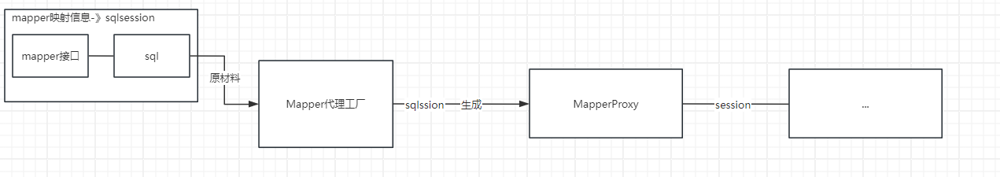
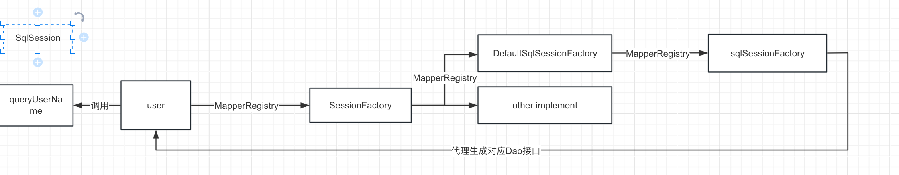
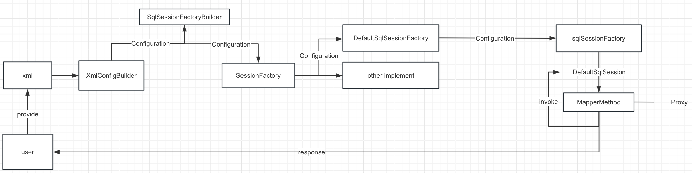
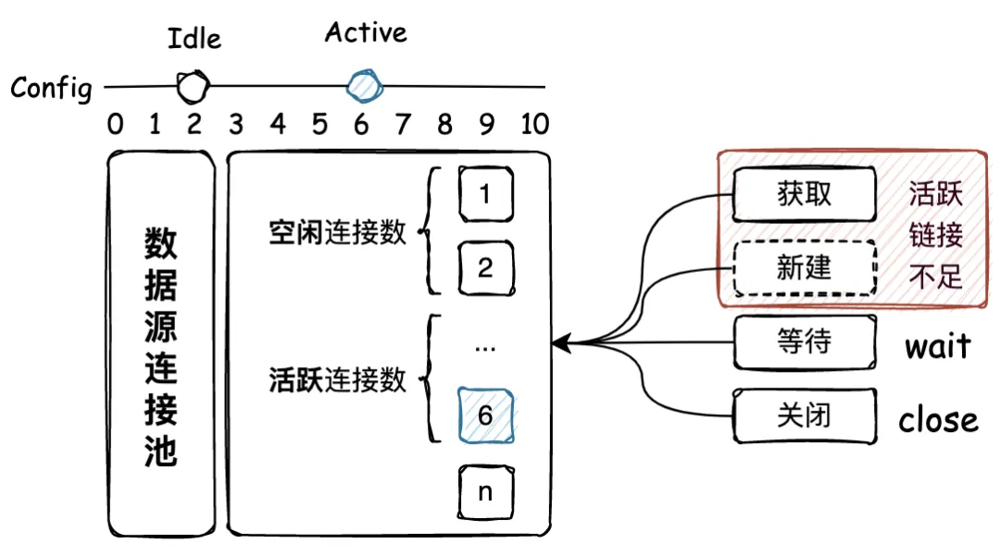
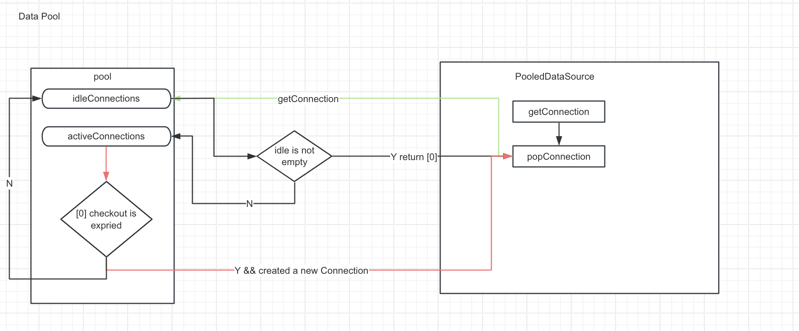

# 手写Mybatis

## 目录

- [做个山顶洞人，感受最原始的连接数据库方式](#做个山顶洞人感受最原始的连接数据库方式)
  - [创建数据库](#创建数据库)
  - [引入JDBC驱动依赖](#引入JDBC驱动依赖)
  - [基于JDBC操作数据库](#基于JDBC操作数据库)
  - [挖掘弊端](#挖掘弊端)
- [映射器代理工厂](#映射器代理工厂)
- [映射器的注册和使用](#映射器的注册和使用)
  - [定义SqlSession标准](#定义SqlSession标准)
  - [注册器](#注册器)
  - [测试](#测试)
- [Mapper Xml的解析和注册使用](#Mapper-Xml的解析和注册使用)
  - [思路](#思路)
  - [配置信息类](#配置信息类)
  - [构建配置信息抽象类](#构建配置信息抽象类)
  - [测试](#测试)
- [数据源的解析，创建和使用](#数据源的解析创建和使用)
  - [事务能力](#事务能力)
  - [基础类型注册器](#基础类型注册器)
  - [环境信息封装](#环境信息封装)
  - [解析数据源信息](#解析数据源信息)
  - [解析并执行SQL](#解析并执行SQL)
  - [测试](#测试)
- [数据源池化技术](#数据源池化技术)
  - [无池化连接实现](#无池化连接实现)
  - [有池化连接的实现](#有池化连接的实现)

Mybatis作为一款优秀的持久层框架，在国内Java开发领域具有广泛的应用。它不仅简化了数据库操作，提高了开发效率，还提供了灵活的映射规则和插件机制。然而，你是否曾想过，Mybatis背后的原理究竟是什么？它是如何实现SQL的动态绑定、参数映射、结果集映射等功能的呢？

想要循序渐进地了解Mybatis的层层复杂架构，我们必须先了解他的目的是什么？没错，刚刚介绍了目的在于**简化了数据库操作，提高了开发效率，还提供了灵活的映射规则和插件机制**，所以我们所有的行为最终的目标是要做到最大的简化数据库操作，并使得其更好地拓展。

有了靶子，我们的路才好走，不然就算手写了，也只是会懵懵懂懂，不知道在干嘛\~

## 做个山顶洞人，感受最原始的连接数据库方式

当然Java其实是有提供对数据库操作的接口给予我们使用的，那就是JDBC，而JDBC就是为我们更快捷地进行数据库的连接和操作，但是为什么明明有了JDBC，为什么还得有个Mybatis呢？

其实Mybatis也是在一步一步地优化而来的，毕竟JDBC和Mybatis是有着一致的目标的，都是为了简化数据库操作

那不妨我们就一起做一回山顶洞人，感受以往的存JDBC的操作吧

#### 创建数据库

首先我们先创建一个数据库来帮助我们更好地进行测试

```sql
-- record_test.sys_user definition
CREATE TABLE `sys_user` (
  `user_id` bigint NOT NULL AUTO_INCREMENT COMMENT '用户ID',
  `user_name` varchar(30) NOT NULL COMMENT '用户账号',
  `nick_name` varchar(30) NOT NULL COMMENT '用户昵称',
  `user_type` varchar(2) DEFAULT '00' COMMENT '用户类型（00系统用户）',
  `email` varchar(50) DEFAULT '' COMMENT '用户邮箱',
  `phonenumber` varchar(11) DEFAULT '' COMMENT '手机号码',
  `sex` char(1) DEFAULT '0' COMMENT '用户性别（0男 1女 2未知）',
  `avatar` varchar(100) DEFAULT '' COMMENT '头像地址',
  `password` varchar(100) DEFAULT '' COMMENT '密码',
  `status` char(1) DEFAULT '0' COMMENT '帐号状态（0正常 1停用）',
  `login_ip` varchar(128) DEFAULT '' COMMENT '最后登录IP',
  `login_date` datetime DEFAULT NULL COMMENT '最后登录时间',
  `remark` varchar(500) CHARACTER SET utf8mb3 COLLATE utf8mb3_general_ci DEFAULT NULL COMMENT '备注',
  `create_user` bigint DEFAULT NULL COMMENT '创建者',
  `create_time` datetime DEFAULT NULL COMMENT '创建时间',
  `update_user` bigint DEFAULT NULL COMMENT '更新者',
  `update_time` datetime DEFAULT NULL COMMENT '更新时间',
  `del_flag` bit(1) DEFAULT NULL COMMENT '逻辑删除(1:已删除，0:未删除)',
  PRIMARY KEY (`user_id`)
) ENGINE=InnoDB AUTO_INCREMENT=1686027685614125058 DEFAULT CHARSET=utf8mb3 COMMENT='用户信息表';
```

插入数据

```sql
INSERT INTO record_test.sys_user (user_id, user_name, nick_name, user_type, email, phonenumber, sex, avatar, password, status, login_ip, login_date, remark, create_user, create_time, update_user, update_time, del_flag) VALUES(1686027685614125057, 'test', 'test', '00', '', '', '0', '', '$2a$10$23zCdQer/Killsky7gISDeFNQd5SDmf.LLai0sKF3jAR3BdcX2vTm', '0', '127.0.0.1', '2023-08-01 14:49:51', '测试', 0, '2023-07-31 22:55:00', 1, '2023-08-01 14:49:51', 0);

```

#### 引入JDBC驱动依赖

```xml
  <dependency>
            <groupId>mysql</groupId>
            <artifactId>mysql-connector-java</artifactId>
            <version>8.0.33</version>
        </dependency>
```

#### 基于JDBC操作数据库

像以下代码就是我们以往JDBC的使用，其实也做得很简单了，我们只需想想我们在使用Navicat的时候是怎么操作就可以了

1. 首先加载驱动 Navicat的话是先要下载驱动
2. 输入用户名和密码还有对应的IP地址 ，这里对应的就是URL了
3. 如果是Navicat的话，我们会测试连接，连接进去之后我们会点击某张表建立一个查询，那放在这里其实就是写SQL嘛
4. 不过在JDBC这里多了一个预处理，即我们的SQL可以使用占位符，然后动态替换参数
5. 然后处理完了之后我们就可以执行查询获取结果了

```java
  private final static String URL = "jdbc:mysql://192.168.1.145:3360/paportal?useUnicode=true&allowMultiQueries=true&characterEncoding=utf8&useJDBCCompliantTimezoneShift=true&useLegacyDatetimeCode=false&serverTimezone=Asia/Shanghai&useSSL=false";

    private final static String USERNAME = "root";

    private final static String PASSWORD = "root";

    public static void main(String[] args) throws SQLException {

        Connection connection = null;

        PreparedStatement preparedStatement = null;

        try {
            //加载驱动
            Class.forName("com.mysql.cj.jdbc.Driver");
            //通过数据库获取连接
            connection = DriverManager.getConnection(URL, USERNAME, PASSWORD);
            // 定义SQL 语句
            String querySQL = "select * from sys_user where user_name = ?";
            // 预处理SQL
            preparedStatement = connection.prepareStatement(querySQL);
            // 给SQL设置参数
            preparedStatement.setString(1,"test");
            //处理完SQL了，发送给Mysql服务进行查询
            ResultSet resultSet = preparedStatement.executeQuery();
            while (resultSet.next()) {
                System.out.println(resultSet.getString("user_name"));
            }

        } catch (ClassNotFoundException | SQLException e) {
            throw new RuntimeException(e);
        }finally {
            connection.close();
            preparedStatement.close();
        }


    }
```

#### 挖掘弊端

1. 首先就是很多地方出现了硬编码，硬编码本身就是不好的，应变性也十分差
   1. 解决：配置文件
2. 我们发现每次查询都要进行连接创建和销毁，每次的创建连接和销毁连接都是非常耗费时间的
   1. 连接池
3. 结果集需要手动进行set，这是个非常繁琐的行为
   1. 反射

Mybatis 其实也是这么处理的，不过人家可能要处理地更加好看一点罢了，好了带着这些初识，一起看看Mybatis针对这些情况是如何处理的吧

## 映射器代理工厂

感受过JDBC的使用流程之后，我们就能发现不过四个流程 连接→查询→封装→返回，连接不用说，就是创建连接，在需要的时候进行数据库的连接，那么查询怎么能够做到实用，令开发者只需关注接口来进行编程呢？

首先我想应该得有一个存储用户接口和对应sql的地方吧？最好的方式就是Map了，有了这个全局Map，我们只需调用接口，就能映射到对应的SQL了

接着我们可以采取动态代理类来帮我们处理这个Map，为什么要采取动态代理类呢？因为我们的接口是多样性的，多种类型的，而动态代理能够提供灵活的代理机制，在运行时为各种接口动态创建代理，从而允许对对象进行受控访问或功能增强。

所以我们可以有下面这样的一个代理类

```java
public class MapperProxy<T> implements InvocationHandler, Serializable {

    private Map<String,String> sqlSession;

    private final Class<T> mapperInterface;

    public MapperProxy(Map<String,String> sqlSession , Class<T> mapperInterface) {
        this.sqlSession = sqlSession;
        this.mapperInterface = mapperInterface;
    }


    @Override
    public Object invoke(Object proxy, Method method, Object[] args) throws Throwable {
        if (Object.class.equals(method.getDeclaringClass())) {
            return method.invoke(this, args);
        }else{
            return "你的被代理了！" + sqlSession.get(mapperInterface.getName() + "." + method.getName());
        }
    }
}
```

代理跟工厂是一个好的搭档喔，因为工厂可以帮助我们代理的类型，使得我们只需面对工厂的生成和对应的类型就可以生成对应的代理类了。

```java
public class MapperProxyFactory<T> {

    private final Class<T> mapperInterface;

    public MapperProxyFactory(Class<T> mapperInterface) {
        this.mapperInterface = mapperInterface;
    }


    public T newInstance(Map<String,String> sqlSession) {
        final MapperProxy<T> mapperProxy = new MapperProxy<T>(sqlSession,mapperInterface);
        return (T)Proxy.newProxyInstance(mapperInterface.getClassLoader(),new Class[]{mapperInterface},mapperProxy);
    }


}
```

有了这段简化的代理工厂

我们可以尝试进行测试感受一下代理工厂带给我们的便利性

首先先创建一个Dao接口

```java
public interface IUserDao {

    String queryUserName(String uId);

    Integer queryUserAge(String uId);

}

```

然后通过创建对应的测试类，通过测试我们完全可以感受到我们现在只需要面对MapperProxyFactory和Session 就可以将接口和SQL的关系绑定下来了。

```java
    @Test
    public void test_MapperProxyFactory() {
        MapperProxyFactory<IUserDao> factory = new MapperProxyFactory<>(IUserDao.class);
        Map<String, String> sqlSession = new HashMap<>();
        sqlSession.put("com.example.mybatis.binding.dao.IUserDao.queryUserName", "模拟执行 Mapper.xml 中 SQL 语句的操作：查询用户姓名");
        sqlSession.put("com.example.mybatis.binding.dao.IUserDao.queryUserAge", "模拟执行 Mapper.xml 中 SQL 语句的操作：查询用户年龄");
        IUserDao userDao = factory.newInstance(sqlSession);
        String res = userDao.queryUserName("10001");
        System.out.println(res);
    }
```

整段流程图可以大致为



## 映射器的注册和使用

我们已经能将SQL和接口的对应关系搭建起来了，不过总得有一个地方管理着这批Map吧？那么这节我们就尝试着将这批Map管理起来。

```java
 Map<String, String> sqlSession = new HashMap<>();
 sqlSession.put("com.example.mybatis.binding.dao.IUserDao.queryUserName", "模拟执行 Mapper.xml 中 SQL 语句的操作：查询用户姓名");
 sqlSession.put("com.example.mybatis.binding.dao.IUserDao.queryUserAge", "模拟执行 Mapper.xml 中 SQL 语句的操作：查询用户年龄");
```

### 定义SqlSession标准

SqlSession也可以有许多不同的实现，所以对于不同的实现，我们完全可以定义一个标准接口，所有的SqlSession实现都可以遵循这个标准进行开发

```java

public interface SqlSession {

    <T> T selectOne(String statementName);


    <T> T selectOne(String statement, Object parameter);


    <T> T getMapper(Class<T> type);

}
```

就比如我需要有一个默认的Session实现

```java
public class DefaultSqlSession implements SqlSession{

    private MapperRegistry mapperRegistry;

    @Override
    public <T> T selectOne(String statementName) {
        return (T) ("你被代理了！" + "方法：" + statementName + " 入参：" );;
    }

    @Override
    public <T> T selectOne(String statement, Object parameter) {
        return (T) ("你被代理了！" + "方法：" + statement + " 入参：" + parameter);;;
    }

    @Override
    public <T> T getMapper(Class<T> type) {
        return mapperRegistry.getMapper(type, this);
    }
}
```

同样地，有了Session，Session是多样性的，我们可不想每个类型的Session都去手动创建

我们只需使用工厂模式帮助我们直接针对一个接口就能创建出来对应类型的Session了

```java
public interface SessionFactory {
    SqlSession openSession();
}

```

```java
public class DefaultSqlSessionFactory implements SessionFactory{
    private final MapperRegistry mapperRegistry;

    public DefaultSqlSessionFactory(MapperRegistry mapperRegistry) {
        this.mapperRegistry = mapperRegistry;
    }

    @Override
    public SqlSession openSession() {
        return new DefaultSqlSession(mapperRegistry);
    }
}

```

### 注册器

所谓管理，无非是对这批数据的增删改查

先来看看如何增，之前我们都是通过手动设置接口包路径来对sqlseesion进行配置的，为了能够更好地管理这批数据，一般我们都会把这些接口放在同一个包下，然后我们只需要提供这个包的路径，让程序获取对应包下的接口就OK了，这就是MapperScaner所在干的事情

```java
public class MapperRegistry {

    /**
     * @Description 定义一个缓存Mapper映射表
     * @Author T
     * @Date 2024/5/20 18:34
     **/
    private final Map<Class<?>,MapperProxyFactory<?>> knownMappers = new HashMap<Class<?>,MapperProxyFactory<?>>();

    public <T> T getMapper(Class<T> type, SqlSession sqlSession) {
        final  MapperProxyFactory<T> mapperProxyFactory = (MapperProxyFactory<T>) knownMappers.get(type);
        if (mapperProxyFactory == null){
            //注册器没有扫描到该类型接口
            throw new RuntimeException("Type " + type + " is not registered!");
        }
        return mapperProxyFactory.newInstance(sqlSession);
    }


    /**
     * @Description 添加Mapper
     * @Author T
     * @Date 2024/5/20 18:33     
     **/
    public <T> void addMapper(Class<T> type) {
        /* Mapper 必须是接口才会注册 */
        if (type.isInterface()) {
            if (hasMapper(type)) {
                // 如果重复添加了，报错
                throw new RuntimeException("Type " + type + " is already known to the MapperRegistry.");
            }
            // 注册映射器代理工厂
            knownMappers.put(type, new MapperProxyFactory<>(type));
        }
    }

    /* 判断是否注册过 */
    private <T> boolean hasMapper(Class<T> type) {
        return knownMappers.containsKey(type);
    }

    public void addMappers(String packageName) {
        Set<Class<?>> mapperSet = ClassScanner.scanPackage(packageName);
        for (Class<?> mapperClass : mapperSet) {
            addMapper(mapperClass);
        }
    }

}
```

在这段代码中，维护着一张缓存表，表中的内容正是类型和对应类型的代理工厂的映射关系，addMappers对应就是Mybatis中的MapperScaner的功能

### 测试

```java
    @Test
    public void test_MapperProxyFactory() {
        // 1. 注册 Mapper
        MapperRegistry registry = new MapperRegistry();
        registry.addMappers("dao.IUserDao");
        // 2. 从 SqlSession 工厂获取 Session
        SessionFactory sqlSessionFactory = new DefaultSqlSessionFactory(registry);
        SqlSession sqlSession = sqlSessionFactory.openSession();
        // 3. 获取映射器对象
        IUserDao userDao = sqlSession.getMapper(IUserDao.class);
        // 4. 测试验证
        String res = userDao.queryUserName("10001");
        System.out.println(res);
    }

```

这段代码其实就是给MapperRegistry提供了接口路径，并将SqlSession封装成标准定义，以后所有的SQL都需要参照这个标准进行定义，其实就是抽象出了SQL操作的所有可以使用的行为，比如说根据ID查询，查询全部，参数查询等等。然后我们跟映射器工厂提供原材料，剩下的就是工厂进行代理生成，并代理调用接口方法就成了



调用出来的结果就是由代理的这段代码决定的了

```java
  return "你的被代理了！" + sqlSession.selectOne(args[0].toString());
```

## Mapper Xml的解析和注册使用

### 思路

Mybatis的大致流程其实已经是完成了的，其实他的目的就是想要将使用和实现分离开来，让开发者只需要针对接口来实现，其他的细节不需要关注。所以他通过代理调用，工厂方法来实现了面向接口编程。

好，那么接下来就可以真正地对各个细节一一攻破

首先就是SQL,我们的SQL都是存储在Mapper映射中的，其中与接口绑定起来存储在MapperRegistry 中，而用过Mybatis的都知道，SQL我们是写在了xml中，所以我们需要定义一个xml，让程序能够读取xml并从中获取所需信息，构建SQLSession给MapperRegistry进行注册使用。

那么首先我们就面临着两个问题

1. Xml 文件解析
2. 封装SQL给MapperRegistry进行注册调用

首先是文件解析，这里是采用dom4j实现的

既然要进行文件解析，我觉得应该需要以下三个步骤

1. 读文件
2. 对文件内容进行解析提取
3. 封装成对象

好，读文件简单，我们只需提供一个资源工具类，提供读文件的方法即可

```java
  public static Reader getResourceAsReader(String resource) throws IOException {
        return new InputStreamReader(getResourceAsStream(resource));
    }

    private static InputStream getResourceAsStream(String resource) throws IOException {
        ClassLoader[] classLoaders = getClassLoaders();
        for (ClassLoader classLoader : classLoaders) {
            InputStream inputStream = classLoader.getResourceAsStream(resource);
            if (null != inputStream) {
                return inputStream;
            }
        }
        throw new IOException("Could not find resource " + resource);
    }

    private static ClassLoader[] getClassLoaders() {
        return new ClassLoader[]{
                ClassLoader.getSystemClassLoader(),
                Thread.currentThread().getContextClassLoader()};
    }
    /*
     * Loads a class
     *
     * @param className - the class to fetch
     * @return The loaded class
     * @throws ClassNotFoundException If the class cannot be found (duh!)
     */
    public static Class<?> classForName(String className) throws ClassNotFoundException {
        return Class.forName(className);
    }

```

为了让配置文件更加多样化，比如说我们可能以后需要拓展成不仅仅解析XML文件，还能是其他的配置文件，那么我们应该将行为抽象，我们只需提供Configuration 配置类，解析出来的内容放置配置类中即可，所以我们对外只提供parse抽象方法

### 配置信息类

以往我们是直接传MapperRegistry的，但是现在因为将MapperRegistry封装进Configuration中了，所以需要换成传Configuration，当然MapperRegistry的方法仍会在Configuration暴露出来，这是为了Configuration能够更加多样化

```java
public class Configuration {

    /**
     * 映射注册机
     */
    protected MapperRegistry mapperRegistry = new MapperRegistry(this);

    /**
     * 映射的语句，存在Map里
     */
    protected final Map<String, MappedStatement> mappedStatements = new HashMap<>();

    public void addMappers(String packageName) {
        mapperRegistry.addMappers(packageName);
    }

    public <T> void addMapper(Class<T> type) {
        mapperRegistry.addMapper(type);
    }

    public <T> T getMapper(Class<T> type, SqlSession sqlSession) {
        return mapperRegistry.getMapper(type, sqlSession);
    }

    public boolean hasMapper(Class<?> type) {
        return mapperRegistry.hasMapper(type);
    }

    public void addMappedStatement(MappedStatement ms) {
        mappedStatements.put(ms.getId(), ms);
    }

    public MappedStatement getMappedStatement(String id) {
        return mappedStatements.get(id);
    }


}

```

### 构建配置信息抽象类

```java
public abstract class BaseBuilder {

    public Configuration configuration;

    public BaseBuilder(Configuration configuration) {
        this.configuration = configuration;
    }

    public abstract Configuration parse();

}

```

紧接着我们就可以实现我们自己的XML解析器了

```java
public class XmlConfigBuilder extends BaseBuilder {

    private Element root;

    public XmlConfigBuilder(Reader reader) {
        // 1. 调用父类初始化Configuration
        super(new Configuration());
        // 2. dom4j 处理 xml
        SAXReader saxReader = new SAXReader();
        try {
            Document document = saxReader.read(new InputSource(reader));
            root = document.getRootElement();
        } catch (DocumentException e) {
            e.printStackTrace();
        }
    }


    @Override
    public Configuration parse() {
        try {
            // 解析映射器
            mapperElement(root.element("mappers"));
        } catch (Exception e) {
            throw new RuntimeException("Error parsing SQL Mapper Configuration. Cause: " + e, e);
        }
        return configuration;
    }


    //解析细节
    private void mapperElement(Element mappers) throws Exception {
        List<Element> mapperList = mappers.elements("mapper");
        for (Element e : mapperList) {
            //解析XML细节
            String resource = e.attributeValue("resource");
            Reader reader = Resources.getResourceAsReader(resource);
            SAXReader saxReader = new SAXReader();
            Document document = saxReader.read(new InputSource(reader));
            Element root = document.getRootElement();
            //命名空间
            String namespace = root.attributeValue("namespace");
            // SELECT
            List<Element> selectNodes = root.elements("select");
            for (Element node : selectNodes) {
                String id = node.attributeValue("id");
                String parameterType = node.attributeValue("parameterType");
                String resultType = node.attributeValue("resultType");
                String sql = node.getText();

                // ? 匹配
                Map<Integer, String> parameter = new HashMap<>();
                Pattern pattern = Pattern.compile("(#\\{(.*?)})");
                Matcher matcher = pattern.matcher(sql);
                for (int i = 1; matcher.find(); i++) {
                    String g1 = matcher.group(1);
                    String g2 = matcher.group(2);
                    parameter.put(i, g2);
                    sql = sql.replace(g1, "?");
                }

                String msId = namespace + "." + id;
                String nodeName = node.getName();
                SqlCommandType sqlCommandType = SqlCommandType.valueOf(nodeName.toUpperCase(Locale.ENGLISH));
                MappedStatement mappedStatement = new MappedStatement.Builder(configuration, msId, sqlCommandType, parameterType, resultType, sql, parameter).build();
                // 添加解析 SQL
                configuration.addMappedStatement(mappedStatement);

            }

        // 注册Mapper映射器
        configuration.addMapper(Resources.classForName(namespace));
    }
}
}
```

做到这里我们其实就可以顺利解析到xml中的SQL信息了，为了能够更好地管理SQL信息，我们还可以有一个Mapper的枚举，因为SQL的种类是特定的，所以枚举出来，我们可以更加好地对代码进行管理和维护

```java
public class MapperMethod {

    private final SqlCommand command;

    public MapperMethod(Class<?> mapperInterface, Method method, Configuration configuration) {
        this.command = new SqlCommand(configuration, mapperInterface, method);
    }

    public Object execute(SqlSession sqlSession, Object[] args) {
        Object result = null;
        switch (command.getType()) {
            case INSERT:
                break;
            case DELETE:
                break;
            case UPDATE:
                break;
            case SELECT:
                result = sqlSession.selectOne(command.getName(), args) + command.getSql();
                break;
            default:
                throw new RuntimeException("Unknown execution method for: " + command.getName());
        }
        return result;
    }

    /**
     * SQL 指令
     */
    public static class SqlCommand {

        private final String name;
        private final SqlCommandType type;
        private final String sql;

        public SqlCommand(Configuration configuration, Class<?> mapperInterface, Method method) {
            String statementName = mapperInterface.getName() + "." + method.getName();
            MappedStatement ms = configuration.getMappedStatement(statementName);
            name = ms.getId();
            type = ms.getSqlCommandType();
            sql = ms.getSql();
        }

        public String getName() {
            return name;
        }

        public String getSql() {
            return sql;
        }

        public SqlCommandType getType() {
            return type;
        }
    }

}
```

当然我们还要拥有一个Mapper的元信息存储，方便我们解析Mapper，这里也采用了建造着模式帮助我们构建复杂对象，以及后期如果需要对其进行拓展，我们也能很方便就实现啦

```java
public class MappedStatement {

    private Configuration configuration;
    private String id;
    private SqlCommandType sqlCommandType;

    private String parameterType;
    private String resultType;
    private String sql;
    private Map<Integer, String> parameter;

    MappedStatement() {
        // constructor disabled
    }

    /**
     * 建造者
     */
    public static class Builder {

        private MappedStatement mappedStatement = new MappedStatement();

        public Builder(Configuration configuration, String id, SqlCommandType sqlCommandType, String parameterType, String resultType, String sql, Map<Integer, String> parameter) {
            mappedStatement.configuration = configuration;
            mappedStatement.id = id;
            mappedStatement.sqlCommandType = sqlCommandType;
            mappedStatement.parameterType = parameterType;
            mappedStatement.resultType = resultType;
            mappedStatement.sql = sql;
            mappedStatement.parameter = parameter;
        }

        public MappedStatement build() {
            assert mappedStatement.configuration != null;
            assert mappedStatement.id != null;
            return mappedStatement;
        }

    }

    public Configuration getConfiguration() {
        return configuration;
    }

    public void setConfiguration(Configuration configuration) {
        this.configuration = configuration;
    }

    public String getId() {
        return id;
    }

    public void setId(String id) {
        this.id = id;
    }

    public SqlCommandType getSqlCommandType() {
        return sqlCommandType;
    }

    public void setSqlCommandType(SqlCommandType sqlCommandType) {
        this.sqlCommandType = sqlCommandType;
    }

    public String getParameterType() {
        return parameterType;
    }

    public void setParameterType(String parameterType) {
        this.parameterType = parameterType;
    }

    public String getResultType() {
        return resultType;
    }

    public void setResultType(String resultType) {
        this.resultType = resultType;
    }

    public String getSql() {
        return sql;
    }

    public void setSql(String sql) {
        this.sql = sql;
    }

    public Map<Integer, String> getParameter() {
        return parameter;
    }

    public void setParameter(Map<Integer, String> parameter) {
        this.parameter = parameter;
    }

}
```

### 测试

准备一个接口

```java
String queryUserInfoById(String uId);
```

准备对应的mapper.xml

```xml
<mapper namespace="dao.IUserDao">

    <select id="queryUserInfoById" parameterType="java.lang.Long" resultType="vo.User">
        SELECT id, userId, userHead, createTime
        FROM user
        where id = #{id}
    </select>

</mapper>
```

测试代码

```java
        // 1. 从SqlSessionFactory中获取SqlSession
        Reader reader = Resources.getResourceAsReader("mybatis-config-datasources.xml");
        SessionFactory sqlSessionFactory = new SqlSessionFactoryBuilder().build(reader);
        SqlSession sqlSession = sqlSessionFactory.openSession();
        // 2. 获取映射器对象
        IUserDao userDao = sqlSession.getMapper(IUserDao.class);
        // 3. 测试验证
        String res = userDao.queryUserInfoById("10001");
        System.out.println(res);
```

结果：

```javascript
你被代理了！方法：dao.IUserDao.queryUserInfoById 入参：[Ljava.lang.Object;@59fa1d9b
        SELECT id, userId, userHead, createTime
        FROM user
        where id = ?
```

对比下以往我们的测试类

```java
    @Test
    public void test_MapperProxyFactory() {
        // 1. 注册 Mapper
        MapperRegistry registry = new MapperRegistry();
        registry.addMappers("dao.IUserDao");
        // 2. 从 SqlSession 工厂获取 Session
        SessionFactory sqlSessionFactory = new DefaultSqlSessionFactory(registry);
        SqlSession sqlSession = sqlSessionFactory.openSession();
        // 3. 获取映射器对象
        IUserDao userDao = sqlSession.getMapper(IUserDao.class);
        // 4. 测试验证
        String res = userDao.queryUserName("10001");
        System.out.println(res);
    }
```

其实我们只是将手动的加Mapper信息→ 改成了扫描xml获取Mapper信息，然后将Mapper信息封装成了Configuration，然后仍然是封装在SqlSession中，当然隐含在其中的就是我们还做了SQL的层层解析。



## 数据源的解析，创建和使用

Mapper的解析和管理已经完成得差不多了，可以着手一下数据源的处理了，对于数据的查询，我们需要考虑得不仅仅是连接，查询，获取结果这么简单，还需要考虑到事务管理，当然事务管理也是需要使用到JDBC提供的API的。

### 事务能力

首先我们需要将事务的操作进行规范，所以先定义一个接口

```java
public interface Transaction {

    Connection getConnection() throws SQLException;

    void commit() throws SQLException;

    void rollback() throws SQLException;

    void close() throws SQLException;

}

```

接下来就可以基于JDBC实现Transaction 的各个接口了

在此之前，我们可以先创建一个JDBC提供的事务隔离级别枚举

```java
public enum TransactionIsolationLevel {

    //包括JDBC支持的5个级别
    NONE(Connection.TRANSACTION_NONE),
    READ_COMMITTED(Connection.TRANSACTION_READ_COMMITTED),
    READ_UNCOMMITTED(Connection.TRANSACTION_READ_UNCOMMITTED),
    REPEATABLE_READ(Connection.TRANSACTION_REPEATABLE_READ),
    SERIALIZABLE(Connection.TRANSACTION_SERIALIZABLE);

    private final int level;

    TransactionIsolationLevel(int level) {
        this.level = level;
    }

    public int getLevel() {
        return level;
    }

}
```

实现各接口

```java
public class JdbcTransaction implements Transaction {

    protected Connection connection;
    protected DataSource dataSource;
    protected TransactionIsolationLevel level = TransactionIsolationLevel.NONE;
    protected boolean autoCommit;

    public JdbcTransaction(DataSource dataSource, TransactionIsolationLevel level, boolean autoCommit) {
        this.dataSource = dataSource;
        this.level = level;
        this.autoCommit = autoCommit;
    }

    public JdbcTransaction(Connection connection) {
        this.connection = connection;
    }

    @Override
    public Connection getConnection() throws SQLException {
        connection = dataSource.getConnection();
        connection.setTransactionIsolation(level.getLevel());
        connection.setAutoCommit(autoCommit);
        return connection;
    }

    @Override
    public void commit() throws SQLException {
        if (connection != null && !connection.getAutoCommit()) {
            connection.commit();
        }
    }

    @Override
    public void rollback() throws SQLException {
        if (connection != null && !connection.getAutoCommit()) {
            connection.rollback();
        }
    }

    @Override
    public void close() throws SQLException {
        if (connection != null && !connection.getAutoCommit()) {
            connection.close();
        }
    }

}
```

创建事务工厂用于生成事务

```java
/**
* @Description: 事务工厂
* @Param:
* @return:
* @Author: tangzhaofeng
* @Date: 5/28/2024
*/
public interface TransactionFactory {

    Transaction newTransaction(Connection conn);

    Transaction newTransaction(DataSource dataSource, TransactionIsolationLevel level, boolean autoCommit);

}

```

这么做的好处就是所有的JDBC实现的事务只需对应一个工厂即可，这也是工厂方法的好处

### 基础类型注册器

我们使用这个注册器可以将一些初始化的加载信息以键值对的形式缓存在Map中，供我们随时使用

```java
public class TypeAliasRegistry {


    private final Map<String, Class<?>> TYPE_ALIASES = new HashMap<>();


    public TypeAliasRegistry() {
        // 构造函数里注册系统内置的类型别名
        registerAlias("string", String.class);
        // 基本包装类型
        registerAlias("byte", Byte.class);
        registerAlias("long", Long.class);
        registerAlias("short", Short.class);
        registerAlias("int", Integer.class);
        registerAlias("integer", Integer.class);
        registerAlias("double", Double.class);
        registerAlias("float", Float.class);
        registerAlias("boolean", Boolean.class);
    }


    public void registerAlias(String alias, Class<?> value) {
        String key = alias.toLowerCase(Locale.ENGLISH);
        TYPE_ALIASES.put(key, value);
    }


    public <T> Class<T> resolveAlias(String string) {
        String key = string.toLowerCase(Locale.ENGLISH);
        return (Class<T>) TYPE_ALIASES.get(key);
    }


}

```

有了这个基础类型加载器，我们需要将其放置我们的配置类中

```java
public class Configuration {

    /**
     * 映射注册机
     */
    protected MapperRegistry mapperRegistry = new MapperRegistry(this);

    /**
     * 映射的语句，存在Map里
     */
    protected final Map<String, MappedStatement> mappedStatements = new HashMap<>();


    /**
     * 注册基础类型注册器
     * */
    + protected final TypeAliasRegistry typeAliasRegistry = new TypeAliasRegistry();


    + public Configuration() {
    +     typeAliasRegistry.registerAlias("JDBC", JdbcTransactionFactory.class);
    +     typeAliasRegistry.registerAlias("druid", DruidDataSourceFactory.class);
    + }


    public void addMappers(String packageName) {
        mapperRegistry.addMappers(packageName);
    }

    public <T> void addMapper(Class<T> type) {
        mapperRegistry.addMapper(type);
    }

    public <T> T getMapper(Class<T> type, SqlSession sqlSession) {
        return mapperRegistry.getMapper(type, sqlSession);
    }

    public boolean hasMapper(Class<?> type) {
        return mapperRegistry.hasMapper(type);
    }

    public void addMappedStatement(MappedStatement ms) {
        mappedStatements.put(ms.getId(), ms);
    }

    public MappedStatement getMappedStatement(String id) {
        return mappedStatements.get(id);
    }


}

```

当然Druid 数据源配置工厂我们要补充一下，首先是引入依赖

```xml
        <!-- https://mvnrepository.com/artifact/com.alibaba/druid -->
        <dependency>
            <groupId>com.alibaba</groupId>
            <artifactId>druid</artifactId>
            <version>1.2.20</version>
        </dependency>

```

然后我们就需要配置我们的数据源信息了，创建一个datasource的包，使用DatasourceFactory接口来规范行为

```java
public interface DataSourceFactory {

    void setProperties(Properties props);

    DataSource getDataSource();

}

```

然后实现具体的druid实现

```java
public class DruidDataSourceFactory implements DataSourceFactory {

  private Properties props;

  @Override

  public void setProperties(Properties props) {

    this.props = props;

  }

  @Override

  public DataSource getDataSource() {

    DruidDataSource dataSource = new DruidDataSource();

    dataSource.setDriverClassName(props.getProperty("driver"));

    dataSource.setUrl(props.getProperty("url"));

    dataSource.setUsername(props.getProperty("username"));

    dataSource.setPassword(props.getProperty("password"));

    return dataSource;

  }

}
```

### 环境信息封装

因为是对xml中的数据源信息做解析，所以我们需要封装一个environment类来描述数据源信息

```java
public final class Environment {

    // 环境id
    private final String id;
    // 事务工厂
    private final TransactionFactory transactionFactory;
    // 数据源
    private final DataSource dataSource;

    public Environment(String id, TransactionFactory transactionFactory, DataSource dataSource) {
        this.id = id;
        this.transactionFactory = transactionFactory;
        this.dataSource = dataSource;
    }

    public static class Builder {

        private String id;
        private TransactionFactory transactionFactory;
        private DataSource dataSource;

        public Builder(String id) {
            this.id = id;
        }

        public Builder transactionFactory(TransactionFactory transactionFactory) {
            this.transactionFactory = transactionFactory;
            return this;
        }

        public Builder dataSource(DataSource dataSource) {
            this.dataSource = dataSource;
            return this;
        }

        public String id() {
            return this.id;
        }

        public Environment build() {
            return new Environment(this.id, this.transactionFactory, this.dataSource);
        }

    }

    public String getId() {
        return id;
    }

    public TransactionFactory getTransactionFactory() {
        return transactionFactory;
    }

    public DataSource getDataSource() {
        return dataSource;
    }

}

```

### 解析数据源信息

解析其实就是到XmlConfigBuilder处的parse多添加一个解析方法，这跟mapper映射解析是一样的道理，就是根据对应标签的值取出来

```java
private void environmentsElement(Element context) throws Exception {
        String environment = context.attributeValue("default");
        List<Element> environmentList = context.elements("environment");
        for (Element e : environmentList) {
            String id = e.attributeValue("id");
            if (environment.equals(id)) {
                // 事务管理器
                TransactionFactory txFactory = (TransactionFactory) typeAliasRegistry.resolveAlias(e.element("transactionManager").attributeValue("type")).newInstance();
                // 数据源
                Element dataSourceElement = e.element("dataSource");
                DataSourceFactory dataSourceFactory = (DataSourceFactory) typeAliasRegistry.resolveAlias(dataSourceElement.attributeValue("type")).newInstance();
                List<Element> propertyList = dataSourceElement.elements("property");
                Properties props = new Properties();
                for (Element property : propertyList) {
                    props.setProperty(property.attributeValue("name"), property.attributeValue("value"));
                }
                dataSourceFactory.setProperties(props);
                DataSource dataSource = dataSourceFactory.getDataSource();
                // 构建环境
                Environment.Builder environmentBuilder = new Environment.Builder(id)
                        .transactionFactory(txFactory)
                        .dataSource(dataSource);
                configuration.setEnvironment(environmentBuilder.build());
            }
        }
    }
```

然后将方法配置到parse中去

```java
 @Override
    public Configuration parse() {
        try {
            // 解析映射器
            mapperElement(root.element("mappers"));
            environmentsElement(root.element("environments"));
        } catch (Exception e) {
            throw new RuntimeException("Error parsing SQL Mapper Configuration. Cause: " + e, e);
        }
        return configuration;
    }
```

### 解析并执行SQL

既然是要解析SQL ，那么我们应该先把SQL的信息先抽取出来方便之后更好管理，我们将抽取成BoundSql&#x20;

```java
public class BoundSql {

    private String sql;
    private Map<Integer, String> parameterMappings;
    private String parameterType;
    private String resultType;

    public BoundSql(String sql, Map<Integer, String> parameterMappings, String parameterType, String resultType) {
        this.sql = sql;
        this.parameterMappings = parameterMappings;
        this.parameterType = parameterType;
        this.resultType = resultType;
    }

    public String getSql() {
        return sql;
    }

    public Map<Integer, String> getParameterMappings() {
        return parameterMappings;
    }

    public String getParameterType() {
        return parameterType;
    }

    public String getResultType() {
        return resultType;
    }
}

```

```java

    
  public class MappedStatement {

    private Configuration configuration;
    private String id;
    private SqlCommandType sqlCommandType;


    - private String parameterType;
    - private String resultType;
    - private String sql;
    - private Map<Integer, String> parameter;
}

```

```java
public class MappedStatement {

    private Configuration configuration;
    private String id;
    private SqlCommandType sqlCommandType;


    private BoundSql boundSql;

    MappedStatement() {
        // constructor disabled
    }

    /**
     * 建造者
     */
    public static class Builder {

        private MappedStatement mappedStatement = new MappedStatement();

        public Builder(Configuration configuration, String id, SqlCommandType sqlCommandType, BoundSql boundSql) {
            mappedStatement.configuration = configuration;
            mappedStatement.id = id;
            mappedStatement.sqlCommandType = sqlCommandType;
            mappedStatement.boundSql = boundSql;
        }


        public MappedStatement build() {
            assert mappedStatement.configuration != null;
            assert mappedStatement.id != null;
            return mappedStatement;
        }

    }

    public Configuration getConfiguration() {
        return configuration;
    }

    public void setConfiguration(Configuration configuration) {
        this.configuration = configuration;
    }

    public String getId() {
        return id;
    }

    public void setId(String id) {
        this.id = id;
    }

    public SqlCommandType getSqlCommandType() {
        return sqlCommandType;
    }

    public void setSqlCommandType(SqlCommandType sqlCommandType) {
        this.sqlCommandType = sqlCommandType;
    }


    public BoundSql getBoundSql() {
        return boundSql;
    }


}

```

好了，封装好了，我们如今有了数据源信息，意味着我们完全可以跑一跑session中的未实现的selectOne来看看效果了

```java
    @Override
    public <T> T selectOne(String statement, Object parameter) {
        try {
            MappedStatement mappedStatement = configuration.getMappedStatement(statement);
            Environment environment = configuration.getEnvironment();
            Connection connection = environment.getDataSource().getConnection();
            BoundSql boundSql = mappedStatement.getBoundSql();
            PreparedStatement preparedStatement = connection.prepareStatement(boundSql.getSql());
            preparedStatement.setLong(1, Long.parseLong(((Object[]) parameter)[0].toString()));
            ResultSet resultSet = preparedStatement.executeQuery();
            List<T> objList = resultSet2Obj(resultSet, Class.forName(boundSql.getResultType()));
            return objList.get(0);
        } catch (Exception e) {
            e.printStackTrace();
            return null;
        }
    }
    
    
    
```

resultSet2Obj方法主要是用于解决结果映射的，其实就是通过遍历获取每个结果集，然后通过反射来对结果进行逐一赋值

```java
 private <T> List<T> resultSet2Obj(ResultSet resultSet, Class<?> clazz) {
        List<T> list = new ArrayList<>();
        try {
            ResultSetMetaData metaData = resultSet.getMetaData();
            int columnCount = metaData.getColumnCount();
            // 每次遍历行值
            while (resultSet.next()) {
                T obj = (T) clazz.newInstance();
                for (int i = 1; i <= columnCount; i++) {
                    Object value = resultSet.getObject(i);
                    String columnName = metaData.getColumnName(i);
                    String setMethod = "set" + columnName.substring(0, 1).toUpperCase() + columnName.substring(1);
                    Method method;
                    if (value instanceof Timestamp) {
                        method = clazz.getMethod(setMethod, Date.class);
                    } else {
                        method = clazz.getMethod(setMethod, value.getClass());
                    }
                    method.invoke(obj, value);
                }
                list.add(obj);
            }
        } catch (Exception e) {
            e.printStackTrace();
        }
        return list;
    }
```

### 测试

测试SQL

```sql
CREATE TABLE
    USER
    (
        id bigint NOT NULL AUTO_INCREMENT COMMENT '自增ID',
        userId VARCHAR(9) COMMENT '用户ID',
        userHead VARCHAR(16) COMMENT '用户头像',
        createTime TIMESTAMP NULL COMMENT '创建时间',
        updateTime TIMESTAMP NULL COMMENT '更新时间',
        userName VARCHAR(64),
        PRIMARY KEY (id)
    )
    ENGINE=InnoDB DEFAULT CHARSET=utf8;
    
insert into user (id, userId, userHead, createTime, updateTime, userName) values (1, '10001', '1_04', '2022-04-13 00:00:00', '2022-04-13 00:00:00', '小傅哥');    

```

## 数据源池化技术

数据源连接的创建其实是一个十分消耗性能的事情，所以如果我们可以拥有一个数据连接池，每次需要进行连接时都可以用池中获取，这样我们就剩下不少因为创建销毁数据连接的性能消耗了，这就是数据库连接池的作用。

而且我们还可以通过配置连接池的属性，或者说通过配置池对连接 的管理来适配各个复杂场景，所以数据连接池是针对数据连接十分有必要的一项技术。



好了，那么接下来就一起来看看我们应该如何实现一个数据源池吧，首先池化技术理应是要根据需求来进行开启或不开启的。

所以我们应该有池化和不池化两个实现

### 无池化连接实现

不管是池化还是无池化，其实最终的目的都是管理DataSource

所以我们需要先实现DataSource提供的获取连接的方法，当然我们还要将DataSource所需要的信息封装好

```java
@Data
public class UnpooledDataSource implements DataSource {
    private ClassLoader driverClassLoader;
    // 驱动配置，也可以扩展属性信息 driver.encoding=UTF8
    private Properties driverProperties;
    // 驱动注册器
    private static Map<String, Driver> registeredDrivers = new ConcurrentHashMap<>();
    // 驱动
    private String driver;
    // DB 链接地址
    private String url;
    // 账号
    private String username;
    // 密码
    private String password;
    // 是否自动提交
    private Boolean autoCommit;
    // 事务级别
    private Integer defaultTransactionIsolationLevel;

    // 将各个驱动注册至缓存驱动注册器中
    static {
        Enumeration<Driver> drivers = DriverManager.getDrivers();
        //解决对数据源的情况
        while (drivers.hasMoreElements()) {
            Driver driver = drivers.nextElement();
            registeredDrivers.put(driver.getClass().getName(), driver);
        }
    }
    
    @Override
    public Connection getConnection() throws SQLException {
        return doGetConnection(username, password);
    }

    @Override
    public Connection getConnection(String username, String password) throws SQLException {
        return doGetConnection(username, password);
    }

    @Override
    public <T> T unwrap(Class<T> iface) throws SQLException {
        throw new SQLException(getClass().getName() + " is not a wrapper.");
    }

    @Override
    public boolean isWrapperFor(Class<?> iface) throws SQLException {
        return false;
    }

    @Override
    public PrintWriter getLogWriter() throws SQLException {
        return DriverManager.getLogWriter();
    }

    @Override
    public void setLogWriter(PrintWriter logWriter) throws SQLException {
        DriverManager.setLogWriter(logWriter);
    }

    @Override
    public void setLoginTimeout(int loginTimeout) throws SQLException {
        DriverManager.setLoginTimeout(loginTimeout);
    }

    @Override
    public int getLoginTimeout() throws SQLException {
        return DriverManager.getLoginTimeout();
    }

    @Override
    public Logger getParentLogger() throws SQLFeatureNotSupportedException {
        return Logger.getLogger(Logger.GLOBAL_LOGGER_NAME);
    }
}
```

然后我们还需要提供处理加载驱动，获取连接的方法，只是驱动器可以直接从缓存ConcurrentHashMap中获取了

```java
    /**
     * @Description 根据连接信息初始化连接 
     * @Author T
     * @Date 2024/6/1 21:37     
     **/
    private Connection doGetConnection(String username, String password) throws SQLException {
        Properties props = new Properties();
        if (driverProperties != null) {
            props.putAll(driverProperties);
        }
        if (username != null) {
            props.setProperty("user", username);
        }
        if (password != null) {
            props.setProperty("password", password);
        }
        return doGetConnection(props);
    }
    
    /**
     * @Description 加载驱动，获取连接 
     * @Author T
     * @Date 2024/6/1 21:37     
     **/
    private Connection doGetConnection(Properties properties) throws SQLException, SQLException {
        initializerDriver();
        Connection connection = DriverManager.getConnection(url, properties);
        if (autoCommit != null && autoCommit != connection.getAutoCommit()) {
            connection.setAutoCommit(autoCommit);
        }
        if (defaultTransactionIsolationLevel != null) {
            connection.setTransactionIsolation(defaultTransactionIsolationLevel);
        }
        return connection;
    }
    
    /**
     * 初始化驱动
     */
    private synchronized void initializerDriver() throws SQLException {
        if (!registeredDrivers.containsKey(driver)) {
            try {
                Class<?> driverType = Class.forName(driver, true, driverClassLoader);
                Driver driverInstance = (Driver) driverType.newInstance();
                DriverManager.registerDriver(new DriverProxy(driverInstance));
                registeredDrivers.put(driver, driverInstance);
            } catch (Exception e) {
                throw new SQLException("Error setting driver on UnpooledDataSource. Cause: " + e);
            }
        }
    }
```

驱动的话，我们可以通过自创的DriverProxy来帮助我们创建Driver

```java
/**
  - 驱动代理

  */

  private static class DriverProxy implements Driver {

    private Driver driver;

    DriverProxy(Driver driver) {

      this.driver = driver;

    }

    @Override

    public Connection connect(String u, Properties p) throws SQLException {

      return this.driver.connect(u, p);

    }

    @Override

    public boolean acceptsURL(String u) throws SQLException {

      return this.driver.acceptsURL(u);

    }

    @Override

    public DriverPropertyInfo[] getPropertyInfo(String u, Properties p) throws SQLException {

      return this.driver.getPropertyInfo(u, p);

    }

    @Override

    public int getMajorVersion() {

      return this.driver.getMajorVersion();

    }

    @Override

    public int getMinorVersion() {

      return this.driver.getMinorVersion();

    }

    @Override

    public boolean jdbcCompliant() {

      return this.driver.jdbcCompliant();

    }

    @Override

    public Logger getParentLogger() throws SQLFeatureNotSupportedException {

      return Logger.getLogger(Logger.GLOBAL_LOGGER_NAME);

    }

  }
```

这样一个无池化实现就完成了，我们还可以通过工厂来对外提供统一的获取接口

```java
public class UnpooledDataSourceFactory implements DataSourceFactory {

    protected Properties props;

    @Override
    public void setProperties(Properties props) {
        this.props = props;
    }

    @Override
    public DataSource getDataSource() {
        UnpooledDataSource unpooledDataSource = new UnpooledDataSource();
        unpooledDataSource.setDriver(props.getProperty("driver"));
        unpooledDataSource.setUrl(props.getProperty("url"));
        unpooledDataSource.setUsername(props.getProperty("username"));
        unpooledDataSource.setPassword(props.getProperty("password"));
        return unpooledDataSource;
    }

}
```

### 有池化连接的实现

有池化其实就是在无池化的基础上做包装，同时提供相应的池化技术，包括：pushConnection、popConnection、forceCloseAll、pingConnection 的操作处理。

首先我们需要了解一下什么叫池化，当应用程序需要访问数据库时，不是直接创建一个新的连接，而是从连接池中获取一个已经创建好的连接。当数据库操作完成时，不是关闭连接，而是将连接归还到池中，以便其他请求复用。这样，可以避免频繁地创建和关闭连接，从而提高系统的性能和响应速度。

既然是连接池，首先我们得先有个池吧，而这个池不仅仅要用于存储已创建的连接，还需要对池中连接进行判断和管理，比如说是否是有效连接，获取有限连接数量，这些我们都需要对外提供

```java
public class PoolState {

    protected PooledDataSource dataSource;

    // 空闲链接
    protected final List<PooledConnection> idleConnections = new ArrayList<>();
    // 活跃链接
    protected final List<PooledConnection> activeConnections = new ArrayList<>();

    // 请求次数
    protected long requestCount = 0;
    // 总请求时间
    protected long accumulatedRequestTime = 0;
    protected long accumulatedCheckoutTime = 0;
    protected long claimedOverdueConnectionCount = 0;
    protected long accumulatedCheckoutTimeOfOverdueConnections = 0;

    // 总等待时间
    protected long accumulatedWaitTime = 0;
    // 要等待的次数
    protected long hadToWaitCount = 0;
    // 失败连接次数
    protected long badConnectionCount = 0;

    public PoolState(PooledDataSource dataSource) {
        this.dataSource = dataSource;
    }

    public synchronized long getRequestCount() {
        return requestCount;
    }

    public synchronized long getAverageRequestTime() {
        return requestCount == 0 ? 0 : accumulatedRequestTime / requestCount;
    }

    public synchronized long getAverageWaitTime() {
        return hadToWaitCount == 0 ? 0 : accumulatedWaitTime / hadToWaitCount;
    }

    public synchronized long getHadToWaitCount() {
        return hadToWaitCount;
    }

    public synchronized long getBadConnectionCount() {
        return badConnectionCount;
    }

    public synchronized long getClaimedOverdueConnectionCount() {
        return claimedOverdueConnectionCount;
    }

    public synchronized long getAverageOverdueCheckoutTime() {
        return claimedOverdueConnectionCount == 0 ? 0 : accumulatedCheckoutTimeOfOverdueConnections / claimedOverdueConnectionCount;
    }

    public synchronized long getAverageCheckoutTime() {
        return requestCount == 0 ? 0 : accumulatedCheckoutTime / requestCount;
    }

    public synchronized int getIdleConnectionCount() {
        return idleConnections.size();
    }

    public synchronized int getActiveConnectionCount() {
        return activeConnections.size();
    }

}
```

池有了，那我们就可以对数据源进行拓展了。首先我们要考虑的是如何将有效连接存储于池中，其实我们可以通过拦截Connection 执行Close方法时，在这之前把Collection存到池中。如何拦截呢，这里就需要使用到代理了

```java
public class PooledConnection implements InvocationHandler {

    private static final String CLOSE = "close";
    private static final Class<?>[] IFACES = new Class<?>[]{Connection.class};

    private int hashCode = 0;
    private PooledDataSource dataSource;

    // 真实的连接
    private Connection realConnection;
    // 代理的连接
    private Connection proxyConnection;

    private long checkoutTimestamp;
    private long createdTimestamp;
    private long lastUsedTimestamp;
    private int connectionTypeCode;
    private boolean valid;


    public PooledConnection(Connection connection, PooledDataSource dataSource) {
        this.hashCode = connection.hashCode();
        this.realConnection = connection;
        this.dataSource = dataSource;
        this.createdTimestamp = System.currentTimeMillis();
        this.lastUsedTimestamp = System.currentTimeMillis();
        this.valid = true;
        this.proxyConnection = (Connection) Proxy.newProxyInstance(Connection.class.getClassLoader(), IFACES, this);
    }

  
   //核心方法
    @Override
    public Object invoke(Object proxy, Method method, Object[] args) throws Throwable {
        String methodName = method.getName();
        // 如果是调用 CLOSE 关闭链接方法，则将链接加入连接池中，并返回null
        if (CLOSE.hashCode() == methodName.hashCode() && CLOSE.equals(methodName)) {
            dataSource.pushConnection(this);
            return null;
        } else {
            if (!Object.class.equals(method.getDeclaringClass())) {
                // 除了toString()方法，其他方法调用之前要检查connection是否还是合法的,不合法要抛出SQLException
                checkConnection();
            }
            // 其他方法交给connection去调用
            return method.invoke(realConnection, args);
        }
    }


    private void checkConnection() throws SQLException {
        if (!valid) {
            throw new SQLException("Error accessing PooledConnection. Connection is invalid.");
        }
    }


    public void invalidate() {
        valid = false;
    }

    public boolean isValid() {
        return valid && realConnection != null && dataSource.pingConnection(this);
    }

    public Connection getRealConnection() {
        return realConnection;
    }

    public Connection getProxyConnection() {
        return proxyConnection;
    }

    public int getRealHashCode() {
        return realConnection == null ? 0 : realConnection.hashCode();
    }

    public int getConnectionTypeCode() {
        return connectionTypeCode;
    }

    public void setConnectionTypeCode(int connectionTypeCode) {
        this.connectionTypeCode = connectionTypeCode;
    }

    public long getCreatedTimestamp() {
        return createdTimestamp;
    }

    public void setCreatedTimestamp(long createdTimestamp) {
        this.createdTimestamp = createdTimestamp;
    }

    public long getLastUsedTimestamp() {
        return lastUsedTimestamp;
    }

    public void setLastUsedTimestamp(long lastUsedTimestamp) {
        this.lastUsedTimestamp = lastUsedTimestamp;
    }

    public long getTimeElapsedSinceLastUse() {
        return System.currentTimeMillis() - lastUsedTimestamp;
    }

    public long getAge() {
        return System.currentTimeMillis() - createdTimestamp;
    }

    public long getCheckoutTimestamp() {
        return checkoutTimestamp;
    }

    public void setCheckoutTimestamp(long timestamp) {
        this.checkoutTimestamp = timestamp;
    }

    public long getCheckoutTime() {
        return System.currentTimeMillis() - checkoutTimestamp;
    }

    @Override
    public int hashCode() {
        return hashCode;
    }

    @Override
    public boolean equals(Object obj) {
        if (obj instanceof PooledConnection) {
            return realConnection.hashCode() == (((PooledConnection) obj).realConnection.hashCode());
        } else if (obj instanceof Connection) {
            return hashCode == obj.hashCode();
        } else {
            return false;
        }
    }


}
```

其中回收资源pushConnection方法是在PooledDataSource中实现的，这里就是通过判断空闲链接是否过多或者过少来决定要不要保留这个Collection

```java
protected void pushConnection(PooledConnection connection) throws SQLException {
        synchronized (state) {
            state.activeConnections.remove(connection);
            // 判断链接是否有效
            if (connection.isValid()) {
                // 如果空闲链接小于设定数量，也就是太少时
                if (state.idleConnections.size() < poolMaximumIdleConnections && connection.getConnectionTypeCode() == expectedConnectionTypeCode) {
                    state.accumulatedCheckoutTime += connection.getCheckoutTime();
                    // 它首先检查数据库连接是否处于自动提交模式，如果不是，则调用rollback()方法执行回滚操作。
                    // 在MyBatis中，如果没有开启自动提交模式，则需要手动提交或回滚事务。因此，这段代码可能是在确保操作完成后，如果没有开启自动提交模式，则执行回滚操作。
                    // 总的来说，这段代码用于保证数据库的一致性，确保操作完成后，如果未开启自动提交模式，则执行回滚操作。
                    if (!connection.getRealConnection().getAutoCommit()) {
                        connection.getRealConnection().rollback();
                    }
                    // 实例化一个新的DB连接，加入到idle列表
                    PooledConnection newConnection = new PooledConnection(connection.getRealConnection(), this);
                    state.idleConnections.add(newConnection);
                    newConnection.setCreatedTimestamp(connection.getCreatedTimestamp());
                    newConnection.setLastUsedTimestamp(connection.getLastUsedTimestamp());
                    connection.invalidate();
                    // 通知其他线程可以来抢DB连接了
                    state.notifyAll();
                }
                // 否则，空闲链接还比较充足
                else {
                    state.accumulatedCheckoutTime += connection.getCheckoutTime();
                    if (!connection.getRealConnection().getAutoCommit()) {
                        connection.getRealConnection().rollback();
                    }
                    // 将connection关闭
                    connection.getRealConnection().close();
                    connection.invalidate();
                }
            } else {
                state.badConnectionCount++;
            }
        }
    }
```

那我们该如何获取连接呢，跟无池化的方式是一样的，就是通过实现getConnection方法来获取连接

```java
     @Override
    public Connection getConnection() throws SQLException {
        return popConnection(dataSource.getUsername(), dataSource.getPassword()).getProxyConnection();
    }

    @Override
    public Connection getConnection(String username, String password) throws SQLException {
        return popConnection(username, password).getProxyConnection();
    }
```

这段实现是非常值得反复回味的，主要逻辑在于，查看是否有空闲链接，有的话就直接返回第一个，因为是有给连接定义了活跃时间的，所以没有空闲连接，就会去取活跃连接，取活跃连接是首先从头部获取，即最早插入列表的，如果这个过期了，那就创建一个新的连接，并去除过期连接，但是活跃链接中没有过期的连接，则需要等待连接返回才能获取连接



```java
private PooledConnection popConnection(String username, String password) throws SQLException {
        boolean countedWait = false;
        PooledConnection conn = null;
        long t = System.currentTimeMillis();
        int localBadConnectionCount = 0;

        while (conn == null) {
            synchronized (state) {
                // 如果有空闲链接：返回第一个
                if (!state.idleConnections.isEmpty()) {
                    conn = state.idleConnections.remove(0);
                }
                // 如果无空闲链接：创建新的链接
                else {
                    // 活跃连接数不足
                    if (state.activeConnections.size() < poolMaximumActiveConnections) {
                        conn = new PooledConnection(dataSource.getConnection(), this);
                    }
                    // 活跃连接数已满
                    else {
                        // 取得活跃链接列表的第一个，也就是最老的一个连接
                        PooledConnection oldestActiveConnection = state.activeConnections.get(0);
                        long longestCheckoutTime = oldestActiveConnection.getCheckoutTime();
                        // 如果checkout时间过长，则这个链接标记为过期
                        if (longestCheckoutTime > poolMaximumCheckoutTime) {
                            state.claimedOverdueConnectionCount++;
                            state.accumulatedCheckoutTimeOfOverdueConnections += longestCheckoutTime;
                            state.accumulatedCheckoutTime += longestCheckoutTime;
                            state.activeConnections.remove(oldestActiveConnection);
                            if (!oldestActiveConnection.getRealConnection().getAutoCommit()) {
                                oldestActiveConnection.getRealConnection().rollback();
                            }
                            // 删掉最老的链接，然后重新实例化一个新的链接
                            conn = new PooledConnection(oldestActiveConnection.getRealConnection(), this);
                            oldestActiveConnection.invalidate();
                        }
                        // 如果checkout超时时间不够长，则等待
                        else {
                            try {
                                if (!countedWait) {
                                    state.hadToWaitCount++;
                                    countedWait = true;
                                }
                                long wt = System.currentTimeMillis();
                                state.wait(poolTimeToWait);
                                state.accumulatedWaitTime += System.currentTimeMillis() - wt;
                            } catch (InterruptedException e) {
                                break;
                            }
                        }

                    }
                }
                // 获得到链接
                if (conn != null) {
                    if (conn.isValid()) {
                        if (!conn.getRealConnection().getAutoCommit()) {
                            conn.getRealConnection().rollback();
                        }
                        conn.setConnectionTypeCode(assembleConnectionTypeCode(dataSource.getUrl(), username, password));
                        // 记录checkout时间
                        conn.setCheckoutTimestamp(System.currentTimeMillis());
                        conn.setLastUsedTimestamp(System.currentTimeMillis());
                        state.activeConnections.add(conn);
                        state.requestCount++;
                        state.accumulatedRequestTime += System.currentTimeMillis() - t;
                    } else {
                        // 如果没拿到，统计信息：失败链接 +1
                        state.badConnectionCount++;
                        localBadConnectionCount++;
                        conn = null;
                        // 失败次数较多，抛异常
                        if (localBadConnectionCount > (poolMaximumIdleConnections + 3)) {
                            throw new SQLException("PooledDataSource: Could not get a good connection to the database.");
                        }
                    }
                }
            }
        }

        if (conn == null) {
            throw new SQLException("PooledDataSource: Unknown severe error condition.  The connection pool returned a null connection.");
        }

        return conn;
    }
```

有池化工厂，其实就是在无池化工厂的基础上返回一个池化的数据源

```java
public class PooledDataSourceFactory extends UnpooledDataSourceFactory {

    @Override
    public DataSource getDataSource() {
        PooledDataSource pooledDataSource = new PooledDataSource();
        pooledDataSource.setDriver(props.getProperty("driver"));
        pooledDataSource.setUrl(props.getProperty("url"));
        pooledDataSource.setUsername(props.getProperty("username"));
        pooledDataSource.setPassword(props.getProperty("password"));
        return pooledDataSource;
    }

}
```
