# 详谈Spring Security
## 目录
- [5.7版本前基本配置](#57版本前基本配置)
  - [导入依赖](#导入依赖)
- [5.7版本后的基本配置](#57版本后的基本配置)
  - [导入依赖](#导入依赖)
  - [基本配置](#基本配置)
- [Spring Security的认证](#Spring-Security的认证)
  - [核心组件](#核心组件)
  - [简单认证](#简单认证)
    - [表单认证](#表单认证)
    - [密码存储](#密码存储)
      - [内存存储](#内存存储)
      - [数据库存储](#数据库存储)
  - [认证流程分析](#认证流程分析)
  - [过滤器链](#过滤器链)
  - [Remeber me ](#Remeber-me-)
    - [开启Remeber me](#开启Remeber-me)
  - [注销](#注销)
  - [认证事件](#认证事件)
  - [拓展巩固](#拓展巩固)
    - [整合JWT](#整合JWT)
    - [整合SMS短信登陆认证](#整合SMS短信登陆认证)

Spring Security是一个Java框架，用于保护应用程序的安全性。它提供了一套全面的安全解决方案，包括身份验证、授权、防止攻击等功能。Spring Security基于**过滤器链**的概念，可以轻松地集成到任何基于Spring的应用程序中。它支持多种身份验证选项和授权策略，开发人员可以根据需要选择适合的方式。此外，Spring Security还提供了一些附加功能，如集成第三方身份验证提供商和单点登录，以及会话管理和密码编码等。总之，Spring Security是一个强大且易于使用的框架，可以帮助开发人员提高应用程序的安全性和可靠性。

虽说Spring Security很强大，集成了非常多的使用场景，几乎涵盖了所有的安全需求，不过这也使得他具有一定的复杂性，不想花太多时间来研究的话，或者说没有这么大的需求的场景的话，也可以使用学习成本较低的sa-token，shiro等。

### 5.7版本前基本配置

#### 导入依赖

```xml
        <dependency>
            <groupId>org.springframework.boot</groupId>
            <artifactId>spring-boot-starter-security</artifactId>
        </dependency>

```

这样我们的SpringSecurity就算是成功引入了，当我们什么都不写 的时候，其实就是启动默认的过滤链配置

对于配置类，首先我们需要添加这么一个注解来开启Spring Security的配置，同时还需要继承WebSecurityConfigurerAdapter类

> 📌注意！这个需要注意版本：5.7以后的Spring Security 不再需要继承 WebSecurityConfigurerAdapter

```java
@EnableWebSecurity
@EnableWebSecurity
public class CustomWebSecurityConfig extends WebSecurityConfigurerAdapter {

}

```

我们可以试着重写一些配置类来看一看，当然如果我们不选择重写，Spring Security会执行一些默认配置的

```java
@Override
    protected void configure(HttpSecurity http) throws Exception {
        super.configure(http);
    }
```

其实我们点进去查看会发现，他已经是实现了一些默认配置了

```java
    protected void configure(HttpSecurity http) throws Exception {
        this.logger.debug("Using default configure(HttpSecurity). If subclassed this will potentially override subclass configure(HttpSecurity).");
        ((HttpSecurity)((HttpSecurity)((ExpressionUrlAuthorizationConfigurer.AuthorizedUrl)http.authorizeRequests().anyRequest()).authenticated().and()).formLogin().and()).httpBasic();
    }

```

比如说我们可以通过重写 configure(HttpSecurity http)来进行一些自定义的安全配置，而HttpSecurity 主要就是对Http访问进行一些限制配置，比如说对某些URL进行访问控制，配置登录页，注销页都是在这里进行配置

```java
    protected void configure(HttpSecurity http) throws Exception {
        http.
            .authorizeRequests()
                .antMatchers("/", "/home").permitAll() 
                .anyRequest().authenticated()
                .and()
            .formLogin()
                .loginPage("/login") // 配置自定义登录页
                .permitAll()// 除了 /，/home，/login 其他都需要进行校验
                .and()
            .logout()
                .permitAll();
               
    }
```

我们还可以实现configureGlobal(AuthenticationManagerBuilder) 配置一些内存用户用于测试

```java
@Autowired
    public void configureGlobal(AuthenticationManagerBuilder auth) throws Exception {
        auth <3>
            .inMemoryAuthentication()
                .withUser("admin").password("admin").roles("USER");
    }
```

## 5.7版本后的基本配置

### 导入依赖

```xml
<dependency>
            <groupId>org.springframework.boot</groupId>
            <artifactId>spring-boot-starter-security</artifactId>
</dependency>
```

### 基本配置

基本配置已不再需要继承WebSecurityConfigurerAdapter了

```java
@Configuration
@EnableWebSecurity
public class SecurityConfig{
    

}

```

以往我们需要通过继承重写configure这个方法来配置过滤链规则，而新版本则是需要构建了一个过滤链对象并通过@Bean注解注入到IOC容器中，相当于我们配置了一个新的过滤规则插入到过滤链里了

为什么这么干呢？我的理解是

1. 以Bean的方式注入到AuthenticationManager中一是更能让我们理解Spring Security的工作模式，就是让我们可以更加直观地操作过滤链，二是提高重用性，毕竟以Bean的形式存在，意味着我们可以随时重用这份配置。
2. 新的配置方式更好地支持响应式编程模型，允许在响应式应用程序中使用Spring Security

```java
    @Bean
    public SecurityFilterChain securityFilterChain(HttpSecurity http) throws Exception {
          http
                .authorizeHttpRequests((auth) -> {
                    auth
                            .requestMatchers("/login")
                            .permitAll()
                            .anyRequest()
                            .authenticated();
                })
                .formLogin()
                .disable()
                .cors()
                .disable();
        return http.build();
    }
```

除了这部分配置Spring Security还提供了许多其他的配置

```text
【常用】#permitAll() 方法，所有用户可访问。
【常用】#denyAll() 方法，所有用户不可访问。
【常用】#authenticated() 方法，登录用户可访问。
#anonymous() 方法，无需登录，即匿名用户可访问。
#rememberMe() 方法，通过 remember me 登录的用户可访问。
#fullyAuthenticated() 方法，非 remember me 登录的用户可访问。
#hasIpAddress(String ipaddressExpression) 方法，来自指定 IP 表达式的用户可访问。
【常用】#hasRole(String role) 方法， 拥有指定角色的用户可访问。
【常用】#hasAnyRole(String... roles) 方法，拥有指定任一角色的用户可访问。
【常用】#hasAuthority(String authority) 方法，拥有指定权限(authority)的用户可访问。
【常用】#hasAuthority(String... authorities) 方法，拥有指定任一权限(authority)的用户可访问。
【最牛】#access(String attribute) 方法，当 Spring EL 表达式的执行结果为 true 时，可以访问。
```

## Spring Security的认证

> 📌认证是指我们如何验证试图访问特定资源的人的身份。一个常见的验证用户的方法是要求用户输入用户名和密码。一旦进行了认证，我们就知道了身份并可以执行授权。

在我们导入SpringSecurity框架时，框架会默认帮我们添加一层保护给系统的资源，每次访问资源都会先经过一层身份的校验。

**SpringSecurity功能的实现主要由一系列的过滤链相互配合完成，也称为过滤器链条。**

### 核心组件

支撑Spring Security 的对Servlet 应用的一套认证流程都是依赖着以下几个组件：

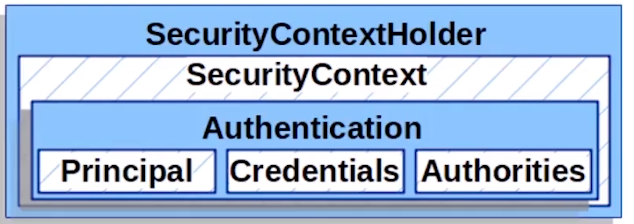

- SecurityContextHandler&#x20;
  - 用于管理SpringContext的
  - 一个工具类，它提供了对安全上下文的访问，默认情况下，使用了一个ThreadLocal对象来存储安全上下文，这意味着它是线程安全的
  - &#x20;使用 ThreadLocal 来存储这些细节，这很重要，意味着SpringContext 在同一线程下都是可以取来用的
- SecurityContext&#x20;
  - 他其实就包含了一个Authentication对象，而Authentication里面存的就是用户的详细认证信息的，为什么是一个呢？结合ThreadLocal来看，这个Authentication其实就是当前用户的认证信息。即我们可以从SecurityContext中获取当前用户的认证信息
- Authentication &#x20;
  - 存储了当前用户的详细信息
  - Principal 可以理解为用户的信息
  - Credentials 可以理解为密码（凭证）
  - Authorities 可以理解为权限
- GrantedAuthority

  这是用于管理用户权限的，可以通过`Authentication.getAuthorities()`法来获取
- UserDetails
  - 具备一系列的属性约束的
- UserDetailsService
  - 从数据存储中根据用户名找到用户
    UserDetailsService只定义了这么一个接口方法
  ```java
  public interface UserDetailsService {
      UserDetails loadUserByUsername(String var1) throws UsernameNotFoundException;
  }

  ```

这两个对象不负责认证工作，只是提供数据，所以我们一般都通过拓展来实现自定义的数据库结构

- AuthenticationManager
  - 这是定义了Spring Securiy 的Filter是如何执行认证的API，也就是用来管理Spring Security的认证过滤链的了
  - 也就是说如果我们想要定义一个自己的Filter，可以通过实现AuthenticationManager来完成
- ProviderManager
  - 这是最常用的AuthenticationManager实现类，其内部是由一连串的过滤链组成，这些过滤链会层层传递，一层出错或者说认证错误就不能够继续向下执行了，会抛出AuthenticationException

    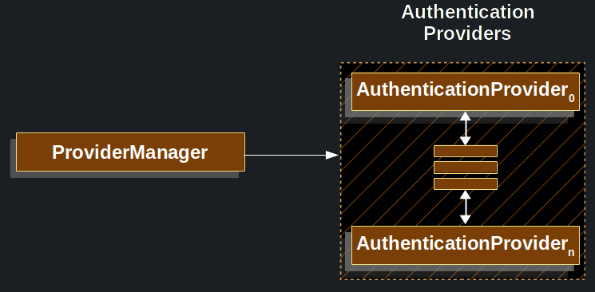
  - 另外AuthenticationManager是可以有多个继承类的，这意味着我们可以为我们的应用设置多套过滤链，说人话就是我们可以有手机号认证的同时也可以有账号、密码认证等多种认证方式

    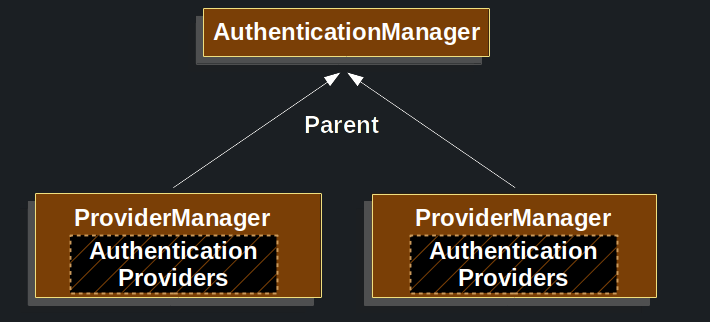
  > 你可以在 [ProviderManager](https://springdoc.cn/spring-security/servlet/authentication/architecture.html#servlet-authentication-providermanager "ProviderManager") 中注入多个 [AuthenticationProvider](https://docs.spring.io/spring-security/site/docs/current/api/org/springframework/security/authentication/AuthenticationProvider.html "AuthenticationProvider") 实例。每个 `AuthenticationProvider` 都执行一种特定类型的认证。例如， [DaoAuthenticationProvider](https://springdoc.cn/spring-security/servlet/authentication/passwords/dao-authentication-provider.html#servlet-authentication-daoauthenticationprovider "DaoAuthenticationProvider") 支持基于用户名/密码的认证，而 `JwtAuthenticationProvider` 支持认证JWT令牌。
- AbstractAuthenticationProcessingFilter
  - 这是校验用户凭证很重要的一个Filter，他其实是过滤链（SecurityFilterChain）中的一环
  - 以下是他认证的流程，这是比较重要的，理解下来，对于我们后面对认证流程的理解做拓展是非常有帮助的，其实所有的认证流程都是这么跑的，只是这图对对应的FIlter和校验信息Authentication做了抽象而已，不妨我们对比一下两张图，上图就是认证流程，下图是用户表单提交的认证流程。

    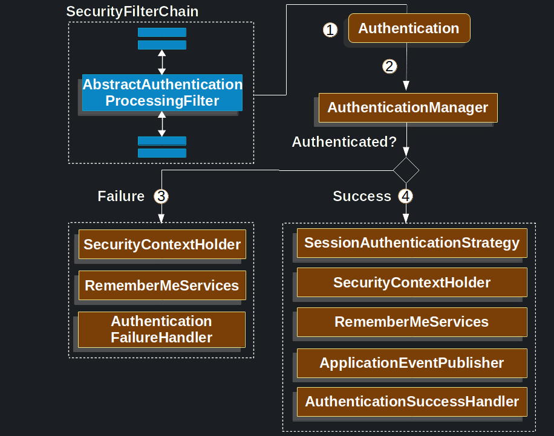

    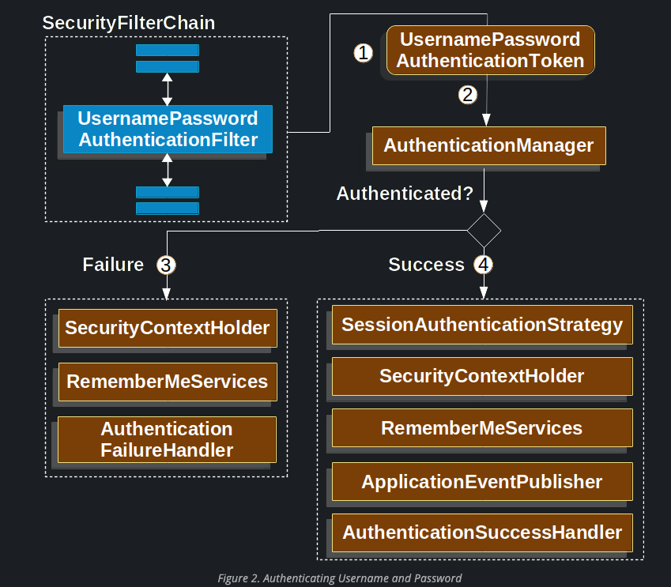
    1. 当用户提交凭证的时候，AbstractAuthenticationProcessingFilter会从HttpServletRequest中创建一个会根据校验类型来创建要进行认证的Authentication
    2. 交给AuthenticationManager进行认证
    3. 如果认证失败
       1. SecurityContextHolder被清空
       2. RememberMeServices.loginFail方法会被调用
       3. AuthenticationFailureHandler 被调用
    4. 认证成功
       1. SessionAuthenticationStrategy 被通知有新登陆
       2. Authentication 是在SecurityContextHolder上设置的，如果想要保存SecurityContext以便在后面的请求中自动设置，需要调用SecurityContext Repository,saveContext
       3. RemeberMeServices.loginSuccess被调用
       4. ApplicationEventPublisher 发布一个InteractiveAuthenticationSuccessEvent事件
       5. AuthenticationSuccessHandler被调用

### 简单认证

#### 表单认证

表单认证其实配置起来还是比较简单的，也就是一句配置的事儿，而Spring Security 表单登录是默认被启用的，所以如果是想要默认的表单登录方式的话，其实是不需要配置的，如果想要配置我们需要这样配置，其实就是对formLogin进行配置

```java
public SecurityFilterChain filterChain(HttpSecurity http) {
  http
    .formLogin(withDefaults());
  // ...
}
```

我们还可以配置具体的登陆页面，或者说登陆接口

```java
public SecurityFilterChain filterChain(HttpSecurity http) {
  http
    .formLogin(form -> form
      .loginPage("/login")
      .permitAll()
    );
  // ...
}
```

如果我们什么都不配置，直接启动的话，就会得到一个临时的密码，结合初始化用户名user就可以跑通默认的认证逻辑了

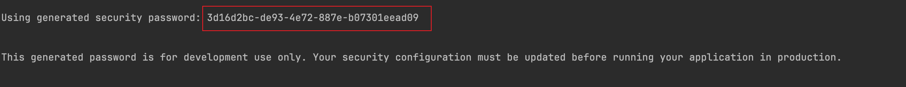

#### 密码存储

##### 内存存储

Spring Security提供的密码存储方式是非常多的，最简单的，也是我们学习过程中便于用来测试的就是直接把用户信息存在内存里了,当然我们还需要指定使用的加密方式

```java
    @Bean
    public UserDetailsService users() {
        UserDetails user = User.builder()
                .username("user")
                .password("$2a$16$lPDF8WO5iqGy9xTGwj3iDeDh8G8u47pdkKcb1OKz0wOcQqgr0EF5i")
                .roles("USER")
                .build();
        return new InMemoryUserDetailsManager(user);
    }
    
    @Bean
    public BCryptPasswordEncoder passwordEncoder(){
        return new BCryptPasswordEncoder();
    }

```

密码生成我们可以采用以下代码设置

```java
    public static void main(String[] args) {
        // Create an encoder with strength 16
        BCryptPasswordEncoder encoder = new BCryptPasswordEncoder(16);
        String result = encoder.encode("123456");
        System.out.println(result);
    }
```

Spring Security还为我们提供了非常多的加密方式的，不过其默认采用的是DelegatingPasswordEncoder加密方式，更多的可以浏览官方说明

[https://springdoc.cn/spring-security/features/authentication/password-storage.html#authentication-password-storage-dpe](https://springdoc.cn/spring-security/features/authentication/password-storage.html#authentication-password-storage-dpe "https://springdoc.cn/spring-security/features/authentication/password-storage.html#authentication-password-storage-dpe")

里面提到很多加密方式都是相对安全的，当然选择了对应的加密方式，我们还需要把对应的`PasswordEncoder`暴露出来供Spring使用才行喔，就像下面这样

```java
    @Bean
    public PasswordEncoder passwordEncoder(){
        return new BCryptPasswordEncoder();
    }
```

##### 数据库存储

当然我们在日常开发中是需要使用到数据库的，而Spring Security是给我们提供了JDBC的存储方式的，包括修改密码，都可以通过配置进行处理

接下来就以Spring Security + Mysql为例

首先我们当然需要先具备一张User 表

```sql
CREATE TABLE `sys_user` (
  `user_id` bigint NOT NULL AUTO_INCREMENT COMMENT '用户ID',
  `user_name` varchar(30) NOT NULL COMMENT '用户账号',
  `nick_name` varchar(30) NOT NULL COMMENT '用户昵称',
  `user_type` varchar(2) DEFAULT '00' COMMENT '用户类型（00系统用户）',
  `email` varchar(50) DEFAULT '' COMMENT '用户邮箱',
  `phonenumber` varchar(11) DEFAULT '' COMMENT '手机号码',
  `sex` char(1) DEFAULT '0' COMMENT '用户性别（0男 1女 2未知）',
  `avatar` varchar(100) DEFAULT '' COMMENT '头像地址',
  `password` varchar(100) DEFAULT '' COMMENT '密码',
  `status` char(1) DEFAULT '0' COMMENT '帐号状态（0正常 1停用）',
  `login_ip` varchar(128) DEFAULT '' COMMENT '最后登录IP',
  `login_date` datetime DEFAULT NULL COMMENT '最后登录时间',
  `remark` varchar(500) CHARACTER SET utf8 COLLATE utf8_general_ci DEFAULT NULL COMMENT '备注',
  `create_user` bigint DEFAULT NULL COMMENT '创建者',
  `create_time` datetime DEFAULT NULL COMMENT '创建时间',
  `update_user` bigint DEFAULT NULL COMMENT '更新者',
  `update_time` datetime DEFAULT NULL COMMENT '更新时间',
  `del_flag` bit(1) DEFAULT NULL COMMENT '逻辑删除(1:已删除，0:未删除)',
  PRIMARY KEY (`user_id`)
) ENGINE=InnoDB AUTO_INCREMENT=1686027685614125058 DEFAULT CHARSET=utf8mb3 COMMENT='用户信息表';
```

导入Druid 驱动 和 Mybatis plus 用于操作数据库

```xml
       <dependency>
            <groupId>com.alibaba</groupId>
            <artifactId>druid</artifactId>
            <version>1.2.6</version>
        </dependency>
        
        <dependency>
            <groupId>com.baomidou</groupId>
            <artifactId>mybatis-plus-boot-starter</artifactId>
            <version>3.5.4.1</version>
        </dependency>

```

然后我们需要创建一个实体类，Spring Security 给我们提供了User基础实体类给我们使用的，我们只需写一些额外的属性即可

```java
@Getter
@Setter
public class UserVo extends User {

    private String phone;

    private String sex;

    public UserVo(String username, String password, Collection<? extends GrantedAuthority> authorities) {
        super(username, password, authorities);
    }
}
```

不妨我们可以点进User看看，可以看到这个基础实体类中已经含有username和password，并且实现了UserDetails了，如果不想使用该提供的User类，我们也要模拟这个做法，实现UserDetails接口，这样才能综合UserDetailsServices接口获取用户持久化凭证信息

不过从User这个类可以看出来他配置的是username和password，不一定就跟我们的数据库是对应上的

```java
public class User implements UserDetails, CredentialsContainer {
    private static final long serialVersionUID = 610L;
    private static final Log logger = LogFactory.getLog(User.class);
    private String password;
    private final String username;
    private final Set<GrantedAuthority> authorities;
    private final boolean accountNonExpired;
    private final boolean accountNonLocked;
    private final boolean credentialsNonExpired;
    private final boolean enabled;
```

如果是我们自创的UserVo 不想使用User的话，那实现UserDetails即可，这个是用于接受我们输入的数据的

```java
@TableName(value ="sys_user")
@Data
@ToString
public class SysUser  implements Serializable, UserDetails {
    /**
     * 用户ID
     */
    @TableId(type = IdType.AUTO)
    private Long userId;

    /**
     * 用户账号
     */
    private String userName;

    /**
     * 用户昵称
     */
    private String nickName;

    /**
     * 用户类型（00系统用户）
     */
    private String userType;

    /**
     * 用户邮箱
     */
    private String email;

    /**
     * 手机号码
     */
    private String phonenumber;

    /**
     * 用户性别（0男 1女 2未知）
     */
    private String sex;

    /**
     * 头像地址
     */
    private String avatar;

    /**
     * 密码
     */
    private String password;

    /**
     * 帐号状态（0正常 1停用）
     */
    private String status;

    /**
     * 最后登录IP
     */
    private String loginIp;

    /**
     * 最后登录时间
     */
    private Date loginDate;

    /**
     * 备注
     */
    private String remark;

    /**
     * 创建者
     */
    private Long createUser;

    /**
     * 创建时间
     */
    private Date createTime;

    /**
     * 更新者
     */
    private Long updateUser;

    /**
     * 更新时间
     */
    private Date updateTime;

    /**
     * 逻辑删除(1:已删除，0:未删除)
     */
    private Boolean del_flag;


    private Collection<? extends GrantedAuthority> authorities;

    @TableField(exist = false)
    private static final long serialVersionUID = 1L;


    @Override
    public Collection<? extends GrantedAuthority> getAuthorities() {
        return authorities;
    }

    @Override
    public String getUsername() {
        return userName;
    }

    @Override
    public String getPassword(){
        return password;
    }

    @Override
    public boolean isAccountNonExpired() {
        return true;
    }

    @Override
    public boolean isAccountNonLocked() {
        return true;
    }

    @Override
    public boolean isCredentialsNonExpired() {
        return true;
    }

    @Override
    public boolean isEnabled() {
        return true;
    }
}

```

接下来我们就需要创建一个UserImpl实现SpringSecurity提供的UserDetailsService接口，可以看到他就是用UserDetails进行接收我们的用户信息的，这也是我们要通过实体类实现这个接口的原因

```java
@Service
public class SysUserServiceImpl extends ServiceImpl<SysUserMapper, SysUser>
    implements SysUserService, UserDetailsService {

    @Override
    public UserDetails loadUserByUsername(String username) throws UsernameNotFoundException {
        return null;
    }
}

```

我们只需要实现loadUserByUsername方法，跑通该方法，用户凭证信息就会被存于UserDetails

```java
    @Override
    public UserDetails loadUserByUsername(String username) throws UsernameNotFoundException {
        QueryWrapper<SysUser> queryWrapper = new QueryWrapper<>();
        queryWrapper.eq("username", username);
        return this.getOne(queryWrapper);
    }
```

那么用户信息如何进行校验呢？只需使用AuthenticationManager帮助我们进行校验即可，方法还是非常简单的

先全局注入AuthenticationManager Bean&#x20;

```java
    @Bean
    public AuthenticationManager getAuthenticationManager(AuthenticationConfiguration authenticationConfiguration) throws Exception {
        return authenticationConfiguration.getAuthenticationManager();
    }
```

```java
    @Autowired
    private AuthenticationManager authenticationManager;
    
    @PostMapping("login")
    public String Login(@RequestBody SysUser sysUser){
        try {
            UsernamePasswordAuthenticationToken token = new UsernamePasswordAuthenticationToken(sysUser.getUsername(), sysUser.getPassword());
            Authentication authenticate = authenticationManager.authenticate(token);
            if (!authenticate.isAuthenticated()) {
                return "fail";
            }
        }catch (Exception e){
            e.printStackTrace();
        }
        return "success";
    }

```

最后我们需要修改Spring Security 配置，requestMatchers表示对该路径请求放行，并禁用默认开启的cors，csrf，formLogin

```java
@Bean
    public SecurityFilterChain securityFilterChain(HttpSecurity http) throws Exception {
        http
//                .userDetailsService(userService)
                .authorizeHttpRequests((auth) -> {
                    auth
                            .requestMatchers("/system/auth/login")
                            .permitAll()
                            .anyRequest()
                            .authenticated();
                })
                .cors(c -> {
                    c.disable();
                })
                .csrf(c -> {
                    c.disable();
                })
                .formLogin(f -> {
                    f.disable();
                });

        return http.build();
    }
```

完成至这部，简单的用户认证就算完成了。

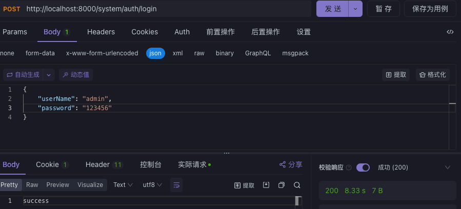

### 认证流程分析

浅试了Spring Security 的认证，那么接下来就一起来看看以上的用户认证是怎么在Spring Security 跑通的吧,首先大家可以先回头回顾一下核心组件的内容，然后我们就一块走进Spring Security咯

首先我们需要先找到入口，从以下代码来看，我们是通过请求中传过来的用户名，密码包装成UsernamePasswordAuthenticationToken传给了Authentication，所以很显然，Authentication就是我们需要探索的入口

```java
  UsernamePasswordAuthenticationToken token = new UsernamePasswordAuthenticationToken(sysUser.getUsername(), sysUser.getPassword());
  Authentication authenticate = authenticationManager.authenticate(token);
```

```java
public interface AuthenticationManager {
    Authentication authenticate(Authentication authentication) throws AuthenticationException;
}

```

跑进去后，我们发现AuthenticationManager是 一个接口，不过ProviderManager是AuthenticationManager最常用的实现类了，所以我们果断将断点打到该实现类上，以下就是认证核心代码

```java
      Class<? extends Authentication> toTest = authentication.getClass();
        AuthenticationException lastException = null;
        AuthenticationException parentException = null;
        Authentication result = null;
        Authentication parentResult = null;
        int currentPosition = 0;
        int size = this.providers.size();
        Iterator var9 = this.getProviders().iterator();

        while(var9.hasNext()) {
            AuthenticationProvider provider = (AuthenticationProvider)var9.next();
            if (provider.supports(toTest)) {
                if (logger.isTraceEnabled()) {
                    Log var10000 = logger;
                    String var10002 = provider.getClass().getSimpleName();
                    ++currentPosition;
                    var10000.trace(LogMessage.format("Authenticating request with %s (%d/%d)", var10002, currentPosition, size));
                }

                try {
                    result = provider.authenticate(authentication);
                    if (result != null) {
                        this.copyDetails(authentication, result);
                        break;
                    }
                } catch (InternalAuthenticationServiceException | AccountStatusException var14) {
                    this.prepareException(var14, authentication);
                    throw var14;
                } catch (AuthenticationException var15) {
                    lastException = var15;
                }
            }
        }

        if (result == null && this.parent != null) {
            try {
                parentResult = this.parent.authenticate(authentication);
                result = parentResult;
            } catch (ProviderNotFoundException var12) {
            } catch (AuthenticationException var13) {
                parentException = var13;
                lastException = var13;
            }
        }

        if (result != null) {
            if (this.eraseCredentialsAfterAuthentication && result instanceof CredentialsContainer) {
                ((CredentialsContainer)result).eraseCredentials();
            }

            if (parentResult == null) {
                this.eventPublisher.publishAuthenticationSuccess(result);
            }

            return result;
        } else {
            if (lastException == null) {
                lastException = new ProviderNotFoundException(this.messages.getMessage("ProviderManager.providerNotFound", new Object[]{toTest.getName()}, "No AuthenticationProvider found for {0}"));
            }

            if (parentException == null) {
                this.prepareException((AuthenticationException)lastException, authentication);
            }

            throw lastException;
        }
    }
```

我们主要关注这部分，这部分可不就是跟图对应起来了吗？没错ProviderManager就是管理所有的AuthenticationProvider，而代码中不就是遍历所有的AuthenticationProvider，并把我们传入的待认证信息传给每个AuthenticationProvider进行校验吗？

```java
  while(var9.hasNext()) {
            AuthenticationProvider provider = (AuthenticationProvider)var9.next();
            if (provider.supports(toTest)) {
                if (logger.isTraceEnabled()) {
                    Log var10000 = logger;
                    String var10002 = provider.getClass().getSimpleName();
                    ++currentPosition;
                    var10000.trace(LogMessage.format("Authenticating request with %s (%d/%d)", var10002, currentPosition, size));
                }

                try {
                    result = provider.authenticate(authentication);
                    if (result != null) {
                        this.copyDetails(authentication, result);
                        break;
                    }
                } catch (InternalAuthenticationServiceException | AccountStatusException var14) {
                    this.prepareException(var14, authentication);
                    throw var14;
                } catch (AuthenticationException var15) {
                    lastException = var15;
                }
            }
        }
```


那我们先来看看providers中都有什么，第一个就是DaoAuthenticationProvider，进入该Provider看看他是做什么的，点进去我们会发现该Provider 是继承于AbstractUserDetailsAuthenticationProvider的，Dao如果我们猜的话，应该不难猜出来他应该是通过查询数据库或者说是属于一个数据层的实现，不过我们还是得先看看其父类到底做了什么？再逐步回到子类对父类方法的实现

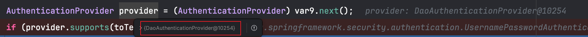

跑到父类AbstractUserDetailsAuthenticationProvider，最最显眼的自然就是authenticate了，从名字看就能看出来他应该是认证的核心方法了，其实这段代码很明显是做了用户认证信息的检查校验了

```java
  @Override
  public Authentication authenticate(Authentication authentication) throws AuthenticationException {
    Assert.isInstanceOf(UsernamePasswordAuthenticationToken.class, authentication,
        () -> this.messages.getMessage("AbstractUserDetailsAuthenticationProvider.onlySupports",
            "Only UsernamePasswordAuthenticationToken is supported"));
    String username = determineUsername(authentication);
    boolean cacheWasUsed = true;
    //从缓存中获取用户信息
    UserDetails user = this.userCache.getUserFromCache(username);
    if (user == null) {
      cacheWasUsed = false;
      try {
        //缓存没有的情况
        user = retrieveUser(username, (UsernamePasswordAuthenticationToken) authentication);
      }
      catch (UsernameNotFoundException ex) {
        this.logger.debug("Failed to find user '" + username + "'");
        if (!this.hideUserNotFoundExceptions) {
          throw ex;
        }
        throw new BadCredentialsException(this.messages
          .getMessage("AbstractUserDetailsAuthenticationProvider.badCredentials", "Bad credentials"));
      }
      Assert.notNull(user, "retrieveUser returned null - a violation of the interface contract");
    }
    try {
      //前检查由DefaultPreAuthenticationChecks类实现（主要判断当前用户是否锁定，过期，冻结User接口）
      this.preAuthenticationChecks.check(user);
      //校验信息，由子类实现
      additionalAuthenticationChecks(user, (UsernamePasswordAuthenticationToken) authentication);
    }
    catch (AuthenticationException ex) {
      if (!cacheWasUsed) {
        throw ex;
      }
      // There was a problem, so try again after checking
      // we're using latest data (i.e. not from the cache)
      cacheWasUsed = false;
      user = retrieveUser(username, (UsernamePasswordAuthenticationToken) authentication);
      this.preAuthenticationChecks.check(user);
      additionalAuthenticationChecks(user, (UsernamePasswordAuthenticationToken) authentication);
    }
    this.postAuthenticationChecks.check(user);
    if (!cacheWasUsed) {
      this.userCache.putUserInCache(user);
    }
    Object principalToReturn = user;
    if (this.forcePrincipalAsString) {
      principalToReturn = user.getUsername();
    }
    return createSuccessAuthentication(principalToReturn, authentication, user);
  }

```

那么接下来我们就来看看子类是怎么实现这些方法的，其中有两个方法是子类实现的，两个方法的逻辑很简单明了了，1是调用了loadUserByUsername方法，2是密码比对，而loadUserByUsername就是我们实现的Service方法了

校验主要有三步

1. preAuthenticationChecks 前检查由DefaultPreAuthenticationChecks类实现主要判断当前用户是否锁定，过期，冻结
2. additionalAuthenticationChecks（抽象方法，子类实现）密码比对
3. postAuthenticationChecks 检测用户密码是否过期

```java
@Override
  protected final UserDetails retrieveUser(String username, UsernamePasswordAuthenticationToken authentication)
      throws AuthenticationException {
    prepareTimingAttackProtection();
    try {
      UserDetails loadedUser = this.getUserDetailsService().loadUserByUsername(username);
      if (loadedUser == null) {
        throw new InternalAuthenticationServiceException(
            "UserDetailsService returned null, which is an interface contract violation");
      }
      return loadedUser;
    }
    catch (UsernameNotFoundException ex) {
      mitigateAgainstTimingAttack(authentication);
      throw ex;
    }
    catch (InternalAuthenticationServiceException ex) {
      throw ex;
    }
    catch (Exception ex) {
      throw new InternalAuthenticationServiceException(ex.getMessage(), ex);
    }
  }
```

```java
@Override
  @SuppressWarnings("deprecation")
  protected void additionalAuthenticationChecks(UserDetails userDetails,
      UsernamePasswordAuthenticationToken authentication) throws AuthenticationException {
    if (authentication.getCredentials() == null) {
      this.logger.debug("Failed to authenticate since no credentials provided");
      throw new BadCredentialsException(this.messages
        .getMessage("AbstractUserDetailsAuthenticationProvider.badCredentials", "Bad credentials"));
    }
    String presentedPassword = authentication.getCredentials().toString();
    if (!this.passwordEncoder.matches(presentedPassword, userDetails.getPassword())) {
      this.logger.debug("Failed to authenticate since password does not match stored value");
      throw new BadCredentialsException(this.messages
        .getMessage("AbstractUserDetailsAuthenticationProvider.badCredentials", "Bad credentials"));
    }
  }
```

基本的用户名，密码的认证流程可以先到这个告一段落了，为了能让整个流程更加直观，可以根据下图再跑跑debug ，相信会更加清晰的

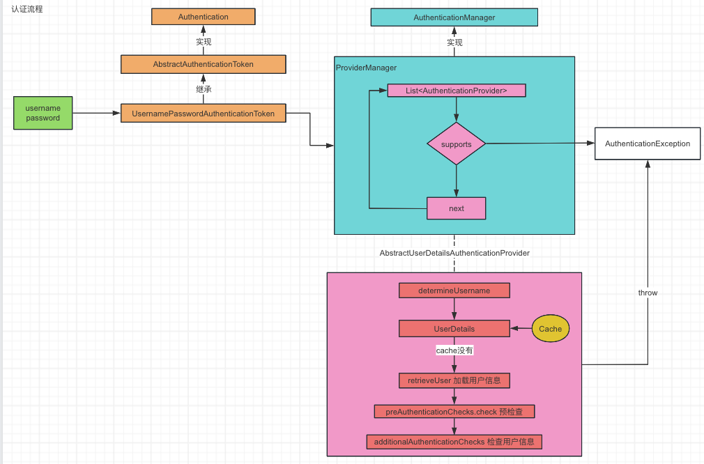

### 过滤器链

基本的认证流程到这里相信大家有了不少了解，而刚刚我们研究的都只是Spring Security 中的一条过滤链，即UsernamePasswordAuthenticationFilter，而在Spring Security中还是有很多过滤链的，包括我们需要拓展Spring Security的功能，最好的方式也是添加一个Filter到其中

Spring Security 是由一系列的过滤链配合完成，更加直观地说呢，就是不管你是请求还是响应，都必须经过他每一层过滤器的校验，校验**都通过**才能顺利访问到后端服务器，他就是我们访问后端服务器路途中的层层关卡

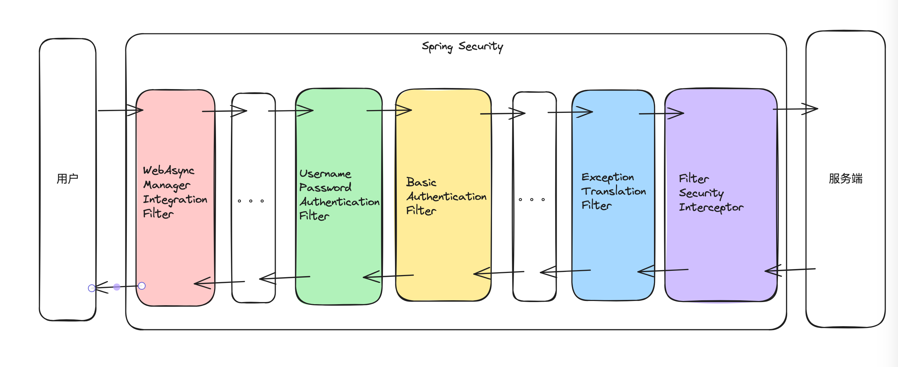

当然每个过滤器都有其职责的

- WebAsyncManagerIntegrationFilter 此过滤器用于集成SecurityContext到Spring异步执行机制中的WebAsyncManager
- UsernamePasswordAuthenticationFilter 认证操作全靠这个过滤器，默认匹配URL为/login且必须为POST请求。
- BasicAuthenticationFilter 此过滤器会自动解析HTTP请求中头部名字为Authentication，且以Basic开头的头信息。
- DefaultLoginPageGeneratingFilter 默认的登陆页面生成过滤器，用于生成一个登录页，如果没有禁用，则系统会自动给我们生成对应的登陆页，这就是为什么当我们引入Spring Security时会自动产生一个登录页的原因
- DefaultLogoutPageGeneratingFilter 如果没有禁用该功能，会生成一个注销页
- ExceptionTranslationFilter 异常转换过滤器位于整个springSecurityFilterChain的后方，用来转换整个链路中出现的异常
- FilterSecurityInterceptor  获取所配置资源访问的授权信息，根据SecurityContextHolder中存储的用户信息来决定其是否有权限。

把整个过滤器链熟悉下来，对于后面对Spring Security 拓展是十分有帮助的，在这里我们先花点时间记住这条过滤器链。

当我们开启Spring Security 日志时，Spring 项目开启时，会出现以下日志

```java
o.s.s.web.context.SecurityContextPersistenceFilter@8851ce1,
o.s.s.web.header.HeaderWriterFilter@6a472566, o.s.s.web.csrf.CsrfFilter@61cd1c71,
o.s.s.web.authentication.logout.LogoutFilter@5e1d03d7,
o.s.s.web.authentication.UsernamePasswordAuthenticationFilter@122d6c22,
o.s.s.web.savedrequest.RequestCacheAwareFilter@5ef6fd7f,
o.s.s.web.servletapi.SecurityContextHolderAwareRequestFilter@4beaf6bd,
o.s.s.web.authentication.AnonymousAuthenticationFilter@6edcad64,
o.s.s.web.session.SessionManagementFilter@5e65afb6,
o.s.s.web.access.ExceptionTranslationFilter@5b9396d3,
o.s.s.web.access.intercept.FilterSecurityInterceptor@3c5dbdf8
```

许多过滤器其实都是望文生义的。

### Remeber me&#x20;

为解决session 过期后用户的直接访问问题，Spring Security 提供开箱即用的配置remember me

原理：

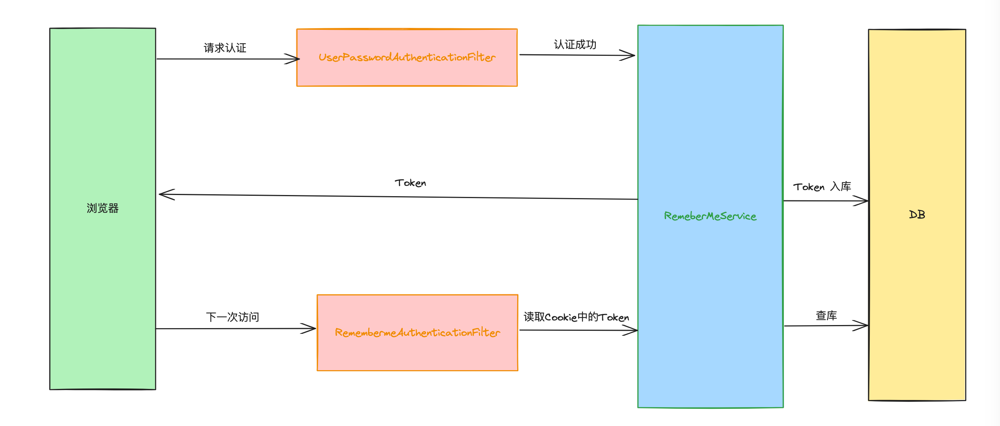

- 当用户第一次访问时，需要用户名密码认证，所以会走UserPasswordAuthenticationFilter，认证成功后会在RemembermeService生成Token并通过TokenRepository写到数据库中，发送到浏览器的Token会存储到cookies当中。
- 第二次访问或者服务重启后，浏览器再次访问会带着Token进行访问，此时会走RemembermeAuthenticationFilter，RemembermeAuthenticationFilter主要就是Cookies中获取Token通过RemembermeService查询数据库，最后获取响应信息存储到UserDetails中。
- 使用cookie 存储用户名，过期时间，以及一个HashHash是由md5(用户名+过期时间+密码+key)

#### 开启Remeber me

```java
@Bean
    public SecurityFilterChain securityFilterChain(HttpSecurity http,RememberMeServices rememberMeServices) throws Exception {
        http
//                .userDetailsService(userService)
                .authorizeHttpRequests((auth) -> {
                    auth
                            .requestMatchers("/system/auth/login")
                            .permitAll()
                            .anyRequest()
                            .authenticated();
                })
                .cors(c -> {
                    c.disable();
                })
                .csrf(c -> {
                    c.disable();
                })
                .formLogin(f -> {
                    f.disable();
                })
                .rememberMe(r -> {
                    r.rememberMeServices(rememberMeServices);
                });

        return http.build();
    }


    @Bean
    RememberMeServices rememberMeServices(UserDetailsService userDetailsService) {
        TokenBasedRememberMeServices.RememberMeTokenAlgorithm encodingAlgorithm = TokenBasedRememberMeServices.RememberMeTokenAlgorithm.SHA256;
        TokenBasedRememberMeServices rememberMe = new TokenBasedRememberMeServices("123456", userDetailsService, encodingAlgorithm);
        rememberMe.setMatchingAlgorithm(TokenBasedRememberMeServices.RememberMeTokenAlgorithm.MD5);
        return rememberMe;
    }
```

### 注销

Spring Security本身就对注销有支持的，默认的url是/logout,当我们注销的时候，Spring Security会有一些默认行为

- 使 HTTP session无效&#x20;
- 清理 [SecurityContextHolderStrategy](https://springdoc.cn/spring-security/servlet/authentication/session-management.html#use-securitycontextholderstrategy "SecurityContextHolderStrategy")
- 清理 [SecurityContextRepository](https://springdoc.cn/spring-security/servlet/authentication/persistence.html#securitycontextrepository "SecurityContextRepository")
- 清理任何 [RememberMe 认证](https://springdoc.cn/spring-security/servlet/authentication/rememberme.html "RememberMe 认证")&#x20;
- 清除任何已保存的 [CSRF token](https://springdoc.cn/spring-security/servlet/exploits/csrf.html "CSRF token")
- [触发](https://springdoc.cn/spring-security/servlet/authentication/events.html "触发") `LogoutSuccessEvent`

当然我们可以自定义url，在配置中进行配置即可，还可以配置注销成功后指向的请求

```java
http
    .authorizeHttpRequests((authorize) -> authorize
        .requestMatchers("/my/success/endpoint").permitAll()
        // ...
    )
    .logout((logout) -> logout.logoutSuccessUrl("/my/success/endpoint"))
```

注销其实也是为了做一个用户信息清理的工作或者其他清理的工作，Spring Security也是提供了部分清理的方法我们使用的

```java
CookieClearingLogoutHandler cookies = new CookieClearingLogoutHandler("our-custom-cookie");
http
    .logout((logout) -> logout.addLogoutHandler(cookies))
```

还有更为安全的清理方式，使用Clear-Site-Data来清理，这是会直接清理所有跟自己网站相关的缓存，cookie，storage的，其实就是给请求头添加一个Clear-Site-Data，让浏览器执行该指令的

```java
HeaderWriterLogoutHandler clearSiteData = new HeaderWriterLogoutHandler(new ClearSiteDataHeaderWriter());
http
    .logout((logout) -> logout.addLogoutHandler(clearSiteData))
```

有时候我们需要自定义一些注销成功的事件，我们可以这么做，HttpStatusReturningLogoutSuccessHandler 可以替换成我们自定义的

```java
http
    .logout((logout) -> logout.logoutSuccessHandler(new HttpStatusReturningLogoutSuccessHandler()))
```

### 认证事件

Spring Security 对每一个认证成功或者失败都会触发相应的事件，为了监听这些事件，你必须先发布一个 AuthenticationEventPublisher。Spring Security的 DefaultAuthenticationEventPublisher 可以很好地实现这一目的，然后你可以使用Spring的 @EventListener 支持

```java
@Bean
public AuthenticationEventPublisher authenticationEventPublisher
        (ApplicationEventPublisher applicationEventPublisher) {
    return new DefaultAuthenticationEventPublisher(applicationEventPublisher);
}
```

```java
@Component
public class AuthenticationEvents {
  @EventListener
    public void onSuccess(AuthenticationSuccessEvent success) {
    // ...
    }

    @EventListener
    public void onFailure(AbstractAuthenticationFailureEvent failures) {
    // ...
    }
}
```

### 拓展巩固

#### 整合JWT

JWT（JSON Web Token）是一种基于JSON的开放标准（RFC 7519），用于在网络应用程序之间安全地传递信息。它被用作身份验证和授权机制，用于验证用户身份和访问权限。

想要进一步了解的可以看：[https://jwt.io/](https://jwt.io/ "https://jwt.io/")

优势：

1. 简单：JWT 非常简单，易于实现和理解。
2. 安全：JWT 使用密码学保证数据的完整性和机密性。
3. 跨域：JWT 可以在不同的域之间传递，使得跨域通信变得更加容易。
4. 灵活：JWT 可以存储多种类型的数据，例如用户ID、角色、权限等。
5. 标准化：JWT 是一种开放标准，可以在各种编程语言和框架中使用。

劣势：

1. 有限的用途：JWT 通常用于身份验证和授权，但在其他场景中可能不适用。
2. 容易受到中间人攻击：如果 JWT 没有正确设置，容易受到中间人攻击，导致数据泄露或伪造。
3. 密钥管理：JWT 使用密码学保证数据的完整性和机密性，但是密钥管理需要谨慎，否则容易受到攻击。
4. 有限的信息：JWT 只能存储有限的数据，过多的装载会使得请求头过重
5. 有限的签名算法：JWT 使用哈希函数进行签名，但是目前只支持 SHA-1 和 SHA-256 算法，这可能会受到安全问题的影响。

JWT工作流程

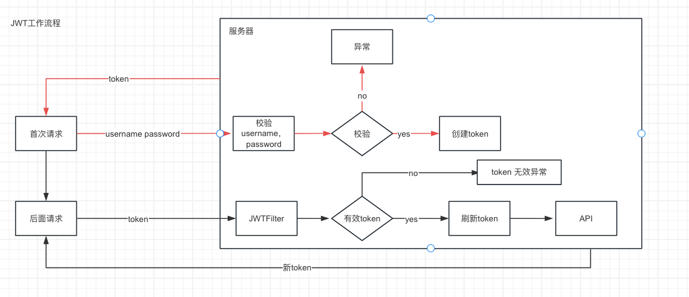

代码实践

首先需要引入依赖

```xml
<!-- https://mvnrepository.com/artifact/io.jsonwebtoken/jjwt-api -->
        <dependency>
            <groupId>io.jsonwebtoken</groupId>
            <artifactId>jjwt-api</artifactId>
            <version>0.11.5</version>
        </dependency>

        <!-- https://mvnrepository.com/artifact/io.jsonwebtoken/jjwt-impl -->
        <dependency>
            <groupId>io.jsonwebtoken</groupId>
            <artifactId>jjwt-impl</artifactId>
            <version>0.11.5</version>
            <scope>runtime</scope>
        </dependency>

        <!-- https://mvnrepository.com/artifact/io.jsonwebtoken/jjwt-jackson -->
        <dependency>
            <groupId>io.jsonwebtoken</groupId>
            <artifactId>jjwt-jackson</artifactId>
            <version>0.11.5</version>
            <scope>runtime</scope>
        </dependency>

```

然后就是创建一个JWT工具类帮助我们创建jwt

```java
@Component
public class JwtUtils {

    //创建密钥
    public static final Key JWT_KEY = Keys.secretKeyFor(SignatureAlgorithm.HS256);

    //传入SysUser 是为了测试，正常情况下应是传入UserDetails
    public String createJwt(SysUser user){
        long now = System.currentTimeMillis();
        return Jwts.builder()
                .setId("test")
                .claim("userId",user.getUserId())
                .claim("username",user.getUsername())
                .setSubject("test")
                .setIssuedAt(new Date(now)) //签名时间
                .setExpiration(new Date(now + 1000 * 60 * 60 * 24 * 7)) //过期时间
                .signWith(JWT_KEY,SignatureAlgorithm.HS256) //签名密钥
                .compact();
    }
}
```

```java
    public static void main(String[] args) throws NoSuchAlgorithmException {
        JwtUtils jwtUtils = new JwtUtils();
        SysUser user = new SysUser();
        user.setUserId(1L);
        user.setUserName("test");
        System.out.println(jwtUtils.createJwt(user));
    }
```

测试可以看到生成了对应的token 了

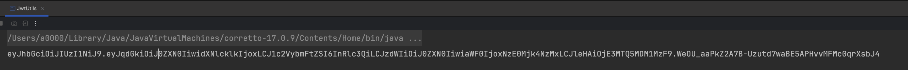

通过createJwt工具方法创建了token后，我们可以构建一个方法来对token进行校验，下面代码对两个地方进行校验，1是过期时间，2是是否能够取到数据

```java
   /**
     * @Description 通过token获取Claims
     * @Author T
     * @Date 2024/4/28 18:51
     **/
    private Claims getClaimsByJwt(String jwt){
        return  Jwts.parser()
                .setSigningKey(JWT_KEY)
                .parseClaimsJws(jwt)
                .getBody();
    }
  
   /**
     * @Description 检查Token是否过期
     * @Author T
     * @Date 2024/4/28 18:55     
     **/
    public boolean validateJwt(String token) {
        Claims claims = null;
        try{
            claims = getClaimsByJwt(token);
        }catch (Exception e){
            return false;
        }
        return claims.getExpiration().before(new Date());
    }
```

好了有了这么个JWT工具类后，就可以尝试来完成过滤器部分了，即我们要创建一个JWTFilter放到Spring Security的过滤链上

JWTFilter工作有两个

1. 校验token
2. 校验通过，刷新token
3. 校验不通过，清除SecurityContext

而token的格式我们可以设置为在请求头Authorization上 ，以T开头后跟token，当然这个可以自己来设定，但是在校验的时候要记得处理

```java
private String checkJwtToken(HttpServletRequest request) {
        String authorization = request.getHeader("Authorization");
        if (authorization != null && authorization.startsWith("T ")) {
            String token = authorization.substring(2);
            if (jwtUtils.validateJwt(token, SecurityContextHolder.getContext().getAuthentication().getName())) {
                return token;
            }
            return null;
        }else{
            return null;
        }
    }
```

然后我们创建的JWTFilter要继承OncePerRequestFilter类，该Filter的功能还是相对比较简单的，就是校验token，有效就构建UsernamePasswordAuthenticationToken放在Context中表示已登陆，无效则清除了Context

构建UsernamePasswordAuthenticationToken的时候要注意，我们的目的其实是让 authenticated为true 让后面的UsernamePasswordAuthenticationFilter过滤器能够放行，这也是为什么我们需要把JWTFilter放在UsernamePasswordAuthenticationFilter的原因

```java
    public UsernamePasswordAuthenticationToken(Object principal, Object credentials, Collection<? extends GrantedAuthority> authorities) {
        super(authorities);
        this.principal = principal;
        this.credentials = credentials;
        super.setAuthenticated(true);
    }
```

```java
@Component
public class JWTFilter extends OncePerRequestFilter {

    @Autowired
    private JwtUtils jwtUtils;


    @Override
    protected void doFilterInternal(HttpServletRequest request, HttpServletResponse response, FilterChain filterChain) throws ServletException, IOException {
         String token = checkJwtToken(request);
        if (token != null) {
            String username = jwtUtils.getClaimsByJwt(token).getSubject();
            UsernamePasswordAuthenticationToken authenticationToken = new UsernamePasswordAuthenticationToken(username, null,new ArrayList<>());
            authenticationToken.setDetails(new WebAuthenticationDetailsSource().buildDetails(request));
            SecurityContextHolder.getContext().setAuthentication(authenticationToken);
            Authentication authentication = SecurityContextHolder.getContext().getAuthentication();
            System.out.println(authentication);
            filterChain.doFilter(request,response);
        } else{
            SecurityContextHolder.clearContext();
        }
        filterChain.doFilter(request,response);
    }

    private String checkJwtToken(HttpServletRequest request) {
        String authorization = request.getHeader("Authorization");
        if (authorization != null && authorization.startsWith("T ")) {
            String token = authorization.substring(2);
            if (jwtUtils.validateJwt(token, SecurityContextHolder.getContext().getAuthentication().getName())) {
                return token;
            }
            return null;
        }else{
            return null;
        }
    }
}

```

好了，至此一个简单的JWTFilter 也差不多完成了。

#### 整合SMS短信登陆认证

我们都知道其实Spring Security其实就是一条的过滤链，所以如果说我们想要对其进行拓展，是不是多加一条过滤链就行了呢？结果正是如此！跟JWT Filter一样的，只要校验通过了就直接SecurityContextHolder.getContext().setAuthentication(authenticationToken)就可以了，那么后面的用户名，密码校验就能通过了。

既然Spring Security是一条过滤链，那么现在就需要给这条链加一个过滤器，SmsAuthenticationFilter，

既然都是用于登录的过滤器，那么我们应该参考UsernamePasswordAuthenticationFilter是如何设计的，看源码可得知UsernamePasswordAuthenticationFilter继承于AbstractAuthenticationProcessingFilter

```java
public class UsernamePasswordAuthenticationFilter extends AbstractAuthenticationProcessingFilter 
```

那么我们就来模仿一下

```java
@Component
public class SmsAuthenticationFilter extends AbstractAuthenticationProcessingFilter {


    protected SmsAuthenticationFilter(String defaultFilterProcessesUrl) {
        super(defaultFilterProcessesUrl);
    }

    protected SmsAuthenticationFilter(RequestMatcher requiresAuthenticationRequestMatcher) {
        super(requiresAuthenticationRequestMatcher);
    }

    @Override
    public Authentication attemptAuthentication(HttpServletRequest httpServletRequest, HttpServletResponse httpServletResponse) throws AuthenticationException, IOException, ServletException {
        return null;
    }
}
```

再来看看UsernamePasswordAuthenticationFilter源码，UsernamePasswordAuthenticationFilter会从request中获取username，password，同样其实我们是需要从request 中获取手机号

```java
    public static final String SPRING_SECURITY_FORM_USERNAME_KEY = "username";
    public static final String SPRING_SECURITY_FORM_PASSWORD_KEY = "password";
    private String usernameParameter = "username"; 
    private String passwordParameter = "password";
    private boolean postOnly = true; //判断请求必须是post请求
```

好，再回到源码当中

```java
public Authentication attemptAuthentication(HttpServletRequest request, HttpServletResponse response) throws AuthenticationException {
        //判断必须是post请求
        if (this.postOnly && !request.getMethod().equals("POST")) {
            throw new AuthenticationServiceException("Authentication method not supported: " + request.getMethod());
        } else {
            //从request中获取用户名和密码
            String username = this.obtainUsername(request);
            String password = this.obtainPassword(request);
            if (username == null) {
                username = "";
            }

            if (password == null) {
                password = "";
            }
            //生成未经认证的Token
            username = username.trim();
            UsernamePasswordAuthenticationToken authRequest = new UsernamePasswordAuthenticationToken(username, password);
            this.setDetails(request, authRequest);
            return this.getAuthenticationManager().authenticate(authRequest);
        }
    }
```

到这里都非常好模仿，从这里便能得知了解源码的重要性了！

```java
    @Override
    public Authentication attemptAuthentication(HttpServletRequest httpServletRequest, HttpServletResponse httpServletResponse) throws AuthenticationException, IOException, ServletException {
        //判断必须是post请求
        if (this.postOnly && !httpServletRequest.getMethod().equals("POST")) {
            throw new AuthenticationServiceException("Authentication method not supported: " + httpServletRequest.getMethod());
        } else {
            //从request中获取手机号
            String mobile = obtainMobile(httpServletRequest);
            if (mobile == null) {
                mobile = "";
            }
            mobile = mobile.trim();
            return null;
        }
    }


    /**
     *
     * 从request 中获取 手机号码
     *
     * */
    private String obtainMobile(HttpServletRequest httpServletRequest) {
        return httpServletRequest.getParameter("mobile");
    }
```

接下来再来看看UsernamePasswordAuthenticationToken是怎么构建的？

```java
public class UsernamePasswordAuthenticationToken extends AbstractAuthenticationToken {
    private static final long serialVersionUID = 530L;
    private final Object principal;
    private Object credentials;
    
    //构建未认证的Token
    public UsernamePasswordAuthenticationToken(Object principal, Object credentials) {
        super((Collection)null);
        this.principal = principal;
        this.credentials = credentials;
        this.setAuthenticated(false);
    }
    //构建已认证的Token
    public UsernamePasswordAuthenticationToken(Object principal, Object credentials, Collection<? extends GrantedAuthority> authorities) {
        super(authorities);
        this.principal = principal;
        this.credentials = credentials;
        super.setAuthenticated(true);
    }

    public Object getCredentials() {
        return this.credentials;
    }

    public Object getPrincipal() {
        return this.principal;
    }

    public void setAuthenticated(boolean isAuthenticated) throws IllegalArgumentException {
        if (isAuthenticated) {
            throw new IllegalArgumentException("Cannot set this token to trusted - use constructor which takes a GrantedAuthority list instead");
        } else {
            super.setAuthenticated(false);
        }
    }

    public void eraseCredentials() {
        super.eraseCredentials();
        this.credentials = null;
    }
}
```

拿到了mobile以后，我们也需要创建一个未经认证的Token

```java
  private final Object principal;

    //构建未认证的Token
    public SmsAuthenticationToken(Object principal) {
        super(null);
        this.principal = principal;
        setAuthenticated(false);
    }

    //构建已认证的token
    public SmsAuthenticationToken(Object principal,
                                      Collection<? extends GrantedAuthority> authorities) {
        super(authorities);
        this.principal = principal;
        super.setAuthenticated(true);
    }

    @Override
    public Object getCredentials() {
        return null;
    }

    @Override
    public Object getPrincipal() {
        return principal;
    }


    @Override
    public void setAuthenticated(boolean authenticated) {
       if (authenticated){
           throw new IllegalArgumentException(
                   "Cannot set this token to trusted - use constructor which takes a GrantedAuthority list instead");
       }else{
           super.setAuthenticated(false);
       }
    }

    @Override
    public void eraseCredentials() {
        super.eraseCredentials();
    }
```

解下来就可以回到创建未经认证的token处了，我们也需要通过mobile来创建token

```java
  //构建未经认证的token
  SmsAuthenticationToken token = new SmsAuthenticationToken(mobile);
```

再回到UsernamePasswordAuthenticationToken ，看看token是如何setDetails()的

```java
    protected void setDetails(HttpServletRequest request, UsernamePasswordAuthenticationToken authRequest) {
        authRequest.setDetails(this.authenticationDetailsSource.buildDetails(request));
    }

```

很明显，只需要把token 和request 交给AuthenticationDetails 存储就行了

```java
    protected void setDetails(HttpServletRequest request, SmsAuthenticationToken authRequest) {
        authRequest.setDetails(authenticationDetailsSource.buildDetails(request));
    }
```

到此为止，我们再看看这张图，就很清晰了，过程其实是非常相似的

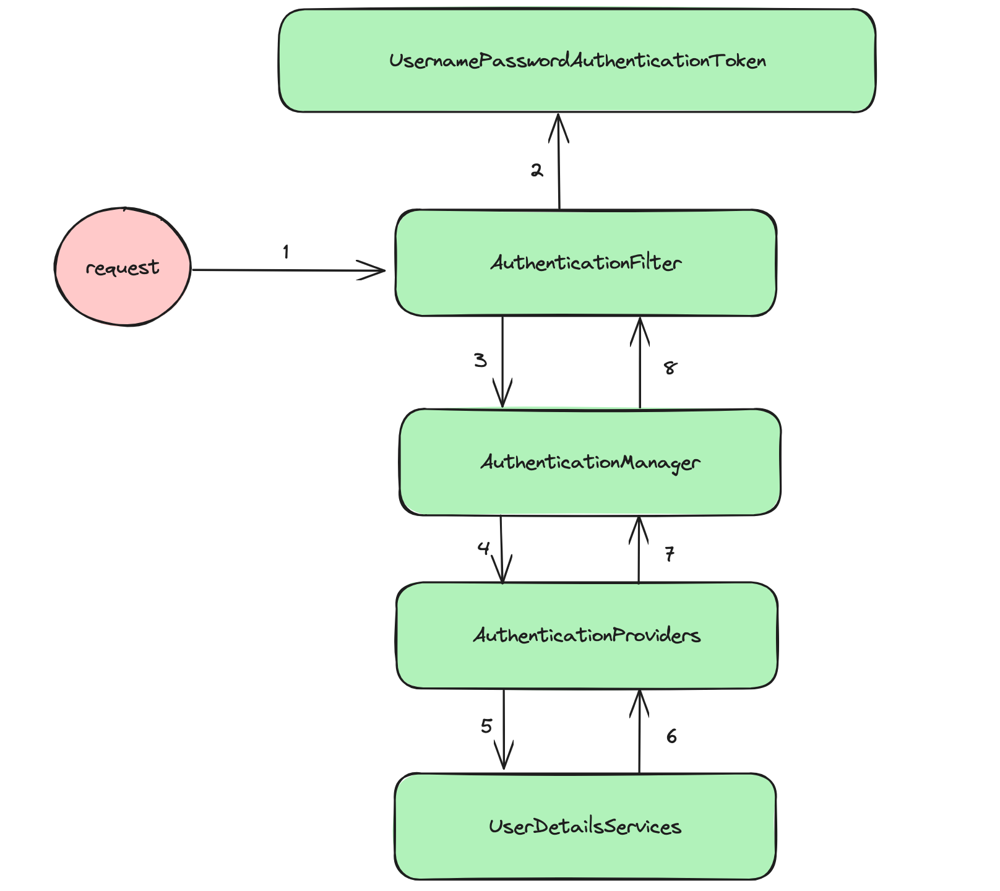

好了，至此，这个Filter其实就差不多该完成了
