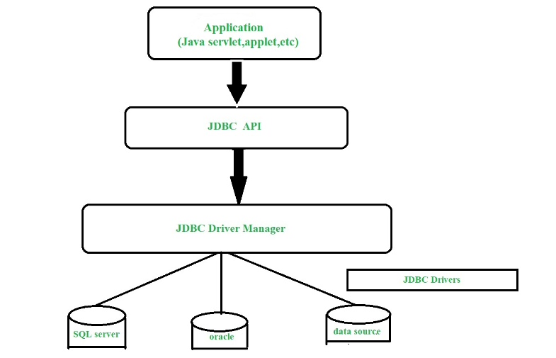

# 启程

## 目录

- [从 JDBC 的“石器时代”说起](#从JDBC的石器时代说起)
- [JDBC 的使用——繁杂的“手工活”](#JDBC的使用繁杂的手工活)
  - [基于 JDBC 操作数据库](#基于JDBC操作数据库)
  - [直接使用 JDBC 操作数据库存在的问题](#直接使用JDBC操作数据库存在的问题)
  - [解决思路](#解决思路)
- [福音 Mybatis 的诞生](#福音Mybatis的诞生)
- [Mybatis 的基本使用——轻松上手，告别“编程小白”](#Mybatis的基本使用轻松上手告别编程小白)
  - [配置 Mybatis](#配置Mybatis)
    - [Spring-Mybatis](#Spring-Mybatis)
      - [依赖与版本的对应关系](#依赖与版本的对应关系)
      - [引入依赖](#引入依赖)
    - [SpringBoot-Mybatis](#SpringBoot-Mybatis)
      - [依赖版本的对应关系](#依赖版本的对应关系)
      - [引入依赖](#引入依赖)

## 从 JDBC 的“石器时代”说起

在当今的数据驱动世界中，我们无时无刻不在与数据打交道，无论是存储、检索还是更新。在 Java 的编程领域，Java 数据库连接（JDBC）便扮演了这一交互过程的关键角色。JDBC 是 Java 编程语言中的一款应用程序编程接口（API），它精确地阐述了客户端应如何与数据库建立联系。作为一种基于 Java 技术的数据访问手段，JDBC 旨在实现 Java 与数据库的无缝对接。作为 Oracle Corporation 旗下 Java Standard Edition 平台的重要组成部分，JDBC 为我们提供了操作数据库的利器，使得查询和修改数据变得轻而易举。它的设计初衷是为了更好地服务于关系数据库系统，为 Java 开发者打开了一扇通向数据世界的大门。



## JDBC 的使用——繁杂的“手工活”

### 基于 JDBC 操作数据库

以 mysql 为例，接下来就一起来看看我们是如何使用 JDBC 的，其实 JDBC 的使用跟我们使用客户端连接数据库是一样一样的

关于数据库的查询操作，可以分为以下几个步骤

1. 做好连接准备，定义数据库的连接地址，用户名，密码这些连接的必备材料
2. 激活 JDBC 的连接驱动，这是开启数据库交互之旅的魔法钥匙。
3. 建立连接桥梁，拿到对应的 Connection
4. 构建 SQL 语句
5. 预处理 SQL 语句，对 SQL 语句进行预处理，确保其在执行前万无一失或者进行参数补充
6. 将预处理后的 SQL 语句发送至数据库服务器，获取查询数据

```java
    private final static String URL = "jdbc:mysql://localhost:3360/paportal?useUnicode=true&allowMultiQueries=true&characterEncoding=utf8&useJDBCCompliantTimezoneShift=true&useLegacyDatetimeCode=false&serverTimezone=Asia/Shanghai&useSSL=false";

    private final static String USERNAME = "root";

    private final static String PASSWORD = "root";

    public static void main(String[] args) {

        Connection connection = null;

        PreparedStatement preparedStatement = null;

        try {
            //加载驱动
            Class.forName("com.mysql.cj.jdbc.Driver");
            //通过数据库获取连接
            connection = DriverManager.getConnection(URL, USERNAME, PASSWORD);
            // 定义SQL 语句
            String querySQL = "select * from sys_user where user_name = ?";
            // 预处理SQL
            preparedStatement = connection.prepareStatement(querySQL);
            // 给SQL设置参数
            preparedStatement.setString(1,"test");
            //处理完SQL了，发送给Mysql服务进行查询
            ResultSet resultSet = preparedStatement.executeQuery();
            while (resultSet.next()) {
                 int id = resultSet.getInt("id");
                 String username = resultSet.getString("user_name ");
                 // 封装User
                 user.setId(id);
                 user.setUsername(username);
            }

        } catch (ClassNotFoundException | SQLException e) {
            throw new RuntimeException(e);
        }finally {
            connection.close();
            preparedStatement.close();
        }
    } JDBC查询操作
```

### 直接使用 JDBC 操作数据库存在的问题

虽然上面的代码看起来也不多，但是还是暴露了几个问题：

1. 数据库连接创建，释放资源频繁，每次在操作数据库前我们都要手动创建数据库连接，最后释放，创建连接本身就是比较耗时的连接，不适宜每次都进行新建
2. SQL 语句直接就在代码中硬编码了，代码不容易维护，动不动就要改代码
3. 虽然可以使用 PrepareStatement 可以帮助我们实现具备参数的 SQL 的解析和使用，但是 where 的条件千变万化的，如果我们需要要把这么多的条件整合起来，写成一句 SQL 再交由 PrePareStatement 来处理，这样的 SQL 看起来不得把不断长脑子了？
4. 对结果集解析存在硬编码，就是需要我们手动取结果然后再转化为我们所需的对象，这样稍微改改数据库的字段信息，那代码的改动可不得了喽

### 解决思路

面对以上的问题，不妨我们先设身处地地想想解决方案

1. 针对数据库连接频繁创建，频繁释放造成的资源浪费

   使用数据库连接池初始化连接资源，达到资源的复用

2. 针对 SQL 硬编码

   将 SQL 语句抽取成 xml 配置文件

3. 针对结果映射硬编码

   使用反射，内省等技术，自动将实体类跟数据表字段和属性进行自动映射，只要有数据表字段跟实体类属性的对应关系，那他们之间的赋值不就轻轻松松吗

这些解决思路其实也是从刚开始的 JDBC 的使用一点点优化而来的，经过了不断地挖掘弊端，优化抽取，最终 Mybatis 就诞生了。

## 福音 Mybatis 的诞生

Mybatis 的根本目的就是在于解决使用 JDBC 时存在的弊端，所以我们刚刚提到的解决思路也正是 Mybatis 采用的解决方案，只是相比起这部分解决思路，Mybatis 想到的更加多，也更加丰富。

Mybatis 提供了一种半自动化的 ORM（Object-Relational Mapping）实现，既保留了灵活的 SQL 操作，又提供了便捷的对象映射功能。

## Mybatis 的基本使用——轻松上手，告别“编程小白”

官网：[https://mybatis.org/spring/](https://mybatis.org/spring/ "https://mybatis.org/spring/")

快速上手：[https://mybatis.org/spring/getting-started.html](https://mybatis.org/spring/getting-started.html "https://mybatis.org/spring/getting-started.html")

### 配置 Mybatis

#### Spring-Mybatis

Spring 配置 Mybatis 可以有两种方式，一种是 xml 配置文件方式，另一种是注解与配置类的方式。

##### 依赖与版本的对应关系

| MyBatis-Spring | MyBatis | Spring Framework | Spring Batch | Java     |
| -------------- | ------- | ---------------- | ------------ | -------- |
| **3.0**        | 3.5+    | 6.0+             | 5.0+         | Java 17+ |
| **2.1**        | 3.5+    | 5.x              | 4.x          | Java 8+  |
| **2.0**        | 3.5+    | 5.x              | 4.x          | Java 8+  |
| **1.3**        | 3.4+    | 3.2.2+           | 2.1+         | Java 6+  |

##### 引入依赖

Mybatis 的基本使用还是非常简单的，我们可以根据 JDBC 的使用逻辑帮助我们记忆

当然，首先我们需要将依赖引入

```xml
    <dependency>
      <groupId>org.mybatis</groupId>
      <artifactId>mybatis-spring</artifactId>
      <version>3.0.4</version>
    </dependency>

      <dependency>
         <groupId>org.springframework.boot</groupId>
         <artifactId>spring-boot-starter-jdbc</artifactId>
     </dependency>


       <dependency>
            <groupId>org.mybatis</groupId>
            <artifactId>mybatis</artifactId>
            <version>3.5.16</version>
        </dependency>

        <dependency>
            <groupId>com.mysql</groupId>
            <artifactId>mysql-connector-j</artifactId>
            <version>8.0.33</version>
        </dependency>
 mybatis依赖
```

既然 Mybatis 是对 JDBC 的封装，那 Mybatis 的使用跟 JDBC 的使用大部分肯定都是相同的，所以我们只要跟着 JDBC 的使用逻辑来进行就行了

1. 做好连接准备，定义数据库的连接地址，用户名，密码这些连接的必备材料
   1. 在 Spring 中我们可以通过 xml 来定义 Bean 的方式来定义数据源
      ```xml
          <!-- 配置数据源 -->
          <bean id="dataSource" class="com.zaxxer.hikari.HikariDataSource">
              <property name="driverClassName" value="com.mysql.cj.jdbc.Driver"/>
              <property name="jdbcUrl" value="jdbc:mysql://localhost:3306/mybatis_example"/>
              <property name="username" value="root"/>
              <property name="password" value="xxxxx"/>
          </bean> 配置数据源
      ```
   2. 当然也可以通过@Bean 注解,数据源信息可以提取到 properties 进行配置化
      ```java
      @Bean
          public DataSource dataSource(){
              PooledDataSource dataSource = new PooledDataSource();
              dataSource.setUrl("jdbc:mysql://localhost:3306/mybatis_example");
              dataSource.setUsername("root");
              dataSource.setPassword("xxxxx");
              dataSource.setDriver("com.mysql.cj.jdbc.Driver");
              return dataSource;
          }
      ```
2. 激活 JDBC 的连接驱动，这是开启数据库交互之旅的魔法钥匙。
3. 建立连接桥梁，拿到对应的 Connection

   对于构建跟数据库服务的连接和管理这些连接，这是固定的操作，这也是我们刚刚提到的直接使用 JDBC 的缺陷，而 Mybatis 已经交给 SqlSessionFactoryBean 帮我们干了这事了，所以我们只需要注入该 Bean 让 Spring 知道 SqlSessionFactoryBean 的存在就行

   1. xml 方式配置，构建了 DataSource Bean ，赋值给 sqlSessionFactory 的 dataSource 即可
      ```xml
        <bean id="sqlSessionFactory" class="org.mybatis.spring.SqlSessionFactoryBean">
              <property name="dataSource" ref="dataSource" />
          </bean> 注入SqlSessionFactoryBean
      ```
   2. 注解方式配置
      ```java
          @Bean
          public SqlSessionFactory sqlSessionFactory() throws Exception {
              SqlSessionFactoryBean factoryBean = new SqlSessionFactoryBean();
              factoryBean.setDataSource(dataSource());
              return factoryBean.getObject();
          }
      ```

4. 构建 SQL 语句
5. 预处理 SQL 语句，对 SQL 语句进行预处理，确保其在执行前万无一失或者进行参数补充

   1. SQL 语句我们说了，需要提取成配置文件，Mybatis 就是这么干的，我们可以通过创建一个 xml 跟接口类进行关联

      ```xml
      <?xml version="1.0" encoding="UTF-8"?>
      <!DOCTYPE mapper PUBLIC "-//mybatis.org//DTD Mapper 3.0//EN" "http://mybatis.org/dtd/mybatis-3-mapper.dtd">
      <mapper namespace="com.example.mapper.UserMapper">

          <select id="getUserById" resultType="com.example.model.User">
              SELECT id, name, email
              FROM users
              WHERE id = #{id}
          </select>

      </mapper>
       UserMapper.xml
      ```

   2. 或者通过注解的方式直接绑定 SQL （不推荐，可读性差，而且无法配置 ResultMap 进行结果映射）

      ```java
      public interface UserMapper {

          @Select("SELECT id, name, email FROM usersWHERE id = #{id}")
          User getUserById(Integer id);

      }
      ```

6. 将预处理后的 SQL 语句发送至数据库服务器，获取查询数据

   最后我们开启 Spring 容器加载配置文件，获取对应的 Mapper Bean 调用对应接口方法即可

   ```java
       public static void main(String[] args) {
       //配置类开启Spring
       //AnnotationConfigApplicationContext context = new AnnotationConfigApplicationContext(SpringConfig.class);
       //配置xml 开启Spring
           ApplicationContext context = new ClassPathXmlApplicationContext("spring-config.xml");
           UserMapper userService = context.getBean(UserMapper.class);
           User user = userService.getUserById(1);
           System.out.println(user.getId() + " - " + user.getUserName());
       }
   ```

#### SpringBoot-Mybatis

官网：[https://mybatis.org/spring-boot-starter/mybatis-spring-boot-autoconfigure/](https://mybatis.org/spring-boot-starter/mybatis-spring-boot-autoconfigure/ "https://mybatis.org/spring-boot-starter/mybatis-spring-boot-autoconfigure/")

基于 SpringBoot 配置 Mybatis 就更加简单了，Spring 中 SqlSessionFactoryBean 是我们手动配置的，SpringBoot 提供的 mybatis-spring-boot-starter 会帮助我们自动化配置，只需要我们提供数据源信息就行了。

##### 依赖版本的对应关系

| MyBatis-Spring-Boot-Starter | MyBatis-Spring                            | Spring Boot | Java         |
| --------------------------- | ----------------------------------------- | ----------- | ------------ |
| **3.0**                     | 3.0                                       | 3.0 - 3.1   | 17 or higher |
| **2.3**                     | 2.1                                       | 2.5 - 2.7   | 8 or higher  |
| **2.2 (EOL)**               | 2.0 (need 2.0.6+ for enable all features) | 2.5 - 2.7   | 8 or higher  |
| **2.1 (EOL)**               | 2.0 (need 2.0.6+ for enable all features) | 2.1 - 2.4   | 8 or higher  |
| **2.0 (EOL)**               | 2.0                                       | 2.0 or 2.1  | 8 or higher  |
| **1.3 (EOL)**               | 1.3                                       | 1.5         | 6 or higher  |
| **1.2 (EOL)**               | 1.3                                       | 1.4         | 6 or higher  |
| **1.1 (EOL)**               | 1.3                                       | 1.3         | 6 or higher  |
| **1.0 (EOL)**               | 1.2                                       | 1.3         | 6 or higher  |

##### 引入依赖

```xml
<parent>
    <groupId>org.springframework.boot</groupId>
    <artifactId>spring-boot-starter-parent</artifactId>
    <version>3.1.11</version>
 </parent>

<dependency>
    <groupId>org.mybatis.spring.boot</groupId>
    <artifactId>mybatis-spring-boot-starter</artifactId>
    <version>3.0.2</version>
</dependency>

<dependency>
    <groupId>org.mybatis</groupId>
    <artifactId>mybatis</artifactId>
    <version>3.5.16</version>
</dependency>

<dependency>
     <groupId>com.mysql</groupId>
     <artifactId>mysql-connector-j</artifactId>
     <version>8.0.33</version>
</dependency>

```

既然 SqlSessionFactory 都配好了，接下来的跟 Spring 配置 Mybatis 一样直接使用就行了，当然在此之前我们先要将数据源信息配置好

```yaml
server:
  port: 8001
spring:
  datasource:
    driver-class-name: com.mysql.cj.jdbc.Driver
    url: jdbc:mysql://localhost:3306/mybatis_example?useSSL=false&serverTimezone=GMT%2B8
    username: root
    password: xxxxx
```

然后我们将配置对应的 Mapper 接口和 SQL 语句

```java
public interface UserMapper {

    @Select("SELECT id, userAccount, userPassword, unionId, mpOpenId, userName, userAvatar, userProfile, userRole, createTime, updateTime, isDelete\n" +
            "        FROM `user` where #{id}")
    User getUserById(Integer id);

}

```

这就完成了！简单吧，接下来就是尝试调用该接口，当然我们需要将 mapper 所在的地方通过注解 MapperScan 告诉 SpringBoot 引用，好让 SpringBoot 能够扫到并配置成 Bean

```java
@SpringBootApplication
@MapperScan("com.example.mapper")
public class Main  implements CommandLineRunner {

    private final UserMapper userMapper;

    public Main(UserMapper userMapper) {
        this.userMapper = userMapper;
    }

    public static void main(String[] args) {
        SpringApplication.run(Main.class, args);
    }

    @Override
    public void run(String... args) throws Exception {
        System.out.println(this.userMapper.getUserById(1));
    }
}
```

有了 Mybatis 使得我们能够将更多的精力放在写业务 SQL 上而不需要管理 JDBC 的 Connection，PreparedStatement 的状态，也不需要直接在代码上硬编码 SQL，SQL 出问题了可以直接找 Mapper.xml 中的 SQL 进行调试和更改，而且，Mybatis 也帮助我们做了默认的结果映射（可以通过 ResultMap 进行配置更多的结果映射），也正因如此，Mybatis 成了 Spring 进行数据交互的好搭档。

Mybatis 是通过什么样的方式进行 JDBC 封装从而让我们享受 JDBC 给我们带来的欢乐而不是痛苦呢？除了对 JDBC 进行封装，Mybatis 还给我们带来哪些更加高级的功能呢，接下来我们就要开始 Mybatis 的深度剖析，解密 Mybatis，学习其中的精髓与奥秘。
