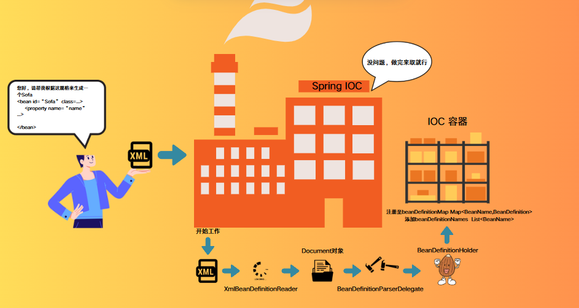
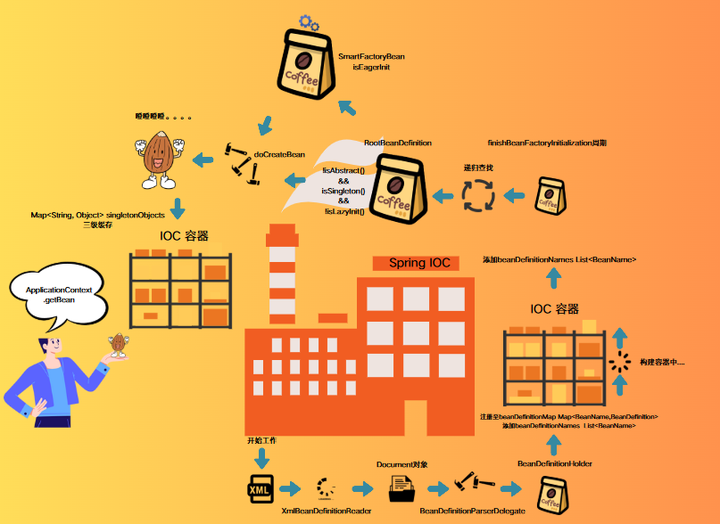

# Spring Bean 出生篇(二)

## 目录

- [摸索 getBean 背后的奥秘](#摸索getBean背后的奥秘)
  - [AbstractBeanFactory#getBean(java.lang.String)](#AbstractBeanFactorygetBeanjavalangString)
- [缓存中的单例 Bean 是怎么来的呢？](#缓存中的单例Bean是怎么来的呢)
  - [AbstractApplicationContext#finishBeanFactoryInitialization](#AbstractApplicationContextfinishBeanFactoryInitialization)
  - [DefaultListableBeanFactory#preInstantiateSingletons](#DefaultListableBeanFactorypreInstantiateSingletons)
    - [为什么要合并成 RootBeanDefinition？](#为什么要合并成RootBeanDefinition)
      - [org.springframework.beans.factory.support.RootBeanDefinition](#orgspringframeworkbeansfactorysupportRootBeanDefinition)
      - [AbstractBeanFactory#getMergedLocalBeanDefinition](#AbstractBeanFactorygetMergedLocalBeanDefinition)
      - [AbstractBeanFactory#getMergedBeanDefinition(java.lang.String, org.springframework.beans.factory.config.BeanDefinition, org.springframework.beans.factory.config.BeanDefinition)](#AbstractBeanFactorygetMergedBeanDefinitionjavalangString-orgspringframeworkbeansfactoryconfigBeanDefinition-orgspringframeworkbeansfactoryconfigBeanDefinition)
  - [Bean 的诞生](#Bean的诞生)
    - [AbstractBeanFactory#doGetBean](#AbstractBeanFactorydoGetBean)
      - [AbstractAutowireCapableBeanFactory#createBean(java.lang.String, org.springframework.beans.factory.support.RootBeanDefinition, java.lang.Object\[\])](#AbstractAutowireCapableBeanFactorycreateBeanjavalangString-orgspringframeworkbeansfactorysupportRootBeanDefinition-javalangObject)
      - [AbstractAutowireCapableBeanFactory#resolveBeforeInstantiation](#AbstractAutowireCapableBeanFactoryresolveBeforeInstantiation)
      - [AbstractAutowireCapableBeanFactory#doCreateBean](#AbstractAutowireCapableBeanFactorydoCreateBean)
      - [Bean 的实例化](#Bean的实例化)
        - [AbstractAutowireCapableBeanFactory#createBeanInstance](#AbstractAutowireCapableBeanFactorycreateBeanInstance)
        - [AbstractAutowireCapableBeanFactory#instantiateBean](#AbstractAutowireCapableBeanFactoryinstantiateBean)
- [总结](#总结)

上一章，我们清楚了 Bean 的形成过程，首先是如何一步步地从 xml 的格式转变成 Document 对象，而 Document 对象中就有很多 Element，每一组 Element 都是我们对 bean 的定义与设置，所以 Spring 会将其取出，经过一系列的校验和设置，最终形成一个 BeanDefinitionHolder 即 BeanDefinition 的包装类。BeanDefinitionHolder 生成出来以后，会将其注册至 IOC 容器（一个全局的 ConcurrentHashMap）中。

那么经过以上一系列的操作后，BeanDefinition 这个 Bean 的构造图我们已经顺利地给到了 IOC 容器了，就等着其根据我们提供的构造图给我们一个一个地将 Bean 制造出来。


当然，此时此刻，咱们的 Bean 可还没诞生的，不过，Bean 的出生流程也是本章节要介绍的内容。既然讨论到 Bean 的诞生，那我们需要先考虑这么一个问题，既然 BeanDefinition 都有了，那么 Bean 是什么时候诞生呢？是 BeanDefintion 一注册到容器中，容器就会给我们生成 Bean，还是说要到某个时候才能生成 Bean 呢？那么 Bean 诞生的时机我们得先探索探索 getBean 这个方法先，以该方法作为切入口。

### 摸索 getBean 背后的奥秘

ClassPathXmlApplicationContext 作为一个 ApplicationContext 的高级容器，getBean 是其具备的最基本的功能（实现了 BeanFactory），所以我们可以以该方法作为切入点。

```java
ClassPathXmlApplicationContext context2 = new ClassPathXmlApplicationContext("bean-config.xml", Main.class);
User user1 = (User)context2.getBean("user");
System.out.println(user1);
```

虽然说我们调用的是 ApplicationContext 的 getBean 方法，但是归根结底该方法是由 BeanFactory 来提供实现的，所以我们应追溯到 AbstractBeanFactory#getBean(java.lang.String)的实现中。

#### AbstractBeanFactory#getBean(java.lang.String)

重点关注的就是这个 doGetBean 方法

```java
  @Override
  public Object getBean(String name) throws BeansException {
    return doGetBean(name, null, null, false);
  }

```

doGetBean 方法是获取 Bean 的核心方法，里面也包含着获取 Bean 的整个过程。将整个 getBean 的脉络都浏览一遍以后，我们能够得知 getBean 的操作可分为两大步

1. 从缓存中取
2. 缓存没有则再创建 Bean

所以对于 getBean 来说不仅包含了获取 Bean 的流程还包含了创建 Bean 的流程，而且当我们调用 User user1 = (User)context2.getBean("user");这段代码尝试 getBean 时，其实缓存会存在我们想要的 user 的。

从该情况得知我们在 getBean 前，Bean 已经是放至容器中了，至少单例非懒加载 Bean 是这样的情况的。换句话说，Bean 在 new ClassPathXmlApplicationContext("bean-config.xml", Main.class);的过程中已经被生成并放至 IOC 容器中了。

```java
protected <T> T doGetBean(
      String name, @Nullable Class<T> requiredType, @Nullable Object[] args, boolean typeCheckOnly)
      throws BeansException {

    //这里会根据入参的beanName去找到与该BeanDefinition唯一对应的beanName，即我们在xml上设置的id
    //假设 <alias name="userT" alias="T1"/> ->  <bean id="userT" class="com.example.model.User">
    //那么得到的aliasMap中的内容是 T1 -> userT ，而该方法最终会得到userT
    String beanName = transformedBeanName(name);
    Object bean;

    //根据 BeanName 在缓存中查找，由方法名可得知，这是处理单例Bean的，正因为单例bean全局只会创建一次
    //所以可以使用缓存，而且这里还有一个依赖循环中对二级缓存的一个操作
    Object sharedInstance = getSingleton(beanName);
    //如果能够从缓存中获取Bean
    if (sharedInstance != null && args == null) {
      if (logger.isTraceEnabled()) {
        if (isSingletonCurrentlyInCreation(beanName)) {
          logger.trace("Returning eagerly cached instance of singleton bean '" + beanName +
              "' that is not fully initialized yet - a consequence of a circular reference");
        }
        else {
          logger.trace("Returning cached instance of singleton bean '" + beanName + "'");
        }
      }
      //这里主要是处理了Bean和FactoryBean的情况，如果是正常Bean则直接返回
      //FactoryBean的话就完成FactoryBean的相关处理
      bean = getObjectForBeanInstance(sharedInstance, name, beanName, null);
    }
    //从缓存中获取不到Bean
    else {
      // Fail if we're already creating this bean instance:
      // We're assumably within a circular reference.
      if (isPrototypeCurrentlyInCreation(beanName)) {
        throw new BeanCurrentlyInCreationException(beanName);
      }

      //会先到父容器中去找，这里会一直根据父容器找，直到最顶层的父容器，也就是说会一直从父容器中找Bean（如果有父级容器的话）
      BeanFactory parentBeanFactory = getParentBeanFactory();
      if (parentBeanFactory != null && !containsBeanDefinition(beanName)) {

        String nameToLookup = originalBeanName(name);
        if (parentBeanFactory instanceof AbstractBeanFactory) {
          return ((AbstractBeanFactory) parentBeanFactory).doGetBean(
              nameToLookup, requiredType, args, typeCheckOnly);
        }
        else if (args != null) {

          return (T) parentBeanFactory.getBean(nameToLookup, args);
        }
        else if (requiredType != null) {

          return parentBeanFactory.getBean(nameToLookup, requiredType);
        }
        else {
          return (T) parentBeanFactory.getBean(nameToLookup);
        }
      }

      if (!typeCheckOnly) {
        markBeanAsCreated(beanName);
      }

      try {
        //根据BeanName获取BeanDefinition并包装成RootBeanDefinition
        //RootBeanDefinitionz在 BeanDefinition 的基础上提供了更具体的 Bean 定义功能
        //特别是在 Bean 类型、生命周期管理、依赖注入和属性覆盖等方面进行了增强。
        RootBeanDefinition mbd = getMergedLocalBeanDefinition(beanName);
        checkMergedBeanDefinition(mbd, beanName, args);

        //根据BeanDefinition获取所依赖的BeanName
        String[] dependsOn = mbd.getDependsOn();
        // ----------------- 获取依赖Bean START --------------
        if (dependsOn != null) {
          for (String dep : dependsOn) {
            if (isDependent(beanName, dep)) {
              throw new BeanCreationException(mbd.getResourceDescription(), beanName,
                  "Circular depends-on relationship between '" + beanName + "' and '" + dep + "'");
            }
            registerDependentBean(dep, beanName);
            try {
              getBean(dep);
            }
            catch (NoSuchBeanDefinitionException ex) {
              throw new BeanCreationException(mbd.getResourceDescription(), beanName,
                  "'" + beanName + "' depends on missing bean '" + dep + "'", ex);
            }
          }
        }
        // ----------------- 获取依赖Bean  END --------------
        // ----------------- 创建Bean实例 START --------------
        if (mbd.isSingleton()) {
          //如果是BeanDefinition标注是一个单例Bean，则执行以下方法获取单例Bean
          //也是该章节的研究重点
          sharedInstance = getSingleton(beanName, () -> {
            try {
              return createBean(beanName, mbd, args);
            }
            catch (BeansException ex) {
              destroySingleton(beanName);
              throw ex;
            }
          });
          //区分并处理FactoryBean与Bean
          bean = getObjectForBeanInstance(sharedInstance, name, beanName, mbd);
        }

        else if (mbd.isPrototype()) {
          //原型Bean的情况
          Object prototypeInstance = null;
          try {
            beforePrototypeCreation(beanName);
            //与单例不同的是：原型是直接创建，而单例是先尝试getSingleton，获取不到再创建
            prototypeInstance = createBean(beanName, mbd, args);
          }
          finally {
            afterPrototypeCreation(beanName);
          }
          //区分并处理FactoryBean与Bean
          bean = getObjectForBeanInstance(prototypeInstance, name, beanName, mbd);
        }

        else {
          String scopeName = mbd.getScope();
          if (!StringUtils.hasLength(scopeName)) {
            throw new IllegalStateException("No scope name defined for bean ´" + beanName + "'");
          }
          Scope scope = this.scopes.get(scopeName);
          if (scope == null) {
            throw new IllegalStateException("No Scope registered for scope name '" + scopeName + "'");
          }
          try {
            Object scopedInstance = scope.get(beanName, () -> {
              beforePrototypeCreation(beanName);
              try {
                return createBean(beanName, mbd, args);
              }
              finally {
                afterPrototypeCreation(beanName);
              }
            });
            bean = getObjectForBeanInstance(scopedInstance, name, beanName, mbd);
          }
          catch (IllegalStateException ex) {
            throw new BeanCreationException(beanName,
                "Scope '" + scopeName + "' is not active for the current thread; consider " +
                "defining a scoped proxy for this bean if you intend to refer to it from a singleton",
                ex);
          }
        }
      }
      catch (BeansException ex) {
        cleanupAfterBeanCreationFailure(beanName);
        throw ex;
      }
    }
    // ----------------- 创建Bean实例 END --------------
    // Check if required type matches the type of the actual bean instance.
    if (requiredType != null && !requiredType.isInstance(bean)) {
      try {
        T convertedBean = getTypeConverter().convertIfNecessary(bean, requiredType);
        if (convertedBean == null) {
          throw new BeanNotOfRequiredTypeException(name, requiredType, bean.getClass());
        }
        return convertedBean;
      }
      catch (TypeMismatchException ex) {
        if (logger.isTraceEnabled()) {
          logger.trace("Failed to convert bean '" + name + "' to required type '" +
              ClassUtils.getQualifiedName(requiredType) + "'", ex);
        }
        throw new BeanNotOfRequiredTypeException(name, requiredType, bean.getClass());
      }
    }
    return (T) bean;
  }
```

### 缓存中的单例 Bean 是怎么来的呢？

好了，明确了方向，我们已经能够得知原来 getBean 中的 Bean 最先是在 new ClassPathXmlApplicationContext()的时候就已经生成了，而 new ClassPathXmlApplicationContext()的时候无非就是在 refresh 方法内做事情。

此时再回过头来看，我们从方法命名其实就能看出端倪，既然要生成 Bean，我们当然要等 IOC 工厂完成创建后才能执行生成 Bean 的操作吧！没理由工厂还没建起来就开始干活的\~

所以我们仔细读读方法名，不难定位到 finishBeanFactoryInitialization(beanFactory)这个非常惹人注目的方法，以上的方法其实都是在为 ConfigurableListableBeanFactory 创建 Bean 做好充足的准备的，直到 finishBeanFactoryInitialization 工厂完成初始化了，Bean 便在这里开始生成啦！

```java
@Override
  public void refresh() throws BeansException, IllegalStateException {
    synchronized (this.startupShutdownMonitor) {
       ...
        finishBeanFactoryInitialization(beanFactory);
       ...
      }
  }
```

#### AbstractApplicationContext#finishBeanFactoryInitialization

其实我们应该关注 preInstantiateSingletons 的方法调用即可，其他的都是在为该方法这个重要的流程做准备的。

```java
  protected void finishBeanFactoryInitialization(ConfigurableListableBeanFactory beanFactory) {

    //初始化类型转换服务
    if (beanFactory.containsBean(CONVERSION_SERVICE_BEAN_NAME) &&
        beanFactory.isTypeMatch(CONVERSION_SERVICE_BEAN_NAME, ConversionService.class)) {
      beanFactory.setConversionService(
          beanFactory.getBean(CONVERSION_SERVICE_BEAN_NAME, ConversionService.class));
    }

    //注册默认的内嵌值解析器
    if (!beanFactory.hasEmbeddedValueResolver()) {
      beanFactory.addEmbeddedValueResolver(strVal -> getEnvironment().resolvePlaceholders(strVal));
    }

    // 初始化LoadTimeWeaverAware类型的Bean
    String[] weaverAwareNames = beanFactory.getBeanNamesForType(LoadTimeWeaverAware.class, false, false);
    for (String weaverAwareName : weaverAwareNames) {
      getBean(weaverAwareName);
    }

    // 停止使用临时的类加载器
    beanFactory.setTempClassLoader(null);

    // 冻结Bean定义的配置：这也意味着我们需要修改Bean定义的配置的话需要重新refresh，配置才能生效
    beanFactory.freezeConfiguration();

    // 加载单例Bean
    beanFactory.preInstantiateSingletons();
  } org.springframework.context.support.AbstractApplicationContext#finishBeanFactoryInitialization
```

#### DefaultListableBeanFactory#preInstantiateSingletons

该方法是一个我们需要了解的核心的方法，方法正是描述了单例 Bean 在容器初始化时的创建过程，毕竟单例 Bean 全局只会用一个，所以选择在创建容器时把单例 Bean 也创建出来放置缓存中，之后的 Bean 直接从缓存中取也可以提高性能，我们可以先喽一眼整个流程，然后我们再逐一分析。

```java
  public void preInstantiateSingletons() throws BeansException {
    if (logger.isTraceEnabled()) {
      logger.trace("Pre-instantiating singletons in " + this);
    }

    //beanDefinitionNames在注册BeanDefinition的时候会将BeanDefinition的名称也添加到该集合中
    List<String> beanNames = new ArrayList<>(this.beanDefinitionNames);

    // 拿到了这些BeanDefintion名称，便可以对其进行遍历创建Bean了
    for (String beanName : beanNames) {
      RootBeanDefinition bd = getMergedLocalBeanDefinition(beanName);
      if (!bd.isAbstract() && bd.isSingleton() && !bd.isLazyInit()) {
        if (isFactoryBean(beanName)) {
          Object bean = getBean(FACTORY_BEAN_PREFIX + beanName);
          if (bean instanceof FactoryBean) {
            FactoryBean<?> factory = (FactoryBean<?>) bean;
            boolean isEagerInit;
            if (System.getSecurityManager() != null && factory instanceof SmartFactoryBean) {
              isEagerInit = AccessController.doPrivileged(
                  (PrivilegedAction<Boolean>) ((SmartFactoryBean<?>) factory)::isEagerInit,
                  getAccessControlContext());
            }
            else {
              isEagerInit = (factory instanceof SmartFactoryBean &&
                  ((SmartFactoryBean<?>) factory).isEagerInit());
            }
            if (isEagerInit) {
              getBean(beanName);
            }
          }
        }
        else {
          getBean(beanName);
        }
      }
    }

    // Trigger post-initialization callback for all applicable beans...
    for (String beanName : beanNames) {
      Object singletonInstance = getSingleton(beanName);
      if (singletonInstance instanceof SmartInitializingSingleton) {
        SmartInitializingSingleton smartSingleton = (SmartInitializingSingleton) singletonInstance;
        if (System.getSecurityManager() != null) {
          AccessController.doPrivileged((PrivilegedAction<Object>) () -> {
            smartSingleton.afterSingletonsInstantiated();
            return null;
          }, getAccessControlContext());
        }
        else {
          smartSingleton.afterSingletonsInstantiated();
        }
      }
    }
  } org.springframework.beans.factory.support.DefaultListableBeanFactory#preInstantiateSingletons
```

首先回顾回顾上一篇章中 registerBeanDefinition 注册 BeanDefinition 时会往 beanDefinitionNames 中添加 BeanDefinition 的名称的用于维护的，那么在创建单例 Bean 的时候就用到了。

```java
public void registerBeanDefinition(String beanName, BeanDefinition beanDefinition)
      throws BeanDefinitionStoreException {

        ...
        this.beanDefinitionMap.put(beanName, beanDefinition);
        this.beanDefinitionNames.add(beanName);
        ...
  }
```

##### 为什么要合并成 RootBeanDefinition？

从调用的 getMergedLocalBeanDefinition 这个方法当中，我们又发现了一个新的 BeanDefinition 类型，叫 RootBeanDefinition。

###### org.springframework.beans.factory.support.RootBeanDefinition

RootBeanDefinition 顾名思义，根 BeanDefinition，我们都知道 Bean 与 Bean 之间会有继承关系的，我们可以通过 parent 属性来配置 BeanDefinition 的父 BeanDefinition。

```java
  <!-- 定义一个名为 user 的 Bean -->
    <bean id="userT" class="com.example.model.User" parent="userPage">
        <meta key="author" value="T"/>
        <meta key="version" value="1.0"/>
        <property name="name" value="T" />
        <property name="age" value="26" />
        <property name="number" value="1"></property>
        <property name="size" value="3"></property>
    </bean>


    <!-- 定义一个名为 userPage 的 Bean -->
    <bean id="userPage" class="com.example.model.Page">
        <property name="number" value="1"></property>
        <property name="size" value="3"></property>
    </bean> bean-config.xml
```

所以 RootBeanDefinition 其实就是最顶级的父类 BeanDefinition，这个我们会在接下来分析 getMergedLocalBeanDefinition 中的创建 RootBeanDefinition 中得到印证。

###### AbstractBeanFactory#getMergedLocalBeanDefinition

接下来就是 getMergedLocalBeanDefinition 方法的分析，可以从该方法的实现来看，首先该方法会尝试从缓存 mergedBeanDefinitions 中取 RootBeanDefinition ，缓存如没有，则调用 getMergedBeanDefinition(java.lang.String, org.springframework.beans.factory.config.BeanDefinition)方法，可想而知，该方法的实现大概率就是构建 mergedBeanDefinitions 缓存中的元素即 RootBeanDefinition，并返回对应的 RootBeanDefinition 咯。

```java
protected RootBeanDefinition getMergedLocalBeanDefinition(String beanName) throws BeansException {

    RootBeanDefinition mbd = this.mergedBeanDefinitions.get(beanName);
    if (mbd != null && !mbd.stale) {
      return mbd;
    }
    return getMergedBeanDefinition(beanName, getBeanDefinition(beanName));
  }
```

###### AbstractBeanFactory#getMergedBeanDefinition(java.lang.String, org.springframework.beans.factory.config.BeanDefinition, org.springframework.beans.factory.config.BeanDefinition)

带着以上的猜想，我们往下跟，便来到 AbstractBeanFactory#getMergedBeanDefinition(java.lang.String, org.springframework.beans.factory.config.BeanDefinition, org.springframework.beans.factory.config.BeanDefinition)的方法实现

其中针对 BeanDefinition containingBd 入参，如果正在处理的 bean 是顶级 bean（RootBean）（即不是内部 bean），那么 containingBd 将为 null，从整个 getMergedBeanDefinition 方法来看，他会不断地通过 parent 属性不断向上找，直至找到最顶层的 BeanDefinition 为止，所以 RootBeanDefinition 其实就是指最顶层的不具备 parent 属性的 BeanDefinition。

```java
protected RootBeanDefinition getMergedBeanDefinition(
      String beanName, BeanDefinition bd, @Nullable BeanDefinition containingBd)
      throws BeanDefinitionStoreException {

    synchronized (this.mergedBeanDefinitions) {
      RootBeanDefinition mbd = null;
      RootBeanDefinition previous = null;

      //如果该Bean是Root Bean 则尝试从缓存 mergedBeanDefinitions 中取
      if (containingBd == null) {
        mbd = this.mergedBeanDefinitions.get(beanName);
      }

      if (mbd == null || mbd.stale) {
        //先记录下当前 RootBeanDefinition 的状态，后面要做同步处理
        previous = mbd;
        if (bd.getParentName() == null) {
          //如果BeanDefinition 的 parent属性为空
          if (bd instanceof RootBeanDefinition) {
            mbd = ((RootBeanDefinition) bd).cloneBeanDefinition();
          }
          else {
            mbd = new RootBeanDefinition(bd);
          }
        }
        else {
          //如果BeanDefinition 有parent 属性，即该BeanDefinition是子BeanDefinition
          //值得注意的是containingBd不为null时也会进到该逻辑的
          //<... parent="userPage">
          BeanDefinition pbd;
          try {
            //根据parent属性值获取对应的 Bean Name
            String parentBeanName = transformedBeanName(bd.getParentName());
            if (!beanName.equals(parentBeanName)) {
              //递归调用，直至获取到顶级Bean
              pbd = getMergedBeanDefinition(parentBeanName);
            }
            else {
              //如果该容器中无法找到parent bean ，则尝试到父级容器中找
              BeanFactory parent = getParentBeanFactory();
              if (parent instanceof ConfigurableBeanFactory) {
                //递归执行父级容器的getMergedBeanDefinition方法
                pbd = ((ConfigurableBeanFactory) parent).getMergedBeanDefinition(parentBeanName);
              }
              else {
                //如果都没有找到，说明配置出问题了
                throw new NoSuchBeanDefinitionException(parentBeanName,
                    "Parent name '" + parentBeanName + "' is equal to bean name '" + beanName +
                        "': cannot be resolved without a ConfigurableBeanFactory parent");
              }
            }
          }
          catch (NoSuchBeanDefinitionException ex) {
            throw new BeanDefinitionStoreException(bd.getResourceDescription(), beanName,
                "Could not resolve parent bean definition '" + bd.getParentName() + "'", ex);
          }
          // Deep copy with overridden values.
          mbd = new RootBeanDefinition(pbd);
          mbd.overrideFrom(bd);
        }

        //配置默认scope属性
        if (!StringUtils.hasLength(mbd.getScope())) {
          mbd.setScope(SCOPE_SINGLETON);
        }

        //恢复传入的containingBd scope属性值
        if (containingBd != null && !containingBd.isSingleton() && mbd.isSingleton()) {
          mbd.setScope(containingBd.getScope());
        }


        if (containingBd == null && isCacheBeanMetadata()) {
          this.mergedBeanDefinitions.put(beanName, mbd);
        }
      }
      if (previous != null) {
        //重新合并stale为true的BeanDefinition
        copyRelevantMergedBeanDefinitionCaches(previous, mbd);
      }
      return mbd;
    }
  } getMergedBeanDefinition(java.lang.String, org.springframework.beans.factory.config.BeanDefinition, org.springframework.beans.factory.config.BeanDefinition)
```

好了，既然了解了 RootBeanDefinition ，我们可以继续回过头来看看 preInstantiateSingletons 方法，当我们取到 RootBeanDefinition 后，接下来会依据 BeanDefinition 的抽象，单例和懒加载情况来走分支代码

```java
  public void preInstantiateSingletons() throws BeansException {
    if (logger.isTraceEnabled()) {
      logger.trace("Pre-instantiating singletons in " + this);
    }

    //beanDefinitionNames在注册BeanDefinition的时候会将BeanDefinition的名称也添加到该集合中
    List<String> beanNames = new ArrayList<>(this.beanDefinitionNames);

    // 拿到了这些BeanDefintion名称，便可以对其进行遍历创建Bean了
    for (String beanName : beanNames) {
      //喽到这里       -------------------------------------------->
      //根据beanName获取顶级BeanDefinition
      RootBeanDefinition bd = getMergedLocalBeanDefinition(beanName);
      if (!bd.isAbstract() && bd.isSingleton() && !bd.isLazyInit()) {
        if (isFactoryBean(beanName)) {
          Object bean = getBean(FACTORY_BEAN_PREFIX + beanName);
          if (bean instanceof FactoryBean) {
            FactoryBean<?> factory = (FactoryBean<?>) bean;
            boolean isEagerInit;
            if (System.getSecurityManager() != null && factory instanceof SmartFactoryBean) {
              isEagerInit = AccessController.doPrivileged(
                  (PrivilegedAction<Boolean>) ((SmartFactoryBean<?>) factory)::isEagerInit,
                  getAccessControlContext());
            }
            else {
              isEagerInit = (factory instanceof SmartFactoryBean &&
                  ((SmartFactoryBean<?>) factory).isEagerInit());
            }
            if (isEagerInit) {
              getBean(beanName);
            }
          }
        }
        else {
          getBean(beanName);
        }
      }
    }

    // Trigger post-initialization callback for all applicable beans...
    for (String beanName : beanNames) {
      Object singletonInstance = getSingleton(beanName);
      if (singletonInstance instanceof SmartInitializingSingleton) {
        SmartInitializingSingleton smartSingleton = (SmartInitializingSingleton) singletonInstance;
        if (System.getSecurityManager() != null) {
          AccessController.doPrivileged((PrivilegedAction<Object>) () -> {
            smartSingleton.afterSingletonsInstantiated();
            return null;
          }, getAccessControlContext());
        }
        else {
          smartSingleton.afterSingletonsInstantiated();
        }
      }
    }
  }
```

1. 非抽象，单例，非懒加载

   ```java
    if (!bd.isAbstract() && bd.isSingleton() && !bd.isLazyInit()) {
           if (isFactoryBean(beanName)) {
             Object bean = getBean(FACTORY_BEAN_PREFIX + beanName);
             if (bean instanceof FactoryBean) {
               FactoryBean<?> factory = (FactoryBean<?>) bean;
               boolean isEagerInit;
               if (System.getSecurityManager() != null && factory instanceof SmartFactoryBean) {
                 isEagerInit = AccessController.doPrivileged(
                     (PrivilegedAction<Boolean>) ((SmartFactoryBean<?>) factory)::isEagerInit,
                     getAccessControlContext());
               }
               else {
                 isEagerInit = (factory instanceof SmartFactoryBean &&
                     ((SmartFactoryBean<?>) factory).isEagerInit());
               }
               if (isEagerInit) {
                 getBean(beanName);
               }
             }
   ```

   1. isFactoryBean(beanName)

      之前我们就多次看到 isFactoryBean 方法的出现，该方法直接翻译则是判断该 Bean 是否属于 FactoryBean，属于 FactoryBean 的话就会进行一些特殊处理。

      所以我们必须先将 Spring 是如何判定 FactoryBean 先搞清楚，那我们就需要先到 isFactoryBean 方法中看看其是如何做判断的，从以下代码得知，原来判断该 Bean 是否属于 FactoryBean 主要就是判断其是否派生于 FactoryBean，或者是否配置了 factory-bean 的属性，归根结底就是判断该 Bean 是否属于 FactoryBean 接口的。

      ```java
        public boolean isFactoryBean(String name) throws NoSuchBeanDefinitionException {
          String beanName = transformedBeanName(name);
          Object beanInstance = getSingleton(beanName, false);
          if (beanInstance != null) {
            //首先是查看该Bean实例是否属于FactoryBean
            return (beanInstance instanceof FactoryBean);
          }
          //如果本容器没有该Bean的BeanDefinition，则从父容器找，
          //看该Bean查看该Bean是否属于FactoryBean
          if (!containsBeanDefinition(beanName) && getParentBeanFactory() instanceof ConfigurableBeanFactory) {
            return ((ConfigurableBeanFactory) getParentBeanFactory()).isFactoryBean(name);
          }
          return isFactoryBean(beanName, getMergedLocalBeanDefinition(beanName));
        }

        //isFactoryBean 重载
        //AbstractBeanFactory#isFactoryBean(java.lang.String, org.springframework.beans.factory.support.RootBeanDefinition)
        protected boolean isFactoryBean(String beanName, RootBeanDefinition mbd) {
          Boolean result = mbd.isFactoryBean;
          if (result == null) {
            Class<?> beanType = predictBeanType(beanName, mbd, FactoryBean.class);
            result = (beanType != null && FactoryBean.class.isAssignableFrom(beanType));
            mbd.isFactoryBean = result;
          }
          return result;
        }
      ```

      好，那我们就来看看 FactoryBean 接口是怎么个事儿\~

      从 FactoryBean 接口来看，接口提供了 getObject 的方法，一开始我在看这个接口的方法的时候都会误会，我们对比我们以往看到的 BeanFactory，会发现两者都具备 get...方法，这就让我误以为 FactoryBean 与 BeanFactory 是同一类型的容器，但是自己亲自使用了之后才明白，原来 FactoryBean 是 Bean 的一种类型，不过 FactoryBean 是专门用于生成特定 Bean 的，这个在后面的使用示例中就会很清晰了，当然 get 也有生成或获取的意思，只是如果能够区分一下也许对提高可读性来说会更有帮助。

      ```java
      //FactoryBean
      public interface FactoryBean<T> {

        String OBJECT_TYPE_ATTRIBUTE = "factoryBeanObjectType";

        @Nullable
        T getObject() throws Exception;

        @Nullable
        Class<?> getObjectType();

        default boolean isSingleton() {
          return true;
        }

      }

      // BeanFactory
      public interface BeanFactory {

        String FACTORY_BEAN_PREFIX = "&";

        Object getBean(String name) throws BeansException;

        <T> T getBean(String name, Class<T> requiredType) throws BeansException;

        Object getBean(String name, Object... args) throws BeansException;

        <T> T getBean(Class<T> requiredType) throws BeansException;

        <T> T getBean(Class<T> requiredType, Object... args) throws BeansException;

        <T> ObjectProvider<T> getBeanProvider(Class<T> requiredType);

        <T> ObjectProvider<T> getBeanProvider(ResolvableType requiredType);

        boolean containsBean(String name);

        boolean isSingleton(String name) throws NoSuchBeanDefinitionException;

        boolean isPrototype(String name) throws NoSuchBeanDefinitionException;

        boolean isTypeMatch(String name, ResolvableType typeToMatch) throws NoSuchBeanDefinitionException;

        boolean isTypeMatch(String name, Class<?> typeToMatch) throws NoSuchBeanDefinitionException;

        @Nullable
        Class<?> getType(String name) throws NoSuchBeanDefinitionException;

        @Nullable
        Class<?> getType(String name, boolean allowFactoryBeanInit) throws NoSuchBeanDefinitionException;

        String[] getAliases(String name);

      }


      ```

      看看以下使用实例，就应该能够完全理解 BeanFactory 和 FactoryBean 的区别啦

      先来看看 FactoryBean 的使用，我们说 Spring 容器就是制造 Bean 的大工厂，我们只需要将 Bean 的材料和制造图纸(bean-config.xml)给到容器，容器就会给我们制造一个个符合规定的 Bean，而 FactoryBean 就是我们自己定义的工厂，首先明确一点，他也是一个 Bean，不过这个 Bean 的工作就是生成 Bean，所以叫做 FactoryBean。

      ```java
      //定义一个FactoryBean，通过实现FactoryBean接口
      //实现getObject方法，告知Spring我们要生成什么类型的Bean
      public class CarFactoryBean implements FactoryBean<Car> {

          private String brand;
          private String model;

          public void setBrand(String brand) {
              this.brand = brand;
          }

          public void setModel(String model) {
              this.model = model;
          }

          @Override
          public Car getObject() throws Exception {
              return new Car(brand, model);
          }

          @Override
          public Class<?> getObjectType() {
              return Car.class;
          }

          //生成的Bean是否为单例Bean
          @Override
          public boolean isSingleton() {
              return false;
          }
      }

       FactoryBean的使用
      ```

      定义完 FactoryBean 之后，我们就需要将其记录到 xml 中，这样就告诉 Spring 容器，该 FactoryBean 是用于生成 brand 为 Toyta，model 为 Corolla 的单例 Bean。

      ```xml
      <bean id="carFactory" class="com.example.factoryBean.CarFactoryBean" >
           <property name="brand" value="Toyota"/>
           <property name="model" value="Corolla"/>
      </bean> 配置xml
      ```

      这样我们就完成了 FactoryBean 的创建了，接下来我们就需要交给 BeanFactory 来将我们定义的 FactoryBean 生成出来并在我们需要的时候帮助我们生成特定的 Bean

      ```java
      public static void main(String[] args) throws Exception {
              //BeanFactory -> Spring容器
              ClassPathXmlApplicationContext context = new ClassPathXmlApplicationContext("bean-config.xml");
              //通过容器获取FactoryBean，FactoryBean会调用getObject方法生成getObject返回的Bean
              Car bean1 = (Car)context.getBean("carFactory");
              System.out.println("bean1"+bean1);
              Car bean2 = (Car)context.getBean("carFactory");
              System.out.println("bean2"+bean2);
              System.out.println("是否单例:" + ((bean1 == bean2)?"是":"否"));
          }
      // 结果
      // bean1Car(brand=Toyota, model=Corolla)
      // bean2Car(brand=Toyota, model=Corolla)
      // 是否单例:是

      ```

      好了根据这个结果应该是完全清楚 FactoryBean 是什么以及 FactoryBean 和 BeanFactory 的区别了！
      OK，我们了解了 isFactoryBean()的含义以后，继续往后分析，当判定 Bean 是属于 FactoryBean 以后，还会做一个 SmartFactoryBean 的判定，那么 SmartFactoryBean 又是什么呢？
      通过观察 SmartFactoryBean 接口，我们能发现 SmartFactoryBean 原来是 FactoryBean 的加强版，他比 FactoryBean 多加了 isPrototype 和 isEagerInit 属性。isPrototype 好说 ，原型的意思，isEagerInit 则是急切的意思，表示要马上获取 Bean。认识了这两项属性，接下来的代码就很顺利了。

   ```java
   //SmartFactoryBean
   public interface SmartFactoryBean<T> extends FactoryBean<T> {


     default boolean isPrototype() {
       return false;
     }


     //所以默认FactoryBean是不会马上生成Bean的
     default boolean isEagerInit() {
       return false;
     }

   }

   //单例FactoryBean的分支逻辑
   if (!bd.isAbstract() && bd.isSingleton() && !bd.isLazyInit()) {
           if (isFactoryBean(beanName)) {
             //如果是FactoryBean，则会以 &+beanName命名
             Object bean = getBean(FACTORY_BEAN_PREFIX + beanName);
             if (bean instanceof FactoryBean) {
               FactoryBean<?> factory = (FactoryBean<?>) bean;
               //是否立即生成Bean的标识符
               boolean isEagerInit;
               if (System.getSecurityManager() != null && factory instanceof SmartFactoryBean) {
                 //如果有System.getSecurityManager()，则通过反射调用isEagerInit方法获取该SmartFactoryBean的
                 //isEagerInit值
                 isEagerInit = AccessController.doPrivileged(
                     (PrivilegedAction<Boolean>) ((SmartFactoryBean<?>) factory)::isEagerInit,
                     getAccessControlContext());
               }
               else {
                //没有的话，则直接调用获取isEagerInit值
                 isEagerInit = (factory instanceof SmartFactoryBean &&
                     ((SmartFactoryBean<?>) factory).isEagerInit());
               }
               //如果是需要马上生成Bean，则直接调用getBean方法
               //所以默认FactoryBean是不会马上生成Bean的
               if (isEagerInit) {
                 getBean(beanName);
               }
             }
   ```

2. 其他情况

   不管是 FactoryBean 还是 其他情况最终都会走到 getBean 的方法，当然这里是指容器初始化的时候，我们会发现单例的 Bean（非抽象）或 FactoryBean 都会执行该方法。

   该方法就是咱们单例 Bean 的出生标志，也就是说，走完这个方法，我们的单例 Bean（FactoryBean 除外）就算是诞生了。

   ```java
   getBean(beanName);
   ```

#### Bean 的诞生

##### AbstractBeanFactory#doGetBean

这个方法不仅描述了 Bean 呱呱坠地，更是描述了 Bean 们的成长（依赖注入）还隐含了 Bean 和 Bean 成长过程中的矛盾冲突（依赖循环），所以这是一个非常重要的方法，但是该篇章我们先对 Bean 呱呱坠地的过程进行讨论，其他的我们暂时先了解了解即可，为之后的篇章做个准备。

```java
  protected <T> T doGetBean(
      String name, @Nullable Class<T> requiredType, @Nullable Object[] args, boolean typeCheckOnly)
      throws BeansException {

    //对beanName进行处理
    String beanName = transformedBeanName(name);
    Object bean;

    // 尝试从缓存中取出Bean ，这内部涉及的是三层缓存
    Object sharedInstance = getSingleton(beanName);
    if (sharedInstance != null && args == null) {
      if (logger.isTraceEnabled()) {
        if (isSingletonCurrentlyInCreation(beanName)) {
          logger.trace("Returning eagerly cached instance of singleton bean '" + beanName +
              "' that is not fully initialized yet - a consequence of a circular reference");
        }
        else {
          logger.trace("Returning cached instance of singleton bean '" + beanName + "'");
        }
      }
      //从缓存中获取的有可能包含FactoryBean，所以需要使用这个方法对缓存中取出来的Bean进行进一步处理
      //如果是单例，直接就可以返回了
      //如果是FactoryBean还需要根据情况获取Bean
      bean = getObjectForBeanInstance(sharedInstance, name, beanName, null);
    }

    else {
      //尝试从父容器中获取Bean -----------------start
      if (isPrototypeCurrentlyInCreation(beanName)) {
        throw new BeanCurrentlyInCreationException(beanName);
      }
      BeanFactory parentBeanFactory = getParentBeanFactory();
      if (parentBeanFactory != null && !containsBeanDefinition(beanName)) {

        String nameToLookup = originalBeanName(name);
        if (parentBeanFactory instanceof AbstractBeanFactory) {
          return ((AbstractBeanFactory) parentBeanFactory).doGetBean(
              nameToLookup, requiredType, args, typeCheckOnly);
        }
        else if (args != null) {

          return (T) parentBeanFactory.getBean(nameToLookup, args);
        }
        else if (requiredType != null) {

          return parentBeanFactory.getBean(nameToLookup, requiredType);
        }
        else {
          return (T) parentBeanFactory.getBean(nameToLookup);
        }
        //尝试从父容器中获取Bean -----------------end
      }

      if (!typeCheckOnly) {
        //private final Set<String> alreadyCreated = Collections.newSetFromMap(new ConcurrentHashMap<>(256));
        //通过容器alreadyCreated标注Bean正在创建中
        markBeanAsCreated(beanName);
      }

      try {
        //获取RootBeanDefinition
        RootBeanDefinition mbd = getMergedLocalBeanDefinition(beanName);
        //校验BeanDefinition，主要是校验其是否属于抽象Bean
        checkMergedBeanDefinition(mbd, beanName, args);

        // 处理该Bean的依赖Bean，先将依赖Bean获取出来才能进行该Bean的创建 -----------  start
        String[] dependsOn = mbd.getDependsOn();
        if (dependsOn != null) {
          for (String dep : dependsOn) {
            if (isDependent(beanName, dep)) {
              throw new BeanCreationException(mbd.getResourceDescription(), beanName,
                  "Circular depends-on relationship between '" + beanName + "' and '" + dep + "'");
            }
            registerDependentBean(dep, beanName);
            try {
              getBean(dep);
            }
            catch (NoSuchBeanDefinitionException ex) {
              throw new BeanCreationException(mbd.getResourceDescription(), beanName,
                  "'" + beanName + "' depends on missing bean '" + dep + "'", ex);
            }
          }
        }
        // 处理该Bean的依赖Bean -----------  end

        // 创建Bean流程，首先先判断是否是单例的
        if (mbd.isSingleton()) {
          //如果是单例BeanDefinition，则尝试到缓存中取，取不到则调用createBean方法获取Bean
          sharedInstance = getSingleton(beanName, () -> {
            try {
              return createBean(beanName, mbd, args);
            }
            catch (BeansException ex) {
              destroySingleton(beanName);
              throw ex;
            }
          });
          //将获取的实例进一步封装成Bean
          bean = getObjectForBeanInstance(sharedInstance, name, beanName, mbd);
        }

        else if (mbd.isPrototype()) {
          //原型bean 少了从缓存中获取Bean的步骤，而是直接调用createBean方法
          Object prototypeInstance = null;
          try {
            beforePrototypeCreation(beanName);
            prototypeInstance = createBean(beanName, mbd, args);
          }
          finally {
            afterPrototypeCreation(beanName);
          }
          bean = getObjectForBeanInstance(prototypeInstance, name, beanName, mbd);
        }

        else {
          //根据BeanDefinition的作用域来创建Bean
          String scopeName = mbd.getScope();
          if (!StringUtils.hasLength(scopeName)) {
            throw new IllegalStateException("No scope name defined for bean ´" + beanName + "'");
          }
          Scope scope = this.scopes.get(scopeName);
          if (scope == null) {
            throw new IllegalStateException("No Scope registered for scope name '" + scopeName + "'");
          }
          try {
            Object scopedInstance = scope.get(beanName, () -> {
              beforePrototypeCreation(beanName);
              try {
                return createBean(beanName, mbd, args);
              }
              finally {
                afterPrototypeCreation(beanName);
              }
            });
            bean = getObjectForBeanInstance(scopedInstance, name, beanName, mbd);
          }
          catch (IllegalStateException ex) {
            throw new BeanCreationException(beanName,
                "Scope '" + scopeName + "' is not active for the current thread; consider " +
                "defining a scoped proxy for this bean if you intend to refer to it from a singleton",
                ex);
          }
        }
      }
      catch (BeansException ex) {
        cleanupAfterBeanCreationFailure(beanName);
        throw ex;
      }
    }

    // Check if required type matches the type of the actual bean instance.
    if (requiredType != null && !requiredType.isInstance(bean)) {
      try {
        T convertedBean = getTypeConverter().convertIfNecessary(bean, requiredType);
        if (convertedBean == null) {
          throw new BeanNotOfRequiredTypeException(name, requiredType, bean.getClass());
        }
        return convertedBean;
      }
      catch (TypeMismatchException ex) {
        if (logger.isTraceEnabled()) {
          logger.trace("Failed to convert bean '" + name + "' to required type '" +
              ClassUtils.getQualifiedName(requiredType) + "'", ex);
        }
        throw new BeanNotOfRequiredTypeException(name, requiredType, bean.getClass());
      }
    }
    return (T) bean;
  } org.springframework.beans.factory.support.AbstractBeanFactory#doGetBean
```

doGetBean 方法描述了创建 Bean 的各种条件，分别是

1. 缓存中存在目标 Bean
   1. 存在，根据是否 FactoryBean 来做相应处理
   2. 不存在，继续从父容器中找目标 Bean
2. 先创建依赖 Bean（DependOn）
   1. 处理单例 Bean&#x20;
   2. 处理原型 Bean&#x20;
   3. 处理 Bean 的作用域

从代码来看，不管是什么情况，都会调用 createBean 来创建 Bean，那么接下来就一起步入 createBean 看看其是如何为我们创建 Bean 的

###### AbstractAutowireCapableBeanFactory#createBean(java.lang.String, org.springframework.beans.factory.support.RootBeanDefinition, java.lang.Object\[])

```java
protected Object createBean(String beanName, RootBeanDefinition mbd, @Nullable Object[] args)
      throws BeanCreationException {

    if (logger.isTraceEnabled()) {
      logger.trace("Creating instance of bean '" + beanName + "'");
    }
    RootBeanDefinition mbdToUse = mbd;

    //解析具体的Class并为RootBeanDefinition赋值
    Class<?> resolvedClass = resolveBeanClass(mbd, beanName);
    if (resolvedClass != null && !mbd.hasBeanClass() && mbd.getBeanClassName() != null) {
      mbdToUse = new RootBeanDefinition(mbd);
      mbdToUse.setBeanClass(resolvedClass);
    }

    try {
      mbdToUse.prepareMethodOverrides();
    }
    catch (BeanDefinitionValidationException ex) {
      throw new BeanDefinitionStoreException(mbdToUse.getResourceDescription(),
          beanName, "Validation of method overrides failed", ex);
    }

    try {
      // 处理Bean实例化前的操作，具体的其实是先执行实现了BeanPostProcessor接口的BeanDefinition
      Object bean = resolveBeforeInstantiation(beanName, mbdToUse);
      if (bean != null) {
        return bean;
      }
    }
    catch (Throwable ex) {
      throw new BeanCreationException(mbdToUse.getResourceDescription(), beanName,
          "BeanPostProcessor before instantiation of bean failed", ex);
    }

    try {
      //执行创建Bean功能
      Object beanInstance = doCreateBean(beanName, mbdToUse, args);
      if (logger.isTraceEnabled()) {
        logger.trace("Finished creating instance of bean '" + beanName + "'");
      }
      return beanInstance;
    }
    catch (BeanCreationException | ImplicitlyAppearedSingletonException ex) {
      // A previously detected exception with proper bean creation context already,
      // or illegal singleton state to be communicated up to DefaultSingletonBeanRegistry.
      throw ex;
    }
    catch (Throwable ex) {
      throw new BeanCreationException(
          mbdToUse.getResourceDescription(), beanName, "Unexpected exception during bean creation", ex);
    }
  } org.springframework.beans.factory.support.AbstractAutowireCapableBeanFactory#createBean(java.lang.String, org.springframework.beans.factory.support.RootBeanDefinition, java.lang.Object[])
```

该方法有两个地方都会返回 bean，我们一个一个地进行分析

```java
 Object bean = resolveBeforeInstantiation(beanName, mbdToUse);

```

###### AbstractAutowireCapableBeanFactory#resolveBeforeInstantiation

首先是 resolveBeforeInstantiation，这是允许我们在 Bean 初始化前进行一些拓展，需要实现 BeanPostProcessor 类的接口，比如说 org.springframework.beans.factory.config.InstantiationAwareBeanPostProcessor，当然这个过程是另一个话题了，所以这里先不进行讨论，我们应该讲目光锁定到 doCreateBean 方法。

```java
protected Object resolveBeforeInstantiation(String beanName, RootBeanDefinition mbd) {
    Object bean = null;
    if (!Boolean.FALSE.equals(mbd.beforeInstantiationResolved)) {
      // Make sure bean class is actually resolved at this point.
      if (!mbd.isSynthetic() && hasInstantiationAwareBeanPostProcessors()) {
        Class<?> targetType = determineTargetType(beanName, mbd);
        if (targetType != null) {
          bean = applyBeanPostProcessorsBeforeInstantiation(targetType, beanName);
          if (bean != null) {
            bean = applyBeanPostProcessorsAfterInitialization(bean, beanName);
          }
        }
      }
      mbd.beforeInstantiationResolved = (bean != null);
    }
    return bean;
  }
```

###### AbstractAutowireCapableBeanFactory#doCreateBean

doCreateBean 看命名（doxxx）便知道，这是一个非常重要的跟创建 Bean 相关的方法，其中不单单包含了 Bean 的创建过程，更是包含了依赖注入，初始化 Bean 的过程，但是要说 Bean 的诞生，还得是从 createBeanInstance 方法处来进行分析了。

```java
Object beanInstance = doCreateBean(beanName, mbdToUse, args);


//AbstractAutowireCapableBeanFactory#doCreateBean
protected Object doCreateBean(String beanName, RootBeanDefinition mbd, @Nullable Object[] args)
      throws BeanCreationException {

    BeanWrapper instanceWrapper = null;
    if (mbd.isSingleton()) {
      instanceWrapper = this.factoryBeanInstanceCache.remove(beanName);
    }
    if (instanceWrapper == null) {
      //创建Bean 实例，最后Bean实例和Bean信息会被包装成 BeanWrapper 返回
      //BeanWrapper 其实是对Bean实例的一层封装，里面包含了很多可以操作或者访问Bean的方法
      instanceWrapper = createBeanInstance(beanName, mbd, args);
    }
    Object bean = instanceWrapper.getWrappedInstance();
    Class<?> beanType = instanceWrapper.getWrappedClass();
    if (beanType != NullBean.class) {
      mbd.resolvedTargetType = beanType;
    }


    synchronized (mbd.postProcessingLock) {
      if (!mbd.postProcessed) {
        try {
          //执行Bean实现的MergedBeanDefinitionPostProcessor拓展方法
          applyMergedBeanDefinitionPostProcessors(mbd, beanType, beanName);
        }
        catch (Throwable ex) {
          throw new BeanCreationException(mbd.getResourceDescription(), beanName,
              "Post-processing of merged bean definition failed", ex);
        }
        mbd.postProcessed = true;
      }
    }

    //判断是否存在依赖循环,通过isSingletonCurrentlyInCreation方法和allowCircularReferences 标记判断依赖循环的
    // A -> B -> A  A注入B B检测到A为依赖  会继续注入A ，所以isSingletonCurrentlyInCreation方法会判断A在创建中
    //通过这种方式判断此时存在依赖循环的情况
    boolean earlySingletonExposure = (mbd.isSingleton() && this.allowCircularReferences &&
        isSingletonCurrentlyInCreation(beanName));
    if (earlySingletonExposure) {
      if (logger.isTraceEnabled()) {
        logger.trace("Eagerly caching bean '" + beanName +
            "' to allow for resolving potential circular references");
      }
      //存在的话将Bean存入singletonFactories
      addSingletonFactory(beanName, () -> getEarlyBeanReference(beanName, mbd, bean));
    }


    Object exposedObject = bean;
    try {
      // 依赖注入
      populateBean(beanName, mbd, instanceWrapper);
      //Bean的初始化
      exposedObject = initializeBean(beanName, exposedObject, mbd);
    }
    catch (Throwable ex) {
      if (ex instanceof BeanCreationException && beanName.equals(((BeanCreationException) ex).getBeanName())) {
        throw (BeanCreationException) ex;
      }
      else {
        throw new BeanCreationException(
            mbd.getResourceDescription(), beanName, "Initialization of bean failed", ex);
      }
    }

    if (earlySingletonExposure) {
      Object earlySingletonReference = getSingleton(beanName, false);
      if (earlySingletonReference != null) {
        if (exposedObject == bean) {
          exposedObject = earlySingletonReference;
        }
        else if (!this.allowRawInjectionDespiteWrapping && hasDependentBean(beanName)) {
          String[] dependentBeans = getDependentBeans(beanName);
          Set<String> actualDependentBeans = new LinkedHashSet<>(dependentBeans.length);
          for (String dependentBean : dependentBeans) {
            if (!removeSingletonIfCreatedForTypeCheckOnly(dependentBean)) {
              actualDependentBeans.add(dependentBean);
            }
          }
          if (!actualDependentBeans.isEmpty()) {
            throw new BeanCurrentlyInCreationException(beanName,
                "Bean with name '" + beanName + "' has been injected into other beans [" +
                StringUtils.collectionToCommaDelimitedString(actualDependentBeans) +
                "] in its raw version as part of a circular reference, but has eventually been " +
                "wrapped. This means that said other beans do not use the final version of the " +
                "bean. This is often the result of over-eager type matching - consider using " +
                "'getBeanNamesForType' with the 'allowEagerInit' flag turned off, for example.");
          }
        }
      }
    }

    // Register bean as disposable.
    try {
      registerDisposableBeanIfNecessary(beanName, bean, mbd);
    }
    catch (BeanDefinitionValidationException ex) {
      throw new BeanCreationException(
          mbd.getResourceDescription(), beanName, "Invalid destruction signature", ex);
    }

    return exposedObject;
  }


```

###### Bean 的实例化

###### AbstractAutowireCapableBeanFactory#createBeanInstance

createBeanInstance 阐述了 Bean 的实例化过程，整个方法主要就是针对各种构造参数的情况来进行判断走向的逻辑的

1. 实现了自定义的实例化方式 → Supplier，则执行 obtainFromSupplier
2. 定义了工厂方法则执行 instantiateUsingFactoryMethod
3. 根据参数情况走不同的自动注入方法
   1. arg == null &#x20;
      1. 完成构造参数解析 → autowireConstructor(beanName, mbd, null, null);
      2. 没有或者 instantiateBean(beanName, mbd);
   2. 指定了构造参数
      1. 指定了 → autowireConstructor(beanName, mbd, ctors, args);
      2. 指定首选构造函数 → autowireConstructor(beanName, mbd, ctors, null);
   3. 默认 → instantiateBean(beanName, mbd);

从该逻辑我们得知 Bean 默认就是采用无参构造进行实例化的，本章我们先只会 Bean 的生成做讨论，所以我们只需将目光锁定到 instantiateBean 方法即可。

```java
protected BeanWrapper createBeanInstance(String beanName, RootBeanDefinition mbd, @Nullable Object[] args) {

    Class<?> beanClass = resolveBeanClass(mbd, beanName);

    //查看该Class 是不是public的，如果不是，则抛出异常
    if (beanClass != null && !Modifier.isPublic(beanClass.getModifiers()) && !mbd.isNonPublicAccessAllowed()) {
      throw new BeanCreationException(mbd.getResourceDescription(), beanName,
          "Bean class isn't public, and non-public access not allowed: " + beanClass.getName());
    }

    //Spring 5 推出的，可以令使用者自定义实例化的方式，所以如果使用者定义了，则直接使用者定义的实例化方式
    //示例：定义一个Supplier，用于提供实例
    //Supplier<MyBean> myBeanSupplier = () -> (MyBean) beanFactory.getBean("myBean");
    Supplier<?> instanceSupplier = mbd.getInstanceSupplier();
    if (instanceSupplier != null) {
      return obtainFromSupplier(instanceSupplier, beanName);
    }

    //如果定义了工厂方法，则执行工厂方法的实例化方法
    if (mbd.getFactoryMethodName() != null) {
      return instantiateUsingFactoryMethod(beanName, mbd, args);
    }

    boolean resolved = false;
    boolean autowireNecessary = false;
    if (args == null) {
      synchronized (mbd.constructorArgumentLock) {
        //查看该BeanDefinition构造参数是否都完成解析
        if (mbd.resolvedConstructorOrFactoryMethod != null) {
          resolved = true;
          autowireNecessary = mbd.constructorArgumentsResolved;
        }
      }
    }
    if (resolved) {
      //如果有构造参数并已经解析完成了，那么就执行autowireConstructor进行构造参数注入
      if (autowireNecessary) {
        return autowireConstructor(beanName, mbd, null, null);
      }
      else {
        //否则，则采用默认的无参构造注入
        return instantiateBean(beanName, mbd);
      }
    }

    // 获取指定的构造参数，这些构造参数是通过我们自实现SmartInstantiationAwareBeanPostProcessor提供的
    // mbd.getResolvedAutowireMode() 装配模式为自动装配
    // mbd.hasConstructorArgumentValues() BeanDefinition提供参数值
    // !ObjectUtils.isEmpty(args) 传入参数不为空
    Constructor<?>[] ctors = determineConstructorsFromBeanPostProcessors(beanClass, beanName);
    if (ctors != null || mbd.getResolvedAutowireMode() == AUTOWIRE_CONSTRUCTOR ||
        mbd.hasConstructorArgumentValues() || !ObjectUtils.isEmpty(args)) {
      return autowireConstructor(beanName, mbd, ctors, args);
    }

    // 显式地指定采用什么构造器，RootDefinition 默认是返回null
    ctors = mbd.getPreferredConstructors();
    if (ctors != null) {
      return autowireConstructor(beanName, mbd, ctors, null);
    }

    // 默认使用无参构造实例化
    return instantiateBean(beanName, mbd);
  }
```

###### AbstractAutowireCapableBeanFactory#instantiateBean

在这段代码中，我们看到了一个熟悉的单词 Strategy，这单词的意思就是策略的意思，所以在这段代码中就应用了策略模式，而对于实例化策略，Spring 也提供了两种

1. org.springframework.beans.factory.support.SimpleInstantiationStrategy 基于反射机制创建对象
2. org.springframework.beans.factory.support.CglibSubclassingInstantiationStrategy 基于 CGLIB 库实现，通过子类化的方式创建对象。

CglibSubclassingInstantiationStrategy 与 SimpleInstantiationStrategy 是具备继承关系的，CglibSubclassingInstantiationStrategy 继承于 SimpleInstantiationStrategy ，所以我们可以认为 CglibSubclassingInstantiationStrategy 其实是 SimpleInstantiationStrategy 的增强策略。

通过代码得知实例化使用的策略应是更加高级的 CglibSubclassingInstantiationStrategy ，但是该策略并不是说总是采用 CGLib 进行反射代码创建对象哈！

```java
//构造函数 , Spring 5.3.x 版本的更新
public AbstractAutowireCapableBeanFactory() {
    super();
    ignoreDependencyInterface(BeanNameAware.class);
    ignoreDependencyInterface(BeanFactoryAware.class);
    ignoreDependencyInterface(BeanClassLoaderAware.class);
    //如果是GraalVM 原生镜像环境，则采用SimpleInstantiationStrategy策略，个人感觉目的是为了更好的兼容性
    //否则CglibSubclassingInstantiationStrategy，提供更加强大功能
    if (IN_NATIVE_IMAGE) {
      this.instantiationStrategy = new SimpleInstantiationStrategy();
    }
    else {
      this.instantiationStrategy = new CglibSubclassingInstantiationStrategy();
    }
  }

//Spring 5.2.x 版本则是直接实例化的CglibSubclassingInstantiationStrategy
private InstantiationStrategy instantiationStrategy = new CglibSubclassingInstantiationStrategy();

protected BeanWrapper instantiateBean(String beanName, RootBeanDefinition mbd) {
    try {
      Object beanInstance;
      if (System.getSecurityManager() != null) {
        //如果程序系统配置了安全策略管理器，则以更高权限运行instantiate方法
        //基于CglibSubclassingInstantiationStrategy实例化对象
        beanInstance = AccessController.doPrivileged(
            (PrivilegedAction<Object>) () -> getInstantiationStrategy().instantiate(mbd, beanName, this),
            getAccessControlContext());
      }
      else {
        //基于CglibSubclassingInstantiationStrategy实例化对象
        beanInstance = getInstantiationStrategy().instantiate(mbd, beanName, this);
      }
      //将bean 实例封装为BeanWrapper
      BeanWrapper bw = new BeanWrapperImpl(beanInstance);
      initBeanWrapper(bw);
      return bw;
    }
    catch (Throwable ex) {
      throw new BeanCreationException(
          mbd.getResourceDescription(), beanName, "Instantiation of bean failed", ex);
    }
  }
```

接下来我们针对这段代码展开两个问题的讨论

1. 基于 CglibSubclassingInstantiationStrategy 的 instantiate 方法是怎么实现的？
2. 为什么得到了 Bean 实例以后还要进一步封装成 BeanWrapper ？BeanWrapper 又是什么？

首先是 instantiate 方法的分析,对于 instantiate 有两组策略，分别是 CglibSubclassingInstantiationStrategy 的 instantiate 和 SimpleInstantiationStrategy 的 instantiate，

- 以下方法是 SimpleInstantiationStrategy 的 instantiate 方法解析。而 BeanUtils.instantiateClass(constructorToUse)其实是 Spring 提供的反射工具类，内部就是基于 Java 的反射机制完成类的实例化，而在这个方法中指的就是基于类的无参构造进行实例化。

  当然对于有进行 lookup-method 方法重写的，会基于 CGLib 来进行动态代理生成对应的实例化对象。

  ```java
  @Override
    public Object instantiate(RootBeanDefinition bd, @Nullable String beanName, BeanFactory owner) {
      //db是否具备方法重写（这里指的是BeanDefinition的方法重写，是动态的方法重写，可以通过
      // lookup-method来进行动态替换方法实现）
      if (!bd.hasMethodOverrides()) {
        Constructor<?> constructorToUse;
        synchronized (bd.constructorArgumentLock) {
          //获取其缓存的构造函数，这里指的是无参构造
          constructorToUse = (Constructor<?>) bd.resolvedConstructorOrFactoryMethod;
          if (constructorToUse == null) {
            final Class<?> clazz = bd.getBeanClass();
            if (clazz.isInterface()) {
              throw new BeanInstantiationException(clazz, "Specified class is an interface");
            }
            try {
              //获取BeanDefinition的无参构造
              if (System.getSecurityManager() != null) {
                constructorToUse = AccessController.doPrivileged(
                    (PrivilegedExceptionAction<Constructor<?>>) clazz::getDeclaredConstructor);
              }
              else {
                constructorToUse = clazz.getDeclaredConstructor();
              }
              //赋值无参构造
              bd.resolvedConstructorOrFactoryMethod = constructorToUse;
            }
            catch (Throwable ex) {
              throw new BeanInstantiationException(clazz, "No default constructor found", ex);
            }
          }
        }
        //通过反射生成Bean
        return BeanUtils.instantiateClass(constructorToUse);
      }
      else {
        //如果有通过方法重写的话，则会基于CGLIB来进行实例生成
        return instantiateWithMethodInjection(bd, beanName, owner);
      }
    } org.springframework.beans.factory.support.SimpleInstantiationStrategy#instantiate(org.springframework.beans.factory.support.RootBeanDefinition, java.lang.String, org.springframework.beans.factory.BeanFactory)
  ```

- 如果方法有重写的情况的话，则会跑 CGLib 的实例化实现策略

  ```java
    protected Object instantiateWithMethodInjection(RootBeanDefinition bd, @Nullable String beanName, BeanFactory owner,
        @Nullable Constructor<?> ctor, Object... args) {

      // Must generate CGLIB subclass...
      return new CglibSubclassCreator(bd, owner).instantiate(ctor, args);
    }
  ```

  对于 CGLib 的实现策略其实跟 SimpleInstantiationStrategy 是很相似的，不过是多了一步创建子类并设置对应拦截的过程，而这个过程其实就是使用 CGLib 的方法，基于 CGLib 创建子类和设置拦截器主要在 createEnhancedSubclass 中进行实现（CGLib 的原理就是基于目标类在运行期创建其子类，并进行方法拦截）

  ```java
    //配置CGLib的各项属性
    private Class<?> createEnhancedSubclass(RootBeanDefinition beanDefinition) {
        Enhancer enhancer = new Enhancer();
        // 设置目标对象的类
        enhancer.setSuperclass(beanDefinition.getBeanClass());
        enhancer.setNamingPolicy(SpringNamingPolicy.INSTANCE);
        if (this.owner instanceof ConfigurableBeanFactory) {
          ClassLoader cl = ((ConfigurableBeanFactory) this.owner).getBeanClassLoader();
          enhancer.setStrategy(new ClassLoaderAwareGeneratorStrategy(cl));
        }
        enhancer.setCallbackFilter(new MethodOverrideCallbackFilter(beanDefinition));
        // 设置方法拦截器
        enhancer.setCallbackTypes(CALLBACK_TYPES);
        //创建代理对象
        return enhancer.createClass();
      }


    public Object instantiate(@Nullable Constructor<?> ctor, Object... args) {
        Class<?> subclass = createEnhancedSubclass(this.beanDefinition);
        Object instance;
        if (ctor == null) {
          //拿到子类后进行实例化
          instance = BeanUtils.instantiateClass(subclass);
        }
        else {
          try {
            Constructor<?> enhancedSubclassConstructor = subclass.getConstructor(ctor.getParameterTypes());
            instance = enhancedSubclassConstructor.newInstance(args);
          }
          catch (Exception ex) {
            throw new BeanInstantiationException(this.beanDefinition.getBeanClass(),
                "Failed to invoke constructor for CGLIB enhanced subclass [" + subclass.getName() + "]", ex);
          }
        }
        // SPR-10785: set callbacks directly on the instance instead of in the
        // enhanced class (via the Enhancer) in order to avoid memory leaks.
        Factory factory = (Factory) instance;
        factory.setCallbacks(new Callback[] {NoOp.INSTANCE,
            new LookupOverrideMethodInterceptor(this.beanDefinition, this.owner),
            new ReplaceOverrideMethodInterceptor(this.beanDefinition, this.owner)});
        return instance;
      } org.springframework.beans.factory.support.CglibSubclassingInstantiationStrategy.CglibSubclassCreator#instantiate
  ```

  当然，我们还可以根据 setCallbackTypes 看看对方法进行拦截后会调用什么东西

  具体查看其配置的属性 CALLBACK_TYPES 就行，从 CALLBACK_TYPES 来看，他会回调 LookupOverrideMethodInterceptor 和 ReplaceOverrideMethodInterceptor 类的方法。

  这两个类其实就是两个拦截器，他们分别跟两个属性相关，而剩下的 NoOp.class 表示的是无回调的情况

  ```xml
      <!-- 查找方法注入 LookupOverrideMethodInterceptor -->
      <lookup-method name="getMyDependency" bean="myDependency"/>

      <!-- 方法替换 ReplaceOverrideMethodInterceptor-->
      <replace-method name="myMethod" replacer="myMethodReplacer"/>
  ```

  ```java
  private static final Class<?>[] CALLBACK_TYPES = new Class<?>[]
          {NoOp.class, LookupOverrideMethodInterceptor.class, ReplaceOverrideMethodInterceptor.class};
  ```

  接下来我们就可以看看这两个拦截行为是怎么样的吧

  - LookupOverrideMethodInterceptor

    ```java
    private static class LookupOverrideMethodInterceptor extends CglibIdentitySupport implements MethodInterceptor {

        private final BeanFactory owner;

        public LookupOverrideMethodInterceptor(RootBeanDefinition beanDefinition, BeanFactory owner) {
          super(beanDefinition);
          this.owner = owner;
        }

        // <!-- 查找方法注入 LookupOverrideMethodInterceptor -->
        // <bean id="prototypeBean" class="com.example.model.PrototypeBean" scope="prototype"/>
        //   <bean id="singletonBean" class="com.example.model.SingletonBean">
        //      <lookup-method name="getPrototypeBean"/>
        //   </bean>
        @Override
        public Object intercept(Object obj, Method method, Object[] args, MethodProxy mp) throws Throwable {
          //拿到look-up 依赖查找指向的bean
          LookupOverride lo = (LookupOverride) getBeanDefinition().getMethodOverrides().getOverride(method);
          Assert.state(lo != null, "LookupOverride not found");
          Object[] argsToUse = (args.length > 0 ? args : null);  // if no-arg, don't insist on args at all
          if (StringUtils.hasText(lo.getBeanName())) {
            //通过工厂方法获取look-up查找的bean
            Object bean = (argsToUse != null ? this.owner.getBean(lo.getBeanName(), argsToUse) :
                this.owner.getBean(lo.getBeanName()));
            return (bean.equals(null) ? null : bean);
          }
          else {
            //如果look-up没有配置beanName ，则拦截方法的返回类型来拿到Bean
            return (argsToUse != null ? this.owner.getBean(method.getReturnType(), argsToUse) :
                this.owner.getBean(method.getReturnType()));
          }
        }
      } org.springframework.beans.factory.support.CglibSubclassingInstantiationStrategy.LookupOverrideMethodInterceptor
    ```

  - ReplaceOverrideMethodInterceptor&#x20;

    ```java
    private static class ReplaceOverrideMethodInterceptor extends CglibIdentitySupport implements MethodInterceptor {

        private final BeanFactory owner;

        public ReplaceOverrideMethodInterceptor(RootBeanDefinition beanDefinition, BeanFactory owner) {
          super(beanDefinition);
          this.owner = owner;
        }

        //<replace-method name="myMethod" replacer="myMethodReplacer"/>
        @Override
        public Object intercept(Object obj, Method method, Object[] args, MethodProxy mp) throws Throwable {
          //获取replace-method对应的方法
          ReplaceOverride ro = (ReplaceOverride) getBeanDefinition().getMethodOverrides().getOverride(method);
          Assert.state(ro != null, "ReplaceOverride not found");
          MethodReplacer mr = this.owner.getBean(ro.getMethodReplacerBeanName(), MethodReplacer.class);
          //将执行的方法替换为我们指定的方法
          return mr.reimplement(obj, method, args);
        }
      } org.springframework.beans.factory.support.CglibSubclassingInstantiationStrategy.ReplaceOverrideMethodInterceptor
    ```

到此，两种 Bean 实例化的策略就到此分析完成了，我们继续观察 instantiateBean 方法，会发现会将返回的实例包装成一个 BeanWrapper，这个 BeanWrapper 又是什么东西呢？不妨我们看看其内部，不难发现，BeanWrapper 其实提供了对 Bean 的操作接口，比如说访问 Bean 的各个属性，获取 Bean 的实例或类，BeanWrapper 将这些常规的操作都进行了包装，另后面的操作可以更加方便地获取 Bean 的相关信息。比如说在之前分析的 doCreateBean 方法时，除了获取 Bean 实例，还需要获取 Bean 的类型，这时候就可以基于 BeanWrapper 来获取了。

总的来说，BeanWrapper 一共时提供了以下 3 个核心能力

1. 自动扩容控制：防止集合无限扩容。
2. 对象访问：直接操作被包装的 Bean 实例。
3. 元数据操作：通过属性描述符动态分析 Bean 结构。

```java
public interface BeanWrapper extends ConfigurablePropertyAccessor {

  //设置/获取集合或数组属性自动扩容时的最大容量限制
  void setAutoGrowCollectionLimit(int autoGrowCollectionLimit);


  int getAutoGrowCollectionLimit();

  //获取Bean 实例
  Object getWrappedInstance();

  //获取Bean实例对应的类型
  Class<?> getWrappedClass();

  //获取该Bean所有的属性描述符
  //所谓的属性描述符就是指Bean的属性名，属性类型，读/写方法等元数据信息
  PropertyDescriptor[] getPropertyDescriptors();

  //获取该Bean 指定的属性的属性描述符
  PropertyDescriptor getPropertyDescriptor(String propertyName) throws InvalidPropertyException;

}

```

好了，自此，Bean 已呱呱坠地了，而且还被 BeanWrapper 包装得好好的，当然这里仅仅对单例 Bean 做了描述，而我们通过这章的学习，原型 Bean 是不在这个时候出生的，但是出生只是开始，后面 Bean 仍需要一步一步成长，直到长大为可以为容器服务时，我们才算完呢\~

### 总结

到目前为止，一个个的单例非懒加载 Bean 会被 Spring 提供的大工厂打造出来并放到置物架上，我们就像取快递一样到驿站（缓存），拿出手机对着驿站给的号码（bean name or bean type）到对应的位置拿就行了。


猴，接下来我们就来回顾回顾 Spring Bean（单例非懒加载）的整个流程，将两节的内容串一串，上一章节我们主要是讲述了 Bean 如何一步一步从 xml 变成 BeanDefintionHolder（BeanDefinition 的包装类），随时用于实例化\~



当 BeanDefinition 注册至容器后，便蓄势待发，准备随时成为 Bean 实例，而该章节就是阐述了 BeanDefinition 是怎么一步步构建成 Bean 并供我们使用

回到该篇章，原来 Spring 会在项目启动时，在 IOC 容器准备好时，为了提高获取 Bean 的效率，会将单例，非懒加载，非 FactoryBean 的 Bean 构建出来并放到单例 Bean 池中。当然我们只是讨论了 Spring Bean 是怎么被实例化的，对于他实例化后会怎么处理，即 doCreateBean 的流程还会有后话呢。。。


