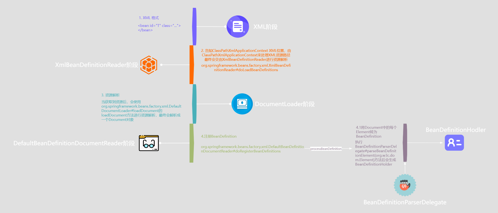

# Spring Bean 出生篇(一)

## 目录

- [Bean 的生产图纸 BeanDefinition](#Bean的生产图纸-BeanDefinition)
  - [定位 BeanDefinition 元数据信息](#定位BeanDefinition元数据信息)
    - [support.AbstractBeanDefinitionReader#loadBeanDefinitions(java.lang.String, java.util.Set\<org.springframework.core.io.Resource>)](#supportAbstractBeanDefinitionReaderloadBeanDefinitionsjavalangString-javautilSetorgspringframeworkcoreioResource)
    - [ResourcePatternResolver 工具类](#ResourcePatternResolver工具类)
  - [加载 BeanDefinition](#加载BeanDefinition)
    - [资源准备](#资源准备)
      - [xml.XmlBeanDefinitionReader#loadBeanDefinitions(org.springframework.core.io.support.EncodedResource)](#xmlXmlBeanDefinitionReaderloadBeanDefinitionsorgspringframeworkcoreiosupportEncodedResource)
    - [执行加载 BeanDefinition](#执行加载BeanDefinition)
      - [xml.XmlBeanDefinitionReader#doLoadBeanDefinitions](#xmlXmlBeanDefinitionReaderdoLoadBeanDefinitions)
        - [DocumentLoader](#DocumentLoader)
        - [DefaultDocumentLoader 的使用案例](#DefaultDocumentLoader-的使用案例)
      - [XmlBeanDefinitionReader#doLoadBeanDefinitions()](#XmlBeanDefinitionReaderdoLoadBeanDefinitions)
    - [解析 BeanDefinition](#解析BeanDefinition)
      - [XmlBeanDefinitionReader#registerBeanDefinitions()](#XmlBeanDefinitionReaderregisterBeanDefinitions)
      - [Spring 提供的反射工具类 BeanUtils.instantiateClass](#Spring提供的反射工具类BeanUtilsinstantiateClass)
      - [DefaultBeanDefinitionDocumentReader#doRegisterBeanDefinitions](#DefaultBeanDefinitionDocumentReaderdoRegisterBeanDefinitions)
      - [BeanDefinitionParserDelegate](#BeanDefinitionParserDelegate)
        - [xml.BeanDefinitionParserDelegate#parseBeanDefinitionElement(org.w3c.dom.Element, org.springframework.beans.factory.config.BeanDefinition)](#xmlBeanDefinitionParserDelegateparseBeanDefinitionElementorgw3cdomElement-orgspringframeworkbeansfactoryconfigBeanDefinition)
      - [DefaultBeanDefinitionDocumentReader#parseBeanDefinitions](#DefaultBeanDefinitionDocumentReaderparseBeanDefinitions)
  - [BeanDefinition 注册至 IOC 容器](#BeanDefinition注册至IOC容器)
    - [BeanDefinitionReaderUtils#registerBeanDefinition](#BeanDefinitionReaderUtilsregisterBeanDefinition)
    - [DefaultListableBeanFactory#registerBeanDefinition](#DefaultListableBeanFactoryregisterBeanDefinition)
- [总结](#总结)

从 IOC 篇，我们已经清楚了 Bean 和 容器间的关系了，我们说容器像一个地球村，而 Bean 像一个个居民，而且 Bean 还具有着 BeanDefinition 给他标识身份和特性，就像身份证一样。在 IOC 篇，我们更是通过 xml 的方式定义了 Bean 的信息，当我们创建 ApplicationContext 容器 ClassPathXmlApplicationContext 时，我们定义的 Bean 信息便会被加载成 Bean，所以我们可以通过 getBean 方法获取到对应的 Bean。

当然，我们还了解了 IOC 容器的生命周期的脉络，那么该篇，我们就一起分析分析我们定义的这么些 Bean 信息是如何从 xml 中到达容器内部形成一个 Bean 的。

### Bean 的生产图纸 BeanDefinition

BeanDefinition 就是 Bean 的生产图纸，他们会存储在 Spring 容器当中，当我们需要的时候，或者容器需要的时候，Spring 容器就会根据这些生产图纸来生产 Bean 实例。当然在 IOC 篇，我们都知道该怎么定义这些 BeanDefinition 的元数据，即基于 xml 的方式或者注解等方式。


#### 定位 BeanDefinition 元数据信息

我们都清楚了 Spring Bean 在容器中最开始就是 BeanDefinition，而 BeanDefinition 的元数据信息是可以由我们以 xml 的方式进行定义的。

```xml
    <!-- 定义一个简单的 Bean -->
    <bean id="user" class="cn.t.code.vo.User">
        <property name="username" value="zs"></property>
        <property name="order" value="10001"></property>
        <property name="userId" value="1"></property>
    </bean>
```

而且通过以下代码可以载入我们定义的 BeanDefinition 元数据信息，并通过 getBean 获取对应的 Bean 实例，首先，我们可以先探讨探讨为什么我们传入 spring-demo.xml 这么一串关于我们定义的 xml 的名称文本就能帮助我们定位到该 xml 并进行加载。

```java
public static void main(String[] args) {
        ClassPathXmlApplicationContext context = new ClassPathXmlApplicationContext("spring-demo.xml");
        User user = (User)context.getBean("user");
        System.out.println(user);
    }

```

我们只需看 spring-demo.xml 交给了谁来处理即可，而且跟过大致流程的我们，也不难发现，这段 xml 文本是交由 ClassPathXmlApplicationContext 构造函数的 setConfigLocations(configLocations)方法处理了

```java
public ClassPathXmlApplicationContext(
      String[] configLocations, boolean refresh, @Nullable ApplicationContext parent)
      throws BeansException {

    super(parent);
    //处理资源路径
    setConfigLocations(configLocations);
    if (refresh) {
      refresh();
    }
  }
```

那么接下来就要看看 setConfigLocations 方法是如何处理我们设置的 configLocations 的，resolvePath 主要是为了处理路径中的占位符（\${}）的，当然最后会将这些我们传入的文件路径存储在 configLocations 数组中，相当于锁定目标了。

```java
  public void setConfigLocations(@Nullable String... locations) {
    if (locations != null) {
      Assert.noNullElements(locations, "Config locations must not be null");
      this.configLocations = new String[locations.length];
      for (int i = 0; i < locations.length; i++) {
        this.configLocations[i] = resolvePath(locations[i]).trim();
      }
    }
    else {
      this.configLocations = null;
    }
  }
```

但是通过参数，会发现我们往里传的只是"spring-demo.xml"而已，容器又是怎么知道是 classpath 下的呢？IOC 篇我们分析容器初始化流程的过程中接触到了以下这块步骤

```java
// Tell the subclass to refresh the internal bean factory.
ConfigurableListableBeanFactory beanFactory = obtainFreshBeanFactory();
```

在这个步骤中，我们会发现其中的 org.springframework.context.support.AbstractRefreshableApplicationContext#refreshBeanFactory 方法会有一个很重要的动作就是 loadBeanDefinitions(beanFactory);，没错，就是在这里 Spring IOC 容器进行 BeanDefinition 的加载，有了 BeanDefintion 这张设计图纸，制造 Bean 那可不是轻而易举的事情吗？

所以想要明白 BeanDefinition 是怎么从 XML 加载到容器中的，这个方法就是我们跟踪的重点方法。

```java
loadBeanDefinitions(beanFactory);
```

既然我们使用的是 xml 格式定义 Bean，那么调用的自然也是 org.springframework.context.support.AbstractXmlApplicationContext 了，值得注意的是，AbstractXmlApplicationContext 的继承关系如下：

AbstractXmlApplicationContext → AbstractRefreshableConfigApplicationContext →AbstractRefreshableApplicationContext → AbstractApplicationContext →DefaultResourceLoader

所以，AbstractXmlApplicationContext 或者说 ApplicationContext 及其派生其实也是一个资源加载器。

当我们跟进 AbstractXmlApplicationContext 时，就会发现 AbstractXmlApplicationContext 成为了资源处理器设置进了 XmlBeanDefinitionReader 中，并且在 loadBeanDefinitions 中进行 BeanDefinition 的加载。

```java
  protected void loadBeanDefinitions(DefaultListableBeanFactory beanFactory) throws BeansException, IOException {
    // 创建用于从 Xml 中读取 BeanDefinition 的读取器，并通过回调设置到 IoC 容器中去，容器使用该读取器读取 BeanDefinition 资源
    XmlBeanDefinitionReader beanDefinitionReader = new XmlBeanDefinitionReader(beanFactory);

    // Configure the bean definition reader with this context's
    // resource loading environment.
    beanDefinitionReader.setEnvironment(getEnvironment());
    beanDefinitionReader.setResourceLoader(this);

    // 设置 SAX 解析器，SAX（simple API for XML）是另一种 XML 解析方法。相比于 DOM，SAX 速度更快，占用内存更小。
    // 它逐行扫描文档，一边扫描一边解析。相比于先将整个 XML 文件扫描进内存，再进行解析的 DOM，SAX 可以在解析文档的
    // 任意时刻停止解析，但操作也比 DOM 复杂。
    beanDefinitionReader.setEntityResolver(new ResourceEntityResolver(this));

    initBeanDefinitionReader(beanDefinitionReader);

    //基于XmlBeanDefinitionReader 进行BeanDefinition加载
    loadBeanDefinitions(beanDefinitionReader);
  }
```

而我们继续跟进至 loadBeanDefinitions 方法时，getConfigLocations 处会返回我们之前设置的 configLocations 并交由 XmlBeanDefinitionReader 进行 BeanDefinition 加载

```java
  protected void loadBeanDefinitions(XmlBeanDefinitionReader reader) throws BeansException, IOException {
    //这里ClassPathXmlApplicationContext对getConfigResources进行了重写
    //使得我们可以通过ClassPathXmlApplicationContext(String path , Class<?> clazz)
    //来根据指定类来加载类资源所在的xml资源
    Resource[] configResources = getConfigResources();
    if (configResources != null) {
      reader.loadBeanDefinitions(configResources);
    }
    //这里会返回的就是之前在ClassPathXmlApplicationContext构造函数中跑的setConfigLocation()的值
    String[] configLocations = getConfigLocations();
    if (configLocations != null) {
      //XmlBeanDefinitionReader 调用其父类 AbstractBeanDefinitionReader 的方法从配置位置加载 BeanDefinition
      reader.loadBeanDefinitions(configLocations);
    }
  }


  //org.springframework.context.support.AbstractRefreshableConfigApplicationContext#getConfigLocations
  protected String[] getConfigLocations() {
    return (this.configLocations != null ? this.configLocations : getDefaultConfigLocations());
  }

```

好了这部分内容我们需要继续往下跟，直至 org.springframework.beans.factory.support.AbstractBeanDefinitionReader#loadBeanDefinitions(java.lang.String, java.util.Set\<org.springframework.core.io.Resource>)这个方法，当然在此之前还有几个重载的方法，但是我们先到这里停停脚 😂（接下来还会有一连串的 loadBeanDefinitions）。

AbstractXmlApplicationContext 的 loadBeanDefinitions 中将 AbstractXmlApplicationContext,设为了 ResourceLoader，此时就需要将 AbstractXmlApplicationContext 作为资源加载器获取出来。其中 AbstractXmlApplicationContext 是 ResourcePatternResolver 类型的资源加载器，这个我们可以走入 ResourcePatternResolver 看看其实现，我们会发现凡是 ResourcePatternResolver 类型的资源加载其都会有 classpath \*:的前缀，这也就解释了为什么我们可以通过 ClassPathXmlApplication("spring-test.xml")，就能找到资源目录下的 xml 配置。

##### support.AbstractBeanDefinitionReader#loadBeanDefinitions(java.lang.String, java.util.Set\<org.springframework.core.io.Resource>)

```java
public int loadBeanDefinitions(String location, @Nullable Set<Resource> actualResources) throws BeanDefinitionStoreException {
    //AbstractXmlApplicationContext
    ResourceLoader resourceLoader = getResourceLoader();

    if (resourceLoader == null) {
      throw new BeanDefinitionStoreException(
          "Cannot load bean definitions from location [" + location + "]: no ResourceLoader available");
    }

    //当我们点进ResourcePatternResolver，会发现以下这段代码，就真相大白了
    //String CLASSPATH_ALL_URL_PREFIX = "classpath*:";
    //而AbstractXmlApplicationContext正是ResourcePatternResolver的实现
    //ResourcePatternResolver加载的正是classpath下的我们定义好的资源
    if (resourceLoader instanceof ResourcePatternResolver) {
      try {
        //基于ResourcePatternResolver读取具体路径下的资源
        Resource[] resources = ((ResourcePatternResolver) resourceLoader).getResources(location);
        //有了资源，后面就可以进行资源解析了
        int count = loadBeanDefinitions(resources);
        if (actualResources != null) {
          Collections.addAll(actualResources, resources);
        }
        if (logger.isTraceEnabled()) {
          logger.trace("Loaded " + count + " bean definitions from location pattern [" + location + "]");
        }
        return count;
      }
      catch (IOException ex) {
        throw new BeanDefinitionStoreException(
            "Could not resolve bean definition resource pattern [" + location + "]", ex);
      }
    }
    else {
      // Can only load single resources by absolute URL.
      Resource resource = resourceLoader.getResource(location);
      int count = loadBeanDefinitions(resource);
      if (actualResources != null) {
        actualResources.add(resource);
      }
      if (logger.isTraceEnabled()) {
        logger.trace("Loaded " + count + " bean definitions from location [" + location + "]");
      }
      return count;
    }
  }
```

##### ResourcePatternResolver 工具类

另外，关于 ResourcePatternResolver，我们日常也可以用于我们进行资源加载，而且 ResourcePatternResolver 支持 Ant 风格的路径，所以加载资源也是非常方便的。

```java
 public static void main(String[] args) throws Exception {
        //PathMatchingResourcePatternResolver 是 ResourcePatternResolver的实现
        PathMatchingResourcePatternResolver resolver = new PathMatchingResourcePatternResolver();
        // 支持使用Ant风格的路径模式，加载所有匹配的类路径资源
        Resource[] resources = resolver.getResources("classpath*:*.xml");
        for (Resource resource : resources) {
            System.out.println("Classpath = " + resource.getFilename());
            String description = resource.getDescription();
            System.out.println("Description = " + description);
        }
    } ResourcePatternResolver的使用
```

目前为止，都是为了根据路径获取资源，接下来的 loadBeanDefinitions 便是基于获取的资源进行资源加载咯！

#### 加载 BeanDefinition

##### 资源准备

接下来我们会遇到各种重载与调用的 loadBeanDefinitions，直到来到 org.springframework.beans.factory.xml.XmlBeanDefinitionReader#loadBeanDefinitions(org.springframework.core.io.support.EncodedResource)该方法时，我们会发现一个我们看源码一定会重点关注的核心方法 doxxx 开头的方法，那就是 doLoadBeanDefinitions()，我们将会在这个方法内揭开加载 BeanDefintion 的真相。

###### xml.XmlBeanDefinitionReader#loadBeanDefinitions(org.springframework.core.io.support.EncodedResource)

在此之前，我们可以先看看以下方法做了些什么事情，以下的方法做的其实资源在读取加载前所需要做的事情，简单来说就是层层包装，先从 Resource → EncodedResource → InputStream → InputSource ，最后将 InputSource 交由 doLoadBeanDefinitions 来处理

```java
@Override
public int loadBeanDefinitions(Resource resource) throws BeanDefinitionStoreException {
  //将读到资源包装为EncodedResource类，里面涵盖该资源的编码信息，字符集等
  return loadBeanDefinitions(new EncodedResource(resource));
}


public int loadBeanDefinitions(EncodedResource encodedResource) throws BeanDefinitionStoreException {
    Assert.notNull(encodedResource, "EncodedResource must not be null");
    if (logger.isTraceEnabled()) {
      logger.trace("Loading XML bean definitions from " + encodedResource);
    }
    //resourcesCurrentlyBeingLoaded 实际上是一个 ThreadLocal<Set<EncodedResource>>
    //resourcesCurrentlyBeingLoaded 用于跟踪当前线程正在加载的资源，
    //防止循环加载和重复加载资源。这样可以确保在多线程环境中，每个线程都
    //能安全地加载 XML bean 定义，而不会干扰其他线程的加载过程。
    Set<EncodedResource> currentResources = this.resourcesCurrentlyBeingLoaded.get();

    if (!currentResources.add(encodedResource)) {
      throw new BeanDefinitionStoreException(
          "Detected cyclic loading of " + encodedResource + " - check your import definitions!");
    }

    try (InputStream inputStream = encodedResource.getResource().getInputStream()) {
      //获取资源输入流并包装成InputSource
      InputSource inputSource = new InputSource(inputStream);
      if (encodedResource.getEncoding() != null) {
        inputSource.setEncoding(encodedResource.getEncoding());
      }
      //具体处理资源流程
      return doLoadBeanDefinitions(inputSource, encodedResource.getResource());
    }
    catch (IOException ex) {
      throw new BeanDefinitionStoreException(
          "IOException parsing XML document from " + encodedResource.getResource(), ex);
    }
    finally {
      currentResources.remove(encodedResource);
      if (currentResources.isEmpty()) {
        this.resourcesCurrentlyBeingLoaded.remove();
      }
    }
  } loadBeanDefinitions(org.springframework.core.io.support.EncodedResource)
```

##### 执行加载 BeanDefinition

###### xml.XmlBeanDefinitionReader#doLoadBeanDefinitions

接下来就是重头戏 doLoadBeanDefinitions 了，不过 doLoadBeanDefinitions 之前可以先了解这其中的重要角色 org.springframework.beans.factory.xml.DocumentLoader

###### DocumentLoader

DocumentLoader 是专门用于加载和解析 XML 文档的，通常用于解析 Spring 配置文件。

```java
public interface DocumentLoader {
  /**
     * 从提供的 InputSource source 加载一个 Document document。
     * @param inputSource 要加载的文档的来源
     * @param entityResolver 用于解析任何实体的解析器
     * @param errorHandler 用于在加载文档过程中报告任何错误
     * @param validationMode 验证的类型
     * （org.springframework.util.xml.XmlValidationModeDetector#VALIDATION_DTD DTD
     * 或 org.springframework.util.xml.XmlValidationModeDetector#VALIDATION_XSD XSD)
     * @param namespaceAware 如果需要提供对XML命名空间的支持，则为 true
     * @return 加载的 Document document
     * @throws Exception 如果发生错误
     */
  Document loadDocument(
      InputSource inputSource, EntityResolver entityResolver,
      ErrorHandler errorHandler, int validationMode, boolean namespaceAware)
      throws Exception;

}
```

###### DefaultDocumentLoader 的使用案例

在 Spring 中的 DocumentLoader 通常是使用于对资源进行解析和加载的，不妨我们可以看看以下使用 DocumentLoader 的示例代码，Spring 使用的是 DefaultDocumentLoader 实现来进行资源的加载，当我们得到了 Document 对象以后，我们可以通过一系列的 Document 提供的 API 对构建出来的 Document 对象进行解析打印，根据执行结果来看，XML 资源已经变成了一种结构化（具备键值关系）的数据了，意味着我们想要取到其中的信息其实是很简单的了。

```java
    public static void main(String[] args) {
        try {
            // 创建要加载的资源对象
            Resource resource = new ClassPathResource("bean-config.xml");
            // 创建 DocumentLoader 实例
            DefaultDocumentLoader documentLoader = new DefaultDocumentLoader();
            // 加载和解析 XML 文档
            Document document = documentLoader.loadDocument(new InputSource(resource.getInputStream()), null, null, 0, true);
            // 打印 XML 文档的内容
            printDetailedDocumentInfo(document);
        } catch (Exception e) {
            e.printStackTrace();
        }
    }

    /**
     * 打印详细的XML文档信息，包括元素、属性和文本内容。
     *
     * @param document 要打印的XML文档对象
     */
    private static void printDetailedDocumentInfo(Document document) {
        Element rootElement = document.getDocumentElement();
        printElementInfo(rootElement, "");
    }

    /**
     * 递归打印XML元素的详细信息，包括元素名称、属性和子节点。
     *
     * @param element 要打印的XML元素
     * @param indent  当前打印的缩进
     */
    private static void printElementInfo(Element element, String indent) {
        // 打印元素名称
        System.out.println(indent + "Element: " + element.getNodeName());

        // 打印元素的属性
        NamedNodeMap attributes = element.getAttributes();
        for (int i = 0; i < attributes.getLength(); i++) {
            Node attribute = attributes.item(i);
            System.out.println(indent + "  Attribute: " + attribute.getNodeName() + " = " + attribute.getNodeValue());
        }

        // 打印元素的子节点（可能是元素或文本）
        NodeList childNodes = element.getChildNodes();
        for (int i = 0; i < childNodes.getLength(); i++) {
            Node childNode = childNodes.item(i);
            if (childNode.getNodeType() == Node.ELEMENT_NODE) {
                // 如果子节点是元素，递归打印它
                printElementInfo((Element) childNode, indent + "  ");
            } else if (childNode.getNodeType() == Node.TEXT_NODE) {
                // 如果子节点是文本，打印文本内容
                System.out.println(indent + "  Text: " + childNode.getNodeValue().trim());
            }
        }
    }


    //执行结果如下
        Element: beans
      Attribute: xmlns = http://www.springframework.org/schema/beans
      Attribute: xmlns:xsi = http://www.w3.org/2001/XMLSchema-instance
      Attribute: xsi:schemaLocation = http://www.springframework.org/schema/beans                            http://www.springframework.org/schema/beans/spring-beans.xsd
      Text:
      Text:
      Element: bean
        Attribute: class = com.example.model.User
        Attribute: id = user
        Text:
        Element: property
          Attribute: name = name
          Attribute: value = T
        Text:
        Element: property
          Attribute: name = age
          Attribute: value = 26
        Text:
      Text:
```

###### XmlBeanDefinitionReader#doLoadBeanDefinitions()

Spring 处理 xml 资源文件首先会通过 doLoadDocument 方法来基于输入资源解析为 org.w3c.dom.Document 对象

```java
protected int doLoadBeanDefinitions(InputSource inputSource, Resource resource)
      throws BeanDefinitionStoreException {

    try {
      //基于DocumentLoader对InputSource（XML资源）进行解析并返回Document 对象
      //XML资源经过解析会被解析为树的形式，所以基于Document提供的接口可以便于我们操作
      //XML解析出来的信息
      Document doc = doLoadDocument(inputSource, resource);
      int count = registerBeanDefinitions(doc, resource);
      if (logger.isDebugEnabled()) {
        logger.debug("Loaded " + count + " bean definitions from " + resource);
      }
      return count;
    }
    catch (BeanDefinitionStoreException ex) {
      throw ex;
    }
    catch (SAXParseException ex) {
      throw new XmlBeanDefinitionStoreException(resource.getDescription(),
          "Line " + ex.getLineNumber() + " in XML document from " + resource + " is invalid", ex);
    }
    catch (SAXException ex) {
      throw new XmlBeanDefinitionStoreException(resource.getDescription(),
          "XML document from " + resource + " is invalid", ex);
    }
    catch (ParserConfigurationException ex) {
      throw new BeanDefinitionStoreException(resource.getDescription(),
          "Parser configuration exception parsing XML from " + resource, ex);
    }
    catch (IOException ex) {
      throw new BeanDefinitionStoreException(resource.getDescription(),
          "IOException parsing XML document from " + resource, ex);
    }
    catch (Throwable ex) {
      throw new BeanDefinitionStoreException(resource.getDescription(),
          "Unexpected exception parsing XML document from " + resource, ex);
    }
  }


protected Document doLoadDocument(InputSource inputSource, Resource resource) throws Exception {
    return this.documentLoader.loadDocument(inputSource, getEntityResolver(), this.errorHandler,
        getValidationModeForResource(resource), isNamespaceAware());
  }

```

##### 解析 BeanDefinition

###### XmlBeanDefinitionReader#registerBeanDefinitions()

registerBeanDefinitions 方法可以看到解析出来的 Document 会被反射创建出来的 Document 解析器 - BeanDefinitionDocumentReader 进行读取。

```java
  protected BeanDefinitionDocumentReader createBeanDefinitionDocumentReader() {
    return BeanUtils.instantiateClass(this.documentReaderClass);
  }

public int registerBeanDefinitions(Document doc, Resource resource) throws BeanDefinitionStoreException {
    //基于反射创建BeanDefinitionDocumentReader
    BeanDefinitionDocumentReader documentReader = createBeanDefinitionDocumentReader();
    //为了计算出此时BeanDefintion的注册数量，需要先计算目前已注册的BeanDefinition数量
    int countBefore = getRegistry().getBeanDefinitionCount();
    //执行解析BeanDefinition的入口
    documentReader.registerBeanDefinitions(doc, createReaderContext(resource));
    return getRegistry().getBeanDefinitionCount() - countBefore;
  }
```

###### Spring 提供的反射工具类 BeanUtils.instantiateClass

其中 BeanUtils.instantiateClass 也是 Spring 提供用于反射的工具类，使用起来也是非常方便的。

```java
 public static void main(String[] args) throws NoSuchMethodException {
        //使用Spring 反射工具类 , 基于无参构造进行实例化
        User user = BeanUtils.instantiateClass(User.class);
        System.out.println(user.getName());

        //使用Spring 反射工具类 , 基于有参构造进行实例化
        Constructor<User> constructor = User.class.getConstructor(String.class , Long.class);
        User user1 = BeanUtils.instantiateClass(constructor , "T" , 18L);
        System.out.println(user1.getName());
    } org.springframework.beans.BeanUtils的使用
```

###### DefaultBeanDefinitionDocumentReader#doRegisterBeanDefinitions

当我们继续往下跟踪，会跟踪到 DefaultBeanDefinitionDocumentReader 下的 doRegisterBeanDefinitions 方法，不过在分析该方法之前，可以先认识认识 DefaultBeanDefinitionDocumentReader 类，映入眼帘的是一堆熟悉的常量，其实从以下常量我们便能大概地猜出该类的职责之一就是处理我们在 xml 中定义的以下配置。

```java

  public static final String BEAN_ELEMENT = BeanDefinitionParserDelegate.BEAN_ELEMENT;

  public static final String NESTED_BEANS_ELEMENT = "beans";

  public static final String ALIAS_ELEMENT = "alias";

  public static final String NAME_ATTRIBUTE = "name";

  public static final String ALIAS_ATTRIBUTE = "alias";

  public static final String IMPORT_ELEMENT = "import";

  public static final String RESOURCE_ATTRIBUTE = "resource";

  public static final String PROFILE_ATTRIBUTE = "profile";
```

知道了该类的具体功能，然后我们再看看 doRegisterBeanDefinitions 方法做了什么，通过观察该方法，可以发现该方法属于一个模板方法，这就意味着，该方法可以看到 RegisterBeanDefinitions 的一整个要做的流程。

```java
protected void doRegisterBeanDefinitions(Element root) {

    //BeanDefinitionParserDelegate  解析bean中各项配置的核心处理器
    BeanDefinitionParserDelegate parent = this.delegate;
    this.delegate = createDelegate(getReaderContext(), root, parent);

    if (this.delegate.isDefaultNamespace(root)) {
      String profileSpec = root.getAttribute(PROFILE_ATTRIBUTE);
      if (StringUtils.hasText(profileSpec)) {
        String[] specifiedProfiles = StringUtils.tokenizeToStringArray(
            profileSpec, BeanDefinitionParserDelegate.MULTI_VALUE_ATTRIBUTE_DELIMITERS);


        if (!getReaderContext().getEnvironment().acceptsProfiles(specifiedProfiles)) {
          if (logger.isDebugEnabled()) {
            logger.debug("Skipped XML bean definition file due to specified profiles [" + profileSpec +
                "] not matching: " + getReaderContext().getResource());
          }
          return;
        }
      }
    }
    //解析的前置处理，可以让我们干预并增强Spring对XML的解析
    preProcessXml(root);
    //真正执行Document的解析
    parseBeanDefinitions(root, this.delegate);
    //解析的后置操作，可以令我们干预并增强bean完成解析后的操作
    postProcessXml(root);
    this.delegate = parent;
  }
```

###### BeanDefinitionParserDelegate

BeanDefinitionParserDelegate 是解析并注册 BeanDefinitions 的核心组件，所以很有必要认识认识这位工匠，当然从定义的常量来看，便能够得知他具备的核心功能之一，便是将 XML 配置文件中的 \<bean>、\<property> 等元素解析为对应的 BeanDefinition 对象所需的元数据。定义的这部分常量都是我们以 xml 形式定义 bean 时用到的属性或者值。

```java
public static final String BEANS_NAMESPACE_URI = "http://www.springframework.org/schema/beans";

  public static final String MULTI_VALUE_ATTRIBUTE_DELIMITERS = ",; ";

  public static final String TRUE_VALUE = "true";

  public static final String FALSE_VALUE = "false";

  public static final String DEFAULT_VALUE = "default";

  public static final String DESCRIPTION_ELEMENT = "description";

  public static final String AUTOWIRE_NO_VALUE = "no";

  public static final String AUTOWIRE_BY_NAME_VALUE = "byName";

  public static final String AUTOWIRE_BY_TYPE_VALUE = "byType";

  public static final String AUTOWIRE_CONSTRUCTOR_VALUE = "constructor";

  public static final String AUTOWIRE_AUTODETECT_VALUE = "autodetect";

  public static final String NAME_ATTRIBUTE = "name";

  public static final String BEAN_ELEMENT = "bean";

  public static final String META_ELEMENT = "meta";

  public static final String ID_ATTRIBUTE = "id";

  public static final String PARENT_ATTRIBUTE = "parent";

  public static final String CLASS_ATTRIBUTE = "class";

  public static final String ABSTRACT_ATTRIBUTE = "abstract";

  public static final String SCOPE_ATTRIBUTE = "scope";

  private static final String SINGLETON_ATTRIBUTE = "singleton";

  public static final String LAZY_INIT_ATTRIBUTE = "lazy-init";

  public static final String AUTOWIRE_ATTRIBUTE = "autowire";

  public static final String AUTOWIRE_CANDIDATE_ATTRIBUTE = "autowire-candidate";

  public static final String PRIMARY_ATTRIBUTE = "primary";

  public static final String DEPENDS_ON_ATTRIBUTE = "depends-on";

  public static final String INIT_METHOD_ATTRIBUTE = "init-method";

  public static final String DESTROY_METHOD_ATTRIBUTE = "destroy-method";

  public static final String FACTORY_METHOD_ATTRIBUTE = "factory-method";

  public static final String FACTORY_BEAN_ATTRIBUTE = "factory-bean";

  public static final String CONSTRUCTOR_ARG_ELEMENT = "constructor-arg";

  public static final String INDEX_ATTRIBUTE = "index";

  public static final String TYPE_ATTRIBUTE = "type";

  public static final String VALUE_TYPE_ATTRIBUTE = "value-type";

  public static final String KEY_TYPE_ATTRIBUTE = "key-type";

  public static final String PROPERTY_ELEMENT = "property";

  public static final String REF_ATTRIBUTE = "ref";

  public static final String VALUE_ATTRIBUTE = "value";

  public static final String LOOKUP_METHOD_ELEMENT = "lookup-method";

  public static final String REPLACED_METHOD_ELEMENT = "replaced-method";

  public static final String REPLACER_ATTRIBUTE = "replacer";

  public static final String ARG_TYPE_ELEMENT = "arg-type";

  public static final String ARG_TYPE_MATCH_ATTRIBUTE = "match";

  public static final String REF_ELEMENT = "ref";

  public static final String IDREF_ELEMENT = "idref";

  public static final String BEAN_REF_ATTRIBUTE = "bean";

  public static final String PARENT_REF_ATTRIBUTE = "parent";

  public static final String VALUE_ELEMENT = "value";

  public static final String NULL_ELEMENT = "null";

  public static final String ARRAY_ELEMENT = "array";

  public static final String LIST_ELEMENT = "list";

  public static final String SET_ELEMENT = "set";

  public static final String MAP_ELEMENT = "map";

  public static final String ENTRY_ELEMENT = "entry";

  public static final String KEY_ELEMENT = "key";

  public static final String KEY_ATTRIBUTE = "key";

  public static final String KEY_REF_ATTRIBUTE = "key-ref";

  public static final String VALUE_REF_ATTRIBUTE = "value-ref";

  public static final String PROPS_ELEMENT = "props";

  public static final String PROP_ELEMENT = "prop";

  public static final String MERGE_ATTRIBUTE = "merge";

  public static final String QUALIFIER_ELEMENT = "qualifier";

  public static final String QUALIFIER_ATTRIBUTE_ELEMENT = "attribute";

  public static final String DEFAULT_LAZY_INIT_ATTRIBUTE = "default-lazy-init";

  public static final String DEFAULT_MERGE_ATTRIBUTE = "default-merge";

  public static final String DEFAULT_AUTOWIRE_ATTRIBUTE = "default-autowire";

  public static final String DEFAULT_AUTOWIRE_CANDIDATES_ATTRIBUTE = "default-autowire-candidates";

  public static final String DEFAULT_INIT_METHOD_ATTRIBUTE = "default-init-method";

  public static final String DEFAULT_DESTROY_METHOD_ATTRIBUTE = "default-destroy-method";

```

当我们将目光转移到该类的这两个方法时，能够更加明确地得知该类的功能无疑就是进行 Element 的解析，并最后生成 BeanDefinitionHolder。

###### xml.BeanDefinitionParserDelegate#parseBeanDefinitionElement(org.w3c.dom.Element, org.springframework.beans.factory.config.BeanDefinition)

但是为什么会返回 BeanDefinitionHolder 而不是 BeanDefinition 呢？观察 BeanDefinitionHolder 可以发现其实 BeanDefinitionHolder 是 BeanDefinition 的工具类，可以帮助我们通过 beanName 和 aliases 找到对应的 BeanDefinition ，另外就是 BeanDefinitionHolder 将 beanName 和 aliases 这种唯一标识和具体的 BeanDefinition 分离开来了，属于是 BeanDefinition 的能力增强。

```java
  public class BeanDefinitionHolder implements BeanMetadataElement {

    private final BeanDefinition beanDefinition;

    private final String beanName;

    @Nullable
    private final String[] aliases;

    ...
  }

  @Nullable
  public BeanDefinitionHolder parseBeanDefinitionElement(Element ele) {
    return parseBeanDefinitionElement(ele, null);
  }

  @Nullable
  public BeanDefinitionHolder parseBeanDefinitionElement(Element ele, @Nullable BeanDefinition containingBean) {
    // ---------对bean name 的处理  -------------
    String id = ele.getAttribute(ID_ATTRIBUTE);
    String nameAttr = ele.getAttribute(NAME_ATTRIBUTE);

    List<String> aliases = new ArrayList<>();
    if (StringUtils.hasLength(nameAttr)) {
      //取bean 的别名，所以我们定义多个bean的别名时可以以,或者;分割
      // <bean id="user" class="com.example.model.User" name="mainUser,oldUser">
      String[] nameArr = StringUtils.tokenizeToStringArray(nameAttr, MULTI_VALUE_ATTRIBUTE_DELIMITERS);
      aliases.addAll(Arrays.asList(nameArr));
    }

    String beanName = id;
    if (!StringUtils.hasText(beanName) && !aliases.isEmpty()) {
      beanName = aliases.remove(0);
      if (logger.isTraceEnabled()) {
        logger.trace("No XML 'id' specified - using '" + beanName +
            "' as bean name and " + aliases + " as aliases");
      }
    }

    if (containingBean == null) {
      //校验bean name
      checkNameUniqueness(beanName, aliases, ele);
    }
    // ---------对bean name 的处理  -------------
    // 将xml中各个元素解析为BeanDefinition关键方法
    AbstractBeanDefinition beanDefinition = parseBeanDefinitionElement(ele, beanName, containingBean);
    // ---------对没有主动配置bean name 的处理  -------------
    // 结果是会取该类的全限定类名
    if (beanDefinition != null) {
      if (!StringUtils.hasText(beanName)) {
        try {
          if (containingBean != null) {
            beanName = BeanDefinitionReaderUtils.generateBeanName(
                beanDefinition, this.readerContext.getRegistry(), true);
          }
          else {
            //具体的生成bean name 的规则可参考（非注解形式）
            //org.springframework.beans.factory.support.BeanDefinitionReaderUtils#generateBeanName(org.springframework.beans.factory.config.BeanDefinition, org.springframework.beans.factory.support.BeanDefinitionRegistry, boolean)
            //有以下命名情景
            //1.内部bean，则在其名称后附加一个基于对象身份的哈希值，并返回。
            //2.则调用uniqueBeanName方法，确保名称在bean工厂中唯一，并返回
            //3.不存在类名但存在父bean名称，则使用父bean名称加$child作为初始bean名称。
            //4.既没有类名也没有父bean名称但有工厂bean名称，则使用工厂bean名称加$created作为初始bean名称。
            beanName = this.readerContext.generateBeanName(beanDefinition);
            String beanClassName = beanDefinition.getBeanClassName();
            if (beanClassName != null &&
                beanName.startsWith(beanClassName) && beanName.length() > beanClassName.length() &&
                !this.readerContext.getRegistry().isBeanNameInUse(beanClassName)) {
              aliases.add(beanClassName);
            }
          }
          if (logger.isTraceEnabled()) {
            logger.trace("Neither XML 'id' nor 'name' specified - " +
                "using generated bean name [" + beanName + "]");
          }
        }
        catch (Exception ex) {
          error(ex.getMessage(), ele);
          return null;
        }
      }
      // ---------对没有主动配置bean name 的处理  -------------
      String[] aliasesArray = StringUtils.toStringArray(aliases);
      return new BeanDefinitionHolder(beanDefinition, beanName, aliasesArray);
    }

    return null;
  }
```

###### DefaultBeanDefinitionDocumentReader#parseBeanDefinitions

好了，对 BeanDefinitionParserDelegate 我们已经有不少的了解了，接下来我们可以继续回归到 doRegisterBeanDefinitions 继续跟进至 parseBeanDefinitions 这个重要的方法。

```java
  protected void doRegisterBeanDefinitions(Element root) {
    ...
    parseBeanDefinitions(root, this.delegate);
    ...
    this.delegate = parent;
  }

```

首先 parseBeanDefinition 会先校验最顶层的 beans 元素，因为我们的 xml 都是以 beans 开始的嘛，主要校验的是关于 beans 中配置的命名空间，基于命名空间来判断使用 Spring 提供的解析规则进行解析还是我们自定义的解析规则进行解析（当然极大多数都是跑的 Spring 提供的解析规则），接下来校验没问题了，便开始进行进行 beans 下的各个 Element 进行解析了，主要集中在 parseDefaultElement 方法中，而这其中我们会发现不管是校验还是解析跟 Element 相关的东西都是交由 BeanDefinitionParserDelegate 来完成的。

```java
protected void parseBeanDefinitions(Element root, BeanDefinitionParserDelegate delegate) {
    //先对根节点进行校验，其实就是对最顶层的beans对应的命名空间进行校验
    if (delegate.isDefaultNamespace(root)) {
      NodeList nl = root.getChildNodes();
      for (int i = 0; i < nl.getLength(); i++) {
        Node node = nl.item(i);
        if (node instanceof Element) {
          Element ele = (Element) node;
          // 如果 ele 定义的 Document 的元素节点使用的是 Spring 默认的 XML 命名空间
          if (delegate.isDefaultNamespace(ele)) {
            parseDefaultElement(ele, delegate);
          }
          else {
            // 若没有使用 Spring 默认的 XML 命名空间，则使用用户自定义的解析规则解析元素节点
            delegate.parseCustomElement(ele);
          }
        }
      }
    }
    else {
      delegate.parseCustomElement(root);
    }
  }
```

接下来就可以一起看看 parseDefaultElement 方法是如何对 Elememt 的元素进行操作的，其实读到这里，每个方法名都已经能够很明显地告诉我们他是做的什么事了。

```java
private void parseDefaultElement(Element ele, BeanDefinitionParserDelegate delegate) {
    // 解析 <Import> 元素
    if (delegate.nodeNameEquals(ele, IMPORT_ELEMENT)) {
      importBeanDefinitionResource(ele);
    }
    // 解析 <Alias> 元素
    else if (delegate.nodeNameEquals(ele, ALIAS_ELEMENT)) {
      processAliasRegistration(ele);
    }
    // 按照 Spring 的 bean解析规则 解析元素
    else if (delegate.nodeNameEquals(ele, BEAN_ELEMENT)) {
      processBeanDefinition(ele, delegate);
    }
    // 如果被解析的元素是 beans，则递归调用 doRegisterBeanDefinitions(Element root) 方法进行解析
    else if (delegate.nodeNameEquals(ele, NESTED_BEANS_ELEMENT)) {
      // recurse
      doRegisterBeanDefinitions(ele);
    }
  }

```

好了，多的不说，紧接着就对着各个方法展开猛烈进攻

- importBeanDefinitionResource 解析\<Import>元素

  ```java
  //导入配置示例  ->  <import resource="bean-config2.xml"/>

  protected void importBeanDefinitionResource(Element ele) {
      //读取resource信息
      String location = ele.getAttribute(RESOURCE_ATTRIBUTE);
      if (!StringUtils.hasText(location)) {
        getReaderContext().error("Resource location must not be empty", ele);
        return;
      }

      // Resolve system properties: e.g. "${user.dir}"
      location = getReaderContext().getEnvironment().resolveRequiredPlaceholders(location);

      Set<Resource> actualResources = new LinkedHashSet<>(4);

      // Discover whether the location is an absolute or relative URI
      boolean absoluteLocation = false;
      try {
        absoluteLocation = ResourcePatternUtils.isUrl(location) || ResourceUtils.toURI(location).isAbsolute();
      }
      catch (URISyntaxException ex) {
        // cannot convert to an URI, considering the location relative
        // unless it is the well-known Spring prefix "classpath*:"
      }

      // Absolute or relative?
      if (absoluteLocation) {
        try {
          //继续使用以往使用的XmlReaderContext进行BeanDefinition加载，流程跟以上的其实是一样的
          int importCount = getReaderContext().getReader().loadBeanDefinitions(location, actualResources);
          if (logger.isTraceEnabled()) {
            logger.trace("Imported " + importCount + " bean definitions from URL location [" + location + "]");
          }
        }
        catch (BeanDefinitionStoreException ex) {
          getReaderContext().error(
              "Failed to import bean definitions from URL location [" + location + "]", ele, ex);
        }
      }
      else {
        // No URL -> considering resource location as relative to the current file.
        try {
          int importCount;
          Resource relativeResource = getReaderContext().getResource().createRelative(location);
          if (relativeResource.exists()) {
            importCount = getReaderContext().getReader().loadBeanDefinitions(relativeResource);
            actualResources.add(relativeResource);
          }
          else {
            String baseLocation = getReaderContext().getResource().getURL().toString();
            importCount = getReaderContext().getReader().loadBeanDefinitions(
                StringUtils.applyRelativePath(baseLocation, location), actualResources);
          }
          if (logger.isTraceEnabled()) {
            logger.trace("Imported " + importCount + " bean definitions from relative location [" + location + "]");
          }
        }
        catch (IOException ex) {
          getReaderContext().error("Failed to resolve current resource location", ele, ex);
        }
        catch (BeanDefinitionStoreException ex) {
          getReaderContext().error(
              "Failed to import bean definitions from relative location [" + location + "]", ele, ex);
        }
      }
      Resource[] actResArray = actualResources.toArray(new Resource[0]);
      getReaderContext().fireImportProcessed(location, actResArray, extractSource(ele));
    }
  ```

- processAliasRegistration 解析\<alias>元素

  看看 alias 标签的使用案例，不难猜出，其中的步骤其实就是根据 name 到容器中获取对应的 Bean，然后将别名注册到该 Bean 的 BeanDefinitionHolder 中

  ```java
  //alias 标签使用 <alias name="userT" alias="T"/>

  protected void processAliasRegistration(Element ele) {
      String name = ele.getAttribute(NAME_ATTRIBUTE);
      String alias = ele.getAttribute(ALIAS_ATTRIBUTE);
      boolean valid = true;
      if (!StringUtils.hasText(name)) {
        getReaderContext().error("Name must not be empty", ele);
        valid = false;
      }
      if (!StringUtils.hasText(alias)) {
        getReaderContext().error("Alias must not be empty", ele);
        valid = false;
      }
      if (valid) {
        try {

          //将别名注册至该Bean中
          getReaderContext().getRegistry().registerAlias(name, alias);
        }
        catch (Exception ex) {
          getReaderContext().error("Failed to register alias '" + alias +
              "' for bean with name '" + name + "'", ele, ex);
        }
        //向容器发送别名处理完成事件
        getReaderContext().fireAliasRegistered(name, alias, extractSource(ele));
      }
    }
  ```

- processBeanDefinition 解析\<bean>元素

  这个方法是非常重要的，原因在于，这里不仅是对 Element 的解析，也是将 BeanDefinition 注册至 IOC 容器的过程，我们可以分为 3 步来进行分析

  1. delegate.parseBeanDefinitionElement

     对传入的 Element 进行解析封装成 BeanDefinitionHolder ，当然做这件事情的仍然是 BeanDefinitionParserDelegate ，这个在前面是有介绍的。

  2. delegate.decorateBeanDefinitionIfRequired

     对 bdHolder 进行包装处理

  3. BeanDefinitionReaderUtils.registerBeanDefinition

     一目了然，该方法的意思就是向容器注册 BeanDefinition，是一个非常核心的过程

  ```java

    protected void processBeanDefinition(Element ele, BeanDefinitionParserDelegate delegate) {
      //解析封装Element 成BeanDefinitionHolder
      BeanDefinitionHolder bdHolder = delegate.parseBeanDefinitionElement(ele);
      if (bdHolder != null) {
        //进一步封装
        bdHolder = delegate.decorateBeanDefinitionIfRequired(ele, bdHolder);
        try {
          // 向容器注册BeanDefinition（核心）
          BeanDefinitionReaderUtils.registerBeanDefinition(bdHolder, getReaderContext().getRegistry());
        }
        catch (BeanDefinitionStoreException ex) {
          getReaderContext().error("Failed to register bean definition with name '" +
              bdHolder.getBeanName() + "'", ele, ex);
        }
        // 向容器发送注册完毕的事件
        getReaderContext().fireComponentRegistered(new BeanComponentDefinition(bdHolder));
      }
    }
  ```

  1. 首先可以先来看看 Element 到 BeanDefinition 的过程，根据以往的经验，我们都清楚解析 Element 的事情主要是由 BeanDefinitionParserDelegate 做的，所以可以关注 BeanDefinitionParserDelegate#parseBeanDefinitionElement(org.w3c.dom.Element, org.springframework.beans.factory.config.BeanDefinition)这个方法

     ```java
     public BeanDefinitionHolder parseBeanDefinitionElement(Element ele, @Nullable BeanDefinition containingBean) {
         String id = ele.getAttribute(ID_ATTRIBUTE);
         String nameAttr = ele.getAttribute(NAME_ATTRIBUTE);

         List<String> aliases = new ArrayList<>();
         if (StringUtils.hasLength(nameAttr)) {
           String[] nameArr = StringUtils.tokenizeToStringArray(nameAttr, MULTI_VALUE_ATTRIBUTE_DELIMITERS);
           aliases.addAll(Arrays.asList(nameArr));
         }

         String beanName = id;
         if (!StringUtils.hasText(beanName) && !aliases.isEmpty()) {
           beanName = aliases.remove(0);
           if (logger.isTraceEnabled()) {
             logger.trace("No XML 'id' specified - using '" + beanName +
                 "' as bean name and " + aliases + " as aliases");
           }
         }

         if (containingBean == null) {
           checkNameUniqueness(beanName, aliases, ele);
         }

         AbstractBeanDefinition beanDefinition = parseBeanDefinitionElement(ele, beanName, containingBean);
         if (beanDefinition != null) {
           if (!StringUtils.hasText(beanName)) {
             try {
               if (containingBean != null) {
                 beanName = BeanDefinitionReaderUtils.generateBeanName(
                     beanDefinition, this.readerContext.getRegistry(), true);
               }
               else {
                 beanName = this.readerContext.generateBeanName(beanDefinition);
                 // Register an alias for the plain bean class name, if still possible,
                 // if the generator returned the class name plus a suffix.
                 // This is expected for Spring 1.2/2.0 backwards compatibility.
                 String beanClassName = beanDefinition.getBeanClassName();
                 if (beanClassName != null &&
                     beanName.startsWith(beanClassName) && beanName.length() > beanClassName.length() &&
                     !this.readerContext.getRegistry().isBeanNameInUse(beanClassName)) {
                   aliases.add(beanClassName);
                 }
               }
               if (logger.isTraceEnabled()) {
                 logger.trace("Neither XML 'id' nor 'name' specified - " +
                     "using generated bean name [" + beanName + "]");
               }
             }
             catch (Exception ex) {
               error(ex.getMessage(), ele);
               return null;
             }
           }
           String[] aliasesArray = StringUtils.toStringArray(aliases);
           return new BeanDefinitionHolder(beanDefinition, beanName, aliasesArray);
         }

         return null;
       }
     ```

     当然转为 BeanDefinition 的这个过程并没有那么复杂，只是一个不断从 Element 中取信息，set 至 BeanDefinition 的过程罢了，参考 BeanDefinitionParserDelegate#parseBeanDefinitionElement(org.w3c.dom.Element, java.lang.String, org.springframework.beans.factory.config.BeanDefinition)方法即可。

     ```java
       @Nullable
       public AbstractBeanDefinition parseBeanDefinitionElement(
           Element ele, String beanName, @Nullable BeanDefinition containingBean) {
         //记录解析过的bean
         this.parseState.push(new BeanEntry(beanName));

         String className = null;
         //处理class属性
         if (ele.hasAttribute(CLASS_ATTRIBUTE)) {
           className = ele.getAttribute(CLASS_ATTRIBUTE).trim();
         }
         //处理parent属性
         String parent = null;
         if (ele.hasAttribute(PARENT_ATTRIBUTE)) {
           parent = ele.getAttribute(PARENT_ATTRIBUTE);
         }

         try {
           // 根据 <bean> 元素配置的 class 名称和 parent 属性值创建 BeanDefinition
           AbstractBeanDefinition bd = createBeanDefinition(className, parent);
           //对配置bean的属性进行解析，当然id和class和parent在上面都处理了
           //<bean id="userT" class="com.example.model.User"
           // 主要解析这部分内容 init-method=""  lazy-init=""  scope="" ...  ></bean>
           parseBeanDefinitionAttributes(ele, beanName, containingBean, bd);
           bd.setDescription(DomUtils.getChildElementValueByTagName(ele, DESCRIPTION_ELEMENT));
           // 解析 <bean> 元素中的 meta 标签
           //    <bean id="userT" class="com.example.model.User"  >
           //  <meta key="author" value="T"/>
           //  <meta key="version" value="1.0"/>
           //  meta 起到了对bean信息的描述
           parseMetaElements(ele, bd);
           //解析lookup标签
           //可以通过look-up标签去影响bean的生成
           // <!-- 定义一个名为 userService 的 Bean -->
           //  <bean id="userService" class="com.example.service.UserService">
           //  <lookup method="getUser" bean="user"/>
           //</bean>
           parseLookupOverrideSubElements(ele, bd.getMethodOverrides());
           //处理replaced-method标签，replaced-method 标签可以用于运行时替换Bean的内部方法，当然构造方法除外
           parseReplacedMethodSubElements(ele, bd.getMethodOverrides());
           //处理constructor-arg标签
           parseConstructorArgElements(ele, bd);
           //处理property标签
           parsePropertyElements(ele, bd);
           //处理qualifier标签
           parseQualifierElements(ele, bd);

           bd.setResource(this.readerContext.getResource());
           bd.setSource(extractSource(ele));

           return bd;
         }
         catch (ClassNotFoundException ex) {
           error("Bean class [" + className + "] not found", ele, ex);
         }
         catch (NoClassDefFoundError err) {
           error("Class that bean class [" + className + "] depends on not found", ele, err);
         }
         catch (Throwable ex) {
           error("Unexpected failure during bean definition parsing", ele, ex);
         }
         finally {
           this.parseState.pop();
         }

         return null;
       }
     ```

#### BeanDefinition 注册至 IOC 容器

BeanDefinition 此时此刻已经算是生成出来了，那么接下来就是将其注册进 IOC 容器当中，随时用来生成 Bean，先回过头来看 DefaultBeanDefinitionDocumentReader#processBeanDefinition 方法，其中有一个非常重要的流程

###### BeanDefinitionReaderUtils#registerBeanDefinition

BeanDefinitionReaderUtils.registerBeanDefinition(bdHolder, getReaderContext().getRegistry());该方法就是将完成解析的 BeanDefinition 注册至 IOC 容器中。其中 BeanDefinitionRegistry 是一个 DefaultListableBeanFactory 即 BeanFactory，所以我们会看到像 registry 注册 BeanDefinition 的步骤，其实就是指向 IOC 容器注册 BeanDefintion。

```java
public static void registerBeanDefinition(
      BeanDefinitionHolder definitionHolder, BeanDefinitionRegistry registry)
      throws BeanDefinitionStoreException {

    // 获取解析的 <bean>元素 的 id 属性
    String beanName = definitionHolder.getBeanName();
    //向 IoC容器 注册 BeanDefinition对象
    registry.registerBeanDefinition(beanName, definitionHolder.getBeanDefinition());

    //如果解析的 <bean>元素 有别名alias，向容器中注册别名
    if (aliases != null) {
      for (String alias : aliases) {
        registry.registerAlias(beanName, alias);
      }
    }
  }
```

###### DefaultListableBeanFactory#registerBeanDefinition

BeanDefinitionRegistry 指的其实是 DefaultListableBeanFactory，所以我们跟踪 DefaultListableBeanFactory 对 registerBeanDefinition 的实现即可，IOC 容器，IOC 容器，我们所说的容器，本质上就是一个 ConcurrentHashMap

- 在注册之前，会先对传入的 BeanDefinition 进行校验，主要是接口和工厂方法的校验。
- 然后会先根据 BeanName 查看容器中是否有同名 BeanDefinition
  - 如果有先判断是否允许覆盖
  - 根据 Role 判断 BeanDefinition 的优先级，优先级低的会报出 warn 级别日志
- 最终将 BeanDefinition 注入至容器中

```java
public void registerBeanDefinition(String beanName, BeanDefinition beanDefinition)
      throws BeanDefinitionStoreException {

    Assert.hasText(beanName, "Bean name must not be empty");
    Assert.notNull(beanDefinition, "BeanDefinition must not be null");

    //先校验BeanDefinition，校验是否属于接口，是否属于工厂方法，是的话不予通过
    if (beanDefinition instanceof AbstractBeanDefinition) {
      try {
        ((AbstractBeanDefinition) beanDefinition).validate();
      }
      catch (BeanDefinitionValidationException ex) {
        throw new BeanDefinitionStoreException(beanDefinition.getResourceDescription(), beanName,
            "Validation of bean definition failed", ex);
      }
    }

    //这里维护着一个ConcurrentHashMap，他其实就是我们所说的IOC容器了，没错，IOC容器本质上就是ConcurrentHashMap
    //private final Map<String, BeanDefinition> beanDefinitionMap = new ConcurrentHashMap<>(256);
    BeanDefinition existingDefinition = this.beanDefinitionMap.get(beanName);

    //先根据beanName从容器中查找，看看是否具有同名BeanDefinition
    //看看该BeanDefinition是否允许覆盖，如果不允许，则抛出异常
    if (existingDefinition != null) {
      if (!isAllowBeanDefinitionOverriding()) {
        throw new BeanDefinitionOverrideException(beanName, beanDefinition, existingDefinition);
      }
      //与以往版本略有不同，Spring 5 新增了BeanDefinition Role
      //该Role用于表示BeanDefinition的优先级，比如ROLE_APPLICATION 是应用于APP的Bean 重要性很高
      //ROLE_SUPPORT 标识配置性的Bean
      //所以如果新增的BeanDefintion优先级没有以往的高，那么会打印日志
      else if (existingDefinition.getRole() < beanDefinition.getRole()) {

        if (logger.isInfoEnabled()) {
          logger.info("Overriding user-defined bean definition for bean '" + beanName +
              "' with a framework-generated bean definition: replacing [" +
              existingDefinition + "] with [" + beanDefinition + "]");
        }
      }
      //如果引入的同名BeanDefinition与容器内的不一样，也会打印日志
      else if (!beanDefinition.equals(existingDefinition)) {
        if (logger.isDebugEnabled()) {
          logger.debug("Overriding bean definition for bean '" + beanName +
              "' with a different definition: replacing [" + existingDefinition +
              "] with [" + beanDefinition + "]");
        }
      }
      else {
        if (logger.isTraceEnabled()) {
          logger.trace("Overriding bean definition for bean '" + beanName +
              "' with an equivalent definition: replacing [" + existingDefinition +
              "] with [" + beanDefinition + "]");
        }
      }
      //除了不允许覆盖的情况下，其他情况最终都会覆盖了其他同名的BeanDefinition
      this.beanDefinitionMap.put(beanName, beanDefinition);
    }
    else {
      //Spring 在 注册阶段也做了一层优化，即如果Bean已经开始了创建，才会上锁
      if (hasBeanCreationStarted()) {
        // Cannot modify startup-time collection elements anymore (for stable iteration)
        synchronized (this.beanDefinitionMap) {
          this.beanDefinitionMap.put(beanName, beanDefinition);
          List<String> updatedDefinitions = new ArrayList<>(this.beanDefinitionNames.size() + 1);
          updatedDefinitions.addAll(this.beanDefinitionNames);
          updatedDefinitions.add(beanName);
          this.beanDefinitionNames = updatedDefinitions;
          removeManualSingletonName(beanName);
        }
      }
      //BeanDefinition还没创建，则直接往容器中注册BeanDefinition
      else {
        // Still in startup registration phase
        this.beanDefinitionMap.put(beanName, beanDefinition);
        this.beanDefinitionNames.add(beanName);
        removeManualSingletonName(beanName);
      }
      //重置缓存
      this.frozenBeanDefinitionNames = null;
    }

    if (existingDefinition != null || containsSingleton(beanName)) {
      resetBeanDefinition(beanName);
    }
    else if (isConfigurationFrozen()) {
      clearByTypeCache();
    }
  }
```

### 总结

好了，到了这里，我们回过头来将 Bean 到 BeanDefinition 整个流程捋一遍，大致可以分为以下几个阶段

1. XML 阶段&#x20;

   定义 XML

2. XmlBeanDefinitionReader 阶段

   读取资源

3. DocumentLoader 阶段

   处理资源至 Document

4. DefaultBeanDefinitionDocumentReader 阶段

   解析 Document 并注册 BeanDefinition

   1. BeanDefinitionParserDelegate

      Document 解析

   2. BeanDefinitionReaderUtils&#x20;

      注册 BeanDefinition 至容器



BeanDefinition 这个 Bean 的身份证可以说是完成解析了，但是 Bean 仍是没有诞生到容器中的 \~\~，在这个章节中，我们了解了一个完整的 BeanDefinition 从最开始的 Xml bean 标签到 BeanDefinition 类的过程，在 Spring 的这个过程中，我们会发现这个变化的过程是一个层层递进的过程，就好像现实生产中的流水线一样，而且 Spring 将每个生成的部分或者说部门都分得很准确，可以说是做到各司其职，这也是我们在开发的过程中需要学习的 ，每个类/工具类/服务类都应做到职责隔离。
