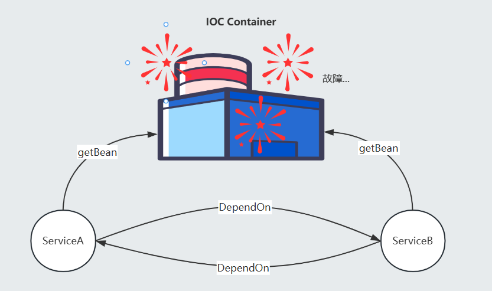
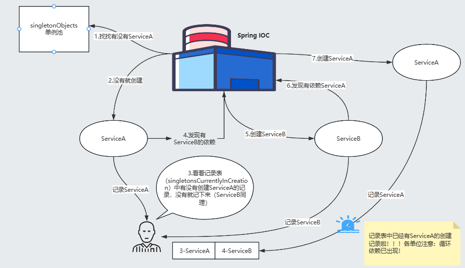
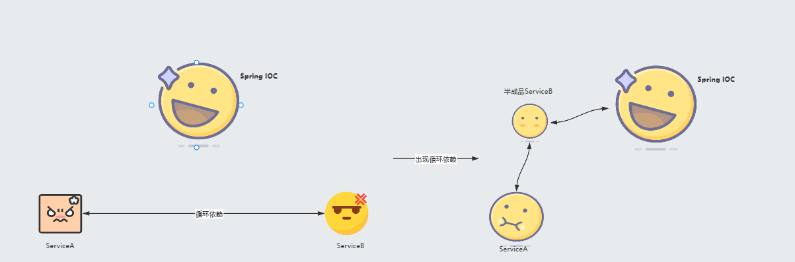

# Spring 的依赖循环

## 目录

- [出现Bean依赖循环的原因](#出现Bean依赖循环的原因)
- [出现依赖循环的依据](#出现依赖循环的依据)
  - [DefaultSingletonBeanRegistry#getSingleton(java.lang.String, org.springframework.beans.factory.ObjectFactory\<?>)](#DefaultSingletonBeanRegistrygetSingletonjavalangString-orgspringframeworkbeansfactoryObjectFactory)
  - [DefaultSingletonBeanRegistry#getSingleton(java.lang.String, boolean)](#DefaultSingletonBeanRegistrygetSingletonjavalangString-boolean)
- [如何解决？](#如何解决)
  - [singletonFactories中的ObjectFactory到底从何而来？](#singletonFactories中的ObjectFactory到底从何而来)
    - [AbstractAutowireCapableBeanFactory#doCreateBean](#AbstractAutowireCapableBeanFactorydoCreateBean)
    - [DefaultSingletonBeanRegistry#addSingletonFactory](#DefaultSingletonBeanRegistryaddSingletonFactory)
  - [earlySingletonObjects中到底装了什么葫芦？](#earlySingletonObjects中到底装了什么葫芦)
  - [循环Bean依赖注入完成后](#循环Bean依赖注入完成后)
  - [小结一下Spring依赖循环的目前的流程](#小结一下Spring依赖循环的目前的流程)

我们在成长过程，交朋友过程中难免会跟朋友有分歧，吵架的时候，如果一致争执不下，就是"你等我开口，我等你主动"的僵局，那我们就会失去这些朋友了\~但是如果我们能够退一步想想，跟自己说一声这事儿也没什么大不了，那将友谊长存，哈哈哈哈哈

其实Bean呢，也是这样的，上个篇章，我们提到了Bean的依赖注入，我们可以理解为这是Bean交朋友的过程，Bean通过查看自己的依赖去一个一个地找朋友，最终形成一个小集体，服务于Spring容器，但是Bean与Bean之间也会存在社交危机的喔\~

### 出现Bean依赖循环的原因

这种社交危机就出现在依赖循环的情况下，不妨我们浏览一下以下代码，ServiceA依赖了ServiceB，而ServiceB又依赖了ServiceA，ServiceA 找朋友等ServiceB来电话，而ServiceB找朋友又在等ServiceA打电话，无穷无尽，没完没了，最终导致ServiceA 失去了ServiceB这个朋友，而ServiceB失去了ServiceA这个朋友了\~，出现这种情况不仅ServiceA和ServiceB不开心，Spring容器都会因此而无法工作了，所以这个问题还是非常致命的。

```java 
//假设ServiceA依赖了ServiceB
@Component
class ServiceA{
  private ServiceB serviceB;
}

//假设ServiceB 又依赖了ServiceA
@Component
class ServiceB{
  private ServiceA serviceA;
}
```


结合我们之前篇章的了解，我们不难知道，这将会是以下的流程

1. 实例化ServiceA
2. 填充属性→填充ServiceB → 到单例池中尝试获取ServiceB → 没有的话就会创建ServiceB
3. 创建ServiceB
4. 实例化ServiceB
5. 填充属性→填充ServiceA→ 到单例池中尝试获取ServiceA→ 没有的话就会创建ServiceA



瞧！经过这么一个流程，就出现依赖循环了，这个循环就使得依赖注入的流程无法继续进行了！

Spring容器可不能容忍这种情况，所以情商高手Spring容器必须出来调解一下依赖循环Bean之间的关系，那Spring容器是用了什么高招使得Bean之间的矛盾得以化解呢？

### 出现依赖循环的依据

首先Spring是怎么感知Bean出现了依赖循环的呢？针对这个问题我们先来探索一下org.springframework.beans.factory.support.AbstractBeanFactory#doGetBean这个方法，这个方法正是我们在Bean的出生篇章里说到的创建Bean的流程中的核心方法。

关注getSingleton方法，我们当时有提到过，这个方法是通过beanName获取Bean实例，要是获取不到，则跑createBean方法，只是当时我们往createBean方法里去了，那么该篇章就来探讨探讨getSingleton方法做了些啥？

```java 
  protected <T> T doGetBean(
      String name, @Nullable Class<T> requiredType, @Nullable Object[] args, boolean typeCheckOnly)
      throws BeansException {
         ....       
        // 创建单例Bean实例
        if (mbd.isSingleton()) {
          sharedInstance = getSingleton(beanName, () -> {
            try {
              return createBean(beanName, mbd, args);
            }
            catch (BeansException ex) {
              destroySingleton(beanName);
              throw ex;
            }
          });
          bean = getObjectForBeanInstance(sharedInstance, name, beanName, mbd);
        }
        ....     
   }
```


##### DefaultSingletonBeanRegistry#getSingleton(java.lang.String, org.springframework.beans.factory.ObjectFactory\<?>)

观察下面的getSingleton方法实现，这个getSingleton方法跟doGetBean第一个的getSingleton方法可不一样，这个getSingleton方法我们需要传入beanName和对应的工厂方法，只是doGetBean通过匿名实现该工厂方法罢了。

```java 
private final Map<String, Object> singletonObjects = new ConcurrentHashMap<>(256);


public Object getSingleton(String beanName, ObjectFactory<?> singletonFactory) {
    Assert.notNull(beanName, "Bean name must not be null");
    synchronized (this.singletonObjects) {
      //尝试从singletonObjects 集合中查询该Bean，这是Spring容器的第一个缓存（一级缓存）
      //当然这里先做个认识，反正他很重要，他是装着完成整个实例化流程的Bean的，带入到本章来说
      //就是装着那些没有问题的Bean的
      Object singletonObject = this.singletonObjects.get(beanName);
      if (singletonObject == null) {
        if (this.singletonsCurrentlyInDestruction) {
          throw new BeanCreationNotAllowedException(beanName,
              "Singleton bean creation not allowed while singletons of this factory are in destruction " +
              "(Do not request a bean from a BeanFactory in a destroy method implementation!)");
        }
        if (logger.isDebugEnabled()) {
          logger.debug("Creating shared instance of singleton bean '" + beanName + "'");
        }
        //在bean创建前做点什么
        beforeSingletonCreation(beanName);
        boolean newSingleton = false;
        boolean recordSuppressedExceptions = (this.suppressedExceptions == null);
        if (recordSuppressedExceptions) {
          this.suppressedExceptions = new LinkedHashSet<>();
        }
        try {
          //调用传入的工厂方法的getObject()方法
          //其实就是调用createBean方法
          singletonObject = singletonFactory.getObject();
          newSingleton = true;
        }
        catch (IllegalStateException ex) {
           //在获取bean的时候发现一级缓存中已经存在该对象了
           //则继续使用这个对象
          singletonObject = this.singletonObjects.get(beanName);
          if (singletonObject == null) {
            throw ex;
          }
        }
        catch (BeanCreationException ex) {
          if (recordSuppressedExceptions) {
            for (Exception suppressedException : this.suppressedExceptions) {
              ex.addRelatedCause(suppressedException);
            }
          }
          throw ex;
        }
        finally {
          if (recordSuppressedExceptions) {
            this.suppressedExceptions = null;
          }
          //在bean创建后做点什么
          afterSingletonCreation(beanName);
        }
        if (newSingleton) {
          //如果是创建了单例Bean，则添加到缓存中，这个方法也不简单
          addSingleton(beanName, singletonObject);
        }
      }
      return singletonObject;
    }
  }
```


接下来我们就来简化一下getSingleton方法的执行步骤

1. this.singletonObjects.get(beanName);

   尝试从singletonObjects集合中获取Bean实例，这个不用说，基于缓存存储已经创建的Bean当然是提升效率，而且，这里面存储的可是单例Bean喔，全局唯一的，所以需要基于缓存来管理。
2. &#x20;beforeSingletonCreation(beanName);

   在单例Bean创建前执行的方法，在这个方法内可是做了一件很重要的事情\~，通过下面一段简短的代码可以看到在创建Bean之前会往singletonsCurrentlyInCreation 集合添加BeanName，而通过集合名称能大概也能猜到这是一个当前正在创建的Bean集合，专门用于记录当前正在创建的Bean的。
   ```java 
     private final Set<String> singletonsCurrentlyInCreation =
         Collections.newSetFromMap(new ConcurrentHashMap<>(16));
     
     protected void beforeSingletonCreation(String beanName) {
       //这里会将当前正在创建的Bean的BeanName添加到集合singletonsCurrentlyInCreation 中
       //如果集合不存在并且添加又不成功才会报错
       if (!this.inCreationCheckExclusions.contains(beanName) && !this.singletonsCurrentlyInCreation.add(beanName)) {
         throw new BeanCurrentlyInCreationException(beanName);
       }
     }
   ```

3. &#x20; singletonObject = singletonFactory.getObject();

   创建单例Bean，当然如果Bean在创建过程中发现Bean其实在缓存中存在，则抛出IllegalStateException 异常并直接使用这个从缓存中获取的Bean
4. afterSingletonCreation(beanName);

   在单例Bean创建后执行的方法，Bean创建完了以后自然就可以清理掉singletonsCurrentlyInCreation集合中记录下来的BeanName了
   ```java 
   protected void afterSingletonCreation(String beanName) {
       // 清理在beforeSingletonCreation阶段
       if (!this.inCreationCheckExclusions.contains(beanName) && !this.singletonsCurrentlyInCreation.remove(beanName)) {
         throw new IllegalStateException("Singleton '" + beanName + "' isn't currently in creation");
       }
     }
   ```


##### DefaultSingletonBeanRegistry#getSingleton(java.lang.String, boolean)

原来Spring在创建Bean之前会先将BeanName记录下来，记录下来有什么用呢？不妨我们继续回过头来看看doGetBean方法中的一个细节，这个细节就藏在doGetBean的getSingleton方法内，但是这getSingleton方法属于是另一个重载方法。

getSingleton当中如果if (singletonObject == null && isSingletonCurrentlyInCreation(beanName))条件判断结果为true，就说明目前出现循环依赖了，核心在isSingletonCurrentlyInCreation，这个方法就是为了看看这个Bean之前是不是在创建中，如果是创建中，说明是循环创建了，自然就说明是出现循环依赖了。



理解理解图，再看看代码加深理解，思路应该就很清晰了

```java 
  protected <T> T doGetBean(
      String name, @Nullable Class<T> requiredType, @Nullable Object[] args, boolean typeCheckOnly)
      throws BeansException {

    ....
    //标准化beanName
    String beanName = transformedBeanName(name);
    Object bean;

    // 根据beanName从单例池中获取对应实例
    Object sharedInstance = getSingleton(beanName);
  
    ...
  
 } 
   
  //singletonsCurrentlyInCreation中是否存在对应的beanName
  public boolean isSingletonCurrentlyInCreation(String beanName) {
    return this.singletonsCurrentlyInCreation.contains(beanName);
  }
 
 
  //根据beanName获取对应的Bean
  protected Object getSingleton(String beanName, boolean allowEarlyReference) {
    Object singletonObject = this.singletonObjects.get(beanName);
    if (singletonObject == null && isSingletonCurrentlyInCreation(beanName)) {
      //到这里，就判断出来出现循环依赖了
      //基于三级缓存获取对应的实例
      synchronized (this.singletonObjects) {
        singletonObject = this.earlySingletonObjects.get(beanName);
        if (singletonObject == null && allowEarlyReference) {
          ObjectFactory<?> singletonFactory = this.singletonFactories.get(beanName);
          if (singletonFactory != null) {
            singletonObject = singletonFactory.getObject();
            this.earlySingletonObjects.put(beanName, singletonObject);
            this.singletonFactories.remove(beanName);
          }
        }
      }
    }
    return singletonObject;
  }
```


原来Spring是通过Set\<String> singletonsCurrentlyInCreation 这么一个Set集合来记录下正在创建的Bean的，如果出现循环依赖，那么singletonsCurrentlyInCreation 必定会出现重复记录的情况！

### 如何解决？

既然出现了循环依赖，那么怎么解决呢？Spring这位情商大师是如何化解这样的社交危机的？马上我们就来看看getSingleton(java.lang.String, boolean)这个方法他是怎么处理后面的事情的\~

看以下会发现来了一个集合了，叫earlySingletonObjects ，他是一个HashMap集合来的，很显然Spring想从earlySingletonObjects 中根据BeanName拿个不知道是啥的东西给出现依赖循环的Bean，就好像两个小朋友吵架，然后我们要给颗糖哄哄他们一样😀。

不仅如此，再往下走，又出现了一个集合，叫singletonFactories，这个集合里面装着的是一个工厂方法，ObjectFactory我们在Bean的出生篇二有提过，是用于产生Bean的，显然，如果earlySingletonObjects 不存在我们想要的东东，则尝试从singletonFactories 获取这个东东的工厂类直接生成一个出来给到earlySingletonObjects ，这就好像如果此时兜里没糖了，就得去买一颗糖揣兜里一样。

这里体现的就是Spring三级缓存的处理，而且目前为止，我们大概能清楚，这三级缓存中存的类型是什么，虽然暂时不知道具体存的是什么，但是这对我们后面的推断很有帮助

一级缓存：singletonObjects ⇒ 存储单例Bean

二级缓存：earlySingletonObjects ⇒ 存储Object

三级缓存：singletonFactories ⇒ 存储二级缓存中Object的工厂类

了解了这些，接下来我们一步一步来，但是针对这段代码我们不能顺序地思考，而应该逆序地思考，因为最终会尝试从singletonFactories 缓存中获取Object放到earlySingletonObjects 中的，所以我们得想想singletonFactories 内的工厂类到底从何而来？

```java 
  
  private final Map<String, Object> earlySingletonObjects = new HashMap<>(16);
  
  private final Map<String, ObjectFactory<?>> singletonFactories = new HashMap<>(16);

  
  //根据beanName获取对应的Bean
  protected Object getSingleton(String beanName, boolean allowEarlyReference) {
    Object singletonObject = this.singletonObjects.get(beanName);
    if (singletonObject == null && isSingletonCurrentlyInCreation(beanName)) {
      //到这里，就判断出来出现循环依赖了
      //基于三级缓存获取对应的实例
      synchronized (this.singletonObjects) {
        //有一个集合出现！！！如果出现循环依赖，就尝试从earlySingletonObjects这个集合中取Bean
        singletonObject = this.earlySingletonObjects.get(beanName);
        if (singletonObject == null && allowEarlyReference) {
          //又有一个集合出现！！！！如果earlySingletonObjects中不存在这个Bean
          //则尝试从singletonFactories根据beanName获取ObjectFactory
          //ObjectFactory是一个Bean工厂类
          ObjectFactory<?> singletonFactory = this.singletonFactories.get(beanName);
          if (singletonFactory != null) {
            //通过调用获取到的工厂类进行Bean的构建
            singletonObject = singletonFactory.getObject();
            //将构建出来的Bean存储到earlySingletonObjects中
            this.earlySingletonObjects.put(beanName, singletonObject);
            this.singletonFactories.remove(beanName);
          }
        }
      }
    }
    return singletonObject;
  }
```


#### singletonFactories中的ObjectFactory到底从何而来？

##### AbstractAutowireCapableBeanFactory#doCreateBean

想清楚这个问题，我们就得继续追溯到doCreateBean这个方法了，我们在研究Bean出生篇二的时候，就有浏览过这段代码，其中有这么一段代码，我们当时暂时跳过了\~，这段代码便是处理singletonFactories中的ObjectFactory的地方了。

我们从this.allowCircularReferences && isSingletonCurrentlyInCreation(beanName)这段判断就很清楚了\~，所以从这个判断中我们还清楚了，只有单例Bean的依赖循环情况Spring才会受理。其实想想也正常，毕竟对于原型Bean的依赖循环直接创建注入就行了，因为原型Bean不需要保证全局唯一。

当出现了依赖循环后，就会执行addSingletonFactory方法，addSingletonFactory(String beanName, ObjectFactory\<?> singletonFactory)这个方法就需要我们传入beanName和对应的单例工厂类。

```java 
protected Object doCreateBean(String beanName, RootBeanDefinition mbd, @Nullable Object[] args)
      throws BeanCreationException {


    BeanWrapper instanceWrapper = null;
    if (mbd.isSingleton()) {
      instanceWrapper = this.factoryBeanInstanceCache.remove(beanName);
    }
    if (instanceWrapper == null) {
      //Bean出生篇二主要讲的就是这部分，这里会创建Bean实例并进行包装
      instanceWrapper = createBeanInstance(beanName, mbd, args);
    }
    ...
     
    // this.allowCircularReferences && isSingletonCurrentlyInCreation(beanName)
    // 这个判断是不是很熟悉，没错他就是判断是否出现了循环依赖了
    boolean earlySingletonExposure = (mbd.isSingleton() && this.allowCircularReferences &&
        isSingletonCurrentlyInCreation(beanName));
    if (earlySingletonExposure) {
      if (logger.isTraceEnabled()) {
        logger.trace("Eagerly caching bean '" + beanName +
            "' to allow for resolving potential circular references");
      }
      addSingletonFactory(beanName, () -> getEarlyBeanReference(beanName, mbd, bean));
    }

    ...

    return exposedObject;
  }
```


##### DefaultSingletonBeanRegistry#addSingletonFactory

这个方法我们得对比着看，这样更有助于理解。

- addSingletonFactory

  我们先来看看addSingletonFactory方法，这个方法正是对我们的三级缓存动手的地方，他将beanName和() -> getEarlyBeanReference(beanName, mbd, bean)这么一个匿名实现类传给了三级缓存进行存储。
- getEarlyBeanReference

  这个方法会比较难理解一点，这是一个ObjectFactory的匿名实现类，首先一开始该方法会将传入的bean赋值给了exposedObject ，这个bean可是很讲究的喔，不妨我们来看看doCreateBean，getEarlyBeanReference方法的传入时，这个参数bean在createBeanInstance后就马上传入到addSingletonFactory方法处进行处理了。说明了什么，这个参数bean就是一个刚刚完成实例化的bean，还没依赖注入呢！欸\~\~\~，有点眉目了吧，原来Spring情商大师的想法是：既然你们在依赖注入时出现问题，那我干脆不让你依赖注入时创建Bean啦，而是提前将一个没经过依赖注入的bean交给出现依赖循环的bean，这样循环依赖不就因为能够在依赖注入时拿到一个实例化的bean而消失了吗？棒棒哒，能够理解到这一层，Spring的循环依赖的解决思路就很清晰了！

  

  但是，我们直接返回一个半成品的bean不就行了吗？为什么getEarlyBeanReference做了这么多事情咧？看看getEarlyBeanReference其实是在执行我们配置的BeanPostProcessor ，其实仔细想想，Spring将一个半成品的ServiceB交给了ServiceA，需要注意些什么呢？我们都知道我们为了增强Bean的功能，都会通过给Bean增加BeanPostProcessor （即AOP）来增强Bean的功能的。虽然是给的是半成品Bean，但是总不能把我们配置的BeanPostProcessor 给忽略不做了吧？Spring考虑到了这点，所以会在getEarlyBeanReference方法内提前把我们配置的SmartInstantiationAwareBeanPostProcessor给跑了并给将结果返回来。所以Spring 此时返回的半成品Bean也有可能是一个代理Bean喔\~

```java 
  protected Object doCreateBean(String beanName, RootBeanDefinition mbd, @Nullable Object[] args)
      throws BeanCreationException {
      BeanWrapper instanceWrapper = null;
      if (mbd.isSingleton()) {
        instanceWrapper = this.factoryBeanInstanceCache.remove(beanName);
      }
      if (instanceWrapper == null) {
        //Bean出生篇二主要讲的就是这部分，这里会创建Bean实例并进行包装
        instanceWrapper = createBeanInstance(beanName, mbd, args);
      }
      ...
      addSingletonFactory(beanName, () -> getEarlyBeanReference(beanName, mbd, bean));
      ...
      //bean的依赖注入流程
  }

  protected Object getEarlyBeanReference(String beanName, RootBeanDefinition mbd, Object bean) {
    Object exposedObject = bean;
    if (!mbd.isSynthetic() && hasInstantiationAwareBeanPostProcessors()) {
      for (BeanPostProcessor bp : getBeanPostProcessors()) {
        //执行为bean配置了的BeanPostProcessor
        if (bp instanceof SmartInstantiationAwareBeanPostProcessor) {
          SmartInstantiationAwareBeanPostProcessor ibp = (SmartInstantiationAwareBeanPostProcessor) bp;
          //返回BeanPostProcessor返回的bean
          exposedObject = ibp.getEarlyBeanReference(exposedObject, beanName);
        }
      }
    }
    return exposedObject;
  }


protected void addSingletonFactory(String beanName, ObjectFactory<?> singletonFactory) {
    Assert.notNull(singletonFactory, "Singleton factory must not be null");
    synchronized (this.singletonObjects) {
      if (!this.singletonObjects.containsKey(beanName)) {
        this.singletonFactories.put(beanName, singletonFactory);
        this.earlySingletonObjects.remove(beanName);
        this.registeredSingletons.add(beanName);
      }
    }
  }
```


#### earlySingletonObjects中到底装了什么葫芦？

经过了一通分析，我们清楚了earlySingletonObjects里面就是存储着依赖循环的半成品Bean，如果这个Bean有配置了SmartInstantiationAwareBeanPostProcessor，那么就是经过了SmartInstantiationAwareBeanPostProcessor处理的结果，如果没有配置则就是刚刚完成实例化而没有经过依赖注入过程的bean（即一个半成品的Bean）。

而且再仔细思考思考，这个earlySingletonObjects集合的作用还远不如此，假设，ServiceB有一个依赖项ServiceC ，ServiceC也存在ServiceA依赖，那么一定还会经历一次这个流程，那么ServiceC的依赖注入就可以使用earlySingletonObjects集合保存的ServiceA进行注入了从而保证ServiceA的全局单例了。

#### 循环Bean依赖注入完成后

如此操作，依赖注入就能够找到Bean注入了，从而解决了循环依赖的问题，不过我们想想这个过程中，二级缓存中的Bean还是原来的Bean吗？为什么这么问？

想想当二级缓存的Bean进行提前AOP，那这个Bean还是原始Bean吗？不是了吧，应该是代理Bean了，不妨让我们来看看getEarlyBeanReference是如何操作的？

发现了吧，getEarlyBeanReference方法内其实有这么一段逻辑，如果该Bean提前进行了AOP，则将其交给了earlyProxyReferences集合作为标志，标志了该Bean已经做了AOP了。

```java 
@Override
  public Object getEarlyBeanReference(Object bean, String beanName) {
    Object cacheKey = getCacheKey(bean.getClass(), beanName);
    //往earlyProxyReferences中添加了对应的Bean，标志了该Bean已经提前进行了AOP了
    this.earlyProxyReferences.put(cacheKey, bean);
    //执行AOP操作
    return wrapIfNecessary(bean, beanName, cacheKey);
  }
```


接下来我们继续来翻阅翻阅这段代码，这是doCreateBean最后返回Bean的方法，其中有一段关于earlySingletonReference 的判断，为什么这么做呢？其实跟笔者上面提到的有关系，如果我们的Bean提前进行了AOP操作，那么我们应该要返回的是代理对象呀\~，还能是原始对象吗？所以看看Spring这段代码，会从二级缓存中取（因为此时Bean还没完成实例化呢，所以一级缓存是没有），完了取出来的对象会跟原对象比较，如果跟目前的bean是同一个引用，那就重新赋值Bean，所以不管该Bean有没有进行AOP，这里都能够赋给暴露的bean一个正确的值。

```java 
protected Object doCreateBean(String beanName, RootBeanDefinition mbd, @Nullable Object[] args)
      throws BeanCreationException {
    ...
    // Initialize the bean instance.
    Object exposedObject = bean;
    ...
    //如果出现了依赖循环
    if (earlySingletonExposure) {
          //从二级缓存中取出对应的bean
          Object earlySingletonReference = getSingleton(beanName, false);
          
          if (earlySingletonReference != null) {
            // 如果可能经过了AOP的bean和原始bean引用一致，则重新赋值暴露Bean
            if (exposedObject == bean) {
              exposedObject = earlySingletonReference;
            }
            else if (!this.allowRawInjectionDespiteWrapping && hasDependentBean(beanName)) {
              String[] dependentBeans = getDependentBeans(beanName);
              Set<String> actualDependentBeans = new LinkedHashSet<>(dependentBeans.length);
              for (String dependentBean : dependentBeans) {
                if (!removeSingletonIfCreatedForTypeCheckOnly(dependentBean)) {
                  actualDependentBeans.add(dependentBean);
                }
              }
              if (!actualDependentBeans.isEmpty()) {
                throw new BeanCurrentlyInCreationException(beanName,
                    "Bean with name '" + beanName + "' has been injected into other beans [" +
                    StringUtils.collectionToCommaDelimitedString(actualDependentBeans) +
                    "] in its raw version as part of a circular reference, but has eventually been " +
                    "wrapped. This means that said other beans do not use the final version of the " +
                    "bean. This is often the result of over-eager type matching - consider using " +
                    "'getBeanNamesForType' with the 'allowEagerInit' flag turned off, for example.");
              }
            }
          }
        }
    
        // Register bean as disposable.
        try {
          registerDisposableBeanIfNecessary(beanName, bean, mbd);
        }
        catch (BeanDefinitionValidationException ex) {
          throw new BeanCreationException(
              mbd.getResourceDescription(), beanName, "Invalid destruction signature", ex);
        }
    
        return exposedObject;
  }
```


#### 小结一下Spring依赖循环的目前的流程

好啦，到目前为止，其实Spring这位情商大师怎么处理好的Bean关系的，我们其实也很清楚了，使用的其实就是三级缓存，我们可以现在这里小结一下整个流程，并且再次理顺我们的思路。

那么我们可以先摆出这么一个依赖关系的情景

A → B →C →A , 显然这样就会出现依赖循环了 ，那么整个流程就可以是这样的

1. 创建A实例，记录到singletonsCurrentlyInCreation（表示A开始创建了)
2. 进行依赖注入B
3. 创建B实例，记录到singletonsCurrentlyInCreation（表示B开始创建了)
4. 进行依赖注入C
5. 创建C实例，记录到singletonsCurrentlyInCreation（表示C开始创建了)
6. 进行依赖注入A
7. 创建A实例，发现singletonsCurrentlyInCreation有A，出现依赖循环了
8. 将实例化后的A的工厂方法丢给三级缓存singletonFactories，这个工厂方法的目的是为了提前执行Bean A的实例化后置AOP操作
9. 进行依赖注入B
10. 创建B实例，发现singletonsCurrentlyInCreation有B，出现依赖循环了
11. 将实例化后的B的工厂方法丢给三级缓存singletonFactories
12. 进行依赖注入C
13. 将实例化后的C的工厂方法丢给三级缓存singletonFactories
14. 进行依赖注入A，此时会在三级缓存中找到A的工厂方法，执行A的工厂方法，将半成品A扔到二级缓存earlySingletonObjects中
15. 并注入半成品A
16. ...

以此类推，最后完成整个依赖循环的注入，并将Bean放置一级缓存，并清空二级缓存的内容。
