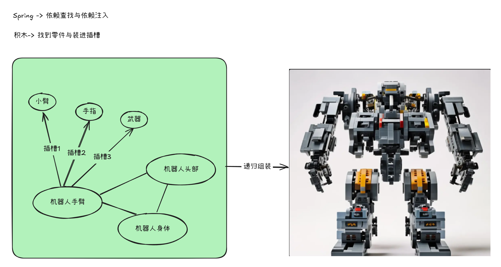

# IOC 容器篇

## 目录

- [Spring 核心本质 IOC](#Spring核心本质IOC)
  - [IOC 的应用](#IOC的应用)
  - [依赖注入](#依赖注入)
    - [Spring 对依赖注入的实现](#Spring对依赖注入的实现)
  - [Spring 依赖注入的载体 IOC 容器](#Spring-依赖注入的载体-IOC容器)
    - [org.springframework.beans.factory.BeanFactory](#orgspringframeworkbeansfactoryBeanFactory)
    - [org.springframework.context.ApplicationContext](#orgspringframeworkcontextApplicationContext)
  - [走进 Spring IOC 容器](#走进Spring-IOC容器)
    - [Bean 的身份证 BeanDefinition ](#Bean的身份证BeanDefinition-)
  - [IOC 容器的创建](#IOC容器的创建)
    - [从无到有](#从无到有)
      - [Bean 从何而来](#Bean从何而来)
      - [容器的初始化](#容器的初始化)
        - [org.springframework.context.support.ClassPathXmlApplicationContext 构造方法](#orgspringframeworkcontextsupportClassPathXmlApplicationContext构造方法)
        - [org.springframework.context.support.AbstractApplicationContext#refresh()](#orgspringframeworkcontextsupportAbstractApplicationContextrefresh)

Spring 提供了非常多的特性可供我们简化我们日常中的应用开发，Spring 提供的特性中其中最为核心的莫过于 IOC 容器

## Spring 核心本质 IOC

IOC（Inversion of Control）是一种设计思想，或者说是一种设计原则， 核心思想是将程序的控制权从代码本身转移到外部容器，由容器来管理对象的创建、属性赋值和依赖关系，从而降低组件之间的直接依赖 ‌。

### IOC 的应用

如何理解这些文绉绉的概念呢？上代码！

不妨看看以下代码，一段普通至极的代码，其实就是存在一个房子（Hourse）类 和一个沙发（Sofa）类，我想搭建一个房子，配上舒服的沙发，但是目前我实现的方式是亲力亲为，自己来 new 一个 Sofa。

```java
    @Data
    @AllArgsConstructor
    class Sofa{
        private String color;

        private Long size;
    }


    class Hourse {
        //辛苦一点，自己来做张沙发
        private Sofa sofa = new Sofa("red" , 10L);

        public Sofa handleSofa() {
            return sofa;
        }
    } 我要沙发
```

虽说这块代码跑起来没毛病，但是却存在一个问题，就是如果哪一天，我对 Sofa 不满意，想要换成木制家具，那可咋整，只能再亲历亲为自己干？代码如下，不难发现的是，我们因为要将沙发改成木制家具而改动了不少的地方。

```java
    @Data
    @AllArgsConstructor
    class  Wooden{
        private String color;

        private Long size;
    }


    class Hourse {
        private Wooden wooden = new Wooden("red" , 10L);

        public Wooden handleWooden() {
            return wooden;
        }
    } 我要改成木制家具
```

这就说明了一个问题，Sofa 和 Wooden 与 Hourse 形成了一个依赖，当我们改动需求的时候，会发现还需要动到底层的 Hourse，显然对我们的代码管理会产生不少的阻碍。

面对这样的代码，可以怎么进行处理呢？这么想，既然 Wooden 和 Sofa 与 Hourse 产生了依赖，那么能不能将 Wooden 和 Sofa 抽象出来呢？既然能够抽象那必定存在共性\~，不难想到的是，两者都是家具，所以我们可以抽象出一个家具抽象类。

```java
  class Sofa extends Furniture{

        public Sofa(String color, Long size) {
            super(color, size);
        }
    }

    class  Wooden extends Furniture{

        public Wooden(String color, Long size) {
            super(color, size);
        }
    }

    //家具抽象类
    @Data
    @AllArgsConstructor
    abstract class Furniture{
        private String color;

        private Long size;
    } 应用IOC
```

而 Hourse 只需要依赖 Furniture 即可

```java
    //使用IOC
    class Hourse {
       private Furniture furniture;

       public Hourse(Furniture furniture){
           this.furniture = furniture;
       }

       public void getFurniture(){
           System.out.println(furniture.color + furniture.size);
       }
    }
```

这么改造后，我们使用的时候会发现，我们需要什么家具，如果是 Sofa，就直接将 Sofa 传给 Hourse ，想要 Wooden，就直接将 Wooden 传给 Hourse 就行了。想要更多其他家具，只需要拓展 Furniture ，然后再传给 Hourse 就行了，完全不需要改底层的代码！这样就做到了将 Hourse 与 具体实现 Sofa 和 Wooden 解耦了！

```java
 public void test() {
        Hourse hourse1 = new Hourse(new Sofa("red" , 10L));

        Hourse hourse2 = new Hourse(new Wooden("yellow" , 10L));
    }
```

这段代码中，IOC 的原则就藏于其中，我们可以一一分析一下：

根据 IOC 的设计原则

1. 依赖抽象
   1. 依赖了 Sofa 和 Wooden 的抽象 Furniture
2. 将程序的控制权从代码本身转移到外部容器

   1. 我们将 Hourse 本身需要构建的 Furniture 交给到外界传入了，即代码：

      Hourse hourse1 = new Hourse(**new Sofa("red" , 10L)**);

目前我们仍是需要亲力亲为去 new Sofa 或者 new Wooden 到 Hourse 类中使用，但是 Spring 出来了之后，福音便到了，new Sofa 或者 new Wooden 不再需要我们亲力亲为了，而是交由了外部框架，即 Spring 来完成！当然这需要依靠 Java 提供的反射机制，帮助我们不需要显式地 new 对象。

而 Hourse hourse1 = new Hourse(**new Sofa("red" , 10L)**)这个流程就是 Spring IOC 容器的一大职责！也就是 DI ，依赖注入啦！

### 依赖注入

回过头来看看这段代码，依赖注入就是 new Sofa 或者 new Wooden 将 Sofa 或者 Wooden 通过 Hourse 的构造函数注入到了 Hourse 实例中，从而使得该 Hourse 具备了 Sofa 实例和 Wooden 实例，这是依赖注入的过程。

```java
 public void test() {
        Hourse hourse1 = new Hourse(new Sofa("red" , 10L));

        Hourse hourse2 = new Hourse(new Wooden("yellow" , 10L));
    }
```

所以，依赖注入的根本目的就是让 Hourse 的 Sofa 属性或者 Wooden 属性有值，学习过 Java 的我们应该都清楚，除了基于构造器可以另属性赋值，还可以通过 setter 方法另属性赋值，所以 setter 注入和构造器注入是 Spring 依赖注入的其中两种方式。

可以想想，我们都把 Hourse 交给 Spring 进行管理，当然希望 Spring 能够返回我们一个充实的，令我们满意的 Hourse 啦！通俗的说，当我们将对象交给 Spring 管理后，Spring 的任务就是要让我们使用这个对象时，尽量确保这个对象中的各个属性（即依赖）能够有值，这也是依赖注入的结果。

#### Spring 对依赖注入的实现

依赖注入的实现有很多方式，在 Spring 中，IOC 容器就是实现这种模式的载体，它可以在对象生成或初始化时直接将数据注入到对象中，也可以通过将对象引用注入到对象数据域的方式来注入对方法调用的依赖，当然这个过程是递归的，对象会被逐层注入。

编程源于生活，这个过程跟我们小时候搭积木很像，就以搭建一个积木机器人为例，首先我们会将所有的部件散落在一个区域（IOC 容器），然后找到最小部件，比如说机器人的手臂（最小依赖），然后我们会将这些部件（手臂，武器）拼到一起（依赖注入），然后合并到机器人的身体组成一个更为完整的个体（更上层的依赖注入），当然积木机器人经过这一轮轮的递归终于完成了（Bean）。



### Spring 依赖注入的载体 IOC 容器

通过以上的学习，我们清楚了 IOC 容器是 Spring 对 IOC 实现的核心，而作为一个能够风靡全球的 Java 框架，Spring 是如何巧妙的设计这个容器的呢？不用说，抽象思维必不可少！那么想要大体地了解 Spring IOC 容器，我们必须先清楚 Spring IOC 对容器的规范是怎么样的\~

想要了解这个规范，我们就要将目光聚焦到一个底层接口上了，那就是 Spring Context 中的**org.springframework.beans.factory.BeanFactory**接口

#### org.springframework.beans.factory.BeanFactory

> The `BeanFactory` API provides the underlying basis for Spring’s IoC functionality.

这个接口其实就是 Spring 对 IOC 容器的行为抽象，也就是说想在 Spring 中成为一个 IOC 容器，你至少得具备或者说实现该接口的定义的各个抽象方法。

```java
public interface BeanFactory {

    // 关于FactoryBean的命名前缀
    String FACTORY_BEAN_PREFIX = "&";

    //可以根据Bean的名称获取Bean实例
    Object getBean(String name) throws BeansException;

    //可以根据类型返回Provider
    <T> ObjectProvider<T> getBeanProvider(Class<T> requiredType);

    //Bean的作用域类型检查
    boolean isSingleton(String name) throws NoSuchBeanDefinitionException;


    boolean isPrototype(String name) throws NoSuchBeanDefinitionException;

    //获取Bean的别名
    String[] getAliases(String name);

    //。。。更多接口可以自行查看查看

} 基本容器的实现规范BeanFactory
```

通过接口的描述，可以发现，BeanFactory 提供了较为完整的 IOC 容器的服务支持，那么实现了 BeanFactory 的容器我们都可以说这是一个 IOC 容器，比如说

- org.springframework.context.support.GenericApplicationContext
- org.springframework.context.support.ClassPathXmlApplicationContext

当然他们都不是直接实现的 BeanFactory，BeanFactory 接口只是定义基础的功能规范，他是 Spring IOC 容器应该实现功能的最低标准，Spring 在这之上还拓展了不少接口来提供更加多的功能规范呢！

- org.springframework.beans.factory.ListableBeanFactory

  提供了获取容器中所有 Bean 的相关信息的能力。这个接口的主要目的是为了允许应用获取更多关于 Bean 工厂的信息，而不仅仅是按名称获取单个 Bean 实例

  ```java
  public interface ListableBeanFactory extends BeanFactory {

    //返回容器中涵盖的Bean定义的数量
    int getBeanDefinitionCount();

    //返回Bean定义的名称
    String[] getBeanDefinitionNames();

    //返回容器中所有指定类型的 Bean 的映射，其中键是 Bean 的名字，值是 Bean 实例
    <T> Map<String, T> getBeansOfType(@Nullable Class<T> type) throws BeansException;

    //允许更细粒度的控制，比如是否包括非单例 Bean，以及是否允许急切初始化
    <T> Map<String, T> getBeansOfType(@Nullable Class<T> type, boolean includeNonSingletons, boolean allowEagerInit)
        throws BeansException;

    // 返回容器中所有带有指定注解的 Bean 的映射
    Map<String, Object> getBeansWithAnnotation(Class<? extends Annotation> annotationType) throws BeansException;
  }
  ```

- org.springframework.beans.factory.HierarchicalBeanFactory

  它提供了对层次性（或嵌套）BeanFactory 的支持。这意味着你可以拥有一个父 BeanFactory 和多个子 BeanFactory，每个子 BeanFactory 都可以访问其父 BeanFactory 中定义的 Bean，同时也可以有自己的 Bean 定义

  ```java
  public interface HierarchicalBeanFactory extends BeanFactory {

      //返回当前 BeanFactory 的父 BeanFactory。如果没有父 BeanFactory，则返回 null
      BeanFactory getParentBeanFactory();


      //检查当前 BeanFactory 是否包含具有给定名称的 Bean 定义，不包括父 BeanFactory 中的 Bean
      boolean containsLocalBean(String name);

  }
  ```

#### org.springframework.context.ApplicationContext

> You should use an `ApplicationContext` unless you have a good reason for not doing so, with `GenericApplicationContext` and its subclass `AnnotationConfigApplicationContext` as the common implementations for custom bootstrapping.

BeanFactory 有这么多，我们到底要用哪个呢？Spring 给出了答案，那就是 ApplicationContext，这个 IOC 容器可是具备了 BeanFactory 的所有应该具备的功能的，从 ApplicationContext 的接口描述就能得知了。

其中 ListableBeanFactory ， HierarchicalBeanFactory 不正是对 BeanFactory 的功能拓展吗？而且 ， ApplicationContext 不仅仅具备了 IOC 容器应该具备的功能，还具有更多的高级功能，具体的可以查看以下 ApplicationContext 实现的各个接口的描述。

| Interface                      | Feature                                                                                                                                 |
| ------------------------------ | --------------------------------------------------------------------------------------------------------------------------------------- |
| EnvironmentCapable             | 提供了访问和应用环境的能力，这包括 profiles 和 properties。                                                                             |
| ListableBeanFactory            | 提供了枚举（列举）所有 bean 的能力，包括非单例和单例 bean。此外，这个接口允许对 bean 进行查询操作，例如按类型或注解查找 bean。          |
| HierarchicalBeanFactory        | 定义了容器的层次结构。这意味着一个 bean 工厂可以是另一个 bean 工厂的父工厂，子工厂可以访问父工厂中的 bean 定义和实例。                  |
| MessageSource                  | 用于国际化，支持消息的解析和格式化，允许开发者定义消息代码，并在运行时根据不同的地区解析这些消息。                                      |
| ApplicationEventPublisher      | 提供了发布应用事件的能力。通过这个接口，Spring 容器可以在运行时发布事件，任何注册为监听器的 bean 都可以接收到这些事件并进行相应的处理。 |
| ResourcePatternResolver\&#x20; | 用于解析资源模式（如 Ant 风格的路径模式）到 Resource 对象的列表。这通常用于加载类路径下的多个资源文件，例如配置文件或模板。             |

```java
public interface ApplicationContext extends EnvironmentCapable, ListableBeanFactory, HierarchicalBeanFactory,
    MessageSource, ApplicationEventPublisher, ResourcePatternResolver {

      String getId();

      String getApplicationName();

      String getDisplayName();

      long getStartupDate();

      ApplicationContext getParent();

      AutowireCapableBeanFactory getAutowireCapableBeanFactory() throws IllegalStateException;


}

```

对于 ApplicationContext 继承的这部分接口的详情，具体可以参考官网：

[https://docs.spring.io/spring-framework/reference/core/beans/context-introduction.html#context-functionality-messagesource](https://docs.spring.io/spring-framework/reference/core/beans/context-introduction.html#context-functionality-messagesource "https://docs.spring.io/spring-framework/reference/core/beans/context-introduction.html#context-functionality-messagesource")

### 走进 Spring IOC 容器

如果我们闯进 Spring IOC 容器这个大世界里，就会发现，原来 IOC 容器的世界也是非常丰富的，跟我们生活的地球村一样，有很多很多村民，这些村民有的常驻（单例），有的临时到访（原型），也有的只会在特定时间到访（其他作用域，如 Session，Request），有村民自然就有村长，Spring 作为 IOC 容器的大村长，推荐选拔 ApplicationContext 作为这些村民的村长，负责管理村民的生活起居（生命周期），村民们相互协助，互相依赖，共同为我们的服务提供最大的帮助。


#### Bean 的身份证 BeanDefinition&#x20;

这些村民有一个统称，叫 Spring Bean，他们跟我们一样都会带着身份证（BeanDefinition）来描述他们的身份信息，他们的身份证就是 BeanDefinition 类，BeanDefinition 描述着 Bean 的作用域（常驻村民，到访旅客等），Bean 的依赖关系（家族），是否懒加载等等信息。

```java
public interface BeanDefinition extends AttributeAccessor, BeanMetadataElement {


  String SCOPE_SINGLETON = ConfigurableBeanFactory.SCOPE_SINGLETON;


  String SCOPE_PROTOTYPE = ConfigurableBeanFactory.SCOPE_PROTOTYPE;


  int ROLE_APPLICATION = 0;


  int ROLE_SUPPORT = 1;


  int ROLE_INFRASTRUCTURE = 2;


  void setParentName(@Nullable String parentName);


  @Nullable
  String getParentName();


  void setBeanClassName(@Nullable String beanClassName);


  @Nullable
  String getBeanClassName();


  void setScope(@Nullable String scope);


  @Nullable
  String getScope();


  void setLazyInit(boolean lazyInit);


  boolean isLazyInit();


  void setDependsOn(@Nullable String... dependsOn);

  @Nullable
  String[] getDependsOn();


  void setAutowireCandidate(boolean autowireCandidate);


  boolean isAutowireCandidate();


  void setPrimary(boolean primary);


  boolean isPrimary();


  void setFactoryBeanName(@Nullable String factoryBeanName);


  @Nullable
  String getFactoryBeanName();


  void setFactoryMethodName(@Nullable String factoryMethodName);


  @Nullable
  String getFactoryMethodName();


  ConstructorArgumentValues getConstructorArgumentValues();


  default boolean hasConstructorArgumentValues() {
    return !getConstructorArgumentValues().isEmpty();
  }


  MutablePropertyValues getPropertyValues();


  default boolean hasPropertyValues() {
    return !getPropertyValues().isEmpty();
  }


  void setInitMethodName(@Nullable String initMethodName);


  @Nullable
  String getInitMethodName();


  void setDestroyMethodName(@Nullable String destroyMethodName);

  /**
   * Return the name of the destroy method.
   * @since 5.1
   */
  @Nullable
  String getDestroyMethodName();

  /**
   * Set the role hint for this {@code BeanDefinition}. The role hint
   * provides the frameworks as well as tools an indication of
   * the role and importance of a particular {@code BeanDefinition}.
   * @since 5.1
   * @see #ROLE_APPLICATION
   * @see #ROLE_SUPPORT
   * @see #ROLE_INFRASTRUCTURE
   */
  void setRole(int role);

  /**
   * Get the role hint for this {@code BeanDefinition}. The role hint
   * provides the frameworks as well as tools an indication of
   * the role and importance of a particular {@code BeanDefinition}.
   * @see #ROLE_APPLICATION
   * @see #ROLE_SUPPORT
   * @see #ROLE_INFRASTRUCTURE
   */
  int getRole();

  /**
   * Set a human-readable description of this bean definition.
   * @since 5.1
   */
  void setDescription(@Nullable String description);

  /**
   * Return a human-readable description of this bean definition.
   */
  @Nullable
  String getDescription();


  // Read-only attributes

  /**
   * Return a resolvable type for this bean definition,
   * based on the bean class or other specific metadata.
   * <p>This is typically fully resolved on a runtime-merged bean definition
   * but not necessarily on a configuration-time definition instance.
   * @return the resolvable type (potentially {@link ResolvableType#NONE})
   * @since 5.2
   * @see ConfigurableBeanFactory#getMergedBeanDefinition
   */
  ResolvableType getResolvableType();

  /**
   * Return whether this a <b>Singleton</b>, with a single, shared instance
   * returned on all calls.
   * @see #SCOPE_SINGLETON
   */
  boolean isSingleton();

  /**
   * Return whether this a <b>Prototype</b>, with an independent instance
   * returned for each call.
   * @since 3.0
   * @see #SCOPE_PROTOTYPE
   */
  boolean isPrototype();

  /**
   * Return whether this bean is "abstract", that is, not meant to be instantiated.
   */
  boolean isAbstract();

  /**
   * Return a description of the resource that this bean definition
   * came from (for the purpose of showing context in case of errors).
   */
  @Nullable
  String getResourceDescription();

  /**
   * Return the originating BeanDefinition, or {@code null} if none.
   * <p>Allows for retrieving the decorated bean definition, if any.
   * <p>Note that this method returns the immediate originator. Iterate through the
   * originator chain to find the original BeanDefinition as defined by the user.
   */
  @Nullable
  BeanDefinition getOriginatingBeanDefinition();

} BeanDefinition
```

可以发现 BeanDefinition 它不仅仅代表着 Bean 的身份证，而且他提供的 setter 方法还为我们提供了制造 Bean 的材料，比如说我们可以通过 setScope()设置作用域,setLazyInit()设置是否懒加载等配置来进行 Bean 的属性配置，当然这个在我们写 XML 配置 Bean 的时候尤为明显。

```xml
   <!-- 定义一个名为 user 的 Bean -->
    <bean id="user" class="com.example.model.User" lazy-init="true" scope="request">

    </bean>
```

### IOC 容器的创建

目前我们清楚了关于 IOC 容器和 Bean 的关系，并且得知了 Bean 在容器中是通过 BeanDefinition 来定制生产和标志身份信息的。

#### 从无到有

##### Bean 从何而来

毋庸置疑，Bean 是由 Spring 容器来创建和管理的，但是跟之前说的一样，Bean 虽然不由我们创建，但是 Bean 的各种属性（BeanDefinition）可是可以由我们说了算的。这好比我们让 Spring 做一套沙发，那我们告诉他沙发即可，让 Spring 做一套木制家具，同理，欸，目前为止，Spring IOC 容器的 IOC 特性已经是表现得淋漓尽致了。

```xml
<bean id="sofa" class="com.example.model.Sofa" lazy-init="true" scope="request">

</bean>


<bean id="wooden " class="com.example.model.Wooden " lazy-init="true" scope="request">

</bean>

```

当然除了用 XML 的定义方式，也可以通过注解的方式来定义 Bean，比如说@Configuration，@Bean 等等，但是不同的注解标注的 Bean 类型和特性都是不尽相同的喔，这个之后会有所介绍。

但是，当我们通过 XML 写下了一个个\<bean>之后，这块内容就成了一个个 Bean 了？非也非也，我们都说这些 Bean 是由 Spring 来创建的，所以意味着 Spring 必须先找到这些我们定义的 Bean 信息，才能根据这些信息创建对应的 Bean 的！

那么对于 Spring 来说，他需要上哪里找到这些我们定义的 Bean 信息的呢？这就需要我们告知 Spring 了，观察下面代码，从 ClassPathXmlApplicationContext 的接口关系来看可以看出 ClassPathXmlApplicationContext 是属于 ApplicationContext，而且从命名来看就能看出该 ClassPathXmlApplicationContext 容器是专门用于处理 XML 资源文件的一个高级容器。

我们要告知 ClassPathXmlApplicationContext 加载 bean-config.xml 这个我们定义好了 Bean 信息的 xml，当完成了&#x20;

ClassPathXmlApplicationContext context = new ClassPathXmlApplicationContext("bean-config.xml");

这段实例化代码以后，我们会发现 context 容器已经构建成功了，当我们调用该容器 getBean 方法时，根据我们配置的 bean id 就能够从容器中拿到对应的 Bean。

```java
    public static void main(String[] args) {
        //实例化ClassPathXmlApplicationContext 容器
        ClassPathXmlApplicationContext context = new ClassPathXmlApplicationContext("bean-config.xml");
        //根据 bean id 获取Bean
        User user = (User)context.getBean("user");
        System.out.println(user);
    }


    //xml
    <!-- 定义一个名为 user 的 Bean -->
    <bean id="user" class="com.example.model.User">
        <property name="name" value="T" />
        <property name="age" value="26" />
    </bean>
 基于ClassPathXmlApplicationContext 获取Bean
```

好啦，答案呼之欲出了，Xml 定义的 Bean 的出身之地就在 ClassPathXmlApplicationContext 中，那么接下来我们就从 ClassPathXmlApplicationContext 的方向来探讨 Bean 是如何从无到有的\~，但是在此之前，我们必须要先知道 IOC 容器是怎么创建出来的。

##### 容器的初始化

###### org.springframework.context.support.ClassPathXmlApplicationContext 构造方法

追踪 ClassPathXmlApplicationContext 构造方法会发现，最终 ClassPathXmlApplicationContext 会调用到以下构造方法，从这段调用方法来看 this(new String\[] {configLocation}, true, null);，显然我们只需将目光锁定到 refresh()方法即可了。

```java
public ClassPathXmlApplicationContext(String configLocation) throws BeansException {
    this(new String[] {configLocation}, true, null);
}


//ClassPathXmlApplicationContext 构造器
public ClassPathXmlApplicationContext(
      String[] configLocations, boolean refresh, @Nullable ApplicationContext parent)
      throws BeansException {

    super(parent); //parent 为 null
    setConfigLocations(configLocations); //将bean的xml配置存储起来
    if (refresh) {
      refresh(); //核心方法
    }
  }
```

###### org.springframework.context.support.AbstractApplicationContext#refresh()

refresh 方法是 ApplicationContext 容器启动的标志，也是我们需要关注的核心方法，而且该方法采用我们比较常用的模板模式进行的编写，其将 IOC 容器生命周期展现得一目了然，非常有助于我们辨认和分析。

```java
@Override
  public void refresh() throws BeansException, IllegalStateException {
    synchronized (this.startupShutdownMonitor) {
      // Prepare this context for refreshing.
      prepareRefresh();

      // Tell the subclass to refresh the internal bean factory.
      ConfigurableListableBeanFactory beanFactory = obtainFreshBeanFactory();

      // Prepare the bean factory for use in this context.
      prepareBeanFactory(beanFactory);

      try {
        // Allows post-processing of the bean factory in context subclasses.
        postProcessBeanFactory(beanFactory);

        // Invoke factory processors registered as beans in the context.
        invokeBeanFactoryPostProcessors(beanFactory);

        // Register bean processors that intercept bean creation.
        registerBeanPostProcessors(beanFactory);

        // Initialize message source for this context.
        initMessageSource();

        // Initialize event multicaster for this context.
        initApplicationEventMulticaster();

        // Initialize other special beans in specific context subclasses.
        onRefresh();

        // Check for listener beans and register them.
        registerListeners();

        // Instantiate all remaining (non-lazy-init) singletons.
        finishBeanFactoryInitialization(beanFactory);

        // Last step: publish corresponding event.
        finishRefresh();
      }

      catch (BeansException ex) {
        if (logger.isWarnEnabled()) {
          logger.warn("Exception encountered during context initialization - " +
              "cancelling refresh attempt: " + ex);
        }

        // Destroy already created singletons to avoid dangling resources.
        destroyBeans();

        // Reset 'active' flag.
        cancelRefresh(ex);

        // Propagate exception to caller.
        throw ex;
      }

      finally {
        // Reset common introspection caches in Spring's core, since we
        // might not ever need metadata for singleton beans anymore...
        resetCommonCaches();
      }
    }
  }
```

针对 refresh 方法，它包含了 IOC 容器启动到销毁的整个过程需要做的事情，不妨我们先来看看每个调用的方法都具体做了什么先吧

- org.springframework.context.support.AbstractApplicationContext#prepareRefresh()

  该方法主要是在容器启动前做的一些准备事项，比如记录容器开启时间，设置容器状态，配置初始化属性源，验证必要的属性，初始化早期的应用程序事件集合等

  ```java
  protected void prepareRefresh() {
      // Switch to active.
      this.startupDate = System.currentTimeMillis();
      this.closed.set(false);
      this.active.set(true);

      。。。

      // Initialize any placeholder property sources in the context environment.
      initPropertySources();

      // Validate that all properties marked as required are resolvable:
      // see ConfigurablePropertyResolver#setRequiredProperties
      getEnvironment().validateRequiredProperties();

      // Store pre-refresh ApplicationListeners...
      if (this.earlyApplicationListeners == null) {
        this.earlyApplicationListeners = new LinkedHashSet<>(this.applicationListeners);
      }
      else {
        // Reset local application listeners to pre-refresh state.
        this.applicationListeners.clear();
        this.applicationListeners.addAll(this.earlyApplicationListeners);
      }
      。。。
    }
  ```

- org.springframework.context.support.AbstractApplicationContext#obtainFreshBeanFactory()

  obtainFreshBeanFactory 就是为我们创建或者说重新创建一个 IOC 容器，并加载相关的 BeanDefinition，这里之后我们所创建的 xml 式的 Bean 就以 BeanDefinition 的形式被加载到容器内，随时准备成为 Bean 了。

  ```java
    protected final void refreshBeanFactory() throws BeansException {
        。。。
        //创建 Bean Factory
        DefaultListableBeanFactory beanFactory = createBeanFactory();
        beanFactory.setSerializationId(getId());
        //对BeanFactory的自定义设置，比如是否允许Bean覆盖，是否允许循环依赖
        customizeBeanFactory(beanFactory);
        //加载Bean Definition
        loadBeanDefinitions(beanFactory);
        this.beanFactory = beanFactory;
        。。。
    }
  ```

- org.springframework.context.support.AbstractApplicationContext#prepareBeanFactory()

  该方法主要是做了以下 4 件事情

  1. 为 BeanFactory 设置了类加载器和表达式解析器（SpelExpressionParser）

     ```java
         beanFactory.setBeanClassLoader(getClassLoader());
         beanFactory.setBeanExpressionResolver(new StandardBeanExpressionResolver(beanFactory.getBeanClassLoader()));
         beanFactory.addPropertyEditorRegistrar(new ResourceEditorRegistrar(this, getEnvironment()));
     ```

  2. 添加 ApplicationContextAwareProcessor 并忽略某些依赖接口，防止重复注入

     ```java
         beanFactory.addBeanPostProcessor(new ApplicationContextAwareProcessor(this));
         beanFactory.ignoreDependencyInterface(EnvironmentAware.class);
         beanFactory.ignoreDependencyInterface(EmbeddedValueResolverAware.class);
         beanFactory.ignoreDependencyInterface(ResourceLoaderAware.class);
         beanFactory.ignoreDependencyInterface(ApplicationEventPublisherAware.class);
         beanFactory.ignoreDependencyInterface(MessageSourceAware.class);
         beanFactory.ignoreDependencyInterface(ApplicationContextAware.class);
     ```

  3. 注册可能有需要的 Bean，使得我们在需要的时候随时可以全局使用

     ```java
         beanFactory.registerResolvableDependency(BeanFactory.class, beanFactory);
         beanFactory.registerResolvableDependency(ResourceLoader.class, this);
         beanFactory.registerResolvableDependency(ApplicationEventPublisher.class, this);
         beanFactory.registerResolvableDependency(ApplicationContext.class, this);

     ```

  4. 注册环境所需相关的 Bean
     ```java
         if (!beanFactory.containsLocalBean(ENVIRONMENT_BEAN_NAME)) {
           beanFactory.registerSingleton(ENVIRONMENT_BEAN_NAME, getEnvironment());
         }
         if (!beanFactory.containsLocalBean(SYSTEM_PROPERTIES_BEAN_NAME)) {
           beanFactory.registerSingleton(SYSTEM_PROPERTIES_BEAN_NAME, getEnvironment().getSystemProperties());
         }
         if (!beanFactory.containsLocalBean(SYSTEM_ENVIRONMENT_BEAN_NAME)) {
           beanFactory.registerSingleton(SYSTEM_ENVIRONMENT_BEAN_NAME, getEnvironment().getSystemEnvironment());
         }
     ```

- org.springframework.context.support.AbstractApplicationContext#postProcessBeanFactory()#invokeBeanFactoryPostProcessors()#registerBeanPostProcessors()

  当我们跟踪到该方法时，会发现该方法是一个空实现的方法，这是为了给我们留一个拓展点，让我们能够干预到容器的生命周期中【完成 IOC 容器初始化后的】的操作。

  ```java
  public class Main implements BeanFactoryPostProcessor {
      public static void main(String[] args) {
          ClassPathXmlApplicationContext context = new ClassPathXmlApplicationContext("bean-config.xml");
          context.addBeanFactoryPostProcessor(new Main());
          context.refresh();
          User user = (User)context.getBean("user");
          System.out.println(user);
      }

      @Override
      public void postProcessBeanFactory(ConfigurableListableBeanFactory beanFactory) throws BeansException {
          System.out.println("容器初始化完毕。。。。");
      }
  }
  ```

- org.springframework.context.support.AbstractApplicationContext#initMessageSource()

  该方法看名字便知道是用于初始化一些国际化资源相关的

  ```java
  protected void initMessageSource() {
      ConfigurableListableBeanFactory beanFactory = getBeanFactory();
      if (beanFactory.containsLocalBean(MESSAGE_SOURCE_BEAN_NAME)) {
        this.messageSource = beanFactory.getBean(MESSAGE_SOURCE_BEAN_NAME, MessageSource.class);
        // Make MessageSource aware of parent MessageSource.
        if (this.parent != null && this.messageSource instanceof HierarchicalMessageSource) {
          HierarchicalMessageSource hms = (HierarchicalMessageSource) this.messageSource;
          if (hms.getParentMessageSource() == null) {
            // Only set parent context as parent MessageSource if no parent MessageSource
            // registered already.
            hms.setParentMessageSource(getInternalParentMessageSource());
          }
        }
        if (logger.isTraceEnabled()) {
          logger.trace("Using MessageSource [" + this.messageSource + "]");
        }
      }
      else {
        // Use empty MessageSource to be able to accept getMessage calls.
        DelegatingMessageSource dms = new DelegatingMessageSource();
        dms.setParentMessageSource(getInternalParentMessageSource());
        this.messageSource = dms;
        beanFactory.registerSingleton(MESSAGE_SOURCE_BEAN_NAME, this.messageSource);
        if (logger.isTraceEnabled()) {
          logger.trace("No '" + MESSAGE_SOURCE_BEAN_NAME + "' bean, using [" + this.messageSource + "]");
        }
      }
    }
  ```

- org.springframework.context.support.AbstractApplicationContext#initApplicationEventMulticaster()

  该方法用于初始化事件分发器的

- org.springframework.context.support.AbstractApplicationContext#onRefresh()

  该方法是一个模板方法，允许子类在上下文刷新过程中添加特定的初始化逻辑。默认实现为空，即不做任何操作。该方法在特殊 Bean 初始化之前调用。

- org.springframework.context.support.AbstractApplicationContext#registerListeners()

  向 ApplicationEventMulticaster 注册一些跟事件监听相关的 Bean

- org.springframework.context.support.AbstractApplicationContext#finishBeanFactoryInitialization()

  到这里，IOC 容器算是完成实例化了，既然 IOC 容器准备好了，就可以开始生成 Bean 了，没错，这个阶段就是能够描述 Bean 的从无到有的过程，不过在这个阶段是针对非延迟（lazy-init）单例 Bean 的，具体的蕴含在 preInstantiateSingletons 方法内。

  ```java
  protected void finishBeanFactoryInitialization(ConfigurableListableBeanFactory beanFactory) {
      //注册上下文专用转换器
      if (beanFactory.containsBean(CONVERSION_SERVICE_BEAN_NAME) &&
          beanFactory.isTypeMatch(CONVERSION_SERVICE_BEAN_NAME, ConversionService.class)) {
        beanFactory.setConversionService(
            beanFactory.getBean(CONVERSION_SERVICE_BEAN_NAME, ConversionService.class));
      }

      // 注册占位符解析器
      if (!beanFactory.hasEmbeddedValueResolver()) {
        beanFactory.addEmbeddedValueResolver(strVal -> getEnvironment().resolvePlaceholders(strVal));
      }

      // 初始化LoadTimeWeaverAware类型Bean
      String[] weaverAwareNames = beanFactory.getBeanNamesForType(LoadTimeWeaverAware.class, false, false);
      for (String weaverAwareName : weaverAwareNames) {
        getBean(weaverAwareName);
      }

      //转用默认的类加载器
      beanFactory.setTempClassLoader(null);

      // 将配置进行冻结，即不允许在Bean实例化过程中进行配置的改动
      beanFactory.freezeConfiguration();

      // 实例化所有非延迟单例Bean
      beanFactory.preInstantiateSingletons();
    }
  ```

- org.springframework.context.support.AbstractApplicationContext#finishRefresh()

  到该步骤，IOC 容器的创建已经完成了，以下代码就是在完成 IOC 容器创建后的收尾动作，分别有

  1. 清理在之前创建 IOC 容器过程中的资源缓存
  2. 初始化生命周期处理器

     将 org.springframework.context.support.DefaultLifecycleProcessor 注册到容器中

  3. 触发处理器刷新逻辑

     调用 DefaultLifecycleProcessor 的 onRefresh 方法

  4. 发布上下文刷新事件
  5. 注册到 JMX 监控组件

  ```java
  protected void finishRefresh() {
      //清理在之前创建IOC容器过程中的资源缓存
      clearResourceCaches();

      //初始化生命周期处理器

      initLifecycleProcessor();

      //触发处理器刷新逻辑
      getLifecycleProcessor().onRefresh();

      //发布上下文刷新事件
      publishEvent(new ContextRefreshedEvent(this));

      //注册到JMX监控组件
      LiveBeansView.registerApplicationContext(this);
    }
  ```

好了，整个 refresh 流程的需要完成的各个事项都理清楚了以后，我们可以将其归纳为

1. 预备

   创建好 BeanFactory ，为 BeanFactory 的启动和丰富的功能准备好所需的 Bean，加载好我们定义的 BeanDefintion，设置好 BeanFactory 的各种状态

2. 注册

   向容器注册可能需要用到的几个核心组件

   1. MessageSource
   2. ApplicationEventMulticaster
   3. ApplicationListener

3. 完成

   生成非懒加载单例 Bean 并发布跟容器完成初始化相关的事件

4. 清理

   最后会对容器初始化过程产生的一些缓存数据进行清理

当然，为了能够提供更好的拓展性，Spring 还让我们能够通过某些接口或者抽象类来干预容器初始化的过程，比如说 BeanFactoryPostProcessor 。

IOC 容器经过了 AbstractApplicationContext#refresh()方法的折腾，就算是创建起来了，那么我们再回到 IOC（控制反转），此时帮助我们实现控制反转的就是我们通过 refresh 方法创建的 ConfigurableListableBeanFactory 容器，即在 refresh 中的 obtainFreshBeanFactory()生成的 beanFactory。

所以有了这么一个 IOC 容器，我们无需在关注 Hourse 创建 Sofa 或者 Wooden 的过程了，因为这个过程我们交给了 Spring 提供的 IOC 容器来做了。

我们只需要告诉 IOC 容器该怎么做就行，也就是说我们将其转为了配置，而不是内部的代码，配置是由我们定义的

```xml
    <bean name="Hourse" class="com.example.ioc.Hourse" >
        <!--    告知Spring IOC容器我们要配置的sofa    -->
        <constructor-arg name="furniture" ref="sofa" />
    </bean>

   <!--    告知Spring IOC容器我们要创建的是size为3  color为red的Sofa    -->
    <bean name="sofa" class="com.example.ioc.Sofa">
        <constructor-arg name="size" value="3" type="java.lang.Long"/>
        <constructor-arg name="color" value="red" />
    </bean>
```

经过了一番配置，接下来的时候就不由我们处理了，我们只需要管 IOC 容器要就行了，怎么要呢？通过 getBean 方法获取即可，就像下列代码。

```java
    public static void main(String[] args) {
        ClassPathXmlApplicationContext context = new ClassPathXmlApplicationContext("bean-config3.xml");
        Hourse hourse = context.getBean(Hourse.class);
        Sofa sofa = (Sofa) hourse.getFurniture();
        System.out.println(hourse);
        System.out.println("家具是" + sofa);
    }
```

这么做的好处很显然，如果我需要换成 Wooden，那么只需要加一个 bean 配置，然后修改 Hourse 的 ref 为 wooden 就行了

```xml
    <bean name="Hourse" class="com.example.ioc.Hourse" >
        <!--    告知Spring IOC容器我们要配置的wooden  -->
        <constructor-arg name="furniture" ref="wooden" />
    </bean>


    <bean name="wooden" class="com.example.ioc.Wooden">
        <constructor-arg name="size" value="10" type="java.lang.Long"/>
        <constructor-arg name="color" value="red" />
    </bean>
```

像这样我们将对 Bean 的创建和管理交给了 Spring IOC 容器的这个过程就是 IOC 控制反转了，好了，目前想必我们对 Spring 的核心机制（IOC 容器）有了较为清晰的认识，对接下来我们继续探索 Bean 的出生有了很大的帮助了。
