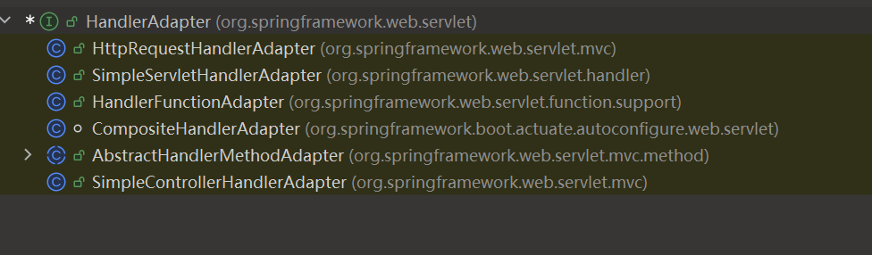
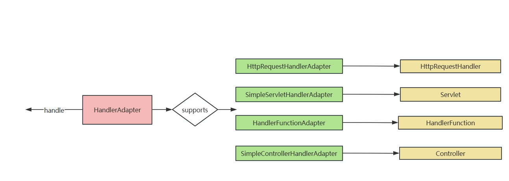

# 适配器模式

## 目录

- [适配器的实现方式](#适配器的实现方式)
- [Spring 中的适配器](#Spring-中的适配器)
  - [定义 Controller 的方式](#定义Controller的方式)
    - [RequestMapping 注解定义 Controller](#RequestMapping注解定义Controller)
    - [实现 Controller 接口](#实现Controller接口)
    - [实现 HttpRequestHandler 接口](#实现HttpRequestHandler接口)
    - [实现 Servlet 接口](#实现Servlet接口)
  - [Spring Mvc 适配多种 Controller 的实现方式](#Spring-Mvc适配多种Controller的实现方式)

> 兼容异类显神通，转换接口巧变通。 设计巧思融万物，结构转换显奇功。

适配器，适配器，生活中的 适配器可谓是数不胜数，比如说到处可见的充电宝，当我们使用充电宝的时候会发现他不仅支持 TypeC 接口，苹果接口以及安卓接口。那么可以对接多种接口的充电宝其实就是一个适配器，他可以帮助我们通过适配器去对接多种格式的物品。

### 适配器的实现方式

以一个简单的例子开始先帮助我们理解适配器模式

比如说一个最容易理解的例子：欧洲的电源插座与中国的不同。如果到国外旅游，为了能够使用我们国内的电子设备，我们就需要购买一个电源插座适配器，在代码的世界里，这件事情应该如何表达呢？

在国内，我们使用的是国内的电源插座，那我们就需要准备一个 IPowerSocket 表示国内的插座接口

```java
public interface IPowerSocket {
    void plugIn();
}
```

我们充电也是采用的这个接口

```java
public class PowerSocket implements IPowerSocket{
    @Override
    public void plugIn() {
        System.out.println("使用插座插孔充电");
    }

    public static void main(String[] args) {
        IPowerSocket powerSocket = new PowerSocket();
        powerSocket.plugIn();
    }
}

```

但是到了国外呢，我们先也准备一个国外的插座使用接口

```java
public interface IEuropeanSocket {
    void plugIn();

}

```

国外的插座接口实现

```java
public class EuropeanSocket implements IEuropeanSocket{
    @Override
    public void plugIn() {
        System.out.println("使用欧洲插座插孔充电");
    }
}
```

好了，如果我们在国外使用国内的接口进行插座使用，显然是会出错的

```java
    //不兼容的类型: com.example.adapter.PowerSocket无法转换为com.example.adapter.IEuropeanSocket
    public static void main(String[] args) {
        IEuropeanSocket europeanSocket = new PowerSocket();
        europeanSocket.plugIn();
    }
```

这时我们就需要一个我们准备好的适配器，我们这次是为了适配欧洲插座而使用的适配器，这个关系适配谁的这个关系我们需要理清楚。

我们既然是适配国内的接口，我们就要先实现国内接口，在国内接口中添加上欧洲的充电接口，在实现的时候直接使用欧洲接口的实现即可。

```java
public class SocketAdapterI implements IPowerSocket {
    private EuropeanSocket europeanSocket;

    public SocketAdapterI(EuropeanSocket europeanSocket) {
        this.europeanSocket = europeanSocket;
    }

    @Override
    public void plugIn() {
        europeanSocket.plugIn();
    }
}
```

这样在借助适配器的帮助下，我们也可以使用欧洲的插座啦

```java
    public static void main(String[] args) {
       IPowerSocket socket = new SocketAdapterI(new EuropeanSocket());
       socket.plugIn();
    }
```

### Spring 中的适配器

Spring 作为一个闻名世界的 IOC 框架，代码架构的设计是非常值得我们学习的，里面使用的设计模式也恰到好处，其中适配器模式在 Spring MVC 的适配 Controller 这个过程中是非常明显的，不妨来一起追踪一下吧

#### 定义 Controller 的方式

##### RequestMapping 注解定义 Controller

日常开发中，我们都会使用注解来标注 Controller，使得 Spring MVC 能够通过注解来找到对应的 Controller 并且能够通过 RequestMapping 来找到对应的方法执行。

```java
@Controller
public class AnnoController {

    @RequestMapping("api")
    public String index() {
        return "Go to Anno Controller";
    }

}
```

##### 实现 Controller 接口

当然，除了我们经常使用的注解式，我们还能实现 Controller 接口，但是该接口可不是注解的那个 Controller 接口喔，而是 org.springframework.web.servlet.mvc.Controller 接口。

```java
@Controller
public class ControllerImpl implements Controller {

    @Override
    public ModelAndView handleRequest(HttpServletRequest request, HttpServletResponse response) throws Exception {
        ModelAndView view = new ModelAndView();
        view.addObject("msg" , "Go to ControllerImpl");
        return view;
    }
}
```

##### 实现 HttpRequestHandler 接口

我们还可以通过实现 HttpRequestHandler 的 handleRequest 方法

```java
@Controller
public class HttpRequestHandlerImpl implements HttpRequestHandler {
    @Override
    public void handleRequest(HttpServletRequest request, HttpServletResponse response) throws ServletException, IOException {
        System.out.println("Go to HttpRequestHandlerImpl");
        response.getWriter().println("Go to HttpRequestHandlerImpl");
    }
}
```

##### 实现 Servlet 接口

我们还能实现原生 Servlet 接口，实现其 service 方法

```java
public class ServletImpl implements Servlet {
    @Override
    public void init(ServletConfig servletConfig) throws ServletException {

    }

    @Override
    public ServletConfig getServletConfig() {
        return null;
    }

    @Override
    public void service(ServletRequest servletRequest, ServletResponse servletResponse) throws ServletException, IOException {
        servletResponse.getWriter().println("Go to ServletImpl");
    }

    @Override
    public String getServletInfo() {
        return "";
    }

    @Override
    public void destroy() {

    }
}
```

#### Spring Mvc 适配多种 Controller 的实现方式

Spring 提供这么多种 Handler 处理请求，而且每一种 Handler 的实现接口都不一致，HttpRequestHandler 接口需要实现其 handleRequest，Servlet 接口需要实现其 service 方法，可以说不相关的三种实现，他又该如何统一呢？

我们先追踪到 Spring mvc 处理请求的入口函数 org.springframework.web.servlet.DispatcherServlet 中的 doService 方法，其中我们需要关注的是 doDispatch(request, response);

当我们进入该方法，可以将目光聚焦到以下的代码，这段代码的具体步骤是

1. 根据 request 从 controller 映射表中找到对应的 Controller
2. 获取其 HandlerAdapter 处理适配器
3. 执行适配器提供的 handle 方法

```java
@SuppressWarnings("deprecation")
  protected void doDispatch(HttpServletRequest request, HttpServletResponse response) throws Exception {
        。。。

        // 根据请求从映射表中找到对应的Controller
        mappedHandler = getHandler(processedRequest);
        if (mappedHandler == null) {
          noHandlerFound(processedRequest, response);
          return;
        }

        // 获取该Handler的适配器
        HandlerAdapter ha = getHandlerAdapter(mappedHandler.getHandler());
        String method = request.getMethod();
        boolean isGet = HttpMethod.GET.matches(method);
        。。。
        mv = ha.handle(processedRequest, response, mappedHandler.getHandler());
        。。。
      }
  }
```

那么 getHandlerAdapter 是如何进行的呢？首先会通过 supprots 方法来判断 HandlerAdapter 是不是对应的实现，如果返回 true，说明是对应的 Handler 请求实现了。

```java
  protected HandlerAdapter getHandlerAdapter(Object handler) throws ServletException {
    if (this.handlerAdapters != null) {
      for (HandlerAdapter adapter : this.handlerAdapters) {
        if (adapter.supports(handler)) {
          return adapter;
        }
      }
    }
    throw new ServletException("No adapter for handler [" + handler +
        "]: The DispatcherServlet configuration needs to include a HandlerAdapter that supports this handler");
  }
```

我们查看其实现，会发现该实现有着非常多的适配器



比如 HttpRequestHandlerAdapter，其中 supports 会先判断是否属于 HttpRequestHandler 的实现，如果是，则返回 true，getHandlerAdapter 就会返回该 Handler 了，然后就会调用 handle 方法

&#x20;mv = ha.handle(processedRequest, response, mappedHandler.getHandler());

即调用 HttpRequestHandlerAdapter 的 handle 方法，最终会调用 HttpRequestHandler 的 handleRequest 方法，对比我们实现的 HttpRequestHandler 接口，是不是就对上了呢？

```java
public class HttpRequestHandlerAdapter implements HandlerAdapter {

  @Override
  public boolean supports(Object handler) {
    return (handler instanceof HttpRequestHandler);
  }

  @Override
  @Nullable
  public ModelAndView handle(HttpServletRequest request, HttpServletResponse response, Object handler)
      throws Exception {

    ((HttpRequestHandler) handler).handleRequest(request, response);
    return null;
  }

  @Override
  @SuppressWarnings("deprecation")
  public long getLastModified(HttpServletRequest request, Object handler) {
    if (handler instanceof LastModified lastModified) {
      return lastModified.getLastModified(request);
    }
    return -1L;
  }

}

```

那么整合起来我们可以理解成这个样子，我们会为每一种类的请求处理器做一个 Adapter，然后通过一个总的 HandlerAdapter 连起来，对外暴露 handle 方法做适配，想想这不就跟我们的充电宝如出一辙吗？



通过观察 Spring 对适配器模式的使用，相信我们对适配器模式一定有了不少的了解，在我们的日常开发中，该模式可以令我们将多种类但是同功能的接口提供统一的调用接口，这样对我们的拓展是提供了不少帮助喔！
