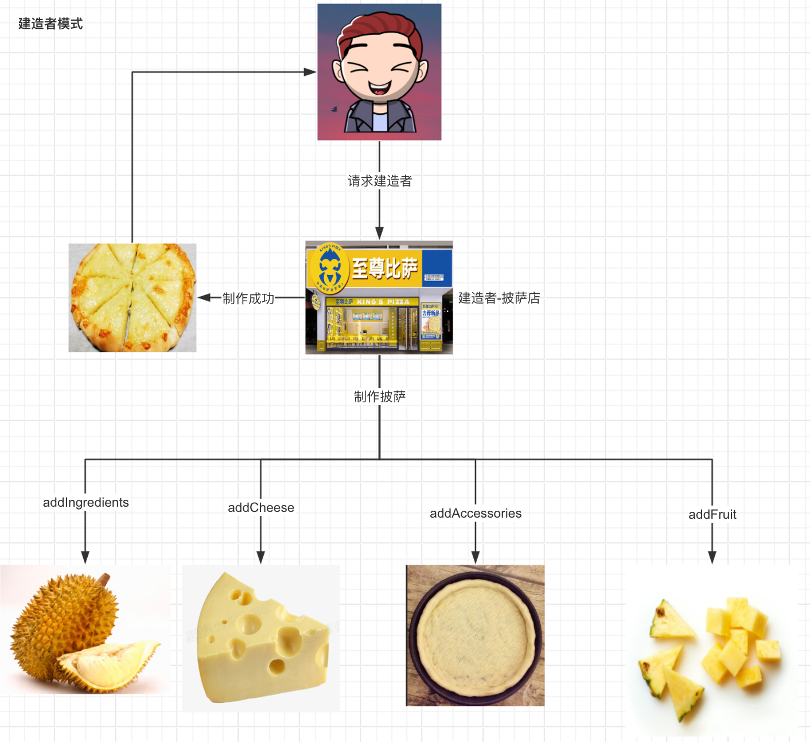
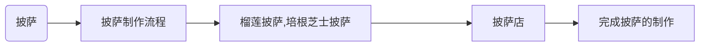

# 建造者模式

## 目录

- [现实世界](#现实世界)
- [代码示例](#代码示例)
  - [披萨类](#披萨类)
  - [制作披萨的流程](#制作披萨的流程)
  - [榴莲披萨的实现](#榴莲披萨的实现)
  - [披萨店](#披萨店)
  - [测试](#测试)
- [建造者模式的优缺点](#建造者模式的优缺点)
  - [优点](#优点)
  - [缺点](#缺点)
- [使用场景](#使用场景)

## 现实世界

> 📌披萨香满巷， 饼底金黄脆。 奶酪融化长， 蔬菜色彩旺。

路过繁华街道，闹事的一切我熟视无睹，唯独那家亮着泛黄灯光的至尊披萨，让我垂涎三尺，我加快脚步，横穿马路，进入店铺，我说老板给我来一份榴莲菠萝披萨套餐，榴莲菠萝披萨当中有榴莲，菠萝，芝士，面饼，那叫一个美滋滋，一闷一个不出声。



披萨的材料是复杂的，有主料，饼底，芝士，水果构成，而这就像我们到披萨店吃披萨一样，披萨店就是建造者，他是复杂模型披萨的建造者，我们想要披萨，披萨店帮我们做披萨，诶，这层关系就出来啦。而假榴莲，加芝士，摊饼底，加菠萝，这就是一份秘方，店员根据这个秘方做就成啦，为什么需要这份秘方呢？好处在于如果突然有一天发现加草莓口感会更好，那这时候可以直接通过改加水果的方法就可以又拓展出一个新秘方喽。

披萨店帮我们根据一定流程制作披萨，这就是典型的建造者模式。

回到编程世界，我们为什么需要使用到建造者模式呢？参考现实世界，不难想到，我们伸伸手，跟服务员说一下要个披萨就得到披萨了，而建造者模式，一样，我们伸伸手让建造者build一下对象，我们就能得到对象了，而不需要自己动手去创建对象。而如果我们想要吃点别的披萨，只需跟服务员说一下，要一个培根芝士披萨，那服务员仍然是按照制作流程制作，只是把榴莲换成了培根，然后进行烘培就OK啦～这就是拓展了，而且拓展非常方便，只需要修改对应子流程即可。

所以建造者模式的优势就很显然了！

## 代码示例

我们可以分析一下代码的逻辑结构：首先我们需要确认建造者是谁？显然就是披萨店，然后披萨店要帮我们做一份披萨，披萨的四要素：1. 饼底 2. 主料 3. 辅料 4. 芝士，这个其实就是披萨的抽象秘方了，也就是说披萨店做一份披萨离不开要准备好这4个材料然后进行烘培

通过这层关系我们可以有以下关系图



根据这个关系图，我们不难分析出来，想要完成这一流程，我们需要有4要素，也是建造者模式的4个角色

1. 披萨类 → 产品类
2. 对披萨流程的抽象 → 抽象建造着类
3. 具体披萨的实现 → 具体建造者类
4. 披萨店 → 指挥者类

好了，认识到这里，思路就清晰了，动起手来

#### 披萨类

```java
/** 
* @Description: 披萨实体
* @Param: 
* @return: 
* @Author: T
* @Date: 5/10/2024
*/

public class Pizza {

    private String ingredients;

    private String accessories;

    private String fruit;

    private String cheese;

    public String getIngredients() {
        return ingredients;
    }

    public void setIngredients(String ingredients) {
        this.ingredients = ingredients;
    }

    public String getAccessories() {
        return accessories;
    }

    public void setAccessories(String accessories) {
        this.accessories = accessories;
    }

    public String getFruit() {
        return fruit;
    }

    public void setFruit(String fruit) {
        this.fruit = fruit;
    }

    public String getCheese() {
        return cheese;
    }

    public void setCheese(String cheese) {
        this.cheese = cheese;
    }
}

```

### 制作披萨的流程

```java
/**
 * @Description 披萨的秘方
 * @Author T
 * @Date 2024/5/12 16:08
 **/
public abstract class PizzaRecipe {


    protected  Pizza pizza = new Pizza();

    /**
     * @Description 添加主料
     * @Author T
     * @Date 2024/5/12 16:10
     **/
    public abstract void addIngredients();


    /**
     * @Descriptio 添加辅料
     * @Author T
     * @Date 2024/5/12 16:10
     **/
    public abstract void addAccessories();

    /**
     * @Descriptio 添加水果
     * @Author T
     * @Date 2024/5/12 16:10
     **/
    public abstract void addFruit();

    /**
     * @Descriptio 添加芝士
     * @Author T
     * @Date 2024/5/12 16:10
     **/
    public abstract void addCheese();


    /**
     * @Description 制作披萨
     * @Author T
     * @Date 2024/5/12 16:16
     **/
    public abstract Pizza buildPizza();

}

```

### 榴莲披萨的实现

```java
/**
 * @Description 榴莲披萨
 * @Author T
 * @Date 2024/5/12 16:14
 **/
public class DurianPizza extends PizzaRecipe{
    @Override
    public void addIngredients() {
        pizza.setIngredients("榴莲");
    }

    @Override
    public void addAccessories() {
        pizza.setAccessories("不放");
    }

    @Override
    public void addFruit() {
        pizza.setFruit("菠萝");
    }

    @Override
    public void addCheese() {
        pizza.setCheese("添加芝士");
    }

    @Override
    public Pizza buildPizza() {
        return pizza;
    }
}
```

### 披萨店

披萨店就很简单了，就是拿到对应的流程，照着了流程来做披萨就行了

```java
/**
 * @Description 披萨店
 * @Author T
 * @Date 2024/5/12 16:37
 **/
public class Pizzeria {

      private PizzaRecipe recipe;

      public Pizzeria(PizzaRecipe recipe)
      {
          this.recipe = recipe;
      }


      public Pizza orderPizza()
      {
          recipe.addIngredients();
          recipe.addCheese();
          recipe.addAccessories();
          recipe.addFruit();
          return recipe.buildPizza();
      }

}


```

### 测试

接下来，就是测试类，其实就是我到披萨店，让披萨店给我上一份榴莲披萨的过程

```java
    public static void main(String[] args) {
        // 跟披萨店说 来一份榴莲披萨
        Pizzeria pizzeria = new Pizzeria(new DurianPizza());
        // 披萨店制作榴莲披萨
        Pizza pizza = pizzeria.makePizza();
        // 得到一份披萨
        System.out.println(pizza.getIngredients());
        System.out.println(pizza.getFruit());
        System.out.println(pizza.getAccessories());
    }

```

结果

```java
榴莲
菠萝
不放

```

如此，建造者模式就OK了

## 建造者模式的优缺点

### 优点

1. 将产品本身和产品的创建过程进行了解藕，刚刚使用的过程中也能够感受到，对于我们使用而言，我们只需告诉披萨店，我们需要什么就行了，后面的只需执行makePizza方法就能得到披萨了。
2. 很容易进行拓展，想想，如果我们想要再有一个别的披萨，是不是只需要创建一个新的类继承PizzaRecipe就行了呢？
3. 对于复杂对象来说，也许他的构建过程是复杂的，但是我们一经过建造者模式来优化之后，很明显的是，代码的结构特征明显多了，如果哪里出现错误，我们的定位也是相当快的。

### 缺点

虽然拓展很简单，比如我要一个培根披萨，那我只需要创建一个培根披萨类继承PizzaRecipe就行，但是培根披萨和榴莲披萨结构其实是相似的，流程也相似，这样代码会冗余，而且代码结构也复杂了。

## 使用场景

建造者模式的使用场景还是非常丰富的

比如说对对象的链式赋值，比如说以下代码为我们在Web开发时经常使用的统一返回结果

```java
@ToString
public class R {

    private HashMap<String,Object> data;

    private String code;

    private String msg;

    private R(HashMap<String,Object> data, String code, String msg)
    {
        this.data = data;
        this.code = code;
        this.msg = msg;
    }

    public R() {

    }

    private R(Builder builder)
    {
        data = builder.datas;
        code = builder.code;
        msg = builder.msg;
    }


    public static final class Builder {

        private HashMap<String,Object> datas  = new HashMap<>();;

        private String code;

        private String msg;

        public Builder data(String name,Object data){
            datas.put(name,data);
            return this;
        }

        public Builder code(String code){
            this.code = code;
            return this;
        }

        public Builder msg(String msg){
            this.msg = msg;
            return this;
        }

        public R build()
        {
            return new R(this);
        }

    }
}

```

那我们在构建的时候看起来就比较优雅了

```java
    public static void main(String[] args) {
        R r = new R.Builder()
                .data("name","zhangsan")
                .data("age","18")
                .code("200")
                .msg("success")
                .build();
        System.out.println(r);
    }
```

结果

```java
R(data={name=zhangsan, age=18}, code=200, msg=success)
```

Lombok中的Builder 也正是将这个原理的。

这种方式对于一些需要构建一些复杂对象是很友好的， 比如说有时候我们需要传入很多很多的构造参数，这样既不好看，而且也很不清晰，比如说下面的这个对象

```java
@AllArgsConstructor
public class Phone {

    private String cpu;

    private String ram;

    private String screen;

    private String camera;

    private String battery;

    private String color;

}

```

这么多参数，我们构建的时候就需要这样来创建对象，首先对于代码阅读来说就存在一定困难，而且也容易出错

```java
Phone phone = new Phone("1","2","3","4","5","6");
```
