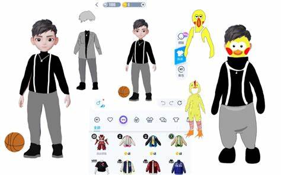

# 装饰者模式

## 目录

- [模拟QQ秀](#模拟QQ秀)
- [场景案例](#场景案例)
  - [单点登陆下的装饰者模式](#单点登陆下的装饰者模式)
- [源码中的装饰者模式](#源码中的装饰者模式)
  - [Java中的装饰者模式](#Java中的装饰者模式)
  - [Spring中的装饰者模式](#Spring中的装饰者模式)

QQ秀想必大家都玩过，以前为了QQ聊天框那闪亮人物，可谓是煞费心思了，像这种我们不会改变人物，而是通过衣服服装的方式进行打扮，像这样的方式我们就可以称其为装饰者模式了。装饰者模式其实可以理解为对原对象的外部增强，因为我们不需要修改原对象嘛\~



### 模拟QQ秀

其实装饰者模式理解和用起来都是非常容易的，我们只需要记住一点，装饰，即原对象不要变动，我们只需将原对象给到装饰者就行啦，剩下的交给装饰者来处理\~

装饰者的核心逻辑是什么呢？首先我们需要有一个原始对象，既然原始对象不动，那我们就要有一个或者多个装饰者给原始对象包装，既然原始对象有一个或者多个，那是不是可以进行一个抽象呢？

没错，那么大体的逻辑就出来了\~

首先是原始对象，这可是我们的主角，为了可拓展性，我们将show抽取成一个接口，表示凡是QQ秀都需要具备QQCharacter 接口的行为

```java 
/**
* @Description:  QQ秀的规范接口
* @Param:
* @return:
* @Date: 4/2/2025
*/
public interface QQCharacter {

    //展示接口
    void show();

}


@Data
@Slf4j
public class Kun implements QQCharacter{

    String name ;

    String age ;


    public Kun(String name , String  age ){
        this.name = name ;
        this.age  = age;
    }


    @Override
    public void show() {
        log.info("my name is :{} , my age is:{} , jump and basketball yeh",name,age);
    }
}


```


好了主角有了，接下来就是装饰者了，同样为了提高可拓展性，我们也将装饰者进行抽象

```java 
/**
* @Description: 服装的抽象类，为QQ秀套上的服装
* @Param:
* @return:
* @Date: 4/2/2025
*/
public abstract class ClothingDecorator implements QQCharacter{

    private QQCharacter qqCharacter;

    public ClothingDecorator(QQCharacter qqCharacter){
        this.qqCharacter = qqCharacter;
    }

    @Override
    public void show() {
        qqCharacter.show();
    }

}

/**
* @Description: 发型装饰者
* @Param:
* @return:
*/
@Slf4j
public class HairstyleDecorator extends ClothingDecorator{


    public HairstyleDecorator(QQCharacter qqCharacter) {
        super(qqCharacter);
    }

    @Override
    public void show() {
        super.show() ;
        log.info("配上中分发型，酷");
    }
}


/**
* @Description: 舞蹈装饰者
* @Param:
* @return:
* @Date: 4/2/2025
*/
@Slf4j
public class DanceDecorator extends ClothingDecorator{

    public DanceDecorator(QQCharacter qqCharacter) {
        super(qqCharacter);
    }


    @Override
    public void show() {
        super.show();
        log.info("↑ ← → ← → ← → ↓ ↑ ， 鸡鸡鸡");
    }
}


```


好了，万事俱备，主角，装饰者都OK 啦，接下来就可以测试了，看以下代码是不是跟套娃很像，我们就是一个一个装饰者的套，就可以完成对原对象的增强了

```java 
   public static void main(String[] args) {
        //首先要有一个装饰对象吧，这个装饰对象无需进行变动
        Kun kun = new Kun("kun","2.5");
        //我们需要一个装饰者来对其装饰，首先是发型装饰者
        ClothingDecorator hairDecorator = new HairstyleDecorator(kun);
        //完成装饰
        hairDecorator.show();
    }
    
    
    //执行结果
    12:13:23.154 [main] INFO com.example.decorator.basic.Kun -- my name is :kun , my age is:2.5 , jump and basketball yeh
    12:13:23.159 [main] INFO com.example.decorator.basic.HairstyleDecorator -- 配上中分发型，酷
```


假设我们再加上舞蹈装饰者，可以这么操作

```java 

    public static void main(String[] args) {
        //首先要有一个装饰对象吧，这个装饰对象无需进行变动
        Kun kun = new Kun("kun","2.5");
        //我们需要一个装饰者来对其装饰，首先是发型装饰者
        ClothingDecorator hairDecorator = new HairstyleDecorator(kun);
        //再来一个装饰者，这次是舞蹈装饰者
        ClothingDecorator danceDecorator = new DanceDecorator(hairDecorator);
        //完成装饰
        danceDecorator.show();

    }
    
    
    //执行结果
    12:13:23.160 [main] INFO com.example.decorator.basic.Kun -- my name is :kun , my age is:2.5 , jump and basketball yeh
    12:13:23.160 [main] INFO com.example.decorator.basic.HairstyleDecorator -- 配上中分发型，酷
    12:13:23.160 [main] INFO com.example.decorator.basic.DanceDecorator -- ↑ ← → ← → ← → ↓ ↑ ， 鸡鸡鸡
```


好了，到目前为止，装饰者模式就算是完成了，当我们把角色进行拆分后，理解起来不难吧\~，所以装饰者模式目的在于帮我们去不修改原对象，从而增强某些类的功能，减少代码的侵入性，而且因为不动原对象，使得代码健壮性得以增强，还有一点就是我们增强的功能都通过不同装饰者的方式解耦开来了。

所以装饰者模式在日常开发上是很管用的，特别是对代码重构或增强的时候\~

### 场景案例

好啦，装饰者模式我们算是有了初步了解，接下来我们就进入一个场景来看看日常开发中，装饰者模式可以怎么运用起来

#### 单点登陆下的装饰者模式

单点登录是现在非常多系统都具备的功能，旨在单处登录，处处生成，通过这样的方式提高我们用户的体验度，好比如我们登录了天猫，淘宝就相当于登录，逛淘宝的时候就不再需要登录了\~

单点登录，实质上就是主登录系统在帮我们完成了登录校验后，并把有关身份信息的token交到HTTP Header中，然后我们的系统只需要从中能够取出身份信息并通过校验，就能顺利以该身份信息进行系统访问了。

所以这么来说单点登录属于是拦截器的一种增强，我们完全可以依靠装饰者模式来对其进行一个增强，那么接下来我们就来看看如何对拦截器进行增强的。

首先我们先模拟一下Spring的拦截器接口

```java 
/**
* @Description: 模拟Spring拦截器接口
* @Param:
* @return:
* @Date: 4/2/2025
*/
public interface HandlerInterceptor {

    void preHandle(String request , String response , Object handler);

}

```


然后像我们日常开发那样直接使用

```java 
public class DefaultLoginDecorator implements HandlerInterceptor{
    @Override
    public void preHandle(String request, String response, Object handler) {
        //默认的一些校验逻辑
        if (StrUtil.isEmpty(request)){
            throw new RuntimeException("请求参数为空");
        }
    }
}
```


好了，接下来我们要对此进行增强，那么就需要抽象出来一个装饰者

```java 
/**
* @Description: 装饰者抽象类
* @Param:
* @return:
* @Date: 4/2/2025
*/
public abstract class LoginDecorator implements HandlerInterceptor {

    HandlerInterceptor handlerInterceptor;

    public LoginDecorator(){

    }

    public LoginDecorator(HandlerInterceptor handlerInterceptor){
        this.handlerInterceptor = handlerInterceptor;
    }

    @Override
    public void preHandle(String request, String response, Object handler) {

    }
}

```


最后来具体实现一下Sso的装饰者就成了

```java 
@Slf4j
public class SsoLoginDecorator extends LoginDecorator{


    public SsoLoginDecorator(HandlerInterceptor handlerInterceptor) {
        super(handlerInterceptor);
    }

    private static Map<String, String> authMap = new ConcurrentHashMap<>();

    static {
        authMap.put("huahua", "queryUserInfo");
        authMap.put("doudou", "queryUserInfo");
    }


    @Override
    public void preHandle(String request, String response, Object handler) {
        super.preHandle(request,response,handler);
        //增强逻辑,模拟单点登录
        //不过这里直接以request为userId，真实情况的话需要从header或者cookie中取的
        String userId = request;
        if (!authMap.containsKey(userId)){
            throw new RuntimeException("非法用户");
        }
        log.info("模拟单点登录成功");
        log.info("模拟权限校验通过");
    }
}

```


接下来就能使用了

```java 
    public static void main(String[] args) {
        String request = "";
        String response = "";
        Object handler = new Object();

        SsoLoginDecorator ssoLoginDecorator = new SsoLoginDecorator(new DefaultLoginDecorator());
        ssoLoginDecorator.preHandle(request,response,handler);
    }
    
    
    //结果
    Exception in thread "main" java.lang.RuntimeException: 非法用户
    at com.example.decorator.sso.SsoLoginDecorator.preHandle(SsoLoginDecorator.java:31)
    at com.example.decorator.sso.Main.main(Main.java:11)
    
    
    
    public static void main(String[] args) {
        String request = "huahua";
        String response = "huahua";
        Object handler = new Object();

        SsoLoginDecorator ssoLoginDecorator = new SsoLoginDecorator(new DefaultLoginDecorator());
        ssoLoginDecorator.preHandle(request,response,handler);
    }

    //结果
    16:18:48.424 [main] INFO com.example.decorator.sso.SsoLoginDecorator -- 模拟单点登录成功
    16:18:48.427 [main] INFO com.example.decorator.sso.SsoLoginDecorator -- 模拟权限校验通过
```


### 源码中的装饰者模式

#### Java中的装饰者模式

其实Java中也有着装饰着模式的运用，比如说以下代码，我们会发现FileReader这个输出的文件流被BufferedReader所包装了，相当于增强了FileReader的功能，使得我们可以读取文件信息。

```java 
    public static void main(String[] args) throws IOException {
        BufferedReader reader = new BufferedReader(new FileReader("E:\\mynote\\t-code-record\\code-records\\design-patterns\\src\\main\\java\\com\\example\\decorator\\use\\test.txt"));
        while (reader.ready()) {
            String s = reader.readLine();
            log.info("Reader has read -> {}" , s);
        }
    }
```


#### Spring中的装饰者模式

装饰者模式在我们日常使用的Spring框架中也是不少使用的，比如说HttpServletRequestWrapper就是对ServletRequest的一段包装增强\~
