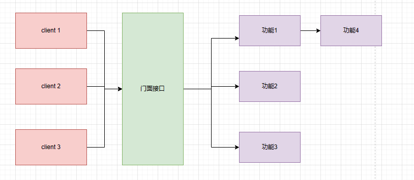

# 门面模式（外观模式）

门面门面，那可谓是首当其冲的家伙，门面模式，也叫外观模式，但是我认为门面模式更加能望文生义，既然是门面模式，那他一定是系统功能的大门，负责为访问者提供系统功能的统一接口的。即对于使用者来说，只需要关心我们暴露的统一接口即可，而不需要关心内部如何实现的。

- 原始定义：

  为子系统的一组接口提供一个统一的接口，使子系统更便于使用



最常见的门面模式有

1\.  Slf4j日志框架，我们在使用的过程中只需要配置@Slf4j注解即可使用对应的日志了，不管内部如何变化，我们都只需调用@Slf4j注解即可

1. API网关也是门面模式的经典使用，API网关就是对外暴露一个API接口，对内则是调用了系统的多个功能甚至是多个系统的功能。

能够使用门面模式的场景非常多：

1. 支付时，我们只需扫码来使用支付系统即可
2. 白名单过滤：对外提供一个注解，使用者只需使用该注解即可进行白名单过滤
3. 系统重构，在重构过程中，内部子系统通常是非常复杂的，但是新功能又要上线，这时我们就可以采用门面模式对外提供统一重要的接口，然后再逐渐迁移或更新到新系统

门面模式的优势

1. 可以大大简化系统复杂度

   本身在没有门面模式的情况下，我们都是直接调用每一个功能的，这样可想而知，随着系统越来越复杂，我们的客户端不得不需要经常更改，而多了一个门面接口，我们只需保持门面接口能够与后端功能的正确对接即可，对于客户端来说我们并不需要改动。
2. 减少客户端的处理系统数量

   因为门面接口是集成多个系统功能对外暴露一个接口，所以客户端需要处理的系统数量自然就减少了
3. 大大降低耦合度

那么接下来我们就来通过实战更加深刻地体会门面模式

### 基于门面模式的白名单过滤系统

既然是把功能统筹成一个大接口来使用，个人认为注解具备着最大的表现力，那么现在就基于注解来看看如何把门面模式体现得淋漓尽致。

白名单过滤系统就是系统允许我们创建系统访问白名单，只有白名单内的用户允许访问系统或者系统的某些功能，所以门面门面，那么我们可以采用切面的方式，在请求过来的过程中做到拦截判断，在白名单内的就放行，否则进行拦截。

首先我们需要先自定义注解

```java
@Retention(RetentionPolicy.RUNTIME) //加入该注解，可以让我们在运行时通过反射获取该注解的值
@Target(ElementType.METHOD)//该注解表示我们这个自定义注解的适用范围
public @interface doDoor {

    String key() default "";

    String jsonResult() default "";

}
```


注解定义了两个属性接口：

1. 属性名，方便我们可以通过反射拿到对应属性方法的值
2. 返回结果

我们可以再优化一下，可通过配置来进行系统的功能开启或关闭和用户输入的白名单

```java
@Component
@ConfigurationProperties(prefix = "t.system.whitelist")
@Data
public class ServiceProperties {

    private String userstr;

}

```


```java
//工具类，把用户输入的白名单文本通过指定符号拆分开来
public class ServiceUtils {

    private String userListStr;

    public ServiceUtils(String userListStr) {
        this.userListStr = userListStr;
    }

    public String[] getUserList(String splitSymbol){
        return this.userListStr.split(splitSymbol);
    }
}
```


```java
@Configuration
@EnableConfigurationProperties(ServiceProperties.class)
@ConditionalOnClass(ServiceUtils.class)
public class ServiceConfigrue {

    @Autowired
    private ServiceProperties properties;


    @Bean
    @ConditionalOnMissingBean
    @ConditionalOnProperty(prefix = "t.system.whitelist",value = "enabled" , havingValue = "true")
    ServiceUtils serviceUtil(){return new ServiceUtils(properties.getUserstr());}

}

```


然后把这几项配置至Spring容器中，并指定需要t.system.whitelist.enabled开启该功能才能使用我们的白名单过滤功能，给系统提高了灵活性。

```java
@Aspect
@Component
@Slf4j
public class DoPointJob {

     Logger logger = LoggerFactory.getLogger(DoPointJob.class);

     @Autowired
     private ServiceUtils serviceUtils;

     /**
      * @Description 只作用于使用该注解的方法
      * @Author
      * @Date
      * @Param
      * @return
     **/
     @Pointcut("@annotation(t.tcoding.cow.twhitelisthandler.annotation.doDoor)")
     public void pointHandler(){

     }


     /**
      * @Description 处理白名单用户
      * @Author
      * @Date
      * @Param
      * @return
     **/
     @Around("pointHandler()")
     public Object routerHandler(ProceedingJoinPoint joinPoint) throws Throwable {
         Method method = getMethod(joinPoint);
         doDoor annotation = method.getAnnotation(doDoor.class);
         String filedValue = getFiledValue(annotation.key(), joinPoint.getArgs());
         if (filedValue == null || filedValue.equals("")) return joinPoint.proceed();
         String[] userList = serviceUtils.getUserList(",");
         for (String s : userList) {
             if (filedValue.equals(s)){
                 return joinPoint.proceed();
             }
         }
        return returnObject(annotation,method);
     }

     private Method getMethod(JoinPoint joinPoint) throws NoSuchMethodException {
         Signature signature = joinPoint.getSignature();
         MethodSignature methodSignature = (MethodSignature) signature;
         return getClass(joinPoint).getMethod(methodSignature.getName(),methodSignature.getParameterTypes());
     }

    private Class<? extends Object> getClass(JoinPoint joinPoint) {
        return joinPoint.getTarget().getClass();
    }

    private Object returnObject(doDoor door,Method method) throws InstantiationException, IllegalAccessException {
        Class<?> returnType = method.getReturnType();
        String s = door.jsonResult();
        if (s.equals("")){
            return returnType.newInstance();
        }
        return JSON.parseObject(s,returnType);
    }

    private String getFiledValue(String filed,Object[] args){
         String filedValue = null;
        for (Object arg : args) {
            try {
                if (filedValue == null || filedValue.equals("")) {
                    filedValue = BeanUtils.getProperty(arg, filed);
                } else {
                    break;
                }
            }catch (Exception e){
                if (args.length == 1){
                        return args[0].toString();
                }
            }
        }
        return filedValue;
    }
}

```


最后便是业务处理了，主要就是对系统用到了doDoor注解的方法请求进行拦截并判断是否在白名单内。

如果想包装成自己的一项独立功能，记得自动装配一下

```java
org.springframework.boot.autoconfigure.EnableAutoConfiguration=\
  t.tcoding.cow.twhitelisthandler.config.ServiceConfigrue,\
  t.tcoding.cow.twhitelisthandler.service.DoPointJob
```


使用测试：

配置白名单

```yaml
t:
  system:
    whitelist:
      userstr: 1,2,3,4,5

```


```java
 @GetMapping("{userId}")
    @doDoor(key = "userId",jsonResult = "{\"code\":\"50001\",\"message\":\"该用户暂无权限，已被拦截\"}")
    public R testSystemConfig(@PathVariable("userId")Long userId){
        System.out.println(properties.getUserstr());
        for (String s : serviceUtils.getUserList(",")) {
            System.out.println(s);
        }
        return R.success(200);
    }
```


显然易见，使用者只需调用一个注解，并根据自己的需求进行简单配置即可，对使用者而言，系统的功能使用简单度大大提升了，谁能想到一个简单注解背后可是由许多功能组成的。

这便是门面模式的优势之处。
