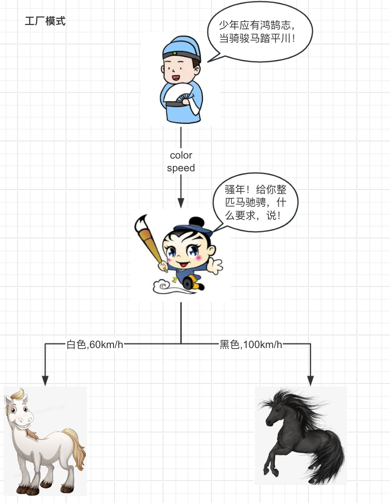

# 工厂模式

## 目录

- [工厂模式的优势](#工厂模式的优势)
- [工厂模式的劣势](#工厂模式的劣势)
- [代码示例](#代码示例)
- [马良可不仅仅画马](#马良可不仅仅画马)
  - [工厂方法模式](#工厂方法模式)
- [拓展](#拓展)

> 📌少年应有鸿鹄志，当骑骏马他平川。

神笔马良要赏我一批骏马，令我踏平川，问我想要一批什么配置的骏马，我把我的需求跟马良哥说了，我说我要一匹黑马，时速达100km/h的黑马，他唰唰唰给我画了一匹。



回到编程的世界里，马良就是我的工厂，我需要告诉马良哥马的颜色，速度配置，马良抬笔整匹马给我驰骋，但是马良如何画马的，我不必关心，也许我想要棕马，蓝马，那我把需求告诉马良哥就行了。这就是接口的好处啦，接口只需关心参数，需求，然后具体的实现是工厂的事，开发者如果需要拓展，只需实现接口就行了，无需改动其他代码，这就是工厂方法的好处。

## 工厂模式的优势

1. **创建对象的解耦**：工厂模式将对象的创建逻辑与使用逻辑分离，客户端只需要知道它们需要什么类型的对象，而不需要知道对象是如何创建的。这降低了客户端和具体产品类之间的耦合度。
2. **扩展性和灵活性**：工厂模式允许系统通过引入新的产品类来扩展，而无需修改现有的客户端代码。只需添加新的工厂类或修改现有的工厂类即可支持新的产品类型。
3. **统一的管理**：工厂模式可以提供一个集中的位置来管理对象创建的逻辑，这使得对象的创建过程更加易于管理和维护。
4. **降低维护成本**：由于客户端与具体产品类的解耦，当产品类发生变化时，只需要修改工厂类，而不需要修改使用产品类的客户端代码，这样可以降低维护成本。
5. **代码的可复用性**：工厂模式可以创建可复用的对象，这些对象可以在多个不同的客户端之间共享。

## 工厂模式的劣势

1. **复杂性**：引入工厂模式可能会增加系统的复杂性，尤其是在简单的应用程序中，可能会导致不必要的开销和过度工程化。
2. **性能开销**：在某些情况下，工厂模式可能会引入额外的性能开销，因为需要通过工厂来创建对象，而不是直接实例化。
3. **违反开闭原则**：虽然工厂模式可以提高系统的扩展性，但是当需要添加新的产品类时，可能需要修改工厂类，这违反了开闭原则，即软件实体应该对扩展开放，对修改关闭。
4. **难以追踪**：在使用工厂模式时，如果实现不够透明，可能会使得对象的创建过程变得难以追踪和理解，尤其是当工厂逻辑变得复杂时。

## 代码示例

那好，接下来可以尝试分析一下这个过程使用代码该怎么完成，感受一下工厂模式可以如何给我们带来更好的代码维护。

我们可以理清一下整段代码逻辑：我 → 黑马需求 → 马良 → 抽象马 → 黑马

&#x20;逻辑有了，那我们得分析我们需要什么？

1. 需要马良也就是工厂
2. 马良是给我们画马的，想要马良不要那么辛苦，我们可以有一匹抽象马，抽象马是所有马的共同特征，比如说颜色，速度之类的，就像我们画画得先把轮廓画出来，然后再加以点缀

好啦，我们一步一步实现

首先是马良，马良只给我们一个静态的方法就是画马的方法

```java
public class MaliangImpl{
    public static AbstractHouse drawHouse(String type) {
        AbstractHouse house = null;
        if (type.equals("black")){
            house = new BlackHouse();
        }else{
            house = new WhiteHouse();
        }
        return house;
    }
}
```

然后我们就来一个马的轮廓

```java
@Data
public abstract class AbstractHouse {

    private String color;

    private String speed;

    public abstract void talk();

}


```

然后现在有白马和黑马两个具体实现

```java
/**
 * @Description 黑马
 * @Author T
 * @Date 2024/5/4 18:37     
 **/
public class BlackHouse extends{

    @Override
    public void talk() {
        super.setColor("黑马");
        super.setSpeed("100km/h");
        System.out.println("我是"+super.getColor()+"，冲冲冲");
    }
}


/**
 * @Description 白马
 * @Author T
 * @Date 2024/5/4 18:38
 **/
public class WhiteHouse extends AbstractHouse{

    @Override
    public void talk() {
        super.setColor("白马");
        super.setSpeed("60km/h");
        System.out.println("我是"+super.getColor()+"，冲冲冲");
    }
}

```

好啦，这样其实一个工厂就算是完成啦

怎么用呢？很简单，我们只需要告诉马良要画什么马就行了，就像以下代码

```java
 public static void main(String[] args) {
        AbstractHouse house = MaliangImpl.drawHouse("black");
        house.talk();
    }
```

```java
结果：我是黑马，冲冲冲
```

这就是工厂模式的书写方式，也是很常用的一个工厂方法，工厂对外提供了静态方法来创建类，而不需要开发new，而如果不想要黑马，白马，还要拓展几款马，那我们只需要创建一个OtherHouse继承AbstractHouse，然后实现自己的方法就行啦，而不需要改其他代码了。

这就是简单工厂模式。

## 马良可不仅仅画马

我们都知道马良哥可不仅仅只会画马喔，他还能画很多很多东西，就因为马良哥能画的东西非常非常多，随着马良工厂越来越复杂，可能就会有画马的静态方法，画车的静态方法，画小狗狗的静态方法一大堆，对于使用工厂模式的开发者来说，这并不好处理的。

### 工厂方法模式

而面对着形形色色的工厂，我们能不能进对外提供一个对应的创建工厂的接口，我们只管使用该接口来创建对应的工厂再完成对应的产品创建即可。

当然可以，我们只需有一个Product的类，不管是马，还是车，还是小狗狗都是马良个产品，所以我们需要有一个产品类

```java
public class Product {

}
```

马良只管画产品，也就是

```java
public interface Maliang {

    /**
     * @Description 画马接口
     * @Author T
     * @Date 2024/5/4 18:35     
     **/
    Product draw(String type);

}

```

而我们可以把马良能画的内容抽象成一个个具体的动作

```java
public class DrawHouse implements Maliang {
    @Override
    public Product draw(String type) {
        if ("white".equals(type)){
            return new WhiteHouse();
        }else{
            return new BlackHouse();
        }
    }
}


```

然后我们就可以尝试着通过Maliang这个接口构建不同的工厂，再通过工厂来创建不同的产品啦

```java
    public static void main(String[] args) {
        Maliang maliang = new DrawHouse();
        AbstractHouse house = (AbstractHouse) maliang.draw("black");
        house.talk();
    }

```

所以也许我们想画车啦，我们只需面对Maliang这个接口就行了

也就是说我们只需要拓展一个画车工厂类就行

```java
public class DrawCar implements Maliang {

    @Override
    public Product draw(String type) {
       return new BlackCar();
    }
}


public abstract class AbstractCar extends Product {
    String color;

    String speed;

    public abstract void go();
}


public class BlackCar extends AbstractCar{
    @Override
    public void go() {
        System.out.println("black car go");
    }
}


```

同样的，我们只需面对Maliang这个接口类创建一个我们想要的工厂类，再用该工厂类来生产产品即可

```java
    public static void main(String[] args) {
        Maliang maliang = new DrawCar();
        AbstractCar car = (AbstractCar) maliang.draw("black");
        car.go();
    }
```

这就是工厂模式的正确使用姿势，工厂模式的应用范围还是非常广的，比如说**支付网关**，**日志记录**，像这种**需要提供一个统一的接口来创建不同类型的对象**，毕竟他可以解开具体产品和开发者创建产品的耦合，使得创建产品的方式更好拓展，而且还能让我们更好地控制类生产的生命周期。

## 拓展

工厂模式时常会有一个好搭档，那就是单例模式，单例工厂的应用也非常广阔，毕竟想想工厂只是根据我们的需求生产类，没有必要每次生产的时候都要创建销毁吧？这不就出发了单例的关键词了吗？所以结合单例，能帮助工厂省下不少的性能开销呢！

当然在日常的开发当中，其实简单工厂模式已经是完全足以了，既简单又好用。
