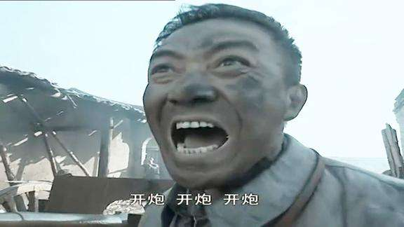
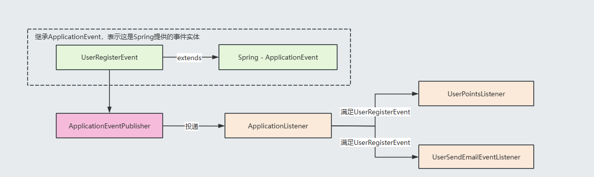

# 监听者模式

## 目录

- [代码示例](#代码示例)
  - [直接实现](#直接实现)
  - [监听者模式改造](#监听者模式改造)
    - [测试](#测试)
- [Spring 中的事件机制](#Spring-中的事件机制)
  - [Spring事件机制的应用](#Spring事件机制的应用)
  - [测试](#测试)
- [SpringBoot源码中的事件机制](#SpringBoot源码中的事件机制)

瞄准！开炮！这就是监听者模式的特征，我们瞄准目标，当目标走到指定位置的时候，大喊开炮，各炮营接收到开炮指令，二话不说，哄他\~！这里李云龙作为消息发送者，负责瞄准和发号指令，而炮营则作为消费者，接收（消费）指令。



监听者模式就是这样，当一个行为发生时传递信息给另外一个用户接收做出相应的处理，两者之间没有直接的耦合关联，这样就能做到消息发送者和消息消费者之间的解耦。

### 代码示例

#### 直接实现

针对这种情况，直接实现确实简单，但是对着代码的拓展性来说是存在问题的，首先创建一个炮营接口和实现

```java
/**
* @Description: 炮营
* @Param:
* @return:
* @Date: 3/31/2025
*/
public interface ArtilleryCampService {

    void action();

}


@Slf4j
public class ArtilleryCampServiceImpl implements ArtilleryCampService{

    @Override
    public void action() {
      log.info("轰隆隆！！！！！");
    }
}


```


然后是长官的接口和实现，长官的任务是瞄准+发号指令

```java
/**
* @Description: 长官
* @Param:
* @return:
* @Date: 3/31/2025
*/
public interface SirService {

    void pre();

    void action();

}

@Slf4j
public class SirServiceImpl implements SirService{
    @Override
    public void pre() {
      log.info("敌人已进入轰炸区！");
    }

    @Override
    public void action() {
      log.info("开炮！！！！！");
    }
}


```


然后就可以直接用了

```java
@Slf4j
public class Main {
    public static void main(String[] args) {

        //瞄准，发号指令开炮！！！
        SirService sirService = new SirServiceImpl();
        sirService.pre();
        sirService.action();

        //接收长官指令，开炮！！！
        ArtilleryCampService artilleryCampService = new ArtilleryCampServiceImpl();
        artilleryCampService.action();
    }
}

```


这么设计确实简单，不过，我们如果在新增一个火箭营呢？那我们就要动main方法的代码逻辑了，这显然是不好的，对代码的侵入性很强\~

```java
@Slf4j
public class Main {
    public static void main(String[] args) {

        //瞄准，发号指令开炮！！！
        SirService sirService = new SirServiceImpl();
        sirService.pre();
        sirService.action();

        //接收长官指令，开炮！！！
        ArtilleryCampService artilleryCampService = new ArtilleryCampServiceImpl();
        artilleryCampService.action();
        
        //火箭营发炮
        ....
    }
}
```


#### 监听者模式改造

那么接下来就来看看使用监听者模式如何对这段代码进行改造吧，首先我们可以先看看监听者模式在架构方面是怎么样的，当然我们先得知道一个定律，这也是开发方面常用的手段，那就是如果想要解耦两者关系，不妨我们就在中间插一脚\~，怎么插一脚咧？其实就是加一个消息处理器来进行处理，用生活中的例子来说的话就是Call 机或者喇叭了


其实代码改起来也好改，核心就是增一个中间类承接负责收集监听者和通知监听者执行任务的\~，那么事不宜迟，马上开凿

首先就是需要先抽象出一个事件监听器的接口，然后将ArtilleryCampService 划分给事件监听器，当然如果有火箭队，则也给他划分到事件监听器中，通过这种方式事件监听者是不是都解耦开来了呢\~

```java
/**
* @Description: 抽象出来消息监听者
* @Param:
* @return:
* @Date: 3/31/2025
*/
public interface EventListener {

    void doEvent();

}


/**
* @Description: 火炮营实现事件监听器
* @Param:
* @return:
* @Author: tangzhaofeng
* @Date: 3/31/2025
*/
@Slf4j
public class ArtilleryCampServiceImpl implements ArtilleryCampService, EventListener {

    @Override
    public void action() {
      log.info("轰隆隆！！！！！");
    }

    @Override
    public void doEvent() {
        action();
    }
}

@Slf4j
public class RocketCampServiceImpl implements RocketCampService, EventListener {
    @Override
    public void action() {
      log.info("咻咻咻！！！！火箭炮发射！！！！");
    }

    @Override
    public void doEvent() {
        action();
    }
}


```


猴，接下来就是我们一直强调的那个Call机啦，他其实是一个事件管理器，专门用于管理事件监听者和发布事件的，实现其实也不难，无非就是通过List将监听器管理起来，但是不一定非要List集合的喔，比如说我们需要将其进行分类，那可以通过Map集合的键值对来进行监听器的管理存储。另外对外提供订阅方法，可以让监听者订阅对应的信息，有订阅当然也会有取消订阅，然后再提供一个通知方法让全部监听者执行实现的监听方法\~

```java
/**
* @Description: Call机类帮忙解耦
* @Param:
* @return:
*/
@Slf4j
public class Call {

    //维护监听器集合
    List<EventListener> listeners = new ArrayList<>(16);


    /**
     * 订阅
     * @param listener  监听
     */
    public void subscribe(EventListener listener) {
        log.info("订阅信息....");
        //添加监听者，随时等待指令！！！
        listeners.add(listener);
        log.info("订阅成功");
    }

    /**
     * 取消订阅
     * @param listener  监听
     */
    public void unsubscribe(EventListener listener) {
        log.info("取消订阅");
        //取消监听，不再等待指令
        listeners.remove(listener);
    }

    /**
     * 通知
     */
    public void notifyMsg() {
        for (EventListener listener : listeners) {
            //收到施令 开炮！！！！！
            listener.doEvent();
        }
    }


}

```


既然有了Call机，长官就不用那么辛苦啦，直接带上Call 机发号施令就行，通过action方法就能看到我们直接调用call的notifyMsg即可。

```java
@Slf4j
public class SirServiceImpl implements SirService{

    //长官带上Call机
    private Call call;

    public SirServiceImpl(List<EventListener> listeners){
        this.call = new Call();
        //将监听者跟长官绑定订阅关系
        for (EventListener listener : listeners) {
            this.call.subscribe(listener);
        }
    }


    @Override
    public void pre() {
      log.info("敌人已进入轰炸区！");
    }

    @Override
    public void action() {
      log.info("开炮！！！！！");
      //Call机呼出指令
      call.notifyMsg();
    }
}
```


##### 测试

这样我们就算是完成了改造了，测试测试看看？通过测试代码，我们就能马上，我们只管发号指令就行啦，对于指令消费者来说，他们有他们的实现，而且如果有多个订阅者，那我们只需要再实现一下EventListener接口就行了。

```java
    public static void main(String[] args) {

//        //瞄准，发号指令开炮！！！
//        SirService sirService = new SirServiceImpl();
//        sirService.pre();
//        sirService.action();
//
//        //接收长官指令，开炮！！！
//        ArtilleryCampService artilleryCampService = new ArtilleryCampServiceImpl();
//        artilleryCampService.action();

         //提供订阅者
         SirServiceImpl sirService = new SirServiceImpl(List.of(new ArtilleryCampServiceImpl(),new RocketCampServiceImpl()));
         sirService.pre();
         sirService.action();
    }
    
    
    
  //结果
  13:22:30.128 [main] INFO com.example.listener.plus.Call -- 订阅信息....
  13:22:30.131 [main] INFO com.example.listener.plus.Call -- 订阅成功
  13:22:30.132 [main] INFO com.example.listener.plus.Call -- 订阅信息....
  13:22:30.132 [main] INFO com.example.listener.plus.Call -- 订阅成功
  13:22:30.132 [main] INFO com.example.listener.basic.SirServiceImpl -- 敌人已进入轰炸区！
  13:22:30.132 [main] INFO com.example.listener.basic.SirServiceImpl -- 开炮！！！！！
  13:22:30.132 [main] INFO com.example.listener.basic.ArtilleryCampServiceImpl -- 轰隆隆！！！！！
  13:22:30.132 [main] INFO com.example.listener.basic.RocketCampServiceImpl -- 咻咻咻！！！！火箭炮发射！！！！
```


### Spring 中的事件机制

体会到了监听者模式的好处了吧\~，其实Spring也给我们提供了事件机制，比如说SpringBoot在启动的过程中就会通过发布消息的方式让我们通过订阅这些消息来干预SpringBoot的启动流程。

##### Spring事件机制的应用

其实使用起来也不难， 我们就以用户注册发送邮件校验的案例来耍耍Spring的事件机制。

案例：当用户完成了系统注册以后，系统会给用户发送邮件，并且初始化积分，简单的实现当然是将这三个行为耦合在一起，但是这样不仅效率会慢，而且不易拓展，所以我们就基于Spring提供的事件机制来实现一下这一块功能。

当有这么一个案例的时候我们就必须要区分清楚谁是消费者，谁是生产者了，然后传递的信息是什么？显然在这个案例中，传递的消息是用户信息，然后生产者应该是注册服务，注册服务完成注册后就需要发送消息给消费者了，消费者自然就是积分服务和邮件服务了。



那么接下来一起来看看怎么实现这块功能吧，首先要定义一个用户注册事件，投递事件的时候就是投递的他

```java
//定义实体类
@Data
public class User {
    private String name;
    private String email;

    public User(String name, String email) {
        this.name = name;
        this.email = email;
    }
}


/** 
* @Description: 定义用户注册事件
* @Param: 
* @return: 
* @Date: 3/31/2025
*/
public class UserRegisterEvent extends ApplicationEvent {

    private User user ;

    public UserRegisterEvent(Object source , User user) {
        super(user);
        this.user = user;
    }

    public UserRegisterEvent(User user, Clock clock) {
        super(user, clock);
    }

    public User getUser() {
        return user;
    }
}
```


那有了投递的内容，就需要将下游服务，就是事件的监听者做出来了，一个是积分服务

```java
@Component
@Slf4j
public class UserPointsListener implements ApplicationListener<UserRegisterEvent> {
    @Override
    public void onApplicationEvent(UserRegisterEvent event) {
        User user = event.getUser();
        //初始化积分
        addPoint(user);
    }


    /**
    * @Description: 新增积分
    * @Param:
    * @return:
    * @Date: 3/31/2025
    */
    public void addPoint(User user){
        log.info("用户{}注册成功，初始化积分",user.getName());
    }
}

```


一个是发邮服务

```java
/**
* @Description: 用户注册事件监听器（发邮）
* @Param: 
* @return: 
* @Date: 3/31/2025
*/
@Component
@Slf4j
public class UserSendEmailEventListener implements ApplicationListener<UserRegisterEvent> {

    @Override
    public void onApplicationEvent(UserRegisterEvent event) {
        //这里会监听UserRegisterEvent类型的事件
        //从传递的事件中获取用户信息
        User user = event.getUser();
        //执行发邮方法
        sendEmail(user);
    }

    /**
    * @Description: 给用户发送邮件
    * @Param:
    * @return:
    * @Date: 3/31/2025
    */
    public void sendEmail(User user){
        log.info("给用户 {} 发送邮件",user.getEmail());
    }

}
```


这两个服务都属于是下游服务，他们是解耦的，所以通过学习监听者模式，我们是可以学到跟消息队列相关的非常多的知识和好处的，其实消息队列很大程度跟监听者模式很像的。

好，接下来就来整整消息发布啦，消息一经发布，消费者就能顺利监听消息，并且执行他们的行为

```java
@Service
@Slf4j
public class UserServiceImpl {

    @Resource
    private ApplicationEventPublisher publisher;


    public void register(User user) {
        log.info("用户注册成功，用户信息为：{}", user);
        //注册成功，发送事件
        publisher.publishEvent(new UserRegisterEvent(this, user));
    }


}

```


##### 测试

```java
public class Main {

    public static void main(String[] args) {
        //开启容器
        AnnotationConfigApplicationContext context = new AnnotationConfigApplicationContext("com.example.listener");
        //执行用户注册方法
        UserServiceImpl userService = context.getBean(UserServiceImpl.class);
        //执行注册方法
        userService.register(new User("张三","123@qq.com"));
    }

}


//执行结果
18:19:08.186 [main] INFO com.example.listener.springEvent.service.UserServiceImpl -- 用户注册成功，用户信息为：User(name=张三, email=123@qq.com)
18:19:08.199 [main] INFO com.example.listener.springEvent.listeners.UserPointsListener -- 用户张三注册成功，初始化积分
18:19:08.199 [main] INFO com.example.listener.springEvent.listeners.UserSendEmailEventListener -- 给用户 123@qq.com 发送邮件


```


瞧，功能都出来了，而且服务与服务之间达到了解耦的效果，更好的是我们可以通过下游服务异步执行的方式提高响应，回忆回忆这不正是消息队列的好处吗！

### SpringBoot源码中的事件机制

SpringBoot在启动的过程中也会发布非常多的事件来表示SpringBoot的启动进展的。比如说在Web容器启动完成后，就会有 listeners.started(context, timeTakenToStartup);这么一个事件被发布了。

```java
  public ConfigurableApplicationContext run(String... args) {
      ...
      ApplicationArguments applicationArguments = new DefaultApplicationArguments(args);
      ConfigurableEnvironment environment = prepareEnvironment(listeners, bootstrapContext, applicationArguments);
      Banner printedBanner = printBanner(environment);
      context = createApplicationContext();
      context.setApplicationStartup(this.applicationStartup);
      prepareContext(bootstrapContext, context, environment, listeners, applicationArguments, printedBanner);
      refreshContext(context);
      afterRefresh(context, applicationArguments);
      Duration timeTakenToStartup = Duration.ofNanos(System.nanoTime() - startTime);
      if (this.logStartupInfo) {
        new StartupInfoLogger(this.mainApplicationClass).logStarted(getApplicationLog(), timeTakenToStartup);
      }
      listeners.started(context, timeTakenToStartup);
      callRunners(context, applicationArguments);
    ...
    return context;
  }
```


当我们往里追踪的时候就会发现started是这么实现的，再看看ApplicationStartedEvent ，不正是SpringApplicationEvent （就是ApplicationEvent的子类）吗？

```java
    public class ApplicationStartedEvent extends SpringApplicationEvent {
      
    }
    
    
    public void started(ConfigurableApplicationContext context, Duration timeTaken) {
        context.publishEvent(new ApplicationStartedEvent(this.application, this.args, context, timeTaken));
        AvailabilityChangeEvent.publish(context, LivenessState.CORRECT);
    }
```


到了这里，想必不说也清楚该如何对其进行拓展了吧😄？

参考Spring的事件机制，我们只需要通过实现事件监听器，并且监听ApplicationStartedEvent 类型的事件，我们就能对其进行拓展啦。

```java
@Component
@Slf4j
public class ApplicationStartedEventListener implements ApplicationListener<ApplicationStartedEvent> {
    @Override
    public void onApplicationEvent(ApplicationStartedEvent event) {
        log.info("容器刷新完成.....");
    }
}

```


好了，监听者模式的学习就到这里，跟着笔者的学习，相信大家对监听者模式及其使用一定会更加清晰的认识，88\~
