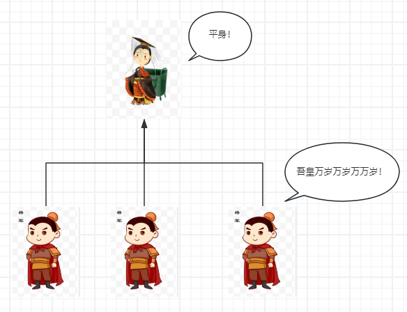

# 单例模式

## 目录

- [单例模式](#单例模式)
  - [为什么要有单例模式？](#为什么要有单例模式)
    - [单例模式的优点](#单例模式的优点)
    - [单例模式的缺点](#单例模式的缺点)
  - [new关键字的执行流程](#new关键字的执行流程)
  - [代码示例](#代码示例)
  - [单例模式的通用模板](#单例模式的通用模板)
  - [懒汉改造](#懒汉改造)
  - [多线程改造](#多线程改造)
  - [单例模式的使用场景](#单例模式的使用场景)
  - [单例模式的拓展](#单例模式的拓展)

## 单例模式

> 世俗和道德约束你，就是不希望产生第二个皇帝！

我是皇帝我是苗，所有的臣子心中只有一个皇帝，每天跪拜上朝都是只针对一个皇帝，而这个皇帝就是所有臣子们的单例。



### 为什么要有单例模式？

#### 单例模式的优点

想一下印刷机，我们不可能印刷一张纸就整一台印刷机吧？我们肯定是一台印刷机就够了，他可以不断地根据我们的需求印刷纸张。同理，有的类他只负责一件单一的事情，比如说**全局配置对象**，他就是全局独一份的，像这种我们只需要一个帮我们工作就行了，这样不仅省下了内存空间，还省了不断创建对象和销毁对象的性能消耗。

所以像**日志打印**，**工具函数**等工具类，全局配置对象，全局唯一管理，这种单一地做事的，不需要太多自定义的类，我们可以考虑使用单例模式来完成类的书写的。

#### 单例模式的缺点

因为单例模式会隐藏类之间的依赖关系，可能会造成代码的耦合度增加，不利于单元测试和模块化设计。因此，在设计系统时，应根据实际情况权衡是否使用单例模式。

### new关键字的执行流程

想要获取单例，就必须尽量地把对象产生的方式给禁止掉，让别人没办法产生对象，别人既然没办法产生对象，那我们就需要给别人提供获取单例的途径。

new 是我们最常用的创建对象的方式，从我们在编程界牙牙学语时就开始接触这个new的关键字了

1\. new 构造函数可以在内存中创建一个空的对象

2\. this就会指向刚才创建的空对象

3\. 执行构造函数里面的代码 给这个空对象添加属性和方法

4\. 返回这个对象

可以发现的是，new一个新对象的过程是离不开类的构造器的，想要让别人没办法进行对象的产生，我们需要做的就是不让别人使用构造器构造对象！怎么做呢？很简单，就是我们熟悉的private访问修饰符啦！

好，经过分析，我们总结一下，要想单例，我们就要遵循：

1. 不允许别人创建对象，对外不提供创建对象的方法
2. 自己创建一个对象自己兜着
3. 暴露一个获取对象的方法给外部调用（想要？管我要就行）

### 代码示例

单例皇帝类

```java
/**
* @Description: 简单单例
* @Param:
* @return:
* @Author: T
* @Date: 5/3/2024
*/

public class Emperor {
    private static final Emperor emperor = new Emperor();//兜着一个对象
    private Emperor() {} //不允许外部以new创建对象
    //想要对象？管我要
    public static Emperor getInstance(){
        return emperor;
    }
    //皇帝发话
    public static void say(){
        System.out.println("爱卿们平身！");
    }
}

```

这段代码，就把我们提到的三件事完成了。

臣子类

```java
class Minister{
    //臣子上朝
    public void gotoCourt(){
        System.out.println("皇上万岁万万岁！");
    }
}
```

测试

```java
 //上朝三天
    public static void main(String[] args) {
        Minister minister1 = new Minister();
        Minister minister2 = new Minister();
        Minister minister3 = new Minister();
        //三个不同臣子
        System.out.println(minister1 == minister2);
        System.out.println(minister2 == minister3);
        System.out.println(minister1 == minister3);
        //通过提供的getInstance获取皇帝单例
        Emperor emperor = Emperor.getInstance();
        Emperor emperor2 = Emperor.getInstance();
        for (int i = 0 ; i < 3 ; i ++){
            System.out.println("第"+i+"天朝拜");
            minister1.gotoCourt();
            minister2.gotoCourt();
            minister3.gotoCourt();
            System.out.println("此皇帝是同一个皇帝？"+(emperor==emperor2));
            Emperor.say();
        }
    }
```

结果：

```java
false
false
false
第0天朝拜
皇上万岁万万岁！
皇上万岁万万岁！
皇上万岁万万岁！
此皇帝是同一个皇帝？true
爱卿们平身！
第1天朝拜
皇上万岁万万岁！
皇上万岁万万岁！
皇上万岁万万岁！
此皇帝是同一个皇帝？true
爱卿们平身！
第2天朝拜
皇上万岁万万岁！
皇上万岁万万岁！
皇上万岁万万岁！
此皇帝是同一个皇帝？true
爱卿们平身！
```

可以看到这种方式，new出来的大臣都是不同的实例，但是每天朝拜的皇帝却始终是一个皇帝单例！这就是单例模式的使用。

### 单例模式的通用模板

```java
public class Singleton{

  private static final Singleton singleton = new Singleton();//在类内部自行创建好需要使用的单例类
  
   private Singleton(){}//私有化构造函数，限制new 多个对象
   
   public static Singleton getInstance(){
       return Singleton.singleton;
     }//通过类内部方法获取该类的唯一实例对象
     
    //其他方法
    //...

}
```

### 懒汉改造

这样就可以完成类的单例模式创建了，但是这样真的好吗？

仔细观察，在类刚开始创建的时候我们就先创建对象了

private static final Singleton singleton = new Singleton();

也就是说我们创建应用的时候Singleton对象就已经存在并随时待命了。这就是饿汉式的单例模式，这也意味着，无论这个单例是否被使用，它都会在类加载时就被创建，这可能会有一些内存上的开销。

那更完美一点的情况就是需要的时候再加载呗

所以我们可以做以下改造

```java
public class Singleton{
  private static Singleton singleton = null;//不会在一开始就提供单例对象
  private Singleton(){}//限制产生多个对象
  public static Singleton getInstance(){//提供一个方法产生单例对象，这是被动产生单例对象，即
  //需要使用的时候才会产生对象，跟上面的例子是不一致的
      if(singleton == null){
        singleton = new Singleton();
      }
      return singleton ;
  }
}
```

做了这部分改造，我们就可以实现需要的时候再产生对象，也就是懒汉式的单例模式了

### 多线程改造

不过！问题又来了，单例是一个共享资源，全局仅一份这我们都知道，所以我们要率先关注在并发调用getInstance的情况下是否有可能会有多例的情景。想想如何线程A还没来得及new Singleton()，线程B就趁虚而入了，这时候不就有可能有两个Singleton了吗？针对这种情景，我们就需要用上synchronized 保证线程安全了

```java
public class Singleton {
  // 声明单例对象，但不立即初始化
  private static volatile Singleton singleton;
  private Singleton(){} // 私有化构造函数，防止外部通过new创建实例
  public static Singleton getInstance(){
    // 第一次检查：如果实例已经被创建，那么直接返回实例
    if (singleton == null) {
      // 同步块，保证线程安全
      synchronized (Singleton.class) {
        // 第二次检查：如果实例仍然没有被创建，那么创建实例
        if (singleton == null) {
          singleton = new Singleton();
        }
      }
    }
    return singleton;
  }
  // 其他方法
  // ...
}

```

这段代码就是双重检索式的单例模式，也是我们最常用的单例模式，这当中有两个关键点

1. volatile
   1. &#x20;volatile是为了让其他线程都能正确地看到singleton的状态
2. 双重if
   1. 第一重if
      1. 提高性能，同步代码块说白了就是让线程排着队执行代码，排队执行本身就是很费时间的，所以第一重if就是singleton不为空的情况下，也就不用等了，直接返回singleton就行
   2. 第二重if
      1. 保证线程安全和单例的唯一性

### 单例模式的使用场景

在一个系统中，要求一个类有且仅有一个对象，如果出现多个对象就会出现不良反应，可以采用单例模式

- 要求生成唯一序列号的环境
- 在整个项目中需要一个共享访问点或共享数据，例如一个Web页面上的计数器，可以不用把每次刷新都记录到数据库中，使用单例模式保持计数器的值，并确保是线程安全的
- 创建一个对象需要消耗较多资源的，如要访问IO和数据库等资源
- 需要定义大量的静态常量和静态方法（如工具类）的环境，可以采用单例模式

### 单例模式的拓展

单例模式即由始至终只会产生一个对象，使用一个对象

那么能不能由始至终只会产生2，3，4，5个对象呢？当然可以

上代码，这回是多个皇帝

```java
class Emperors{
    private static final int maxofEmperors = 2;//定义最大数量的多例
    static ArrayList<String> emperorName = new ArrayList<>();//与单例不同，单例一直只有一个对象，所以不需要指定名称
    static ArrayList<Emperors> emperors = new ArrayList<>(maxofEmperors);//容纳对象
    private static  int EmperorId = 0;
    static {
        for (int i = 0 ; i < maxofEmperors ; i ++){
            emperors.add(new Emperors("皇帝"+i));
        }
    }//静态代码块，当类被加载时执行且只执行一次
    private Emperors(String name ){
        emperorName.add(name);
    }
    //获取实例对象
    public static Emperors getInstance(){
        Random random = new Random();
        EmperorId = random.nextInt(maxofEmperors);
        return emperors.get(EmperorId);
    }
    //皇帝发话了
    public void say(){
        System.out.println(emperorName.get(EmperorId)+"说：众生平等！");
    }
}
```

臣子类

```java
class Ministers{
    public static void say(){
        System.out.println("皇上万岁万万岁！");
    }
}
```

测试

```java
public class demo2 {
    //5天朝拜
    public static void main(String[] args) {
        Ministers ministers =new Ministers();
        for (int i = 0;i < 5;i++){
            Emperors emperors = Emperors.getInstance();
            ministers.say();
            emperors.say();
        }
    }
}
```

结果

```java
皇上万岁万万岁！
皇帝1说：众生平等！
皇上万岁万万岁！
皇帝0说：众生平等！
皇上万岁万万岁！
皇帝0说：众生平等！
皇上万岁万万岁！
皇帝0说：众生平等！
皇上万岁万万岁！
皇帝0说：众生平等！
```

从结果可得，对象始终只有两个，皇帝0，皇帝1
