# 重学Vue3

## 目录

- [Vue3 的源码结构](#Vue3-的源码结构)
  - [Vue的源码下载](#Vue的源码下载)
  - [Vue源码搭建](#Vue源码搭建)
    - [目录结构](#目录结构)
    - [运行源代码](#运行源代码)
  - [执行第一个测试实例](#执行第一个测试实例)
    - [debug](#debug)
- [动手构建自己的Vue框架](#动手构建自己的Vue框架)
  - [尝试跟着Vue来搭建自己的包结构](#尝试跟着Vue来搭建自己的包结构)
  - [安装打包器 rollup](#安装打包器-rollup)
    - [安装](#安装)
    - [安装插件](#安装插件)
    - [创建rollup配置](#创建rollup配置)
    - [测试](#测试)
  - [配置路径映射](#配置路径映射)
- [探索源码](#探索源码)
  - [响应系统](#响应系统)
    - [js的程序性](#js的程序性)
    - [令程序更加聪明](#令程序更加聪明)
    - [vue2 响应式采用Object.defineProperty在设计上的缺陷](#vue2-响应式采用ObjectdefineProperty在设计上的缺陷)
    - [vue3的改进方案](#vue3的改进方案)
      - [proxy的使用](#proxy的使用)
      - [Reflect](#Reflect)
  - [初入reactivity模块](#初入reactivity模块)
    - [阅读源码](#阅读源码)
    - [初创reactivity模块](#初创reactivity模块)
      - [reactivity的封装](#reactivity的封装)
      - [effect的封装](#effect的封装)
      - [初次计算测试](#初次计算测试)
    - [触发计算effect实现](#触发计算effect实现)
      - [测试](#测试)
  - [升级响应式模块代码](#升级响应式模块代码)
    - [测试](#测试)

## Vue3 的源码结构

### Vue的源码下载

[https://github.com/vuejs/core](https://github.com/vuejs/core "https://github.com/vuejs/core")

到github上，fork或者clone 项目下来即可

### Vue源码搭建

#### 目录结构

vue的核心内容都是聚合在packages下

以compiler-开头的是与编译时相关的

以reactivity-开头的是与响应式相关的

以runtime-开头的是与运行时相关的

vue 里的是含有所有的测试实例

```text
├── packages
│   ├── compiler-core          // 编译器核心，独立于平台
│   ├── compiler-dom           // 针对浏览器的 DOM 模板编译器
│   ├── compiler-sfc           // 单文件组件(.vue)编译器的实现
│   ├── compiler-ssr           // 服务端渲染编译器的实现
│   ├── dts-test               // TypeScript 类型声明测试
│   ├── global.d.ts            // 全局 TypeScript 类型声明文件
│   ├── reactivity             // 响应式系统的实现
│   ├── reactivity-transform   // 实验性代码，会在 3.4 中从 Vue 核心中删除
│   ├── runtime-core           // 运行时核心实例相关代码
│   ├── runtime-dom            // 针对浏览器的运行时实现
│   ├── runtime-test           // 运行时测试相关代码
│   ├── server-renderer        // 服务端渲染的实现
│   ├── sfc-playground         // 单文件组件在线调试器
│   ├── shared                 // package 之间共享的工具库
│   ├── template-explorer      // 模板代码在线编译器
│   ├── vue                    // vue编译后dist产物，不同场景的引入文件
│   └── vue-compat             // 兼容旧版 API 的代码
```

#### 运行源代码

首先需要安装pnpm，因为vue源码是基于pnpm进行包管理的

```bash
npm i -g pnpm
```

安装完成之后就可以安装依赖了

```bash
pnpm i 
```

依赖安装完成之后就可以进行打包操作了

因为我们是需要运行源代码，所以需要先把代码进行编译，编译完以后才能使用

```bash
pnpm build
```

完成打包之后我们就可以在vue文件夹里找到dist文件夹，里面就是vue打包好的产物

然后我们就可以尝试使用并debug了

### 执行第一个测试实例

执行下面测试实例

```html
<!DOCTYPE html>
<html lang="en">

<head>
    <meta charset="UTF-8">
    <meta name="viewport" content="width=device-width, initial-scale=1.0">
    <title>Document</title>
    <script src="../dist/vue.global.js"></script>
</head>


<body>
    <div id="app"></div>
</body>


<script lang="javascript">

    const { reactive, effect } = Vue

    const name = reactive({
        name: 'zs'
    })

    effect(() => {
        document.querySelector('#app').innerText = name.name
    })


    setTimeout(() => { name.name = 'ls' }, 2000)

</script>

</html>
```

基于服务运行html文件

下载插件 Live Server，Live Server 是可以令动态或静态文件基于服务器访问的

下载完成以后就可以在右键菜单栏处看到基于Live Server运行了

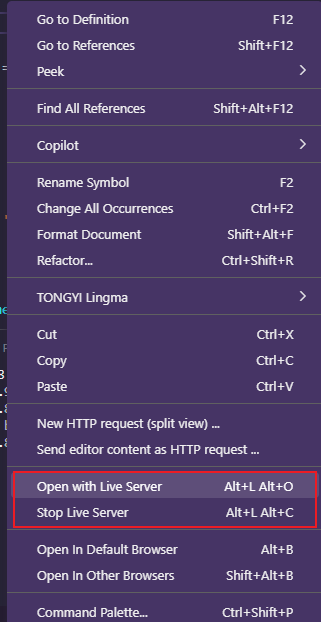

点击运行后，我们可以从服务器指定端口获取资源，就证明运行成功了

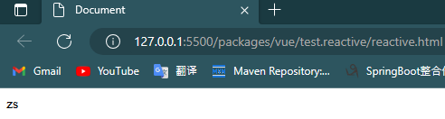

接下来我们就可以尝试做debug处理了

#### debug

浏览器是个debug的好工具，但是浏览器中的源码只有build后的代码，想要看到构建前的代码，我们需要开启vue的sourceMap，很简单，就是到package.json 处为构建代码添加-s属性即可

```json
"build": "node scripts/build.js -s"
```

重新构建，我们就能发现文件多了.map

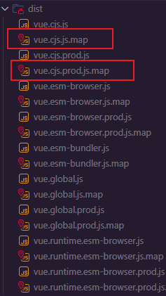

打开浏览器的调试工具，到sources栏下， 就能看到vue的所有相关源码了

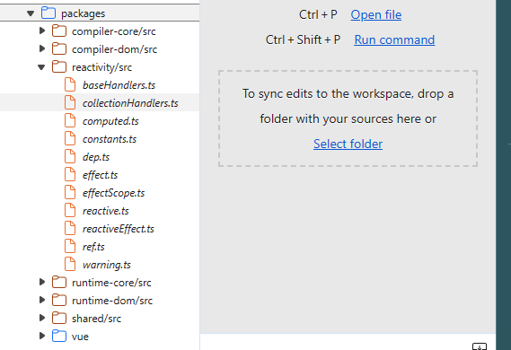

打上断点，刷新就能进行debug模式啦

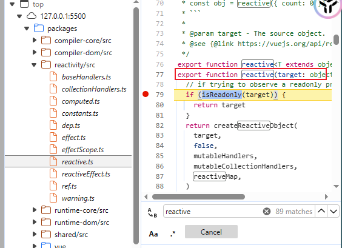

## 动手构建自己的Vue框架

模仿也是学习的一种方法，能够在自己尝试构建Vue框架的过程中带着问题去探索源码，我觉得这样子学源码既不枯燥还能帮助自己更加好地理解脉络

### 尝试跟着Vue来搭建自己的包结构

首先创建一个Vue-next-mini的新项目

构建package.json

```bash
npm init
```

构建TS环境

安装TS依赖

```bash
npm install -g typescirpt@4.7.4
```

生成默认配置

```bash
tsc -init
```

### 安装打包器 rollup

rollup是一个模块打包器，比较适合用于打包**库**，webpack比较适合用于大型项目的打包

[https://www.rollupjs.com/#installation](https://www.rollupjs.com/#installation "https://www.rollupjs.com/#installation")

#### 安装

```bash
npm install --global rollup

```

#### 安装插件

```bash
npm i -D @rollup/plugin-commonjs@22.0.1  @rollup/plugin-node-resolve@13.3.0  @rollup/plugin-typescript@8.3.4
```

#### 创建rollup配置

在根目录下创建rollup.config.js

```javascript
import resolve from '@rollup/plugin-node-resolve'
import commonjs from '@rollup/plugin-commonjs'
import typescript from '@rollup/plugin-typescript'


export default[
    {
        //入口文件
        input: 'packages/vue/src/index.ts',
        //打包路径
        output:[
            //导出iife模式的js文件
            {
                //开启sourceMap
                sourceMap: true,
                //导出文件名
                file: 'packages/vue/dist/vue.js',
                //导出文件格式
                format: 'iife',
                //导出文件全局变量名
                name: 'Vue'
            }
        ],
        //插件
        plugins: [
          typescript({
            sourceMap:true
          }),
          resolve(),
          commonjs()
        ]
    }
]
```

#### 测试

入口文件是'packages/vue/src/index.ts'，所以我们需要创建出来这个文件

随便输入点打印语句

```javascript
console.log('hello world')
```

然后我们要到package.json处输入build脚本

```json
  "scripts": {
    "build": "rollup -c",
    "test": "echo \"Error: no test specified\" && exit 1"
  },
```

如果是typescript开发的要安装插件

```bash
 npm i --save-dev tslib@2.4.0 typescript@4.7.4
```

然后就可以尝试build一下了

```bash
npm run build
```

出现dist包就没有问题了

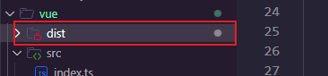

### 配置路径映射

我们经常配置路径都需要去配置相对路径，即相对本文件的哪一层哪一层目录

```javascript
import { isArray } from "../../shared/index.ts";
```

这样的路径可观性不强不说，而且两个文件相差的层级较深的时候，就出现../../../../这样的情况

而我们现在需要配置的就是要基于某一层文件夹来做相对路径

比如说

```javascript
import { isArray } from "@/utils/utils";
```

就是指src目录下的utils包的utils类

怎么做到如上配置呢，我们就需要用到TS提供的特性了

在TS配置文件下添加如下配置

```json
    "baseUrl": ".",
    "paths": {
      "@vue/*":[
        "packages/*/src"
      ]
    }
```

这一段就是对定义的@vue的文件路径与packages/ \*/src做了个映射

接下来我们就可以替换成

```typescript
import {isArray} from '@vue/shared';
```

有了这个路径映射我们就可以更好地对模块内容进行导入了

## 探索源码

### 响应系统

#### js的程序性

```javascript
 let product = {
        price: 10,
        quantity: 2
    }


    let total = product.price * product.quantity
    console.log("total price :" + total);
    product.quantity = 5
    console.log("total price :" + total);
```

看这段代码，两次的total结果是一样的，并不会因为quantity的修改而出发total的重新计算

代码按照编写的顺序执行，变量的值在计算后固定，除非被显式地重新赋值。这就是为什么两次输出的 total 都是 20，而不是第二次变为 50 的原因。如果想要在 quantity 改变后得到新的 total，需要重新执行计算并显式地更新 total 变量的值。

也就是说，程序没办法知道中间变量发生了改变，所以只能维持着原来的值，除非我们再执行一次

total = product.price \* product.quantity

所以如何让js程序能够自己感知中间变量的改变，这就是响应式的目标了

#### 令程序更加聪明

想要让程序能够感知到变化，刚刚也提了，只需再次让total计算一下就行了

```javascript
 let product = {
        price: 10,
        quantity: 2
    }


    let total = product.price * product.quantity
    console.log("total price :" + total);
    product.quantity = 5
+     total = product.price * product.quantity
    console.log("total price :" + total);
```

当然为了更好地进行管理我们可以将其抽出来成为一个方法

```javascript
    let product = {
        price: 10,
        quantity: 2
    }

 +   let effect = () => {
 +       total = product.price * product.quantity
 +    }

 +  let total = 0;
 +  effect()
    console.log("total price :" + total);
    product.quantity = 5
 +  effect()
    console.log("total price :" + total);


```

不过按这么看，程序貌似是变聪明了，不过我们是每次都要手动才能让他变聪明，就是踢其一脚他才走一步

这样子显然是不可以的

怎么能够让他能够自己感应值的变化而出发重新计算呢？

不妨我们来看看这段代码是如何处理值的

```javascript
    let product = {
        price: 10,
        quantity: 2
    }

    let effect = () => {
        total = product.price * product.quantity
     }

   let total = 0;
   effect() //setter
    console.log("total price :" + total); //getter
    product.quantity = 5//setter
   effect() //setter
   console.log("total price :" + total); //getter

```

其实仔细分析，我们以上的行为不过是setter 和 getter嘛

好了，其实了解到这里，我们大概是有点眉目了，其实只需要监听属性的getter 和 setter 行为不就好了嘛？

大概方向是有了，其实js是有提供这么个方法的→Object.defineProperty()

[https://developer.mozilla.org/zh-CN/docs/Learn](https://developer.mozilla.org/zh-CN/docs/Learn "https://developer.mozilla.org/zh-CN/docs/Learn")

当然这也是vue2采用的解决方案

好了，万事俱备，开始改造

```javascript
    let quantity = 2;
    let product = {
        price: 10,
        quantity: quantity
    }
    let total = 0;
    let effect = () => {
        total = product.price * product.quantity
        console.log("total price :" + total);
    }
    effect()
    Object.defineProperty(product,'quantity',{
        set(newVal){
            quantity = newVal
            effect()
        },
        get(){
            return quantity
        }
    })
```

这段代码其实就是通过监听product的quantity属性是否发生了改变，即是否触发了setter行为，如果触发了就重新进行计算，通过这样的方式确实让程序智能起来了

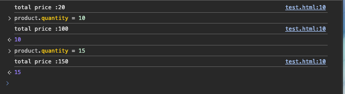

vue2 也是采用了这种方式来感知属性的变化的，但是vue3却放弃了使用这种方式

这是为什么呢？

#### vue2 响应式采用Object.defineProperty在设计上的缺陷

通过以上学习，我们已经清楚了Object.defineProperty是基于一个对象存在已知的getter，setter来触发重新计算的。

所以我们可以得知想要基于Object.defineProperty具备响应性也是要有条件的

1. 具备setter和getter属性
2. 要已知属性

但是如果我们给对象新增一个属性，比如说，我们通过product\['desc']='......'为对象添加了一个属性，Object.defineProperty还能具备响应性吗？

答案是不再具备了，因为这其中破坏了已知属性，没错我监听了setter和getter，但是没监听新增属性时应该如何变化呀

#### vue3的改进方案

vue3则是基于Proxy来是实现响应式的

Proxy就是代理的意思，他其实就是创建了一个对象代理，从而实现基本操作的拦截和自定义，具体的可以查看mdn了解其用法和含义

##### proxy的使用

```javascript

    let product = {
        price: 10,
        quantity: 2
    }


    //创建代理对象
    const productProxy = new Proxy(product, {
        //监听set行为
        set(target, key, newVal, receiver) {
            target[key] = newVal
            effect()
            return true
        },
        //监听get行为
        get(target, key, receiver) {
            return target[key]
        }
    })

    let total = 0;

    const effect = () => {
        total = productProxy.price * productProxy.quantity
        console.log(total)
    }
    effect()
    console.log(total)

```

proxy的使用其实不难，只需要关注被代理的对象，和需要监听的方法回调，而Proxy其实就是帮助我们创建了一个代理对象，这个代理对象拥有所有被代理对象的所有属性。

当然我们的操作也应该操作代理对象，与Object.defineProperty最大的不同是我们不再需要指定属性，只需关注代理的对象即可。

所以vue3通过Proxy实现响应式核心API之后，vue就没有存在新增属性失去响应性的问题了

##### Reflect

Reflect它提供了拦截 JavaScript 操作的方法，比如get，has等方法,比如说

```javascript
    let obj = {
        name: 'iphone'
    }

    console.log(Reflect.get(obj, 'name'))
```

但是Reflect.get 其实跟obj.name效果是一样的，但是为什么我们还需要用到Reflect呢？

那就需要看Reflect.get的第三个属性 receiver，如果target对象中指定了getter，receiver则为getter调用时的this值，不妨看看以下示例

```javascript
   let zs = {
        firstName: '张',
        lastName: '三',
        get fullName() {
            return this.firstName + this.lastName //2次
        }
    }

    const proxy = Proxy(zs, {
        get(target, key, receiver) {
            console.log("GETTER"); 
            return target[key] //一次
        }
    })

    console.log(proxy.fullName);

```

可以先暂停下来想一想，这里的GETTER会出现几次？结果表明，只有一次，但是一次是正常的嘛？

仔细想想这里应该是触发了几次getter？应该是触发3次getter吧，但是结果只有一个GETTER，这就是因为fullName的this指向的是zs，而不是zs的代理对象，之前我们就说了我们的操作对象应是proxy才能使得响应性生效

所以我们应该怎么修改呢？我们应该借用Reflect.get的receiver来修改this的指向

```javascript
 const proxy = Proxy(zs, {
        get(target, key, receiver) {
            return Reflect.get(target, key, receiver)
        }
    })
```

这样，this的指向会发生变动，再看看，GETTER就会如期的出现三次了

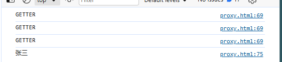

所以Reflect和Proxy其实是一对最佳搭档，Reflect可以帮助Proxy修改this的指向

### 初入reactivity模块

#### 阅读源码

#### 初创reactivity模块

##### reactivity的封装

```vue
//创建对象
const obj = {
  name: 'zs'
}
// reactive返回代理对象
const objProxy = reactive(obj)
```

从这段Vue3 reactive的写法中可以看出来其实Vue3 通过reactive函数为我们提供了一个代理对象任我们操作，所以第一步我们就仿照Vue3 的方式来通过reactive方法来创建一个代理对象返回。

```java
//导出reactive函数
export function reactive(target: object){
    return createReactiveObject(target,mutableHandlers,reactiveMap)
}
```

通过这段代码createReactiveObject(target,mutableHandlers,reactiveMap)不难看出，所有的操作都是在createReactiveObject方法中实现的，至于target，mutableHandlers，reactiveMap，接下来将会一步一步来实现。

traget就是目标对象，这就没什么好说的了

参照源码的写法mutableHandlers是放置在baseHandlers里的，所以我们暂时给个空实现

```javascript
export const mutableHandlers : ProxyHandler<any> = {

}
```

reactiveMap则是一个WeakMap，所谓WeakMap从名字上看Weak就是弱的意思，WeakMap是弱引用的Map即可，所以当我们的变量不再被引用的时候，Map会被回收，如果是强引用的情况下，是不会被回收的，不妨一起看看下面这段代码带来的效果

```javascript
    //1. 弱引用集合
    let wm1 = new WeakMap();
    let obj = {
        name: 'zs'
    }
    obj = null
    wm1.set(obj, "aaa")

    //2. 强引用集合
    let wm2 = new Map();
    let obj = {
        name: 'zs'
    }
    wm2.set(obj, "aaa2")
    obj = null

```

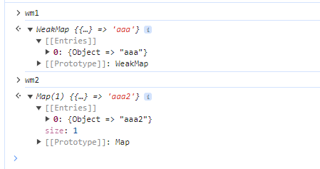

如果此时将key置空，即obj = null,可看到结果一个wm1已为null，而wm2 是仍存在结果的，所以弱引用的WeakMap是不影响垃圾回收的，也更加适用于数据需要不断发生变动的reactivity模块

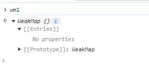

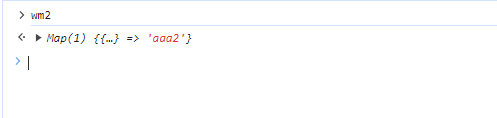

所以初代方法应该是这样子，主要逻辑是设置一个代理缓存，然后从缓存中查询看有没有存有target对象的代理，有就从缓存中取，否则就创建一个target代理

```javascript
// 创建代理对象的核心方法
function createReactiveObject(
    target:Object,
    baseHandlers: ProxyHandler<any>,
    proxyMap: WeakMap<Object,any>
){
    //从缓存中获取对应的target
    const existingProxy = proxyMap.get(target)
    if(existingProxy){
        //缓存中存在
        return existingProxy
    }
    //不存在的话创建代理对象
    const proxy = new Proxy(target,baseHandlers)
    //放置缓存
    proxyMap.set(target,proxy)
    return proxy
}
```

好接下来，我们就要关注核心的mutableHandlers了，回顾一下Proxy的使用，Proxy的第二个参数其实就是关于事件的触发监听，所以我们大概也可以猜测到mutableHandlers的作用就是监听Proxy的操作行为的

```javascript

    let product = {
        price: 10,
        quantity: 2
    }


    //创建代理对象
    const productProxy = new Proxy(product, {
        //监听set行为
        set(target, key, newVal, receiver) {
            target[key] = newVal
            effect()
            return true
        },
        //监听get行为
        get(target, key, receiver) {
            return target[key]
        }
    })

    let total = 0;

    const effect = () => {
        total = productProxy.price * productProxy.quantity
        console.log(total)
    }
    effect()
    console.log(total)

```

好了，回顾完Proxy的使用后我们就来看看Vue3是如何实现，Vue3其实也就是采用了闭包的处理方法将ProxyHandler给封装起来了Reflect的使用也是为了让get，set行为重新指向代理对象，而track是Vue3做的收集依赖的行为(核心)，trigger则是触发依赖的行为

```javascript
const get = createGetter()
const set = createSetter()

function createGetter() {
    return function get(target:object, key:string | symbol, receiver:object){
        const res = Reflect.get(target,key,receiver)
        track(target,key)
        return res
    }
}


function createSetter() {
    return function set(target:object, key:string | symbol, value: unknown , receiver:object){
        const res = Reflect.set(target,key,value,receiver)
        trigger(target,key,value)
        return res
    }
}


export const mutableHandlers : ProxyHandler<any> = {
    get,
    set
}

```

##### effect的封装

在回顾一下我们以往写的第一段代码

```java

    const { reactive, effect } = Vue

    const name = reactive({
        name: 'zs'
    })

    effect(() => {
        document.querySelector('#app').innerText = name.name
    })

```

我们是用reactive来触发数据的自动更新，还需要触发对应的视图刷新，而视图刷新就是在effect函数中进行处理的。

经过reactivity模块的学习，其实猜也能猜出来，其实就是在name 发生变动后，触发effect中我们传入的函数，那Vue3 又是如何将其封装得漂漂亮亮的呢？Vue3 的effect其实就是交给了ReactiveEffect来处理了，大致内容如下

首先我们要先搞定初次渲染的情况，初次渲染简单，就是将我们传入的函数触发一次即可

```javascript
export function effect<T = any> (fn : () => T){
    const _effect = new ReactiveEffect(fn)
    //执行传入回调函数
    _effect.run()
}


export let activeEffect:ReactiveEffect | undefined

export class ReactiveEffect<T = any> {
    constructor(public fn: () => T){
        
    }
    //这个方法就是直接触发我们传递的函数
    run() {
        //标志当前Effect已被激活
        activeEffect = this;
         return this.fn();
    }
}
```

##### 初次计算测试

当然我们可以拿回我们第一次使用的那段代码用于测试

```javascript
    const { reactive, effect } = Vue

    const name = reactive({
        name: 'zs'
    })

    effect(() => {
        document.querySelector('#app').innerText = name.name
    })
```

重新构建项目，打开

#### 触发计算effect实现

首次加载计算已经实现了，也比较简单，说白了就是传入我们的函数交给ReactiveEffect触发即可，但是后面的改动Proxy时的重新计算呢？

这就需要我们再次重复响应性的概念，响应性我们经过了一轮认识，也算是有所了解了，无非是在setter数据的时候该对象所有的fn函数都触发一遍，我们提到了关键词，是所有的fn 和对应的对象。

想要获取所有的fn函数，还要区分哪些fn函数是哪个对象的。

想要完成这个过程我们就需要做一个操作 1. 收集依赖&#x20;

而setter 所做的事情就是触发依赖了

这也就是我们在做封装Proxy过程中空着的两个方法了

```javascript
function createGetter() {
    return function get(target:object, key:string | symbol, receiver:object){
        const res = Reflect.get(target,key,receiver)
        * track(target,key) //收集依赖
        return res
    }
}


function createSetter() {
    return function get(target:object, key:string | symbol, value: unknown , receiver:object){
        const res = Reflect.get(target,key,receiver)
        * trigger(target,key,value) //触发依赖
        return res
    }
}
```

关键我们先看如何收集：想知道如何收集，我们得思考，收集的目的是什么？

因为我们要触发依赖，所以每次发生变动的时候，我们需要知道是哪个对象的哪个属性发生变动了，并且需要知道触发哪部分依赖，这样才能最大的节省资源。

所以我们需要将依赖和对象和对象属性有所绑定，这里就需要我们之前所讲的WeakMap了

因为WeakMap是一个\<Object,any>的集合，所以我们能不能以这样的层级结构将数据的关系绑定在一起呢

WeakMap ：

1. key ： 响应式对象
2. value ： Map对象
   1. key ：响应式对象对应属性
   2. value ： 对象指定属性的执行函数

看这个层级结构是不是就将对象和对象属性和对应的执行函数都绑定在一块呢

好了，我们有思路了，就一起来看看Vue3是如何来构建这层关系的吧

```javascript
type KeyToDeMap = Map<any,ReactiveEffect>
const targetMap = new WeakMap<any,KeyToDeMap>()
```

Vue3 就是这样将三者关系绑定在一起的

那么接下来看看track是如何依靠targetMap对依赖进行收集吧，其实理解起来不难，这段代码就是为了构建上面说的WeakMap 那层关系。

```javascript
/***
 * 
 * 收集依赖
 * 
 */
export function track(target:object,key:unknown){
    if(!activeEffect) return 
    let depsMap = targetMap.get(target)
    if(!depsMap){
        targetMap.set(target,(depsMap = new Map()))
    }
    depsMap.set(key,activeEffect)
}
```

关系图都够构建好了，想触发还难吗？就像给了我们一本字典，想找一个字也就轻轻松松了。那么接下来看看如何进行依赖触发的

```javascript
/***
 * 
 * 触发依赖
 * 
 */
export function trigger(target:object,key:unknown,newValue:unknown){
    //根据target找到对应对象
    const depsMap = targetMap.get(target)
    if(!depsMap){
        return
    }
    //根据属性名找到对应对象的属性名
    const effect = depsMap.get(key) as ReactiveEffect
    if(!effect){
        return 
    }
    effect.fn()
}
```

##### 测试

```javascript

    const { reactive, effect } = Vue

    const obj = reactive({
        name: 'zs'
    })

    effect(() => {
        document.querySelector("#app").innerText = obj.name
    })


    setTimeout(() => {
        obj.name = 'ls'
    }, 2000)
```

不妨我们做个延迟更新数据的操作，打开网页我们就能发现，由于属性的变动触发了effect的重新计算，从而页面也发生了变动。至此，响应式数据我们就完成了。

### 升级响应式模块代码

虽然数据响应性确实是完成了，但是这里其实存在着一个问题

不妨看看以下这段代码

```javascript
 if(!activeEffect) return 
    let depsMap = targetMap.get(target)
    if(!depsMap){
        targetMap.set(target,(depsMap = new Map()))
 }
 depsMap.set(key,activeEffect)
```

从这段代码不难发现，其实depsMap中仅存着一个key和一个activeEffect对应，什么意思呢？就是我们只能绑定一个activeEffect即该响应式对象。

想想：如果我们一个key对应着多个响应式对象呢？这样显然响应式就是不OK的了

```javascript
    effect(() => {
        document.querySelector("#app1").innerText = obj.name
    })

    effect(() => {
        document.querySelector("#app2").innerText = obj.name
    })
```

那么这种情况如何处理呢？不难，相信大家都能想到，使用集合存储就可以达到一对多的效果啦！确实如此，那应该使用什么集合呢？Array？Set？其实这里使用Set会更好。那好，接下来就来看看如何强化我们的响应式功能

我们可以先定义个Dep类型

```javascript
import { ReactiveEffect } from "./effect";

export type Dep = Set<ReactiveEffect>

export const createDep = (effects?: ReactiveEffect[]): Dep => {
    const dep = new Set<ReactiveEffect>(effects) as Dep
    return dep
}

```

然后将KeyToDeMap中的类型修改成Dep,这样就可以做到一个kep对应多个依赖了

```typescript
type KeyToDeMap = Map<any,Dep>
```

那么接下来一起来看看如何处理收集Dep的函数，此时根据key get出来的就是一个Dep类型的对象了

```typescript
/***
 * 
 * 收集依赖
 * 
 */
export function track(target:object,key:unknown){
    if(!activeEffect) return 
    let depsMap = targetMap.get(target)
    if(!depsMap){
        targetMap.set(target,(depsMap = new Map()))
    }
    let dep = depsMap.get(key)
    if(!dep){
        depsMap.set(key,(dep = createDep()))
    }
    trackEffects(dep)
}

//往依赖集合中添加对应的依赖
export function trackEffects(dep:Dep){
    dep.add(activeEffect!)
}
```

完成了收集接下来就一起来看看如何触发对应的依赖集合

```typescript
export function trigger(target:object,key:unknown,newValue:unknown){
    //根据target找到对应对象
    const depsMap = targetMap.get(target)
    if(!depsMap){
        return
    }
    //根据属性名找到对应对象的属性名
    + const dep: Dep | undefined = depsMap.get(key)
    + if(!dep){
    +     return        
    + }
     //依次执行def内的函数
    + triggerEffects(dep)
}

```

因为Dep 实际上就是一个Set，所以我们要从Set中获取一个个effect，然后逐个执行

```typescript
/**
 * 依次执行def内的函数
 * @param dep 
 * 
 */
export function triggerEffects(dep: Dep){
    //强转为数组
    const effects = Array.isArray(dep) ? dep : [...dep]

    //依次触发依赖
    for(const effect of effects){
        triggerEffect(effect)
    }

}
/**
 * 
 * 触发依赖
 * 
 */
export function triggerEffect(effect : ReactiveEffect){
    effect.run()
}
```

#### 测试

执行以下代码进行测试

```html
<!DOCTYPE html>
<html lang="en">

<head>
    <meta charset="UTF-8">
    <meta name="viewport" content="width=device-width, initial-scale=1.0">
    <title>Document</title>
</head>


<div id="app1"></div>
<div id="app2"></div>

<body>

</body>


<script src="../dist/vue.js"></script>
<script>

    const { reactive, effect } = Vue

    const obj = reactive({
        name: 'zs'
    })

    effect(() => {
        document.querySelector("#app1").innerText = obj.name
    })
    effect(() => {
        document.querySelector("#app2").innerText = obj.name
    })

    setTimeout(() => {
        obj.name = 'ls'
    }, 2000)
</script>

</html>
```
