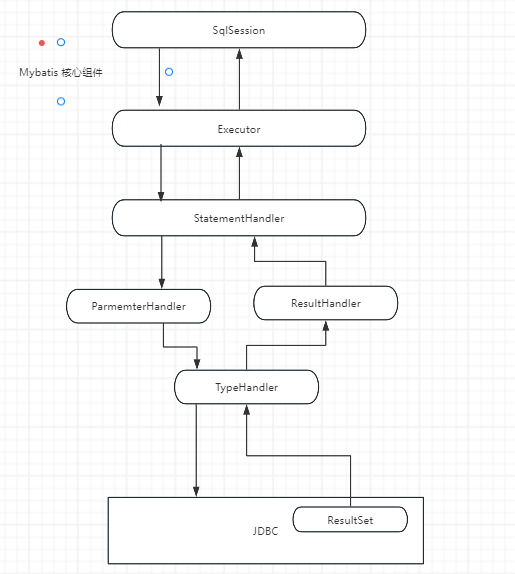
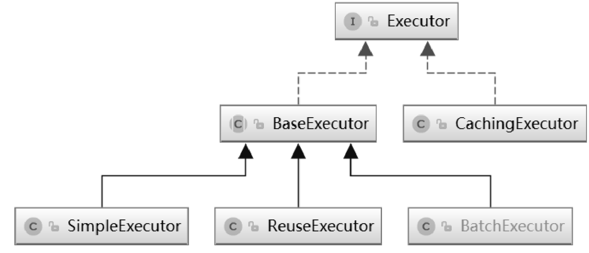
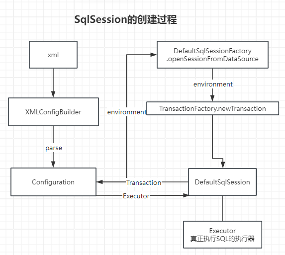
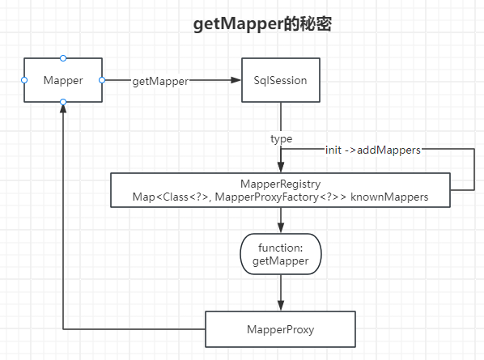

# 深入解读Mybatis

## 目录

- [Mybatis的核心组件](#Mybatis的核心组件)
  - [Executor](#Executor)
  - [MappedStatement](#MappedStatement)
  - [StatementHandler](#StatementHandler)
  - [TypeHandler](#TypeHandler)
  - [ParameterHandler](#ParameterHandler)
  - [ResultSetHandler](#ResultSetHandler)
- [SqlSession的创建过程](#SqlSession的创建过程)
  - [3个阶段](#3个阶段)
  - [Configuration的创建过程](#Configuration的创建过程)
    - [Configuration的作用](#Configuration的作用)
    - [SqlSession开始创建](#SqlSession开始创建)
- [SqlSession执行Mapper过程](#SqlSession执行Mapper过程)
  - [Mapper接口的注册过程](#Mapper接口的注册过程)
    - [getMapper的秘密](#getMapper的秘密)
  - [Mapper 配置SQL的注册过程](#Mapper-配置SQL的注册过程)
    - [MappedStatement对象的创建及注册过程](#MappedStatement对象的创建及注册过程)
  - [Mapper 方法调用过程](#Mapper-方法调用过程)
    - [MethodSignature对象的创建过程](#MethodSignature对象的创建过程)
    - [ParamNameResolver的处理流程](#ParamNameResolver的处理流程)
    - [开始执行SQL 方法](#开始执行SQL-方法)
  - [SqlSession 执行 Mapper 过程](#SqlSession-执行-Mapper-过程)
    - [SimpleExecutor实现细节](#SimpleExecutor实现细节)
    - [StatementHandler实现细节](#StatementHandler实现细节)

### Mybatis的核心组件

Mybatis核心就是对JDBC进行了封装，说到底就是帮助我们简化JDBC的操作，所以他必然目的就是跟直接跟JDBC交流。为了更高的扩展性，Mybatis可是用尽了浑身解数了，将JDBC的操作封装了8个核心组件。



接下来我们先了解了解Mybatis提供的八大组件，为我们后面的手写Mybatis做个铺垫

#### Executor

SqlSession是MyBatis提供的操作数据库的API，但是真正执行SQL的是Executor组件。Executor接口中定义了对数据库的增删改查方法，其中query()和queryCursor()方法用于执行查询操作，update()方法用于执行插入、删除、修改操作。



- &#x20;BaseExecutor中定义的方法的执行流程及通用的处理逻辑，具体的方法由子类来实现，是典型的模板方法模式的应用
- SimpleExecutor是基础的Executor，能够完成基本的增删改查操作
- ResueExecutor对JDBC中的Statement对象做了缓存，当执行相同的SQL语句时，直接从缓存中取出Statement对象进行复用，避免了频繁创建和销毁Statement对象，从而提升系统性能，这是享元思想的应用。
- BatchExecutor则会对调用同一个Mapper执行的update、insert和delete操作，调用Statement对象的批量操作功能

Mybatis作为一款优秀的持久层框架，在国内Java开发领域具有广泛的应用。它不仅简化了数据库操作，提高了开发效率，还提供了灵活的映射规则和插件机制。然而，你是否曾想过，Mybatis背后的原理究竟是什么？它是如何实现SQL的动态绑定、参数映射、结果集映射等功能的呢？

想要循序渐进地了解Mybatis的层层复杂架构，我们必须先了解他的目的是什么？没错，刚刚介绍了目的在于**简化了数据库操作，提高了开发效率，还提供了灵活的映射规则和插件机制**，所以我们所有的行为最终的目标是要做到最大的简化数据库操作，并使得其更好地拓展。

#### MappedStatement

用于描述SQL配置信息，MyBatis框架启动时，XML文件或者注解配置的SQL信息会被转换为MappedStatement对象注册到Configuration组件中。

#### StatementHandler

StatementHandler组件封装了对JDBC Statement的操作，例如设置Statement对象的fetchSize属性、设置查询超时时间、调用JDBC Statement与数据库交互等。

#### TypeHandler

类型处理器，用于Java类型与JDBC类型之间的转换。

#### ParameterHandler

当使用PreparedStatement或者CallableStatement对象时，如果SQL语句中有参数占位符，在执行SQL语句之前，就需要为参数占位符设置值。ParameterHandler的作用是在PreparedStatementHandler和CallableStatementHandler操作对应的Statement执行数据库交互之前为参数占位符设置值。

#### ResultSetHandler

ResultSetHandler用于在StatementHandler对象执行完查询操作或存储过程后，对结果集或存储过程的执行结果进行处理。

## SqlSession的创建过程

### 3个阶段

1. Configuration实例的创建过程
2. SqlSessionFactory实例的创建过程
3. SqlSession实例化的过程

### Configuration的创建过程

Configuration是用于注册配置处理器并存储配置信息的，这些配置信息有环境信息，Mapper信息，所以SqlSession的创建离不开Configuration中的配置信息的。

#### Configuration的作用

- 用于描述MyBatis配置信息，例如\<settings>标签配置的参数信息。
- 作为容器注册MyBatis其他组件，例如TypeHandler、MappedStatement等。
- 提供工厂方法，创建ResultSetHandler、StatementHandler、Executor、ParameterHandler等组件实例

而通常我们会将mapper，环境等信息以xml的形式书写，所以解析xml必然是Configuration创建最开始干的事

当然Mybatis将解析xml的方法进行了封装，封装成了XMLConfigBuilder类，我们只需要将用该类的parse方法，就会将配置解析成对应的Configuration进行返回了

```java
public Configuration parse() {
        if (this.parsed) {
            throw new BuilderException("Each XMLConfigBuilder can only be used once.");
        } else {
            this.parsed = true;
            this.parseConfiguration(this.parser.evalNode("/configuration"));
            return this.configuration;
        }
    }
```

MyBatis框架启动后，首先创建Configuration对象，然后解析所有配置信息，将解析后的配置信息存放在Configuration对象中。

#### SqlSession开始创建

MyBatis中的SqlSession实例使用工厂模式创建，所以在创建SqlSession实例之前需要先创建SqlSessionFactory工厂对象，然后调用SqlSessionFactory对象的openSession()方法

而SqlSessionFactory是由SqlSessionFactoryBuilder来创建的

```java
public SqlSessionFactory build(Reader reader, String environment, Properties properties) {
        SqlSessionFactory var5;
        try {
            XMLConfigBuilder parser = new XMLConfigBuilder(reader, environment, properties);
            var5 = this.build(parser.parse());
        } catch (Exception var14) {
            Exception e = var14;
            throw ExceptionFactory.wrapException("Error building SqlSession.", e);
        } finally {
            ErrorContext.instance().reset();

            try {
                if (reader != null) {
                    reader.close();
                }
            } catch (IOException var13) {
            }

        }

        return var5;
    }
```

指向的build方法就是创建一个DefaultSessionFactory

```java
    public SqlSessionFactory build(Configuration config) {
        return new DefaultSqlSessionFactory(config);
    }

```

接下来通过DefaultSqlSessionFactory的openSession方法便能解密SqlSession的创建过程了

而DefaultSqlSessionFactory的openSession方法的实现如下：

```java
public SqlSession openSession() {
        return this.openSessionFromDataSource(this.configuration.getDefaultExecutorType(), (TransactionIsolationLevel)null, false);
}

```

而openSessionFromDataSource的实现如下：

```java
private SqlSession openSessionFromDataSource(ExecutorType execType, TransactionIsolationLevel level, boolean autoCommit) {
        Transaction tx = null;

        DefaultSqlSession var8;
        try {
            // 获取Mybatis主配置文件配置的环境，Environment信息会经过xml解析并将可用的配置信息存至Configuration中
            Environment environment = this.configuration.getEnvironment();
            // 创建事务管理器工厂
            TransactionFactory transactionFactory = this.getTransactionFactoryFromEnvironment(environment);
            tx = transactionFactory.newTransaction(environment.getDataSource(), level, autoCommit);
            // Configuration既是管理配置信息的，也是某些配置的工厂类
            Executor executor = this.configuration.newExecutor(tx, execType);
            var8 = new DefaultSqlSession(this.configuration, executor, autoCommit);
        } catch (Exception var12) {
            Exception e = var12;
            this.closeTransaction(tx);
            throw ExceptionFactory.wrapException("Error opening session.  Cause: " + e, e);
        } finally {
            ErrorContext.instance().reset();
        }

        return var8;
    }

```

上面的实现首先通过Configuration对象获取MyBatis主配置文件中通过\<environment>标签配置的环境信息，然后根据配置的事务管理器类型创建对应的事务管理器工厂。

MyBatis提供了两种事务管理器，分别为JdbcTransaction和ManagedTransaction。其中，JdbcTransaction是使用JDBC中的Connection对象实现事务管理的，而ManagedTransaction表示事务由外部容器管理。

DefaultSqlSession对象中持有Executor对象的引用，真正执行SQL操作的是Executor对象。



## SqlSession执行Mapper过程

执行Mapper过程可以分成4个阶段

1. Mapper接口的注册过程
2. MapperStatement对象的注册过程
3. Mapper方法的调用过程
4. SqlSession调用Mapper的过程

### Mapper接口的注册过程

不妨来看看Mapper调用的过程，整个过程就是将xml我们配置的文件信息通过加载成流的方式进行SqlSession的构建，通过SqlSession中的内置方法getMapper来获取映射对象，为什么通过getMapper就能拿到对应的映射器对象呢？

```java
 // 1. 从SqlSessionFactory中获取SqlSession
 Reader reader = Resources.getResourceAsReader("mybatis-config-datasources.xml");
 SessionFactory sqlSessionFactory = new SqlSessionFactoryBuilder().build(reader);
 SqlSession sqlSession = sqlSessionFactory.openSession();
 // 2. 获取映射器对象
 IUserDao userDao = sqlSession.getMapper(IUserDao.class);
```

#### getMapper的秘密

Session提供的getMapper方法实则是调用了configuration的getMapper方法，而configuration是从MapperRegistry Mapper注册器中获取的，具体代码如下

```java
 public <T> T getMapper(Class<T> type, SqlSession sqlSession) {
    final MapperProxyFactory<T> mapperProxyFactory = (MapperProxyFactory) knownMappers.get(type);
    if (mapperProxyFactory == null) {
      throw new BindingException("Type " + type + " is not known to the MapperRegistry.");
    }
    try {
      return mapperProxyFactory.newInstance(sqlSession);
    } catch (Exception e) {
      throw new BindingException("Error getting mapper instance. Cause: " + e, e);
    }
  }
```

可以发现的是Mapper是通过我们传入的Class 类型到knownMappers中去找，找对应的工厂，从这里我们大概可以猜到的是：

Mybatis将Class类型和Mapper工厂绑定到一起组成一个Map类型存在内存中了，然后我们调用的时候就从这里获取，后面就通过代理工厂mapperProxyFactory.newInstance(sqlSession)直接帮助我们实例化具体的类了，

当然往上看看，看到这个证明我们猜对了

```java
private final Map<Class<?>, MapperProxyFactory<?>> knownMappers = new HashMap<>();
```

不妨再努努力看看他是如何将信息存至knownMappers 的呢

```java
public <T> void addMapper(Class<T> type) {
    if (type.isInterface()) {
      if (hasMapper(type)) {
        throw new BindingException("Type " + type + " is already known to the MapperRegistry.");
      }
      boolean loadCompleted = false;
      try {
        knownMappers.put(type, new MapperProxyFactory<>(type));
        // It's important that the type is added before the parser is run
        // otherwise the binding may automatically be attempted by the
        // mapper parser. If the type is already known, it won't try.
        MapperAnnotationBuilder parser = new MapperAnnotationBuilder(config, type);
        parser.parse();
        loadCompleted = true;
      } finally {
        if (!loadCompleted) {
          knownMappers.remove(type);
        }
      }
    }
  }
  
  
   /**
   * @since 3.2.2
   */
  public void addMappers(String packageName, Class<?> superType) {
    ResolverUtil<Class<?>> resolverUtil = new ResolverUtil<>();
    resolverUtil.find(new ResolverUtil.IsA(superType), packageName);
    Set<Class<? extends Class<?>>> mapperSet = resolverUtil.getClasses();
    for (Class<?> mapperClass : mapperSet) {
      addMapper(mapperClass);
    }
  }

```

MyBatis框架在应用启动时会解析所有的Mapper接口，然后调用MapperRegistry对象的addMapper()方法将Mapper接口信息和对应的MapperProxyFactory对象注册到MapperRegistry对象中



### Mapper 配置SQL的注册过程

MyBatis通过MappedStatement类描述Mapper的SQL配置信息。SQL配置有两种方式：一种是通过XML文件配置；另一种是通过Java注解，而Java注解的本质就是一种轻量级的配置信息。

在Configuration中存在着这么个Map，该属性用于注册MyBatis中所有的MappedStatement对象

```java
 protected final Map<String, MappedStatement> mappedStatements = new StrictMap<MappedStatement>("Mapped Statements collection")
      .conflictMessageProducer((savedValue, targetValue) ->
          ". please check " + savedValue.getResource() + " and " + targetValue.getResource());
```

mappedStatements属性是一个Map对象，它的Key为MapperSQL配置的Id，如果SQL是通过XML配置的，则Id为命名空间加上\<select|update|delete|insert>标签的Id，如果SQL通过Java注解配置，则Id为Mapper接口的完全限定名（包括包名）加上方法名称。

当然在Configuration中也提供了添加MappedStatement的方法

```java
  public void addMappedStatement(MappedStatement ms) {
    mappedStatements.put(ms.getId(), ms);
  }

```

#### MappedStatement对象的创建及注册过程

MappedStatement对象创建莫过于解析我们写在xml或者写在注解上的SQL 信息成MappedStatement对象，解析xml中，关键在于\<mappers>的元素解析，\<mappers>标签是通过XMLConfigBuilder类的mapperElement()方法来解析的。

```java
    
/**
  可以对照着这个mappers配置信息进行源码阅读
  <mappers>
    <mapper resource="org/mybatis/builder/AuthorMapper.xml"/>
    <mapper resource="org/mybatis/builder/BlogMapper.xml"/>
    <mapper resource="org/mybatis/builder/PostMapper.xml"/>
    <package name="org.mybatis.builder"/>
  </mappers>
*/
private void mappersElement(XNode context) throws Exception {
    if (context == null) {
      return;
    }
    for (XNode child : context.getChildren()) {
      //通过package指定包名
      if ("package".equals(child.getName())) {
        String mapperPackage = child.getStringAttribute("name");
        configuration.addMappers(mapperPackage);
      } else {
    
        String resource = child.getStringAttribute("resource");
        String url = child.getStringAttribute("url");
        String mapperClass = child.getStringAttribute("class");
        //通过resource 指定XML文件路径
        if (resource != null && url == null && mapperClass == null) {
          ErrorContext.instance().resource(resource);
          try (InputStream inputStream = Resources.getResourceAsStream(resource)) {
            XMLMapperBuilder mapperParser = new XMLMapperBuilder(inputStream, configuration, resource,
                configuration.getSqlFragments());
            mapperParser.parse();
          }
        } else if (resource == null && url != null && mapperClass == null) {
        
          ErrorContext.instance().resource(url);
          try (InputStream inputStream = Resources.getUrlAsStream(url)) {
            XMLMapperBuilder mapperParser = new XMLMapperBuilder(inputStream, configuration, url,
                configuration.getSqlFragments());
            mapperParser.parse();
          }
        } else if (resource == null && url == null && mapperClass != null) {
          //通过class指定接口的完全限定名
          Class<?> mapperInterface = Resources.classForName(mapperClass);
          configuration.addMapper(mapperInterface);
        } else {
          throw new BuilderException(
              "A mapper element may only specify a url, resource or class, but not more than one.");
        }
      }
    }
  }

```

注意这段代码，这里会创建XMLMapperBuilder来进行进一步的元素抽取

```java
 XMLMapperBuilder mapperParser = new XMLMapperBuilder(inputStream, configuration, url,
                configuration.getSqlFragments());
            mapperParser.parse();
```

跟踪进去便可以发现，他其实是对mapper下的元素进行处理了

```java
  public void parse() {
    if (!configuration.isResourceLoaded(resource)) {
      configurationElement(parser.evalNode("/mapper"));
      configuration.addLoadedResource(resource);
      bindMapperForNamespace();
    }
    configuration.parsePendingResultMaps(false);
    configuration.parsePendingCacheRefs(false);
    configuration.parsePendingStatements(false);
  }
```

这里面便是我们平时写在xml上的SQL处理了

```java
  private void configurationElement(XNode context) {
    try {
    //获取命名空间
      String namespace = context.getStringAttribute("namespace");
      if (namespace == null || namespace.isEmpty()) {
        throw new BuilderException("Mapper's namespace cannot be empty");
      }
      builderAssistant.setCurrentNamespace(namespace);
      cacheRefElement(context.evalNode("cache-ref"));
      cacheElement(context.evalNode("cache"));
      parameterMapElement(context.evalNodes("/mapper/parameterMap"));
      //解析resultMap标签
      resultMapElements(context.evalNodes("/mapper/resultMap"));
      //解析SQL 标签
      sqlElement(context.evalNodes("/mapper/sql"));
      buildStatementFromContext(context.evalNodes("select|insert|update|delete"));
    } catch (Exception e) {
      throw new BuilderException("Error parsing Mapper XML. The XML location is '" + resource + "'. Cause: " + e, e);
    }
  }
```

其实我们比较关注的当然是他是如何解析我们的SQL 语句的，代码显示他是调用了buildStatementFromContext这个方法的

```java
  private void buildStatementFromContext(List<XNode> list, String requiredDatabaseId) {
    for (XNode context : list) {
      final XMLStatementBuilder statementParser = new XMLStatementBuilder(configuration, builderAssistant, context,
          requiredDatabaseId);
      try {
        statementParser.parseStatementNode();
      } catch (IncompleteElementException e) {
        configuration.addIncompleteStatement(statementParser);
      }
    }
  }
```

原来SQL 交给了XMLStatementBuilder 来处理了，并调用了其parseStatementNode方法，虽然这里兜兜转转的，但是其实想想确实是合理的，各个类各施其职，这样不仅好维护，代码结构也十分清晰，跟踪进去之后，对sql 的核心处理逻辑就在这里了

```java
 public void parseStatementNode() {
    String id = context.getStringAttribute("id");
    String databaseId = context.getStringAttribute("databaseId");

    if (!databaseIdMatchesCurrent(id, databaseId, this.requiredDatabaseId)) {
      return;
    }

    String nodeName = context.getNode().getNodeName();
    SqlCommandType sqlCommandType = SqlCommandType.valueOf(nodeName.toUpperCase(Locale.ENGLISH));
    boolean isSelect = sqlCommandType == SqlCommandType.SELECT;
    boolean flushCache = context.getBooleanAttribute("flushCache", !isSelect);
    boolean useCache = context.getBooleanAttribute("useCache", isSelect);
    boolean resultOrdered = context.getBooleanAttribute("resultOrdered", false);

    // Include Fragments before parsing
    XMLIncludeTransformer includeParser = new XMLIncludeTransformer(configuration, builderAssistant);
    includeParser.applyIncludes(context.getNode());

    String parameterType = context.getStringAttribute("parameterType");
    Class<?> parameterTypeClass = resolveClass(parameterType);

    String lang = context.getStringAttribute("lang");
    LanguageDriver langDriver = getLanguageDriver(lang);

    // Parse selectKey after includes and remove them.
    processSelectKeyNodes(id, parameterTypeClass, langDriver);

    // Parse the SQL (pre: <selectKey> and <include> were parsed and removed)
    KeyGenerator keyGenerator;
    String keyStatementId = id + SelectKeyGenerator.SELECT_KEY_SUFFIX;
    keyStatementId = builderAssistant.applyCurrentNamespace(keyStatementId, true);
    if (configuration.hasKeyGenerator(keyStatementId)) {
      keyGenerator = configuration.getKeyGenerator(keyStatementId);
    } else {
      keyGenerator = context.getBooleanAttribute("useGeneratedKeys",
          configuration.isUseGeneratedKeys() && SqlCommandType.INSERT.equals(sqlCommandType))
              ? Jdbc3KeyGenerator.INSTANCE : NoKeyGenerator.INSTANCE;
    }

    SqlSource sqlSource = langDriver.createSqlSource(configuration, context, parameterTypeClass);
    StatementType statementType = StatementType
        .valueOf(context.getStringAttribute("statementType", StatementType.PREPARED.toString()));
    Integer fetchSize = context.getIntAttribute("fetchSize");
    Integer timeout = context.getIntAttribute("timeout");
    String parameterMap = context.getStringAttribute("parameterMap");
    String resultType = context.getStringAttribute("resultType");
    Class<?> resultTypeClass = resolveClass(resultType);
    String resultMap = context.getStringAttribute("resultMap");
    if (resultTypeClass == null && resultMap == null) {
      resultTypeClass = MapperAnnotationBuilder.getMethodReturnType(builderAssistant.getCurrentNamespace(), id);
    }
    String resultSetType = context.getStringAttribute("resultSetType");
    ResultSetType resultSetTypeEnum = resolveResultSetType(resultSetType);
    if (resultSetTypeEnum == null) {
      resultSetTypeEnum = configuration.getDefaultResultSetType();
    }
    String keyProperty = context.getStringAttribute("keyProperty");
    String keyColumn = context.getStringAttribute("keyColumn");
    String resultSets = context.getStringAttribute("resultSets");
    boolean dirtySelect = context.getBooleanAttribute("affectData", Boolean.FALSE);

    builderAssistant.addMappedStatement(id, sqlSource, statementType, sqlCommandType, fetchSize, timeout, parameterMap,
        parameterTypeClass, resultMap, resultTypeClass, resultSetTypeEnum, flushCache, useCache, resultOrdered,
        keyGenerator, keyProperty, keyColumn, databaseId, langDriver, resultSets, dirtySelect);
  }

```

代码很长，但是概括起来这段代码做了以下的几件事情

（1）获取\<select|insert|delete|update>标签的所有属性信息。

（2）将\<include>标签引用的SQL片段替换为对应的\<sql>标签中定义的内容。

（3）获取lang属性指定的LanguageDriver，通过LanguageDriver创建SqlSource。MyBatis中的SqlSource表示一个SQL资源，后面章节中会对SqlSource做更详细的介绍。

（4）获取KeyGenerator对象。KeyGenerator的不同实例代表不同的主键生成策略。

（5）所有解析工作完成后，使用MapperBuilderAssistant对象的addMappedStatement()方法创建MappedStatement对象。创建完成后，调用Configuration对象的addMappedStatement()方法将MappedStatement对象注册到Configuration对象中。

这样 MappedStatement 对象的配置就算是完成了

### Mapper 方法调用过程

以往节我们清楚了getMapper是通过动态代理的方式来创建对应接口的代理对象

```java
SqlSession sqlSession = sqlSessionFactory.openSession();
 // 2. 获取映射器对象
 IUserDao userDao = sqlSession.getMapper(IUserDao.class);
```

```java
 public <T> T getMapper(Class<T> type, SqlSession sqlSession) {
    final MapperProxyFactory<T> mapperProxyFactory = (MapperProxyFactory) knownMappers.get(type);
    if (mapperProxyFactory == null) {
      throw new BindingException("Type " + type + " is not known to the MapperRegistry.");
    }
    try {
      return mapperProxyFactory.newInstance(sqlSession);
    } catch (Exception e) {
      throw new BindingException("Error getting mapper instance. Cause: " + e, e);
    }
  }
```

那么代理当中做了什么呢？

由于是实现的JDK提供的代理，所以我们需要到MapperProxy中查看invoke干了什么就行了。

```java
@Override
  public Object invoke(Object proxy, Method method, Object[] args) throws Throwable {
    try {
      //Object类型的 不做处理
      if (Object.class.equals(method.getDeclaringClass())) {
        return method.invoke(this, args);
      }
      return cachedInvoker(method).invoke(proxy, method, args, sqlSession);
    } catch (Throwable t) {
      throw ExceptionUtil.unwrapThrowable(t);
    }
  }
```

其中这么一段代码为的就是排除toString(),equals()这些直接来自于Object的方法，因为Java中的对象基本上都是继承与Object的，所以如果是这类Object的原生方法，则是不需要再做处理，直接调用即可。否则会进行cachedInvoker做额外的调用，比如查询数据库的接口方法。

```java
  if (Object.class.equals(method.getDeclaringClass())) {
        return method.invoke(this, args);
      }
```

而cachedInvoker则是创建并缓存MapperMethodInvoker实例，这些实例用于调用Mybatis映射器接口中定义的方法。

```java
 private MapperMethodInvoker cachedInvoker(Method method) throws Throwable {
    try {
      return MapUtil.computeIfAbsent(methodCache, method, m -> {
        if (!m.isDefault()) {
          return new PlainMethodInvoker(new MapperMethod(mapperInterface, method, sqlSession.getConfiguration()));
        }
        try {
          if (privateLookupInMethod == null) {
            return new DefaultMethodInvoker(getMethodHandleJava8(method));
          }
          return new DefaultMethodInvoker(getMethodHandleJava9(method));
        } catch (IllegalAccessException | InstantiationException | InvocationTargetException
            | NoSuchMethodException e) {
          throw new RuntimeException(e);
        }
      });
    } catch (RuntimeException re) {
      Throwable cause = re.getCause();
      throw cause == null ? re : cause;
    }
  }

```

从这段代码我们看到了他其实有new 一个MapperMethod&#x20;

```java
  public MapperMethod(Class<?> mapperInterface, Method method, Configuration config) {
    this.command = new SqlCommand(config, mapperInterface, method);
    this.method = new MethodSignature(config, mapperInterface, method);
  }

```

在MapperMethod构造方法中创建了一个SqlCommand对象和一个MethodSignature对象：SqlCommand对象用于获取SQL语句的类型、Mapper的Id等信息；MethodSignature对象用于获取方法的签名信息，例如Mapper方法的参数名、参数注解等信息。

那么接下来我们就需要解密SqlCommand和MethodSignature都做了些什么

首先是SqlCommand，SqlCommoand中存储了对应的sql语句和sql 类型

```java
public static class SqlCommand {

    private final String name; //Mapper ID
    private final SqlCommandType type; //SQL 类型

    public SqlCommand(Configuration configuration, Class<?> mapperInterface, Method method) {
      final String methodName = method.getName();
      final Class<?> declaringClass = method.getDeclaringClass();
      MappedStatement ms = resolveMappedStatement(mapperInterface, methodName, declaringClass, configuration);
      if (ms == null) {
        if (method.getAnnotation(Flush.class) == null) {
          throw new BindingException(
              "Invalid bound statement (not found): " + mapperInterface.getName() + "." + methodName);
        }
        name = null;
        type = SqlCommandType.FLUSH;
      } else {
        name = ms.getId();
        type = ms.getSqlCommandType();
        if (type == SqlCommandType.UNKNOWN) {
          throw new BindingException("Unknown execution method for: " + name);
        }
      }
    }
    。。。
 }

```

而resolveMappedStatement是为了根据Mapper接口的完全限定名和方法名获取对应的MappedStatement对象

```java

    private MappedStatement resolveMappedStatement(Class<?> mapperInterface, String methodName, Class<?> declaringClass,
        Configuration configuration) {
      String statementId = mapperInterface.getName() + "." + methodName;
      if (configuration.hasStatement(statementId)) {
        return configuration.getMappedStatement(statementId);
      }
      if (mapperInterface.equals(declaringClass)) {
        return null;
      }
      //如果方法是在Mapper父接口定义的，则根据父接口获取对应的MappedStatement对象
      for (Class<?> superInterface : mapperInterface.getInterfaces()) {
        if (declaringClass.isAssignableFrom(superInterface)) {
          MappedStatement ms = resolveMappedStatement(superInterface, methodName, declaringClass, configuration);
          if (ms != null) {
            return ms;
          }
        }
      }
      return null;
    }
  }
```

以上代码首先将接口的完全限定名和方法名进行拼接，作为Mapper的Id从Configuration对象中查找对应的MappedStatement对象，如果查找不到，则判断该方法是否是从父接口中继承的，如果是，就以父接口作为参数递归调用resolveMappedStatement()方法，若找到对应的MappedStatement对象，则返回该对象，否则返回null。

#### MethodSignature对象的创建过程

MethodSignature对象在创建时主要完成了以下三件事情

1. 获取Mapper方法的返回值类型，具体是哪种类型，通过boolean类型的属性进行标记。例如，当返回值类型为void时，returnsVoid属性值为true，当返回值类型为List时，将returnsMap属性值设置为true。
   ```java

       private final boolean returnsMany;
       private final boolean returnsMap;
       private final boolean returnsVoid;
       private final boolean returnsCursor;
       private final boolean returnsOptional;
   ```
2. 记录RowBounds参数位置，用于处理后续的分页查询，同时记录ResultHandler参数位置，用于处理从数据库中检索的每一行数据。
   ```java
       private Integer getUniqueParamIndex(Method method, Class<?> paramType) {
         Integer index = null;
         final Class<?>[] argTypes = method.getParameterTypes();
         for (int i = 0; i < argTypes.length; i++) {
           if (paramType.isAssignableFrom(argTypes[i])) {
             if (index != null) {
               throw new BindingException(
                   method.getName() + " cannot have multiple " + paramType.getSimpleName() + " parameters");
             }
             index = i;
           }
         }
         return index;
       }
   ```
3. 创建ParamNameResolver对象。ParamNameResolver对象用于解析Mapper方法中的参数名称及参数注解信息。

具体代码如下：

```java
public MethodSignature(Configuration configuration, Class<?> mapperInterface, Method method) {
      //获取返回数据类型
      Type resolvedReturnType = TypeParameterResolver.resolveReturnType(method, mapperInterface);
      if (resolvedReturnType instanceof Class<?>) {
        this.returnType = (Class<?>) resolvedReturnType;
      } else if (resolvedReturnType instanceof ParameterizedType) {
        this.returnType = (Class<?>) ((ParameterizedType) resolvedReturnType).getRawType();
      } else {
        this.returnType = method.getReturnType();
      }
      //返回的类型为void
      this.returnsVoid = void.class.equals(this.returnType);
      //返回的类型为集合
      this.returnsMany = configuration.getObjectFactory().isCollection(this.returnType) || this.returnType.isArray();
      //返回的类型为Cursor
      this.returnsCursor = Cursor.class.equals(this.returnType);
      //返回的类型为Optional
      this.returnsOptional = Optional.class.equals(this.returnType);
      //返回的类型为map
      this.mapKey = getMapKey(method);
      this.returnsMap = this.mapKey != null;
      this.rowBoundsIndex = getUniqueParamIndex(method, RowBounds.class);
      this.resultHandlerIndex = getUniqueParamIndex(method, ResultHandler.class);
      //解析maper方法参数
      this.paramNameResolver = new ParamNameResolver(configuration, method);
    }
```

#### ParamNameResolver的处理流程

ParamNameResolver是用于mapper方法的参数解析的，具体实现如下：

```java
 public ParamNameResolver(Configuration config, Method method) {
    this.useActualParamName = config.isUseActualParamName();
    final Class<?>[] paramTypes = method.getParameterTypes();
    // 获取所有参数注解
    final Annotation[][] paramAnnotations = method.getParameterAnnotations();
    final SortedMap<Integer, String> map = new TreeMap<>();
    int paramCount = paramAnnotations.length;
    // 从@Param注解中获取参数名称
    for (int paramIndex = 0; paramIndex < paramCount; paramIndex++) {
      if (isSpecialParameter(paramTypes[paramIndex])) {
        continue;
      }
      String name = null;
      for (Annotation annotation : paramAnnotations[paramIndex]) {
        //方法中是有含有Param注解
        if (annotation instanceof Param) {
          hasParamAnnotation = true;
          //获取参数名称
          name = ((Param) annotation).value();
          break;
        }
      }
      if (name == null) {
        // @Param was not specified.
        if (useActualParamName) {
          name = getActualParamName(method, paramIndex);
        }
        if (name == null) {
          // use the parameter index as the name ("0", "1", ...)
          // gcode issue #71
          name = String.valueOf(map.size());
        }
      }
      map.put(paramIndex, name);
    }
    names = Collections.unmodifiableSortedMap(map);
  }
```

在ParamNameResolver构造方法中，对所有Mapper方法的所有参数信息进行遍历，首先判断参数中是否有@Param注解，如果包含@Param注解，就从注解中获取参数名称，如果参数中没有@Param注解，就根据MyBatis主配置文件中的useActualParamName参数确定是否获取实际方法定义的参数名称，若useActualParamName参数值为true，则使用方法定义的参数名称。解析完毕后，将参数信息保存在一个不可修改的names属性中，该属性是一个SortedMap\<Integer, String>类型的对象。

至此，SqlSession执行Mapper的注册过程已经完成，纵观全局，其实这个过程无非是在为Configuration收集信息，为下一步执行SQL方法做准备。

#### 开始执行SQL 方法

不妨我们再次回首，看看MapperProxy 中是如何处理invoke的 ，显然核心逻辑是在 cachedInvoker(method).invoke(proxy, method, args, sqlSession)这里

```java
@Override
  public Object invoke(Object proxy, Method method, Object[] args) throws Throwable {
    try {
      if (Object.class.equals(method.getDeclaringClass())) {
        return method.invoke(this, args);
      }
      return cachedInvoker(method).invoke(proxy, method, args, sqlSession);
    } catch (Throwable t) {
      throw ExceptionUtil.unwrapThrowable(t);
    }
  }

```

&#x20;MapperProxy 提供了 MapperMethodInvoker →invoke 方法来执行调用MapperMethod 的execute方法

```java
  interface MapperMethodInvoker {
    Object invoke(Object proxy, Method method, Object[] args, SqlSession sqlSession) throws Throwable;
  }

  private static class PlainMethodInvoker implements MapperMethodInvoker {
    private final MapperMethod mapperMethod;

    public PlainMethodInvoker(MapperMethod mapperMethod) {
      this.mapperMethod = mapperMethod;
    }

    @Override
    public Object invoke(Object proxy, Method method, Object[] args, SqlSession sqlSession) throws Throwable {
      return mapperMethod.execute(sqlSession, args);
    }
  }

  private static class DefaultMethodInvoker implements MapperMethodInvoker {
    private final MethodHandle methodHandle;

    public DefaultMethodInvoker(MethodHandle methodHandle) {
      this.methodHandle = methodHandle;
    }

    @Override
    public Object invoke(Object proxy, Method method, Object[] args, SqlSession sqlSession) throws Throwable {
      return methodHandle.bindTo(proxy).invokeWithArguments(args);
    }
  }
```

好了，接下来我们就可以追踪到MapperMethod 的execute方法了

```java
   private final SqlCommand command;
  private final MethodSignature method;

  public MapperMethod(Class<?> mapperInterface, Method method, Configuration config) {
    this.command = new SqlCommand(config, mapperInterface, method);
    this.method = new MethodSignature(config, mapperInterface, method);
  }

 
 public Object execute(SqlSession sqlSession, Object[] args) {
    Object result;
    // 获取SQL 类型
    switch (command.getType()) {
      case INSERT: {
        //获取参数信息
        Object param = method.convertArgsToSqlCommandParam(args);
        //调用sqlSession的insert 方法 ， 然后调用rowCountResult()方法统计行数
        result = rowCountResult(sqlSession.insert(command.getName(), param));
        break;
      }
      case UPDATE: {
        // 调用SqlSession对象的update()方法
        Object param = method.convertArgsToSqlCommandParam(args);
        result = rowCountResult(sqlSession.update(command.getName(), param));
        break;
      }
      case DELETE: {
        Object param = method.convertArgsToSqlCommandParam(args);
        result = rowCountResult(sqlSession.delete(command.getName(), param));
        break;
      }
      case SELECT:
        //判断返回类型
        if (method.returnsVoid() && method.hasResultHandler()) {
          executeWithResultHandler(sqlSession, args);
          result = null;
        } else if (method.returnsMany()) {
          result = executeForMany(sqlSession, args);
        } else if (method.returnsMap()) {
          result = executeForMap(sqlSession, args);
        } else if (method.returnsCursor()) {
          result = executeForCursor(sqlSession, args);
        } else {
          Object param = method.convertArgsToSqlCommandParam(args);
          result = sqlSession.selectOne(command.getName(), param);
          if (method.returnsOptional() && (result == null || !method.getReturnType().equals(result.getClass()))) {
            result = Optional.ofNullable(result);
          }
        }
        break;
      case FLUSH:
        result = sqlSession.flushStatements();
        break;
      default:
        throw new BindingException("Unknown execution method for: " + command.getName());
    }
    if (result == null && method.getReturnType().isPrimitive() && !method.returnsVoid()) {
      throw new BindingException("Mapper method '" + command.getName()
          + "' attempted to return null from a method with a primitive return type (" + method.getReturnType() + ").");
    }
    return result;
  }
```

总结：Mapper的调用就是通过动态代理将Mapper方法的调用转换为调用SqlSession提供的增删改查方法，以Mapper的Id作为参数，执行数据库的增删改查操作

### SqlSession 执行 Mapper 过程

观察一下MapperMethod 的execute方法,可以发现在这里是通过执行sqlSession的insert，selectOned等方法来执行SQL返回结果的

```java
public Object execute(SqlSession sqlSession, Object[] args) {
    Object result;
    switch (command.getType()) {
      case INSERT: {
        Object param = method.convertArgsToSqlCommandParam(args);
        result = rowCountResult(sqlSession.insert(command.getName(), param));
        break;
      }
      case UPDATE: {
        Object param = method.convertArgsToSqlCommandParam(args);
        result = rowCountResult(sqlSession.update(command.getName(), param));
        break;
      }
      case DELETE: {
        Object param = method.convertArgsToSqlCommandParam(args);
        result = rowCountResult(sqlSession.delete(command.getName(), param));
        break;
      }
      case SELECT:
        if (method.returnsVoid() && method.hasResultHandler()) {
          executeWithResultHandler(sqlSession, args);
          result = null;
        } else if (method.returnsMany()) {
          result = executeForMany(sqlSession, args);
        } else if (method.returnsMap()) {
          result = executeForMap(sqlSession, args);
        } else if (method.returnsCursor()) {
          result = executeForCursor(sqlSession, args);
        } else {
          Object param = method.convertArgsToSqlCommandParam(args);
          result = sqlSession.selectOne(command.getName(), param);
          if (method.returnsOptional() && (result == null || !method.getReturnType().equals(result.getClass()))) {
            result = Optional.ofNullable(result);
          }
        }
        break;
      case FLUSH:
        result = sqlSession.flushStatements();
        break;
      default:
        throw new BindingException("Unknown execution method for: " + command.getName());
    }
    if (result == null && method.getReturnType().isPrimitive() && !method.returnsVoid()) {
      throw new BindingException("Mapper method '" + command.getName()
          + "' attempted to return null from a method with a primitive return type (" + method.getReturnType() + ").");
    }
    return result;
  }
```

所以执行Mapper的过程，我们应该把注意力放在Session接口方法的调用过程

```java
public interface SqlSession extends Closeable {

  /**
   * Retrieve a single row mapped from the statement key.
   *
   * @param <T>
   *          the returned object type
   * @param statement
   *          the statement
   *
   * @return Mapped object
   */
  <T> T selectOne(String statement);

  /**
   * Retrieve a single row mapped from the statement key and parameter.
   *
   * @param <T>
   *          the returned object type
   * @param statement
   *          Unique identifier matching the statement to use.
   * @param parameter
   *          A parameter object to pass to the statement.
   *
   * @return Mapped object
   */
  <T> T selectOne(String statement, Object parameter);

  /**
   * Retrieve a list of mapped objects from the statement key.
   *
   * @param <E>
   *          the returned list element type
   * @param statement
   *          Unique identifier matching the statement to use.
   *
   * @return List of mapped object
   */
  <E> List<E> selectList(String statement);

  /**
   * Retrieve a list of mapped objects from the statement key and parameter.
   *
   * @param <E>
   *          the returned list element type
   * @param statement
   *          Unique identifier matching the statement to use.
   * @param parameter
   *          A parameter object to pass to the statement.
   *
   * @return List of mapped object
   */
  <E> List<E> selectList(String statement, Object parameter);

  /**
   * Retrieve a list of mapped objects from the statement key and parameter, within the specified row bounds.
   *
   * @param <E>
   *          the returned list element type
   * @param statement
   *          Unique identifier matching the statement to use.
   * @param parameter
   *          A parameter object to pass to the statement.
   * @param rowBounds
   *          Bounds to limit object retrieval
   *
   * @return List of mapped object
   */
  <E> List<E> selectList(String statement, Object parameter, RowBounds rowBounds);

  /**
   * The selectMap is a special case in that it is designed to convert a list of results into a Map based on one of the
   * properties in the resulting objects. Eg. Return a of Map[Integer,Author] for selectMap("selectAuthors","id")
   *
   * @param <K>
   *          the returned Map keys type
   * @param <V>
   *          the returned Map values type
   * @param statement
   *          Unique identifier matching the statement to use.
   * @param mapKey
   *          The property to use as key for each value in the list.
   *
   * @return Map containing key pair data.
   */
  <K, V> Map<K, V> selectMap(String statement, String mapKey);

  /**
   * The selectMap is a special case in that it is designed to convert a list of results into a Map based on one of the
   * properties in the resulting objects.
   *
   * @param <K>
   *          the returned Map keys type
   * @param <V>
   *          the returned Map values type
   * @param statement
   *          Unique identifier matching the statement to use.
   * @param parameter
   *          A parameter object to pass to the statement.
   * @param mapKey
   *          The property to use as key for each value in the list.
   *
   * @return Map containing key pair data.
   */
  <K, V> Map<K, V> selectMap(String statement, Object parameter, String mapKey);

  /**
   * The selectMap is a special case in that it is designed to convert a list of results into a Map based on one of the
   * properties in the resulting objects.
   *
   * @param <K>
   *          the returned Map keys type
   * @param <V>
   *          the returned Map values type
   * @param statement
   *          Unique identifier matching the statement to use.
   * @param parameter
   *          A parameter object to pass to the statement.
   * @param mapKey
   *          The property to use as key for each value in the list.
   * @param rowBounds
   *          Bounds to limit object retrieval
   *
   * @return Map containing key pair data.
   */
  <K, V> Map<K, V> selectMap(String statement, Object parameter, String mapKey, RowBounds rowBounds);

  /**
   * A Cursor offers the same results as a List, except it fetches data lazily using an Iterator.
   *
   * @param <T>
   *          the returned cursor element type.
   * @param statement
   *          Unique identifier matching the statement to use.
   *
   * @return Cursor of mapped objects
   */
  <T> Cursor<T> selectCursor(String statement);

  /**
   * A Cursor offers the same results as a List, except it fetches data lazily using an Iterator.
   *
   * @param <T>
   *          the returned cursor element type.
   * @param statement
   *          Unique identifier matching the statement to use.
   * @param parameter
   *          A parameter object to pass to the statement.
   *
   * @return Cursor of mapped objects
   */
  <T> Cursor<T> selectCursor(String statement, Object parameter);

  /**
   * A Cursor offers the same results as a List, except it fetches data lazily using an Iterator.
   *
   * @param <T>
   *          the returned cursor element type.
   * @param statement
   *          Unique identifier matching the statement to use.
   * @param parameter
   *          A parameter object to pass to the statement.
   * @param rowBounds
   *          Bounds to limit object retrieval
   *
   * @return Cursor of mapped objects
   */
  <T> Cursor<T> selectCursor(String statement, Object parameter, RowBounds rowBounds);

  /**
   * Retrieve a single row mapped from the statement key and parameter using a {@code ResultHandler}.
   *
   * @param statement
   *          Unique identifier matching the statement to use.
   * @param parameter
   *          A parameter object to pass to the statement.
   * @param handler
   *          ResultHandler that will handle each retrieved row
   */
  void select(String statement, Object parameter, ResultHandler handler);

  /**
   * Retrieve a single row mapped from the statement using a {@code ResultHandler}.
   *
   * @param statement
   *          Unique identifier matching the statement to use.
   * @param handler
   *          ResultHandler that will handle each retrieved row
   */
  void select(String statement, ResultHandler handler);

  /**
   * Retrieve a single row mapped from the statement key and parameter using a {@code ResultHandler} and
   * {@code RowBounds}.
   *
   * @param statement
   *          Unique identifier matching the statement to use.
   * @param parameter
   *          the parameter
   * @param rowBounds
   *          RowBound instance to limit the query results
   * @param handler
   *          ResultHandler that will handle each retrieved row
   */
  void select(String statement, Object parameter, RowBounds rowBounds, ResultHandler handler);

  /**
   * Execute an insert statement.
   *
   * @param statement
   *          Unique identifier matching the statement to execute.
   *
   * @return int The number of rows affected by the insert.
   */
  int insert(String statement);

  /**
   * Execute an insert statement with the given parameter object. Any generated autoincrement values or selectKey
   * entries will modify the given parameter object properties. Only the number of rows affected will be returned.
   *
   * @param statement
   *          Unique identifier matching the statement to execute.
   * @param parameter
   *          A parameter object to pass to the statement.
   *
   * @return int The number of rows affected by the insert.
   */
  int insert(String statement, Object parameter);

  /**
   * Execute an update statement. The number of rows affected will be returned.
   *
   * @param statement
   *          Unique identifier matching the statement to execute.
   *
   * @return int The number of rows affected by the update.
   */
  int update(String statement);

  /**
   * Execute an update statement. The number of rows affected will be returned.
   *
   * @param statement
   *          Unique identifier matching the statement to execute.
   * @param parameter
   *          A parameter object to pass to the statement.
   *
   * @return int The number of rows affected by the update.
   */
  int update(String statement, Object parameter);

  /**
   * Execute a delete statement. The number of rows affected will be returned.
   *
   * @param statement
   *          Unique identifier matching the statement to execute.
   *
   * @return int The number of rows affected by the delete.
   */
  int delete(String statement);

  /**
   * Execute a delete statement. The number of rows affected will be returned.
   *
   * @param statement
   *          Unique identifier matching the statement to execute.
   * @param parameter
   *          A parameter object to pass to the statement.
   *
   * @return int The number of rows affected by the delete.
   */
  int delete(String statement, Object parameter);

  /**
   * Flushes batch statements and commits database connection. Note that database connection will not be committed if no
   * updates/deletes/inserts were called. To force the commit call {@link SqlSession#commit(boolean)}
   */
  void commit();

  /**
   * Flushes batch statements and commits database connection.
   *
   * @param force
   *          forces connection commit
   */
  void commit(boolean force);

  /**
   * Discards pending batch statements and rolls database connection back. Note that database connection will not be
   * rolled back if no updates/deletes/inserts were called. To force the rollback call
   * {@link SqlSession#rollback(boolean)}
   */
  void rollback();

  /**
   * Discards pending batch statements and rolls database connection back. Note that database connection will not be
   * rolled back if no updates/deletes/inserts were called.
   *
   * @param force
   *          forces connection rollback
   */
  void rollback(boolean force);

  /**
   * Flushes batch statements.
   *
   * @return BatchResult list of updated records
   *
   * @since 3.0.6
   */
  List<BatchResult> flushStatements();

  /**
   * Closes the session.
   */
  @Override
  void close();

  /**
   * Clears local session cache.
   */
  void clearCache();

  /**
   * Retrieves current configuration.
   *
   * @return Configuration
   */
  Configuration getConfiguration();

  /**
   * Retrieves a mapper.
   *
   * @param <T>
   *          the mapper type
   * @param type
   *          Mapper interface class
   *
   * @return a mapper bound to this SqlSession
   */
  <T> T getMapper(Class<T> type);

  /**
   * Retrieves inner database connection.
   *
   * @return Connection
   */
  Connection getConnection();
}

```

对于SqlSession来说，Mybatis只提供了一个DefaultSqlSession

```java
public class DefaultSqlSession implements SqlSession {

  private final Configuration configuration;
  private final Executor executor;

  private final boolean autoCommit;
  private boolean dirty;
  private List<Cursor<?>> cursorList;

  public DefaultSqlSession(Configuration configuration, Executor executor, boolean autoCommit) {
    this.configuration = configuration;
    this.executor = executor;
    this.dirty = false;
    this.autoCommit = autoCommit;
  }

  public DefaultSqlSession(Configuration configuration, Executor executor) {
    this(configuration, executor, false);
  }

  @Override
  public <T> T selectOne(String statement) {
    return this.selectOne(statement, null);
  }

  @Override
  public <T> T selectOne(String statement, Object parameter) {
    // Popular vote was to return null on 0 results and throw exception on too many.
    List<T> list = this.selectList(statement, parameter);
    if (list.size() == 1) {
      return list.get(0);
    }
    if (list.size() > 1) {
      throw new TooManyResultsException(
          "Expected one result (or null) to be returned by selectOne(), but found: " + list.size());
    } else {
      return null;
    }
  }

  @Override
  public <K, V> Map<K, V> selectMap(String statement, String mapKey) {
    return this.selectMap(statement, null, mapKey, RowBounds.DEFAULT);
  }

  @Override
  public <K, V> Map<K, V> selectMap(String statement, Object parameter, String mapKey) {
    return this.selectMap(statement, parameter, mapKey, RowBounds.DEFAULT);
  }

  @Override
  public <K, V> Map<K, V> selectMap(String statement, Object parameter, String mapKey, RowBounds rowBounds) {
    final List<? extends V> list = selectList(statement, parameter, rowBounds);
    final DefaultMapResultHandler<K, V> mapResultHandler = new DefaultMapResultHandler<>(mapKey,
        configuration.getObjectFactory(), configuration.getObjectWrapperFactory(), configuration.getReflectorFactory());
    final DefaultResultContext<V> context = new DefaultResultContext<>();
    for (V o : list) {
      context.nextResultObject(o);
      mapResultHandler.handleResult(context);
    }
    return mapResultHandler.getMappedResults();
  }

  @Override
  public <T> Cursor<T> selectCursor(String statement) {
    return selectCursor(statement, null);
  }

  @Override
  public <T> Cursor<T> selectCursor(String statement, Object parameter) {
    return selectCursor(statement, parameter, RowBounds.DEFAULT);
  }

  @Override
  public <T> Cursor<T> selectCursor(String statement, Object parameter, RowBounds rowBounds) {
    try {
      MappedStatement ms = configuration.getMappedStatement(statement);
      dirty |= ms.isDirtySelect();
      Cursor<T> cursor = executor.queryCursor(ms, wrapCollection(parameter), rowBounds);
      registerCursor(cursor);
      return cursor;
    } catch (Exception e) {
      throw ExceptionFactory.wrapException("Error querying database.  Cause: " + e, e);
    } finally {
      ErrorContext.instance().reset();
    }
  }

  @Override
  public <E> List<E> selectList(String statement) {
    return this.selectList(statement, null);
  }

  @Override
  public <E> List<E> selectList(String statement, Object parameter) {
    return this.selectList(statement, parameter, RowBounds.DEFAULT);
  }

  @Override
  public <E> List<E> selectList(String statement, Object parameter, RowBounds rowBounds) {
    return selectList(statement, parameter, rowBounds, Executor.NO_RESULT_HANDLER);
  }

  private <E> List<E> selectList(String statement, Object parameter, RowBounds rowBounds, ResultHandler handler) {
    try {
      MappedStatement ms = configuration.getMappedStatement(statement);
      dirty |= ms.isDirtySelect();
      return executor.query(ms, wrapCollection(parameter), rowBounds, handler);
    } catch (Exception e) {
      throw ExceptionFactory.wrapException("Error querying database.  Cause: " + e, e);
    } finally {
      ErrorContext.instance().reset();
    }
  }

  @Override
  public void select(String statement, Object parameter, ResultHandler handler) {
    select(statement, parameter, RowBounds.DEFAULT, handler);
  }

  @Override
  public void select(String statement, ResultHandler handler) {
    select(statement, null, RowBounds.DEFAULT, handler);
  }

  @Override
  public void select(String statement, Object parameter, RowBounds rowBounds, ResultHandler handler) {
    selectList(statement, parameter, rowBounds, handler);
  }

  @Override
  public int insert(String statement) {
    return insert(statement, null);
  }

  @Override
  public int insert(String statement, Object parameter) {
    return update(statement, parameter);
  }

  @Override
  public int update(String statement) {
    return update(statement, null);
  }

  @Override
  public int update(String statement, Object parameter) {
    try {
      dirty = true;
      MappedStatement ms = configuration.getMappedStatement(statement);
      return executor.update(ms, wrapCollection(parameter));
    } catch (Exception e) {
      throw ExceptionFactory.wrapException("Error updating database.  Cause: " + e, e);
    } finally {
      ErrorContext.instance().reset();
    }
  }

  @Override
  public int delete(String statement) {
    return update(statement, null);
  }

  @Override
  public int delete(String statement, Object parameter) {
    return update(statement, parameter);
  }

  @Override
  public void commit() {
    commit(false);
  }

  @Override
  public void commit(boolean force) {
    try {
      executor.commit(isCommitOrRollbackRequired(force));
      dirty = false;
    } catch (Exception e) {
      throw ExceptionFactory.wrapException("Error committing transaction.  Cause: " + e, e);
    } finally {
      ErrorContext.instance().reset();
    }
  }

  @Override
  public void rollback() {
    rollback(false);
  }

  @Override
  public void rollback(boolean force) {
    try {
      executor.rollback(isCommitOrRollbackRequired(force));
      dirty = false;
    } catch (Exception e) {
      throw ExceptionFactory.wrapException("Error rolling back transaction.  Cause: " + e, e);
    } finally {
      ErrorContext.instance().reset();
    }
  }

  @Override
  public List<BatchResult> flushStatements() {
    try {
      return executor.flushStatements();
    } catch (Exception e) {
      throw ExceptionFactory.wrapException("Error flushing statements.  Cause: " + e, e);
    } finally {
      ErrorContext.instance().reset();
    }
  }

  @Override
  public void close() {
    try {
      executor.close(isCommitOrRollbackRequired(false));
      closeCursors();
      dirty = false;
    } finally {
      ErrorContext.instance().reset();
    }
  }

  private void closeCursors() {
    if (cursorList != null && !cursorList.isEmpty()) {
      for (Cursor<?> cursor : cursorList) {
        try {
          cursor.close();
        } catch (IOException e) {
          throw ExceptionFactory.wrapException("Error closing cursor.  Cause: " + e, e);
        }
      }
      cursorList.clear();
    }
  }

  @Override
  public Configuration getConfiguration() {
    return configuration;
  }

  @Override
  public <T> T getMapper(Class<T> type) {
    return configuration.getMapper(type, this);
  }

  @Override
  public Connection getConnection() {
    try {
      return executor.getTransaction().getConnection();
    } catch (SQLException e) {
      throw ExceptionFactory.wrapException("Error getting a new connection.  Cause: " + e, e);
    }
  }

  @Override
  public void clearCache() {
    executor.clearLocalCache();
  }

  private <T> void registerCursor(Cursor<T> cursor) {
    if (cursorList == null) {
      cursorList = new ArrayList<>();
    }
    cursorList.add(cursor);
  }

  private boolean isCommitOrRollbackRequired(boolean force) {
    return !autoCommit && dirty || force;
  }

  private Object wrapCollection(final Object object) {
    return ParamNameResolver.wrapToMapIfCollection(object, null);
  }

  /**
   * @deprecated Since 3.5.5
   */
  @Deprecated
  public static class StrictMap<V> extends HashMap<String, V> {

    private static final long serialVersionUID = -5741767162221585340L;

    @Override
    public V get(Object key) {
      if (!super.containsKey(key)) {
        throw new BindingException("Parameter '" + key + "' not found. Available parameters are " + this.keySet());
      }
      return super.get(key);
    }

  }

}

```

以selectList为例：

```java
 private <E> List<E> selectList(String statement, Object parameter, RowBounds rowBounds, ResultHandler handler) {
    try {
      //根据提供的ID获取MappedStatement 
      MappedStatement ms = configuration.getMappedStatement(statement);
      dirty |= ms.isDirtySelect();
      // 执行query方法
      return executor.query(ms, wrapCollection(parameter), rowBounds, handler);
    } catch (Exception e) {
      throw ExceptionFactory.wrapException("Error querying database.  Cause: " + e, e);
    } finally {
      ErrorContext.instance().reset();
    }
  }

```

在DefaultSqlSession的selectList()方法中，首先根据Mapper的Id从Configuration对象中获取对应的MappedStatement对象，然后以MappedStatement对象作为参数，调用Executor实例的query()方法完成查询操作。

接下来需要跟踪query方法，Executor是个接口，他有一个实现BaseExecutor，该类的query方法就是我们的研究对象，在BaseExecutor类的query()方法中，首先从MappedStatement对象中获取BoundSql对象，BoundSql类中封装了经过解析后的SQL语句及参数映射信息。然后创建CacheKey对象，该对象用于缓存的Key值。

```java
  @Override
  public <E> List<E> query(MappedStatement ms, Object parameter, RowBounds rowBounds, ResultHandler resultHandler)
      throws SQLException {
    BoundSql boundSql = ms.getBoundSql(parameter);
    CacheKey key = createCacheKey(ms, parameter, rowBounds, boundSql);
    return query(ms, parameter, rowBounds, resultHandler, key, boundSql);
  }

```

当然，query还有一个重载实现，在重载的query()方法中，首先从MyBatis一级缓存中获取查询结果，如果缓存中没有，则调用BaseExecutor类的queryFromDatabase()方法从数据库中查询

```java
  @SuppressWarnings("unchecked")
  @Override
  public <E> List<E> query(MappedStatement ms, Object parameter, RowBounds rowBounds, ResultHandler resultHandler,
      CacheKey key, BoundSql boundSql) throws SQLException {
    ErrorContext.instance().resource(ms.getResource()).activity("executing a query").object(ms.getId());
    if (closed) {
      throw new ExecutorException("Executor was closed.");
    }
    if (queryStack == 0 && ms.isFlushCacheRequired()) {
      clearLocalCache();
    }
    List<E> list;
    try {
      queryStack++;
      list = resultHandler == null ? (List<E>) localCache.getObject(key) : null;
      if (list != null) {
        handleLocallyCachedOutputParameters(ms, key, parameter, boundSql);
      } else {
        list = queryFromDatabase(ms, parameter, rowBounds, resultHandler, key, boundSql);
      }
    } finally {
      queryStack--;
    }
    if (queryStack == 0) {
      for (DeferredLoad deferredLoad : deferredLoads) {
        deferredLoad.load();
      }
      // issue #601
      deferredLoads.clear();
      if (configuration.getLocalCacheScope() == LocalCacheScope.STATEMENT) {
        // issue #482
        clearLocalCache();
      }
    }
    return list;
  }
```

像以上代码，Mybatis首先会尝试从缓存中获取结果，缓存中没有就会调用queryFromDatabase方法从数据库中获取数据，以下代码核心逻辑在于调用doQuery()方法进行查询，然后将查询结果进行缓存，doQuery()是一个模板方法，由BaseExecutor子类实现。

```java
private <E> List<E> queryFromDatabase(MappedStatement ms, Object parameter, RowBounds rowBounds,
      ResultHandler resultHandler, CacheKey key, BoundSql boundSql) throws SQLException {
    List<E> list;
    localCache.putObject(key, EXECUTION_PLACEHOLDER);
    try {
      //执行查询方法
      list = doQuery(ms, parameter, rowBounds, resultHandler, boundSql);
    } finally {
      localCache.removeObject(key);
    }
    //从缓存中获取结果
    localCache.putObject(key, list);
    if (ms.getStatementType() == StatementType.CALLABLE) {
      localOutputParameterCache.putObject(key, parameter);
    }
    return list;
  }

  

```

#### SimpleExecutor实现细节

Executor有几个不同的实现，分别为BatchExecutor、SimpleExecutor和ReuseExecutor

首先先来查看SimpleExecutor对Executor的实现

```java
public class SimpleExecutor extends BaseExecutor {

  public SimpleExecutor(Configuration configuration, Transaction transaction) {
    super(configuration, transaction);
  }

  ...
  
  @Override
  public <E> List<E> doQuery(MappedStatement ms, Object parameter, RowBounds rowBounds, ResultHandler resultHandler,
      BoundSql boundSql) throws SQLException {
    Statement stmt = null;
    try {
      Configuration configuration = ms.getConfiguration();
      // 获取StatementHandler对象
      StatementHandler handler = configuration.newStatementHandler(wrapper, ms, parameter, rowBounds, resultHandler,
          boundSql);
      // 通过prepareStatement方法创建Statement并设置参数
      stmt = prepareStatement(handler, ms.getStatementLog());
      // 最后交由StatementHandler进行查询处理
      return handler.query(stmt, resultHandler);
    } finally {
      closeStatement(stmt);
    }
  }
  
 ...
}
```

在SimpleExecutor类的doQuery()方法中，首先调用Configuration对象的newStatementHandler()方法创建StatementHandler对象。newStatementHandler()方法返回的是RoutingStatementHandler的实例。在RoutingStatementHandler类中，会根据配置Mapper时statementType属性指定的StatementHandler类型创建对应的StatementHandler实例进行处理，例如statementType属性值为SIMPLE时，则创建SimpleStatementHandler实例。

StatementHandler对象创建完毕后，接着调用SimpleExecutor类的prepareStatement()方法创建JDBC中的Statement对象，然后为Statement对象设置参数操作。Statement对象初始化工作完成后，再调用StatementHandler的query()方法执行查询操作。

prepareStatement()是如何对参数进行配置的呢？

```java
  private Statement prepareStatement(StatementHandler handler, Log statementLog) throws SQLException {
    Statement stmt;
    Connection connection = getConnection(statementLog);
    stmt = handler.prepare(connection, transaction.getTimeout());
    handler.parameterize(stmt);
    return stmt;
  }
```

prepareStatement方法首先获取JDBC中的Connection对象，然后调用StatementHandler对象的prepare()方法创建Statement对象，接着调用StatementHandler对象的parameterize()方法（parameterize()方法中会使用ParameterHandler为Statement对象设置参数）。

#### StatementHandler实现细节
