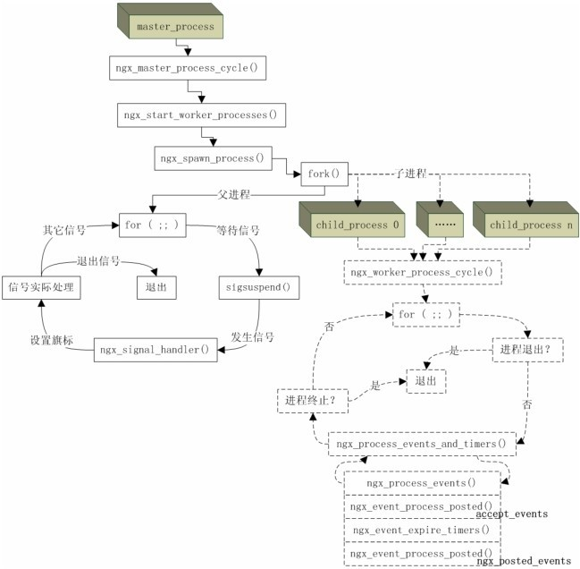

# Nginx使用指南

## 目录

- [Nginx的工作原理以及安装配置](#Nginx的工作原理以及安装配置)
  - [Nginx的三大模块](#Nginx的三大模块)
  - [为什么快？](#为什么快)
  - [安装Nginx](#安装Nginx)
  - [源码下载](#源码下载)
  - [Nginx 第三方模块安装](#Nginx-第三方模块安装)
    - [下载地址](#下载地址)
    - [添加配置](#添加配置)
    - [本地安装nginx](#本地安装nginx)
- [Nginx常用指令](#Nginx常用指令)
- [Nginx配置文件介绍](#Nginx配置文件介绍)
  - [nginx各模块介绍](#nginx各模块介绍)
    - [events 模块](#events-模块)
  - [nginx多站点配置（配置虚拟主机）](#nginx多站点配置配置虚拟主机)
  - [Nginx + Tomcat 动静分离架构（重点）](#Nginx--Tomcat-动静分离架构重点)
    - [为什么需要动静分离？](#为什么需要动静分离)
    - [如何做到动静分离？](#如何做到动静分离)
  - [Nginx 反向代理](#Nginx-反向代理)
  - [基于反向代理的负载均衡器](#基于反向代理的负载均衡器)
  - [基于nginx搭建一个具有缓存功能的反向代理服务器](#基于nginx搭建一个具有缓存功能的反向代理服务器)
  - [安利Nginx监控神器GoAccess](#安利Nginx监控神器GoAccess)
  - [Nginx url rewrite](#Nginx-url-rewrite)
  - [Nginx防盗链](#Nginx防盗链)
  - [Nginx配置优化](#Nginx配置优化)
- [Nginx的架构特点
  ](#Nginx的架构特点)
  - [Nginx的请求处理流程](#Nginx的请求处理流程)
  - [nginx的进程结构](#nginx的进程结构)
    - [核心进程模型架构图](#核心进程模型架构图)
    - [核心进程模型架构图](#核心进程模型架构图)
  - [Reload的秘密](#Reload的秘密)
    - [Reload的流程](#Reload的流程)
- [nginx热升级](#nginx热升级)
  - [热升级的流程](#热升级的流程)
- [worker 进程优雅的关闭](#worker-进程优雅的关闭)
  - [worker进程优雅的关闭流程](#worker进程优雅的关闭流程)
- [Nginx的事件模型](#Nginx的事件模型)
  - [Nginx的事件循环](#Nginx的事件循环)
- [epoll的优劣和原理](#epoll的优劣和原理)
  - [多路复用技术](#多路复用技术)
- [Nginx如何通过连接池处理网络请求](#Nginx如何通过连接池处理网络请求)
  - [connections核心数据结构](#connections核心数据结构)
  - [connections的数据结构](#connections的数据结构)
    - [记录读写事件的数据结构](#记录读写事件的数据结构)
- [Nginx的内存池原理和配置](#Nginx的内存池原理和配置)
- [Nginx进程间的通讯方式](#Nginx进程间的通讯方式)
  - [官方哪些nginx模块使用了共享内存](#官方哪些nginx模块使用了共享内存)
  - [共享内存的工具 slab管理器](#共享内存的工具-slab管理器)
  - [使用动态模块来提升运维效率](#使用动态模块来提升运维效率)
    - [动态库的工作流程](#动态库的工作流程)
  - [nginx处理Http请求流程](#nginx处理Http请求流程)
    - [对Http请求头部的处理](#对Http请求头部的处理)
    - [处理Http请求的11个阶段](#处理Http请求的11个阶段)
- [rewrite模块](#rewrite模块)
  - [return指令](#return指令)
    - [语法](#语法)
    - [返回状态吗](#返回状态吗)
  - [rewrite指令](#rewrite指令)
    - [语法](#语法)
    - [功能描述](#功能描述)
- [preaccess阶段](#preaccess阶段)
  - [ngx\_http\_limit\_req\_module模块](#ngx_http_limit_req_module模块)
- [access阶段](#access阶段)
  - [ngx\_http\_access\_module模块](#ngx_http_access_module模块)
  - [auth\_basic模块](#auth_basic模块)
    - [指令](#指令)
    - [生成密码文件工具](#生成密码文件工具)
- [auth\_request模块](#auth_request模块)
  - [功能](#功能)
  - [原理](#原理)
  - [指令](#指令)
- [nginx access阶段 satissfy指令](#nginx-access阶段-satissfy指令)
- [nginx precontent阶段](#nginx-precontent阶段)
  - [按序访问资源的try\_files模块](#按序访问资源的try_files模块)
  - [mirror模块](#mirror模块)
- [Concat模块](#Concat模块)
- [Log阶段](#Log阶段)
  - [access模块](#access模块)
- [Http过滤模块](#Http过滤模块)
  - [Sub模块](#Sub模块)
  - [addition模块](#addition模块)
- [Keepalived ](#Keepalived-)

## Nginx的工作原理以及安装配置

Nginx由内核和模块组成，内核的设计非常微小和简洁，他仅仅通过查找配置文件将客户端请求映射到一个location block ，而由这个location中所配置的每个指令将会启动不同的模块去 完成相应的工作。

### Nginx的三大模块

Nginx的模块从结构上分为核心模块，基础模块和第三方模块：

- 核心模块：http模块，event模块，mail模块
- 基础模块：http access,http fastcgi,http proxy,http rewrite
- 第三方模块：http upstream request,notice,http access key

### 为什么快？

Nginx的高并发采用epoll模型，linux内核2.6以后出现的，而apche采用的是select模型

场景：一个老师要带一个班的同学 ，现在需要发起提问

select模型：每个人都问一遍，会不会回答这个问题

epoll模型：谁会谁举手回答

不说人话：

select特点：select 选择句柄的时候是遍历所有句柄，也就是说句柄有事件响应时，select需要遍历所有的句柄才获取到哪些句柄有事件通知，可想而知，这样的效率相当慢

而epoll则是事件响应时，就会把事件选择出来 ，不需要遍历整个句柄链表

### 安装Nginx

安装pcre库：用于支持正则校验

### 源码下载

有时候我们需要nginx配置多个第三方模块，所以源码安装也是我们需要了解的

首先我们先需要安装以下步骤

```bash
yum install -y gcc
yum install -y pcre pcre-devel
yum install -y zlib zlib-devel
yum install -y openssl openssl-devel
```


执行命令获取源码包

```bash
wget https://nginx.org/download/nginx-1.23.1.tar.gz
```


解压源码包

```bash
tar -zxvf nginx-1.24.0.tar.gz nginx-1.24.0/
```


### Nginx 第三方模块安装

以第三方模块nginx\_upstream\_check\_module为例，该模块是用于对代理服务器进行自动心跳检测用的。

Nginx Upstream Check Module主要提供了以下功能：

1. 主动健康检查：定期对上游服务器进行HTTP或TCP连接尝试，通过设定的响应时间、状态码等阈值判断服务器是否正常。
2. 动态调整负载：根据服务器的健康状况，自动将流量分配到健康的节点，避免故障服务器影响服务。
3. 心跳检测：可设置心跳间隔，快速发现服务器异常，减少服务中断的时间。
4. 丰富的日志记录：记录每次检查结果，方便分析和调试问题。
5. 灵活的配置选项：支持自定义检查间隔、超时时间、重试次数等参数，满足各种场景需求。

#### 下载地址

<https://codeload.github.com/yaoweibin/nginx_upstream_check_module/zip/master>

或者执行命令

```bash
wget https://codeload.github.com/yaoweibin/nginx_upstream_check_module/zip/master
```


将包放置nginx源码目录下，并添加对应的模块到nginx中

```bash
unzip nginx_upstream_check_module-master.zip

#安装patch 命令

yum install patch


patch -p1 < nginx_upstream_check_module-master/check_1.20.1+.patch


```


执行命令添加配置到nginx下

```bash
./configure --prefix=/usr/local/nginx --with-stream --with-stream_ssl_module --with-http_ssl_module --add-module=nginx_upstream_check_module-master
```


编译

```bash
make && make install
```


查看对应的模块

```java
nginx -V
```


#### 添加配置

```text

#user  nobody;
worker_processes  1;

#error_log  logs/error.log;
#error_log  logs/error.log  notice;
#error_log  logs/error.log  info;

pid        logs/nginx.pid;


events {
    worker_connections  1024;
}


http {
    include       mime.types;
    default_type  application/octet-stream;

    #log_format  main  '$remote_addr - $remote_user [$time_local] "$request" '
    #                  '$status $body_bytes_sent "$http_referer" '
    #                  '"$http_user_agent" "$http_x_forwarded_for"';

    #access_log  logs/access.log  main;

  #  sendfile        on;
    #tcp_nopush     on;

    #keepalive_timeout  0;
    keepalive_timeout  65;

    #gzip  on;
  
    upstream wmcs {
    ip_hash;
    server 192.168.1.163:8083;
    server 192.168.1.208:8083;
    check interval=4000 rise=3 fall=5 timeout=3000 type=http;
  }

    

    server {
        listen       8066;
        #server_name  localhost;

       # access_log  logs/host.access.log  main;
#       add_header Cache-Control "no-cache, must-revalidate";
    
       location / {
        proxy_pass http://wmcs;
        proxy_set_header           X-Real-IP $remote_addr;  # 获取真实ip
        proxy_set_header           REMOTE-HOST $remote_addr;
        proxy_set_header           X-Forwarded-For $proxy_add_x_forwarded_for;#       获取代理者的真实ip
        proxy_set_header           Upgrade $http_upgrade;
        proxy_set_header           Connection "upgrade";
#        proxy_next_upstream    error timeout ;
        proxy_connect_timeout      15s;
        proxy_send_timeout         10;
        proxy_read_timeout         120;
        proxy_buffer_size          16k;
        proxy_buffers              4 32k;
        proxy_busy_buffers_size    64k;
        proxy_temp_file_write_size 64k;
        proxy_redirect             off;
    }
    

  location /nscheck { 
       check_status;
        }


        #error_page  404              /404.html;

        # redirect server error pages to the static page /50x.html
        #
        error_page   500 502 503 504  /50x.html;
        location = /50x.html {
            root   html;
        }

      
    }


 

}

```


#### 本地安装nginx

可查看官网[https://nginx.org/en/linux\_packages.html#RHEL](https://nginx.org/en/linux_packages.html#RHEL "https://nginx.org/en/linux_packages.html#RHEL")

## Nginx常用指令

```nginx
start nginx  启动nginx
nginx -s stop 快速关闭Nginx，可能不保存信息，并迅速终结Web服务
nginx -s quit 平稳关闭Nginx，保存相关信息，有安排的结束Web服务
nginx -s reload 热部署，因改变了Nginx相关配置，需要重新加载配置而重载
nginx -s reopen 重新打开日志文件
nginx -v 显示nginx的版本

```


&#x20;

## Nginx配置文件介绍

```nginx
1.user 用户 组
定义nginx运行的用户和用户组

2.worker_processes 线程数
启动进程数，通常设置成和cpu的数量相等

3.worker_cpu_affinity 
为每个进程分配cpu

4.error_log /usr/local/nginx/logs/error.log
#错误日志定义等级，[debuf/info/notice/warn/error/crit]

5.events{
  use epoll; #使用多路复用io，但是需要注意linux内核版本
  
   worker_connections 102400 #单个后台wokrer process进程的最大并发连接数
  
  multi_accept on;#尽可能多的接受请求
  
  http{
  
    include mine types;
    
    default_type application/octet-stream
    
    access_log /usr/local/log/nginx/error.log
    
    sendfile on;
    #指令指定nginx是否调用sendfile 函数来输出文件，对于 普通应用必须设为on
   #如果用来 进行下载 等应用磁盘io重负载应用，可设置为off
    
    autoindex on;
    #开启目录列表访问，合适下载服务器，默认关闭 
    
    tcp_nopush on;
    #防止网络阻塞
    
    keepalive_timeout 60;
    #keepalive超时时间，客户端到服务器端的连接持续有效时间，当出现对服务器的后继请求时，keepalive—timeout功能可避免建立连接或重新建立连接
    
    tcp_nodelay on; 
    #提高数据的实时响应性 
    
    #开启gzip压缩
    gzip on;
    gzip_min_length 1k;
    gzip_buffers 4 16k;
    gzip_http_version 1.1;
    gzip_comp_level2;
    #压缩级别大小 ，最大是9，值越小，压缩后的比例越小，cpu处理速度更快
   #对于http传输而言，当然是压缩得越小传输效率就越高，但是这样也更消耗cpu
   
     client_max_body_size 10m;
     #允许客户端请求的最大单文件字节数
     
     client_body_buffer_size 128k;
     #缓冲区代理缓冲用户端请求的最大字节数
     
     proxy_connect_timeout 90;
     #nginx与后端服务器连接超时（代理连接超时）
     
     proxy_send_timeout 90;
     #后端服务器数据回传时间
     
     proxy_read_timeout 90;
     #连接成功后，后端服务器响应时间（代理接收超时）
     
     proxy_buffer_size 4k;
     #设置代理服务器保存用户头信息的 缓冲区大小
    
     proxy_buffers 4 32k;
     #proxy_buffers缓冲区，网页平均在32k一下的话，这样设置
     
       proxy_busy_buffers_size 64k;
       
     #设定请求缓冲
     large_client_header_buffers 4 4k;
     client_header_buffer_size 4k;
     
     include vhosts.conf
     #引用其他配置文件       
    
  }  
}
```


### nginx各模块介绍

#### events 模块

```nginx
accept_mutex: on|off #用来设置nginx网络连接序列化

```


- 解决问题

  这个配置项主要是用于解决"惊群"问题，即一旦请求进来，就会出现所有进程被激活一起竞争的情况，而配置了accept\_mutex:on ，则每次只会激活一个进程处理问题。

```nginx
multi_accept: on|off #用来设置是否同时接受多个网络连接
```


```nginx
worker_connections number #用来配置单个进程最大连接数
```


```nginx
use select/epoll/   #设置使用哪种事件驱动来处理网络消息
```


### nginx多站点配置（配置虚拟主机）

在实现虚拟主机时，需要根据用户请求的 URL 地址来确定要访问哪个网站。Nginx 是一个高性能、可靠的 Web 服务器，针对这个问题提供了解决方案。Nginx 可以通过基于域名的虚拟主机配置来区分不同的网站，并将请求路由到相应的服务器上处理。此外，Nginx 还支持基于 IP 地址和端口号的虚拟主机配置，以满足不同的需求。

```nginx

#虚拟主机配置
server {

  listen 80;
  server_name www.a.com;
  location /{
      
      root html/a;
      
      index index.hmtl index.htm;
  } 
}

//虚拟主机配置
server {

  listen 80;
  server_name www.b.com;
  location /{
      
      root html/b; #对应html目录中的b文件
      
      index index.hmtl index.htm;
  
  }
}

```


### Nginx + Tomcat 动静分离架构（重点）

把动态资源和静态资源进行分离，nginx处理静态资源，Tomcat处理动态资源

动静分离的两种主流的实现：

1. 纯粹把静态文件独立成单独的域名，放在独立的服务器上，也是目前主流推崇的方案
2. 动态和静态文件混合在一起发布，通过nginx来分开，可通过location指定不同的后缀名实现不同的请求转发

#### 为什么需要动静分离？


当我打开一个网页时，我们在观察浏览器的开发者模式下的网络状况，可以发现响应中包含了大量的图片，js，css文件，而这些渲染页面用到的内容其实都是静态资源，这些静态资源不需要交由后端处理，那我们为什么还要让他们辛辛苦苦地从后端出发，长途跋涉地到页面呢？我们可以用比后端服务器性能更高的，距离更近的服务器进行处理，这样会令前端资源能够更快到达页面从而更好地渲染页面。更者也可以减轻后端服务器的资源处理量，使得后端服务器可以更快地给予响应。


#### 如何做到动静分离？

以下代码是使用nginx搭建的一个可用的静态资源服务器

```nginx
   server {
        listen       8888;
        listen       [::]:8888;
       
        location / {
          root /etc/nginx/myDipsy;
           index  index.html index.htm;
        }

        # Load configuration files for the default server block.
        include /etc/nginx/default.d/*.conf;

        error_page 404 /404.html;
        location = /404.html {
        }

        error_page 500 502 503 504 /50x.html;
        location = /50x.html {
        }
    }
```


但是光这样的配置，当我们打开开发者模式观察网络转发的过程时，会发现图片，js，css等资源都是按原文件大小进行传输的，而且时间还相当长。这时我们可以使用zgip进行文件压缩传输。

```nginx

    gzip on;
    gzip_min_length 1; #小于1字节的内容不需要压缩
    gzip_comp_level 2; #压缩级别
    gzip_types text/plain image/gif image/png text/css text/javascript image/jpeg image/jpg; #对该类型的文件进行压缩
```


经过压缩后，静态资源的响应速度明显会加快了非常多

### Nginx 反向代理


- 隧道式反向代理

  缺点：负载比较重的请求也会经过代理服务器，这样代理服务器反而会影响了性能

  优化：可以令响应不经过代理服务器，直接到达客户端（DR模型）

实现

```nginx
 location / {

    proxy_pass http://8.134.212.67:8011;  #代理地址

  }
```


### 基于反向代理的负载均衡器

负载均衡的优势

1. 提高系统可用性：当有多个服务器时，负载均衡可以将请求分发到不同的服务器上，可以避免单点故障，提高系统的可用性。
2. 提高系统性能：负载均衡可以让流量分散到多个服务器上，从而降低单台服务器的负载压力，提高系统的处理性能和响应速度。
3. 提高系统扩展性：负载均衡可以方便地扩展服务器集群，只需要增加服务器即可，并且负载均衡会自动调整负载分配，不需要手动干预，提高系统的扩展性和可维护性。
4. 实现请求管理：通过负载均衡可以对请求进行管理，例如对于高优先级的请求可以分配到性能更好的服务器上处理，或者根据用户位置等信息将请求分发到最近的服务器上，提高用户体验。
5. 实现会话保持：有些应用需要会话保持，即同一个用户的请求必须始终分配到同一个服务器上处理，通过负载均衡可以实现这个功能。

基本配置：

默认采用的是轮询算法进行负载均衡，即 8.134.212.67:8011 和 8.134.212.67:8889的访问概率是一样的

```nginx
 upstream httdp{
  server 8.134.212.67:8011;
  server 8.134.212.67:8889;
  }

server
{
  location / {

    proxy_pass http://httdp;  #定义一个代理地址群httdp

   }
}
```


### 基于nginx搭建一个具有缓存功能的反向代理服务器

首先可以令nginx只允许本地进程访问服务器

```nginx
listen       127.0.0.1:8888;
listen       [::]:8888;
```


接下来可以依照为两台服务器配置反向代理，由于nginx只允许本地进程进行服务器访问，所以代理指向的地址也需要注意修成为127.0.0.1

```nginx
 upstream httdp{
   server 127.0.0.1:8011;
    server 127.0.0.1:8888;
    }
 #代理服务器   
 server {
   listen       8889;    
   location / {
      proxy_pass http://httdp;
    }
  }   
```


而对于部分小型网站而言，网站在短时间内不需要过大变更的时候，我们有部分内容就没必要跑后端要响应了，完全可以利用缓存作为响应结果，这对网站的响应效率的提高会起到非常大的帮助。

```nginx
  #配置缓存的位置，缓存的名字
  proxy_cache_path /var/nginxcache levels=1:2 keys_zone=my_cache:10m max_size=10g inactive=60m use_temp_path=off;
  #代理服务器中需要配置
  
   server {
        listen       8889;
        location / {
            proxy_pass http://httdp;
            proxy_cache my_cache;#缓存名字
            proxy_cache_key $host$uri$is_args$args;
            proxy_cache_valid 200 304 302 1h;#缓存有效状态以及缓存时间
        }
    }
```


做了缓存后，即便关闭了nginx服务器，代理服务器也会从缓存中取出相应的响应结果进行返回，通过这种方式可以大大提高浏览器的响应速度。

### 安利Nginx监控神器GoAccess

浏览日志是十分重要的能让我们准确判断软件运行状态的一种方式，nginx也不例外，如果是yum安装的nginx，日志文件就藏在/var/log/nginx/xxx.log文件中，但是头疼的这堆日志能把你看成大头，愁的一批we


为了让日志能够更加美观，安利一个非常好用的可视化工具，简单好用

[https://goaccess.io/](https://goaccess.io/ "https://goaccess.io/")

首先需要先安装该工具

```bash
yum install goaccess
```


完成安装以后，需要定义goaccess 的配置方式

```bash
goaccess /var/log/nginx/access.log -o /home/html/report.html --real-time-html --time-format='%H:%M:%S' --date-format='%d/%b/%Y' --log-format=COMBINED

```


- \--real-time-html：实时更新
- \--time-format： 时间格式
- \--date-format：日期格式

开启服务以后，服务器别忘了需要配置一下资源路径

```nginx
location /report.html {
  
  root /home/html;
  index report.html;
  
  }

```


完事后就能访问对应的report.html了，那叫一个高端大气上档次


### Nginx url rewrite

隐藏真实的url地址&#x20;

### Nginx防盗链

### Nginx配置优化

对于Nginx的可优化配置应该关注下列几项

```nginx
worker_processes 8; #尽量按照CPU核心指定
worker_cpu_affinity 00000001 00000010 ... ;  #将进程分给CPU进行管理
use epoll ; #epoll模型，提成程序在大量并发连接中，只有少数活跃的情况下的系统CPU利用率

worker_connections 102400; #理论上是每台nginx进程的最大连接数
#worker_connections * worker_processes 才是整个nginx服务器的最大连接数

keepalive_timeout 60; #客户端到服务端的请求有效时长
client_header_buffer_size 4K; #客户请求头缓冲区大小
open_file_cache_vaild 30s; #多长时间检查一次缓存信息

```


Nginx的架构特点

### Nginx的请求处理流程

作为一个边缘节点，又是所有应用服务器的镇守将军，可想而知，对于nginx来说，他需要处理的流量是不同于其他服务节点的，所以我们更需要关注nginx的架构特点，了解nginx为什么需要这样的架构设计。

对于一个请求而言，他是如何经过nginx进行处理的呢？


正因为nginx可以使用epoll的事件驱动模型，当流量到达nginx时，会被不同的状态机进行识别处理。

### nginx的进程结构

#### 核心进程模型架构图

在多进程下，nginx主要采用的是master-worker模型进行事件处理


#### 核心进程模型架构图



nginx的核心进程主要是一个监控进程+多个工作进程，监控进程和工作进程都是包裹在一个无限循环中

- 监控进程

  不过监控进程内有一个比较关键的sigsuspend()函数调用，可以使得监控进程在监控的过程中大部分时间都处于等待挂机的状态，直到收到信号为止。

  一旦收到了信号，信号处理函数ngx\_signal\_handler()就会被执行

为什么nginx使用的是多进程而不是多线程呢？为了维持nginx的高可用性高可靠性，在多线程的情况下，由于多线程是会共享内存中的同一份地址空间的，一旦一个线程出现操作地址空间出现问题时，其他线程就会出现问题了，而这个问题在多线程的情况下是不会发生的。而master是为了管理所有的worker进程，worker进程才是真正的命令执行者，包括缓存工作，而cache manager和loader仅是为了更好地进行对缓存进行管理和加载。而这些进程之间的通讯是通过共享内存来解决的。

nginx在使用多进程的驱动模型后，更希望能够每一个worker进程占据一个CPU，所有我们不仅仅把worker进程的数量配置成与CPU核心相同，也可以通过每一个worker进程和某一个CPU核绑定在一起，这样可以更加方便地使用每一个CPU核上的cache，从而提高cache命中率。


可以看到nginx master进程的id为2988，而其他的worker 进程的id为3348和3349 ，且都是由2988进程生成的

父子进程之间是可以通过发送与接收信息来达到通讯的效果的

- Master
  - 监控worker进程 CHLD
    - 因为worker进程如果终止时，会想master进程发出CHLD信号，如果master进程发现worker发送了该信号，那么master会进而处理这个出现意外的worker进程。
  - 管理worker进程
  - 接收信号
- worker
  - 接收信号
- nginx命令行
  - reload ：HUB
  - reopen ：USER1
  - stop：TERM
  - quit：QUIT

### Reload的秘密

#### Reload的流程

1. 向master进程发送HUB信号
2. master进程校验配置信息是否正确
3. master进程打开新的监听端口
4. master利用新配置打开新的worker子进程
5. masrer进程向老worker子进程发送QUIT信号
6. 老worker子进程关闭当前监听句柄，处理完当前连接后结束进程

但是有些情况下，老worker会被部分耗时的连接处理占着，导致老worker进程无法正常退出，在新版本的nginx中有采用计时的方式进行解决，即只要该worker处理连接超过了某个设定的时间，就会强制退出。

为什么要先新建子worker进程再退出老worker进程呢？就是为了nginx能否平滑地进行配置文件的新老过度。

## nginx热升级

### 热升级的流程

1. 将旧nginx文件换成新的nginx文件
2. 向master进程发送usr2信号
3. master进程修改pid文件名，加后缀.oldbin
4. master进程用新的nginx文件启动新的master进程
5. 向老master进程发送quit信号，关闭老master进程
6. 回滚：向老master发送hup，向新master发送quit

## worker 进程优雅的关闭

### worker进程优雅的关闭流程

1. 设置定时器 worker\_shutdown\_timeout
2. 关闭监听句柄
3. 关闭空闲连接
4. 在循环中等待全部连接关闭
5. 退出进程

所谓优雅的关闭是指worker在关闭前需要先把手头上的事情先完成了，而不是强制关闭导致可能出现错误，且nginx优雅的关闭主要是针对http请求的。

在循环中等待全部连接关闭时可能会超越了定时器所限定的时长，那么这时worker会强制关闭剩下没有关闭的连接，此时只是部分优雅的退出了而还有部分还是强制关闭。

## Nginx的事件模型

### Nginx的事件循环


新的客户端连上了 Nginx 向我们发起了连接，此步往往对应 epoll 的 epoll wait 方法，这个时候的 Nginx 其实是处于 sleep状态的。当操作系统收到了一个建立 TCP 连接的握手报文时并且处理完握手流程以后，操作系统就会通知 epoll wait 这个阻塞方法，告诉它可以往下走了，同时唤醒 Nginx worker 进程。


接着，nginx会去找**操作系统**索要要事件，操作系统会把他准备好的事件，放在事件队列中，从这个**事件队列**中可以获取到需要处理的事件。比如建立连接或者收到一个 TCP 请求报文。

有些第三方模块可能会做大量的 CPU 运算，这样的计算任务会导致处理一个事件的时间非常的长；在上面的一个流程图中，可以看到会导致队列中的大量事件会长时间得不到处理，从而引发恶性循环，又比如说gzip就是分段运算而不是一次性运算。

## epoll的优劣和原理

想要更快地处理事件，我们就必须令操作系统能够更快地把需要处理的事件放到队列中，该如何更加高速地处理这些事件呢？在Linux或部分操作系统中，有这么一个高速的事件处理模型，epoll，epoll 是 Linux 中的一个 I/O 事件通知机制，用于高效地处理大量的并发连接。它是一种基于事件驱动的模型，通过监视文件描述符上的事件来实现异步 I/O 操作。

在高并发的连接中，虽然连接数是成千上万的，但是活跃连接数的占比还是比较少的，而传统的selector却是先把整个连接列表遍历一次，在取出对应活跃的连接放置队列等待其他服务器进行处理。而epoll却大不相同。

### 多路复用技术

所谓多路复用，就是不能使用多进程或者多线程的方式进行多个服务器的连接，在使用多进程或者多线程进行TCP/UDP连接时，的确可以做到一次性连接多个连接，但是更多的是多进程或者多线程空执行的时候。

而多路复用就是需要只是使用一个进程或者一个线程就能处理多个TCP连接的一项技术。

## Nginx如何通过连接池处理网络请求

在nginx中，有采用连接池的方式来增加连接资源的利用率，其实在每一个nginx worker进程中，都存在这么一个结构，ngx\_cycle\_t,其中connections是一个数组，对应的就是连接池的可容纳连接数，可以在worker\_connections中进行配置，值得注意的是，在需要反向代理的时候，每一个客户端连接都至少消耗2个connections&#x20;


而每个connections都是占据一定内存的，这些内存的消耗也就意味着nginx能否承受多大并发量，所以能够减少一点内存消耗，就能令nginx的并发上限更高。

### connections核心数据结构

### connections的数据结构


#### 记录读写事件的数据结构


## Nginx的内存池原理和配置

为了更好地管理内存，减少处理内存的消耗，nginx在内部有封装了ngx\_pool\_t类型的内存池，有了它，才能使nginx在使用过程中产生的内存碎片变得更少，可以通过connection\_pool\_size配置进行定义，

## Nginx进程间的通讯方式

- 共享内存
- 信号

### 官方哪些nginx模块使用了共享内存

共享内存是Linux下进程之间进行数据通信的最有效方式之一

- tbtree
- ngx\_http\_lua\_api
- 单链表

### 共享内存的工具 slab管理器

### 使用动态模块来提升运维效率

在不使用动态模块时，我们是将nginx源代码+第三方模块代码一起放在一块进行编译最后供我们使用


而使用了动态库后，编译后不仅仅会出现nginx的二进制执行文件还会出现一个动态库，而在nginx二进制文件存储的是动态库中执行的位置，这样有什么好处呢？这样当我们参数或者代码出现错误时，就不需要重新修改再编译，只需要替换对应的二进制库，然后reload即可


#### 动态库的工作流程

1. configurc加入动态模块
2. 编译进binary
3. 启动时初始化模块数组
4. 读取load\_moudule配置
5. 打开动态库并加入模块数组
6. 基于模块数组开始初始化

### nginx处理Http请求流程

#### 对Http请求头部的处理


首先是内核与nginx进行建立连接，即三次握手，由nginx事件模块来接收请求，并为url和http分配内存池，紧接着会进入http模块对http请求进行处理。


#### 处理Http请求的11个阶段

## rewrite模块

### return指令

#### 语法

返回指定的状态码和对应的文字或者对应的url

```yaml
return code [text]
return code [url]
return url
```


Context server，location，if

#### 返回状态吗

http1.0标准

- 301 永久重定向，会把结果放入缓存，比如我访问A,资源会被重定向至B，若此时A挂了，由于缓存我们仍然能访问到B的内容
- 302 临时重定向，禁止被缓存

http 1.1标准

- 303 临时重定向，允许改变方法，禁止被缓存
- 307 临时重定向，不允许改变方法，禁止被缓存
- 308 永久重定向，不允许改变方法

下面语句就是当访问/test时，会返回307临时重定向，并转至 http\://localhost:8001，由于是临时重定向，但是禁止了缓存，所以服务关了就无法访问了

```nginx
  location /test {
      return 307  http://localhost:8001;
    }
```


return与 error\_page很相似，不过error\_page是当遇到了对应的code时触发的应转向某个页面或者结果。

```nginx
error_page 404 /index.html;
```


### rewrite指令

#### 语法

```nginx
rewrite regex replacement [flag]
context server location if
```


#### 功能描述

- 将regex指定的URL替换成replacement这个新的url，regex可以使用正则匹配
- 当replacement 以http\://或者https\://或者\$schema 开头，则直接返回302重定向
- 替换后的url根据flag指定的方法进行处理

  —last 用replacement这个url进行新的location匹配

  —break break指令停止当前脚本指令的执行，等价于独立的break指令

  — redirect 返回302重定向

  —permanent 返回301重定向

## preaccess阶段

### ngx\_http\_limit\_req\_module模块

- 生效阶段：ngx\_http\_preaccess\_phase
- 模块：http\_limit\_req\_module
- 生效算法：leaky bucket算法
- 生效范围：
  - 全部worker进程（基于共享内存）
  - 进入preaccess阶段前不生效

## access阶段

access阶段用于控制请求是否能够继续往下访问的控制阶段

比如限制某些IP不允许访问

### ngx\_http\_access\_module模块

- 生效阶段：ngx\_http\_access\_phase阶段
- 模块：ngx\_http\_access模块
- 默认编译进nginx，通过—without-http\_accesss\_module禁用功能
- 生效阶段：进入access阶段前不生效

```nginx
allow IP/IP段 #允许ip/ip段进行访问
deny IP/IP段 #禁止ip/ip段访问

```


### auth\_basic模块

auth\_basic模块是基于http basic authutication模块进行用户名和密码验证的

http basic authutication 默认是明文进行发送校验的，但是如果使用了https进行加密那就没有问题了

当然该模块也是默认编译进nginx的，如果想要禁用这个功能可以使用—without-http\_auth\_basic\_module禁用该模块

#### 指令

```nginx
auth_basic string/off #是否开启用户名密码校验
auth_basic_user_file file #用户名密码配置的文件
```


#### 生成密码文件工具

工具：httpd-tools

通过命令

```nginx
htpasswd -c file -b user pass
```


## auth\_request模块

#### 功能

向上游服务器返回的状态码是20x ，则继续执行，若上游服务器返回的是401或者403时，则返回客户端

默认该模块是没有编译进nginx的，所以需要—with-http\_auth\_request\_module加载编译这个模块

#### 原理

当一个请求到达nginx时，nginx会生成一个子请求去反向代理到上游服务器，由上游服务器的返回状态来决定是否处理这个请求

#### 指令

```nginx
auth_request uri/off #生成子请求访问该uri

```


## nginx access阶段 satissfy指令

nginx指令都是顺序往下执行的，那么是否就意味着一旦一个指令奏效了其他指令就没法放行了呢？

并非如此，在nginx中有satissy指令可以帮助access阶段的指令放行至上游服务器

## nginx precontent阶段

### 按序访问资源的try\_files模块

ngx\_http\_try\_files\_module模块，默认是编译至nginx的

```nginx
try_files file...url
try_files file...=code
```


功能：依次试图访问多个url对应的文件，当文件存在时直接返回文件内容，如果文件不存在，则按最后一个url结果或者code返回

这个模块比较适合用于在反向代理的情景下，如果要访问文件时，会先从本地磁盘取，存在则返回，不存在则到上游服务器获取

### mirror模块

实时拷贝流量，绘制镜像流量

默认编译至nginx

他在处理请求时，会生成子请求访问其他服务，对子请求的返回不做其他处理

## Concat模块

concat模块是阿里巴巴开源的一个nginx模块

是可以一次性请求多个小文件的一个高性能模块，想要引入该模块，需要到

<https://github.com/alibaba/nginx-http-concat下先把模块下载>

然后通过—add-module=模块路径来引入该模块

使用：

在Url后加？？后面加多个文件，文件与文件之间用逗号分隔

```nginx
concat on/off #开启或关闭concat
concat_delimiter string #多个文件的内容以什么形式分割开来
concat_type  mime types #对何种文件做合并
concat_ignore_file_error on/off #如果发现文件内容错误或者文件不存在，继续向下执行
concat_file_max number #最大的文件数
```


## Log阶段

### access模块

access模块主要跟日志有关系，用于记录进程运行时的日志的

指令：

```nginx
access_log path #日志存放路径
```


值得注意的是当我们不是cache时每记录一条日志都需要打开，关闭日志文件，这样效率是相当慢的

使用日志文件缓存

```nginx
open_log_file_cache 最大文件句柄数 文件访问后这段时间内不会关闭
open_log_file_cache on/off
```


## Http过滤模块

### Sub模块

可以更改响应中的字符串内容

默认是未编译进Nginx的

可以通过—with-http\_sub\_module模块启用

```nginx
#指令
sub_filter string replacement 将字符串更换成新字符串
sub_filter_last_modifiled on|off
sub_filter_one on|off 只会替换一次
sub_filter_type text/html 
```


### addition模块

能够在响应的前后添加内容（通过新增子请求的响应完成 ）

默认也是未编译进nginx的

可以通过—with-http\_addition\_module启用

```nginx
add_before_body uri
add_after_body uri 
addition_type mine-type ... 
```


## Keepalived&#x20;

Keepalived的功能

可以使得多个Http请求可以复用TCP连接

- 减少握手次数
- 通过减少并发连接数减少了服务器的消耗
- 降低TCP拥塞控制的影响
