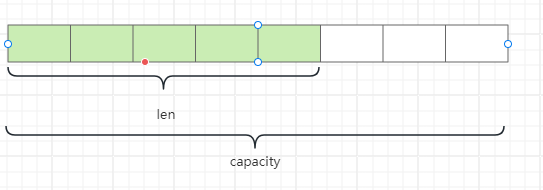
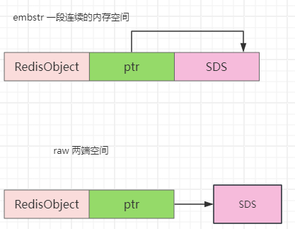
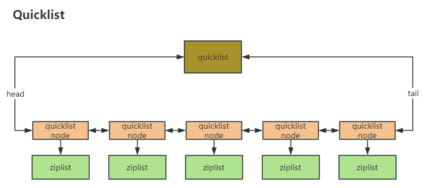
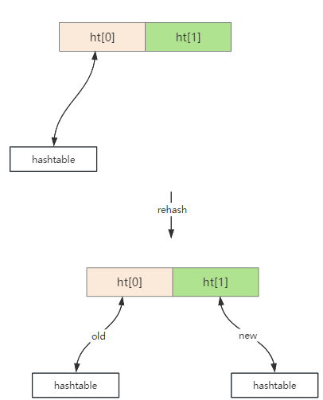
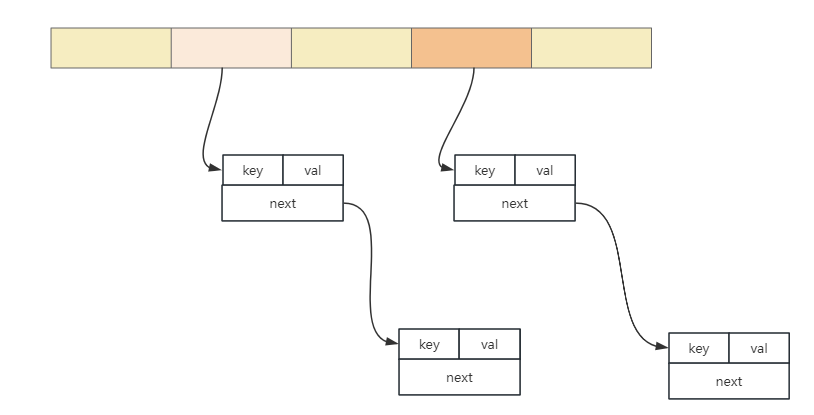
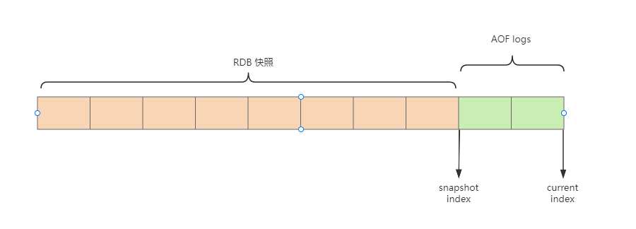
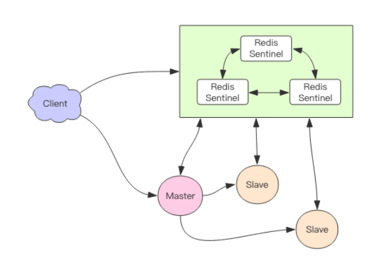
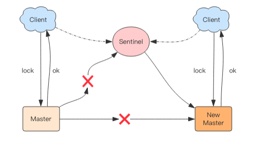
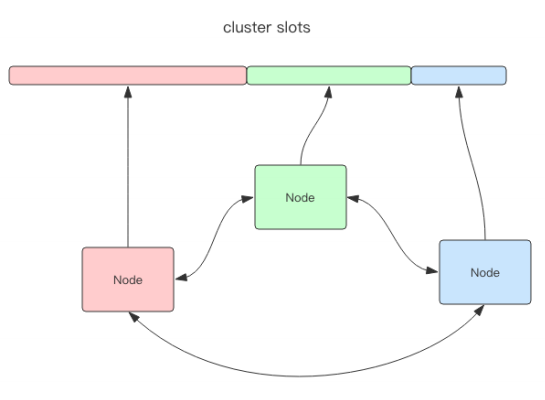

# Redis 深度历险：核心原理和应用实践

## 目录

- [Redis 基础数据结构](#Redis-基础数据结构)
  - [String](#String)
    - [基本操作](#基本操作)
    - [深入剖析](#深入剖析)
    - [扩容策略](#扩容策略)
  - [list](#list)
    - [基本操作](#基本操作)
    - [深入剖析](#深入剖析)
      - [压缩列表](#压缩列表)
      - [新增元素](#新增元素)
      - [Inset 小整数集合](#Inset小整数集合)
      - [快速列表](#快速列表)
  - [hash](#hash)
    - [基本操作](#基本操作)
    - [深入剖析](#深入剖析)
      - [dict](#dict)
      - [渐进式 rehash](#渐进式rehash)
      - [扩容条件](#扩容条件)
      - [缩容条件](#缩容条件)
  - [set](#set)
    - [基本操作](#基本操作)
  - [zset](#zset)
    - [基本操作](#基本操作)
    - [跳跃列表](#跳跃列表)
  - [容器型数据结构的通用规则](#容器型数据结构的通用规则)
    - [容器内存](#容器内存)
    - [过期时间](#过期时间)
- [Redis 线程模型](#Redis线程模型)
  - [非阻塞 IO](#非阻塞IO)
  - [事件轮询](#事件轮询)
- [Redis 通信协议](#Redis通信协议)
  - [RESP(Redis Serialization Protocol)](#RESPRedis-Serialization-Protocol)
    - [客户端与服务端通信](#客户端与服务端通信)
    - [服务端响应客户端](#服务端响应客户端)
- [Redis 持久化](#Redis-持久化)
  - [快照原理](#快照原理)
  - [AOF 重写](#AOF重写)
  - [混合持久化](#混合持久化)
- [管道](#管道)
  - [管道压力测试](#管道压力测试)
  - [深入理解管道](#深入理解管道)
- [PubSub](#PubSub)
  - [缺点](#缺点)
- [小对象压缩](#小对象压缩)
  - [存储界限](#存储界限)
  - [内存回收](#内存回收)
  - [内存分配算法](#内存分配算法)
- [主从同步](#主从同步)
  - [CAP 理论](#CAP理论)
  - [Redis 的主从数据一致性](#Redis的主从数据一致性)
  - [Redis 的主从同步](#Redis-的主从同步)
    - [增量同步](#增量同步)
    - [快照同步](#快照同步)
    - [无盘复制](#无盘复制)
  - [主从的实现](#主从的实现)
  - [info 指令](#info指令)
    - [Stats](#Stats)
    - [Clients](#Clients)
    - [backlog](#backlog)
- [Sentinel](#Sentinel)
  - [主从切换带来的分布式锁问题](#主从切换带来的分布式锁问题)
  - [RedLock](#RedLock)
- [Cluster](#Cluster)
  - [槽位定位算法](#槽位定位算法)
  - [跳转](#跳转)
  - [迁移](#迁移)
  - [容错](#容错)
  - [下线](#下线)
- [过期策略](#过期策略)
  - [定时扫描策略](#定时扫描策略)
  - [LRU](#LRU)
    - [传统 LRU 算法](#传统LRU算法)
    - [Redis 小改 LRU 算法](#Redis小改LRU算法)
- [惰性删除](#惰性删除)
  - [异步队列](#异步队列)
  - [异步 AOF](#异步AOF)

## Redis 基础数据结构

### String

Redis 所有的数据结构都是以唯一的 key 字符串作为名称，然后通过这个唯一 key 值来获取相应的 value 数据。不同类型的数据结构的差异就在于 value 的结构不一样。

Redis 的字符串属于动态字符串，是可以修改的字符串，内部结构实现上类似于 Java 的 ArrayList，采用预分配冗余空间的方式来减少内存的频繁分配。

分配方式：

1. 当字符串小于 1M 时，扩容都是加倍现有的空间
2. 如果超过 1M 时，扩容时一次只会多扩 1M 的空间

字符串的最大长度为 512M

#### 基本操作

- 设置键值对
  ```bash
  # 设置键值对
  127.0.0.1:6379> set name codehole
  OK
  # 获取键值对
  127.0.0.1:6379> get name
  "codehole"
  # 是否存在键对应的值
  127.0.0.1:6379> exists name
  (integer) 1
  # 删除对应键的值
  127.0.0.1:6379> del name
  (integer) 1
   设置键值对命令
  ```
- 批量键值对，有助于节省网络开销
  ```bash
  # 批量设置键值对
  127.0.0.1:6379> mset name1 codehole name2 codehole2
  OK
  # 批量获取键值对
  127.0.0.1:6379> mget name1 name2
  1) "codehole"
  2) "codehole2"
  127.0.0.1:6379> mget name1 name2 name3
  1) "codehole"
  2) "codehole2"
  3) (nil)
  127.0.0.1:6379>
   批量设置键值对
  ```
- 过期和 set 命令拓展
  ```bash
  127.0.0.1:6379> set name test
  OK
  127.0.0.1:6379> get name
  "test"
  #设置过期时间为5秒
  127.0.0.1:6379> expire name 5
  (integer) 1
  127.0.0.1:6379> get name
  (nil)
  127.0.0.1:6379> 设置过期时间
  ```
- set 命令拓展
  ```bash
  # 如果不存在name键 ， 创建键值对name:test
  127.0.0.1:6379> setnx name test
  (integer) 1
  # 如果存在name键，无法更改键值对name:test
  127.0.0.1:6379> setnx name test2
  (integer) 0
  127.0.0.1:6379> get name
  "test"
  ```
- 如果 value 的值是一个整数，还可以对它进行自增操作，但是自增的范围是有限的，范围为 signed long 的最大最小值，超过了这个值，Redis 会报错。&#x20;
  ```bash
  127.0.0.1:6379> set age 18
  OK
  # 自增 1
  127.0.0.1:6379> incr age
  (integer) 19
  # 自增 6
  127.0.0.1:6379> incrby age 6
  (integer) 25
  # 自增 -6
  127.0.0.1:6379> incrby age -6
  (integer) 19
  127.0.0.1:6379>
  ```

#### 深入剖析

Redis 中的字符串是可以修改的字符串，在内存中它是以字节数组的形式存在的。Redis 的字符串叫着 SDS，也就是 Simple Dynamic String，它的结构是一个带长度信息的字节数组。

```c
struct SDS<T> {
   T capacity; // 数组容量
   T len; // 数组长度
   byte flags; // 特殊标识位，不理睬它
   byte[] content; // 数组内容
 } String对象结构
```

capacity 表示所分配数组的长度，len 表示字符串的实际长度，而 SDS 结构使用了范型 T，为什么不直接用 int 呢，这是因为当字符串比较短时，len 和 capacity 可以使用 byte 和 short 来表示，Redis 为了对内存做极致的优化，不同长度的字符串使用不同的结构体来表示。



Redis 的字符串有两种存储方式，在长度特别短时，使用 emb 形式存储 (embeded)，当长度超过 44 时，使用 raw 形式存储。

为什么是 44 呢？首先来了解一下 Redis 对象头的结构体，所有的 Redis 对象都有这个结构体

```c
struct RedisObject {
 int4 type; // 4bits
 int4 encoding; // 4bits
 int24 lru; // 24bits
 int32 refcount; // 4bytes
 void *ptr; // 8bytes，64-bit system
} robj; //16 bytes Redis 对象头的结构体
```

不同的对象具有不同的类型 type(4bit)，同一个类型的 type 会有不同的存储形式 encoding(4bit)，为了记录对象的 LRU 信息，使用了 24 个 bit 来记录 LRU 信息。每个对象都有个引用计数，当引用计数为零时，对象就会被销毁，内存被回收。ptr 指针将指向对象内容 (body) 的具体存储位置。这样一个 RedisObject 对象头需要占据 16 字节的存储空间。

再看 SDS 结构体的大小，在字符串比较小时，SDS 对象头的大小是 capacity+3，至少是 3。意味着创建一个字符串的最小开销是 19（16+3）

```c
struct SDS {
 int8 capacity; // 1byte
 int8 len; // 1byte
 int8 flags; // 1byte
 byte[] content; // 内联数组，长度为 capacity
}
```

embstr 和 raw 的存储方式不同，对于 embstr 来说只需要分配一次内存空间即可，但是 raw 却需要分配两次，为什么会这样呢？这跟内存分配的方式有关系，内存分配分配的方式都得是 2 的次方级，2，4，8，16，32，64 等，为了能够容纳 embstr 类型，最少也要 32 位的（因为头部+最小 SDS = 16+3 = 19），如果再大点就 64 位了，再大就会使用 raw 的存储方式了。所以 64 位是 embstr 的最大限度了。

那么 64-19 = 45，即 45 就是我们能够存储的真实字符串的最大字节数了，但是为什么是 44 呢？这是因为 C 中字符串是以字节\0 结尾的字符串，之所以多出这样一个字节，是为了便于直接使用 glibc 的字符串处理函数，以及为了便于字符串的调试打印输出。综上所述，embstr 类型的字符串的最大容纳就是 44 字节。



#### 扩容策略

字符串在长度小于 1M 之前，扩容空间采用加倍策略，也就是保留 100% 的冗余空间。当长度超过 1M 之后，为了避免加倍后的冗余空间过大而导致浪费，每次扩容只会多配 1M 大小的冗余空间。

### list

Redis 的列表相当于 Java 中的 LinkedList，是链表，意味着插入删除快，查询慢，当列表弹出了最后一个元素之后，该数据结构自动被删除，内存被回收。

#### 基本操作

列表可以用作栈或者队列使用，队列右进左出

```bash
127.0.0.1:6379> rpush books python java go cp rust net
(integer) 6
127.0.0.1:6379> llen books
(integer) 6
127.0.0.1:6379> lpop books
"python"
127.0.0.1:6379> lpop books
"java" 队列用法
```

栈则是右进右出

```bash
127.0.0.1:6379> rpush book2s python java go cp rust net
(integer) 6
127.0.0.1:6379> rpop book2s
"net"
127.0.0.1:6379> rpop book2s
"rust" 栈用法
```

#### 深入剖析

##### 压缩列表

Redis 为了节约内存空间使用，zset 和 hash 容器对象在元素个数较少的时候，采用压缩列表 (ziplist) 进行存储。压缩列表是一块连续的内存空间，元素之间紧挨着存储，没有任何冗余空隙。压缩列表为了支持双向遍历，所以才会有 ztail_offset 这个字段，用来快速定位到最后一个元素，然后倒着遍历。

```c
struct ziplist<T> {
 int32 zlbytes; // 整个压缩列表占用字节数
 int32 zltail_offset; // 最后一个元素距离压缩列表起始位置的偏移量，用于快速定位到最后一个节点
 int16 zllength; // 元素个数
 T[] entries; // 元素内容列表，挨个挨个紧凑存储
 int8 zlend; // 标志压缩列表的结束，值恒为 0xFF
} 压缩列表结构
```

entries 中的 entry 是一个元素类型，元素内容和元素前指针的描述

- prevlen&#x20;

  prevlen 字段表示前一个 entry 的字节长度，当压缩列表倒着遍历时，需要通过这个字段来快速定位到下一个元素的位置。它是一个变长的整数，当字符串长度小于 254(0xFE) 时，使用一个字节表示；如果达到或超出 254(0xFE) 那就使用 5 个字节来表示。第一个字节是 0xFE(254)，剩余四个字节表示字符串长度。

- encoding

  encoding 字段存储了元素内容的编码类型信息，ziplist 通过这个字段来决定后面的 content 内容的形式，Redis 通过 encoding 来标志 content 的数据类型

  1. 00xxxxxx 最大长度位 63 的短字符串，后面的 6 个位存储字符串的位数，剩余的字节就是字符串的内容。
  2. 01xxxxxx xxxxxxxx 中等长度的字符串，后面 14 个位来表示字符串的长度，剩余的字节就是字符串的内容。
  3. 10000000 aaaaaaaa bbbbbbbb cccccccc dddddddd 特大字符串，需要使用额外 4 个字节来表示长度。第一个字节前缀是 10，剩余 6 位没有使用，统一置为零。后面跟着字符串内容。不过这样的大字符串是没有机会使用的，压缩列表通常只是用来存储小数据的。
  4. 11000000 表示 int16，后跟两个字节表示整数。
  5. 11010000 表示 int32，后跟四个字节表示整数。
  6. 11100000 表示 int64，后跟八个字节表示整数。
  7. 11110000 表示 int24，后跟三个字节表示整数。
  8. 11111110 表示 int8，后跟一个字节表示整数。
  9. 11111111 表示 ziplist 的结束，也就是 zlend 的值 0xFF。
  10. 1111xxxx 表示极小整数，xxxx 的范围只能是 (0001\~1101), 也就是 1\~13，因为 0000、1110、1111 都被占用了。读取到的 value 需要将 xxxx 减 1，也就是整数 0\~12 就是最终的 value。

- content

  content 字段在结构体中定义为 optional 类型，表示这个字段是可选的，对于很小的整数而言，它的内容已经内联到 encoding 字段的尾部了。

```c
struct entry {
 int<var> prevlen; // 前一个 entry 的字节长度
 int<var> encoding; // 元素类型编码
 optional byte[] content; // 元素内容
} ziplist中entry的结构
```

##### 新增元素

因为 ziplist 都是紧凑存储，没有冗余空间意味着插入一个新的元素就需要调用 realloc 扩展内存。取决于内存分配器算法和当前的 ziplist 内存大小，realloc 可能会重新分配新的内存空间，并将之前的内容一次性拷贝到新的地址，也可能在原有的地址上进行扩展，这时就不需要进行旧内容的内存拷贝。如果 ziplist 占据内存太大，重新分配内存和拷贝内存就会有很大的消耗。所以 ziplist 不适合存储大型字符串，存储的元素也不宜过多。

##### Inset 小整数集合

当 set 集合容纳的元素都是整数并且元素个数较小时，Redis 会使用 intset 来存储结合元素。intset 是紧凑的数组结构，同时支持 16 位、32 位和 64 位整数。intset 基于整数数组来实现，并且具备长度可变、有序等特征。

##### 快速列表

Redis 早期版本的列表仅支持 ziplist 和 linkedlist，数据较少的时候使用 ziplist，多的时候则使用 linkedlist。

```c
// 链表的节点
struct listNode<T> {
    listNode* prev;
     listNode* next;
     T value;
}
// 链表
struct list {
   listNode *head;
   listNode *tail;
   long length;
}
 linkedlist结构
```

但是 linkedlist 的指针的附加空间相对起来太高了（16 字节）， 每个节点的内存都是单独分配，会加剧内存的碎片化，影响内存管理效率。后续版本对 ziplist 跟 linkedlist 做了优化，将两者进行了融合，就出现了 quicklist 的数据结构了。&#x20;

这是一个很有意思的数据结构，他将 ziplist 和 linkedlist 优势都结合起来了。它 将 linkedlist 按段切分，每一段使用 ziplist 来紧凑存储，多个 ziplist 之间使用双向指针串接起来。为了进一步节约空间，Redis 还会对 ziplist 进行压缩存储，使用 LZF 算法压缩，可以选择压缩深度。



```c
struct ziplist_compressed {
 int32 size;
 byte[] compressed_data;
}

struct quicklistNode {
 quicklistNode* prev;
 quicklistNode* next;
 ziplist* zl; // 指向压缩列表
 int32 size; // ziplist 的字节总数
 int16 count; // ziplist 中的元素数量
 int2 encoding; // 存储形式 2bit，原生字节数组还是 LZF 压缩存储
 ...
}

struct quicklist {
 quicklistNode* head;
 quicklistNode* tail;
 long count; // 元素总数
 int nodes; // ziplist 节点的个数
 int compressDepth; // LZF 算法压缩深度
 ...
}

```

quicklist 内部默认单个 ziplist 长度为 8k 字节，超出了这个字节数，就会新起一个 ziplist。ziplist 的长度由配置参数 **list-max-ziplist-size** 决定。

quicklist 默认的压缩深度是 0，也就是不压缩。压缩的实际深度由配置参数\*\* list-compress-depth \*\*决定。为了支持快速的 push/pop 操作，quicklist 的首尾两个 ziplist 不压缩，此时深度就是 1。如果深度为 2，就表示 quicklist 的首尾第一个 ziplist 以及首尾第二个 ziplist 都不压缩。

了解更多：

[https://matt.sh/redis-quicklist](https://matt.sh/redis-quicklist "https://matt.sh/redis-quicklist")

### hash

在实现上跟 Java 中的 HashMap 是相同的，一样的数组+链表的二维结构，不同的是 hash 的 value 只允许是字符串类型的，另外当 hash 较大时，会进行 rehash 操作，Java rehash 是一次性 rehash，是一个非常耗时的操作，而 Redis 则是采用渐进式的 rehash 策略。

#### 基本操作

```bash
127.0.0.1:6379> hset books java think in java
(integer) 2
127.0.0.1:6379> hgetall  books
1) "java"
2) "think"
3) "in"
4) "java"
127.0.0.1:6379> hset books java "think in java"
(integer) 0
127.0.0.1:6379> hgetall books
1) "java"
2) "think in java"
3) "in"
4) "java" hash设置kv
```

#### 深入剖析

在深入了解 hash 结构前，要先了解 Redis 这么多数据结构中出现最频繁的一个数据结构 dict

##### dict

dict 是 Redis 服务器中出现最为频繁的复合型数据结构，除了 hash 结构的数据会用到字典外，整个 Redis 数据库的所有 key 和 value 也组成了一个全局字典，还有带过期时间的 key 集合也是一个字典。zset 集合中存储 value 和 score 值的映射关系也是通过 dict 结构实现的。

```c
struct RedisDb {
   dict* dict; // all keys key=>value
   dict* expires; // all expired keys key=>long(timestamp)
   ...
 }

struct zset {
 dict *dict; // all values value=>score
 zskiplist *zsl;
}

```

在 dict 内部有两个 hashtable，一般来说，只会有一个 hashtable 有值，在 dict 扩容缩容时，需要分配新的 hashtable，然后进行渐进式搬迁，这时候两个 hashtable 存 储的分别是旧的 hashtable 和新的 hashtable。待搬迁结束后，旧的 hashtable 被删除，新的 hashtable 取而代之。



而 hashtable 其实跟 Java 中的 hashMap 很像，解决 hash 冲突的方式也是通过分桶链表的方式解决的。



```c
struct dictEntry {
 void* key;
 void* val;
 dictEntry* next; // 链接下一个 entry
}

struct dictht {
 dictEntry** table; // 二维
 long size; // 第一维数组的长度
 long used; // hash 表中的元素个数
 ...
}
 hashtable数据结构
```

##### 渐进式 rehash

大字典的扩容是比较耗时间的，需要重新申请新的数组，然后将旧字典所有链表中的元素重新挂接到新的数组下面，这是一个 O(n)级别的操作，这是单线程的 Redis 难以承受的，所以 Redis 使用渐进式 rehash 小步搬迁。

以下代码，就是向 Redis 的 hash 添加数据时的代码，其中 dictIsRehashing 是判断是否在进行 rehash，如果是则进行一次\_dictRehashStep 操作，表示一次 rehash 操作，如果完成了就将 ht 指向 ht\[1]，即新的 hash 表了。

```c
dictEntry *dictAddRaw(dict *d, void *key, dictEntry **existing)
{
   long index;
   dictEntry *entry;
   dictht *ht;
   // 如果字典正在进行rehash，则执行一步rehash操作
   if (dictIsRehashing(d)) _dictRehashStep(d);

   /* 尝试获取新元素的索引位置，如果元素已存在，则返回-1。
    * existing参数用于记录已存在元素的指针（如果有的话）。 */
   if ((index = _dictKeyIndex(d, key, dictHashKey(d,key), existing)) == -1)
       return NULL; // 如果元素已存在，则返回NULL

   // 确定应该使用哪个哈希表（ht[0]或ht[1]）
   ht = dictIsRehashing(d) ? &d->ht[1] : &d->ht[0];

   // 为新的dictEntry分配内存
   entry = zmalloc(sizeof(*entry));
   // 将新元素添加到哈希表数组的头部（链地址法解决冲突）
   entry->next = ht->table[index];
   ht->table[index] = entry;
   ht->used++; // 哈希表已使用槽的数量增加

   // 设置新dictEntry的键
   dictSetKey(d, entry, key);
   return entry; // 返回新添加的dictEntry的指针
} 向Redis的hash添加数据时
```

从上面代码不难看出，其实数据的 rehash 操作是基于我们向客户端发出命令 hset/hdel 指令来触发 rehash 操作的，但是如果我们不发命令呢？Redis 就置之不理了吗？Of Course No！！！Redis 还会在定时任务中对字典进行主动搬迁。

```c
// 服务器定时任务
void databaseCron() {
     ...
     if (server.activerehashing) {
     for (j = 0; j < dbs_per_call; j++) {
       int work_done = incrementallyRehash(rehash_db);
       if (work_done) {
         /* If the function did some work, stop here, we'll do
         * more at the next cron loop. */
         break;
       } else {
         /* If this db didn't need rehash, we'll try the next one. */
         rehash_db++;
         rehash_db %= server.dbnum;
       }
     }
    }
} 服务器定时搬迁任务
```

##### 扩容条件

正常情况下，当 hash 表中元素的个数等于第一维数组的长度时，就会开始扩容，扩容的新数组是原数组大小的 2 倍。不过如果 Redis 正在做 bgsave，为了减少内存页的过多分离 (Copy On Write)，Redis 尽量不去扩容 (dict_can_resize)，但是如果 hash 表已经非常满了，元素的个数已经达到了第一维数组长度的 5 倍 (dict_force_resize_ratio)，说明 hash 表 已经过于拥挤了，这个时候就会强制扩容。

```c
/* Expand the hash table if needed */
static int _dictExpandIfNeeded(dict *d)
{
 /* Incremental rehashing already in progress. Return. */
 if (dictIsRehashing(d)) return DICT_OK;
 /* If the hash table is empty expand it to the initial size. */
 if (d->ht[0].size == 0) return dictExpand(d, DICT_HT_INITIAL_SIZE);
 /* If we reached the 1:1 ratio, and we are allowed to resize the hash
 * table (global setting) or we should avoid it but the ratio between
 * elements/buckets is over the "safe" threshold, we resize doubling
 * the number of buckets. */
 if (d->ht[0].used >= d->ht[0].size &&
 (dict_can_resize ||
 d->ht[0].used/d->ht[0].size > dict_force_resize_ratio))
 {
 return dictExpand(d, d->ht[0].used*2);
 }
 return DICT_OK;
}
```

##### 缩容条件

当 hash 表因为元素的逐渐删除变得越来越稀疏时，Redis 会对 hash 表进行缩容来减少 hash 表的第一维数组空间占用。缩容的条件是元素个数低于数组长度的 10%。缩容不会考虑 Redis 是否正在做 bgsave。

```c
int htNeedsResize(dict *dict) {
 long long size, used;
 size = dictSlots(dict);
 used = dictSize(dict);
 return (size > DICT_HT_INITIAL_SIZE &&
 (used*100/size < HASHTABLE_MIN_FILL));
} hash缩容
```

### set

与 Java 的 HashSet 特性相似，内部的键值对都是无序的唯一的，内部实现相当一个特殊的字典，字典中所有的 value 都是一个值 NULL

#### 基本操作

```bash
127.0.0.1:6379> sadd book2s python
(integer) 1
127.0.0.1:6379> sadd book2s java golang
(integer) 2
127.0.0.1:6379> smembers book2s
1) "java"
2) "golang"
3) "python"
127.0.0.1:6379> scard book2s
(integer) 3
127.0.0.1:6379> spop book2s
"python"
127.0.0.1:6379>
```

### zset

对于 zset 来说 ， 一方面它是一个 set，保证了内部 value 的唯一性，另一方面它可以给每个 value 赋予一个 score，代表这个 value 的排序权重。它的内部实现用的是一种叫着跳跃列表的数据结构。

#### 基本操作

```bash
127.0.0.1:6379> zadd book3s 9.0 java #往zset中添加权值和值
(integer) 1
127.0.0.1:6379> zadd book3s 9.2 cp
(integer) 1
127.0.0.1:6379> zadd book3s 8.6 php
(integer) 1
127.0.0.1:6379> zcard book3s #获取zset 值数量
(integer) 3
127.0.0.1:6379> zscore book3s php #获取值的对应的权重，由于Redis是用double存储的，所以存在精度问题
"8.5999999999999996"
127.0.0.1:6379> zrank book3s php
(integer) 0
127.0.0.1:6379> zrangebyscore book3s 0 9.9 # 根据权值0到9.9进行权值排序
1) "php"
2) "java"
3) "cp"
127.0.0.1:6379> zrangebyscore book3s -inf 9.0 withscores# 根据权值0到9.9进行权值逆序排序，并返回对应权值
1) "php"
2) "8.5999999999999996"
3) "java"
4) "9"
127.0.0.1:6379> zrange book3s 0 -1 # 根据权值排序
1) "php"
2) "java"
3) "cp"
127.0.0.1:6379> zrevrange book3s 0 -1 #根据权值倒序排序
1) "cp"
2) "java"
3) "php"
```

#### 跳跃列表

zset 是一个复合结构，一方面它需要一个 hash 结构来存储 value 和 score 的 对应关系，另一方面为了满足提供按照 score 来排序的功能，还能够指定 score 的范围来获取 value 列表的功能，Redis 给出了一种数据结构，跳跃列表来实现这部分功能

### 容器型数据结构的通用规则

#### 容器内存

对于 Redis 提供的容器型数据结构都会符合以下规则

1. create if not exist

   如果容器不存在就创建一个，在进行操作

2. drop if no elements

   如果容器没有元素会立即释放内存

#### 过期时间

Redis 所有的数据结构都可以设置过期时间，时间到了，Redis 会自动删除相应的对象。需要注意的是过期是以对象为单位，比如一个 hash 结构的过期是整个 hash 对象的过期，而不是其中的某个子 key。

如果一个字符串已经设置了过期时间，然后你调用了 set 方法修改了它，它的过期时间会消失，根据\*\*ttl \*\*命令可以查看对象的过期时间。

## Redis 线程模型

Redis 是一个单线程模型，却能有着不错的高并发抗压能力，这是怎么做到的呢？首先当然是因为 Redis 的内存读写操作，使得 Redis 能够用户不错的写入读取速度。

二则是这节的重点，Redis 的线程模型

### 非阻塞 IO

当我们调用套接字的读写方法，默认它们是阻塞的，比如 read 方法要传递进去一个参数 n，表示读取这么多字节后再返回，如果没有读够线程就会卡在那里，直到新的数据到来或者连接关闭了，read 方法才可以返回，线程才能继续处理。而 write 方法一般来说不会阻塞，除非内核为套接字分配的写缓冲区已经满了，write 方法就会阻塞，直到缓存区中有空闲空间挪出来了。

非阻塞 IO 在套接字对象上提供了一个选项 Non_Blocking，当这个选项打开时，读写方法不会阻塞，而是能读多少读多少，能写多少写多少。能读多少取决于内核为套接字分配的读缓冲区内部的数据字节数，能写多少取决于内核为套接字分配的写缓冲区的空闲空间字节数。读方法和写方法都会通过返回值来告知程序实际读写了多少字节。有了非阻塞 IO 意味着线程在读写 IO 时可以不必再阻塞了，读写可以瞬间完成然后线程可以继续干别的事了

### 事件轮询

关于 IO 多路复用，下面这篇掘金博文讲得是非常不错的

[https://juejin.cn/post/7092035236485152776#heading-7](https://juejin.cn/post/7092035236485152776#heading-7 "https://juejin.cn/post/7092035236485152776#heading-7")

Redis 是基于操作系统提供的 select 函数来处理事件监听和事件分发的，对于 select 函数输入是读写描述符列表 read_fds & write_fds，输出是与之对应的可读可写事件。同时还提供了一个 timeout 参数，如果没有任何事件到来，那么就最多等待 timeout 时间，线程处于阻塞状态。一旦期间有任何事件到来，就可以立即返回。时间了之后还是没有任何事件到来，也会立即返回。拿到事件后，线程就可以继续挨个处理相应的事件。处理完了继续过来轮询。

```c
read_events, write_events = select(read_fds, write_fds, timeout)
for event in read_events:
 handle_read(event.fd)
for event in write_events:
 handle_write(event.fd) redis处理事件
```

Redis 会将每个客户端套接字都关联一个指令队列。客户端的指令通过队列来排队进行顺序处理，先到先服务。

## Redis 通信协议

### RESP(Redis Serialization Protocol)

RESP 是 Redis 序列化协议的简写。它是一种直观的文本协议，优势在于实现异常简单，解析性能极好。Redis 协议将传输的结构数据分为 5 种最小单元类型，单元结束时统一加上回车换行符号\r\n。

1. 单行字符串 以 + 符号开头。
2. 多行字符串 以 \$ 符号开头，后跟字符串长度。
3. 整数值 以 : 符号开头，后跟整数的字符串形式。
4. 错误消息 以 - 符号开头。
5. 数组 以 \* 号开头，后跟数组的长度。

#### 客户端与服务端通信

客户端向服务器发送的指令只有一种格式，多行字符串数组。比如一个简单的 set 指令

set author codehole 会被序列化成下面的字符串。

```bash
*3\r\n$3\r\nset\r\n$6\r\nauthor\r\n$8\r\ncodehole\r\n
```

#### 服务端响应客户端

服务器向客户端回复的响应要支持多种数据结构，所以消息响应在结构上要复杂不少。不过再复杂的响应消息也是以上 5 种基本类型的组合。

## Redis 持久化

Redis 持久化有两种方式

1. 快照&#x20;

   一次全量备份，快照是内存数据的二进制序列化形式，在存储上非常紧凑

   缺点：遍历整个内存，大块写磁盘会加重系统负担

2. AOF 日志

   连续的增量备份，AOF 日志记录的是内存数据修改的指令记录文本，AOF 日志在长期的运行过程中会变的无比庞大，数据库重启时需要加载 AOF 日志进行指令重放，这个时间就会无比漫长。所以需要定期进行 AOF 重写，给 AOF 日志进行瘦身。

   缺点：fsync 操作对性能的影响较大

### 快照原理

作为一个单线程程序，在服务线上请求的同时，Redis 还需要进行内存快照，内存快照要求 Redis 必须进行文件 IO 操作，可文件 IO 操作是不能使用多路复用 API。 这意味着单线程同时在服务线上的请求还要进行文件 IO 操作，文件 IO 操作会严重拖垮服务器请求的性能。还有个重要的问题是为了不阻塞线上的业务，就需要边持久化边响应客户端请求。

解决这个问题：

单线程同时在服务线上的请求还要进行文件 IO 操作，文件 IO 操作会严重拖垮服务器请求的性能。

Reids 采用 fork 子进程的方式来帮助父进程分担压力，原因在于子进程和父进程是可以共享内存里面的代码段和数据段的。

但是随之而来的问题是：

子进程做数据持久化，但是父进程也是随时需要接收客户端请求修改数据的呀\~，这种情况如何同步呢？

Redis 采用 COW 写时复制机制来解决这个问题，其实就是

当父进程对其中一个页面的数据进行修改时，会将被共享的页面复制一份分离出来，然后对这个复制的页面进行修改。这时子进程相应的页面是没有变化的，还是进程产生时那一瞬间的数据。即父进程修改的复制出来的那份数据段，子进程持久化的仍是旧的数据段。

随着父进程修改操作的持续进行，越来越多的共享页面被分离出来，内存就会持续增长。但是也不会超过原有数据内存的 2 倍大小。

子进程进行持久化后的数据段从那一刻就不变动了，所以 Redis 的持久化也叫快照。

### AOF 重写

Redis 提供了 bgrewriteaof 指令用于对 AOF 日志进行瘦身。其原理就是开辟一个子进程对内存进行遍历转换成一系列 Redis 的操作指令，序列化到一个新的 AOF 日志文件中。序列化完毕后再将操作期间发生的增量 AOF 日志追加到这个新的 AOF 日志文件中，追加完毕后就立即替代旧的 AOF 日志文件了，瘦身工作就完成了。

AOF 日志是以文件的形式存在的，当程序对 AOF 日志文件进行写操作时，实际上是将内容写到了内核为文件描述符分配的一个内存缓存中，然后内核会异步将脏数据刷回到磁盘的。

那么如果突然宕机，AOF 日志可能还没来得及完全刷到盘中，这个时候便会丢失了部分数据了，为了解决这个问题，我们可以使用 fsync 指令来将指定文件的内容强制从内核缓存刷到磁盘。只要 Redis 进程实时调用 fsync 函数就可以保证 aof 日志不丢失。

但是 fsync 是一个磁盘 IO 操作指令，很慢，如果实时地执行，那必定会对 Redis 的性能造成很大的影响，所以在生产环境的服务器中，Redis 通常是每隔 1s 左右执行一次 fsync 操作，周期 1s 是可以配置的。这是在数据安全性和性能之间做了一个折中，在保持高性能的同时，尽可能使得数据少丢失

所以通常 Redis 的主节点是不会进行持久化操作，持久化操作主要在从节点进行。从节点是备份节点，没有来自客户端请求的压力，它的操作系统资源往往比较充沛。但是如果出现网络分区，从节点长期连不上主节点，就会出现数据不一致的问题，特别是在网络分区出现的情况下又不小心主节点宕机了，那么数据就会丢失，所以在生产环境要做好实时监控工作，保证网络畅通或者能快速修复。另外还应该再增加一个从节点以降低网络分区的概率，只要有一个从节点数据同步正常，数据也就不会轻易丢失。

重启 Redis 时，我们很少使用 rdb 来恢复内存状态，因为会丢失大量数据。我们通常使用 AOF 日志重放，但是重放 AOF 日志性能相对 rdb 来说要慢很多，这样在 Redis 实 例很大的情况下，启动需要花费很长的时间

### 混合持久化

Redis 提供的两种持久化方式都有其缺点，RDB 会丢失数据，AOF 如果恢复的数据量庞大，会导致恢复速度过慢而影响启动速度，Redis 4.0 为了解决这个问题，带来了一个新的持久化选项——混合持久化。将 rdb 文 件的内容和增量的 AOF 日志文件存在一起。这里的 AOF 日志不再是全量的日志，而是自持久化开始到持久化结束的这段时间发生的增量 AOF 日志，通常这部分 AOF 日志很小。



在 Redis 重启的时候，可以先加载 rdb 的内容，然后再重放增量 AOF 日志就可以完全替代之前的 AOF 全量文件重放，重启效率因此大幅得到提升。

## 管道

管道根本上其实是客户端提供的能力，通过将客户端发送的指令列表调整其读写顺序来节省 IO 消耗的时间，管道中的指令越多，效果越好。

想要更加深入了解管道的知识，我们先得从 Redis 的消息交互开始

首先是一次 Redis 的消息交互，无非是客户端将请求传送给服务器，服务器处理完毕后，再将响应回复给客户端，这要花费一个网络数据包来回的时间。


如果是多次交互，则是发送多个 request 和回复多个 response，这就要耗费多次网络数据包来回的时间了。

对于客户端来说，我们可以理解为发送 request 就是写消息至管道，再从管道读消息为一次消息交互，所以一次消息交互其实就是 w-r，如果是多次就是 w-r-w-r ... 。但是通过管道的消息调整之后消息会变为 w-w-r-r 了，这有什么不一样的，这样其实我们就可以相当于一次性写，最后一次性读了，跟 w-r-w-r 相比，w-w-r-r 只需要耗费一次 IO，即花费一个网络数据包来回的时间了。


对于服务端而言，还是一样的，有消息就处理，处理完就回复响应，而客户端通过管道的消息调整大幅降低了 IO 所花费的时间。

### 管道压力测试

通过 redis-benchmark 这个 Redis 自带的压力测试工具可以对管道的性能进行压测，其中-P 是参数是指单个管道内并发的请求数

```bash
 redis-benchmark -t set -P 2 -q
```

### 深入理解管道

以下是一个完整的请求交互流程

1. 客户端进程调用 write 将消息写到操作系统内核为套接字分配的发送缓冲 send buffer
2. 客户端操作系统内核将发送缓冲的内容发送到网卡，网卡硬件将数据通过「网际路由」送到服务器的网卡。
3. 服务器操作系统内核将网卡的数据放到内核为套接字分配的接收缓冲 recv buffer。
4. 服务器进程调用 read 从接收缓冲中取出消息进行处理。
5. 服务器进程调用 write 将响应消息写到内核为套接字分配的发送缓冲 send buffer。
6. 服务器操作系统内核将发送缓冲的内容发送到网卡，网卡硬件将数据通过「网际路由」送到客户端的网卡。
7. 客户端操作系统内核将网卡的数据放到内核为套接字分配的接收缓冲 recv buffer。
8. 客户端进程调用 read 从接收缓冲中取出消息返回给上层业务逻辑进行处理。
9. 结束。


不管是客户端还是服务端，向发送缓冲写入数据时都是异步的，除非缓冲池满了，那就需要等待缓冲池有空闲空间才能继续写入数据，这是写操作的真正耗时。

而 read 操作则是需要等待读缓冲有数据来时进行读取，如果缓冲池为空，那会等待缓冲池数据，这是读操作真正耗时的地方。

对于 value = redis.get(key)这样一个简单的请求来说，write 操作几乎没有耗时，直接写到发送缓冲就返回，而 read 就会比较耗时了，因为它要等待消息经过网络路由到目标机器处理后的响应消息,再回送到当前的内核读缓冲才可以返回。这才是一个网络来回的真正开销。而对于管道来说，连续的 write 操作根本就没有耗时，之后第一个 read 操作会等待一个网络的来回开销，然后所有的响应消息就都已经回送到内核的读缓冲了，后续的 read 操作直接就可以从缓冲拿到结果，瞬间就返回了。

相当于本身需要多次读，现在一次读取即可。

## PubSub

Redis 消息队列不支持多播，为了让 Redis 也支持多播，Redis 使用了一个新的数模块，PubSub，客户端发起订阅命令后，Redis 会立即给予一个反馈消息通知订阅成功。因为有网络传输延迟，在 subscribe 命令发出后，需要休眠一会，再通过 get_message 才能拿到反馈消息。客户端接下来执行发布命令，发布了一条消息。同样因为网络延迟，在 publish 命令发出后，需要休眠一会，再通过 get\_ message 才能拿到发布的消息。如果当前没有消息，get_message 会返回空，告知当前没有消息，所以它不是阻塞的。

### 缺点

PubSub 的生产者传递过来一个消息，Redis 会直接找到相应的消费者传递过去。如果一个消费者都没有，那么消息直接丢弃。如果开始有三个消费者，一个消费者突然挂掉了，生产者会继续发送消息，另外两个消费者可以持续收到消息。但是挂掉的消费者重新连上的时候，这断连期间生产者发送的消息，对于这个消费者来说就是彻底丢失了。如果 Redis 停机重启，PubSub 的消息是不会持久化的，毕竟 Redis 宕机就相当于一个消费者都没有，所有的消息直接被丢弃。

## 小对象压缩

Redis 是一个内存数据库，而内存资源又是非常宝贵的，Redis 可谓是精打细算了，为了避免过大的内存空间消耗，Redis 对对象不同的大小而决定使用存储方式也是不相同的。Redis 对数据量较小的数据结果会采用压缩列表的存储结构进行存储。

好比如，HashMap 是一种二维结构，但是如果数据量比较小的时候，HashMap 是以 ziplist 的存储形式在内存中进行存储的，这是因为压缩列表能够起到节省空间的作用，并且在数据量小的时候，采用遍历一维数组的方式比通过 key-value 获取要快。

```bash
127.0.0.1:6379> hset a a 1
(integer) 1
127.0.0.1:6379> hget a a
"1"
127.0.0.1:6379> object encoding a
"ziplist"
```

#### 存储界限

当集合对象的元素不断增加，或者某个 value 值过大，这种小对象存储也会被升级为标准结构。Redis 规定在小对象存储结构的限制条件如下：

- hash-max-zipmap-entries 512 # hash 的元素个数超过 512 就必须用标准结构存储
- hash-max-zipmap-value 64 # hash 的任意元素的 key/value 的长度超过 64 就必须用标准结构存储
- list-max-ziplist-entries 512 # list 的元素个数超过 512 就必须用标准结构存储
- list-max-ziplist-value 64 # list 的任意元素的长度超过 64 就必须用标准结构存储
- zset-max-ziplist-entries 128 # zset 的元素个数超过 128 就必须用标准结构存储
- zset-max-ziplist-value 64 # zset 的任意元素的长度超过 64 就必须用标准结构存储
- set-max-intset-entries 512 # set 的整数元素个数超过 512 就必须用标准结构存储

#### 内存回收

如果当前 Redis 内存有 10G，当你删除了 1GB 的 key 后，再去观察内存，你会发现内存变化不会太大。原因是操作系统回收内存是以页为单位，如果这个页上只要有一个 key 还在使用，那么它就不能被回收。Redis 虽然删除了 1GB 的 key，但是这些 key 分散到了很多页面中，每个页面都还有其它 key 存在，这就导致了内存不会立即被回收。

如果你执行 flushdb，然后再观察内存会发现内存确实被回收了。原因是所有的 key 都干掉了，大部分之前使用的页面都完全干净了，会立即被操作系统回收。Redis 虽然无法保证立即回收已经删除的 key 的内存，但是它会重用那些尚未回收的空闲内存。

#### 内存分配算法

目前 Redis 可以使用 jemalloc(facebook) 库来管理内存，也可以切换到 tcmalloc(google)。因为 jemalloc 相比 tcmalloc 的性能要稍好一些，所以 Redis 默认使用了 jemalloc。

```bash
# 查看Redis内存信息
info memory

# 结果
mem_allocator:jemalloc-5.2.1-redis
active_defrag_running:0
lazyfree_pending_objects:0

```

## 主从同步

### CAP 理论

CAP 分布式领域的基石，因为分布式是将机器隔离了，相互的通信只能依靠网络，不过网络其实是不可靠的，出错的概率时常是有的，所以 CAP 理论就为我们定下了标准，即想成为一个合格的分布式系统，你得符合 CAP 理论中的至少两项

- &#x20;C - Consistent ，一致性
- A - Availability ，可用性
- P - Partition tolerance ，分区容忍性

在网络分区发生时，两个分布式节点之间无法进行通信，我们对一个节点进行的修改操作将无法同步到另外一个节点，所以数据的「一致性」将无法满足，因为两个分布式节点的数据不再保持一致。除非我们牺牲可用性，也就是暂停分布式节点服务，在网络分区发生时，不再提供修改数据的功能，直到网络状况完全恢复正常再继续对外提供服务。

说白了，网络分区发生时，一致性和可用性两难全

### Redis 的主从数据一致性

Redis 的主从数据是异步同步的，所以分布式的 Redis 系统并不满足「一致性」要求。当客户端在 Redis 的主节点修改了数据后，立即返回，即使在主从网络断开的情况下，主节点依旧可以正常对外提供修改服务，所以 Redis 满足「可用性」。Redis 保证「最终一致性」，从节点会努力追赶主节点，最终从节点的状态会和主节点的状态将保持一致。如果网络断开了，主从节点的数据将会出现大量不一致，一旦网络恢复，从节点会采用多种策略努力追赶上落后的数据，继续尽力保持和主节点一致。

### Redis 的主从同步

Redis 同步支持主从同步和从从同步

#### 增量同步

Redis 同步的是指令流，主节点会将那些对自己的状态产生修改性影响的指令记录在本地的内存 buffer 中，然后异步将 buffer 中的指令同步到从节点，从节点一边执行同步的指令流来达到和主节点一样的状态，一遍向主节点反馈自己同步到哪里了 (偏移量)。因为内存的 buffer 是有限的，所以 Redis 主库不能将所有的指令都记录在内存 buffer 中。Redis 的复制内存 buffer 是一个**定长的环形数组**，如果数组内容满了，就会从头开始覆盖前面的内容。

正因为这个定长的环形数组，如果从节点由于网络原因或者其他的原因而无法跟上主节点同步过来的指令，那么就会丢失一部分数据，那么这个时候就会用到更为复杂的同步机制-快照同步了。

#### 快照同步

快照同步是一个非常消耗资源的操作，它会先在主库通过 bgsave 将当前内存的数据全部快照到磁盘文件，然后再快照文件的内容全部传到从节点。从节点将快照文件接受完毕后，立即执行一次全量加载，加载之前先要将当前内存的数据清空，加载完毕后通知主节点继续进行增量同步。

但是主从快照同步的过程中，主节点对 buffer 的输入是不会停止的，所以如果快照同步速率过慢，主节点仍会覆盖了还未进行增量同步的新数据，那就又会使快照同步开启了，如此循环了，快照同步就停不下来了。

所以一定要注意 buffer 大小的合理设置，避免快照复制的死循环

#### 无盘复制

主节点在进行快照同步时，会进行很重的文件 IO 操作，特别是对于非 SSD 磁盘存储时，快照会对系统的负载产生较大影响。特别是当系统正在进行 AOF 的 fsync 操作时如果发生快照，fsync 将会被推迟执行，这就会严重影响主节点的服务效率。

无盘复制是指主服务器直接通过套接字将快照内容发送到从节点，生成快照是一个遍历的过程，主节点会一边遍历内存，一遍将序列化的内容发送到从节点，从节点还是跟之前一样，先将接收到的内容存储到磁盘文件中，再进行一次性加载。

### 主从的实现

主从的功能主要有两点

1. 读写分离
   1. 主服务器只处理写请求，从服务器通过复制功能同步主服务器数据，只处理读请求，以此提升 Redis 服务能力
   2. 我们还可以通过复制功能来让主服务器免于执行持久化操作：只要关闭主服务器的持久化功能，然后由从服务器去执行持久化操作即可。
2. 数据容灾
   1. 由于从服务器与主服务器数据保持同步，一旦主服务器宕机，可以立即将请求切换到从服务器，从而避免 Redis 服务中断。

### info 指令

info 指令能够帮助我们在很多情况下查看 Redis 或者 Redis 主从的运行状态，其中 info 指令提供了 9 大模块，直接输入 info 指令的话会获取所有的状态信息，当然我们也可以通过指定模块查看具体的状态信息，比如 info memory 查看内存统计数据

- Server 服务器运行的环境参数
- Clients 客户端相关信息
- Memory 服务器运行内存统计数据
- Persistence 持久化信息
- Stats 通用统计数据
- Replication 主从复制相关信息
- CPU CPU 使用情况
- Cluster 集群信息
- KeySpace 键值对统计数量信息

```java
127.0.0.1:6379> info memory
# Memory
used_memory:725904
used_memory_human:708.89K
used_memory_rss:684880
used_memory_rss_human:668.83K
used_memory_peak:725904
used_memory_peak_human:708.89K
used_memory_peak_perc:100.01%
used_memory_overhead:711510
used_memory_startup:660192
used_memory_dataset:14394
used_memory_dataset_perc:21.90%
allocator_allocated:39545728
allocator_active:360710144
allocator_resident:364904448
total_system_memory:0
total_system_memory_human:0B
used_memory_lua:37888
used_memory_lua_human:37.00K
used_memory_scripts:0
used_memory_scripts_human:0B
number_of_cached_scripts:0
maxmemory:0
maxmemory_human:0B
maxmemory_policy:noeviction
allocator_frag_ratio:9.12
allocator_frag_bytes:321164416
allocator_rss_ratio:1.01
allocator_rss_bytes:4194304
rss_overhead_ratio:0.00
rss_overhead_bytes:-364219568
mem_fragmentation_ratio:1.00
mem_fragmentation_bytes:0
mem_not_counted_for_evict:0
mem_replication_backlog:0
mem_clients_slaves:0
mem_clients_normal:49950
mem_aof_buffer:0
mem_allocator:jemalloc-5.2.1-redis
active_defrag_running:0
lazyfree_pending_objects:0
```

我们经常用到的有

#### Stats

Stats 可以查看到 Redis 实例的统计数据，比如每秒处理客户端连接数

```bash
info stats | grep ops

instantaneous_ops_per_sec:0
```

该指令表示客户端每秒会发送 指令到服务器执行的指令数，如果 qps 过高，可以考虑通过 monitor 指令快速观察一下究竟是哪些 key 访问比较频繁，从而在相应的业务上进行优化，以减少 IO 次数

#### Clients

这个参数可以帮助我们查看客户端的连接情况

```bash
127.0.0.1:6379> info clients
# Clients
connected_clients:1
client_recent_max_input_buffer:2
client_recent_max_output_buffer:0
blocked_clients:0
```

通过观察这个数量可以确定是否存在意料之外的连接，如果发现这个数量不对劲，接着就可以使用 client list 指令列出所有的客户端链接地址来确定源头。

```bash
127.0.0.1:6379> client list
id=1374 addr=127.0.0.1:56298 fd=13 name= age=111 idle=0 flags=N db=0 sub=0 psub=0 multi=-1 qbuf=26 qbuf-free=32742 obl=0 oll=0 omem=0 events=r cmd=client
```

#### backlog

复制积压缓冲区的信息可以通过 info replication 查看

```bash
127.0.0.1:6379> info replication
# Replication
role:master
connected_slaves:0
master_replid:a804b1bf7454729cbfba233118499c5fc3d63111
master_replid2:0000000000000000000000000000000000000000
master_repl_offset:0
second_repl_offset:-1
repl_backlog_active:0
repl_backlog_size:1048576
repl_backlog_first_byte_offset:0
repl_backlog_histlen:0
```

复制积压缓冲区大小非常重要，它严重影响到主从复制的效率。当从库因为网络原因临时断开了主库的复制，然后网络恢复了，又重新连上的时候，这段断开的时间内发生在 master 上的修改操作指令都会放在积压缓冲区中，这样从库可以通过积压缓冲区恢复中断的主从同步过程

之前介绍过，挤压缓冲区是环形的固定长度的，所以如果堆积满了，那么后来的指令会覆盖之前的指令，从机断开时间太长的话或者缓冲区设置的大小太小都会因为数据覆盖而从机需要进行全量同步，这是非常影响主从复制的效率的。

而该积压缓冲区是在主机上的，所以可得知该缓冲区应是从机门共享的，如果实例的修改指令请求很频繁，那就把积压缓冲区调大一些，几十个 M 大小差不多了，如果很闲，那就设置为几个 M

当然我们可以通过 info stats 来查看半同步的失败次数来判断是否需要进行缓冲区的扩大

```bash
127.0.0.1:6379> info stats | grep sync
sync_full:0
sync_partial_ok:0
sync_partial_err:0

```

## Sentinel

Sentinel 是 Redis 提供的一种 Redis 的集群模式，目的在于能够帮助 Redis 切换主从，当主机发生意外宕机时，Sentinel 会从从节点中选出较为合适的从节点作为新的主节点继续提供服务。

客户端来连接集群时，会首先连接 sentinel，通过 sentinel 来查询主节点的地址，然后再去连接主节点进行数据交互。当主节点发生故障时，客户端会重新向 sentinel 要地址，sentinel 会将最新的主节点地址告诉客户端。如此应用程序将无需重启即可自动完成节点切换。



主从之间的数据是异步复制的，意味着主节点挂了的话，从节点可能没有收到全部的同步消息，这部分未同步的消息就丢失了。如果主从延迟特别大，那么丢失的数据就可能会特别多。

Sentinel 无法保证消息完全不丢失，但是也尽可能保证消息少丢失。它有两个选项可以限制主从延迟过大。

```bash
min-slaves-to-write 1

min-slaves-max-lag 10
```

- 第一个参数表示主节点必须至少有一个从节点在进行正常复制，否则就停止对外写服务，丧失可用性。
- 何为正常复制，何为异常复制？这个就是由第二个参数控制的，它的单位是秒，表示如果 10s 没有收到从节点的反馈，就意味着从节点同步不正常，要么网络断开了，要么一直没有给反馈。

#### 主从切换带来的分布式锁问题

原先第一个客户端在主节点中申请成功了一把锁，但是这把锁还没有来得及同步到从节点，主节点突然挂掉了。然后从节点变成了主节点，这个新的节点内部没有这个锁，所以当另一个客户端过来请求加锁时，立即就批准了。这样就会导致系统中同样一把锁被两个客户端同时持有，不安全性由此产生。



#### RedLock

为了解决这个问题，Antirez 发明了 Redlock 算法，redlock 使用「大多数机制」，加锁时，它会向过半节点发送 set(key, value, nx=True, ex=xxx) 指令，只要过半节点 set 成功，那就认为加锁成功。释放锁时，需要向所有节点发送 del 指令。不过 Redlock 算法还需要考虑出错重试、时钟漂移等很多细节问题，同时因为 Redlock 需要向多个节点进行读写，意味着相比单实例 Redis 性能会下降一些。

了解更多：[https://martin.kleppmann.com/2016/02/08/how-to-do-distributed-locking.html](https://martin.kleppmann.com/2016/02/08/how-to-do-distributed-locking.html "https://martin.kleppmann.com/2016/02/08/how-to-do-distributed-locking.html")

## Cluster

Cluster 是 Redis 钦点的集群解决方案，Cluster 是去中心化的，每个节点负责整个集群的一部分数据，每个节点负责的数据多少可能不一样，他们相互连接组成一个对等的集群，它们之间通过一种特殊的二进制协议相互交互集群信息。



Redis Cluster 将所有数据划分为 16384 的 slots，槽位的信息存储于每个节点中。当 Redis Cluster 的客户端来连接集群时，它也会得到一份集群的槽位配置信息。这样当客户端要查找某个 key 时，可以直接定位到目标节点。

RedisCluster 的每个节点会将集群的配置信息持久化到配置文件中，所以必须确保配置文件是可写的，而且尽量不要依靠人工修改配置文件。

### 槽位定位算法

Cluster 默认会对 key 值使用 crc32 算法进行 hash 得到一个整数值，然后用这个整数值对 16384 进行取模来得到具体槽位。Cluster 还允许用户强制某个 key 挂在特定槽位上，通过在 key 字符串里面嵌入 tag 标记，这就可以强制 key 所挂在的槽位等于 tag 所在的槽位。

### 跳转

如果客户端根据本地的节点映射表进行节点信息发送，但是该节点发现指令的 key 所在的槽位并不归自己管理，这时它会向客户端发送一个特殊的跳转指令携带目标操作的节点地址，告诉客户端去连这个节点去获取数据。

```bash
#      槽位  正确的目标地址
-MOVED 3999 127.0.0.1:6381
```

MOVED 指令前面有一个减号，表示该指令是一个错误消息，客户端收到 MOVED 指令后，要立即纠正本地的槽位映射表。后续所有 key 将使用新的槽位映射表。

### 迁移

Redis Cluster 提供了工具 redis-trib 可以让运维人员手动调整槽位的分配情况，redis-trib 是通过组合各种原生的 Redis Cluster 指令来实现槽位调整的

Redis 迁移的单位是槽，Redis 一个槽一个槽进行迁移，当一个槽正在迁移时，这个槽就处于中间过渡状态。这个槽在原节点的状态为 migrating，在目标节点的状态为 importing，表示数据正在从源流向目标。

迁移工具 redis-trib 首先会在源和目标节点设置好中间过渡状态，然后一次性获取源节点槽位的所有 key 列表(keysinslot 指令，可以部分获取)，再挨个 key 进行迁移。每个 key 的迁移过程是以原节点作为目标节点的「客户端」，原节点对当前的 key 执行 dump 指令得到序列化内容，然后通过「客户端」向目标节点发送指令 restore 携带序列化的内容作为参数，目标节点再进行反序列化就可以将内容恢复到目标节点的内存中，然后返回「客户端」OK，原节点「客户端」收到后再把当前节点的 key 删除掉就完成了单个 key 迁移的整个过程


这里的迁移过程是同步的，在目标节点执行 restore 指令到原节点删除 key 之间，原节点的主线程会处于阻塞状态，直到 key 被成功删除

如果每个 key 的内容都很小，migrate 指令执行会很快，它就并不会影响客户端的正常访问。如果 key 的内容很大，因为 migrate 指令是阻塞指令会同时导致原节点和目标节点卡顿，影响集群的稳定型。所以在集群环境下业务逻辑要尽可能避免大 key 的产生

而在迁移过程中，客户端对数据的访问会有点不一样，因为各自都存在部分 key，所以客户端会先访问旧节点，旧节点有 key 则正常处理，如果没有 key 的话，那说明 key 可能在新节点，也能可能不存在该 key，所以旧节点会向客户端返回一个-ASK targetNodeAddr 的重定向指令。客户端收到这个重定向指令后，先去目标节点执行一个不带任何参数的 asking 指令，然后在目标节点再重新执行原先的操作指令

但是为什么是不带 asking 指令？

因为在迁移没有完成之前，按理说这个槽位还是不归新节点管理的，如果这个时候向目标节点发送该槽位的指令，节点是不认的，它会向客户端返回一个-MOVED 重定向指令告诉它去源节点去执行。如此就会形成 重定向循环。asking 指令的目标就是打开目标节点的选项，告诉它下一条指令不能不理，而要当成自己的槽位来处理

### 容错

Redis Cluster 可以为每个主节点设置若干个从节点，单主节点故障时，集群会自动将其中某个从节点提升为主节点。如果某个主节点没有从节点，那么当它发生故障时，集群将完全处于不可用状态。不过 Redis 也提供了一个参数 **cluster-require-full-coverage** 可以允许部分节点故障，其它节点还可以继续提供对外访问。

### 下线

Redis 集群节点采用\*\* Gossip 协议**来广播自己的状态以及自己对整个集群认知的改变。比如一个节点发现某个节点失联了 (PFail)，它会将这条信息向整个集群广播，其它节点也就可以收到这点失联信息。如果一个节点收到了某个节点失联的数量 (PFail Count) 已经达到了**集群的大多数 \*\*，就可以标记该节点为确定下线状态 (Fail)，然后向整个集群广播，**强迫其它节点**也接收该节点已经下线的事实，并立即对该失联节点进行主从切换。

## 过期策略

Redis 会将每个设置了过期时间的 key 放入到一个独立的字典中，以后会定时遍历这个字典来删除到期的 key。除了定时遍历之外，它还会使用惰性策略来删除过期的 key，定时删除是集中处理，惰性删除是零散处理。

#### 定时扫描策略

Redis 默认会每秒进行十次过期扫描，过期扫描不会遍历过期字典中所有的 key，而是采用了一种简单的贪心策略。

1. 从过期字典中随机 20 个 key
2. 删除这 20 个 key 中已经过期的 key
3. 如果过期的 key 比率超过 1/4，那就重复步骤 1；

为了保证过期扫描不会出现循环过度，导致线程卡死现象，算法还增加了扫描时间的上限，默认不会超过 25ms

而从库不具备过期策略，从库对过期的处理是被动的。主库在 key 到期时，会在 AOF 文件里增加一条 del 指令，同步到所有的从库，从库通过执行这条 del 指令来删除过期的 key

### LRU

当 Redis 内存超出物理内存限制时，内存的数据会开始和磁盘产生频繁的交换 (swap)。在生产环境中我们是不允许 Redis 出现交换行为的，为了限制最大使用内存，Redis 提 供了配置参数 maxmemory 来限制内存超出期望大小。

对于超出 maxmemory 时，Redis 提供了几种可选策略来让用户自己决定如何腾出内存空间来继续提供写服务：

- noeviction

  不会继续服务写请求 (DEL 请求可以继续服务)，读请求可以继续进行。这样可以保证不会丢失数据，但是会让线上的业务不能持续进行。这是默认的淘汰策略。

- volatile-lru

  尝试淘汰设置了过期时间的 key，最少使用的 key 优先被淘汰。没有设置过期时间的 key 不会被淘汰，这样可以保证需要持久化的数据不会突然丢失。

- volatile-ttl&#x20;

  跟上面一样，除了淘汰的策略不是 LRU，而是 key 的剩余寿命 ttl 的值，ttl 越小越优先被淘汰。

- volatile-random

  跟上面一样，不过淘汰的 key 是过期 key 集合中随机的 key。

- allkeys-lru&#x20;

  区别于 volatile-lru，这个策略要淘汰的 key 对象是全体的 key 集合，而不只是过期的 key 集合。这意味着没有设置过期时间的 key 也会被淘汰。

- allkeys-random

  跟上面一样，不过淘汰的策略是随机的 key。

volatile-xxx 策略只会针对带过期时间的 key 进行淘汰，allkeys-xxx 策略会对所有的 key 进行淘汰。如果你只是拿 Redis 做缓存，那应该使用 allkeys-xxx，客户端写缓存时不必携带过期时间。如果你还想同时使用 Redis 的持久化功能，那就使用 volatile-xxx 策略，这样可以保留没有设置过期时间的 key，它们是永久的 key 不会被 LRU 算法淘汰。

#### 传统 LRU 算法

实现 LRU 算法除了需要 key/value 字典外，还需要附加一个链表，链表中的元素按照一定的顺序进行排列。当空间满的时候，会踢掉链表尾部的元素。当字典的某个元素被访问时，它在链表中的位置会被移动到表头。所以链表的元素排列顺序就是元素最近被访问的时间顺序位于链表尾部的元素就是不被重用的元素，所以会被踢掉。位于表头的元素就是最近刚刚被人用过的元素，所以暂时不会被踢

#### Redis 小改 LRU 算法

Redis 使用的是一种近似 LRU 算法，它跟 LRU 算法还不太一样。之所以不使用 LRU 算法，是因为需要消耗大量的额外的内存，需要对现有的数据结构进行较大的改造。

近似 LRU 算法即在现有数据结构的基础上使用随机采样法（二八）来淘汰元素，能达到和 LRU 算法非常近似的效果。Redis 为实现近似 LRU 算法，它给每个 key 增加了一个额外的小字段，这个字段的长度是 24 个 bit，也就是最后一次被访问的时间戳。

Redis 的淘汰属于惰性淘汰，当 Redis 执行写操作时，发现内存超出 maxmemory，就会执行一次 LRU 淘汰算法。这个算法也很简单，就是随机采样出 5(可以配置) 个 key，然后淘汰掉最旧的 key，如果淘汰后内存还是超出 maxmemory，那就继续随机采样淘汰，直到内存低于 maxmemory 为止。

如何采样就是看 maxmemory-policy 的配置，如果是 allkeys 就是从所有的 key 字典中随机，如果是 volatile 就从带过期时间的 key 字典中随机。每次采样多少个 key 看的是 maxmemory_samples 的配置，默认为 5。

字段名 # Type Length 标度 精度 非空 Identity 默认 Collation Description
total_amt 13 numeric 9 2 14 false false \[NULL] \[NULL] \[NULL]

## 惰性删除

虽然说删除指令 del 非常之快，可以做到直接释放对象内存，但是如果要删除的 key 是一个非常大的对象，那么删除操作也会使得单线程的 Redis 出现卡顿的情况

Redis 为了解决这个卡顿问题，在 4.0 版本引入了 unlink 指令，它能对删除操作进行懒处理，丢给后台线程来异步回收内存。

同样的，Redis 提供了 flushdb 和 flushall 指令，用来清空数据库，这也是极其缓慢的操作。Redis 4.0 同样给这两个指令也带来了异步化，在指令后面增加 async 参数也可以使得该指令在后台异步执行。

### 异步队列

主线程执行了 unlink 后，会将关于这个 key 的内存回收操作存储到一个异步队列（需要线程安全）当中，由后台的清理线程从异步队列当中取出并执行。


不是所有的 unlink 操作都会延后处理，如果对应 key 所占用的内存很小，延后处理就没有必要了，这时候 Redis 会将对应的 key 内存立即回收，跟 del 指令一样。

### 异步 AOF

Redis 需要每秒一次(可配置)同步 AOF 日志到磁盘，确保消息尽量不丢失，需要调用 sync 函数，这个操作会比较耗时，会导致主线程的效率下降，所以 Redis 也将这个操作移到异步线程来完成。执行 AOF Sync 操作的线程是一个独立的异步线程，和前面的懒惰删除线程不是一个线程，同样它也有一个属于自己的任务队列，队列里只用来存放 AOF Sync 任务。

[https://developer.aliyun.com/article/205504](https://developer.aliyun.com/article/205504 "https://developer.aliyun.com/article/205504")
