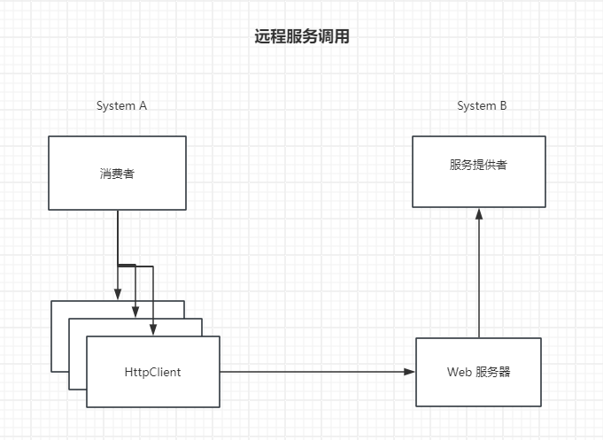
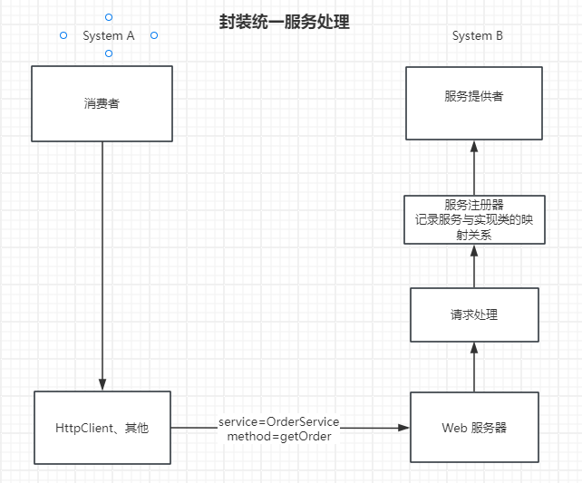
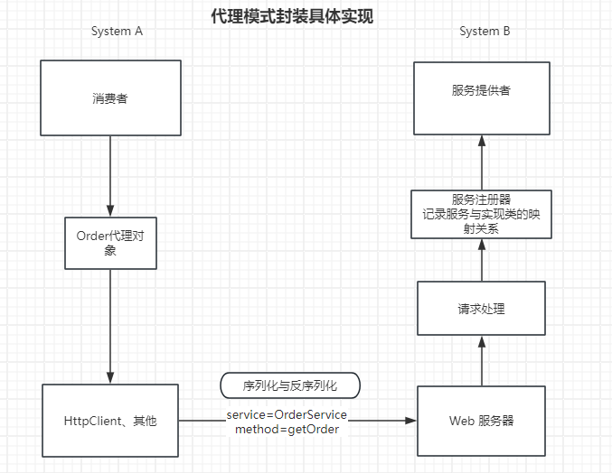
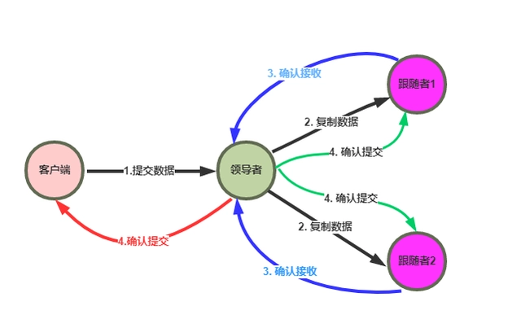
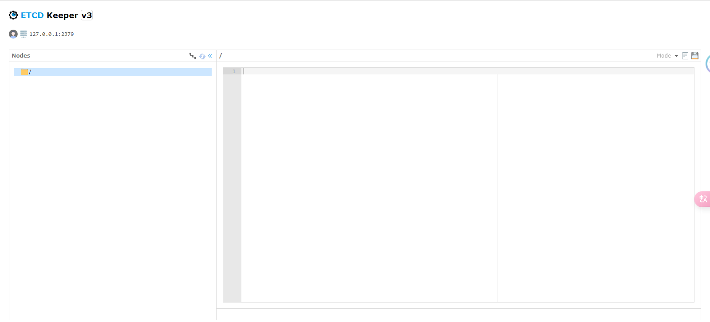
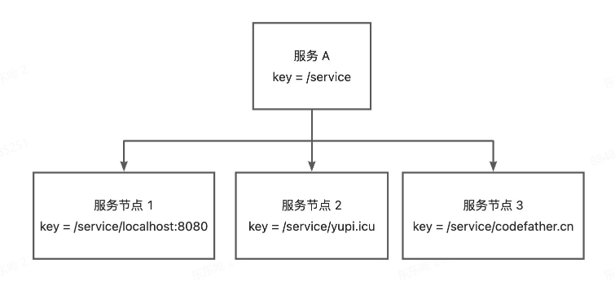
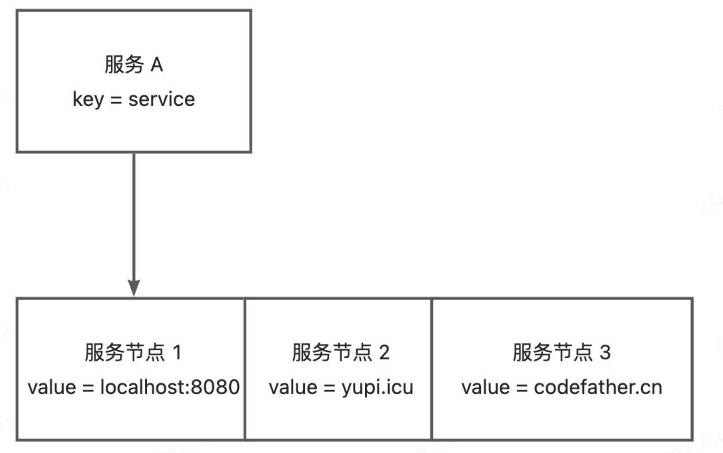
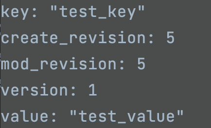
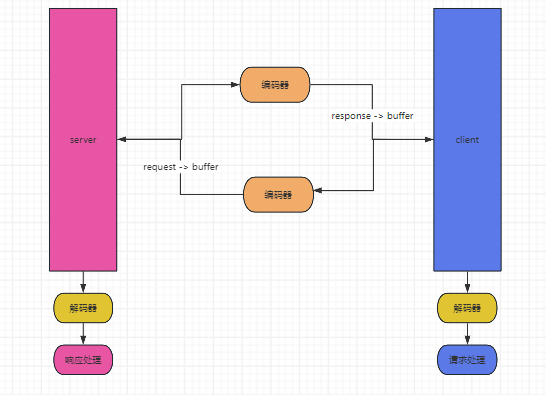

# 手写RPC框架

## 目录

- [1期 简易版RPC框架](#1期-简易版RPC框架)
  - [基本架构](#基本架构)
  - [具体实现](#具体实现)
    - [Common 公共服务](#Common-公共服务)
    - [Servicer 服务提供者](#Servicer-服务提供者)
    - [Consumer 服务消费者](#Consumer-服务消费者)
    - [Vertx 构建Web服务器](#Vertx-构建Web服务器)
    - [本地服务注册器](#本地服务注册器)
    - [序列化器](#序列化器)
    - [请求处理器](#请求处理器)
    - [基于代理发起调用](#基于代理发起调用)
    - [消费者使用](#消费者使用)
  - [测试](#测试)
- [2期 全局配置加载](#2期-全局配置加载)
  - [提取配置信息](#提取配置信息)
  - [配置信息工具类](#配置信息工具类)
  - [全局配置对象](#全局配置对象)
- [3期 Mock数据](#3期-Mock数据)
  - [Mock代理](#Mock代理)
  - [代理工厂](#代理工厂)
- [4期 序列化器与SPI机制](#4期-序列化器与SPI机制)
  - [序列化工具](#序列化工具)
  - [动态序列化](#动态序列化)
  - [SPI机制](#SPI机制)
  - [实现SPI](#实现SPI)
- [5期 注册中心的基本实现](#5期-注册中心的基本实现)
  - [注册中心的核心能力](#注册中心的核心能力)
  - [ETCD分布式存储](#ETCD分布式存储)
  - [etcd的安装](#etcd的安装)
  - [etcd可视化工具](#etcd可视化工具)
  - [使用etcd 提供的Java客户端](#使用etcd-提供的Java客户端)
    - [jetcd](#jetcd)
    - [存储结构设计](#存储结构设计)
    - [开发实现](#开发实现)
- [6期 注册中心优化](#6期-注册中心优化)
  - [优化详情](#优化详情)
  - [心跳机制和续期机制](#心跳机制和续期机制)
    - [方案](#方案)
    - [实现](#实现)
    - [测试](#测试)
  - [服务节点下线机制](#服务节点下线机制)
  - [缓存优化](#缓存优化)
    - [方案](#方案)
    - [实现](#实现)
- [7期 自定义协议](#7期-自定义协议)
  - [设计思路](#设计思路)
  - [开发实现](#开发实现)
- [8期 负载均衡](#8期-负载均衡)
  - [开发实现](#开发实现)
- [9期 重试机制](#9期-重试机制)
  - [重试机制设计](#重试机制设计)
  - [开发实现](#开发实现)

## 1期 简易版RPC框架

### 基本架构

RPC: Remote Procedure Call 远程服务调用，一种计算机通讯协议，能够让程序在不同的计算机之间进行通信和交互。

如果程序分布在不同的计算机上，没有RPC 的情况下，我们应该如何进行程序之间的服务调用呢？

由于不能像SDK 那样直接能够以包的形式进行导入，所以服务之间的调用需要使用到httpclient进行请求构造，通过不断地发送HTTP请求和接收HTTP响应来处理服务调用

```java 
String url = "...";
Request re = new Request(arg1,arg2,arg3,...);
res = HttpClient.post(url).body(req).execute();


```


RPC（远程过程调用）和HTTP客户端（HTTPClient）之间有几个主要的区别，包括：

1. 网络调用方式：RPC是一种远程过程调用的方式，它允许远程进程调用本地进程的函数，而HTTP客户端是一种用于HTTP请求和响应的客户端，它允许本地应用程序与HTTP服务器通信。
2. 编程语言：RPC支持多种编程语言，包括Java，C ++，Python等，而HTTP客户端通常是基于一种编程语言开发的。
3. 通信模型：RPC使用异步通信模型，而HTTP客户端通常使用同步通信模型。
4. 调用参数：RPC调用参数可以是字符串、对象或类等，而HTTP客户端通常需要传递文本参数。
5. 网络负载：RPC可以将一个远程进程调用的负载转移到多个本地进程中，而HTTP客户端通常只有一个本地进程在进行网络通信。

因此，RPC和HTTP客户端之间的主要区别在于它们的通信方式、支持的编程语言、通信模型、调用参数类型和网络负载等方面。

在没有RPC 框架的支援下，我们总是需要System B 为我们暴露接口（Controller），然后我们在System A 不断地构造HTTP服务器（okHttp，RestClient）发送连接，即便我们可以自行封装Http服务器，但是这也是一个非常大的成本和资源消耗了。



我们再看看RPC的作用，让我们像调用本地方法一样地去调用其他设备系统提供的方法。

那我们平时调用方法都是怎么调用的呢？很简单，类名.方法名（参数）即可，当然这也是方法调用的必需品，所以我们还需要考虑这么多吗？我们只需要传输的是我们要调用的类名（服务名），类名下的哪个方法名，以及对应的参数告诉System B 我们需要调用什么服务，然后System B 通过反射机制调取方法就行了不是吗？



当然Http请求是不解析我们的Java对象的，所以我们在传输请求的时候一定要注意序列化与反序列化，而既然是想要让调用者像调用本地方法一样去调用远程方法，那必然是对底层实现进行封装，只需把对应实现暴露给调用者就行了，这听着不就是代理该干的事吗？

没错，只需用代理模式对具体实现进行封装即可



这就是整个RPC框架的大体逻辑，但是细节往往才是决定产品的成败的

### 具体实现

从架构图中不难发现其中的四大角色

1. 服务消费者
2. 服务提供者
3. RPC框架
4. 公共接口调用服务

所以我们在代码中也需要创建4个模块

1. demo-consumer 进行远程接口调用
2. demo-servicer 提供远程接口服务
3. demo-rpc 构建远程接口调用链路
4. demo-common 统一接口调用信息

#### Common 公共服务

首先我们需要现在common模块下构建所需的Model

```java 
@Data
public class User implements Serializable {

    private String username;

    private String password;
}

```


必须要实现序列化接口

#### Servicer 服务提供者

服务提供者主要是对服务接口进行具体实现的

```java 
public class UserServiceImpl implements Userservice {
    @Override
    public User getUserInfo() {
        User user = new User();
        user.setUsername("Tom");
        user.setPassword("123456");
        return user;
    }
}
```


#### Consumer 服务消费者

服务者负责调用服务

```java 
public class Main {

    public static void main(String[] args) {
        //调用服务
        Userservice userservice = null;

        User user = new User();
        user.setUsername("Tom");
        user.setPassword("123456");

        User userInfo = userservice.getUserInfo(user);
        System.out.println(userInfo);

    }
}
```


但是问题是Userservice 的接口实现我们是无法获取的（因为是远程调用，或者说我们并没有引入对应的包），虽然我们确实像本地调用一样的调用方法

那么既然要远程，我们就必须要自行构建web服务器，帮助我们远程构建连接

#### Vertx 构建Web服务器

既然要进行远程服务调用，那么必然离不开服务器，所以我们可以采用更加轻量级，高性能的Vertx构建服务器框架，当然Netty，NIO 等也是完全可以的。

首先对外提供统一的服务器开启接口

```java 
public interface HttpServer {

    void doStart(int port);

}

```


然后实现服务器的构建

```java 
public class VertxHttpServerImpl implements HttpServer {
    @Override
    public void doStart(int port) {
//        1. 创建Vertx 实例
        Vertx vertx = Vertx.vertx();
//        2. 基于Vertx 创建Http服务器
        io.vertx.core.http.HttpServer httpServer = vertx.createHttpServer();
//        3.监听端口并处理请求
        httpServer.requestHandler(r -> {
            System.out.println("接收到来自 "+ r.uri() + "的请求");
            //3.1 Http响应处理
           r.response().putHeader("content-type","text/plain")
                   .end();
        });
//        4.启动服务器并监听指定端口
        httpServer.listen(port,result -> {
                //连接成功处理
                if (result.succeeded()){
                    System.out.println(port + "端口已开启服务");
                }else{
                    System.out.println("服务启动失败");
                }
        });
    }
}

```


#### 本地服务注册器

当然想要远程调用，我们必须有远程服务的具体信息，这样我们才能根据具体的远程服务进行调用。在简版RPC框架中，由于没有远程注册中心，我们暂时只能把信息存储在本地，即本地服务注册器。通过这个本地服务注册器，我们才能根据具体的远程服务，发送信息到远程设备再通过反射进行调用

这部分功能仍然是我们RPC框架应该具备的功能

```java 
/**
 * FileName: LocalRegistry
 * Author:   Administrator
 * Date:     3/14/2024 11:09 AM
 * Description: 本地服务注册器
 * History:
 * <author>          <time>          <version>          <desc>
 * 作者姓名           修改时间           版本号              描述
 */
package cn.t.rpc.registry;

import java.util.Map;
import java.util.concurrent.ConcurrentHashMap;

/**
 * 〈一句话功能简述〉<br> 
 * 〈本地服务注册器〉
 *
 * @author tangzhaofneg
 * @create 3/14/2024 11:09 AM
 * @since 1.0.0
 */
public class LocalRegistry {

    /**
     * 服务信息存储
     * */
    private static final Map<String,Class<?>> map = new ConcurrentHashMap<>();


    /**
     * @Description 注册服务
     * @Author  tangzhaofeng
     * @Date   
     * @Param 
     * @return  
    */
    public static void register(String name,Class<?> clazz){
        map.put(name,clazz);
    }

    /**
     * @Description 获取服务
     * @Author  tangzhaofeng
     * @Date
     * @Param
     * @return
    */
    public static Class<?> get(String name){
        return map.get(name);
    }
    
    /**
     * @Description 删除服务
     * @Author  tangzhaofeng
     * @Date   
     * @Param 
     * @return  
    */
    public static void remove(String name){
        map.remove(name);
    }
}

```


#### 序列化器

序列化和反序列是为了能够让Java对象能够在网络中进行传输，当然这其实也是为了能够让不同语种的对象能够在网络中传输。

- 序列化 将Java对象转为可传输的字节数组
- 反序列化 将字节数组转为Java对象

以下代码是统一的方法代码，需要用到直接抄就行了

序列化接口

```java 
public interface Serializer {

    /**
     * @Description 序列化接口方法
     * @Author  T
     * @Date
     * @Param
     * @return
    */
    <T> byte[] serializer(T object) throws Exception;

    /**
     * @Description 反序列化接口方法
     * @Author  T
     * @Date
     * @Param
     * @return
    */
    <T> T deserializer(byte[] bytes,Class<T> type) throws Exception;

}
```


具体实现（基于JDK自带的序列化方法）

```java 
public class JdkSerializer implements Serializer{
    @Override
    public <T> byte[] serializer(T object) throws Exception {
        ByteArrayOutputStream outputStream = new ByteArrayOutputStream();
        ObjectOutputStream objectOutputStream = new ObjectOutputStream(outputStream);
        objectOutputStream.writeObject(object);
        objectOutputStream.close();
        return outputStream.toByteArray();
    }

    @Override
    public <T> T deserializer(byte[] bytes, Class<T> type) throws Exception {
        ByteArrayInputStream inputStream  = new ByteArrayInputStream(bytes);
        ObjectInputStream objectInputStream = new ObjectInputStream(inputStream);
        try{
            return (T)objectInputStream.readObject();
        }catch (ClassNotFoundException e){
            throw  new RuntimeException();
        }finally {
            objectInputStream.close();
        }
    }
}

```


#### 请求处理器

请求处理是rpc帮助消费者完成的，即消费者只需关注他需要调用什么方法？需要传什么参数？而服务提供者也只需要知道他接收什么参数就返回什么结果就行了。

所以对于请求和响应的处理理应交给rpc来完成

首先我们就需要先封装RPC的请求体，即服务调用的必须属性

```java 
@Data
@Builder
@NoArgsConstructor
@AllArgsConstructor
public class RpcRequest {

    private String serverName;

    private String methodName;

    private Class<?>[] parameterTypes;

    private Object[] args;

}

```


RPC 请求响应封装

```java 
@Data
@NoArgsConstructor
@AllArgsConstructor
@Builder
public class RpcResponse implements Serializable {
    private Object data;

    private Class<?> dataType;

    private String message;

    private Exception exception;
}

```


透过封装请求响应体，我们可以通过Vert.x来处理Http请求

如何处理Http请求呢？带着这张图一起来看看


思路如下

1. 消费者发送过来已经被序列化的请求，参数有服务，方法名，所以我们首先需要先将序列化的对象先反序列化成我们需要的Java对象
   ```java 
           //指定序列化器
           final Serializer serializer = new JdkSerializer();
           //异步处理Http 请求
           request.bodyHandler(body -> {
               byte[] bytes = body.getBytes();
               RpcRequest rpcRequest = null;
               try {
                    rpcRequest = serializer.deserializer(bytes,RpcRequest.class);
               } catch (Exception e) {
                   throw new RuntimeException(e);
               }
               //构建响应对象
               RpcResponse rpcResponse = new RpcResponse();
               if (rpcRequest == null){
                   rpcResponse.setMessage(" Request is null !");
                   try {
                       doResponse(request,rpcResponse,serializer);
                   } catch (Exception e) {
                       throw new RuntimeException(e);
                   }
                   return;
               }

   ```

2. 然后我们需要到服务注册器中通过服务名匹配到对应的实现类
   ```java 
     Class<?> aClass = LocalRegistry.get(rpcRequest.getServerName());
   ```

3. 再通过Java提供的反射机制来调用方法，获取结果
   ```java 
     Method method = aClass.getMethod(rpcRequest.getMethodName(), rpcRequest.getParameterTypes());
     //调用结果
     Object result = method.invoke(aClass.newInstance(), rpcRequest.getArgs());
   ```

4. 将返回的结果进行封装和重新序列化，写回到响应中
   ```java 
    //封装响应
   rpcResponse.setData(result);
   rpcResponse.setDataType(method.getReturnType());
   rpcResponse.setMessage("ok");
   doResponse(request,rpcResponse,serializer);
   ```

   序列化结果并返回响应
   ```java 
       /**
        * @Description 返回响应
        * @Author tangzhaofeng
        * @Date
        * @Param
        * @return
       */
       private void doResponse(HttpServerRequest request,RpcResponse response , Serializer serializer) throws Exception {
           HttpServerResponse serverResponse = request.response().putHeader("content-type","application/json");
           byte[] serializered = serializer.serializer(serverResponse);
           serverResponse.end(Buffer.buffer(serializered));
       }
   ```


完整代码

```java 
/**
 * 〈一句话功能简述〉<br> 
 * 〈HTTP请求处理器〉
 *
 * @author tangzhaofeng
 * @create 3/18/2024 9:27 AM
 * @since 1.0.0
 */
public class HttpServerHandler implements Handler<HttpServerRequest> {
    @Override
    public void handle(HttpServerRequest request) {
        //指定序列化器
        final Serializer serializer = new JdkSerializer();
        //异步处理Http 请求
        request.bodyHandler(body -> {
            byte[] bytes = body.getBytes();
            RpcRequest rpcRequest = null;
            try {
                 rpcRequest = serializer.deserializer(bytes,RpcRequest.class);
            } catch (Exception e) {
                throw new RuntimeException(e);
            }
            //构建响应对象
            RpcResponse rpcResponse = new RpcResponse();
            if (rpcRequest == null){
                rpcResponse.setMessage(" Request is null !");
                try {
                    doResponse(request,rpcResponse,serializer);
                } catch (Exception e) {
                    throw new RuntimeException(e);
                }
                return;
            }

            //获取想要调用的服务实现类，通过反射调用
            try {
                Class<?> aClass = LocalRegistry.get(rpcRequest.getServerName());
                Method method = aClass.getMethod(rpcRequest.getMethodName(), rpcRequest.getParameterTypes());
                //调用结果
                Object result = method.invoke(aClass.newInstance(), rpcRequest.getArgs());
                //封装响应
                rpcResponse.setData(result);
                rpcResponse.setDataType(method.getReturnType());
                rpcResponse.setMessage("ok");
                doResponse(request,rpcResponse,serializer);
            } catch (NoSuchMethodException e) {
                throw new RuntimeException(e);
            } catch (InvocationTargetException e) {
                throw new RuntimeException(e);
            } catch (IllegalAccessException e) {
                throw new RuntimeException(e);
            } catch (InstantiationException e) {
                throw new RuntimeException(e);
            } catch (Exception e) {
                throw new RuntimeException(e);
            }
        });

    }

    /**
     * @Description 返回响应
     * @Author tangzhaofeng
     * @Date
     * @Param
     * @return
    */
    private void doResponse(HttpServerRequest request,RpcResponse response , Serializer serializer) throws Exception {
        HttpServerResponse serverResponse = request.response().putHeader("content-type","application/json");
        byte[] serializered = serializer.serializer(serverResponse);
        serverResponse.end(Buffer.buffer(serializered));
    }
}

```


最后我们需要为我们创建的Http服务器导入这个Http请求处理器

```java 
   1. 创建Vertx 实例
        Vertx vertx = Vertx.vertx();
//        2. 基于Vertx 创建Http服务器
        io.vertx.core.http.HttpServer httpServer = vertx.createHttpServer();
//        3.添加自定义的Http服务请求处理
         httpServer.requestHandler(new HttpServerHandler()); 
//        4.启动服务器并监听指定端口
        httpServer.listen(port,result -> {
                //连接成功处理
                if (result.succeeded()){
                    System.out.println(port + "端口已开启服务");
                }else{
                    System.out.println("服务启动失败");
                }
        });
```


#### 基于代理发起调用

为什么RPC的核心就是让用户像调用本地方法一样的去调用远程方法，不是因为RPC真的那么神奇，而是RPC把任务都拦自己身上了，让用户只需要关注发送参数，服务名，方法名然后接收结果就行了。实现方式当然是离不开我们耳熟能详的代理模式了。

代理有分为动，静态代理，静态代理只能给固定类型的类做代理，简而言之，就是只认准一种类，只替这种类干活。

而动态代理则是谁都帮，大好人，所以我们这里采用的当然是动态代理了，常用的动态代理有一是基于JDK的动态代理，他只能给接口类型的对象做动态代理，而另一种CGLIB则更为灵活，他可以对任何类进行代理，不过JDK提供的动态代理在性能上会略高，如果是考虑性能的话，采用基于JDK的动态代理会更加合适。

具体实现

```java 
public class ServiceProxy implements InvocationHandler {

    @Override
    public Object invoke(Object proxy, Method method, Object[] args) throws Throwable {
        Serializer serializer = new JdkSerializer();
        //构造请求
        RpcRequest request = RpcRequest.builder()
                .serverName(method.getDeclaringClass().getName())
                .methodName(method.getName())
                .parameterTypes(method.getParameterTypes())
                .args(args)
                .build();
        //序列化请求
        byte[] serializered = serializer.serializer(request);
        //构造Http服务器发送请求
        try {
            HttpResponse response = HttpRequest.post("http://localhost:8080").body(serializered).execute();
            byte[] bytes = response.bodyBytes();
            //反序列化结果
            RpcResponse result = serializer.deserializer(bytes, RpcResponse.class);
            return result.getData();
        } catch (Exception e) {
            throw new RuntimeException(e);
        }
    }
}

```


基于工厂模式简化获取代理的过程

```java 
public class ServiceProxyFactory {

    //暴露生成代理方法给外部使用
    public static <T> T getProxy(Class<T> sclass){
        return (T) Proxy.newProxyInstance(
                sclass.getClassLoader(),
                new Class[]{sclass},
                new ServiceProxy());
    }

}
```


到此，简版的RPC框架就到此先告一段落了

#### 消费者使用

此时消费者使用就相当简单了，核心就是直接根据代理工厂请求代理帮助我们完成请求调用

```java 
 //调用服务
 Userservice userservice = ServiceProxyFactory.getProxy(Userservice.class);
 User user = new User();
 user.setUsername("Tom");
 user.setPassword("123456");
 User userInfo = userservice.getUserInfo(user);
 System.out.println(userInfo);
```


### 测试

## 2期 全局配置加载

硬编码是一个神奇的编码方式，RPC作为一个通用的远程调用框架，不可能跟一个主机或者一个IP强绑定的，所以抽取全局配置是一个非常必要的行为，全局的通过的配置，我们都应该抽取出来，这也是编程应有的思考方式。

#### 提取配置信息

使用惯了 Springboot 总想直接用注解去搞定配置，如果没了Springboot又该如何读取配置呢

1. 使用Java 提供的 Properties 进行配置文件读取
2. 使用第三方工具类

根据目前的项目，暂时能够提取的配置有

1. name
2. version
3. serverHost
4. serverPort

根据这部分我们便可以提供一个RpcConfig类来管理这些配置信息了

```java 
@Data
public class RpcConfig {

    private String name = "t-rpc";

    private String version = "v-1.0";

    private String serverHost = "localhost";

    private Integer serverPort = 8080;
}

```


#### 配置信息工具类

并且借用Hutool提供的Props工具类来快速读取配置并转为Bean

```java 
public class ConfigUtils {

    /**
     * @Description 加载默认配置环境信息
     * @Author tangzhaofeng
     * @Date
     * @Param
     * @return
    */
    public  static <T> T loadConfig(Class<T> tClass,String perfix){
        return loadConfig(tClass,perfix,null);
    }

    /**
     * @Description 加载配置信息转至对象（根据环境区分）
     * @Author tangzhaofeng
     * @Date
     * @Param
     * @return
    */
    private static <T> T loadConfig(Class<T> tClass, String perfix, String env) {
            StringBuilder configFile = new StringBuilder("application");
            //根据环境进行拼接
            if (StrUtil.isNotBlank(env)) configFile.append("-").append(env);
            configFile.append(".properties");
            Props props = new Props(configFile.toString());
            return props.toBean(tClass,perfix);
    }
}

```


#### 全局配置对象

全局配置对象理应是我们能够在程序运行中需要的时候随时都能从当中获取信息的，而不是再需要我们创建一个对象存储信息再去获取。

为了减少这些不必要的内存消耗，完全可以使用单例模式来帮助我们能够在程序中只存在一个配置对象。

我们可以效仿Springboot 那样，在初始化项目的时候就加载单例配置并存储在内存中供我们随时使用

```java 
  private static volatile RpcConfig rpcConfig;
  
   /**
     * @Description 返回全局单例配置
     * @Author tangzhaofeng
     * @Date
     * @Param
     * @return
    */
    public static RpcConfig getRpcConfig(){
        if (rpcConfig == null){
            synchronized (RpcApplication.class){
                if(rpcConfig == null){
                    init();
                }
            }
        }
        return rpcConfig;
    }

```


这里使用的是双检锁单例模式，也是比较流行的单例写法了

剩余的就是提供的加载配置的静态方法了

```java 
/**
     * @Description 项目初始化
     * @Author  tangzhaofeng
     * @Date
     * @Param
     * @return
    */
    private static void init() {
        RpcConfig newRpcconfig;
        try{
            //加载配置
            newRpcconfig = ConfigUtils.loadConfig(RpcConfig.class, RpcConstants.DEFAULT.getPrefix());
        }catch (Exception e){
            //加载失败
            newRpcconfig = new RpcConfig();
        }
        load(newRpcconfig);
    }
    
    /**
     * @Description 加载配置文件
     * @Author  tangzhaofeng
     * @Date
     * @Param
     * @return
    */
    private static void load(RpcConfig newRpcConfig){
        rpcConfig = newRpcConfig;
        log.info("RPC Config loaded ");
    }
```


完成以后 全局加载配置 也算是OK 了

```java 
    @Test
    public void getConfig(){
        RpcConfig rpcConfig = RpcApplication.getRpcConfig();
        System.out.println(rpcConfig);
    }

```


测试跑通即可

## 3期 Mock数据

Mock 是指模拟对象，帮助我们进行一些远程连接，确保远程连接的业务逻辑能够跑通，在单测中是常见的技术。

Mock可以采用以往的动态代理帮助我们在调用方式时返回完整对象来帮助我们跑通整个业务逻辑。

具体跟以往常见Http动态代理服务相似，代理具体干的事情就是在根据方法返回值来进行数据模拟

### Mock代理

```java 


    /**
     * @Description 根据方法的返回类型返回相关的Mock值
     * @Author tangzhaofeng
     * @Date
     * @Param
     * @return
    */
    @Override
    public Object invoke(Object proxy, Method method, Object[] args) throws Throwable {
        Class<?> returnType = method.getReturnType();
        return getDefaultObject(returnType);
    }


    /**
     * @Description 生成指定类型的默认值对象
     * @Author tangzhaofeng
     * @Date   
     * @Param 
     * @return  
    */
    private Object getDefaultObject(Class<?> type){
        //基本类型
        if (type.isPrimitive()){
            if (type == boolean.class){
                return false;
            } else if (type == short.class) {
                return (short)0;
            } else if (type == long.class) {
                return 0.0;
            }
        }
        //对象类型
        return null;
    }
```


### 代理工厂

最后在代理工厂提供创建方法

```java 

    /**
     * @Description Mock代理工厂
     * @Author tangzhaofeng
     * @Date
     * @Param
     * @return
    */
    public static <T> T getMockProxy(Class<T> clazz){
        return (T)Proxy.newProxyInstance( clazz.getClassLoader(),
                new Class[]{clazz},
                new MockServiceProxy());
    }

```


## 4期 序列化器与SPI机制

#### 序列化工具

拓展序列化，以往的简版RPC框架序列化的方式是通过JDK提供的API进行序列化的，而我们常用的数据序列化的方式有很多，而且各有优势

1. JSON

   优：易读性强，通用性强，而且具备很多强大的工具库

   缺：序列化后的体积较大，毕竟是文本存储，有涉及到特殊的键值结构
2. Hessian

   优：二进制序列化，序列化后的体积较小，网络传输效率高

   缺：性能较低，毕竟涉及到了二进制的转换，对象必须实现序列化接口
3. Kryo

   优：高性能，序列化与反序列化的速度较快，适用于复杂数据结构

   缺：只适用于Java ，对象序列化的格式不够友好
4. Protobuf

   优：高效，序列化后的体积较小，支持多语言

   缺：配置复杂，序列化后格式不容易读懂

#### 动态序列化

既然有这么多序列化器，作为一款高效的RPC框架，我们应该把序列化器的选择交给开发者，让他们按需求选择序列化器，那么怎么实现动态的序列化器呢

当然他们完全可以修改代码中的JdkSerializer序列化器，修改成自定义的序列化器

```java 
 final Serializer serializer = new JdkSerializer();
```


但是这样显然是不应该的，违背了开放-封闭原则，那么应该怎么样才能让开发者既能指定自定义的序列化器，又能不修改我们提供的框架代码呢

思路：

RPC框架能够读取到开发者自定义的类路径，并加载该类，作为序列化器的接口实现即可，这就不得不说Java提供的SPI机制了

#### SPI机制

SPI机制允许服务提供者通过特定的配置文件将自己的实现注册到系统中，然后系统通过反射机制动态加载这些实现，而不需要修改原始框架的代码，从而实现了系统的解耦，提高了可扩展性

#### 实现SPI

1. 系统实现

   Java内部已经提供了SPI机制相关的接口，可以直接使用

   首先，需要在资源路径下创建META-INF/services/具体接口引用 这么一个接口文件

   

   然后在该文件下写下接口的实现类引用
   ```java 
   cn.t.rpc.serializer.JdkSerializer
   ```

   然后通过系统提供的SPI机制 来加载该服务接口的实现类
   ```java 
      @Test
       public void spiTest(){
           Serializer serializer = null;
           ServiceLoader<Serializer> loader = ServiceLoader.load(Serializer.class);
           for (Serializer seria : loader) {
               serializer = seria;
           }
           System.out.println(serializer.getClass()); 
           //结果：class cn.t.rpc.serializer.JdkSerializer
       }
   ```

2. 自定义实现

   虽然系统有给我们提供API接口来调用SPI 服务加载，但是我们还可以选择自定义实现，这样我们可以通过自定义SPI文件格式来帮助我们更好地实现和维护自定义的SPI机制

   首先，我们要实现我们提供的可以序列化的方法

   实现json序列化器，代码可以充当自己的代码库了
   ```java 
   public class JsonSerializer implements Serializer{

       private static final ObjectMapper OBJECT_MAPPER = new ObjectMapper();

       @Override
       public <T> byte[] serializer(T object) throws Exception {
           return OBJECT_MAPPER.writeValueAsBytes(object);
       }

       @Override
       public <T> T deserializer(byte[] bytes, Class<T> type) throws Exception {
           T t = OBJECT_MAPPER.readValue(bytes, type);
           if (t instanceof RpcRequest){
               return handleRequest((RpcRequest) t,type);
           }
           if (t instanceof RpcResponse){
               return handleResponse((RpcResponse) t,type);
           }
           return t;
       }


       private <T> T handleRequest(RpcRequest request,Class<T> type) throws IOException {
           Class<?>[] parameterTypes = request.getParameterTypes();
           Object[] args = request.getArgs();
           for (int i = 0; i < parameterTypes.length; i++) {
               Class<?> clazz = parameterTypes[i];
               if (clazz.isAssignableFrom(args[i].getClass())){
                   byte[] bytes = OBJECT_MAPPER.writeValueAsBytes(args[i]);
                   args[i] = OBJECT_MAPPER.readValue(bytes,clazz);
               }
           }
           return type.cast(request);
       }

       private <T> T handleResponse(RpcResponse response,Class<T> type) throws IOException {
           byte[] bytes = OBJECT_MAPPER.writeValueAsBytes(response.getData());
           response.setData(OBJECT_MAPPER.readValue(bytes,response.getDataType()));
           return type.cast(response);
       }
   }

   ```

   实现了我们自定义的序列化器后，我们还需要定义所需的SPI 文件
   ```java 
   jdk=cn.t.rpc.serializer.JdkSerializer
   json=cn.t.rpc.serializer.JsonSerializer
   ```

   在这个SPI文件上，我们以键值对的形式定义了序列化器和对应的键名，这样有助于我们根据开发者所需来使用他们想要的序列化器

   紧接着我们就可以开始实现我们自定义的SPI加载类了
   ```java 
   public class SPILoader {

       private static Map<String, Map<String,Class<?>>> loaderMap = new ConcurrentHashMap<>();

       private static Map<String,Object> instanceCache = new ConcurrentHashMap<>();

       private static final String SYSTEM_LOADER_DIR = "META-INF/services";
       private static final String CUSTOM_LOADER_DIR = "META-INF/custom";

       private static final String[] SCAN_DIRS = new String[]{SYSTEM_LOADER_DIR,CUSTOM_LOADER_DIR};

       private static final List<Class<?>> LOAD_CLASS_LIST = Arrays.asList(Serializer.class);


       /**
        * @Description 获取接口实例
        * @Author tangzhaofeng
        * @Date
        * @Param
        * @return
       */
       public static <T> T getInstance(Class<?> clazz,String key){
           String name = clazz.getName();
           Map<String, Class<?>> stringClassMap = loaderMap.get(name);
           Class<?> aClass = stringClassMap.get(key);
           // 存入实例缓存中，防止重复new
           String instanceName = aClass.getName();
           if (!instanceCache.containsKey(instanceName)){
               //缓存中没有的话就将其存入缓存中
               try {
                   instanceCache.put(aClass.getName(),aClass.newInstance());
               } catch (InstantiationException e) {
                   throw new RuntimeException(e);
               } catch (IllegalAccessException e) {
                   throw new RuntimeException(e);
               }
           }
           return (T)instanceCache.get(instanceName);
       }

       
       
       /**
        * @Description 加载某个类型
        * @Author
        * @Date   
        * @Param 
        * @return  
       */
       public static Map<String,Class<?>> load(Class<?> loadClass)  {
           Map<String,Class<?>> classMap = new HashMap<>();
           for (String scanDir : SCAN_DIRS) {
               List<URL> resources = ResourceUtil.getResources(scanDir + loadClass);
               for (URL resource : resources) {
                   InputStreamReader inputStreamReader = null;
                   try {
                       inputStreamReader = new InputStreamReader(resource.openStream());
                   } catch (IOException e) {
                       throw new RuntimeException(e);
                   }
                   BufferedReader bufferedReader = new BufferedReader(inputStreamReader);
                   String line;
                   while (true) {
                       try {
                           if (!((line = bufferedReader.readLine()) != null)) break;
                           String[] split = line.split("=");
                           if (split.length > 1) {
                               String key = split[0];
                               String className = split[1];
                               classMap.put(key, Class.forName(className));
                           }
                       } catch (IOException | ClassNotFoundException e) {
                           throw new RuntimeException(e);
                       }
                   }
               }
           }
           loaderMap.put(loadClass.getName(),classMap);
           return classMap;
       }
   }

   ```

   有了这个自定义的类加载器，还需要修改SerializerFactory的创建方法
   ```java 
       
       static {
               SPILoader.load(Serializer.class);
       }
       
       public static Serializer getInstance(String key){
           return SPILoader.getInstance(Serializer.class,key);
       }
   ```

   其他的我们就可以不用动了，这也是工厂方法的好处，就是解耦了生产者和接收者之间的联系，使得接收者只管调用生产接口就行，具体的实现不需要处理。

## 5期 注册中心的基本实现

RPC调用是一种远程调用的方式，服务之间并不在同一程序甚至不在统一计算机上，所以，服务间的状态调用方和服务方都无从得知的，而且像之前简易版RPC一样，我们想要进行RPC调用还需要进行硬编码才能进行服务调用。

想要更加轻松地管理双方状态，统一管理服务者的服务，和调用者的调用状态，我们就需要引入一个很重要的模块，注册中心。

### 注册中心的核心能力

1. 数据分布式存储
2. 服务注册
3. 服务发现
4. 心跳检测
5. 服务注销
6. 容错，消费缓存等等

### ETCD分布式存储

[https://etcd.io/docs/](https://etcd.io/docs/ "https://etcd.io/docs/")

etcd 是用 Go 编写的，使用 Raft 共识算法来管理高可用性的复制日志。

Raft 共识算法如何保持一致性？

日志复制→客户端发送日志给领导者，随后领导者将日志复制到其他的服务器。如果跟随者故障，领导者将会尝试重试。直到所有的跟随者都成功存储了所有日志。



etcd的上手是非常简单的，其内置了简单的api,数据的过期机制，数据的监听和通知机制，可以说是注册中心的不二之选。

### etcd的安装

1.根据操作系统下载对应的安装包

[https://github.com/etcd-io/etcd/releases/](https://github.com/etcd-io/etcd/releases/ "https://github.com/etcd-io/etcd/releases/")

以win为例，下载完成后会有三个可执行文件，如果是linux的话就是3个可运行脚本

1. etcd: etcd服务本身
2. etcdctl: 客户端，用于操作etcd，比如读写数据
3. etcdutl：备份恢复工具

执行etcd 服务非常简单，直接执行etcd.exe即可

默认服务占用的是2379 和 2380端口

- 2379端口用于提供HTTP API服务
- 2380则是提供给集群间通讯

### etcd可视化工具

- etcdkeeper：<https://github.com/evildecay/etcdkeeper>
- kstone: <https://github.com/kstone-io/kstone/tree/master/charts>

推荐使用etcdkeeper，使用起来更加方便，安装成本也低

直接下载，然后解压，并打开etcdkeeper.exe 就行了

然后访问8080端口



### 使用etcd 提供的Java客户端

#### jetcd

etcd 为我们提供了非常多种类的客户端

常见的有

1. kvClient：用于对etcd中的键值对进行操作，通过kvClient可以进行设置值，获取值，删除值等操作
2. leaseClient： 用于管理etcd 的租约机制，租约是etcd中的一种时间片，用于对键值对分配生存时间，并在租约到期时自动删除相关的键值对
3. watchClient：用于监视etcd中键的变化，并在键的值发生变化时接收到通知
4. clusterClient：用于与etcd集群进行交互
5. authClient：用于管理etcd的身份验证和授权
6. maintenanceClient：用于执行etcd的维护操作
7. lockClient：用于实现分布式锁功能

#### 存储结构设计

1. 层级结构

   
2. 列表结构

   

对于Zookeeper 和 etcd 这种支持层级查询的中间件，采用层级结构会更加清晰，而Redis本身支持列表数据结构的，选择列表结构也是没有问题的。

根据etcd官网提供的实例执行可以查看，我们可以看到插入一个数据时他会为我们添加的几项内容。



其中有版本，创建版本，修改版本等字段，这都是为了帮助我们能够追踪值发生变动情况的。

#### 开发实现

我们需要根据服务信息将这些元信息封装起来

```java 
@Data
public class ServiceMetaInfo {

    private String serviceName;

    private String serviceVersion;

    private String serviceAddress;

    private String serviceGroup;


    /** 
    * @Description: 获取服务键名
    * @Param: 
    * @return: 
    * @Author: tangzhaofeng
    * @Date: 
    */
    public String getServiceName() {
        return String.format("%s:%s", serviceName, serviceVersion);
    }
    
    /** 
    * @Description: 获取服务注册节点键名
    * @Param: 
    * @return: 
    * @Author: tangzhaofeng
    * @Date: 
    */
    public String getServiceNodeKey() {
        return String.format("%s/%s",getServiceName() , serviceAddress);
    }
}
```


封装一个注册中心的配置类，

```java 
@Data
public class RegistryConfig {

    private String registry = "etcd";

    private String address = "http://127.0.0.1:2375";

    private String username;

    private String password;

    private Long timeout = 10000L;

}

```


提供一套注册中心的接口，这也是为了以后可以实现多套注册中心存储中心作拓展，更是可以像序列化器一样，让开发者能够基于SPI机制选择所需的存储中心

```java 
public interface RegistryServices {

    /**
    * @Description: 初始化服务
    * @Param:
    * @return:
    * @Author: tangzhaofeng
    * @Date:
    */
    public void init(RegistryConfig config);


    /** 
    * @Description: 注册服务
    * @Param: 
    * @return: 
    * @Author: tangzhaofeng
    * @Date: 
    */
    public void register(ServiceMetaInfo info);
    
    
    /** 
    * @Description: 注销服务
    * @Param: 
    * @return: 
    * @Author: tangzhaofeng
    * @Date: 
    */
    public void unregister(ServiceMetaInfo info);


    /** 
    * @Description: 服务发现
    * @Param: 
    * @return: 
    * @Author: tangzhaofeng
    * @Date: 
    */
    public List<ServiceMetaInfo> serviceDiscovery(String key);
    
    
    /** 
    * @Description: 服务销毁
    * @Param: 
    * @return: 
    * @Author: tangzhaofeng
    * @Date: 
    */
    public void destroy();
}

```


服务接口实现

```java 
public class RegistryServicesImpl implements RegistryServices {

    private Client client;

    private KV kvClient;


    private static final String ETCD_ROOT_PATH = "/rpc";


    
    @Override
    public void init(RegistryConfig config) {
        //根据配置初始化注册中心
        client = Client.builder().endpoints(config.getAddress()).connectTimeout(Duration.ofMillis(config.getTimeout())).build();
        kvClient = client.getKVClient();
    }

    @Override
    public void register(ServiceMetaInfo info) throws ExecutionException, InterruptedException {
        Lease leaseClient = client.getLeaseClient();
        //创建一个30秒的租约
        long id = leaseClient.grant(30).get().getID();

        //设置注册服务的键值对
        String key = ETCD_ROOT_PATH+ info.getServiceNodeKey();
        ByteSequence saveKey = ByteSequence.from(key, StandardCharsets.UTF_8);
        ByteSequence saveValue = ByteSequence.from(JSONUtil.toJsonStr(info), StandardCharsets.UTF_8);

        //关联租约
        PutOption registerVo = PutOption.newBuilder().withLeaseId(id).build();
        kvClient.put(saveKey,saveValue,registerVo);
    }

    @Override
    public void unregister(ServiceMetaInfo info) {
        //删除对应的注册信息
        kvClient.delete(ByteSequence.from(ETCD_ROOT_PATH+ info.getServiceNodeKey(), StandardCharsets.UTF_8));
    }

    @Override
    public List<ServiceMetaInfo> serviceDiscovery(String key) throws ExecutionException, InterruptedException {
        //遍历所有的注册信息 key -> (server1,server2,server3)
        String serviceKeyPrefix = ETCD_ROOT_PATH+ key + "/";
        GetOption getOption = GetOption.newBuilder().isPrefix(true).build();
        List<KeyValue> result = kvClient.get(ByteSequence.from(serviceKeyPrefix, StandardCharsets.UTF_8), getOption).get().getKvs();
        return result.stream().map(keyValue -> {
            String value = keyValue.getKey().toString(StandardCharsets.UTF_8);
            return JSONUtil.toBean(value,ServiceMetaInfo.class);
        }).collect(Collectors.toList());
    }

    @Override
    public void destroy() {
        if (kvClient != null){
            kvClient.close();
        }
        if (client != null){
            client.close();
        }
    }

}

```


这是关于etcd作为服务中心的操作接口实现

TODO

自己实现其他服务中心，比如zookeeper

## 6期 注册中心优化

到目前为止，其实注册中心的功能基本实现，包括服务注册，服务发现，服务删除，即注册中心的基本服务都能够使用了， 但是仍存在几个需要优化的点

### 优化详情

1. 数据一致性

   即服务提供者如果下线了，要及时感知，剔除下线节点，防止调用者调用已经下线的节点

   心跳检测和续期机制
2. 性能优化

   服务消费者每次都需要从注册中心获取服务，可以使用缓存进行优化

   服务节点下线机制
3. 高可用性

   保证服务中心本身不会宕机

   消费端服务缓存

### 心跳机制和续期机制

心跳检测是一种用于监测系统是否正常工作的机制，它通过定期发送心跳信号（心跳包【请求】）来检测目标系统的状态

如果接收方在一定时间内没有收到心跳信号或者未能正常响应请求，就会认为目标系统故障或者不可用，从而触发相应的处理或警告机制。

心跳机制的应用还是非常广泛的，分布式，健康检查都有它的身影

#### 方案

心跳机制无外乎需要定时发送心跳包监测目标节点是否存活，而etcd他本身具备着续期机制，所以换个思路：

我们可以给每一个注册的信息一个倒计时，倒计时过了还不进行续期，我们就可以认为这个节点信息已经挂了，etcd就可以对key进行过期删除了，当然这里还可以扩展成需要重试几次，确认节点信息无法正常续期，再进行过期删除。

所以在etcd中想要实现心跳检测和续期机制，可以采用以下思路

1. 服务提供者向Etcd注册自己的服务信息，并在注册时设置TTL
2. Etcd在接收到服务提供者的注册信息后，会自动维护服务信息的TTL，并在TTL过期时删除该信息
3. 服务提供者定时请求Etcd续签自己的注册信息，并重写TTL

#### 实现

在注册中心统一接口中创建心跳检测接口

```java 
    /**
    * @Description: 心跳检测
    * @Param:
    * @return:
    * @Author: tangzhaofeng
    * @Date: 4/12/2024
    */
    public void heartBeat();
```


在实现类中我们还需要维护一张已注册信息的表，用于给我们为注册节点进行续期或者移除的

```java 
// 维护缓存节点，用于续期
    private final Set<String> localRegisterNodeKeys = new HashSet<>();
```


当然我们在注册节点或者移除节点时都要多加一个操作就是对localRegisterNodeKeys 进行添加或移出

```java 
  @Override
    public void register(ServiceMetaInfo info) throws ExecutionException, InterruptedException {
        ...
        //添加注册的节点至缓存节点中
        localRegisterNodeKeys.add(key);
    }
```


```java 
@Override
    public void unregister(ServiceMetaInfo info) {
        ...
        localRegisterNodeKeys.remove(key);
    }

```


实现心跳检测接口

```java 

    @Override
    public void heartBeat() {
        CronUtil.schedule("*/10 * * * * ?", new Task() {
            @Override
            public void execute() {
                for (String key : localRegisterNodeKeys) {
                    try {
                        List<KeyValue> kvs = kvClient.get(ByteSequence.from(key.getBytes(StandardCharsets.UTF_8))).get().getKvs();
                        // 无法根据key获取到内容，说明节点信息已过期
                        if (CollUtil.isEmpty(kvs)){
                            continue;
                        }
                        //节点能够获取节点信息，则续期
                        KeyValue keyValue = kvs.get(0);
                        String value = keyValue.getValue().toString(StandardCharsets.UTF_8);
                        ServiceMetaInfo bean = JSONUtil.toBean(value, ServiceMetaInfo.class);
                        //重新注册续期
                        register(bean);
                    } catch (InterruptedException e) {
                        throw new RuntimeException(e);
                    } catch (ExecutionException e) {
                        throw new RuntimeException(e);
                    }
                }
            }
        });
    }
```


#### 测试

### 服务节点下线机制

服务节点下线可分为：

1. 主动下线：服务提供者正常退出，主动从注册中心移出信息
2. 被动下线：服务提供者异常退出，由etcd提供的过期机制来将服务节点移除

被动下线在etcd 的heartBeat中已经实现了

JVM提供的ShutdownHook允许开发者在JVM关闭前执行一些相关的操作，比如释放资源，关闭连接等等，当然Springboot也提供了类似的优雅停机的能力。

被动下线这个情况在续期机制已经实现了

主动下线则是需要在JVM ShutdownHook回调中进行使用

首先需要先实现节点下线的接口

```java 
@Override
    public void destroy() {
        log.info("当前节点已下线。。。。。");
        //将下线的节点信息从存储中心删除
        for (String key : localRegisterNodeKeys) {
            try {
                kvClient.delete(ByteSequence.from(key, StandardCharsets.UTF_8)).get();
            } catch (InterruptedException e) {
                throw new RuntimeException(e);
            } catch (ExecutionException e) {
                throw new RuntimeException(e);
            }
        }
        if (kvClient != null){
            kvClient.close();
        }
        if (client != null){
            client.close();
        }
    }
```


然后我们需要把addShutdownHook添加到注册中心初始化阶段

```java 
 private static void init() {
        RpcConfig newRpcconfig;
        try{
            //加载配置
            newRpcconfig = ConfigUtils.loadConfig(RpcConfig.class, RpcConstants.DEFAULT_PERFIX);
            //注册中心初始化
            RegistryConfig registryConfig = rpcConfig.getRegistryConfig();
            RegistryServices registry = RegisterFactory.getNewInstance();
            registry.init(registryConfig);
            load(newRpcconfig);
            //添加JVM关闭前回调
            Runtime.getRuntime().addShutdownHook(new Thread(registry::destroy));
        }catch (Exception e){
            //加载失败
            newRpcconfig = new RpcConfig();
        }
    }
```


### 缓存优化

服务节点的信息其实是很少发生变更的，这也很符合缓存的特征

#### 方案

采用本地缓存，其实就是写一个列表，装载服务节点信息，每次访问时，如果缓存存在就从缓存取，否则就跑存储中心取

#### 实现

首先我们需要准备一个缓存操作类

```java 
public class LocalCache {


    List<ServiceMetaInfo> serviceMetaInfos;


    /**
    * @Description: 写入缓存
    * @Param:
    * @return:
    * @Author: tangzhaofeng
    * @Date: 4/15/2024
    */
    public void writeCache(List<ServiceMetaInfo> newServiceMetaInfos) {
        this.serviceMetaInfos = newServiceMetaInfos;
    }


    /**
    * @Description: 读缓存
    * @Param:
    * @return:
    * @Author: tangzhaofeng
    * @Date: 4/15/2024
    */
    public List<ServiceMetaInfo> readCache(){
        return this.serviceMetaInfos;
    }

    
    /** 
    * @Description: 缓存清空
    * @Param: 
    * @return: 
    * @Author: tangzhaofeng
    * @Date: 4/15/2024
    */
    public void clearCache(){
        this.serviceMetaInfos = null;
    }
}

```


然后我们就可以在服务发现的时候，先查询缓存，缓存有就直接缓存中取数据，否则再查存储中心的数据

```java 
 //注册中心节点缓存
private final LocalCache localCache = new LocalCache();


 @Override
    public List<ServiceMetaInfo> serviceDiscovery(String key) throws ExecutionException, InterruptedException {
        //先从缓存中获取节点信息
        List<ServiceMetaInfo> metaInfosCache = localCache.readCache();
        if (metaInfosCache != null) return metaInfosCache;
        //遍历所有的注册信息 key -> (server1,server2,server3)
        String serviceKeyPrefix = ETCD_ROOT_PATH+ key + "/";
        GetOption getOption = GetOption.newBuilder().isPrefix(true).build();
        List<KeyValue> result = kvClient.get(ByteSequence.from(serviceKeyPrefix, StandardCharsets.UTF_8), getOption).get().getKvs();
        List<ServiceMetaInfo> metaInfos = result.stream().map(keyValue -> {
            String value = keyValue.getKey().toString(StandardCharsets.UTF_8);
            return JSONUtil.toBean(value, ServiceMetaInfo.class);
        }).collect(Collectors.toList());
        //服务发现后写入缓存
        localCache.writeCache(metaInfos);
        return metaInfos;
    }


```


## 7期 自定义协议

### 设计思路

在RPC框架中，HTTP只是RPC框架可选的一种传输载体方式，那有了HTTP，为什么还需要自定义协议呢？&#x20;

- **性能和效率**：HTTP协议包含了很多用于浏览器和服务器之间通信的额外头部信息，这些信息在纯粹的RPC调用中可能是不必要的。自定义协议可以去掉这些额外信息，使得通信更加高效。
- **二进制传输**：HTTP协议是基于文本的，而自定义协议可以是二进制的，这使得数据的序列化和反序列化更加快速，减少了网络传输的数据量。
- **多路复用**：自定义协议可以实现更高效的多路复用机制，允许在同一个连接中同时处理多个请求和响应，而HTTP/1.x版本由于队头阻塞问题，在这方面表现不佳（尽管HTTP/2已经解决了这个问题）。
- **灵活性和扩展性**：自定义协议可以根据特定应用的需求进行定制，支持特定的数据类型、功能或者优化。例如，某些应用可能需要支持特定的数据压缩算法或者加密方法。
- **服务治理**：在大规模服务化架构中，服务治理是一个重要方面，包括服务发现、负载均衡、故障转移等。自定义协议可以更好地集成这些治理功能。
- **跨语言支持**：虽然HTTP本身也是跨语言的，但是自定义协议可以设计得更加通用，以便于不同语言之间更加方便地进行RPC调用。
- **长连接和心跳机制**：自定义协议可以实现长连接，减少频繁建立和断开连接的开销，并通过心跳机制来维护连接的稳定性。

自定义协议应该要先考虑两点：

1. 网络传输
2. 消息结构

HTTP弊端：

1. 分析HTTP请求，得知HTTP协议的头信息比较大，影响传输效率，而且，HTTP是无状态的，每次请求、响应都要重新建立和关闭连接，也会影响性能。
2. HTTP协议是应用层协议，因为多封装了东西，在性能方面肯定是不及传输层TCP协议的，所以如果想要追求更高性能，可以选择使用TCP协议完成网络传输。

消息结构设计的目的是要达到使用更少的空间传递需要的信息

1. 数据类型转为用比较轻量级的数据类型 ，比如说String，int，long等→ byte

消息结构内容：这个可以参考HTTP请求的内容

HTTP请求结构：

1. 魔数
2. 版本号
3. 序列化方式
4. 类型
5. 状态

既然要基于TCP协议来自定义协议，那么我们就要面对TCP协议带来的问题

以往HTTP协议我们想要获取其中的数据，我们可以用request接收并获取对应的attr，requestbody，但是TCP这种流式数据，面向TCP的粘包半包问题，我们应该如何应对呢

解决半包粘包的问题这边采用的是定长数据，半包粘包其实就是TCP不断以流的形式传输，接收端不断接受，但是数据串是不断的，像水流一样我们难以以块状的方式给清晰分离出来转为我们熟悉的字符串，所以给数据定长，按照一定的长度标准来决定如何分块，这样就能准确无误地取出数据啦。

### 开发实现

首先我们需要先把刚刚设计的自定义协议的消息内容定义出来一个类型Message

```java 
/**
* @Description: 自定义协议消息体
* @Param:
* @return:
* @Author: tangzhaofeng
* @Date: 4/23/2024
*/
public class Message<T> {

//    消息头
    private Header header;

//    消息体
    private T body;


    @Data
    public static class Header{

        private byte magic;

        private byte version;

        private byte serializer;

        private byte type;

        private byte status;

        private long requestId;

        private int bodyLength;

    }

}

```


接下来就是为消息体构建一些我们常用的枚举和常量类

首先是常量类

```java 
/**
* @Description: 协议常量类
* @Param:
* @return:
* @Author: tangzhaofeng
* @Date: 4/24/2024
*/
public interface MessageConstant {

    int MESSAGE_HEADER_LENGTH = 17;


    byte MAGIC_NUMBER = 0x1;

    byte VERSION = 0x1;
}

```


接下来是状态枚举，就像HTTP状态码一样，200表示请求成功，500表示服务器异常，我们其实也需要有状态码来表示请求结果的

```java 
@Getter
@AllArgsConstructor
public enum StatusEnum {

    SUCCESS(20000,"success"),
    FAIL_BADRESPONSE(50000,"fail bad response"),
    FAIL_BADREQUEST(40000,"fail bad request");

    private Integer code;

    private String value;

}

```


有了消息，请求状态，我们还差一个描述消息类型的枚举，他可以用来帮助我们更好地处理不同类型的请求的

```java 
/**
* @Description: 消息类型枚举
* @Param:
* @return:
* @Author: tangzhaofeng
* @Date: 4/24/2024
*/

@Getter
@AllArgsConstructor
public enum MessageTypeEnum {

    REQUEST(0),
    RESPONSE(1),
    HEAT_BEAT(2),
    OTHER(3);

    private Integer key;

}

```


当然还有我们之前设计的多种序列化器，我们都需要枚举出来，供开发者使用

```java 
/**
* @Description: 序列化器枚举
* @Param:
* @return:
* @Author: tangzhaofeng
* @Date: 4/24/2024
*/
@Getter
@AllArgsConstructor
public enum SerializerEnum {

    JDK(0,"jdk"),
    JSON(1,"json");

    private Integer key;

    private String value;

}

```


好了，该准备的都准备好了，接下来就是业务实现了

首当其冲的是服务器开发，既然我们决定了采用基于TCP层的网络传输方式，那么我们首先就需要创建一个TCP服务器，可以参照1期的简易版RPC框架中使用Vertx构建HTTP服务器来构建TCP服务器

```java 
/**
* @Description: 基于Vertx 构建TCP服务器
* @Param:
* @return:
* @Author: tangzhaofeng
* @Date: 4/25/2024
*/
public class VertxTcpServerHandle implements ServerHandle {

    private byte[] handleRequest(byte[] requestData){
        return requestData;
    }


    @Override
    public void doStart(int port) {
        Vertx vertx = Vertx.vertx();
        //创建TCP服务器
        NetServer server = vertx.createNetServer();
        //处理请求
        server.connectHandler(netSocket -> {
           netSocket.handler(buffer -> {
              //处理接收到的字节数组
              byte[] requestData = buffer.getBytes();
              //处理请求数据
               byte[] result = handleRequest(requestData);
               //发送响应
               netSocket.write(Buffer.buffer(result));
           });
        });
        //启动服务器
        server.listen(port,res -> {
            if (res.succeeded()){
                System.out.println("TCP server started on port " + port);
            }else{
                System.out.println("TCP server failed to start on port " + port);
            }
        });

    }
}
```


像这样就能实现一个TCP服务器了，TCP服务器最显著的标志是netSocket.write(Buffer.buffer(result));以流的形式发送数据了。

接下来就是客户端的实现了

```java 
public class VertxTcpClient {

    public void start(){
        Vertx vertx = Vertx.vertx();
        vertx.createNetClient().connect(8888,"localhost",result -> {
            if(result.succeeded()){
                System.out.println("TCP Client Connected");
                NetSocket socket = result.result();
                socket.write("connected to server");
                socket.handler(buffer -> {
                    System.out.println(buffer.toString());
                });
            }else{
                result.cause().printStackTrace();
            }
        });
    }

}

```


有了客户端和服务端，接下来就是处理两端间的数据了，所以我们需要有我们的解码器、编码器，编码器和解码器是如何工作的呢？

一图流开始



根据这流程图，一起看看编码器和解码器应该如何开发

编码主要是将message内容转为byte流在服务器中传输，而从刚刚定义的message内容来看，主要有两个信息，一个是协议信息数据，一个是具体数据和数据长度，数据长度主要是为了让我们可以直接根据长度取具体内容而不会导致粘包的情况

```java 
   /** 
    * @Description: 数据编码
    * @Param: 
    * @return: 
    * @Author: T
    * @Date: 4/29/2024
    */
    public static Buffer encode(Message<?> message) throws Exception {
        if (message == null || message.getHeader() == null){
            return Buffer.buffer();
        }
        Message.Header header = message.getHeader();
        //将信息写入到Buffer中
        Buffer buffer = Buffer.buffer();
        buffer.appendByte(header.getMagic());
        buffer.appendByte(header.getSerializer());
        buffer.appendByte(header.getVersion());
        buffer.appendByte(header.getType());
        buffer.appendByte(header.getStatus());
        buffer.appendLong(header.getRequestId());
        //获取序列化器
        SerializerEnum serializerEnum = SerializerEnum.getSerializerEnum((int) header.getSerializer());
        if (serializerEnum == null){
            throw new RuntimeException("serializerEnum is null");
        }
        Serializer serializer = SerializerFactory.getInstance(serializerEnum.getValue());
        byte[] bodys = serializer.serializer(message.getBody());
        buffer.appendBytes(bodys);
        buffer.appendLong(bodys.length);
        return buffer;
    }
```


而解码则需要注意的是我们如何进行编码的，就如何取出来进行解码，需要根据字节长度来取，比如Long占8字节长度，就需要往后8位再取信息

```java 

    /**
    * @Description: 数据解码
    * @Param:
    * @return:
    * @Author: tangzhaofeng
    * @Date: 4/29/2024
    */
    public static Message<?> decode(Buffer buffer) throws Exception {
        Message.Header header = new Message<>().getHeader();
        byte magic = buffer.getByte(1);
        if (magic != MessageConstant.MAGIC_NUMBER){
            throw new RuntimeException("magic number error");
        }
        header.setMagic(magic);
        header.setSerializer(buffer.getByte(2));
        header.setVersion(buffer.getByte(3));
        header.setType(buffer.getByte(4));
        header.setStatus(buffer.getByte(5));
        header.setRequestId(buffer.getLong(6));
        header.setBodyLength(buffer.getInt(13));
        //解决粘包问题，就是只读指定长度问题
        byte[] bodys = buffer.getBytes(17, 17 + header.getBodyLength());
        //反序列化
        SerializerEnum serializerEnum = SerializerEnum.getSerializerEnum((int) header.getSerializer());
        if (serializerEnum == null){
            throw new RuntimeException("serializerEnum is null");
        }
        Serializer serializer = SerializerFactory.getInstance(serializerEnum.getValue());
        MessageTypeEnum messageType = MessageTypeEnum.getSerializerEnum((int) header.getType());
        if (messageType == null) {
            throw new RuntimeException("messageType is null");
        }
        switch (messageType){
            case REQUEST -> {
                RpcRequest request = serializer.deserializer(bodys, RpcRequest.class);
                return new Message<>(header,request);
            }
            case RESPONSE -> {
                RpcResponse response = serializer.deserializer(bodys, RpcResponse.class);
                return new Message<>(header,response);
            }
            case HEAT_BEAT -> {
                return null;
            }
            case OTHER -> {
                return null;
            }
            default -> throw new RuntimeException("unknown message type");
        }
    }
```


## 8期 负载均衡

在RPC框架当中，负载均衡起到的作用就是从一组可用的服务当中取出一个调用

负载均衡的算法有很多

1. 轮询
2. 随机
3. 加权轮询
4. 加权随机
5. 最小连接数
6. IP Hash

为了解决在分布式系统中各个节点能够足够均衡和动态切换的问题，那就不得不说一下一致性Hash这个算法

一致性Hash算法的核心思想是将整个哈希值空间划分成一个环状结构，然后每个节点占据一个位置

TODO 一致性Hash

### 开发实现

由于存在多个负载均衡的方式，所以可以配置一个接口

```java 
public interface Loadbalancer {

    ServiceMetaInfo select(Map<String,Object> params, List<ServiceMetaInfo> serviceMetaInfos);

}

```


首先是随机负载均衡器

```java 
/**
* @Description: 随机负载均衡器
* @Param:
* @return:
* @Author: tangzhaofeng
* @Date: 5/3/2024
*/
public class RandomLoadbalancer implements Loadbalancer{

    private final Random random = new Random();

    @Override
    public ServiceMetaInfo select(Map<String, Object> params, List<ServiceMetaInfo> serviceMetaInfos) {
        int size = serviceMetaInfos.size();
        if (size == 0){
            return null;
        }
        if (size == 1){
            return serviceMetaInfos.get(0);
        }
        return serviceMetaInfos.get(random.nextInt(size));
    }
}

```


接着就是轮询和一致性Hash

```java 
/**
* @Description: 轮询负载均衡器
* @Param:
* @return:
* @Author: tangzhaofeng
* @Date: 5/3/2024
*/
public class RoundRobinLoadbalancer implements Loadbalancer{

    private final AtomicInteger currentIndex = new AtomicInteger(0);

    @Override
    public ServiceMetaInfo select(Map<String, Object> params, List<ServiceMetaInfo> serviceMetaInfos) {
        if (serviceMetaInfos.isEmpty()) {
            return null;
        }
        //只有一个服务的情况下，无需轮询
        int size = serviceMetaInfos.size();
        if (size==1) {
            return serviceMetaInfos.get(0);
        }
        int index = currentIndex.incrementAndGet()%size;
        return serviceMetaInfos.get(index);
    }

}
```


```java 
/**
* @Description: 一致性Hash 实现
* @Param:
* @return:
* @Author: tangzhaofeng
* @Date: 5/6/2024
*/
public class ConsistentHashLoadBalancer implements Loadbalancer{

    private final TreeMap<Integer,ServiceMetaInfo> virtualNodes = new TreeMap<>();

    private static final int VIRTUAL_NODE_SIZE = 100;

    @Override
    public ServiceMetaInfo select(Map<String, Object> params, List<ServiceMetaInfo> serviceMetaInfos) {
        if (virtualNodes.isEmpty()){
            return null;
        }
        //构建虚拟节点环
        for (ServiceMetaInfo serviceMetaInfo : serviceMetaInfos) {
            for (int i = 0; i < VIRTUAL_NODE_SIZE; i++) {
                int hash = getHash(serviceMetaInfo.getServiceAddress() + "#" + i);
                virtualNodes.put(hash, serviceMetaInfo);
            }
        }
        //选择最接近且大于等于调用请求hash值的虚拟节点
        int hash = getHash(params);
        Map.Entry<Integer, ServiceMetaInfo> entry = virtualNodes.ceilingEntry(hash);
        if (entry != null) {
            entry = virtualNodes.higherEntry(hash);
        }
        return entry.getValue();
    }


    /** 
    * @Description: Hash算法，可自行实现
    * @Param:
    * @return:
    * @Author: tangzhaofeng
    * @Date: 5/6/2024
    */
    private int getHash(Object key){
        return key.hashCode();
    }
}

```


一共提供了3种负载均衡策略，接下来老套路了，就是将这三种负载均衡策略提供给开发者使用，即我们要让RPC框架支持和扩展负载均衡器

```java 
/**
* @Description: 负载均衡器支持的算法
* @Param:
* @return:
* @Author: tangzhaofeng
* @Date: 5/7/2024
*/
public interface keys {

    String ROUND_ROBIN = "roundRobin";

    String RANDOM = "random";

    String HASH = "consistentHash";

}

```


提供工厂方法获取负载均衡器

```java 
public class LoadBalancerFactory {

    static {
        SPILoader.load(Loadbalancer.class);
    }

    /**
     * 默认的负载均衡器
     * */
    private static final Loadbalancer loadBalancer = new RoundRobinLoadbalancer();


    /**
     * 获取实例
     * */
    public static Loadbalancer getLoadBalancer(String key) {
        return SPILoader.getInstance(Loadbalancer.class,key);
    }

}
```


## 9期 重试机制

### 重试机制设计

重试机制的设计核心点在于

1. 什么时候，什么条件下重试
   1. 网络，或者服务端等问题都会使得连接会不稳定，所以无法建立连接的时候就会触发重试机制
2. 重试时间
   1. 固定重试间隔 即每隔固定秒数来进行重试
   2. 指数退避重试  根据上一次重试时间，下一次的重试时间间隔会以指数增长，这样可以避免请求过于密集
   3. 随机延迟重试 每次重试时间都是随机的
   4. 可变延迟重试 根据之前的重试时间或者次数，来决定下一次重试的时间
3. 什么时候，什么条件下停止重试
   1. 重试的次数需要有限制，毕竟一直重试就相当于一直占用着资源，所以我们需要有对应的停止重试的策略
      1. 最大尝试次数
      2. 超时停止
4. 重试失败后应怎么做？
   1. 重试失败之后不可能什么都不做滴
      1. 通知告警
      2. 降级容错

### 开发实现

关于重试我们完成可以封装一个可重试的任务类，在类内部封装多种重试策略，重试策略可以通过Guava-Retrying库实现

首先需要有一个RetryStrategy接口，方便我们拓展不同的重试策略

```java 
public interface RetryStrategy {


    RpcResponse doRetry(Callable<RpcResponse> responseCallable) throws Exception;

}

```


然后实现我们的重试策略，固定间隔重试机制，代码显示策略是重试三次，每次时长3秒钟

```java title="FixedIntervalRetryHandler "
@Slf4j
public class FixedIntervalRetryHandler implements RetryStrategy{

    @Override
    public RpcResponse doRetry(Callable<RpcResponse> responseCallable) throws Exception {
        Retryer<RpcResponse> retryer = RetryerBuilder.<RpcResponse>newBuilder()
                .retryIfExceptionOfType(Exception.class)
                .retryIfException()
                .withWaitStrategy(WaitStrategies.fixedWait(3, TimeUnit.SECONDS))
                .withStopStrategy(StopStrategies.stopAfterDelay(3))
                .withRetryListener(new RetryListener() {
                    @Override
                    public <V> void onRetry(Attempt<V> attempt) {
                        //记录重试次数
                        log.info("retry:{}", attempt.getAttemptNumber());
                    }
                }).build();
        return retryer.call(responseCallable);
    }

}
```


TODO 添加拓展部分
