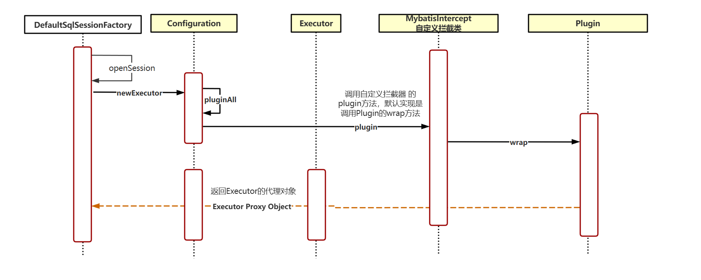
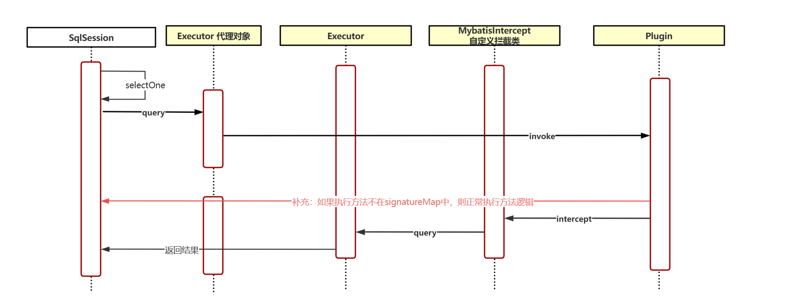

# Mybatis 插件深度剖析

## 目录

- [Mybatis 插件的使用](#Mybatis插件的使用)
  - [代码示例](#代码示例)
    - [实现 Interceptor 拦截器](#实现Interceptor-拦截器)
    - [注册 Interceptor 拦截器](#注册Interceptor-拦截器)
- [Mybatis 插件深度剖析](#Mybatis插件深度剖析)
  - [拦截器在 Mybatis 是如何存在的？](#拦截器在Mybatis是如何存在的)
    - [org.apache.ibatis.plugin.InterceptorChain](#orgapacheibatispluginInterceptorChain)
  - [Interceptor 是如何注册至 Configuration 的呢？](#Interceptor是如何注册至Configuration-的呢)
    - [1. xml 注册 拦截器](#1-xml-注册-拦截器)
      - [org.apache.ibatis.builder.xml.XMLConfigBuilder#pluginElement](#orgapacheibatisbuilderxmlXMLConfigBuilderpluginElement)
    - [2. 基于 ConfigurationCustomizer Bean 添加拦截器 ](#2-基于ConfigurationCustomizer-Bean添加拦截器-)
      - [org.mybatis.spring.boot.autoconfigure.ConfigurationCustomizer](#orgmybatisspringbootautoconfigureConfigurationCustomizer)
      - [org.mybatis.spring.boot.autoconfigure.MybatisAutoConfiguration](#orgmybatisspringbootautoconfigureMybatisAutoConfiguration)
    - [3. @Bean](#3-Bean)
  - [Interceptor 是如何被执行的？](#Interceptor-是如何被执行的)
    - [org.apache.ibatis.plugin.Interceptor#intercept](#orgapacheibatispluginInterceptorintercept)
    - [org.apache.ibatis.plugin.Interceptor#plugin](#orgapacheibatispluginInterceptorplugin)
    - [揭秘为什么只能拦截 Executor ，ParameterHandler ，ResultSetHandler ，StatementHandler ？](#揭秘为什么只能拦截Executor-ParameterHandler-ResultSetHandler-StatementHandler-)
  - [总结拦截流程](#总结拦截流程)

Mybatis 作为一款非常流行的基于 JDBC 的持久层框架，它凭借着**简单易用、灵活性强、与 SQL 共舞**的特性，成为了 Java 开发中的“香饽饽”。它不仅让我们仅需将关注点放在写 SQL 上，而且能让我们通过干预 SQL 的执行来达到我们预期的执行结果。

那么如何干预呢？答案就是通过 Mybatis 提供我们的插件机制，通过插件机制，我们可以在 SQL 执行的各个关键节点“插上一脚”，执行我们想要的操作，比如：对 SQL 进行动态调整、性能监控、日志记录等操作。无论是优化 SQL 性能，还是实现数据权限控制，插件机制都能为我们提供强大的支持。接下来，我们将深入探讨 MyBatis 插件的核心原理与实战技巧，带你解锁 MyBatis 的更多可能性！

## Mybatis 插件的使用

[https://mybatis.net.cn/configuration.html#plugins](https://mybatis.net.cn/configuration.html#plugins "https://mybatis.net.cn/configuration.html#plugins")

关于 Mybatis 的使用，官方其实给出了非常简单易懂的说明，仅需一个注解@Intercepts 以及配置就能将插件添加到 Mybatis 中。

而官方也说明了，对于 Mybatis 的插件来说，他只能在 4 个地方“插上一脚”，毕竟这 4 个地方也是 SQL 从预备到执行再到获取结果的最关键的 4 个类了。

- Executor (update, query, flushStatements, commit, rollback, getTransaction, close, isClosed)
  - Executor 是 MyBatis 的核心执行器，负责 SQL 语句的执行和事务管理。
- ParameterHandler (getParameterObject, setParameters)
  - ParameterHandler 负责将用户传入的参数设置到 SQL 语句中。
- ResultSetHandler (handleResultSets, handleOutputParameters)
  - ResultSetHandler 负责将查询结果集映射为 Java 对象。
- StatementHandler (prepare, parameterize, batch, update, query)
  - StatementHandler 负责 SQL 语句的预处理、参数设置以及执行。

### 代码示例

目前有这么一段非常简单的查询 user 表所有数据的代码

```java
//Controller
@RequestMapping("/user")
@RestController
public class UserController {


    @Autowired
    private UserService userService;

    @GetMapping("list")
    public List<User> list(){
        return userService.getUserList();
    }


}

//Service
@Service
public class UserServiceImpl implements UserService {


    @Autowired
    private UserMapper userMapper;


    public List<User> getUserList() {
        return userMapper.list();
    }

}

//Mapper
public interface UserMapper {

    List<User> list();

}


//Mapper.xml
<mapper namespace="com.example.mapper.UserMapper">

    <select id="list" resultType="com.example.entity.User">
        select * from user;
    </select>

</mapper>

```

而我们想通过干预查询过程而获取对应的 SQL 语句，就可以通过拦截器来完成，可以从以下代码发现，我们通过@Intercepts 注解准确地定位到了要拦截的是 Executor 类的 query 方法，因为方法有可能会被重载，所以必须告知准确的入参来定位到对应的方法，当然还要实现 Interceptor 接口的 intercept 方法来实现对应的拦截操作。

```java
@Intercepts({@Signature(
        type= Executor.class,
        method = "query",
        args = {MappedStatement.class, Object.class, RowBounds.class, ResultHandler.class})})
public class MybatisIntercept implements Interceptor {
}

```

所以通过上面的代码，我们可以明确得知要拦截的就是以下方法 Executor#query(org.apache.ibatis.mapping.MappedStatement, java.lang.Object, org.apache.ibatis.session.RowBounds, org.apache.ibatis.session.ResultHandler)

#### 实现 Interceptor 拦截器

实现 intercept 方法我们可通过提供的参数 Invocation 来获取执行 SQL 的一些信息

```java
@Intercepts({@Signature(
        type= Executor.class,
        method = "query",
        args = {MappedStatement.class, Object.class, RowBounds.class, ResultHandler.class})})
@Log4j2
public class MybatisIntercept implements Interceptor {


   @Override
    public Object intercept(Invocation invocation) throws Throwable {
        log.info("拦截器被执行了");
        Object[] args = invocation.getArgs();
        MappedStatement statement = (MappedStatement) args[0];
        String sql = statement.getBoundSql(args[1]).getSql();
        //继续执行目标方法
        return invocation.proceed();
    }


    @Override
    public Object plugin(Object target) {
        return Interceptor.super.plugin(target);
    }

    @Override
    public void setProperties(Properties properties) {
        Interceptor.super.setProperties(properties);
    }
}

```

#### 注册 Interceptor 拦截器

实现了对应的拦截器后，别忘了要将拦截器注册至容器当中喔

方式一：将拦截器交由 springboot-mybatis 来处理

```java
@Configuration
public class MybatisConfig {

    @Bean
    public ConfigurationCustomizer configurationCustomizer() {
        return configuration -> {
            //插件拦截链采用了责任链模式，执行顺序和加入连接链的顺序有关
            MybatisIntercept intercept = new MybatisIntercept();
            configuration.addInterceptor(intercept);
        };
    }
}

```

方式二：将拦截器直接交由 Spring 来处理，即直接@Bean 即可

```java
 @Configuration
public class MybatisConfig {
    @Bean
    public MybatisIntercept mybatisIntercept() {
        return new MybatisIntercept();
    }
}
```

## Mybatis 插件深度剖析

很显然，Mybatis 提供的插件使用起来可以说是非常简单的了，总的来说就是两个步骤

1. 定下要拦截的接口方法，编写拦截器逻辑
2. 将拦截器注册至 Spring 容器中

那么接下来我们就一起来看看 Mybatis 是怎么制作与执行拦截器的吧\~

### 拦截器在 Mybatis 是如何存在的？

要剖析 Mybatis 的插件，不妨先从他是如何在 Mybatis 中存在的开始，要探明这个问题，我们可以从添加拦截器的方法入手

```java
    @Bean
    public ConfigurationCustomizer configurationCustomizer() {
        return configuration -> {
            //插件拦截链采用了责任链模式，执行顺序和加入连接链的顺序有关
            MybatisIntercept intercept = new MybatisIntercept();
            configuration.addInterceptor(intercept);
        };
    } addInterceptor
```

当我们定义了这个一个 Bean 方法时，需要实现 ConfigurationCustomizer 接口提供的 customize 方法，该方法会给我们提供 Configuration 类，这个 Configuration 其实就是 Mybatis 提供的 org.apache.ibatis.session.Configuration 类，用于管理 Mybatis 的配置信息和配置处理器的，比如说 MapperRegistry 注册器，TypeHandlerRegistry 类型处理器，TypeAliasRegistry 别名注册器等等，当然其中就包括一个我们这个主题的关键组件-InterceptorChain。这个组件就是用于存储拦截器的，换句话说，不管我们用什么渠道构建的拦截器，xml，@Bean 等的方式最终拦截器都是存在 InterceptorChain 组件内的。

而我们使用的 configuration.addInterceptor(intercept)方式，我们跟踪一下便发现 addInterceptor 方法也是添加至 InterceptorChain 中的。

```java
  public class Configuration {
    protected final InterceptorChain interceptorChain = new InterceptorChain();
    。。。
    public void addInterceptor(Interceptor interceptor) {
      interceptorChain.addInterceptor(interceptor);
    }
    。。。
  }
```

#### org.apache.ibatis.plugin.InterceptorChain

而 InterceptorChain 是一个什么样的结构呢？当我们走进 InterceptorChain 类中查看便会发现，原来 InterceptorChain 只是一个 Interceptor 的 ArrayList 而已，当我们调用 addInterceptor 方法时，就会为 List\<Interceptor>添加一个元素。

而 List\<Interceptor>中的 Interceptor 就是我们定义的拦截器，我们在定义我们的拦截器的时候不正是实现的 Interceptor 接口吗\~

```java
public class InterceptorChain {

  private final List<Interceptor> interceptors = new ArrayList<>();

  public Object pluginAll(Object target) {
    for (Interceptor interceptor : interceptors) {
      target = interceptor.plugin(target);
    }
    return target;
  }

  public void addInterceptor(Interceptor interceptor) {
    interceptors.add(interceptor);
  }

  public List<Interceptor> getInterceptors() {
    return Collections.unmodifiableList(interceptors);
  }

}
```

### Interceptor 是如何注册至 Configuration 的呢？

这里对 Interceptor 的三种代表性的方式进行解析，首先是 Mybatis 提供的 xml 的形式

#### 1. xml 注册 拦截器

当然对于 xml 方式地进行拦截器配置，最终的最终仍是调用的 configuration.addInterceptor(intercept)方法的，只是在此之前会多了一个 xml 解析的步骤。

```java
// ExamplePlugin.java
@Intercepts({@Signature(
  type= Executor.class,
  method = "update",
  args = {MappedStatement.class,Object.class})})
public class ExamplePlugin implements Interceptor {
  private Properties properties = new Properties();
  public Object intercept(Invocation invocation) throws Throwable {
    // implement pre processing if need
    Object returnObject = invocation.proceed();
    // implement post processing if need
    return returnObject;
  }
  public void setProperties(Properties properties) {
    this.properties = properties;
  }
}
<!-- mybatis-config.xml -->
<plugins>
  <plugin interceptor="org.mybatis.example.ExamplePlugin">
    <property name="someProperty" value="100"/>
  </plugin>
</plugins>
```

而 Mybatis 谁来管理 XML 的解析的呢？是由 org.apache.ibatis.builder.xml.XMLConfigBuilder 来管理和执行的，我们将关注点放到 parseConfiguration 解析配置方法处，因为 Mybatis 的拦截器我们是定义在 plugins 中的，所以关注 pluginElement 方法即可

```java
  private void parseConfiguration(XNode root) {
    try {
      // issue #117 read properties first
      propertiesElement(root.evalNode("properties"));
      Properties settings = settingsAsProperties(root.evalNode("settings"));
      loadCustomVfs(settings);
      loadCustomLogImpl(settings);
      typeAliasesElement(root.evalNode("typeAliases"));
      pluginElement(root.evalNode("plugins"));
      objectFactoryElement(root.evalNode("objectFactory"));
      objectWrapperFactoryElement(root.evalNode("objectWrapperFactory"));
      reflectorFactoryElement(root.evalNode("reflectorFactory"));
      settingsElement(settings);
      // read it after objectFactory and objectWrapperFactory issue #631
      environmentsElement(root.evalNode("environments"));
      databaseIdProviderElement(root.evalNode("databaseIdProvider"));
      typeHandlerElement(root.evalNode("typeHandlers"));
      mapperElement(root.evalNode("mappers"));
    } catch (Exception e) {
      throw new BuilderException("Error parsing SQL Mapper Configuration. Cause: " + e, e);
    }
  }
```

##### org.apache.ibatis.builder.xml.XMLConfigBuilder#pluginElement

观察这个方法，就完全清楚了，其实 XML 的配置方式也不过是多了一个解析 XML 的流程罢了，最终还是将拦截器创建出来并添加到 Configuration 中,但是值得注意的是 Interceptor 是被反射创建的，并且基于无参构造创建的，也就是说我们如果是基于 xml 创建的，但是拦截器具备有参而不具备无参，则这里会出现问题喔！

```java
  private void pluginElement(XNode parent) throws Exception {
    if (parent != null) {
      for (XNode child : parent.getChildren()) {
        //获取interceptor属性
        String interceptor = child.getStringAttribute("interceptor");
        //获取property属性
        Properties properties = child.getChildrenAsProperties();
        //反射创建Interceptor实例
        Interceptor interceptorInstance = (Interceptor) resolveClass(interceptor).getDeclaredConstructor().newInstance();
        //设置拦截器属性
        interceptorInstance.setProperties(properties);
        //添加拦截器
        configuration.addInterceptor(interceptorInstance);
      }
    }
  }
```

#### 2. 基于 ConfigurationCustomizer Bean 添加拦截器&#x20;

```java
    @Bean
    public ConfigurationCustomizer configurationCustomizer() {
        return configuration -> {
            //插件拦截链采用了责任链模式，执行顺序和加入连接链的顺序有关
            MybatisIntercept intercept = new MybatisIntercept();
            configuration.addInterceptor(intercept);
        };
    }
```

&#x20;最终返回的是 ConfigurationCustomizer，所以 ConfigurationCustomizer 就是我们的切入点

##### org.mybatis.spring.boot.autoconfigure.ConfigurationCustomizer

我们会发现 ConfigurationCustomizer 其实就是一个接口，提供了一个 customize 方法，这个 customize 方法正是给予我们实现的，他会提供 Configuration 我们让我们可以操作 Configuration 内容。而且其中有一个细节是 org.mybatis.spring.boot.autoconfigure，这个包名证明了这是 ConfigurationCustomizer 是 mybatis-spring-boot-starter 提供的，既然是 mybatis-spring-boot-starter 提供的，那我们可以将关注点切换到 org.mybatis.spring.boot.autoconfigure.MybatisAutoConfiguration

```java
package org.mybatis.spring.boot.autoconfigure;

import org.apache.ibatis.session.Configuration;

/**
 * Callback interface that can be customized a {@link Configuration} object generated on auto-configuration.
 *
 * @author Kazuki Shimizu
 * @since 1.2.1
 */
@FunctionalInterface
public interface ConfigurationCustomizer {

  /**
   * Customize the given a {@link Configuration} object.
   *
   * @param configuration
   *          the configuration object to customize
   */
  void customize(Configuration configuration);

}

```

##### org.mybatis.spring.boot.autoconfigure.MybatisAutoConfiguration

针对该类，我们首先可以看看其配置的注解，这里要求存在 SqlSessionFactory 类、存在唯一 DataSource 实例、加载 MyBatis 配置属性，并在数据源配置完成后执行。

```java
@org.springframework.context.annotation.Configuration
@ConditionalOnClass({ SqlSessionFactory.class, SqlSessionFactoryBean.class })
@ConditionalOnSingleCandidate(DataSource.class)
@EnableConfigurationProperties(MybatisProperties.class)
@AutoConfigureAfter({ DataSourceAutoConfiguration.class, MybatisLanguageDriverAutoConfiguration.class })
```

而且，该类还是先了 InitializingBean 接口，意味着该类将会在 Bean 初始化阶段且数据源配置完成后进行 Bean 的实例化。

```java
public class MybatisAutoConfiguration implements InitializingBean
```

到了 Bean 的实例化，我们再放眼到其构造函数内，发现原来在构造的过程中，需要依赖 ObjectProvider\<?>帮助 MybatisAutoConfiguration Bean 获取 ConfigurationCustomizer 类。

```java
  public MybatisAutoConfiguration(MybatisProperties properties, ObjectProvider<Interceptor[]> interceptorsProvider,
      ObjectProvider<TypeHandler[]> typeHandlersProvider, ObjectProvider<LanguageDriver[]> languageDriversProvider,
      ResourceLoader resourceLoader, ObjectProvider<DatabaseIdProvider> databaseIdProvider,
      ObjectProvider<List<ConfigurationCustomizer>> configurationCustomizersProvider) {
    this.properties = properties;
    this.interceptors = interceptorsProvider.getIfAvailable();
    this.typeHandlers = typeHandlersProvider.getIfAvailable();
    this.languageDrivers = languageDriversProvider.getIfAvailable();
    this.resourceLoader = resourceLoader;
    this.databaseIdProvider = databaseIdProvider.getIfAvailable();
    this.configurationCustomizers = configurationCustomizersProvider.getIfAvailable();
  }
```

ObjectProvider\<?>是什么呢？ObjectProvider 是继承于 ObjectFactory 的，所以在此之前，我们要先探明 ObjectFactory 是什么？官方给出的说明是 ObjectFactory 提供了跟 FactoryBean 相似的功能，就是构建对象实例，并且每次调用时返回某个目标对象的新实例（原型）。不过 FactoryBean 实现通常作为 SPI 实例定义在{@link BeanFactory} 中，而 ObjectFactory 接口的实现则通常作为 API 提供给其他 Bean（通过注入），所以 ObjectProvider 实际上是在 ObjectFactory 的基础上新增了获取 Bean 的一些增强方法，比如说 getIfAvailable 允许返回 null bean 等等。

> This interface is similar to {@link FactoryBean}, but implementations of the latter are normally meant to be defined as SPI instances in a {@link BeanFactory}, while implementations of this class are normally meant to be fed as an API to other beans (through injection). As such, the {@code getObject()} method has different exception handling behavior.

```java
public interface ObjectProvider<T> extends ObjectFactory<T>, Iterable<T> {

  /**
   * Return an instance (possibly shared or independent) of the object
   * managed by this factory.
   * <p>Allows for specifying explicit construction arguments, along the
   * lines of {@link BeanFactory#getBean(String, Object...)}.
   * @param args arguments to use when creating a corresponding instance
   * @return an instance of the bean
   * @throws BeansException in case of creation errors
   * @see #getObject()
   */
  T getObject(Object... args) throws BeansException;

  /**
   * Return an instance (possibly shared or independent) of the object
   * managed by this factory.
   * @return an instance of the bean, or {@code null} if not available
   * @throws BeansException in case of creation errors
   * @see #getObject()
   */
  @Nullable
  T getIfAvailable() throws BeansException;

  /**
   * Return an instance (possibly shared or independent) of the object
   * managed by this factory.
   * @param defaultSupplier a callback for supplying a default object
   * if none is present in the factory
   * @return an instance of the bean, or the supplied default object
   * if no such bean is available
   * @throws BeansException in case of creation errors
   * @since 5.0
   * @see #getIfAvailable()
   */
  default T getIfAvailable(Supplier<T> defaultSupplier) throws BeansException {
    T dependency = getIfAvailable();
    return (dependency != null ? dependency : defaultSupplier.get());
  }

  /**
   * Consume an instance (possibly shared or independent) of the object
   * managed by this factory, if available.
   * @param dependencyConsumer a callback for processing the target object
   * if available (not called otherwise)
   * @throws BeansException in case of creation errors
   * @since 5.0
   * @see #getIfAvailable()
   */
  default void ifAvailable(Consumer<T> dependencyConsumer) throws BeansException {
    T dependency = getIfAvailable();
    if (dependency != null) {
      dependencyConsumer.accept(dependency);
    }
  }

  /**
   * Return an instance (possibly shared or independent) of the object
   * managed by this factory.
   * @return an instance of the bean, or {@code null} if not available or
   * not unique (i.e. multiple candidates found with none marked as primary)
   * @throws BeansException in case of creation errors
   * @see #getObject()
   */
  @Nullable
  T getIfUnique() throws BeansException;

  /**
   * Return an instance (possibly shared or independent) of the object
   * managed by this factory.
   * @param defaultSupplier a callback for supplying a default object
   * if no unique candidate is present in the factory
   * @return an instance of the bean, or the supplied default object
   * if no such bean is available or if it is not unique in the factory
   * (i.e. multiple candidates found with none marked as primary)
   * @throws BeansException in case of creation errors
   * @since 5.0
   * @see #getIfUnique()
   */
  default T getIfUnique(Supplier<T> defaultSupplier) throws BeansException {
    T dependency = getIfUnique();
    return (dependency != null ? dependency : defaultSupplier.get());
  }

  /**
   * Consume an instance (possibly shared or independent) of the object
   * managed by this factory, if unique.
   * @param dependencyConsumer a callback for processing the target object
   * if unique (not called otherwise)
   * @throws BeansException in case of creation errors
   * @since 5.0
   * @see #getIfAvailable()
   */
  default void ifUnique(Consumer<T> dependencyConsumer) throws BeansException {
    T dependency = getIfUnique();
    if (dependency != null) {
      dependencyConsumer.accept(dependency);
    }
  }

  /**
   * Return an {@link Iterator} over all matching object instances,
   * without specific ordering guarantees (but typically in registration order).
   * @since 5.1
   * @see #stream()
   */
  @Override
  default Iterator<T> iterator() {
    return stream().iterator();
  }

  /**
   * Return a sequential {@link Stream} over all matching object instances,
   * without specific ordering guarantees (but typically in registration order).
   * @since 5.1
   * @see #iterator()
   * @see #orderedStream()
   */
  default Stream<T> stream() {
    throw new UnsupportedOperationException("Multi element access not supported");
  }

  /**
   * Return a sequential {@link Stream} over all matching object instances,
   * pre-ordered according to the factory's common order comparator.
   * <p>In a standard Spring application context, this will be ordered
   * according to {@link org.springframework.core.Ordered} conventions,
   * and in case of annotation-based configuration also considering the
   * {@link org.springframework.core.annotation.Order} annotation,
   * analogous to multi-element injection points of list/array type.
   * @since 5.1
   * @see #stream()
   * @see org.springframework.core.OrderComparator
   */
  default Stream<T> orderedStream() {
    throw new UnsupportedOperationException("Ordered element access not supported");
  }

}

```

好了，打探清楚 ObjectProvider，答案渐渐浮出水面了，在 MybatisAutoConfiguration 构造时，会注入 ObjectProvider\<List\<ConfigurationCustomizer>> 类型的 Bean 帮助 MybatisAutoConfiguration 找到符合 ConfigurationCustomizer 类型的所有 Bean 组成 List 数组返回，当然由于 ObjectProvider 的增强，使得获取 Bean 的过程是安全的，即不会受到空或者找不到的影响。

最后通过 configurationCustomizers → private final List\<ConfigurationCustomizer> configurationCustomizers 来存储。

```java

  public MybatisAutoConfiguration(MybatisProperties properties, ObjectProvider<Interceptor[]> interceptorsProvider,
      ObjectProvider<TypeHandler[]> typeHandlersProvider, ObjectProvider<LanguageDriver[]> languageDriversProvider,
      ResourceLoader resourceLoader, ObjectProvider<DatabaseIdProvider> databaseIdProvider,
      ObjectProvider<List<ConfigurationCustomizer>> configurationCustomizersProvider) {
     ...
    this.configurationCustomizers = configurationCustomizersProvider.getIfAvailable();
  }
```

而在构建 SqlSessionFactory 的时候会通过 applyConfiguration 来将我们通过自定义的 ConfigurationCustomizer 应用到 Mybatis 的 Configuration 配置中，所以我们的拦截器会因此而被配置到 Mybatis 的配置类中。

```java
  @Bean
  @ConditionalOnMissingBean
  public SqlSessionFactory sqlSessionFactory(DataSource dataSource) throws Exception {
    ...
    applyConfiguration(factory);
    ...
  }

  private void applyConfiguration(SqlSessionFactoryBean factory) {
    Configuration configuration = this.properties.getConfiguration();
    if (configuration == null && !StringUtils.hasText(this.properties.getConfigLocation())) {
      configuration = new Configuration();
    }
    if (configuration != null && !CollectionUtils.isEmpty(this.configurationCustomizers)) {
      for (ConfigurationCustomizer customizer : this.configurationCustomizers) {
        customizer.customize(configuration);
      }
    }
    factory.setConfiguration(configuration);
  }
```

#### 3. @Bean

最简单的方式是直接通过@Bean 的形式来注册拦截器，这又是什么个原理呢？其实也是 MybatisAutoConfiguration 的功劳。不妨我们回过头来看其构造函数，就会发现其还注入了 ObjectProvider\<Interceptor\[]>类型的 Bean 帮助我们找到了所有的拦截器 Bean 并以数组的形式返回。

```java
  public MybatisAutoConfiguration(MybatisProperties properties, ObjectProvider<Interceptor[]> interceptorsProvider,
      ObjectProvider<TypeHandler[]> typeHandlersProvider, ObjectProvider<LanguageDriver[]> languageDriversProvider,
      ResourceLoader resourceLoader, ObjectProvider<DatabaseIdProvider> databaseIdProvider,
      ObjectProvider<List<ConfigurationCustomizer>> configurationCustomizersProvider) {
    ...
    this.interceptors = interceptorsProvider.getIfAvailable();
    ...
  }
```

同样的，在构建 SqlSessionFactory 的时候将拦截器通通进行了配置

```java
  @Bean
  @ConditionalOnMissingBean
  public SqlSessionFactory sqlSessionFactory(DataSource dataSource) throws Exception {
    ...
    if (!ObjectUtils.isEmpty(this.interceptors)) {
      factory.setPlugins(this.interceptors);
    }
    ...
  }
```

### Interceptor 是如何被执行的？

想知道 Interceptor 是如何被调用的，我们需要先看看我们定义的 Interceptor，我们定义的拦截器实现的是 Interceptor 接口，该接口一共提供三个实现

1. intercept - 实现具体的拦截逻辑
2. plugin - 默认返回具体的代理对象
3. setProperties 提供拓展配置方式

```java
public interface Interceptor {

  Object intercept(Invocation invocation) throws Throwable;

  default Object plugin(Object target) {
    return Plugin.wrap(target, this);
  }

  default void setProperties(Properties properties) {
    // NOP
  }

}
```

#### org.apache.ibatis.plugin.Interceptor#intercept

首先该实现接口的作用就是让我们可以实现具体的拦截逻辑，会提供 org.apache.ibatis.plugin.Invocation 我们使用，而 Invocation 其实就是对我们拦截方法的描述，里面有目标类，拦截的目标方法和入参，当我们调用 proceed 方法时就会调用拦截方法的逻辑，所以我们才会在此处先写我们的拦截器逻辑，最终会调用 invocation.proceed();执行目标方法。

```java
//intercept
@Override
public Object intercept(Invocation invocation) throws Throwable {
        log.info("拦截器执行了");
        Object[] args = invocation.getArgs();
        MappedStatement statement = (MappedStatement) args[0];
        log.info("--------intercept method： " + statement.getId() + "-----args： " + Arrays.toString(args));
        String sql = statement.getBoundSql(args[1]).getSql();
        log.info("--------intercept method： " + statement.getId() + "-----sql： " + sql);
        //执行目标方法
        return invocation.proceed();
}
//org.apache.ibatis.plugin.Invocation
public class Invocation {

  private final Object target;
  private final Method method;
  private final Object[] args;

  public Invocation(Object target, Method method, Object[] args) {
    this.target = target;
    this.method = method;
    this.args = args;
  }

  public Object getTarget() {
    return target;
  }

  public Method getMethod() {
    return method;
  }

  public Object[] getArgs() {
    return args;
  }

  public Object proceed() throws InvocationTargetException, IllegalAccessException {
    return method.invoke(target, args);
  }

}

```

#### org.apache.ibatis.plugin.Interceptor#plugin

其次我们会发现在实现的 plugin 方法中，需要调用 Interceptor.super.plugin(target)，即默认实现的 Plugin.wrap(target, this)方法

```java
@Intercepts({@Signature(
        type= Executor.class,
        method = "query",
        args = {MappedStatement.class, Object.class, RowBounds.class, ResultHandler.class})})
@Log4j2
public class MybatisIntercept implements Interceptor {
    @Override
    public Object plugin(Object target) {
        return Interceptor.super.plugin(target);
    }

}
```

当我们追踪到 Interceptor 时，会发现其有一个默认实现，这个实现其实就是通过 Plugin 类的 warp()方法返回一个动态代理对象。

```java
  default Object plugin(Object target) {
    return Plugin.wrap(target, this);
  }
```

往里追，就能更加清晰明了了

```java
//基于JDK 动态代理
public class Plugin implements InvocationHandler {
  ...

  public static Object wrap(Object target, Interceptor interceptor) {
    //通过拦截器获取对应的拦截信息
    Map<Class<?>, Set<Method>> signatureMap = getSignatureMap(interceptor);
    //获取对应的类类型
    Class<?> type = target.getClass();
    //获取对应的接口
    Class<?>[] interfaces = getAllInterfaces(type, signatureMap);
    if (interfaces.length > 0) {
      //返回JDK动态代理对象
      return Proxy.newProxyInstance(
          type.getClassLoader(),
          interfaces,
          new Plugin(target, interceptor, signatureMap));
    }
    return target;
  }

  //通过拦截器获取对应的拦截信息
  private static Map<Class<?>, Set<Method>> getSignatureMap(Interceptor interceptor) {
    Intercepts interceptsAnnotation = interceptor.getClass().getAnnotation(Intercepts.class);
    // 如果没有配置Intercepts 注解，则报异常
    if (interceptsAnnotation == null) {
      throw new PluginException("No @Intercepts annotation was found in interceptor " + interceptor.getClass().getName());
    }
    Signature[] sigs = interceptsAnnotation.value();
    Map<Class<?>, Set<Method>> signatureMap = new HashMap<>();
    //通过注解配置获取对应的拦截类型（Excutor ， ResultSetHandler等等）和对应的拦截方法
    for (Signature sig : sigs) {
      Set<Method> methods = signatureMap.computeIfAbsent(sig.type(), k -> new HashSet<>());
      try {
        Method method = sig.type().getMethod(sig.method(), sig.args());
        methods.add(method);
      } catch (NoSuchMethodException e) {
        throw new PluginException("Could not find method on " + sig.type() + " named " + sig.method() + ". Cause: " + e, e);
      }
    }
    return signatureMap;
  }

}
```

而真正的拦截逻辑的执行就在其中的 invoke 方法，这也是我们在使用动态代理的核心实现方法

```java
  @Override
  public Object invoke(Object proxy, Method method, Object[] args) throws Throwable {
    try {
      //查看执行的方法是否在signatureMap中，如果在则执行具体的拦截器逻辑，否则就正常执行目标方法逻辑
      //这里也解释了为什么我们实现的interceptor会传来Invocation我们使用
      Set<Method> methods = signatureMap.get(method.getDeclaringClass());
      if (methods != null && methods.contains(method)) {
        return interceptor.intercept(new Invocation(target, method, args));
      }
      //执行目标方法方法逻辑
      return method.invoke(target, args);
    } catch (Exception e) {
      throw ExceptionUtil.unwrapThrowable(e);
    }
  }
```

也就是说只要调用了拦截器的动态代理对象的方法，便会执行 invoke 方法，即调用 intercept 的逻辑。

#### 揭秘为什么只能拦截 Executor ，ParameterHandler ，ResultSetHandler ，StatementHandler ？

好了，对于拦截器的执行逻辑，我们是弄清楚了，接下来我们来看看为什么我们只能拦截这么些接口类\~

首先我们需要回到 org.apache.ibatis.plugin.InterceptorChain 类中，之前我们在将拦截器是如何存在于 Mybatis 的时候有提过该类，而且我们还得知了拦截器在 Mybatis 中是以 ArrayList 的形式存在的。而讲到为什么只能拦截 Executor ，ParameterHandler ，ResultSetHandler ，StatementHandler，我们需要在此回到这个类中，查看 pluginAll 方法。

我们会发现该方法调用 interceptor.plugin(target)，这不正是我们刚刚提到的返回目标类的代理对象类吗？

```java
public class InterceptorChain {

  public Object pluginAll(Object target) {
    for (Interceptor interceptor : interceptors) {
      target = interceptor.plugin(target);
    }
    return target;
  }

}

```

那我们就可以以这个为线索，查看一下有哪些地方嗲用了该方法的\~，经过查看，就能清楚这个方法只有在 org.apache.ibatis.session.Configuration 类中有调用，并且只在 4 个方法中被调用。

从以下提供的 4 个方法的描述，我们清楚了只有 ParameterHandler ，ResultSetHandler ，StatementHandler ，Executor 存在调用 pluginAll 方法返回具体的代理对象，所以 Mybatis 的拦截器才只能对该 4 个接口进行拦截。

```java
public class Configuration {
    ...
    public ParameterHandler newParameterHandler(MappedStatement mappedStatement, Object parameterObject, BoundSql boundSql) {
        ParameterHandler parameterHandler = mappedStatement.getLang().createParameterHandler(mappedStatement, parameterObject, boundSql);
        parameterHandler = (ParameterHandler) interceptorChain.pluginAll(parameterHandler);
        return parameterHandler;
      }

      public ResultSetHandler newResultSetHandler(Executor executor, MappedStatement mappedStatement, RowBounds rowBounds, ParameterHandler parameterHandler,
          ResultHandler resultHandler, BoundSql boundSql) {
        ResultSetHandler resultSetHandler = new DefaultResultSetHandler(executor, mappedStatement, parameterHandler, resultHandler, boundSql, rowBounds);
        resultSetHandler = (ResultSetHandler) interceptorChain.pluginAll(resultSetHandler);
        return resultSetHandler;
      }

      public StatementHandler newStatementHandler(Executor executor, MappedStatement mappedStatement, Object parameterObject, RowBounds rowBounds, ResultHandler resultHandler, BoundSql boundSql) {
        StatementHandler statementHandler = new RoutingStatementHandler(executor, mappedStatement, parameterObject, rowBounds, resultHandler, boundSql);
        statementHandler = (StatementHandler) interceptorChain.pluginAll(statementHandler);
        return statementHandler;
      }

      public Executor newExecutor(Transaction transaction) {
        return newExecutor(transaction, defaultExecutorType);
      }

      public Executor newExecutor(Transaction transaction, ExecutorType executorType) {
        executorType = executorType == null ? defaultExecutorType : executorType;
        executorType = executorType == null ? ExecutorType.SIMPLE : executorType;
        Executor executor;
        if (ExecutorType.BATCH == executorType) {
          executor = new BatchExecutor(this, transaction);
        } else if (ExecutorType.REUSE == executorType) {
          executor = new ReuseExecutor(this, transaction);
        } else {
          executor = new SimpleExecutor(this, transaction);
        }
        if (cacheEnabled) {
          executor = new CachingExecutor(executor);
        }
        executor = (Executor) interceptorChain.pluginAll(executor);
        return executor;
      }
      ...
  }
```

而当他们需要实例化的时候，都会调用这个方法来进行具体的实例化操作，比如以下代码

```java

  public abstract class BaseStatementHandler implements StatementHandler
      ...
      protected BaseStatementHandler(Executor executor, MappedStatement mappedStatement, Object parameterObject, RowBounds rowBounds, ResultHandler resultHandler, BoundSql boundSql) {
        this.configuration = mappedStatement.getConfiguration();
        this.executor = executor;
        this.mappedStatement = mappedStatement;
        this.rowBounds = rowBounds;

        this.typeHandlerRegistry = configuration.getTypeHandlerRegistry();
        this.objectFactory = configuration.getObjectFactory();

        if (boundSql == null) { // issue #435, get the key before calculating the statement
          generateKeys(parameterObject);
          boundSql = mappedStatement.getBoundSql(parameterObject);
        }

        this.boundSql = boundSql;

        this.parameterHandler = configuration.newParameterHandler(mappedStatement, parameterObject, boundSql);
        this.resultSetHandler = configuration.newResultSetHandler(executor, mappedStatement, rowBounds, parameterHandler, resultHandler, boundSql);
      }
      ...
  }
```

### 总结拦截流程

好了，对于 Mybatis 拦截器的执行逻辑目前是比较清晰的了，那么接下来就以 selectOne 为例，对整个拦截逻辑做一个整合。

SqlSession 是 MyBatis 中提供的面向用户的操作数据库的接口

```java
public interface SqlSession extends Closeable {
  ...

  <T> T selectOne(String statement);


  <T> T selectOne(String statement, Object parameter);


  <E> List<E> selectList(String statement);


  <E> List<E> selectList(String statement, Object parameter);

  ...
  }
```

而 SqlSession 是由 DefaultSqlSessionFactory 工厂执行 openSession 方法创建的，其中会调用 openSessionFromDataSource 来基于数据源创建对应 Session。其中方法内就会调用 newExecutor 方法来创建 Executor 的代理对象。

```java
  private SqlSession openSessionFromDataSource(ExecutorType execType, TransactionIsolationLevel level, boolean autoCommit) {
    Transaction tx = null;
    try {
      final Environment environment = configuration.getEnvironment();
      final TransactionFactory transactionFactory = getTransactionFactoryFromEnvironment(environment);
      tx = transactionFactory.newTransaction(environment.getDataSource(), level, autoCommit);
      //基于newExecutor方法创建动态代理对象
      final Executor executor = configuration.newExecutor(tx, execType);
      return new DefaultSqlSession(configuration, executor, autoCommit);
    } catch (Exception e) {
      closeTransaction(tx); // may have fetched a connection so lets call close()
      throw ExceptionFactory.wrapException("Error opening session.  Cause: " + e, e);
    } finally {
      ErrorContext.instance().reset();
    }
  }

```

SqlSession 是面向用户的数据层接口，但是真正执行的其实是 Executor，所以当我们调用 selectOne 的时候，Excutor 的 query 方法会被执行，那这时候如果我们定义了拦截器以及对应的拦截方法是 query，那么就会对其进行拦截增强了。

```java
@Intercepts({@Signature(
        type= Executor.class,
        method = "query",
        args = {MappedStatement.class, Object.class, RowBounds.class, ResultHandler.class})})
```

整个创建代理对象的流程可以参考以下时序图来进一步理解该过程



而整个执行流程可以参考以下时序图来理解



到此为止，对 Mybatis 拦截器的剖析我们算是 OK 了。
