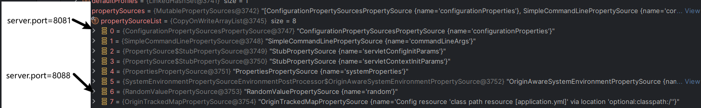

# 剖析 SpringBoot 应用启动流程

## 目录

- [启动入口](#启动入口)
  - [实例化 SpringApplication](#实例化SpringApplication)
    - [推断应用类型](#推断应用类型)
      - [WebApplicationType#deduceFromClasspath](#WebApplicationTypededuceFromClasspath)
  - [推断应用主类](#推断应用主类)
  - [启动 SpringApplication（SpringApplication.run）](#启动SpringApplicationSpringApplicationrun)
  - [获取 SpringApplicationRunListeners 监听器](#获取SpringApplicationRunListeners监听器)
    - [SpringApplication#getRunListeners](#SpringApplicationgetRunListeners)
      - [SpringApplicationRunListener 案例](#SpringApplicationRunListener-案例)
  - [创建 Spring 容器](#创建Spring容器)
    - [SpringApplication#createApplicationContext](#SpringApplicationcreateApplicationContext)
  - [预备容器](#预备容器)
    - [SpringApplication#prepareContext](#SpringApplicationprepareContext)
  - [刷新容器](#刷新容器)
    - [SpringApplication#refreshContext](#SpringApplicationrefreshContext)
      - [ServletWebServerApplicationContext#onRefresh](#ServletWebServerApplicationContextonRefresh)
        - [创建 Web 容器](#创建Web容器)
          - [ServletWebServerApplicationContext#createWebServer](#ServletWebServerApplicationContextcreateWebServer)
  - [完成 Spring 容器刷新后的处理](#完成Spring容器刷新后的处理)
    - [SpringApplication#afterRefresh](#SpringApplicationafterRefresh)
  - [总结 SpringApplication 启动时提供的拓展点](#总结SpringApplication启动时提供的拓展点)
- [配置信息的加载顺序](#配置信息的加载顺序)
  - [SpringApplication#prepareEnvironment](#SpringApplicationprepareEnvironment)
  - [揭秘配置文件的加载](#揭秘配置文件的加载)
    - [EnvironmentPostProcessorApplicationListener](#EnvironmentPostProcessorApplicationListener)
- [Web 容器启动](#Web容器启动)
  - [获取容器工厂](#获取容器工厂)
  - [ServletWebServerFactory 的自动装配](#ServletWebServerFactory的自动装配)
    - [获取 Web 服务](#获取Web服务)
      - [TomcatServletWebServerFactory#getWebServer](#TomcatServletWebServerFactorygetWebServer)
- [总结](#总结)

SpringBoot 的存在，帮助我们极大地简化了应用的开发，所以我们也应该带有好奇和学习的心态一起来看看当我们运行 SpringBoot 应用时，背后究竟发生了什么？那么现在就让我们一起来剖析一下 SpringBoot 应用的启动流程，深入了解这个强大框架的内部机制。

### 启动入口

SpringBoot 应用的启动简单的可怕，仅需一个注解，一句代码，SpringBoot，应用便顺利地开启起来了。

```java
@SpringBootApplication
public class Main {
    public static void main(String[] args) {
        SpringApplication.run(Main.class);
    }
} SpringBoot启动入口
```

那么接下来就只需探明 run 方法中做了些什么事情就行了。

进入到 run 方法内，会发现其会帮我们创建 SpringApplication，并执行其 run 方法，开启 SpringBoot 应用

```java
  public static ConfigurableApplicationContext run(Class<?>[] primarySources, String[] args) {
    return new SpringApplication(primarySources).run(args);
  }
```

SpringApplication.run(Main.class)中做了两件事情

1. 实例化 SpringApplication
2. 执行实例化后的 SpringApplication 中的 run 方法

我们注意到 SpringApplication.run 返回了一个 ConfigurableApplicationContext ，看名字就知道这是一个 Spring 容器了，我们要清楚对于 SpringApplication.run 方法本质上就是启动 Spring 容器

#### 实例化 SpringApplication

我们先一件事情一件事情来看，首先就是 SpringApplication 在实例化过程中做了些什么事情？

```java
  public SpringApplication(ResourceLoader resourceLoader, Class<?>... primarySources) {
    this.resourceLoader = resourceLoader;
    Assert.notNull(primarySources, "PrimarySources must not be null");

    //标志启动类
    this.primarySources = new LinkedHashSet<>(Arrays.asList(primarySources));

    //判断Web应用类型（NONE，REACTIVE，SERVLET）
    this.webApplicationType = WebApplicationType.deduceFromClasspath();

    //从spring.factories 中获取BootstrapRegistryInitializer的定义类
    this.bootstrapRegistryInitializers = new ArrayList<>(
        getSpringFactoriesInstances(BootstrapRegistryInitializer.class));

    //从spring.factories 中获取ApplicationContextInitializer的定义类
    setInitializers((Collection) getSpringFactoriesInstances(ApplicationContextInitializer.class));

    //从spring.factories 中获取ApplicationListener的定义类
    setListeners((Collection) getSpringFactoriesInstances(ApplicationListener.class));

    //判断应用主类
    this.mainApplicationClass = deduceMainApplicationClass();
  }
```

##### 推断应用类型

针对该方法，我们先得弄清楚 Springboot 是怎么区分我们的应用的什么类型的应用的，答案都在 deduceFromClasspath 方法内

###### WebApplicationType#deduceFromClasspath

其实判断的方式很简单，就是判断我们有没有加载相关的核心类，比如说 Servlet 应用，有没有相关的 javax.servlet.Servlet 核心类呢？这个类就隐藏在 spring-boot-start-web 内，所以如果我们没有引用这个依赖，SpringBoot 不会认为我们是一个 Servlet 应用的

```java

  //核心类列举
  private static final String[] SERVLET_INDICATOR_CLASSES = { "javax.servlet.Servlet",
      "org.springframework.web.context.ConfigurableWebApplicationContext" };

  private static final String WEBMVC_INDICATOR_CLASS = "org.springframework.web.servlet.DispatcherServlet";

  private static final String WEBFLUX_INDICATOR_CLASS = "org.springframework.web.reactive.DispatcherHandler";

  private static final String JERSEY_INDICATOR_CLASS = "org.glassfish.jersey.servlet.ServletContainer";

  private static final String SERVLET_APPLICATION_CONTEXT_CLASS = "org.springframework.web.context.WebApplicationContext";

  private static final String REACTIVE_APPLICATION_CONTEXT_CLASS = "org.springframework.boot.web.reactive.context.ReactiveWebApplicationContext";

//判断应用属于什么类型的应用
static WebApplicationType deduceFromClasspath() {
    if (ClassUtils.isPresent(WEBFLUX_INDICATOR_CLASS, null) && !ClassUtils.isPresent(WEBMVC_INDICATOR_CLASS, null)
        && !ClassUtils.isPresent(JERSEY_INDICATOR_CLASS, null)) {
      return WebApplicationType.REACTIVE;
    }
    for (String className : SERVLET_INDICATOR_CLASSES) {
      if (!ClassUtils.isPresent(className, null)) {
        return WebApplicationType.NONE;
      }
    }
    return WebApplicationType.SERVLET;
  }
```

#### 推断应用主类

关于主类，是不是大多数兄弟都会认为就是标注了@SpringBootApplication 的那个类呢？其实不是的哈

```java
private Class<?> deduceMainApplicationClass() {
    try {
      //获取函数的调用栈
      StackTraceElement[] stackTrace = new RuntimeException().getStackTrace();
      for (StackTraceElement stackTraceElement : stackTrace) {
        //如果调用栈存在方法名是main，则作为SpringBoot的主类
        if ("main".equals(stackTraceElement.getMethodName())) {
          return Class.forName(stackTraceElement.getClassName());
        }
      }
    }
    catch (ClassNotFoundException ex) {
      // Swallow and continue
    }
    return null;
  }

```

所以如果我是这么调用的，那么 SpringBoot 会认为主类是 Main 而不是 SpringBootRun 的喔

```java
/**
 * @author T
 * @description 测试SpringBoot 推断主类方法
 */
@SpringBootApplication
public class SpringBootRun {

    public void run(){
        SpringApplication.run(SpringBootRun.class);
    }
}

//SpringBoot会认为他是主类，但是@SpringBootApplication并不在他身上
public class Main {
    public static void main(String[] args) {
        SpringBootRun springBootRun = new SpringBootRun();
        springBootRun.run();
    }
}

```

#### 启动 SpringApplication（SpringApplication.run）

好了，了解了 SpringApplication 的实例化，接下来我们就要来看看 run 方法，其实跟 Spring 容器的 refresh 方法很像的，这方法就是整个 SpringBoot 应用开启的主干，能够读懂这个方法，SpringBoot 的启动流程我们就算是读懂了\~

```java
public ConfigurableApplicationContext run(String... args) {
    long startTime = System.nanoTime();
    //创建引导上下文，他有点像一个共享的上下文用于在SpringApplication容器创建前存储
    //后续步骤可能会用到的Bean
    DefaultBootstrapContext bootstrapContext = createBootstrapContext();
    ConfigurableApplicationContext context = null;
    configureHeadlessProperty();

    //从spring.factories 中获取SpringApplicationRunListener对象
    //这里拿的是EventPublishingRunListener ，这个监听器其实是用于监听发布SpringBoot启动过程中的各个阶段的事件的
    SpringApplicationRunListeners listeners = getRunListeners(args);

    //发布一个ApplicationStartingEvent事件
    //所以想要干预这个过程，我们可以通过实现SpringApplicationRunListeners接口，并实现starting方法
    //或者监听ApplicationStartingEvent事件
    listeners.starting(bootstrapContext, this.mainApplicationClass);
    try {
      //封装run方法的参数封装为ApplicationArguments对象
      ApplicationArguments applicationArguments = new DefaultApplicationArguments(args);
      //配置准备Environment
      ConfigurableEnvironment environment = prepareEnvironment(listeners, bootstrapContext, applicationArguments);
      configureIgnoreBeanInfo(environment);

      //打印Banner
      Banner printedBanner = printBanner(environment);

      //创建Spring 容器
      context = createApplicationContext();
      context.setApplicationStartup(this.applicationStartup);
      //预备容器，其实就是将我们之前准备的东西配置到容器中
      prepareContext(bootstrapContext, context, environment, listeners, applicationArguments, printedBanner);
      //执行refresh方法
      refreshContext(context);

      //容器刷新完成的拓展点
      afterRefresh(context, applicationArguments);
      Duration timeTakenToStartup = Duration.ofNanos(System.nanoTime() - startTime);
      if (this.logStartupInfo) {
        new StartupInfoLogger(this.mainApplicationClass).logStarted(getApplicationLog(), timeTakenToStartup);
      }

      //发布ApplicationStartedEvent事件，所以如果不通过拓展afterRefresh，也可以通过监听这个
      //事件来干预SpringApplication完成刷新后的动作
      listeners.started(context, timeTakenToStartup);

      //从Spring容器中获取ApplicationRunner和CommandLineRunner，并执行他们run方法
      callRunners(context, applicationArguments);
    }
    catch (Throwable ex) {
      //发布ApplicationFailedEvent事件
      handleRunFailure(context, ex, listeners);
      throw new IllegalStateException(ex);
    }
    try {
      Duration timeTakenToReady = Duration.ofNanos(System.nanoTime() - startTime);

      //发布ApplicationReadyEvent事件，表示Spring容器已经准备好了
      listeners.ready(context, timeTakenToReady);
    }
    catch (Throwable ex) {
      handleRunFailure(context, ex, null);
      throw new IllegalStateException(ex);
    }
    return context;
  }
```

#### 获取 SpringApplicationRunListeners 监听器

##### SpringApplication#getRunListeners

这里获取的是 SpringApplicationRunListener 接口，而且通过 getSpringFactoriesInstances 方法就清楚这又是从 spring-factories 中获取的了，将这些都拿到之后就会装到 SpringApplicationRunListeners 一起返回，SpringApplicationRunListeners 就是 SpringApplicationRunListener 的集合。

```java
class SpringApplicationRunListeners {

  private final Log log;

  private final List<SpringApplicationRunListener> listeners;

  ...
}


private SpringApplicationRunListeners getRunListeners(String[] args) {
    Class<?>[] types = new Class<?>[] { SpringApplication.class, String[].class };
    return new SpringApplicationRunListeners(logger,
        getSpringFactoriesInstances(SpringApplicationRunListener.class, types, this, args),
        this.applicationStartup);
  }
```

###### SpringApplicationRunListener 案例

所以如果我们想要干预该流程，我们可以选择实现 SpringApplicationRunListener 接口或者其派生类，比如说以下代码就是实现了其派生类 org.springframework.boot.context.event.EventPublishingRunListener，并重写了 starting 方法来干预该流程，当然我们也可以选择重写其他更多的方法来干预 SpringBoot 应用的启动流程的。

```java
/**
 * @author T
 * @description SpringApplicationRunListener测试
 * @date 2025年03月08日 17:54
 */
@Slf4j
public class MySpringApplicationRunListener extends EventPublishingRunListener {


    public MySpringApplicationRunListener(SpringApplication application, String[] args) {
        super(application, args);
    }

    @Override
    public void starting(ConfigurableBootstrapContext bootstrapContext) {
        log.info("MySpringApplicationRunListener.starting()");
    }


}

```

当然我们说了，SpringBoot 是从 spring-factories 中取的，所以我们也需要在 spring-factories 中放入该实现才行

```text
org.springframework.boot.SpringApplicationRunListener=\
com.example.MySpringApplicationRunListener
```

#### 创建 Spring 容器

##### SpringApplication#createApplicationContext

在该方法中会创建 Spring 容器，但是应该创建什么类型的容器呢？这个就取决于我们在 SpringApplication 实例化时推断的应用类型，回顾一下，一共有三种

1. NONE
2. Servlet
3. REACTIVE

```java
  protected ConfigurableApplicationContext createApplicationContext() {
    //调用接口的默认实现来返回相应的容器
    return this.applicationContextFactory.create(this.webApplicationType);
  }

 //这里已经绑定了接口的默认实现
 private ApplicationContextFactory applicationContextFactory = ApplicationContextFactory.DEFAULT;

```

以下就是 createApplicationContext 的默认实现

```java
//spring.factories
org.springframework.boot.ApplicationContextFactory=\
org.springframework.boot.web.reactive.context.AnnotationConfigReactiveWebServerApplicationContext.Factory,\
org.springframework.boot.web.servlet.context.AnnotationConfigServletWebServerApplicationContext.Factory


//Reactive Factory的实现
  static class Factory implements ApplicationContextFactory {

    @Override
    public ConfigurableApplicationContext create(WebApplicationType webApplicationType) {
      return (webApplicationType != WebApplicationType.REACTIVE) ? null
          : new AnnotationConfigReactiveWebServerApplicationContext();
    }

  }

//Servlet Factory的实现
  static class Factory implements ApplicationContextFactory {

    @Override
    public ConfigurableApplicationContext create(WebApplicationType webApplicationType) {
      return (webApplicationType != WebApplicationType.SERVLET) ? null
          : new AnnotationConfigServletWebServerApplicationContext();
    }

  }

ApplicationContextFactory DEFAULT = (webApplicationType) -> {
    try {
      //这里就是通过spring.factories找到对应的容器，其中包含了Web类型的和Reactive类型的
      for (ApplicationContextFactory candidate : SpringFactoriesLoader
          .loadFactories(ApplicationContextFactory.class, ApplicationContextFactory.class.getClassLoader())) {
        //取到两类的类型容器后会将推断出来的类型传入执行他们的create方法
        //两个实现都会有推断类型失败后返回null的判断，所以经过一轮循环后，便能得知会创建一个什么类型的容器
        ConfigurableApplicationContext context = candidate.create(webApplicationType);
        if (context != null) {
          return context;
        }
      }
      //如果都没有符合，最终会返回一个AnnotationConfigApplicationContext容器
      return new AnnotationConfigApplicationContext();
    }
    catch (Exception ex) {
      throw new IllegalStateException("Unable create a default ApplicationContext instance, "
          + "you may need a custom ApplicationContextFactory", ex);
    }
  };
```

所以如果我们引入了 spring-boot-start-web 包，SpringBoot 便会在 createApplicationContext 处返回

AnnotationConfigServletWebServerApplicationContext 容器了

#### 预备容器

##### SpringApplication#prepareContext

Spring 容器构建好了之后就会开始往 Spring 容器中去配置一些我们可能需要用的内容了，在这里可以概括成

1. 配置环境参数至容器中
2. 将 SpringApplication 定义的部分配置配置到容器中
3. 利用 ApplicationContextInitializer 初始化 Spring 容器
4. 处理是否允许依赖循环和 BeanDefinition 以及 Bean 的懒加载机制的全局配置
5. 将配置类注册到 Spring 容器中

```java
private void prepareContext(DefaultBootstrapContext bootstrapContext, ConfigurableApplicationContext context,
      ConfigurableEnvironment environment, SpringApplicationRunListeners listeners,
      ApplicationArguments applicationArguments, Banner printedBanner) {
    //将环境参数配置到上下文当中
    context.setEnvironment(environment);

    //将SpringApplication定义的部分配置配置到容器中
    postProcessApplicationContext(context);

    //利用ApplicationContextInitializer初始化Spring容器
    //在SpringApplication实例化时，所有spring.factories中的ApplicationContextInitializer都被解析出来了
    //在这里就是将他们应用起来
    applyInitializers(context);
    //发布事件ApplicationContextInitializedEvent表示容器环境以准备好
    listeners.contextPrepared(context);
    bootstrapContext.close(context);
    if (this.logStartupInfo) {
      logStartupInfo(context.getParent() == null);
      logStartupProfileInfo(context);
    }
    // Add boot specific singleton beans
    ConfigurableListableBeanFactory beanFactory = context.getBeanFactory();
    beanFactory.registerSingleton("springApplicationArguments", applicationArguments);
    if (printedBanner != null) {
      beanFactory.registerSingleton("springBootBanner", printedBanner);
    }
    if (beanFactory instanceof AbstractAutowireCapableBeanFactory) {
      //配置是否允许循环依赖的情况
      ((AbstractAutowireCapableBeanFactory) beanFactory).setAllowCircularReferences(this.allowCircularReferences);
      if (beanFactory instanceof DefaultListableBeanFactory) {
        //配置是否允许BeanDefinition覆盖的情况，即BeanDefinition同名时会覆盖旧的BeanDefinition
        ((DefaultListableBeanFactory) beanFactory)
            .setAllowBeanDefinitionOverriding(this.allowBeanDefinitionOverriding);
      }
    }
    //处理全局懒加载，如果我们配置了spring.main.lazy-init=true，
    //就会在容器refresh的时候触发LazyInitializationBeanFactoryPostProcessor
    //将获取到的每一个BeanDefinition的lazyInit项改为true
    if (this.lazyInitialization) {
      context.addBeanFactoryPostProcessor(new LazyInitializationBeanFactoryPostProcessor());
    }
    //加载配置类,就是我们定义的@SpringBootApplication的那个类
    //因为其内部有Configuruation注解
    Set<Object> sources = getAllSources();
    Assert.notEmpty(sources, "Sources must not be empty");
    load(context, sources.toArray(new Object[0]));
    //发布事件表示配置类加载至容器中
    listeners.contextLoaded(context);
  }

```

#### 刷新容器

##### SpringApplication#refreshContext

这里其实执行的就是 Spring 的容器 refresh 方法了，当然 Spring 容器的 refresh 就不在这里多说了，在 Spring 源码系列中有对其进行详细阐述。

```java
private void refreshContext(ConfigurableApplicationContext context) {
    if (this.registerShutdownHook) {
      shutdownHook.registerApplicationContext(context);
    }
    refresh(context);
  }
```

不过对于 org.springframework.boot.web.servlet.context.ServletWebServerApplicationContext 容器来说，我们都知道他是会启动 Tomcat 服务器的，所以 ServletWebServerApplicationContext 在这里会多做了一步拓展，在哪里拓展的呢？其实就是在 onRefresh 的拓展点中进行拓展的。

```java
public void refresh() throws BeansException, IllegalStateException {

        // 在Spring的模板方法中有这么一个方法，AbstractBeanFactory对其是一个空实现的
        // 而ServletWebServerApplicationContext会对这个步骤进行重写拓展
        onRefresh();

  } org.springframework.context.support.AbstractApplicationContext#refresh
```

###### ServletWebServerApplicationContext#onRefresh

```java
  @Override
  protected void onRefresh() {
    super.onRefresh();
    try {
      createWebServer();
    }
    catch (Throwable ex) {
      throw new ApplicationContextException("Unable to start web server", ex);
    }
  }
```

###### 创建 Web 容器

###### ServletWebServerApplicationContext#createWebServer

创建 Web 应用是一个任重而道远的方法，所以我们在这里先停一停，后面再进行述说，不过我们可以先浏览一遍注释看看大概流程

```java
private void createWebServer() {
     // 获取当前的 WebServer 实例
    WebServer webServer = this.webServer;
    ServletContext servletContext = getServletContext();
    if (webServer == null && servletContext == null) {
      // 记录创建 WebServer 的启动步骤
      StartupStep createWebServer = this.getApplicationStartup().start("spring.boot.webserver.create");
       // 获取 WebServer 工厂实例，用于创建具体的 WebServer
      ServletWebServerFactory factory = getWebServerFactory();
      createWebServer.tag("factory", factory.getClass().toString());
      // 使用工厂创建 WebServer，并将其赋值给当前实例变量
      this.webServer = factory.getWebServer(getSelfInitializer());
      createWebServer.end();
      getBeanFactory().registerSingleton("webServerGracefulShutdown",
          new WebServerGracefulShutdownLifecycle(this.webServer));
      getBeanFactory().registerSingleton("webServerStartStop",
          new WebServerStartStopLifecycle(this, this.webServer));
    }
    else if (servletContext != null) {
      try {
        getSelfInitializer().onStartup(servletContext);
      }
      catch (ServletException ex) {
        throw new ApplicationContextException("Cannot initialize servlet context", ex);
      }
    }
    initPropertySources();
  }
```

#### 完成 Spring 容器刷新后的处理

##### SpringApplication#afterRefresh

完成以上的所有动作后，就会执行这个 afterRefresh 方法，这个方法是一个空实现，就是留给我们进行拓展使用的，这也是一个模板方法的体现。

```java
  protected void afterRefresh(ConfigurableApplicationContext context, ApplicationArguments args) {


  }

```

#### 总结 SpringApplication 启动时提供的拓展点

SpringApplication 在启动时其实提供了非常多的拓展点，我们可以通过监听，重写，实现的手段来干预 SpringApplication 的启动流程，那么现在我们就来一起总结一下：

首先是监听手段，SpringApplication 在启动时发布了非常多的事件，我们都可以通过监听这些事件来从中插入一些动作

- ApplicationStartingEvent 标志着容器开始创建
- ApplicationContextInitializedEvent 标志着容器上下文已经准备好了
- ApplicationPreparedEvent 标志着容器准备好了
- ApplicationStartedEvent 标志着容器已经启动起来了
- ApplicationFailedEvent 标志着容器启动失败了
- ApplicationReadyEvent 标志着容器准备好了

再者是模板方法提供的重写方法

- org.springframework.boot.SpringApplication#afterRefresh 标志着容器完成刷新了

然后就是通过实现接口来完进行拓展，具体的在 callRunners 方法中

org.springframework.boot.SpringApplication#callRunners 这个接口标志着容器已经开始启动了

```java
/**
 * @author T
 * @description ApplicationRunnner 使用示例
 */
@Component
@Slf4j
@Order(1)
public class MyApplicationRunner implements CommandLineRunner {


    @Override
    public void run(String... args) throws Exception {
        log.info("SpringApplication 已经启动");
    }
}


//源码
private void callRunners(ApplicationContext context, ApplicationArguments args) {
    List<Object> runners = new ArrayList<>();
    //从容器中获取实现了ApplicationRunner和CommandLineRunner实现Bean
    runners.addAll(context.getBeansOfType(ApplicationRunner.class).values());
    runners.addAll(context.getBeansOfType(CommandLineRunner.class).values());
    //对ApplicationRunner 和 CommandLineRunner根据Order进行排序
    AnnotationAwareOrderComparator.sort(runners);
    //将我们传入SpringApplication.run(xxx.class,args)中的args参数给到两个Runner进行执行
    for (Object runner : new LinkedHashSet<>(runners)) {
      if (runner instanceof ApplicationRunner) {
        callRunner((ApplicationRunner) runner, args);
      }
      if (runner instanceof CommandLineRunner) {
        callRunner((CommandLineRunner) runner, args);
      }
    }
  }
```

好了，跟到这里，SpringBoot 应用的启动整个大体的流程都清晰了，不过这也是为了让我们深入某些步骤打下基础的，那么接下来我们就对几个重要的步骤一个一个分析！

### 配置信息的加载顺序

SpringBoot 配置的方式有非常多种，比如通过 properties，yml，yaml 等文件进行配置，还可以通过环境变量来进行配置，那么在发生配置冲突时 SpringBoot 是如何决定谁的优先级是最高的呢？在 org.springframework.boot.SpringApplication#prepareEnvironment 方法就能给出答案

#### SpringApplication#prepareEnvironment

ConfigurableEnvironment 其实我们可以理解为一个列表，然后里面存储了很多类型的配置信息，但是配置信息都是根据类型排列好的，当他要获取配置的时候会遍历列表找到第一个匹配的配置项然后取值，所以配置信息的加载顺序就和配置的优先级是相关的。

打个断点我们观察观察就能一清二楚了，假设我们在 0 号下表的配置项中有配置 server.port = 8081，而在 6 号配置项中也配置了 server.port=8088，那么 SpringBoot 在遍历获取配置时候发现 0 号配置项已经存在 server.port 了就会直接去 0 号位置的配置，后面的就不再进行获取了。所以说我们只要清楚配置的加载顺序就能对配置的优先级明明白白啦！



那么接下来我们就来理顺一下整个配置的加载过程，首先

getOrCreateEnvironment()方法是为了获取系统配置的，里面包含了 jvm 参数配置，操作系统参数配置，servlet 的参数配置，顺序排列是

1. servlet 参数
2. jvm 参数
3. 操作系统参数（环境变量）

其次 configureEnvironment()方法则是加载运行参数的，举个栗子就是 SpringApplication.run(Main.class,"--server.port=8081");

那是不是运行参数就排到老 4 呢？不是哈\~，注意 ConfigurationPropertySources.attach(environment);这个方法，这个方法将他挪到老大的位置了，所以最终的顺序是

1. 运行参数
2. servlet 参数
3. jvm 参数
4. 操作系统参数
5. 最后才是我们配置文件即 properties 或 yml，但是 properties>yml

```java
private ConfigurableEnvironment prepareEnvironment(SpringApplicationRunListeners listeners,
      DefaultBootstrapContext bootstrapContext, ApplicationArguments applicationArguments) {
    // 这里获取的是系统参数，包括环境变量，jvm配置参数等等
    // -Dserver.port=8089
    ConfigurableEnvironment environment = getOrCreateEnvironment();
    // 这里会将应用启动参数配置到environment中
    // SpringApplication.run(Main.class,"--server.port=8081");
    configureEnvironment(environment, applicationArguments.getSourceArgs());
    ConfigurationPropertySources.attach(environment);
    //发布ApplicationEnvironmentPreparedEvent事件
    //但是这里可不仅仅只是发布事件喔！
    listeners.environmentPrepared(bootstrapContext, environment);
    DefaultPropertiesPropertySource.moveToEnd(environment);
    Assert.state(!environment.containsProperty("spring.main.environment-prefix"),
        "Environment prefix cannot be set via properties.");
    bindToSpringApplication(environment);
    if (!this.isCustomEnvironment) {
      environment = convertEnvironment(environment);
    }
    ConfigurationPropertySources.attach(environment);
    return environment;
  } org.springframework.boot.SpringApplication#prepareEnvironment
```

#### 揭秘配置文件的加载

明白了配置信息的优先级，那么接下来我们就来看看配置文件是怎么进行加载的？我们通过上述代码很难找到这个方法到底在哪里进行的配置文件加载的，其实压根没有，因为加载配置文件是通过 listeners.environmentPrepared(bootstrapContext, environment);的事件发布进行处理的。所以我们得先找到监听该事件的事件监听器才能了解配置文件是怎么被加载的。

##### EnvironmentPostProcessorApplicationListener

EnvironmentPostProcessorApplicationListener 就是关于 ApplicationEnvironmentPreparedEvent 事件的监听器。那我们来看看该事件监听器是如何实现的 onApplicationEvent

```java
  @Override
  public void onApplicationEvent(ApplicationEvent event) {
    //显然发布的事件是ApplicationEnvironmentPreparedEvent，所以会走第一个分支
    if (event instanceof ApplicationEnvironmentPreparedEvent) {
      onApplicationEnvironmentPreparedEvent((ApplicationEnvironmentPreparedEvent) event);
    }
    if (event instanceof ApplicationPreparedEvent) {
      onApplicationPreparedEvent();
    }
    if (event instanceof ApplicationFailedEvent) {
      onApplicationFailedEvent();
    }
  }
```

看看内部实现，便能清楚该方法是收集所有的 EnvironmentPostProcessor 然后执行 postProcessEnvironment 方法的，没错这也是 SpringBoot 提供的一个拓展方式，就是通过实现 EnvironmentPostProcessor 来干预 SpringBoot 在加载配置文件时的操作

不过需要注意一下，这些 EnvironmentPostProcessor 可不是通过容器中获取的，此时容器并没有启动起来的，而是通过自动装配的方式进行导入的，我们可以到 spring.factories 中查看

```java
# Environment Post Processors
org.springframework.boot.env.EnvironmentPostProcessor=\
org.springframework.boot.cloud.CloudFoundryVcapEnvironmentPostProcessor,\
org.springframework.boot.context.config.ConfigDataEnvironmentPostProcessor,\
org.springframework.boot.env.RandomValuePropertySourceEnvironmentPostProcessor,\
org.springframework.boot.env.SpringApplicationJsonEnvironmentPostProcessor,\
org.springframework.boot.env.SystemEnvironmentPropertySourceEnvironmentPostProcessor,\
org.springframework.boot.reactor.DebugAgentEnvironmentPostProcessor
```

```java
private void onApplicationEnvironmentPreparedEvent(ApplicationEnvironmentPreparedEvent event) {
    ConfigurableEnvironment environment = event.getEnvironment();
    SpringApplication application = event.getSpringApplication();
    for (EnvironmentPostProcessor postProcessor : getEnvironmentPostProcessors(application.getResourceLoader(),
        event.getBootstrapContext())) {
      postProcessor.postProcessEnvironment(environment, application);
    }
  }
```

当然 SpringBoot 也提供了非常多的 EnvironmentPostProcessor ，他们的工作其实都是往 environment 中添加配置项的，接下来我们就来挑核心的介绍一下

- RandomValuePropertySourceEnvironmentPostProcessor 会放置最后

  用于生成随机数配置项，他要求配置项必须要以 random 为前缀，否则返回 null

  ```java
  @Value("${random.int}")
  private String path;
  ```

- SpringApplicationJsonEnvironmentPostProcessor&#x20;

  允许我们写入 json 格式的数据在命令行参数内

- ConfigDataEnvironmentPostProcessor

  解析 properties 或 yml 配置文件，另外 ConfigDataEnvironment 中给定了获取配置文件的路径

  - 首先，这说明我们不仅仅可以将配置文件放在 classpath 下，还可以放在 classpath:/config/目录下喔\~具体的可以查看 locations 添加的这几项路径信息，另外 optional 则表示即便没有这个目录也是没有问题的，不过如果没有 optional，那没有这个目录或者该目录没有配置文件是会报错的喔

  ```java
    static {
      List<ConfigDataLocation> locations = new ArrayList<>();
      locations.add(ConfigDataLocation.of("optional:classpath:/;optional:classpath:/config/"));
      locations.add(ConfigDataLocation.of("optional:file:./;optional:file:./config/;optional:file:./config/*/"));
      DEFAULT_SEARCH_LOCATIONS = locations.toArray(new ConfigDataLocation[0]);
    }
  ```

  - 另外既然这里又出现多个路径，也一定又得出现优先级的问题了，那这么些个配置文件他们的优先级是怎么样的呢？

    首先是 file 前缀的优先级更高

    1. optional:file:./config/ \*/
    2. optional:file:./config/
    3. optional:file:./
       其次是 classpath 的
    4. optional:classpath:/config/
    5. optional:classpath:/

  - 最后顺便提提配置文件的优先级
    1. application-dev/prop/xxx.properties
    2. application-dev/prop/xxx.yml
    3. application.properties
    4. application.yml

### Web 容器启动

#### 获取容器工厂

首先会根据类型为 ServletWebServerFactory 的在容器中获取 beanName，获取不到或者获取的大于 1 个都会报异常，而 ServletWebServerFactory 会有 3 个核心实现

- org.springframework.boot.web.embedded.jetty.JettyServletWebServerFactory
- org.springframework.boot.web.embedded.tomcat.TomcatServletWebServerFactory
- org.springframework.boot.web.embedded.undertow\.UndertowServletWebServerFactory

```java
  protected ServletWebServerFactory getWebServerFactory() {
    //根据类型获取BeanName
    String[] beanNames = getBeanFactory().getBeanNamesForType(ServletWebServerFactory.class);
    if (beanNames.length == 0) {
      throw new ApplicationContextException("Unable to start ServletWebServerApplicationContext due to missing "
          + "ServletWebServerFactory bean.");
    }
    if (beanNames.length > 1) {
      throw new ApplicationContextException("Unable to start ServletWebServerApplicationContext due to multiple "
          + "ServletWebServerFactory beans : " + StringUtils.arrayToCommaDelimitedString(beanNames));
    }
    //返回对应的ServletWebServerFactory
    return getBeanFactory().getBean(beanNames[0], ServletWebServerFactory.class);
  } org.springframework.boot.web.servlet.context.ServletWebServerApplicationContext#getWebServerFactory
```

但是这个时候我们需要想一个问题，就是这么些个 ServletWebServerFactory 是怎么有条件的注册进去的呢？我们又是怎么有挑选的选择应该使用哪个 ServletWebServerFactory 呢？这其实就是 SpringBoot 的自动装配给我们带来的好处了！

#### ServletWebServerFactory 的自动装配

想要看 SpringBoot 是如何操作这些 Web 服务的自动装配，我们需要到 org.springframework.boot.autoconfigure.web.servlet.ServletWebServerFactoryAutoConfiguration

这个类中查看，另外，以后我们会看到非常多的要基于 Spring 容器进行服务的组件，由于他们在服务启动的时候就要加载进来了，所以他们都会先配置 SpringBoot 自动装配类的，所以一般我们在该类后面加上 AutoConfiguration 就能找到他们配置的自动装配类了。

找到 ServletWebServerFactoryAutoConfiguration 类之后我们要先看注解，因为注解标注着这个自动配置类自动装配的各个条件和前置准备。

- @Configuration(proxyBeanMethods = false)&#x20;

  使用了@Configuration 注解，并设置了 proxyBeanMethods 为 false。这表示该类是一个配置类，但 Spring 不会为该类中的@Bean 方法创建代理对象，从而提高性能。

- @AutoConfigureOrder(Ordered.HIGHEST_PRECEDENCE)

  优先级最高

- @ConditionalOnClass(ServletRequest.class)

  配置的条件是要 ClassLoader 能够加载到 ServletRequest.class，简单来说就是我们的应用是属于一个 Servlet Web 应用这个自动配置类才会生效

- @EnableConfigurationProperties(ServerProperties.class)

  将 ServerProperties 中属性暴露到 properties 或者 yml 中让我们继续配置

- @Import({.....})

  导入相关 Bean

  其中导入的这几个中，EmbeddedTomcat，EmbeddedJetty，EmbeddedUndertow 都是 Web 服务相关的配置 Bean，以 EmbeddedTomcat 为例

  我们能够发现这个 Bean 就以 ClassLoader 能够加载到 Tomcat 的核心类为条件来判断该 EmbeddedTomcat 配置 Bean 是否启动

  ```java
    @Configuration(proxyBeanMethods = false)
    //以ClassLoader能够加载到Tomcat的核心类为条件来判断该EmbeddedTomcat配置Bean是否启动
    @ConditionalOnClass({ Servlet.class, Tomcat.class, UpgradeProtocol.class })
    //另外在创建该Web服务时要确保没有其他的Web服务已经被创建了
    @ConditionalOnMissingBean(value = ServletWebServerFactory.class, search = SearchStrategy.CURRENT)
    static class EmbeddedTomcat {

      @Bean
      TomcatServletWebServerFactory tomcatServletWebServerFactory(
          ObjectProvider<TomcatConnectorCustomizer> connectorCustomizers,
          ObjectProvider<TomcatContextCustomizer> contextCustomizers,
          ObjectProvider<TomcatProtocolHandlerCustomizer<?>> protocolHandlerCustomizers) {
        TomcatServletWebServerFactory factory = new TomcatServletWebServerFactory();
        //将自定义的Tomcat服务连接配置添加到factory中
        factory.getTomcatConnectorCustomizers()
            .addAll(connectorCustomizers.orderedStream().collect(Collectors.toList()));
        //添加上下文自定义配置
        factory.getTomcatContextCustomizers()
            .addAll(contextCustomizers.orderedStream().collect(Collectors.toList()));
        //添加协议处理器自定义配置
        factory.getTomcatProtocolHandlerCustomizers()
            .addAll(protocolHandlerCustomizers.orderedStream().collect(Collectors.toList()));
        return factory;
      }

    }
  ```

这么些注解相互配置起来来对 ServletWebServerFactory 进行自动装配，当然默认的情况下呢，SpringBoot 是采用的 TomcatServletWebServerFactory 的

```java
@Configuration(proxyBeanMethods = false)
@AutoConfigureOrder(Ordered.HIGHEST_PRECEDENCE)
@ConditionalOnClass(ServletRequest.class)
@ConditionalOnWebApplication(type = Type.SERVLET)
@EnableConfigurationProperties(ServerProperties.class)
@Import({ ServletWebServerFactoryAutoConfiguration.BeanPostProcessorsRegistrar.class,
    ServletWebServerFactoryConfiguration.EmbeddedTomcat.class,
    ServletWebServerFactoryConfiguration.EmbeddedJetty.class,
    ServletWebServerFactoryConfiguration.EmbeddedUndertow.class })
public class ServletWebServerFactoryAutoConfiguration {


}
```

所以当我们再次回头看看 createWebServer 这段代码时，就能清楚 ServletWebServerFactory 代表的是哪个 ServletWebServerFactory 了，当然我们还是以 TomcatServletWebServerFactory 为例。当调用 ServletWebServerFactory.getWebServer 方法时，实际上就是调用 TomcatServletWebServerFactory 的 getWebServer 方法。

```java
private void createWebServer() {
     ...
      this.webServer = factory.getWebServer(getSelfInitializer());
     ...
  }
```

##### 获取 Web 服务

###### TomcatServletWebServerFactory#getWebServer

那么在 getWebServer 方法中，Tomcat 服务实例化的过程了，代码也是比较简单易懂的。

```java
@Override
  public WebServer getWebServer(ServletContextInitializer... initializers) {
    if (this.disableMBeanRegistry) {
      Registry.disableRegistry();
    }
    //实例化Tomcat
    Tomcat tomcat = new Tomcat();

    File baseDir = (this.baseDirectory != null) ? this.baseDirectory : createTempDir("tomcat");
    tomcat.setBaseDir(baseDir.getAbsolutePath());

    //添加Tomcat生命周期内的监听器
    for (LifecycleListener listener : this.serverLifecycleListeners) {
      tomcat.getServer().addLifecycleListener(listener);
    }
    //配置基础信息
    Connector connector = new Connector(this.protocol);
    connector.setThrowOnFailure(true);
    tomcat.getService().addConnector(connector);
    customizeConnector(connector);
    tomcat.setConnector(connector);
    tomcat.getHost().setAutoDeploy(false);
    configureEngine(tomcat.getEngine());
    for (Connector additionalConnector : this.additionalTomcatConnectors) {
      tomcat.getService().addConnector(additionalConnector);
    }
    prepareContext(tomcat.getHost(), initializers);
    //实例化Tomcat Web 服务
    return getTomcatWebServer(tomcat);
  }
```

### 总结

好了，到这里，我们就能够大概地将 SpringBoot 应用的启动流程走完一遍了，为了加深印象，我们可以再总结一下，SpringBoot 在应用的开启过程中主要做了以下几件事情

1. 实例化 Application，实例化的过程中主要做的事情就是为之后的 run 方法做准备，比如标志应用类型（Web 还是 Reactive 还是非 Web），另外，就是到 spring.factories 中加载 Initializer 类型的类和事件触发器等
2. 完成 Application 的实例化后就可以执行 run 方法了，run 方法正是描述了 SpringBoot 启动的流程
3. run 方法执行之后就是先创建引导上下文（BootstrapContext），这个充当临时容器来使用，毕竟此时容器并没有创建
4. 从 spring.factories 中加载 SpringApplicationRunListener 监听器，用于发布事件使用
5. 封装执行参数并交给环境配置进行处理（此处涉及到配置的优先级处理）
6. &#x20;打印 Banner
7. 开始创建 Spring 容器，并且将以上步骤的配置配置到容器中，并刷新容器（加载扫描 Bean，如果是 Web 服务启动 WebServer）
8. 执行 ApplicationRunner 和 CommandLineRunner

这样 SpringBoot 一套启动流程到这里就先告一段落了
