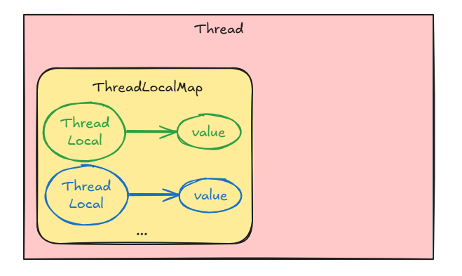
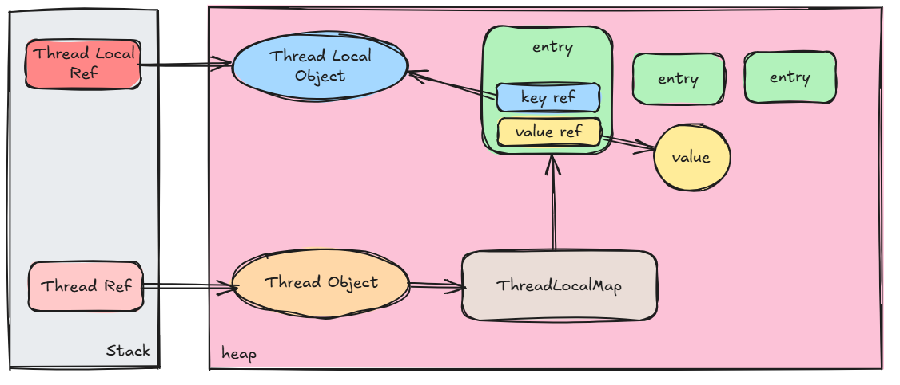
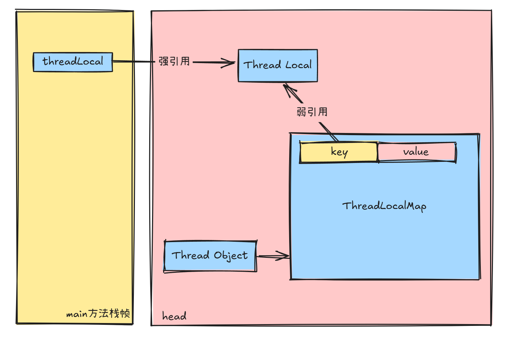
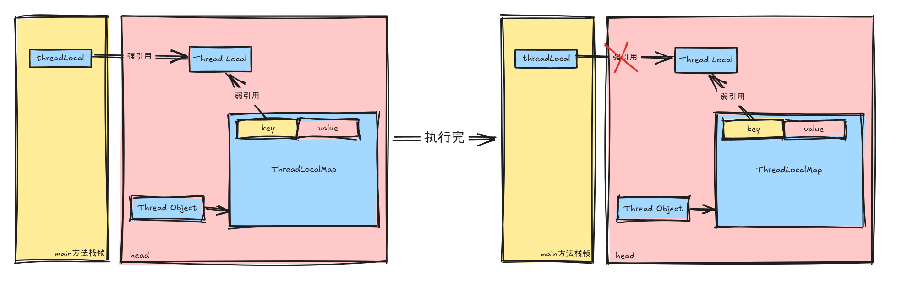
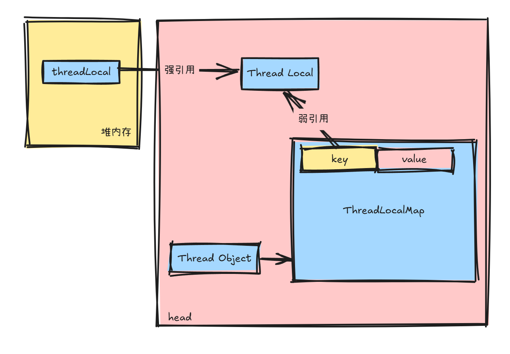

# 深入剖析 ThreadLocal

## 目录

- [ThreadLocal](#ThreadLocal)
  - [简介](#简介)
  - [基本使用](#基本使用)
  - [实现原理](#实现原理)
    - [结构模型](#结构模型)
  - [源码分析](#源码分析)
    - [ThreadLocal 源码分析](#ThreadLocal源码分析)
    - [ThreadLocalMap 源码分析](#ThreadLocalMap-源码分析)
      - [java.lang.ThreadLocal.ThreadLocalMap#set](#javalangThreadLocalThreadLocalMapset)
      - [java.lang.ThreadLocal.ThreadLocalMap#getEntry](#javalangThreadLocalThreadLocalMapgetEntry)
      - [为何 Entry 的 key 要使用弱引用来包装](#为何Entry的key要使用弱引用来包装)
      - [Entry key 泄漏的问题是解决了\~value 可咋整啊？](#Entry-key泄漏的问题是解决了value可咋整啊)
        - [探测式清理](#探测式清理)
        - [启发式清理](#启发式清理)
    - [手动清理](#手动清理)
  - [ThreadLocal 的最佳实践](#ThreadLocal的最佳实践)
  - [ThreadLocal 的变种](#ThreadLocal的变种)
    - [InheritableThreadLocal 可继承的 ThreadLocal](#InheritableThreadLocal-可继承的ThreadLocal)
      - [基本使用](#基本使用)
      - [InheritableThreadLocal 的原理剖析](#InheritableThreadLocal-的原理剖析)
      - [如何进行父子线程的 InheritableThreadLocal 传递](#如何进行父子线程的InheritableThreadLocal-传递)
      - [盘点 inheritableThreadLocals 存在的问题](#盘点inheritableThreadLocals-存在的问题)
        - [线程池使得线程本地变量失效](#线程池使得线程本地变量失效)
        - [线程不安全](#线程不安全)

## ThreadLocal

### 简介

每个线程都可以有自己的小角落，这个小角落便是 ThreadLocal，ThreadLocal 是每个线程在整个运行周期内独一份的，线程无法获取其他线程的 ThreadLocal 内容。

对于 ThreadLocal，官方给出了说明，具体如下

1. ThreadLocal 能使每个线程仅能访问自己定义的变量，即该线程在 ThreadLocal 内定义的变量对于该线程是全局私有的，直到线程被回收 ，从而达到了线程隔离。
2. 如果要使用 ThreadLocal，通常需要定义为 private static 类型或者 private static final 类型

> This class provides thread-local variables. These variables differ from their normal counterparts in that each thread that accesses one (via its get or set method) has its own, independently initialized copy of the variable. ThreadLocal instances are typically private static fields in classes that wish to associate state with a thread (e.g., a user ID or Transaction ID).

### 基本使用

使用 ThreadLocal 必须要注意两点

1. 尽量使用 private static final 修饰 ThreadLocal 实例。使用 private 与 final 修饰符，主要是尽可能不让他人修改、变更 ThreadLocal 变量的引用； 使用 static 修饰符主要为了确保 ThreadLocal 实例的全局唯一。
2. ThreadLocal 使用完成之后务必调用 remove 方法。这是简单、有效地避免 ThreadLocal 引发内存泄漏的方法。

以下是 ThreadLocal 的基本使用，很简单，我们只需要定义一个 private static final ThreadLocal\<Integer> 就可以对其进行 set 值和 get 值了，而且当我们新开一个 Thread，再从 ThreadLocal 中取值，是无法取出 main 线程 set 的值的。

```java
/**
* @Description: ThreadLocal 线程私有实验
* @Param:
* @return:
* @Date: 2/25/2025
*/
public class SimpleExample {

    private static final ThreadLocal<Integer> integerLocal = new ThreadLocal<>();


    public static void setIntegerLocal(){
        integerLocal.set(100);
    }

    public static Integer getIntegerLocal(){
        return integerLocal.get();
    }

    public static void clearIntegerLocal(){
        integerLocal.remove();
    }

    public static void main(String[] args) {
        setIntegerLocal();
        System.out.println("ThreadLocal 放入 元素");
        System.out.println(Thread.currentThread().getName() + "ThreadLocal 取出 元素" + getIntegerLocal());
        Thread thread = new Thread(new Runnable() {
            @Override
            public void run() {
                System.out.println(Thread.currentThread().getName() +"ThreadLocal 取出 元素" + getIntegerLocal());
            }
        });
        thread.start();
        //一定要记得清除ThreadLocal ！清除！清除！重要的事情说三遍
        clearIntegerLocal();
    }
}

//执行结果：
ThreadLocal 放入 元素
mainThreadLocal 取出 元素100
Thread-0ThreadLocal 取出 元素null

```

### 实现原理

ThreadLocal 其实就是一个 Map 结构，每一个 Thread 实例内部都维护着一个 Map，我们存放的 ThreadLocal 中的数据就是被存到这个内部的 Map 中的，这个 Map 叫 ThreadLocalMap，而在 ThreadLocalMap 中 ThreadLocal 作为 Key，ThreadLocal 中的数据则作为 Value。



#### 结构模型

ThreadLocalMap 是交给了 ThreadLocal 来管理操作的，所以 ThreadLocal 其实只是一个引用，ThreadLocalMap 才是真正存储数据的地方。



### 源码分析

#### ThreadLocal 源码分析

ThreadLocal 提供的方法并不多，核心的就那么几个

但是在了解这几个核心的方法前，我们先了解一个方法，他就是 getMap(Thread t)，getMap 方法会返回 Thread 中绑定的 threadLocals，这个 threadLocals 其实就是 ThreadLocalMap ，这个方法在接下来的几个核心方法中都会用到。

```java
 //获取Thread中绑定的threadLocals
    ThreadLocalMap getMap(Thread t) {
        return t.threadLocals;
    }


     //Thread
     class Thread implements Runnable {

       ...
       //每个Thread都会维护着一个ThreadLocalMap
       ThreadLocal.ThreadLocalMap threadLocals = null;
       ...
     }
```

- set

  set(T value)方法 用于将“线程本地变量”设置到当前线程的 ThreadLocalMap 中对应的值，相当于设置线程本地值，另外观察 createMap(Thread t , T firstValue)方法，我们会发现其会将 ThreadLocal 对象当成 key，本地变量为 value 创建了一个 ThreadLocalMap，设置到了 Thread 中。这就跟我们给的结构模型图对上了。

  ```java
      public void set(T value) {
          //获取当前线程
          Thread t = Thread.currentThread();
          //获取当前线程中的ThreadLocalMap
          ThreadLocalMap map = getMap(t);
          if (map != null) {
              map.set(this, value);
          } else {
              //如果获取不到ThreadLocalMap，则创建一个ThreadLocalMap
              createMap(t, value);
          }
      }


      //createMap方法
      void createMap(Thread t, T firstValue) {
          t.threadLocals = new ThreadLocalMap(this, firstValue);
      }
      java.lang.ThreadLocal#set
  ```

- get

  get( )方法 用于获取“线程本地变量”在当前线程的 ThreadLocalMap 中对应的值，相当于获取线程本地值

  ```java
      public T get() {
          //获取当前线程
          Thread t = Thread.currentThread();
          //根据当前线程中获取ThreadLocalMap
          ThreadLocalMap map = getMap(t);
          if (map != null) {
              //根据当前ThreadLocal获取对应的Entry
              ThreadLocalMap.Entry e = map.getEntry(this);
              if (e != null) {
                  @SuppressWarnings("unchecked")
                  T result = (T)e.value;
                  //返回结果
                  return result;
              }
          }
          //如果获取不到ThreadLocalMap，则设置为initialValue()返回的值
          return setInitialValue();
      }

       //setInitialValue方法
       private T setInitialValue() {
          T value = initialValue();
          //获取当前线程
          Thread t = Thread.currentThread();
          //根据当前线程获取ThreadLocalMap
          ThreadLocalMap map = getMap(t);
          if (map != null) {
              map.set(this, value);
          } else {
              createMap(t, value);
          }
          if (this instanceof TerminatingThreadLocal) {
              TerminatingThreadLocal.register((TerminatingThreadLocal<?>) this);
          }
          return value;
      } java.lang.ThreadLocal#get
  ```

- remove

  remove()方法 用于在当前线程的 ThreadLocalMap 中，移除“线程本地变量”所对应的值

  ```java
      public void remove() {
           ThreadLocalMap m = getMap(Thread.currentThread());
           if (m != null) {
               m.remove(this);
           }
       } java.lang.ThreadLocal#remove
  ```

- initialValue

  我们可以通过重写 Thread 的 initialValue 方法来为 ThreadLocalMap 设置 initialValue 的值，默认是 null

  ```java
  protected T initialValue() {
      return null;
  }

  ```

  当然不想这么做可以使用 withInitial，并为其传入静态工厂方法来在创建 ThreadLocal 时设置初始值，具体如下

  ```java
  ThreadLocal<Foo> LOCAL_FOO = ThreadLocal.withInitial(() -> new Foo());
  ```

#### ThreadLocalMap 源码分析

分析 ThreadLocal 时我们就知道了 ThreadLocalMap 跟 Thread 绑定在一起，而 ThreadLocalMap 的操作则是基于 ThreadLocal 提供的方法（get，set）进行的。ThreadLocalMap 是 ThreadLocal 的一个静态内部类。

首先我们先来看看 ThreadLocalMap 提供的成员变量

```java
static class ThreadLocalMap {

      //从Entry的结构来看，便再次印证了上面的ThreadLocal的调用链图了
      //而且我们会发现Entry的key是一个弱引用，会有什么作用呢？我们后面会继续阐述
      static class Entry extends WeakReference<ThreadLocal<?>> {

            Object value;

            Entry(ThreadLocal<?> k, Object v) {
                super(k);
                value = v;
            }
        }

       //配置初始容量
       private static final int INITIAL_CAPACITY = 16;

        //Map中的内容数组，这个Entry 实际上是一个键值对，在上边有其描述
        private Entry[] table;

        //Map的条目数量
        private int size = 0;

        //扩容界限，如果size>= threshold - threshold/4 就会触发扩容
        //扩容会扩容至原来数组的2倍
        private int threshold;


    }
```

在我们对 ThreadLocal 进行 set，get 时其实就是对 ThreadLocalMap 做 set，get 操作

##### java.lang.ThreadLocal.ThreadLocalMap#set

```java
private void set(ThreadLocal<?> key, Object value) {
            Entry[] tab = table;
            int len = tab.length;
             //根据key的HashCode，找到key在数组上的槽点i
             int i = key.threadLocalHashCode & (len-1);
            // 从槽点i开始向后循环搜索，找空余槽点（空余位置）或者找现有槽点
            //如果没有现有槽点，则必定有空余槽点，因为没有空间时会扩容
            for (Entry e = tab[i];   e != null;
                e = tab[i = nextIndex(i, len)]) {
                ThreadLocal<?> k = e.get();
                //找到现有槽点：Key值为ThreadLocal实例
                if (k == key) {
                    e.value = value;
                    return;
                }
                //找到异常槽点：槽点被GC掉，重设Key值和Value值
                if (k == null) {
                    replaceStaleEntry(key, value, i);
                    return;
                }
            }
            //没有找到现有的槽点，增加新的Entry
            tab[i] = new Entry(key, value);
            //设置ThreadLocal数量
            int sz = ++size;
            //清理Key为null的无效Entry
            //没有可清理的Entry，并且现有条目数量大于扩容因子值，进行扩容
            if (!cleanSomeSlots(i, sz) && sz >= threshold)
                rehash();
        }
```

##### java.lang.ThreadLocal.ThreadLocalMap#getEntry

```java
private Entry getEntry(ThreadLocal<?> key) {
            //根据key的HashCode，找到key在数组上的槽点i
            int i = key.threadLocalHashCode & (table.length - 1);
            Entry e = table[i];
            //如果e不为空且指向key，就直接返回key
            if (e != null && e.refersTo(key))
                return e;
            else
                //如果没指向，那么有可能是因为hash冲突导致放到别的位置了
                return getEntryAfterMiss(key, i, e);
        }

private Entry getEntryAfterMiss(ThreadLocal<?> key, int i, Entry e) {
            Entry[] tab = table;
            int len = tab.length;
            //使用while循环遍历表，直到找到空槽位。
            while (e != null) {
                //如果有指向，则返回该Entry
                if (e.refersTo(key))
                    return e;
                if (e.refersTo(null))
                    //如果当前Entry引用为空，则调用expungeStaleEntry清理无效Entry
                    expungeStaleEntry(i);
                else
                    //移动到下一个索引并继续查找。
                    i = nextIndex(i, len);
                e = tab[i];
            }
            return null;
}
```

##### 为何 Entry 的 key 要使用弱引用来包装

好，对 ThreadLocalMap 我们有了个大概的认识，接下来我们就来看看为何 Entry 的 key 要使用弱引用来进行包装，不妨我们以下面这段代码为例来分析分析，如果不用弱引用会有什么后果。

- 弱引用

  它不会阻止垃圾回收器回收被引用的对象。当内存不足时，垃圾回收器会回收所有通过弱引用指向的对象。当垃圾回收器（GC）运行时，它会检查所有对象的引用类型。如果一个对象只被弱引用持有，并且没有其他强引用或软引用来保持它的存活，那么垃圾回收器会在当前垃圾回收周期中立即回收该对象。

- 强引用

  只要一个对象被强引用持有，垃圾回收器就不会回收该对象，即使内存不足时也是如此。只有当所有强引用都被清除后，对象才可能被垃圾回收器回收。

```java
 public static void main(String[] args) {
        ThreadLocal<Integer> threadLocal = new ThreadLocal<>();
        threadLocal.set(100);

        Integer i = threadLocal.get();
        System.out.println(i);
    }
```

上边代码在栈堆中是这么一个样子的，所以 main 方法执行完成之后，threadLocal 变量会因为方法执行完而栈帧销毁被清除掉，那 threadLocal 和 ThreadLocal 之间的强引用会因此断掉了。



强引用断掉了，剩下的 entry 的弱引用 key 就只剩下一个弱引用了，那么它将会成为 GC 的清理目标了，我们想想如果 key 和 ThreadLocal 间是强引用，那么就会阻止 GC 清理，即便方法执行完了，这个 Entry 仍是会留在内存中，这个时候就出现内存泄漏了，简单来说就是占着茅坑不拉 💩！



##### Entry key 泄漏的问题是解决了\~value 可咋整啊？

###### 探测式清理

不过有这么一个问题，就是虽然 key 没了，但是 value 还在呀！value 咋整呢？其实我们刚刚分析 ThreadLocalMap 的 get，set，remove 方法时，会发现其会对 key 为 null 的 Entry 进行清理的，所以只要 get 方法被调用时，ThreadLocalMap 的内部代码会清除这些 Key 为 null 的 Entry，从而完成相应的内存释放，像这种清理方式就是探测式清理，是主动的清理。

具体的代码可以看

```java
private Entry getEntryAfterMiss(ThreadLocal<?> key, int i, Entry e) {
            Entry[] tab = table;
            int len = tab.length;
            //使用while循环遍历表，直到找到空槽位。
            while (e != null) {
                //如果有指向，则返回该Entry
                if (e.refersTo(key))
                    return e;
                if (e.refersTo(null))
                    //如果当前Entry引用为空，则调用expungeStaleEntry清理无效Entry
                    expungeStaleEntry(i);
                else
                    //移动到下一个索引并继续查找。
                    i = nextIndex(i, len);
                e = tab[i];
            }
            return null;
}

private int expungeStaleEntry(int staleSlot) {
            Entry[] tab = table;
            int len = tab.length;

            //清空无效Entry
            tab[staleSlot].value = null;
            tab[staleSlot] = null;
            size--;

            // 遍历后续条目，清理无效条目并重新定位有效条目
            Entry e;
            int i;
            for (i = nextIndex(staleSlot, len);
                 (e = tab[i]) != null;
                 i = nextIndex(i, len)) {
                ThreadLocal<?> k = e.get();
                if (k == null) {
                    //清空key为null的Entry
                    e.value = null;
                    tab[i] = null;
                    size--;
                } else {
                   //重新计算该Entry位置
                    int h = k.threadLocalHashCode & (len - 1);
                    if (h != i) {
                        tab[i] = null;

                        while (tab[h] != null)
                            h = nextIndex(h, len);
                        tab[h] = e;
                    }
                }
            }
            return i;
        }
```

###### 启发式清理

显然探测性是不够的，因为如果我就是不调用 get 方法呢？为了避免这种情况，我们再回顾回顾 set 方法，其中有一个 cleanSomeSlots 方法，这个方法其实就是一个启发式清理，当 ThreadLocalMap 中的 Entry 对象被删除（通过键的弱引用被垃圾回收）并且剩余的 Entry 数量大于这个阈值时，会触发一次启发式清理操作。

```java
private void set(ThreadLocal<?> key, Object value) {
      ...
      if (!cleanSomeSlots(i, sz) && sz >= threshold)
           rehash();
      ...
}


//并且剩余的 Entry 数量大于这个数组长度的四分之一时，会触发一次启发式清理操作。
private boolean cleanSomeSlots(int i, int n) {
            boolean removed = false;
            Entry[] tab = table;
            int len = tab.length;
            do {
                i = nextIndex(i, len);
                Entry e = tab[i];
                if (e != null && e.refersTo(null)) {
                    n = len;
                    removed = true;
                    i = expungeStaleEntry(i);
                }
            } while ( (n >>>= 1) != 0);
            return removed;
}
```

#### 手动清理

当然还有一种清理方式就是手动清理，就是我们自己调用 remove 方法来进行 Entry 的清理

```java
 public static void main(String[] args) {
        ThreadLocal<Integer> threadLocal = new ThreadLocal<>();
        threadLocal.set(100);

        Integer i = threadLocal.get();
        System.out.println(i);

        threadLocal.remove();
    }
```

### ThreadLocal 的最佳实践

ThreadLocal 性能开销主要体现在两点

- ThreadLocalMap 的维护
- ThreadLocal 的频繁 new

所以最好就是另 ThreadLocal 能够复用，重用，避免在高频率的操作中频繁的创建和销毁，所以建议为其添加 static 关键字保证其的全局唯一，也省下了内存空间

另外除了使用 static 修饰之外，还可以使用 final 进行加强修饰，以防止其在使用过程中发生动态变更。

```java

    private static final ThreadLocal<Integer> threadLocal = new ThreadLocal<>();

    public static void main(String[] args) {

        threadLocal.set(100);

        Integer i = threadLocal.get();
        System.out.println(i);

        threadLocal.remove();
    }

```

欸诶诶，还没结束呢！这样使用不当的话就该出事了哈，private static final 关键字会使得强引用一直维持着而导致 Entry 得不到释放不就内存泄漏了吗？那所谓的 get，set 这种探测式清理和启发式清理不就失效了吗？



那怎么办？所以说到底还是要保持好的习惯就是还是记得使用完后要手动清理（remove）吧\~哈哈

当然如果使用了线程池，那我们也得给线程池配上 afterExecute 方法（任务完成之后的钩子），在里面执行 remove 方法来释放手动释放 Entry

```java
private static final ThreadLocal<Integer> threadLocal = new ThreadLocal<>();

    class MyThreadPool extends ThreadPoolExecutor {


        public MyThreadPool(int corePoolSize, int maximumPoolSize, long keepAliveTime, TimeUnit unit, BlockingQueue<Runnable> workQueue, ThreadFactory threadFactory, RejectedExecutionHandler handler) {
            super(corePoolSize, maximumPoolSize, keepAliveTime, unit, workQueue, threadFactory, handler);
        }

        @Override
        protected void afterExecute(Runnable r, Throwable t) {
            //任务完成后清除ThreadLocal
            threadLocal.remove();
            super.afterExecute(r, t);
        }
    }

    public static void main(String[] args) {
        ThreadPoolExecutor threadPool = new MyThreadPool(1, 1, 0L, TimeUnit.MILLISECONDS, new ArrayBlockingQueue<>(1), new ThreadFactory() {
        }, new ThreadPoolExecutor.AbortPolicy());
        threadPool.submit(new Runnable() {
            @Override
            public void run() {
                threadLocal.set(1);
            }
        });
    }
```

### ThreadLocal 的变种

#### InheritableThreadLocal 可继承的 ThreadLocal

所谓可继承就是当线程派生出子线程时，子线程可以共享父线程保存在 ThreadLocal 中的值。有的时候我们进行任务分派的时候，想要分派的线程能够根据主线程(main)存储的数据进行任务操作，如果使用 ThreadLocal 是无法实现在子线程中获取主线程放置 ThreadLocal 的内容的。示例如下

```java
    //创建线程本地变量
    private static final ThreadLocal<Integer> integerLocal = new ThreadLocal<>();

    private static Logger logger = Logger.getLogger(InheritableThreadLocalExample.class.getName());

    public static void main(String[] args) {
        //主线程往ThreadLocal中放入元素
        integerLocal.set(1);
        logger.info("主线程放入元素：" + integerLocal.get());

        Thread thread = new Thread(new Runnable() {
            @Override
            public void run() {
                logger.info("子线程取出元素：" + integerLocal.get());
            }
        });

        thread.start();

    }

   //执行结果
   Mar 10, 2025 4:39:47 PM com.example.InheritableThreadLocalExample main
   INFO: 主线程放入元素：1
   Mar 10, 2025 4:39:48 PM com.example.InheritableThreadLocalExample$1 run
   INFO: 子线程取出元素：null
```

而想要实现主线程放置本地变量内的数据能够共享到子线程处，那就需要使用 InheritableThreadLocal 了

##### 基本使用

InheritableThreadLocal 的用法还是非常简单的，跟 ThreadLocal 基本上是一样的，通过 get 方法获取数据，通过 set 方法设置数据，最后执行完毕千万要记得进行 remove，原理跟 ThreadLocal 是一致的。

```java
 private static final ThreadLocal<Integer> tl = new InheritableThreadLocal<>();

    private static Logger logger = Logger.getLogger(InheritableThreadLocalBaseExample.class.getName());

    public static void main(String[] args) throws Exception {
        tl.set(1);
        logger.info("当前线程名称: "+Thread.currentThread().getName()+", main方法内获取线程内数据为: "+ tl.get());
        getLocal();
        //创建一个线程执行getLocal方法
        new Thread(InheritableThreadLocalBaseExample::getLocal).start();
        //因为是异步执行，保证下面getLocal执行一定在上面异步代码之后执行
        Thread.sleep(1000L);
        //继续在主线程内执行，验证上面那一步是否对主线程上下文内容造成影响
        getLocal();
        //手动removeThreadLocal
        t1.remove();
    }

    /**
    * 获取本地变量值
    */
    private static void getLocal() {
        logger.info("当前线程名称: "+Thread.currentThread().getName()+", main方法内获取线程内数据为: "+ tl.get());
    }
```

##### InheritableThreadLocal 的原理剖析

在介绍 ThreadLocal 的时候我们就提到过 Thread 中会维护着一个专属于 TheadLocal 的 ThreadLocal.ThreadLocalMap 来存放数据，但是事实上 Thread 还为 InheritableThreadLocal 维护着另一个 ThreadLocal.ThreadLocalMap 来存放 InheritableThreadLocal 的数据的

```java
     public class Thread implements Runnable {

        ...
        ThreadLocal.ThreadLocalMap threadLocals;


        ThreadLocal.ThreadLocalMap inheritableThreadLocals;
        ...
    }

```

而且一进 InheritableThreadLocal 代码就能清楚 InheritableThreadLocal 就是 ThreadLocal 的派生类了，而且 InheritableThreadLocal 对两个方法进行了重写，分别是

1. getMap

   返回 Thread 为 InheritableThreadLocal 维护的 ThreadLocal.ThreadLocalMap

2. createMap

   为 Thread 创建 inheritableThreadLocals 专属的 ThreadLocal.ThreadLocalMap

```java
public class InheritableThreadLocal<T> extends ThreadLocal<T> {

    public InheritableThreadLocal() {}


    protected T childValue(T parentValue) {
        return parentValue;
    }


    @Override
    ThreadLocalMap getMap(Thread t) {
        return t.inheritableThreadLocals;
    }


    @Override
    void createMap(Thread t, T firstValue) {
        t.inheritableThreadLocals = new ThreadLocalMap(this, firstValue);
    }
}
```

大概了解了 InheritableThreadLocal 的特性，那接下来就来看看父线程是如何将自己的 InheritableThreadLocal 透传给子线程的吧\~，怎么看呢？

##### 如何进行父子线程的 InheritableThreadLocal 传递

不妨我们再回顾回顾我们的案例，我们是在 new Thread 的时候，main 主线程才会将自己的 ThreadLocal 透传至 thread 子线程中的。

```java
 public static void main(String[] args) {
        //主线程往ThreadLocal中放入元素
        integerLocal.set(1);
        logger.info("主线程放入元素：" + integerLocal.get());

        Thread thread = new Thread(new Runnable() {
            @Override
            public void run() {
                logger.info("子线程取出元素：" + integerLocal.get());
            }
        });

        thread.start();

    }
```

所以具体的我们需要看看 Thread 的构造是如何对 InheritableThreadLocal 操作的，就能明白 InheritableThreadLocal 是如何进行透传的了，当然我们需要关注的是 Thread Local 的相关代码即可，所以我对代码做了部分抽取

当然首先我们要看看 new Thread 时，Thread 是如何传参的

```java
 public Thread(Runnable task) {
        this(null, null, 0, task, 0, null);
 }
```

```java
    Thread(ThreadGroup g, String name, int characteristics, Runnable task,
           long stackSize, AccessControlContext acc) {


        Thread parent = currentThread();
        //判断当前线程是否跟主线程是同一对象，如果不是证明是主线程分派出来的线程
        boolean attached = (parent == this);
        ...
        // thread locals
        if (!attached) {
            //标志新线程是否支持继承父线程的本地线程变量，NO_INHERIT_THREAD_LOCALS为4
            //characteristics 是Thread传入的变量，可以通过控制characteristics 来促使父子线程间无法继承本地线程变量
            if ((characteristics & NO_INHERIT_THREAD_LOCALS) == 0) {
                //获取父线程的 InheritableThreadLocals
                ThreadLocal.ThreadLocalMap parentMap = parent.inheritableThreadLocals;
                if (parentMap != null && parentMap.size() > 0) {
                    //如果里面有内容，则执行ThreadLocal.createInheritedMap来创建inheritableThreadLocals
                    this.inheritableThreadLocals = ThreadLocal.createInheritedMap(parentMap);
                }
                if (VM.isBooted()) {
                    this.contextClassLoader = contextClassLoader(parent);
                }
            } else if (VM.isBooted()) {
                // default CCL to the system class loader when not inheriting
                this.contextClassLoader = ClassLoader.getSystemClassLoader();
            }
        }

        // special value to indicate this is a newly-created Thread
        // Note that his must match the declaration in ScopedValue.
        this.scopedValueBindings = NEW_THREAD_BINDINGS;
    } java.lang.Thread#Thread(java.lang.ThreadGroup, java.lang.String, int, java.lang.Runnable, long, java.security.AccessControlContext)
```

关键就在于 this.inheritableThreadLocals = ThreadLocal.createInheritedMap(parentMap);这段代码，这段代码就是将父线程的 inheritableThreadLocals 传入 createInheritedMap 方法中进行初始化，而 createInheritedMap 方法本质上就是生成一个 ThreadLocalMap

```java
    static ThreadLocalMap createInheritedMap(ThreadLocalMap parentMap) {
        return new ThreadLocalMap(parentMap);
    }
```

在 ThreadLocalMap 中就是将 parentMap 中的元素取出来然后重新运算对应的元素位置，然后重新构建出来一个 ThreadLocalMap 返回

```java
private ThreadLocalMap(ThreadLocalMap parentMap) {
            Entry[] parentTable = parentMap.table;
            int len = parentTable.length;
            setThreshold(len);
            table = new Entry[len];

            for (Entry e : parentTable) {
                if (e != null) {
                    @SuppressWarnings("unchecked")
                    ThreadLocal<Object> key = (ThreadLocal<Object>) e.get();
                    if (key != null) {
                        Object value = key.childValue(e.value);
                        Entry c = new Entry(key, value);
                        int h = key.threadLocalHashCode & (len - 1);
                        while (table[h] != null)
                            h = nextIndex(h, len);
                        table[h] = c;
                        size++;
                    }
                }
            }
        }
```

##### 盘点 inheritableThreadLocals 存在的问题

###### 线程池使得线程本地变量失效

回顾一下 inheritableThreadLocal 的源码，他是在线程初始化的时候进行创建和传递的，那么如果我们使用线程池呢？在日常开发中，我们会更倾向于使用线程池来达到多线程异步任务的目的，而且线程池的使用也是为了节省创建线程的成本，所以这就出问题了，因为使用线程池，我们可能就没有创建线程的步骤了，这样，线程本地变量也无法顺利传递了。

###### 线程不安全

线程本地变量中的内容如果是只供子线程用于读的话，那没什么问题，但是如果需要涉及到写的话，那么多线程的操作必然会有导致数据变脏的可能。

好了，ThreadLocal 先介绍到这里，当然为了提高 ThreadLocal 的可用性，其实 ThreadLocal 有做过很多次的改进的，具体可以看看阿里提供的 TransmittableThreadLocal，毕竟 ThreadLocal 的使用场景还是非常广的。
